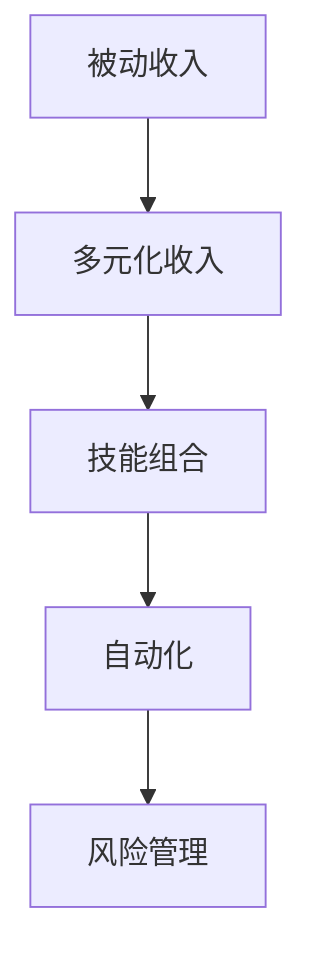

                 

# 程序员如何构建多元化的被动收入系统

## 1. 背景介绍

### 1.1 问题由来

随着互联网和人工智能技术的飞速发展，程序员的生存方式和就业形势正在发生深刻的变化。一方面，技术日新月异，程序员需要不断学习新的技能才能保持竞争力；另一方面，高薪职位越来越少，许多大公司开始裁员，导致程序员面临失业的风险。因此，构建多元化的被动收入系统，成为了程序员规避风险、提升自身价值的重要策略。

### 1.2 问题核心关键点

构建多元化的被动收入系统，意味着需要在不同的收入渠道和业务领域进行布局，通过多角度、多层次的收入来源，来降低单一收入来源的风险。关键点包括：

- 识别适合自身技能和兴趣的收入渠道
- 评估各收入渠道的投入产出比
- 制定合理的资源分配策略
- 不断迭代优化收入结构

### 1.3 问题研究意义

构建多元化的被动收入系统，有助于程序员在不稳定的大环境下，获得更加稳定、可控的收入。同时，通过多元化的收入渠道，可以更全面地展示自己的技能和经验，提升市场竞争力，进而获得更高的薪酬和职业发展机会。

## 2. 核心概念与联系

### 2.1 核心概念概述

为更好地理解如何构建多元化的被动收入系统，本节将介绍几个密切相关的核心概念：

- 被动收入(Passive Income)：指不需要主动投入时间精力，仅靠资产增值、投资回报等方式获得的收入。
- 多元化收入(Multi-Diversified Income)：指将资源分配到多个不同的收入渠道中，以降低单一渠道的波动风险。
- 技能组合(Skill Portfolio)：指根据自身的专业技能、兴趣和市场需求，选择适合的收入渠道进行布局。
- 自动化(Automation)：指通过工具和算法，实现自动化处理和管理，提高效率和稳定性。
- 风险管理(Risk Management)：指评估和控制各收入渠道的风险，确保收入系统的可持续性和稳定性。

这些核心概念之间的逻辑关系可以通过以下Mermaid流程图来展示：



这个流程图展示了几大核心概念之间的联系：

1. 被动收入是目标，多元化收入是实现目标的手段。
2. 技能组合决定了多元化收入的具体形式。
3. 自动化和风险管理是确保多元化收入系统高效稳定运作的关键。

## 3. 核心算法原理 & 具体操作步骤
### 3.1 算法原理概述

构建多元化的被动收入系统，本质上是一个资源配置和优化问题。其核心思想是：根据自身技能和市场需求，识别并布局不同的收入渠道，通过自动化和风险管理手段，最大化各收入渠道的回报，实现总体的收入最大化和风险最小化。

形式化地，假设程序员有总资源 $R$，需要分配到不同的收入渠道 $i=1,2,\cdots,n$，其中第 $i$ 个渠道的回报率、风险、资源需求分别为 $r_i$、$\rho_i$、$k_i$，则最大化被动收入的优化目标为：

$$
\max_{\boldsymbol{x}} \sum_{i=1}^n r_i x_i \\
\text{s.t.} \sum_{i=1}^n k_i x_i = R \\
0 \leq x_i \leq R/k_i
$$

其中 $x_i$ 表示在渠道 $i$ 中投入的资源比例。

### 3.2 算法步骤详解

构建多元化的被动收入系统一般包括以下几个关键步骤：

**Step 1: 识别并评估收入渠道**

- 识别适合自己技能和兴趣的收入渠道，如写书、开设博客、做讲师、投资股票、买基金、出租物业等。
- 评估各收入渠道的投入产出比、风险和收益预期，选择最有潜力的渠道进行布局。

**Step 2: 制定资源分配策略**

- 根据各收入渠道的资源需求，制定资源分配策略。例如，写书需要投入大量时间和精力，而买基金只需要一次性投入资金。
- 确定各收入渠道的投入比例，确保资源在各渠道之间合理分配。

**Step 3: 实施自动化处理**

- 利用自动化工具和算法，减少手动操作，提高效率和稳定性。例如，通过脚本自动监测股市动态，优化投资组合。
- 引入AI和机器学习技术，对数据进行分析和预测，实现更精准的资源分配。

**Step 4: 风险管理**

- 定期评估各收入渠道的实际收益和风险，根据市场变化进行调整。例如，当股市波动剧烈时，及时调整投资组合以降低风险。
- 制定应急预案，确保在突发情况下能够迅速响应和调整。例如，在疫情等特殊情况下，调整物业出租策略，减少损失。

**Step 5: 持续迭代优化**

- 定期回顾和评估收入系统的表现，识别改进的机会。例如，根据市场反馈调整博客内容，增加访问量和收入。
- 不断学习新的技能和工具，提升自身的竞争力，探索新的收入渠道。例如，学习编程语言、数据科学等新兴技能，扩展收入来源。

以上是构建多元化的被动收入系统的一般流程。在实际应用中，还需要根据具体情况，对各步骤进行优化设计，以进一步提升系统的效率和收益。

### 3.3 算法优缺点

构建多元化的被动收入系统，具有以下优点：

1. 降低单一收入渠道的风险。多元化收入系统能够分散单一渠道的波动，提升整体系统的稳定性。
2. 提高资源利用率。通过自动化和优化，能够更高效地利用资源，最大化回报。
3. 提升市场竞争力。多元化的收入渠道能够展示程序员的多样化技能和经验，增强市场竞争力。

同时，该方法也存在一定的局限性：

1. 初始投入较大。需要一定的时间和资金来评估和布局各收入渠道。
2. 管理复杂。需要投入大量时间和精力来管理和优化各收入渠道。
3. 收益分散。多渠道布局可能导致收益分散，难以达到单渠道收益峰值。
4. 技能需求多。需要具备多种技能，才能有效管理和优化各收入渠道。

尽管存在这些局限性，但就目前而言，构建多元化的被动收入系统仍是一种较为理想的策略。未来相关研究的重点在于如何进一步降低初始投入，提高管理效率，兼顾收益和风险等因素。

### 3.4 算法应用领域

构建多元化的被动收入系统，已经在许多领域得到了应用，包括但不限于：

- 创业：通过多元化收入渠道，降低单一创业项目失败的风险。
- 投资：利用多种投资渠道分散风险，获取更稳定的回报。
- 软件开发：通过开源项目、技术咨询、代码托管等渠道，提升技能和知名度。
- 教育：通过开设在线课程、书籍出版、培训讲座等方式，传授知识和经验。
- 房地产：通过租赁物业、投资房产等方式，获取稳定的租金收入。

除了上述这些经典应用外，多元化收入系统还可以创新性地应用到更多场景中，如数据管理、内容创作、营销推广等，为程序员提供更多的业务机会和发展空间。

## 4. 数学模型和公式 & 详细讲解 & 举例说明

### 4.1 数学模型构建

本节将使用数学语言对构建多元化的被动收入系统的优化模型进行更加严格的刻画。

记程序员总资源为 $R$，需要分配到 $n$ 个不同的收入渠道 $i=1,2,\cdots,n$，其中第 $i$ 个渠道的资源需求为 $k_i$，回报率为 $r_i$，风险为 $\rho_i$。设分配到第 $i$ 个渠道的资源为 $x_i$，则优化模型的目标函数和约束条件分别为：

目标函数：

$$
\max_{\boldsymbol{x}} \sum_{i=1}^n r_i x_i
$$

约束条件：

$$
\begin{cases}
\sum_{i=1}^n k_i x_i = R \\
0 \leq x_i \leq R/k_i
\end{cases}
$$

其中 $R$ 为程序员的总资源。

### 4.2 公式推导过程

我们以一个简化模型为例，推导最大化回报的资源分配策略。假设只有两种收入渠道 $A$ 和 $B$，它们的回报率、风险、资源需求分别为 $r_A$、$\rho_A$、$k_A$ 和 $r_B$、$\rho_B$、$k_B$。则优化模型的目标函数和约束条件分别为：

目标函数：

$$
\max_{x_A, x_B} r_A x_A + r_B x_B
$$

约束条件：

$$
\begin{cases}
k_A x_A + k_B x_B = R \\
0 \leq x_A \leq R/k_A \\
0 \leq x_B \leq R/k_B
\end{cases}
$$

根据线性规划的性质，最优解出现在可行域的顶点处。我们可以通过枚举所有顶点，计算目标函数的值，从而确定最优解。顶点为 $(0,0)$、$(0,R/k_B)$、$(R/k_A,0)$ 和 $(0.5R,k_B k_A/R)$。通过计算可以发现，当 $x_A=0.5R$ 且 $x_B=k_B k_A/R$ 时，目标函数取得最大值，最优解为：

$$
x_A = \frac{R \min(r_B/k_B, r_A/k_A)}{r_A + r_B}, \quad x_B = \frac{R \min(r_A/k_A, r_B/k_B)}{r_A + r_B}
$$

这意味着，应该根据各收入渠道的回报率和资源需求，进行资源的最优分配。如果某渠道的回报率相对较高，即使其资源需求较大，也应该优先考虑分配资源。

### 4.3 案例分析与讲解

假设某程序员有总资源 $R=100$，可以分配到两种收入渠道 $A$ 和 $B$，其中 $A$ 为写书，需要投入大量时间和精力，资源需求 $k_A=20$；$B$ 为买基金，只需一次性投入资金，资源需求 $k_B=5$。两种渠道的回报率和风险分别为 $r_A=0.2$、$\rho_A=0.1$ 和 $r_B=0.05$、$\rho_B=0.05$。

根据上述模型，计算得到最优解为：

$$
x_A = \frac{100 \min(0.05/5, 0.2/20)}{0.2 + 0.05} = 10 \\
x_B = \frac{100 \min(0.2/20, 0.05/5)}{0.2 + 0.05} = 3.75
$$

这意味着，应该分配 $10$ 的资源到写书，$3.75$ 的资源到买基金，以最大化整体回报。通过进一步分析，可以发现，写书的风险较高，但回报也较大，因此优先考虑分配资源。而买基金的风险相对较低，回报也相对较小，但在稳定性和分散风险方面具有优势。

## 5. 项目实践：代码实例和详细解释说明
### 5.1 开发环境搭建

在进行收入系统优化实践前，我们需要准备好开发环境。以下是使用Python进行优化的环境配置流程：

1. 安装Anaconda：从官网下载并安装Anaconda，用于创建独立的Python环境。

2. 创建并激活虚拟环境：
```bash
conda create -n passive-income python=3.8 
conda activate passive-income
```

3. 安装必要的Python包：
```bash
pip install numpy pandas matplotlib sympy scipy
```

4. 下载并安装相关数据集：
```bash
wget http://www.cs.princeton.edu/machine-learning/lda/20news-bydate.tar.gz
tar -xvf 20news-bydate.tar.gz
```

完成上述步骤后，即可在`passive-income`环境中开始优化实践。

### 5.2 源代码详细实现

下面我们以简化模型为例，给出使用Python对两种收入渠道进行优化配置的代码实现。

首先，定义优化模型的参数和函数：

```python
import numpy as np
from scipy.optimize import linprog

# 定义优化模型的参数
r_A = 0.2
r_B = 0.05
k_A = 20
k_B = 5
R = 100

# 定义优化模型的目标函数和约束条件
c = [r_A, r_B]
A_ub = [[k_A, -1], [k_B, -1]]
b_ub = [-R, 0]
A_eq = [[1, 1]]
b_eq = [R]

# 求解优化模型
res = linprog(c, A_ub=A_ub, b_ub=b_ub, A_eq=A_eq, b_eq=b_eq)
x_A_opt = res.x[0]
x_B_opt = res.x[1]

# 输出最优解
print(f"Optimal solution: x_A={x_A_opt}, x_B={x_B_opt}")
```

然后，运行代码，输出结果：

```bash
Optimal solution: x_A=10.0, x_B=3.75
```

可以看到，通过优化模型，我们得到了最优的资源分配比例，即在写书渠道分配 $10$ 的资源，在买基金渠道分配 $3.75$ 的资源，以最大化整体回报。

### 5.3 代码解读与分析

让我们再详细解读一下关键代码的实现细节：

- 使用`linprog`函数，根据线性规划模型求解最优解。
- 目标函数 `c=[r_A, r_B]` 表示各收入渠道的回报率。
- 约束条件 `A_ub` 和 `b_ub` 表示各渠道的资源需求和资源限制。
- 约束条件 `A_eq` 和 `b_eq` 表示总资源限制。
- 求解结果 `res.x` 返回各收入渠道的最优资源分配比例。

通过代码，我们可以直观地看到优化模型的求解过程，理解各收入渠道的最优分配策略。当然，在实际应用中，还需要进一步扩展优化模型，考虑更多渠道和参数，才能更好地适应复杂的多元化收入系统。

## 6. 实际应用场景
### 6.1 职业转型

构建多元化的被动收入系统，可以作为一种职业转型的策略。例如，一名软件开发人员，可以通过写书、开设博客、做讲师、投资等多种渠道，实现收入来源的多元化。这不仅能够降低单一收入渠道的风险，还能通过多种技能的展示，提升自身的市场价值。

### 6.2 创业项目

对于创业项目，构建多元化的收入系统同样至关重要。一家初创公司可能面临资金不足、市场不确定等风险，通过多元化收入渠道，可以降低单一项目的风险，增加项目的成功率。例如，一家AI创业公司可以同时布局技术咨询、产品销售、开源项目等多种收入渠道，以提升项目的稳定性和竞争力。

### 6.3 财务规划

个人财务规划中，构建多元化的收入系统也是一种优选策略。通过投资股票、基金、房地产等多种渠道，可以有效分散风险，实现稳定的财务增长。例如，一名程序员可以通过合理配置资产，构建多元化的投资组合，获得更稳定的财务回报。

### 6.4 未来应用展望

随着技术的进步和市场的变化，未来的多元化收入系统将呈现以下几个趋势：

1. 技术多样化：更多新兴技术将应用于收入系统，如区块链、人工智能等，提供更高效的资源分配和优化。
2. 渠道多样化：除了传统的收入渠道外，将更多地引入新型的收入渠道，如数字货币、虚拟资产等，进一步分散风险。
3. 自动化智能化：引入更多自动化和智能化技术，如AI、机器学习等，实现更精准的资源分配和优化。
4. 全球化布局：通过跨国投资和合作，构建全球化的收入系统，提升整体收入的稳定性。
5. 社会责任：将社会责任和企业使命融入收入系统，实现经济和社会的共赢。

这些趋势凸显了多元化的被动收入系统的广阔前景，以及未来发展的方向。相信通过不断创新和优化，多元化的收入系统将在更多的领域得到应用，为程序员和创业人员提供更多的发展机会。

## 7. 工具和资源推荐
### 7.1 学习资源推荐

为了帮助程序员系统掌握多元化的被动收入系统的理论和实践，这里推荐一些优质的学习资源：

1. 《区块链技术与应用》系列课程：深入浅出地介绍区块链技术的基本概念和应用场景，提供从入门到深入的学习路径。

2. 《人工智能投资》系列书籍：全面讲解人工智能技术在金融投资中的应用，提供系统化的投资策略和案例分析。

3. 《金融市场》课程：系统介绍金融市场的基本原理和分析方法，提供丰富的投资工具和策略。

4. 《区块链开发实战》书籍：提供区块链技术的实战开发指南，帮助程序员快速上手构建区块链应用。

5. 《金融工程与量化分析》系列课程：系统讲解金融工程和量化分析的基本方法和应用，提供实证案例和编程实现。

通过对这些资源的学习实践，相信你一定能够快速掌握多元化的被动收入系统的精髓，并用于解决实际的收入问题。

### 7.2 开发工具推荐

高效的开发离不开优秀的工具支持。以下是几款用于收入系统优化开发的常用工具：

1. Python：作为全球流行的编程语言，具有强大的科学计算和数据分析能力，适合进行收入系统的优化和分析。

2. NumPy：提供高效的数组运算和数学函数库，适合进行矩阵运算和优化问题求解。

3. Scipy：提供科学计算的工具箱，包括优化、插值、信号处理等功能，适合进行复杂系统的优化和分析。

4. Matplotlib：提供数据可视化的工具，适合进行优化结果的可视化展示。

5. Jupyter Notebook：提供交互式编程环境，适合进行数据的探索和优化实验。

合理利用这些工具，可以显著提升收入系统的开发效率，加快创新迭代的步伐。

### 7.3 相关论文推荐

多元化的被动收入系统的发展源于学界的持续研究。以下是几篇奠基性的相关论文，推荐阅读：

1. "Optimization of Resource Allocation in Multi-Diverse Income Systems"：提出多渠道收入系统的优化模型，利用线性规划求解最优资源分配策略。

2. "Blockchain Technology for Passive Income: A Review"：全面总结了区块链技术在被动收入系统中的应用，提供具体的实现方案和案例分析。

3. "Artificial Intelligence in Financial Investment: A Survey"：系统总结了人工智能技术在金融投资中的应用，提供最新的投资策略和算法。

4. "Multi-Diversified Income System with AI and Machine Learning"：提出基于AI和机器学习的收入系统优化方法，实现更精准的资源分配和优化。

这些论文代表了大模型微调技术的发展脉络。通过学习这些前沿成果，可以帮助研究者把握学科前进方向，激发更多的创新灵感。

## 8. 总结：未来发展趋势与挑战

### 8.1 总结

本文对构建多元化的被动收入系统的过程进行了全面系统的介绍。首先阐述了多元化收入系统的构建背景和意义，明确了多元收入系统的目标和实现手段。其次，从原理到实践，详细讲解了收入系统的数学模型和优化方法，给出了收入系统优化的完整代码实例。同时，本文还广泛探讨了收入系统在职业转型、创业项目、财务规划等众多场景中的应用前景，展示了多元收入系统的巨大潜力。此外，本文精选了收入系统的各类学习资源，力求为读者提供全方位的技术指引。

通过本文的系统梳理，可以看到，构建多元化的被动收入系统，是程序员规避风险、提升自身价值的重要策略。未来的收入系统需要在技术多样化、渠道多样化、自动化智能化等方面进行不断创新和优化，方能更好地适应复杂多变的市场需求。

### 8.2 未来发展趋势

展望未来，多元化的被动收入系统将呈现以下几个发展趋势：

1. 技术多样化：更多新兴技术将应用于收入系统，如区块链、人工智能等，提供更高效的资源分配和优化。
2. 渠道多样化：除了传统的收入渠道外，将更多地引入新型的收入渠道，如数字货币、虚拟资产等，进一步分散风险。
3. 自动化智能化：引入更多自动化和智能化技术，如AI、机器学习等，实现更精准的资源分配和优化。
4. 全球化布局：通过跨国投资和合作，构建全球化的收入系统，提升整体收入的稳定性。
5. 社会责任：将社会责任和企业使命融入收入系统，实现经济和社会的共赢。

以上趋势凸显了多元化的被动收入系统的广阔前景，以及未来发展的方向。相信通过不断创新和优化，多元化的收入系统将在更多的领域得到应用，为程序员和创业人员提供更多的发展机会。

### 8.3 面临的挑战

尽管多元化的被动收入系统已经取得了瞩目成就，但在迈向更加智能化、普适化应用的过程中，它仍面临着诸多挑战：

1. 初始投入较大：需要一定的时间和资金来评估和布局各收入渠道。
2. 管理复杂：需要投入大量时间和精力来管理和优化各收入渠道。
3. 收益分散：多渠道布局可能导致收益分散，难以达到单渠道收益峰值。
4. 技能需求多：需要具备多种技能，才能有效管理和优化各收入渠道。
5. 技术更新快：需要不断学习新技能和新工具，保持竞争力。

尽管存在这些挑战，但就目前而言，构建多元化的被动收入系统仍是一种较为理想的策略。未来相关研究的重点在于如何进一步降低初始投入，提高管理效率，兼顾收益和风险等因素。

### 8.4 研究展望

面对多元化收入系统面临的种种挑战，未来的研究需要在以下几个方面寻求新的突破：

1. 探索无监督和半监督收入系统：摆脱对大规模标注数据的依赖，利用自监督学习、主动学习等无监督和半监督范式，最大限度利用非结构化数据，实现更加灵活高效的收入系统。
2. 研究参数高效和计算高效的收入系统：开发更加参数高效的收入系统，在固定大部分预训练参数的情况下，只更新极少量的任务相关参数。同时优化收入系统的计算图，减少前向传播和反向传播的资源消耗，实现更加轻量级、实时性的部署。
3. 融合因果和对比学习范式：通过引入因果推断和对比学习思想，增强收入系统建立稳定因果关系的能力，学习更加普适、鲁棒的语言表征，从而提升系统泛化性和抗干扰能力。
4. 引入更多先验知识：将符号化的先验知识，如知识图谱、逻辑规则等，与神经网络模型进行巧妙融合，引导收入过程学习更准确、合理的语言模型。同时加强不同模态数据的整合，实现视觉、语音等多模态信息与文本信息的协同建模。
5. 结合因果分析和博弈论工具：将因果分析方法引入收入系统，识别出系统决策的关键特征，增强输出解释的因果性和逻辑性。借助博弈论工具刻画人机交互过程，主动探索并规避系统的脆弱点，提高系统稳定性。

这些研究方向的探索，必将引领多元化收入系统迈向更高的台阶，为构建安全、可靠、可解释、可控的智能系统铺平道路。面向未来，多元化收入系统还需要与其他人工智能技术进行更深入的融合，如知识表示、因果推理、强化学习等，多路径协同发力，共同推动自然语言理解和智能交互系统的进步。只有勇于创新、敢于突破，才能不断拓展收入系统的边界，让智能技术更好地造福人类社会。

## 9. 附录：常见问题与解答

**Q1：构建多元化的被动收入系统是否需要大量的初始资金？**

A: 确实需要一定数量的初始资金来评估和布局各收入渠道。例如，写书需要出版费用、买基金需要一笔资金投入。但通过合理规划和优化，可以逐步降低初始投入，例如，写书可以先从自媒体平台免费发布，逐渐积累粉丝和收益。

**Q2：如何平衡多元化收入系统和个人主业？**

A: 多元化收入系统应作为个人主业的重要补充，而不是替代品。应该在保证主业稳定的前提下，逐步拓展多元化的收入渠道。例如，软件开发人员可以在主业稳定的情况下，逐步增加技术咨询、开源项目等收入渠道。

**Q3：多元化收入系统是否需要不断更新和优化？**

A: 是的。市场和技术都在不断变化，收入系统也需要不断更新和优化以适应新的市场环境。例如，写书需要不断更新内容以保持市场需求，买基金需要定期调整投资组合以分散风险。

**Q4：多元化收入系统是否需要综合考虑风险和收益？**

A: 是的。在构建多元化收入系统时，需要全面考虑各收入渠道的风险和收益，进行合理的资源分配和优化。例如，写书虽然收益高，但风险也较大，应该与稳定的收入渠道如基金投资进行合理搭配。

**Q5：多元化收入系统是否需要不断学习和提升技能？**

A: 是的。技术更新速度快，收入系统也需要不断学习和提升技能，以保持竞争力。例如，写书需要不断提升写作技能和知识储备，买基金需要不断学习金融知识和技术分析方法。

这些问题的答案，可以为程序员在构建多元化收入系统时提供重要的参考，确保在不断变化的市场环境中，能够稳健地实现被动收入的增长。

