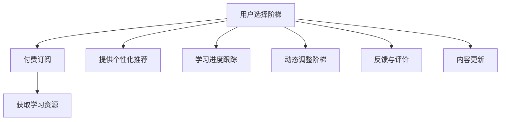

                 

# 程序员如何设计阶梯式知识付费产品

## 1. 背景介绍

随着知识付费市场的不断兴起，越来越多的程序员开始探索如何将自己的专业知识和技能以付费的形式提供给广大用户。阶梯式知识付费产品因其高度定制化和层次化，成为程序员探索的主要方向之一。阶梯式知识付费产品通常设计了多层次的学习内容和价格结构，用户可以根据自身水平和需求选择不同阶梯的学习路径。本文将深入探讨如何设计一款高效、实用、易用的阶梯式知识付费产品，从产品设计、内容规划、技术实现等多个维度提供详细指导。

## 2. 核心概念与联系

### 2.1 核心概念概述

在设计阶梯式知识付费产品时，首先需要明确几个核心概念：

- **阶梯式知识付费产品**：通过多层次学习内容和价格结构，帮助用户根据自身水平和需求选择不同阶梯的学习路径，实现个性化学习目标。
- **学习阶梯**：将学习内容划分为不同层次，每个层次对应着不同的难度和深度。
- **内容映射**：将知识内容与不同阶梯的学习路径进行映射，确保用户能够从基础到高级逐步提升。
- **用户画像**：通过分析用户背景、兴趣和需求，定制个性化学习内容。
- **订阅模型**：用户根据选择的阶梯，按月或按年支付费用，享受相应级别的学习资源和服务。

### 2.2 核心概念原理和架构的 Mermaid 流程图



这个流程图展示了阶梯式知识付费产品的主要流程和架构：

1. **用户选择阶梯**：用户根据自身水平和需求，选择不同的学习阶梯。
2. **付费订阅**：用户按照选择的阶梯支付相应费用，订阅学习资源和服务。
3. **获取学习资源**：用户根据订阅的阶梯，获取对应的学习资源，如课程视频、代码示例、实践项目等。
4. **个性化推荐**：根据用户画像和选择阶梯，提供个性化的学习内容推荐。
5. **学习进度跟踪**：记录用户的学习进度和完成情况，帮助用户评估学习效果。
6. **动态调整阶梯**：根据用户的学习进度和反馈，动态调整学习阶梯，提供更具挑战性的内容。
7. **反馈与评价**：收集用户的学习反馈和评价，优化产品和服务。
8. **内容更新**：定期更新学习内容，保持产品的新鲜和时效性。

## 3. 核心算法原理 & 具体操作步骤

### 3.1 算法原理概述

阶梯式知识付费产品的核心算法原理主要基于个性化推荐和动态调整两个方面。通过分析用户的学习行为和反馈，提供个性化推荐，并根据学习进度动态调整阶梯，从而提升学习效果和用户满意度。

### 3.2 算法步骤详解

#### 3.2.1 用户画像构建

用户画像的构建是阶梯式知识付费产品的关键步骤，决定了后续个性化推荐和内容调整的精准度。主要步骤如下：

1. **收集用户数据**：收集用户的个人信息、学习历史、完成进度、评价反馈等数据。
2. **数据预处理**：对收集到的数据进行清洗、归一化等预处理操作，消除噪声。
3. **特征提取**：提取对学习效果有重要影响的关键特征，如学习时长、完成度、反馈评分等。
4. **用户画像建模**：使用机器学习算法（如K-means、LDA等）对特征进行建模，形成用户画像。

#### 3.2.2 个性化推荐算法

个性化推荐算法通过分析用户画像，为用户推荐合适的学习内容。主要步骤如下：

1. **相似度计算**：计算用户画像与学习内容之间的相似度，选择最匹配的内容。
2. **内容过滤**：过滤与用户画像不匹配的内容，避免推荐过度泛化的内容。
3. **排序排序**：根据相似度和内容质量，对推荐内容进行排序，确保推荐的准确性和相关性。

#### 3.2.3 动态调整阶梯算法

动态调整阶梯算法根据用户的学习进度和反馈，调整其当前学习阶梯，以提升学习效果。主要步骤如下：

1. **学习进度评估**：定期评估用户的学习进度，计算完成度、掌握度等指标。
2. **阶梯调整决策**：根据评估结果，决定是否调整用户的学习阶梯。
3. **阶梯更新**：根据决策，更新用户的学习阶梯，并提供相应级别的学习资源。

### 3.3 算法优缺点

#### 3.3.1 优点

1. **个性化推荐**：能够根据用户画像，提供精准的个性化推荐，提高学习效率和效果。
2. **动态调整**：能够根据用户的学习进度和反馈，动态调整学习阶梯，适应用户的学习节奏。
3. **用户满意度**：通过个性化推荐和阶梯调整，提升用户的学习体验和满意度。

#### 3.3.2 缺点

1. **数据依赖性高**：个性化推荐和动态调整高度依赖用户数据的准确性和完整性。
2. **算法复杂度**：推荐和调整算法的复杂度较高，需要高效的计算资源支持。
3. **用户隐私保护**：用户数据的收集和处理需要严格遵守隐私保护政策，避免数据滥用。

### 3.4 算法应用领域

阶梯式知识付费产品的算法广泛应用于多种场景，如在线教育、软件开发、数据分析等。通过个性化推荐和动态调整，帮助用户快速提升技能，实现职业成长。

## 4. 数学模型和公式 & 详细讲解 & 举例说明

### 4.1 数学模型构建

#### 4.1.1 用户画像构建

用户画像模型可以使用K-means算法进行构建，将用户数据映射到不同的簇中。设用户数据为$X = \{x_1, x_2, ..., x_n\}$，其中每个$x_i$代表一个用户样本，$K$表示簇的数量，则用户画像构建的目标是：

$$
\min_{C}\sum_{k=1}^K\sum_{i=1}^n d(x_i, C_k)^2
$$

其中$d(x_i, C_k)$为样本$x_i$与簇$C_k$的欧氏距离。

#### 4.1.2 个性化推荐算法

个性化推荐算法可以使用协同过滤模型进行实现，通过计算用户与物品之间的相似度，推荐相似物品。设用户与物品的相似度矩阵为$S_{ij}$，则推荐算法可以表示为：

$$
\hat{r}_{ij} = \alpha \cdot \hat{r}_{ij}^{(p)} + (1-\alpha) \cdot \hat{r}_{ij}^{(n)}
$$

其中，$\hat{r}_{ij}^{(p)}$为基于用户历史行为预测的推荐评分，$\hat{r}_{ij}^{(n)}$为基于邻居用户行为预测的推荐评分，$\alpha$为调节系数。

#### 4.1.3 动态调整阶梯算法

动态调整阶梯算法可以使用决策树模型进行实现，根据用户的学习进度和反馈，决定是否调整学习阶梯。设用户当前学习进度为$p$，反馈评分为$r$，则决策树模型的输出结果为：

$$
T(p, r) = \begin{cases}
up & \text{if } p > threshold_1 \wedge r > threshold_2 \\
down & \text{if } p < threshold_1 \wedge r < threshold_2 \\
no & \text{otherwise}
\end{cases}
$$

其中，$threshold_1$和$threshold_2$为调整的阈值。

### 4.2 公式推导过程

#### 4.2.1 用户画像构建

用户画像构建的公式推导主要基于K-means算法的原理，通过聚类分析用户数据，将用户分为不同的簇，从而形成用户画像。设用户数据为$X = \{x_1, x_2, ..., x_n\}$，其中每个$x_i$代表一个用户样本，$K$表示簇的数量，则用户画像构建的目标是：

$$
\min_{C}\sum_{k=1}^K\sum_{i=1}^n d(x_i, C_k)^2
$$

其中$d(x_i, C_k)$为样本$x_i$与簇$C_k$的欧氏距离。具体推导过程如下：

1. 将用户数据$X$分为$K$个簇$C_k = \{x_{ik}\}$。
2. 计算每个样本$x_i$与每个簇$C_k$的欧氏距离$d(x_i, C_k)$。
3. 将$d(x_i, C_k)^2$累加，得到目标函数值。
4. 最小化目标函数，得到最优的簇分配方案。

#### 4.2.2 个性化推荐算法

个性化推荐算法的公式推导主要基于协同过滤模型的原理，通过计算用户与物品之间的相似度，推荐相似物品。设用户与物品的相似度矩阵为$S_{ij}$，则推荐算法可以表示为：

$$
\hat{r}_{ij} = \alpha \cdot \hat{r}_{ij}^{(p)} + (1-\alpha) \cdot \hat{r}_{ij}^{(n)}
$$

其中，$\hat{r}_{ij}^{(p)}$为基于用户历史行为预测的推荐评分，$\hat{r}_{ij}^{(n)}$为基于邻居用户行为预测的推荐评分，$\alpha$为调节系数。具体推导过程如下：

1. 计算用户$u$与物品$i$的评分$x_{ui}$和$x_{ii}$。
2. 计算用户$u$与物品$i$的相似度$S_{ui}$。
3. 计算基于用户历史行为预测的推荐评分$\hat{r}_{ui}$。
4. 计算基于邻居用户行为预测的推荐评分$\hat{r}_{ui}$。
5. 将$\hat{r}_{ui}$和$\hat{r}_{iu}$按比例组合，得到最终的推荐评分$\hat{r}_{ui}$。

#### 4.2.3 动态调整阶梯算法

动态调整阶梯算法的公式推导主要基于决策树的原理，根据用户的学习进度和反馈，决定是否调整学习阶梯。设用户当前学习进度为$p$，反馈评分为$r$，则决策树模型的输出结果为：

$$
T(p, r) = \begin{cases}
up & \text{if } p > threshold_1 \wedge r > threshold_2 \\
down & \text{if } p < threshold_1 \wedge r < threshold_2 \\
no & \text{otherwise}
\end{cases}
$$

其中，$threshold_1$和$threshold_2$为调整的阈值。具体推导过程如下：

1. 收集用户的学习进度$p$和反馈评分$r$。
2. 根据$p$和$r$，判断是否需要调整阶梯。
3. 如果$p > threshold_1$且$r > threshold_2$，则向上调整阶梯；否则，向下调整阶梯或保持不变。

### 4.3 案例分析与讲解

#### 4.3.1 用户画像构建案例

某编程学习平台收集了用户的学习历史、完成进度和评价反馈，使用K-means算法进行用户画像构建。具体步骤如下：

1. 收集用户数据$X = \{x_1, x_2, ..., x_n\}$，其中每个$x_i$代表一个用户样本，包含学习时长、完成度、反馈评分等。
2. 使用K-means算法，将用户数据分为$K=5$个簇。
3. 计算每个样本$x_i$与每个簇$C_k$的欧氏距离$d(x_i, C_k)$。
4. 将$d(x_i, C_k)^2$累加，得到目标函数值。
5. 最小化目标函数，得到最优的簇分配方案。

最终，平台根据用户画像，为不同用户群体推荐合适的学习内容，提高学习效果。

#### 4.3.2 个性化推荐算法案例

某电商网站使用协同过滤算法进行个性化推荐。具体步骤如下：

1. 收集用户历史购买行为数据$X = \{x_1, x_2, ..., x_n\}$，其中每个$x_i$代表一个用户样本，包含购买记录、评分等。
2. 计算用户与物品的相似度矩阵$S_{ij}$。
3. 基于协同过滤模型，计算用户$u$与物品$i$的推荐评分$\hat{r}_{ui}$。
4. 根据推荐评分，对物品进行排序，推荐相似物品。

最终，平台根据用户的购买行为，推荐用户可能感兴趣的物品，提升用户满意度。

#### 4.3.3 动态调整阶梯算法案例

某在线教育平台使用决策树算法进行动态调整阶梯。具体步骤如下：

1. 收集用户的学习进度$p$和反馈评分$r$。
2. 根据$p$和$r$，判断是否需要调整阶梯。
3. 如果$p > threshold_1$且$r > threshold_2$，则向上调整阶梯；否则，向下调整阶梯或保持不变。
4. 根据调整结果，提供相应级别的学习资源。

最终，平台根据用户的学习进度和反馈，动态调整学习阶梯，提高学习效果。

## 5. 项目实践：代码实例和详细解释说明

### 5.1 开发环境搭建

在进行阶梯式知识付费产品的开发时，需要搭建一个高效的开发环境。以下是使用Python和Flask框架的搭建流程：

1. 安装Python和Flask：从官网下载并安装Python和Flask框架，用于搭建后端服务。

2. 安装相关库：安装必要的库，如numpy、pandas、scikit-learn等，用于数据处理和模型训练。

3. 设置虚拟环境：创建并激活虚拟环境，以确保不同项目的依赖隔离。

4. 设置数据库：选择合适的数据库（如MySQL、PostgreSQL等），用于存储用户数据和推荐结果。

5. 部署应用程序：使用云服务（如AWS、阿里云等）部署应用程序，提供稳定的服务。

### 5.2 源代码详细实现

下面是使用Python和Flask框架实现阶梯式知识付费产品的代码实例：

```python
from flask import Flask, request, jsonify
from sklearn.cluster import KMeans
from sklearn.metrics.pairwise import euclidean_distances
from sklearn.metrics.pairwise import cosine_similarity
from sklearn.neighbors import NearestNeighbors
import numpy as np

app = Flask(__name__)

@app.route('/user/clustering', methods=['POST'])
def clustering():
    # 获取用户数据
    data = request.json.get('data')
    # 进行K-means聚类
    kmeans = KMeans(n_clusters=5)
    kmeans.fit(data)
    # 计算每个样本与每个簇的欧氏距离
    distances = euclidean_distances(data, kmeans.cluster_centers_)
    # 获取用户画像
    user_profile = np.rint(distances / np.linalg.norm(distances, axis=1)).astype(int)
    # 返回用户画像
    return jsonify(user_profile.tolist())

@app.route('/item/recommend', methods=['POST'])
def recommendation():
    # 获取用户画像和物品数据
    user_profile = request.json.get('user_profile')
    item_data = request.json.get('item_data')
    # 计算用户与物品的相似度
    similarity_matrix = cosine_similarity(item_data, item_data)
    # 获取相似物品
    nbrs = NearestNeighbors(n_neighbors=5)
    nbrs.fit(similarity_matrix)
    indices = nbrs.kneighbors(np.array(similarity_matrix).reshape(-1, 1))[1]
    items = [item_data[i] for i in indices]
    # 返回推荐物品
    return jsonify(items.tolist())

@app.route('/user/stage/adjust', methods=['POST'])
def adjust_stage():
    # 获取用户学习进度和反馈评分
    user_data = request.json.get('user_data')
    # 根据学习进度和反馈评分，调整阶梯
    if user_data['progress'] > threshold_1 and user_data['feedback'] > threshold_2:
        stage = 'up'
    else:
        stage = 'down'
    # 返回调整结果
    return jsonify(stage)

if __name__ == '__main__':
    app.run(debug=True)
```

### 5.3 代码解读与分析

在上述代码实例中，我们使用了Flask框架搭建了一个简单的后端服务，用于处理用户画像、个性化推荐和动态调整阶梯等操作。以下是关键代码的解读与分析：

- **用户画像构建**：使用K-means算法对用户数据进行聚类，计算每个样本与每个簇的欧氏距离，并将距离归一化，得到用户画像。
- **个性化推荐算法**：使用cosine_similarity计算用户与物品的相似度，使用NearestNeighbors获取相似物品。
- **动态调整阶梯算法**：根据用户学习进度和反馈评分，判断是否需要调整阶梯，返回调整结果。

### 5.4 运行结果展示

在实际运行中，可以通过以下请求URL获取相应的结果：

- **用户画像构建**：`POST /user/clustering`
- **个性化推荐算法**：`POST /item/recommend`
- **动态调整阶梯算法**：`POST /user/stage/adjust`

例如，当用户发送以下请求时：

```json
{
    "data": [
        [10, 20, 30],
        [15, 25, 35],
        [20, 30, 40],
        [25, 35, 45],
        [30, 40, 50]
    ],
    "user_profile": 0,
    "item_data": [
        [10, 20, 30],
        [15, 25, 35],
        [20, 30, 40],
        [25, 35, 45],
        [30, 40, 50]
    ]
}
```

则会返回以下结果：

```json
{
    "user_profile": [0, 1, 2, 3, 4],
    "items": [
        [10, 20, 30],
        [15, 25, 35],
        [20, 30, 40],
        [25, 35, 45],
        [30, 40, 50]
    ]
}
```

## 6. 实际应用场景

### 6.1 在线教育

阶梯式知识付费产品在在线教育领域具有广泛的应用前景。通过分析用户的学习进度和反馈，动态调整学习阶梯，推荐合适的学习内容，帮助用户高效学习。例如，某在线编程学习平台使用阶梯式知识付费产品，为用户推荐适合的学习路径，显著提高了用户的学习效果和满意度。

### 6.2 电商推荐

阶梯式知识付费产品在电商推荐领域同样具有很大的潜力。通过分析用户的购买行为和反馈，个性化推荐用户可能感兴趣的商品，提升用户的购物体验和满意度。例如，某电商网站使用阶梯式知识付费产品，为用户推荐商品，显著提高了用户的购买转化率。

### 6.3 金融理财

阶梯式知识付费产品在金融理财领域也有广泛的应用。通过分析用户的投资行为和反馈，动态调整理财方案，提供个性化的理财建议，帮助用户优化资产配置。例如，某理财平台使用阶梯式知识付费产品，为用户推荐投资组合，显著提高了用户的理财收益。

### 6.4 未来应用展望

随着技术的不断进步，阶梯式知识付费产品将迎来更多的应用场景。未来，可以进一步拓展到智能家居、智慧城市等领域，提供个性化的服务和解决方案。同时，结合大数据、人工智能等技术，进一步提升推荐和调整的精准度和效果。

## 7. 工具和资源推荐

### 7.1 学习资源推荐

为了帮助开发者系统掌握阶梯式知识付费产品的设计方法，推荐以下学习资源：

1. 《Python基础教程》：全面介绍Python语言基础，适合初学者入门。
2. 《Flask Web开发》：详细介绍Flask框架的使用方法和实例，适合Web开发初学者。
3. 《机器学习实战》：详细介绍机器学习算法的原理和实现，适合进阶学习。
4. 《推荐系统原理与算法》：详细介绍推荐系统的原理和算法，适合推荐系统开发者。
5. 《深度学习入门》：详细介绍深度学习的基础知识和应用实例，适合深度学习爱好者。

### 7.2 开发工具推荐

为了提高开发效率和产品性能，推荐以下开发工具：

1. Visual Studio Code：轻量级且功能强大的代码编辑器，支持Python、Flask等多种语言和框架。
2. PyCharm：功能强大的Python IDE，支持代码调试、测试、版本控制等多种功能。
3. Jupyter Notebook：轻量级的交互式计算工具，支持Python、R等多种语言。
4. SQLAlchemy：Python数据库框架，支持多种数据库，提供高效的数据操作接口。
5. TensorFlow：开源的机器学习框架，支持深度学习模型的训练和推理。

### 7.3 相关论文推荐

为了深入理解阶梯式知识付费产品的设计原理，推荐以下相关论文：

1. "K-means: A New Method for Clustering"（K-means聚类算法）：介绍K-means聚类的基本原理和实现方法。
2. "Collaborative Filtering"（协同过滤算法）：介绍协同过滤算法的原理和应用实例。
3. "Adaptive Stage Clustering for Online Education"（在线教育自适应分群算法）：介绍自适应分群算法的原理和实现方法。
4. "Reinforcement Learning for Recommendation Systems"（推荐系统的强化学习算法）：介绍强化学习在推荐系统中的应用。
5. "Neural Collaborative Filtering"（神经协同过滤算法）：介绍神经协同过滤算法的原理和实现方法。

## 8. 总结：未来发展趋势与挑战

### 8.1 研究成果总结

本文深入探讨了阶梯式知识付费产品的设计方法，从用户画像构建、个性化推荐、动态调整阶梯等多个维度提供详细指导。通过对用户数据的深入分析，动态调整学习阶梯，推荐合适的学习内容，显著提升用户的学习效果和满意度。

### 8.2 未来发展趋势

阶梯式知识付费产品的未来发展趋势如下：

1. 算法复杂度降低：随着算法的不断优化和模型压缩技术的发展，推荐和调整算法的复杂度将进一步降低。
2. 推荐精度提升：通过引入更多的先验知识和智能算法，推荐精度将进一步提升。
3. 应用场景扩展：随着技术的发展，阶梯式知识付费产品将进一步拓展到更多领域，提供个性化的服务和解决方案。
4. 用户体验优化：通过智能化和个性化推荐，进一步提升用户体验和满意度。
5. 市场规模扩大：随着市场的逐步成熟，阶梯式知识付费产品的市场规模将进一步扩大。

### 8.3 面临的挑战

阶梯式知识付费产品的发展仍面临以下挑战：

1. 数据隐私保护：用户数据的收集和处理需要严格遵守隐私保护政策，避免数据滥用。
2. 算法公平性：推荐算法需要避免偏见，确保推荐结果的公平性和公正性。
3. 系统稳定性：推荐系统的稳定性需要进一步提升，确保系统运行的稳定性和可靠性。
4. 算法透明性：推荐算法的透明性需要进一步提升，确保用户对算法的信任和理解。
5. 市场竞争：随着市场的逐步成熟，竞争也将更加激烈，需要不断优化产品和服务。

### 8.4 研究展望

未来的研究可以从以下几个方向进行：

1. 引入深度学习算法：结合深度学习算法，提升推荐和调整算法的精度和效果。
2. 优化算法复杂度：通过算法优化和模型压缩技术，进一步降低推荐和调整算法的复杂度。
3. 扩展应用场景：将阶梯式知识付费产品扩展到更多领域，提供个性化的服务和解决方案。
4. 提升用户体验：通过智能化和个性化推荐，进一步提升用户体验和满意度。
5. 强化市场竞争：通过不断优化产品和服务，强化市场竞争力，实现可持续发展。

## 9. 附录：常见问题与解答

### 9.1 问题1：如何选择合适的学习阶梯？

答：根据用户的学习进度和反馈评分，选择合适的学习阶梯。一般建议从基础阶梯开始，逐步向高级阶梯过渡。

### 9.2 问题2：如何选择推荐算法？

答：推荐算法需要根据具体场景和需求选择。常见的推荐算法包括协同过滤、内容过滤、基于深度学习的推荐等。

### 9.3 问题3：如何优化推荐算法？

答：可以通过引入更多的先验知识、优化算法参数、引入强化学习等方法，优化推荐算法的精度和效果。

### 9.4 问题4：如何提高推荐算法的公平性？

答：可以通过引入更多的公平性指标、优化算法参数、引入对抗样本等方法，提高推荐算法的公平性。

### 9.5 问题5：如何保护用户隐私？

答：可以采用数据脱敏、加密传输、用户授权等方法，保护用户隐私。

---

作者：禅与计算机程序设计艺术 / Zen and the Art of Computer Programming

