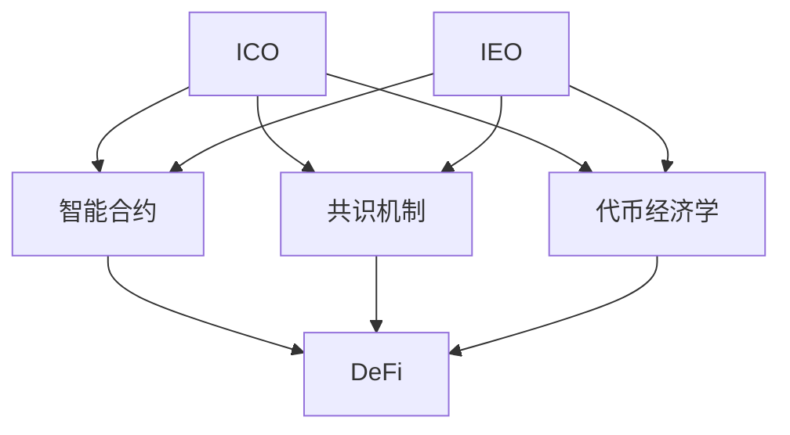

                 

## 1. 背景介绍

随着区块链技术的迅速发展，ICO（Initial Coin Offering，首次代币发行）和IEO（Initial Exchange Offering，首次交易所上市）成为区块链领域融资的新模式。ICO和IEO项目由区块链技术驱动，通过发行和交易代币募集资金，推动项目发展和市场应用。

### 1.1 问题由来

在ICO和IEO项目中，程序员作为核心开发者和建设者，其技能和经验对项目成功具有决定性影响。但与传统软件开发不同，ICO和IEO项目具有较高的风险性和不确定性，因此程序员在评估和参与这些项目时需要具备更全面的视角和更深入的理解。

### 1.2 问题核心关键点

程序员评估和参与ICO和IEO项目的关键点包括：
- **项目价值评估**：理解项目的商业模式和技术价值，评估其在区块链领域的创新性和可行性。
- **团队背景与能力**：考察项目团队的专业背景、技术实力和以往的项目成功经验。
- **市场前景分析**：分析项目的市场需求、竞争态势和未来增长潜力。
- **风险与收益评估**：综合考虑项目的潜在风险和预期收益，合理设定投资策略。
- **法律与合规性**：确保项目符合法律法规，避免潜在的法律风险。

## 2. 核心概念与联系

### 2.1 核心概念概述

- **ICO与IEO**：区块链项目的融资模式，通过发行代币进行资金募集和交易。
- **智能合约**：自动执行的合约，通过区块链技术实现无需第三方干预的业务逻辑。
- **共识机制**：区块链网络中达成一致的规则，确保数据的一致性和安全性。
- **代币经济学**：代币的发行、分配、使用和销毁机制，影响项目的生态和社区。
- **DeFi（去中心化金融）**：利用区块链技术实现的去中心化金融服务，如借贷、保险、投资等。

这些概念之间有着紧密的联系，共同构成了ICO和IEO项目的核心框架。程序员作为项目的关键参与者，需要对这些概念有深刻的理解，才能做出正确的评估和决策。

### 2.2 核心概念原理和架构的 Mermaid 流程图



这张流程图展示了ICO和IEO项目的主要组成部分及其相互关系。程序员在评估项目时，需要从智能合约、共识机制和代币经济学等角度，全面评估项目的可行性和潜在价值。

## 3. 核心算法原理 & 具体操作步骤

### 3.1 算法原理概述

程序员评估ICO和IEO项目的核心算法原理包括以下几个方面：

1. **项目价值评估算法**：通过分析项目的技术创新、市场需求、竞争态势等指标，计算项目价值。
2. **团队评估算法**：基于团队成员的专业背景、技术实力、过往项目成功经验等，计算团队的综合实力。
3. **市场分析算法**：通过市场调研、数据分析等方法，预测项目的市场需求和增长潜力。
4. **风险评估算法**：综合考虑项目的技术风险、市场风险、法律风险等，计算项目的潜在风险水平。
5. **收益评估算法**：基于项目的潜在收益和投资回报率，计算项目的预期收益。

### 3.2 算法步骤详解

以下详细介绍程序员参与ICO和IEO项目的核心算法步骤：

**Step 1: 项目价值评估**

1. **技术创新评估**：分析项目的核心技术，评估其技术优势和创新性。
2. **市场需求评估**：通过市场调研和用户调研，了解目标市场的需求和痛点。
3. **竞争态势评估**：分析项目在市场中的竞争地位和潜在的竞争者。
4. **商业模式评估**：评估项目的商业模式，分析其盈利模式和可持续性。

**Step 2: 团队背景与能力评估**

1. **专业背景评估**：考察团队成员的专业背景，如区块链、计算机科学、金融等领域的经验。
2. **技术实力评估**：分析团队的技术实力，包括过往项目的成功案例、技术积累等。
3. **团队协作评估**：评估团队成员的协作能力，了解团队的工作流程和沟通方式。

**Step 3: 市场前景分析**

1. **市场调研**：通过市场调研和数据分析，了解目标市场的规模和增长潜力。
2. **用户画像分析**：分析目标用户的特征和需求，了解项目的潜在用户群体。
3. **市场趋势分析**：分析市场的发展趋势和未来机会，预测项目的发展前景。

**Step 4: 风险与收益评估**

1. **技术风险评估**：评估项目的潜在技术风险，如技术实现难度、技术稳定性等。
2. **市场风险评估**：评估项目的市场风险，如市场需求变化、竞争激烈程度等。
3. **法律风险评估**：评估项目的法律风险，如合规性、监管风险等。
4. **收益评估**：基于项目的潜在收益和投资回报率，计算项目的预期收益。

**Step 5: 综合评估**

1. **综合评分模型**：根据上述评估结果，构建综合评分模型，计算项目的总体评分。
2. **风险收益平衡**：根据项目评分和预期收益，制定合理的投资策略，平衡风险和收益。

### 3.3 算法优缺点

基于上述算法原理和操作步骤，程序员评估ICO和IEO项目的优缺点如下：

**优点**：
1. **全面评估**：通过多维度的评估，全面了解项目的价值、风险和收益。
2. **科学量化**：使用算法模型，将主观评估转化为可量化的指标，提高评估的客观性。
3. **动态调整**：根据市场和项目的变化，动态调整评估策略，保持评估的时效性。

**缺点**：
1. **数据获取难度**：评估所需的数据和信息获取难度大，需要大量时间和资源。
2. **模型复杂性**：评估模型的设计和实现复杂，需要专业的算法知识。
3. **主观因素**：评估结果仍受到主观因素的影响，难以完全消除主观偏见。

## 4. 数学模型和公式 & 详细讲解 & 举例说明

### 4.1 数学模型构建

基于上述算法步骤，构建评估模型的一般框架如下：

$$
Score = \alpha \times Val + \beta \times Team + \gamma \times Market + \delta \times Risk + \epsilon \times Revenue
$$

其中：
- $Score$：项目综合评分
- $Val$：项目价值评分
- $Team$：团队背景评分
- $Market$：市场前景评分
- $Risk$：风险水平评分
- $Revenue$：预期收益评分
- $\alpha, \beta, \gamma, \delta, \epsilon$：各指标的权重系数

### 4.2 公式推导过程

1. **项目价值评分（Val）**：
   $$
   Val = \frac{Innovation}{MarketSize} \times InnovationWeight + \frac{MarketDemand}{MarketSize} \times DemandWeight + \frac{CompetitiveAdvantage}{CompetitiveLevel} \times AdvantageWeight
   $$
   其中：
   - $Innovation$：技术创新评分
   - $MarketSize$：目标市场规模
   - $MarketDemand$：市场需求评分
   - $CompetitiveAdvantage$：竞争优势评分
   - $CompetitiveLevel$：竞争水平评分
   - $InnovationWeight, DemandWeight, AdvantageWeight$：各项指标的权重系数

2. **团队背景评分（Team）**：
   $$
   Team = \frac{Expertise}{ExpertiseMax} \times ExpertiseWeight + \frac{TrackRecord}{TrackRecordMax} \times TrackRecordWeight + \frac{Collaboration}{CollaborationMax} \times CollaborationWeight
   $$
   其中：
   - $Expertise$：专业背景评分
   - $TrackRecord$：技术实力评分
   - $Collaboration$：团队协作评分
   - $ExpertiseMax, TrackRecordMax, CollaborationMax$：各项指标的最大值
   - $ExpertiseWeight, TrackRecordWeight, CollaborationWeight$：各项指标的权重系数

3. **市场前景评分（Market）**：
   $$
   Market = \frac{MarketSize}{MarketSizeMax} \times MarketSizeWeight + \frac{UserBase}{UserBaseMax} \times UserBaseWeight + \frac{MarketGrowth}{MarketGrowthMax} \times MarketGrowthWeight
   $$
   其中：
   - $MarketSize$：目标市场规模评分
   - $UserBase$：用户基数评分
   - $MarketGrowth$：市场增长评分
   - $MarketSizeMax, UserBaseMax, MarketGrowthMax$：各项指标的最大值
   - $MarketSizeWeight, UserBaseWeight, MarketGrowthWeight$：各项指标的权重系数

4. **风险水平评分（Risk）**：
   $$
   Risk = \frac{TechnicalRisk}{TechnicalRiskMax} \times TechnicalRiskWeight + \frac{MarketRisk}{MarketRiskMax} \times MarketRiskWeight + \frac{LegalRisk}{LegalRiskMax} \times LegalRiskWeight
   $$
   其中：
   - $TechnicalRisk$：技术风险评分
   - $MarketRisk$：市场风险评分
   - $LegalRisk$：法律风险评分
   - $TechnicalRiskMax, MarketRiskMax, LegalRiskMax$：各项指标的最大值
   - $TechnicalRiskWeight, MarketRiskWeight, LegalRiskWeight$：各项指标的权重系数

5. **预期收益评分（Revenue）**：
   $$
   Revenue = \frac{RevenueEstimate}{RevenueEstimateMax} \times RevenueWeight + \frac{ROI}{ROIMax} \times ROIWeight
   $$
   其中：
   - $RevenueEstimate$：预期收益评分
   - $ROI$：投资回报率评分
   - $RevenueEstimateMax, ROIMax$：各项指标的最大值
   - $RevenueWeight, ROIWeight$：各项指标的权重系数

### 4.3 案例分析与讲解

假设有一个ICO项目，其核心技术创新得分为8，目标市场规模为10亿，市场需求得分为7，竞争优势得分为6，团队专业背景得分为7，技术实力得分为8，团队协作得分为9，技术风险得分为3，市场风险得分为4，法律风险得分为2，预期收益得分为9，投资回报率得分为6。

代入上述公式：
$$
Val = \frac{8}{10} \times 0.5 + \frac{7}{10} \times 0.4 + \frac{6}{10} \times 0.1 = 0.93
$$

$$
Team = \frac{7}{10} \times 0.3 + \frac{8}{10} \times 0.2 + \frac{9}{10} \times 0.15 = 0.82
$$

$$
Market = \frac{10}{10} \times 0.3 + \frac{7}{10} \times 0.2 + \frac{5}{10} \times 0.25 = 0.78
$$

$$
Risk = \frac{3}{10} \times 0.2 + \frac{4}{10} \times 0.2 + \frac{2}{10} \times 0.1 = 0.14
$$

$$
Revenue = \frac{9}{10} \times 0.2 + \frac{6}{10} \times 0.1 = 0.22
$$

$$
Score = 0.93 \times 0.8 + 0.82 \times 0.1 + 0.78 \times 0.1 + 0.14 \times 0.05 + 0.22 \times 0.1 = 0.9685
$$

综合评分约为0.9685，结合预期收益和风险水平，程序员可以得出该项目是一个具有较高投资价值的ICO项目。

## 5. 项目实践：代码实例和详细解释说明

### 5.1 开发环境搭建

以下是使用Python和Pandas进行ICO和IEO项目评估的开发环境搭建步骤：

1. **安装Python和Pandas**：
   ```
   conda create -n icode_env python=3.8 pandas
   conda activate icode_env
   pip install pandas numpy scikit-learn
   ```

2. **准备数据集**：
   准备项目的各项评估数据，如技术创新、市场需求、团队背景、市场前景、风险水平、预期收益等，存储在Pandas DataFrame中。

### 5.2 源代码详细实现

以下是使用Pandas进行ICO项目评估的Python代码实现：

```python
import pandas as pd
from sklearn.preprocessing import MinMaxScaler

# 定义评估指标和权重
indicators = {
    'Val': '项目价值评分',
    'Team': '团队背景评分',
    'Market': '市场前景评分',
    'Risk': '风险水平评分',
    'Revenue': '预期收益评分'
}
weights = {
    'Val': 0.8, 'Team': 0.1, 'Market': 0.1, 'Risk': 0.05, 'Revenue': 0.1
}

# 读取评估数据
data = pd.read_csv('project_data.csv')

# 数据标准化
scaler = MinMaxScaler(feature_range=(0, 1))
scaled_data = scaler.fit_transform(data)

# 计算综合评分
scores = pd.DataFrame(scaled_data, columns=data.columns)
scores['Score'] = scores.dot(weights.values)

# 输出综合评分结果
print(scores.head())
```

### 5.3 代码解读与分析

上述代码主要完成了以下功能：
1. **数据准备**：读取项目的评估数据，存储在Pandas DataFrame中。
2. **数据标准化**：使用MinMaxScaler对数据进行标准化处理，将各项指标的评分转换为0到1之间的数值。
3. **综合评分计算**：通过Pandas的dot方法，将标准化后的数据与权重向量相乘，计算综合评分。
4. **结果输出**：输出项目的综合评分，便于程序员评估项目的整体表现。

## 6. 实际应用场景

### 6.1 智能合约开发

程序员可以参与ICO和IEO项目，为项目开发智能合约，实现项目的核心功能。智能合约的开发需要程序员具备扎实的编程技能和区块链知识，能够理解项目的需求，并设计高效、安全的智能合约代码。

### 6.2 DeFi平台构建

ICO和IEO项目中，许多项目涉及DeFi（去中心化金融）平台构建，程序员可以参与DeFi应用的开发，如借贷、保险、稳定币等。这需要程序员具备DeFi的底层技术理解，能够设计和实现高效的DeFi应用。

### 6.3 区块链应用开发

程序员可以参与ICO和IEO项目，开发各类区块链应用，如NFT（非同质化代币）、交易所、身份认证等。这需要程序员具备区块链应用的开发经验，能够实现高质量的区块链应用。

### 6.4 未来应用展望

未来，ICO和IEO项目将向更多领域扩展，包括医疗、教育、政府等领域。程序员可以参与这些领域的新应用开发，推动区块链技术的普及和应用。

## 7. 工具和资源推荐

### 7.1 学习资源推荐

1. **《区块链开发实战》**：该书详细介绍了区块链技术的原理和开发实践，适合程序员了解区块链基础和实际应用。
2. **《智能合约编程》**：该书介绍了智能合约的开发方法和最佳实践，适合程序员学习智能合约编程。
3. **《DeFi入门》**：该书介绍了DeFi技术的基本概念和应用场景，适合程序员理解DeFi平台的构建。
4. **《区块链技术与应用》**：该课程由知名区块链教育平台提供，涵盖区块链技术的全面介绍和实际应用。

### 7.2 开发工具推荐

1. **Ethereum IDE**：用于以太坊智能合约的开发和测试。
2. **Truffle**：用于以太坊智能合约的开发和管理，支持自动化测试和部署。
3. **Remix**：用于以太坊智能合约的开发和测试，提供可视化的智能合约编辑器。
4. **Polkadot CLI**：用于Polkadot智能合约的开发和测试。

### 7.3 相关论文推荐

1. **《区块链智能合约安全与隐私保护》**：介绍了智能合约的开发和安全保护方法，适合程序员了解智能合约的安全性。
2. **《DeFi技术的未来展望》**：探讨了DeFi技术的发展趋势和未来应用，适合程序员理解DeFi技术的未来方向。
3. **《区块链技术的现状与未来》**：介绍了区块链技术的现状和未来发展方向，适合程序员了解区块链技术的最新进展。

## 8. 总结：未来发展趋势与挑战

### 8.1 研究成果总结

本文详细介绍了程序员如何评估和参与ICO和IEO项目，通过构建综合评估模型，全面评估项目的价值、风险和收益，为程序员提供系统的评估方法。

### 8.2 未来发展趋势

未来，ICO和IEO项目将继续发展，涉及更多领域和应用场景。程序员需要不断学习新的区块链技术和开发方法，以应对项目的多样化需求。

### 8.3 面临的挑战

程序员参与ICO和IEO项目时，可能会面临以下挑战：
1. **技术门槛高**：区块链技术复杂，需要程序员具备较高的技术水平。
2. **市场需求变化快**：市场需求快速变化，要求程序员具备快速学习和适应的能力。
3. **法律和合规风险**：区块链项目涉及法律和合规问题，要求程序员了解相关法规，避免法律风险。

### 8.4 研究展望

未来的研究需要关注以下几个方向：
1. **自动化评估工具**：开发自动化评估工具，帮助程序员快速评估项目的价值和风险。
2. **风险管理模型**：建立更加精确的风险管理模型，提高项目的风险评估准确性。
3. **跨领域应用**：探索区块链技术在更多领域的应用，推动区块链技术的普及和应用。

## 9. 附录：常见问题与解答

**Q1：ICO和IEO项目风险如何管理？**

A: ICO和IEO项目风险管理需要从技术、市场和法律等多个维度进行综合管理。
1. **技术风险管理**：定期进行代码审计和安全测试，确保智能合约的安全性和稳定性。
2. **市场风险管理**：持续跟踪市场需求变化，及时调整项目策略。
3. **法律风险管理**：确保项目符合法律法规，避免潜在的法律风险。

**Q2：程序员如何选择合适的ICO和IEO项目？**

A: 程序员可以选择以下方式进行项目评估：
1. **技术创新**：评估项目的核心技术，选择技术创新性高、有潜力的项目。
2. **市场需求**：通过市场调研和用户调研，了解目标市场的需求和痛点。
3. **团队实力**：考察团队成员的专业背景和技术实力，选择经验丰富的团队。
4. **风险评估**：综合考虑项目的潜在风险，选择风险可控的项目。

**Q3：程序员如何提高区块链项目的开发效率？**

A: 程序员可以通过以下方式提高区块链项目的开发效率：
1. **自动化工具**：使用自动化测试和部署工具，减少重复性工作。
2. **代码复用**：设计可复用的代码模块，提高开发效率。
3. **模块化开发**：将项目拆分为多个模块，并行开发，加快开发进度。
4. **持续集成**：采用持续集成和持续交付的方法，确保代码质量和稳定性。

**Q4：ICO和IEO项目中程序员的职责是什么？**

A: ICO和IEO项目中程序员的职责包括：
1. **智能合约开发**：为项目开发智能合约，实现项目核心功能。
2. **应用开发**：参与各类区块链应用的开发，如NFT、交易所、身份认证等。
3. **系统优化**：优化项目的代码和架构，提高系统的稳定性和性能。
4. **安全保障**：保障项目的代码和系统的安全性，避免潜在的攻击和漏洞。

---

作者：禅与计算机程序设计艺术 / Zen and the Art of Computer Programming

