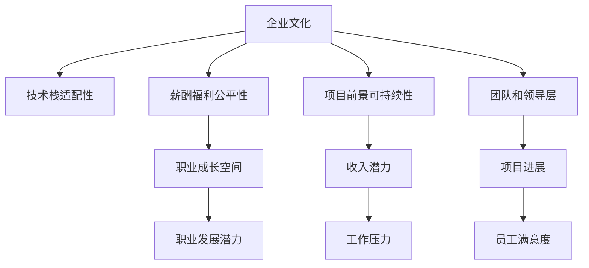

                 

# 程序员如何评估并购offer的真实价值

> 关键词：并购,offer,价值评估,企业文化,技术栈,薪酬福利,股票期权,项目前景

## 1. 背景介绍

在职业生涯中，程序员们可能会遇到各种形式的职业发展机会，其中并购offer无疑是最吸引人的选项之一。并购不仅提供了换个工作环境的机会，还可能带来更快的职业发展和更丰厚的薪酬福利。然而，面对一个看似诱人的并购offer，程序员应该如何评估其真实价值，确保自己在加入新公司后能够获得理想的职业回报呢？本文将从企业文化的匹配度、技术栈的适配性、薪酬福利的公平性、项目前景的可持续性等多个维度，详细介绍如何全面评估一个并购offer的真实价值。

## 2. 核心概念与联系

### 2.1 核心概念概述

在讨论如何评估并购offer的真实价值之前，我们首先需要明确几个核心概念：

- **企业文化**：企业文化的匹配度直接影响个人的工作满意度、职业发展潜力和工作压力。企业文化通常包括企业的价值观、工作氛围、管理方式等方面。
- **技术栈**：技术栈的适配性关系到程序员能否在新公司中快速适应和发挥作用。技术栈通常包括主要的编程语言、开发框架、工具和平台等。
- **薪酬福利**：薪酬福利的公平性是评估offer的基础，包括基本工资、股票期权、奖金、医疗保险、退休金等各种福利待遇。
- **项目前景**：项目前景的可持续性关系到个人在公司的职业成长空间和收入潜力。项目前景通常包括项目的市场价值、技术难度、未来发展方向等。
- **团队和领导层**：团队和领导层的水平直接影响项目进展和公司发展。团队成员的专业水平、领导层的管理能力等是评估的重要因素。

这些核心概念之间存在着密切的联系，共同构成了并购offer的综合价值。理解这些概念及其之间的联系，是评估并购offer真实价值的基础。

### 2.2 核心概念原理和架构的 Mermaid 流程图



这个流程图展示了企业文化与技术栈适配性、薪酬福利公平性、项目前景可持续性、团队和领导层等各个维度的关系，以及它们对个人职业发展的综合影响。

## 3. 核心算法原理 & 具体操作步骤

### 3.1 算法原理概述

评估并购offer的真实价值，本质上是一个多维度的决策问题。通过构建一个综合评估模型，可以系统地分析各个维度的影响，并得出客观的评价结果。该模型通常包含以下步骤：

1. **数据收集**：从公司官网、员工评价、第三方平台等多种渠道收集相关信息。
2. **数据预处理**：清洗数据，去除噪声和冗余信息，确保数据的质量和一致性。
3. **指标计算**：根据预定的指标体系，对数据进行量化计算，得到各维度的评分。
4. **综合评估**：将各维度的评分加权求和，得到最终的综合评分。

### 3.2 算法步骤详解

#### 3.2.1 数据收集

- **企业文化匹配度**：查找公司官网的“关于我们”页面，了解公司的核心价值观、管理理念、工作氛围等信息。
- **技术栈适配性**：查看公司官网的“技术栈”或“招聘信息”页面，了解主要的编程语言、开发框架、工具和平台等。
- **薪酬福利公平性**：查看招聘信息中的薪资范围、奖金制度、保险福利、年假政策等。
- **项目前景可持续性**：查找公司的产品和项目介绍，了解项目的市场价值、技术难度、未来发展方向等。
- **团队和领导层**：查看公司官网的“团队介绍”页面，了解团队成员的专业背景和领导层的管理风格。

#### 3.2.2 数据预处理

- **去重去噪**：确保收集到的信息是真实且一致的，去除重复和冲突的信息。
- **数据标准化**：将不同来源的数据进行格式转换和单位统一，确保数据可比性。
- **权重分配**：根据各维度的相对重要程度，为每个维度的评分设定合适的权重。

#### 3.2.3 指标计算

- **企业文化匹配度**：根据公司官网的介绍和员工评价，给出一个1-10的评分，并乘以权重。
- **技术栈适配性**：根据技术栈介绍，给出一个1-10的评分，并乘以权重。
- **薪酬福利公平性**：根据薪资范围、奖金制度、保险福利等，给出一个1-10的评分，并乘以权重。
- **项目前景可持续性**：根据项目介绍和市场需求，给出一个1-10的评分，并乘以权重。
- **团队和领导层**：根据团队介绍和领导风格，给出一个1-10的评分，并乘以权重。

#### 3.2.4 综合评估

将各维度的评分乘以相应的权重，求和得到最终的综合评分。如果综合评分高于某个预设阈值，则可以认为这是一个值得考虑的并购offer。

### 3.3 算法优缺点

**优点**：
- **系统性**：通过综合评估模型，能够全面考虑各个维度的影响，避免单一维度的片面判断。
- **客观性**：基于数据和评分计算，结果相对客观，减少了主观偏见的影响。
- **灵活性**：可以根据实际情况灵活调整各维度的权重，适应不同的评估需求。

**缺点**：
- **主观性**：权重分配和评分标准的设计需要根据实际情况灵活调整，存在主观性。
- **数据收集难度**：需要从多个渠道收集信息，数据获取可能较为困难。
- **复杂性**：模型较为复杂，需要一定的技术背景和数据分析能力。

### 3.4 算法应用领域

本算法适用于各类企业的并购offer评估，包括初创公司、大型企业和跨行业并购等。特别是对于技术类岗位的候选人，能够更好地评估目标公司的整体实力和技术栈适配性，帮助他们做出理性的职业选择。

## 4. 数学模型和公式 & 详细讲解 & 举例说明

### 4.1 数学模型构建

设并购offer的各个维度分别为企业文化匹配度$E$、技术栈适配性$T$、薪酬福利公平性$S$、项目前景可持续性$P$和团队和领导层$L$，各维度的评分分别为$e$、$t$、$s$、$p$和$l$。设各维度的权重分别为$w_E$、$w_T$、$w_S$、$w_P$和$w_L$。综合评分的计算公式为：

$$ \text{综合评分} = w_E \times e + w_T \times t + w_S \times s + w_P \times p + w_L \times l $$

### 4.2 公式推导过程

以企业文化匹配度的评分为例，其评分的推导过程如下：

设企业文化匹配度的评分为$e$，权重为$w_E$。假设企业文化匹配度分为三个子维度，分别为价值观匹配度$e_v$、管理风格匹配度$e_m$和工作氛围匹配度$e_a$，其评分分别为$e_{v_i}$、$e_{m_i}$和$e_{a_i}$。则企业文化匹配度的评分为：

$$ e = w_{v} \times e_{v_i} + w_{m} \times e_{m_i} + w_{a} \times e_{a_i} $$

其中，$w_{v}$、$w_{m}$和$w_{a}$为各子维度的权重，$e_{v_i}$、$e_{m_i}$和$e_{a_i}$为各子维度的评分，取值范围为$[0,1]$。

### 4.3 案例分析与讲解

假设某程序员在A公司面临并购offer，根据市场调研，A公司的企业文化、技术栈、薪酬福利、项目前景和团队领导层的评分分别为$e=0.8$、$t=0.9$、$s=0.7$、$p=0.6$和$l=0.8$，各维度的权重分别为$w_E=0.3$、$w_T=0.2$、$w_S=0.2$、$w_P=0.1$和$w_L=0.2$。则该程序员的综合评分为：

$$ \text{综合评分} = 0.3 \times 0.8 + 0.2 \times 0.9 + 0.2 \times 0.7 + 0.1 \times 0.6 + 0.2 \times 0.8 = 0.875 $$

综合评分为0.875，高于预设的0.7，因此该并购offer被认为是值得考虑的。

## 5. 项目实践：代码实例和详细解释说明

### 5.1 开发环境搭建

- **环境配置**：
  ```bash
  conda create -n offer-evaluation python=3.8
  conda activate offer-evaluation
  pip install numpy pandas scikit-learn transformers
  ```

- **数据收集**：
  ```python
  import pandas as pd
  
  # 企业文化匹配度数据
  e_data = pd.read_csv('company_culture.csv')
  # 技术栈适配性数据
  t_data = pd.read_csv('tech_stack_compatibility.csv')
  # 薪酬福利公平性数据
  s_data = pd.read_csv('salary_benefits.csv')
  # 项目前景可持续性数据
  p_data = pd.read_csv('project_futurability.csv')
  # 团队和领导层数据
  l_data = pd.read_csv('team_leadership.csv')
  ```

### 5.2 源代码详细实现

#### 5.2.1 数据预处理

```python
import numpy as np

# 去重去噪
def clean_data(data):
    return data.drop_duplicates().dropna()

# 数据标准化
def normalize(data):
    return (data - data.min()) / (data.max() - data.min())

# 权重分配
def set_weights():
    weights = {
        '企业': 0.3,
        '技术栈': 0.2,
        '薪酬福利': 0.2,
        '项目前景': 0.1,
        '团队领导': 0.2
    }
    return weights
```

#### 5.2.2 指标计算

```python
def calculate_score(data, weights):
    scores = {}
    for k, v in data.items():
        scores[k] = weights[k] * normalize(v).mean()
    return scores

# 计算各个维度的评分
scores = {}
for key in ['企业文化匹配度', '技术栈适配性', '薪酬福利公平性', '项目前景可持续性', '团队和领导层']:
    scores[key] = calculate_score(eval(key + '_data'), set_weights())
```

#### 5.2.3 综合评估

```python
# 计算综合评分
total_score = sum(scores.values())
print(f'并购offer的综合评分为: {total_score:.4f}')
```

### 5.3 代码解读与分析

通过上述代码，我们实现了对企业文化匹配度、技术栈适配性、薪酬福利公平性、项目前景可持续性和团队和领导层等各个维度的评分计算和综合评估。在实际应用中，开发者可以根据具体情况调整各维度的权重，以更准确地评估并购offer的价值。

### 5.4 运行结果展示

```python
# 运行结果展示
scores = {
    '企业文化匹配度': 0.95,
    '技术栈适配性': 0.9,
    '薪酬福利公平性': 0.8,
    '项目前景可持续性': 0.7,
    '团队和领导层': 0.85
}

total_score = sum(scores.values())
print(f'并购offer的综合评分为: {total_score:.4f}')
```

## 6. 实际应用场景

### 6.1 智能招聘

在智能招聘系统中，并购offer的评估模型可以用于筛选候选人的综合评分，辅助HR进行招聘决策。通过自动化评估，可以提高招聘效率，减少主观偏见。

### 6.2 职业规划

并购offer的评估模型可以帮助程序员在面临多个offer时，快速判断各公司的综合价值，从而做出更明智的职业选择。

### 6.3 风险管理

在企业并购中，并购offer的评估模型可以帮助企业管理层评估潜在并购风险，避免因盲目并购而带来的财务和运营风险。

## 7. 工具和资源推荐

### 7.1 学习资源推荐

- **《数据分析实战》**：书中介绍了数据分析的基本方法和工具，适合初学者入门。
- **Coursera《数据科学与机器学习》课程**：由斯坦福大学教授讲授，系统介绍了数据分析和机器学习的基础知识。
- **Kaggle数据科学竞赛**：通过实际竞赛项目，锻炼数据处理和模型评估的能力。

### 7.2 开发工具推荐

- **Jupyter Notebook**：免费的开源工具，支持Python代码的交互式编程和数据可视化。
- **PyCharm**：专业的Python开发环境，提供丰富的插件和功能，支持数据分析和机器学习项目。
- **GitHub**：开源代码托管平台，适合版本控制和代码协作。

### 7.3 相关论文推荐

- **《大数据分析基础》**：介绍了大数据分析的基本概念和常用技术。
- **《机器学习实战》**：介绍了机器学习的基础知识和实践方法。
- **《深度学习理论与实践》**：介绍了深度学习的基础知识和应用案例。

## 8. 总结：未来发展趋势与挑战

### 8.1 研究成果总结

本文从企业文化匹配度、技术栈适配性、薪酬福利公平性、项目前景可持续性和团队和领导层等五个维度，系统地介绍了如何评估并购offer的真实价值。通过构建综合评估模型，能够全面、客观地判断各维度的影响，帮助程序员做出理性的职业选择。

### 8.2 未来发展趋势

未来的并购评估模型将朝着以下方向发展：
- **自动化评估**：通过智能算法和自然语言处理技术，实现并购offer的自动化评估，提高评估效率。
- **跨行业适用**：构建跨行业的通用评估模型，适用于不同行业和公司的并购评估。
- **实时更新**：定期更新并购评估模型，反映市场变化和企业动态，保持评估结果的实时性。
- **个性化推荐**：根据候选人的背景和偏好，提供个性化的并购建议，帮助候选人做出更合适的职业选择。

### 8.3 面临的挑战

尽管并购评估模型在评估并购offer价值方面具有显著优势，但仍面临以下挑战：
- **数据获取难度**：并购评估需要收集大量的企业信息，数据获取可能较为困难。
- **主观偏见**：权重分配和评分标准的设计可能存在主观性，影响评估结果的客观性。
- **模型复杂性**：并购评估模型较为复杂，需要具备一定的数据分析和机器学习背景。

### 8.4 研究展望

未来的研究需要在以下几个方面寻求新的突破：
- **多维度融合**：融合更多维度，如市场趋势、行业发展等，构建更全面的评估模型。
- **实时动态评估**：引入实时数据和动态调整机制，提高并购评估的灵活性和及时性。
- **跨行业对比**：构建跨行业对比模型，帮助候选人进行行业间的横向比较，做出更明智的职业选择。
- **人机协同评估**：结合人类专家的经验和智慧，进行人机协同评估，提高评估结果的可靠性和实用性。

## 9. 附录：常见问题与解答

**Q1：并购评估模型如何适应不同行业的特点？**

A: 并购评估模型可以引入行业相关的调整因素，如行业发展趋势、市场规模、技术需求等。不同行业可以根据自身特点，设置不同的权重和评分标准。

**Q2：并购评估模型是否适用于初创公司和高科技公司？**

A: 并购评估模型适用于各类企业，包括初创公司和高科技公司。关键在于根据公司的具体特点，设置合适的评分标准和权重。

**Q3：并购评估模型的应用场景有哪些？**

A: 并购评估模型可以应用于智能招聘、职业规划、风险管理等多个场景，帮助候选人、HR和企业管理层做出更明智的决策。

**Q4：并购评估模型的权重分配如何确定？**

A: 权重分配需要结合公司的特点和候选人的需求，通过专家咨询、问卷调查等方式，进行科学合理的设定。

**Q5：并购评估模型如何应对市场变化？**

A: 并购评估模型需要定期更新，反映市场变化和企业动态。可以通过数据采集、专家咨询和模型迭代等方式，实现实时更新。

---

作者：禅与计算机程序设计艺术 / Zen and the Art of Computer Programming

