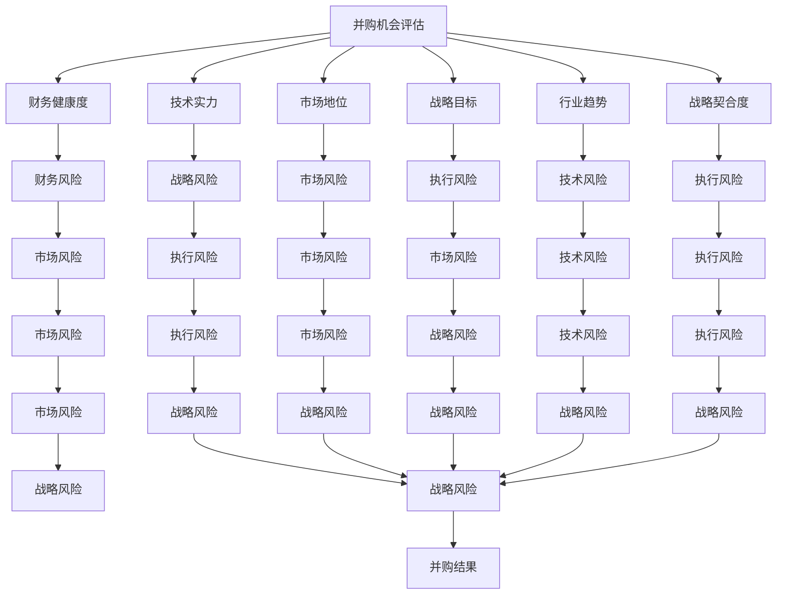

                 

# 程序员如何评估并购机会与公司出售时机

## 1. 背景介绍

### 1.1 问题由来
并购（M&A）与公司出售（Exit）是初创公司成长道路上常见的重大决策，这两个决策往往涉及公司战略规划、财务状况、团队管理等方面。评估并购机会与公司出售时机，需要充分考虑多个维度的信息，才能做出明智的决策。对于程序员，尤其是创始团队的程序员而言，理解并掌握这些决策的评估方法尤为重要，以便在关键时刻作出正确的决策。

### 1.2 问题核心关键点
评估并购机会与公司出售时机，核心在于理解不同阶段公司的价值变化，明确当前与目标公司之间的契合度，同时评估财务和战略风险。这一过程涉及到对公司自身技术实力、市场地位、财务健康度、团队组织结构等综合因素的评估。此外，还应关注外部市场环境、行业趋势、竞争格局等宏观因素。

## 2. 核心概念与联系

### 2.1 核心概念概述

为更好地理解评估并购机会与公司出售时机的方法，本节将介绍几个关键概念及其相互关系：

- 并购（M&A）：指一家公司通过收购另一家公司或其资产来扩展业务的活动。常见形式包括收购和合并。
- 公司出售（Exit）：指公司通过被其他公司收购、公开上市或进行私募股权投资的方式退出市场，获取现金收益。
- 战略目标：公司运营的核心目标，包括市场地位、技术研发、收入增长等。
- 财务健康度：公司财务报表的稳定性、现金流、盈利能力等。
- 技术实力：公司拥有的技术专利、知识产权、核心技术团队等。
- 市场地位：公司在所处行业中的竞争力和市场份额。
- 行业趋势：公司所处行业的发展方向和未来趋势。
- 战略契合度：公司与并购或出售目标之间的战略一致性和互补性。
- 财务风险：收购或出售交易中的财务风险，包括债务负担、现金流压力等。
- 战略风险：收购或出售可能对公司长期战略发展带来的风险。

这些概念之间的逻辑关系可以通过以下Mermaid流程图来展示：



这个流程图展示了评估并购机会与公司出售时机时涉及的主要概念及其相互关系。并购机会的评估涉及对公司财务健康度、技术实力、市场地位、战略目标等多个方面的考量，同时需要评估财务风险、战略风险、市场风险等。

## 3. 核心算法原理 & 具体操作步骤
### 3.1 算法原理概述

评估并购机会与公司出售时机的方法主要是通过量化和定性分析，结合财务数据、市场信息、战略规划等综合因素进行判断。核心算法包括财务分析、战略评估、市场分析等。

#### 3.1.1 财务分析

财务分析是评估并购机会与公司出售时机的基础。通过分析公司的资产负债表、利润表、现金流量表等财务报表，可以评估公司的财务健康度和盈利能力。常见的财务指标包括：

- 净利润率（Net Profit Margin）：净利润与总收入之比，反映了公司的盈利能力。
- 毛利率（Gross Margin）：毛利与总收入之比，反映了公司控制成本的能力。
- 负债率（Debt-to-Equity Ratio）：负债总额与所有者权益总额之比，反映了公司的财务杠杆。
- 自由现金流（Free Cash Flow）：公司可用于投资的现金减去资本支出后的净现金流量，反映了公司的资金流动性。

#### 3.1.2 战略评估

战略评估涉及对公司长期战略目标的评估，包括市场定位、技术研发、业务扩展等。通过分析公司的长期发展规划和短期执行策略，可以判断公司的战略契合度。

#### 3.1.3 市场分析

市场分析包括对公司所处行业的市场规模、增长潜力、竞争格局等进行分析。通过分析行业趋势和市场环境，可以评估公司的市场地位和潜在发展空间。

### 3.2 算法步骤详解

基于以上核心算法，评估并购机会与公司出售时机一般包括以下几个步骤：

#### 步骤1：收集数据

- 收集公司的财务报表、业务计划、市场报告等相关信息。
- 收集目标公司的财务报表、业务计划、市场报告等相关信息。

#### 步骤2：财务分析

- 对公司的财务报表进行详细分析，计算并评估关键财务指标。
- 对目标公司的财务报表进行详细分析，计算并评估关键财务指标。

#### 步骤3：战略评估

- 分析公司的战略目标、执行策略、业务扩展计划等。
- 分析目标公司的战略目标、执行策略、业务扩展计划等。
- 评估公司的战略契合度，判断是否有足够的资源和能力支持目标公司的运营和发展。

#### 步骤4：市场分析

- 分析公司所处行业的市场规模、增长潜力、竞争格局等。
- 分析目标公司所处行业的市场规模、增长潜力、竞争格局等。
- 评估公司与目标公司在市场地位上的契合度。

#### 步骤5：风险评估

- 评估并购或出售交易中的财务风险，包括债务负担、现金流压力等。
- 评估并购或出售交易中的战略风险，包括对公司长期战略发展的潜在影响。
- 评估并购或出售交易中的市场风险，包括市场变化对公司运营的影响。

#### 步骤6：评估与决策

- 综合财务分析、战略评估、市场分析等结果，进行综合评估。
- 根据评估结果，做出是否进行并购或出售的决策。

### 3.3 算法优缺点

评估并购机会与公司出售时机的方法具有以下优点：

- 综合性强：通过财务分析、战略评估、市场分析等多维度的综合评估，能够更全面地理解公司的价值和潜在风险。
- 量化可操作：通过量化指标和模型，可以系统地评估公司与目标公司的契合度，做出更客观的决策。

同时，该方法也存在一定的局限性：

- 数据依赖度高：评估结果高度依赖于所收集数据的准确性和完整性，可能存在信息不对称的风险。
- 市场环境复杂：市场环境变化迅速，难以完全预测，可能影响评估结果的准确性。
- 战略风险不易评估：公司战略目标的评估需要深入理解公司的业务模式和未来规划，可能存在主观判断的偏差。

### 3.4 算法应用领域

评估并购机会与公司出售时机的方法广泛应用于以下领域：

- 初创公司融资：在寻找天使投资、风险投资、IPO等融资机会时，需要进行详细的财务分析和战略评估。
- 并购与收购：在考虑并购或收购其他公司时，需要进行详尽的市场分析和风险评估。
- 公司退出策略：在考虑公司退出的不同路径（如被收购、IPO、私募股权投资等）时，需要进行全面的财务分析和市场分析。

## 4. 数学模型和公式 & 详细讲解  
### 4.1 数学模型构建

评估并购机会与公司出售时机的方法可以构建数学模型进行量化分析。

设公司 $A$ 的净利润为 $R_A$，资产总额为 $A_T$，负债总额为 $D_A$，现金流量为 $C_A$，市场份额为 $M_A$，市场规模为 $S_A$，潜在增长率为 $G_A$。设目标公司 $B$ 的相关参数为 $R_B$，$A_T$，$D_B$，$C_B$，$M_B$，$S_B$，$G_B$。设并购后的财务风险为 $F_R$，战略风险为 $S_R$，市场风险为 $M_R$。

#### 4.1.1 财务模型

公司的财务健康度可以通过以下公式进行量化评估：

$$
\text{财务健康度} = \frac{R_A}{A_T} - D_A
$$

目标公司的财务健康度评估方式类似。

#### 4.1.2 战略模型

公司的战略契合度可以通过以下公式进行量化评估：

$$
\text{战略契合度} = \frac{M_A}{S_A} \times \frac{G_A}{G_B}
$$

目标公司的战略契合度评估方式类似。

#### 4.1.3 市场模型

公司的市场地位可以通过以下公式进行量化评估：

$$
\text{市场地位} = \frac{M_A}{S_A}
$$

目标公司的市场地位评估方式类似。

### 4.2 公式推导过程

以下我们以财务分析为例，推导财务健康度的计算公式。

假设公司 $A$ 的总收入为 $T_A$，总成本为 $C_A$，净利润为 $R_A$。则公司的财务健康度计算公式为：

$$
\text{财务健康度} = \frac{R_A}{T_A - C_A} \times 100\%
$$

将净利润 $R_A$ 分解为营业收入 $T_A$ 和总成本 $C_A$ 之差，可以反映公司控制成本、提高利润的能力。通过计算公司 $A$ 的财务健康度，可以评估公司的盈利能力。

### 4.3 案例分析与讲解

假设公司 $A$ 和公司 $B$ 的财务数据如下：

| 公司 | 净利润 $R$ | 总收入 $T$ | 总成本 $C$ | 资产总额 $A_T$ | 负债总额 $D_A$ | 现金流量 $C_A$ | 市场份额 $M$ | 市场规模 $S$ | 潜在增长率 $G$ |
| --- | --- | --- | --- | --- | --- | --- | --- | --- | --- |
| $A$ | $10,000$ | $50,000$ | $30,000$ | $500,000$ | $100,000$ | $20,000$ | $20\%$ | $1,000,000$ | $10\%$ |
| $B$ | $15,000$ | $60,000$ | $40,000$ | $600,000$ | $150,000$ | $30,000$ | $25\%$ | $1,500,000$ | $15\%$ |

根据上述数据，我们可以计算公司 $A$ 的财务健康度：

$$
\text{财务健康度} = \frac{10,000}{50,000 - 30,000} \times 100\% = 20\%
$$

公司 $A$ 的市场地位：

$$
\text{市场地位} = \frac{20\%}{1,000,000} = 0.02
$$

通过这些计算，我们可以更直观地了解公司 $A$ 的财务健康度和市场地位，从而评估其在并购机会中的价值和潜在的财务风险。

## 5. 项目实践：代码实例和详细解释说明
### 5.1 开发环境搭建

在进行财务分析与并购机会评估时，我们需要准备好开发环境。以下是使用Python进行财务分析与建模的环境配置流程：

1. 安装Anaconda：从官网下载并安装Anaconda，用于创建独立的Python环境。

2. 创建并激活虚拟环境：
```bash
conda create -n finance-env python=3.8 
conda activate finance-env
```

3. 安装Python科学计算库：
```bash
conda install numpy pandas sympy scipy
```

4. 安装财务分析库：
```bash
conda install pyfin barchart yfinance
```

5. 安装可视化库：
```bash
pip install matplotlib seaborn plotly
```

6. 安装机器学习库：
```bash
pip install scikit-learn xgboost
```

完成上述步骤后，即可在`finance-env`环境中开始财务分析与并购机会评估的实践。

### 5.2 源代码详细实现

以下是使用Python进行财务分析与并购机会评估的示例代码。我们将使用Pandas库来处理和分析财务数据，使用Matplotlib库进行数据可视化。

```python
import pandas as pd
import matplotlib.pyplot as plt
import numpy as np

# 读取财务数据
data = pd.read_csv('financial_data.csv')

# 计算净利润率
def calculate_profit_margin(row):
    return row['profit'] / row['revenue']

data['profit_margin'] = data.apply(calculate_profit_margin, axis=1)

# 计算自由现金流
def calculate_free_cash_flow(row):
    return row['cash_flow'] - row['capital_expenditure']

data['free_cash_flow'] = data.apply(calculate_free_cash_flow, axis=1)

# 绘制财务健康度与自由现金流柱状图
plt.figure(figsize=(10, 6))
plt.bar(data['company'], data['profit_margin'], color='b', label='Profit Margin')
plt.bar(data['company'], data['free_cash_flow'], color='r', label='Free Cash Flow')
plt.xlabel('Company')
plt.ylabel('Value')
plt.title('Financial Health and Free Cash Flow')
plt.legend()
plt.show()
```

### 5.3 代码解读与分析

让我们再详细解读一下关键代码的实现细节：

**读取财务数据**：
- 使用Pandas库的`read_csv`方法，从指定的CSV文件中读取财务数据。

**计算净利润率**：
- 定义`calculate_profit_margin`函数，计算每家公司的净利润率。
- 使用`apply`方法对数据框中的每一行进行计算，并将结果赋值给新列`profit_margin`。

**计算自由现金流**：
- 定义`calculate_free_cash_flow`函数，计算每家公司的自由现金流。
- 使用`apply`方法对数据框中的每一行进行计算，并将结果赋值给新列`free_cash_flow`。

**绘制财务健康度与自由现金流柱状图**：
- 使用Matplotlib库的`bar`方法，绘制净利润率与自由现金流的柱状图。
- 使用`xlabel`、`ylabel`和`title`方法设置坐标轴标签和标题。
- 使用`legend`方法添加图例。

运行上述代码，可以得到一个包含净利润率和自由现金流信息的柱状图。这个柱状图可以帮助我们直观地比较不同公司的财务健康度和自由现金流状况，从而评估公司的并购机会。

## 6. 实际应用场景
### 6.1 初创公司融资

初创公司在进行融资时，需要进行详细的财务分析与战略评估，以确定合理的融资方案。

假设一家初创公司计划进行天使投资融资，我们需要评估公司的财务健康度、市场地位和潜在增长率等指标。可以通过计算净利润率、毛利率、负债率、自由现金流等关键指标，结合行业趋势和市场环境，综合评估公司的价值和融资机会。

### 6.2 并购机会评估

在考虑并购其他公司时，需要进行详尽的财务分析和战略评估。

假设一家公司计划并购另一家同行业公司，我们需要评估目标公司的财务健康度、市场地位、战略契合度等指标。可以通过计算财务指标、评估市场份额和潜在增长率，结合目标公司的战略目标和执行策略，综合评估并购机会的可行性和风险。

### 6.3 公司出售时机选择

在考虑公司出售时，需要进行全面的财务分析和市场分析，以确定最佳出售时机。

假设一家公司计划通过私募股权投资退出，我们需要评估公司的财务状况、市场地位和潜在增长率等指标。可以通过计算净利润率、毛利率、负债率、自由现金流等关键指标，结合市场环境和发展趋势，综合评估公司的出售时机和预期收益。

### 6.4 未来应用展望

随着大数据、人工智能等技术的发展，并购机会与公司出售时机评估将更加依赖于数据驱动的方法。未来，以下趋势将对这一领域产生重要影响：

1. **大数据分析**：通过分析海量财务数据、市场数据和行业数据，可以更全面地评估公司的财务健康度和市场地位。
2. **机器学习模型**：通过构建机器学习模型，可以预测公司未来的财务表现和市场趋势，辅助决策。
3. **自然语言处理**：通过自然语言处理技术，可以从新闻、社交媒体等非结构化数据中提取有用的信息，辅助财务分析和市场分析。
4. **区块链技术**：通过区块链技术，可以提升财务报表的真实性和透明度，增强投资者信任。
5. **虚拟现实和增强现实**：通过虚拟现实和增强现实技术，可以模拟并购和出售场景，帮助决策者更直观地理解风险和收益。

这些技术的应用将进一步提升并购机会与公司出售时机评估的准确性和效率，推动企业发展与金融市场的进步。

## 7. 工具和资源推荐
### 7.1 学习资源推荐

为了帮助开发者掌握并购机会与公司出售时机评估的方法，这里推荐一些优质的学习资源：

1. **《公司融资与并购》**：一本详细介绍公司融资与并购策略的经典书籍，涵盖财务分析、战略评估、市场分析等多个方面的内容。

2. **《公司财务分析》**：一本系统的财务分析教材，详细讲解了公司财务报表的各项指标及其计算方法。

3. **《金融市场与投资策略》**：一本介绍金融市场和投资策略的教材，帮助理解市场环境和发展趋势。

4. **Coursera和edX**：提供多门与公司融资、并购和财务分析相关的在线课程，由世界顶尖大学和公司提供，内容系统、实用。

5. **Khan Academy**：提供免费的财务分析课程，适合初学者系统学习。

通过对这些资源的学习实践，相信你一定能够快速掌握并购机会与公司出售时机评估的理论基础和实践技巧，为企业的战略发展提供有力支持。

### 7.2 开发工具推荐

高效的开发离不开优秀的工具支持。以下是几款用于并购机会与公司出售时机评估开发的常用工具：

1. **Python**：基于Python的开源语言，具有丰富的科学计算库和数据处理工具，适合财务分析和建模。

2. **R语言**：适合统计分析和数据可视化，具有强大的数据分析能力。

3. **Excel**：适用于财务报表的快速处理和分析，适合小型项目和日常工作。

4. **Tableau**：适合数据可视化，可以快速生成直观的财务报表和市场趋势图。

5. **Power BI**：微软推出的商业智能工具，适合企业级数据可视化和大数据分析。

合理利用这些工具，可以显著提升并购机会与公司出售时机评估的开发效率，加快创新迭代的步伐。

### 7.3 相关论文推荐

并购机会与公司出售时机评估的研究涉及多个学科，以下是几篇奠基性的相关论文，推荐阅读：

1. **《公司融资与并购：理论与实践》**：详细介绍了公司融资与并购的理论基础和实践方法。

2. **《公司财务分析与估值》**：讲解了公司财务分析的基本方法和估值模型，帮助理解公司价值评估的逻辑。

3. **《并购交易结构与风险管理》**：介绍并购交易的基本结构和风险管理方法，帮助理解并购过程中的风险和挑战。

4. **《公司出售策略与时机选择》**：分析公司出售的基本策略和时机选择方法，帮助理解公司退出市场的最佳时机。

这些论文代表了大公司并购机会与公司出售时机评估的发展脉络。通过学习这些前沿成果，可以帮助研究者把握学科前进方向，激发更多的创新灵感。

## 8. 总结：未来发展趋势与挑战
### 8.1 总结

本文对并购机会与公司出售时机评估的方法进行了全面系统的介绍。首先阐述了并购机会与公司出售时机评估的背景和意义，明确了财务分析、战略评估、市场分析等关键步骤。其次，从原理到实践，详细讲解了并购机会与公司出售时机评估的数学模型和实际案例，给出了完整的代码实现。同时，本文还广泛探讨了并购机会与公司出售时机评估在初创公司融资、并购交易、公司退出等多个领域的应用前景，展示了评估方法的广泛适用性。

通过本文的系统梳理，可以看到，并购机会与公司出售时机评估方法正在成为企业战略发展的重要工具，极大地帮助企业把握投资与退出的机会。未来，伴随大数据、人工智能等技术的发展，并购机会与公司出售时机评估将进一步提升其准确性和效率，推动企业发展与金融市场的进步。

### 8.2 未来发展趋势

展望未来，并购机会与公司出售时机评估方法将呈现以下几个发展趋势：

1. **大数据驱动**：通过分析大规模财务数据、市场数据和行业数据，可以更全面地评估公司的财务健康度和市场地位。

2. **机器学习模型**：通过构建机器学习模型，可以预测公司未来的财务表现和市场趋势，辅助决策。

3. **自然语言处理**：通过自然语言处理技术，可以从新闻、社交媒体等非结构化数据中提取有用的信息，辅助财务分析和市场分析。

4. **区块链技术**：通过区块链技术，可以提升财务报表的真实性和透明度，增强投资者信任。

5. **虚拟现实和增强现实**：通过虚拟现实和增强现实技术，可以模拟并购和出售场景，帮助决策者更直观地理解风险和收益。

这些趋势凸显了并购机会与公司出售时机评估方法的广阔前景。这些方向的探索发展，将进一步提升评估的准确性和效率，推动企业发展与金融市场的进步。

### 8.3 面临的挑战

尽管并购机会与公司出售时机评估方法已经取得了瞩目成就，但在迈向更加智能化、普适化应用的过程中，它仍面临着诸多挑战：

1. **数据质量问题**：并购机会与公司出售时机评估高度依赖于数据的准确性和完整性，如何获取高质量的数据是一个挑战。

2. **模型复杂性**：随着大数据和机器学习技术的应用，评估模型的复杂度将增加，需要更多的计算资源和时间进行模型训练和优化。

3. **市场环境变化**：市场环境的变化迅速，如何及时更新模型和数据，保持评估结果的准确性，是一个难题。

4. **法规合规性**：并购和出售交易涉及复杂的法律和财务规定，如何确保评估过程符合法律法规，是一个重要的挑战。

5. **利益冲突问题**：并购和出售交易可能涉及多方利益，如何平衡各方利益，确保评估过程的公正性和透明度，是一个挑战。

6. **文化差异问题**：不同国家或地区的文化差异可能影响评估结果的准确性，需要考虑文化因素对评估的影响。

正视并购机会与公司出售时机评估面临的这些挑战，积极应对并寻求突破，将使评估方法迈向成熟的阶段。相信随着学界和产业界的共同努力，这些挑战终将一一被克服，并购机会与公司出售时机评估必将在构建人机协同的智能时代中扮演越来越重要的角色。

### 8.4 研究展望

面对并购机会与公司出售时机评估所面临的种种挑战，未来的研究需要在以下几个方面寻求新的突破：

1. **数据融合技术**：通过多源数据的融合，提高数据质量和完整性，降低数据获取成本。

2. **模型简化技术**：通过模型简化和优化，降低模型复杂度，提升模型训练和推理的效率。

3. **动态更新机制**：建立动态更新机制，及时更新模型和数据，适应市场环境的变化。

4. **合规性保障机制**：建立合规性保障机制，确保评估过程符合法律法规，保护各方利益。

5. **文化适应性评估**：考虑不同文化因素对评估结果的影响，开发文化适应性评估方法。

这些研究方向的探索，将引领并购机会与公司出售时机评估方法迈向更高的台阶，为构建安全、可靠、可解释、可控的智能系统铺平道路。面向未来，并购机会与公司出售时机评估方法还需要与其他人工智能技术进行更深入的融合，如知识表示、因果推理、强化学习等，多路径协同发力，共同推动企业发展与金融市场的进步。只有勇于创新、敢于突破，才能不断拓展语言模型的边界，让智能技术更好地造福人类社会。

## 9. 附录：常见问题与解答

**Q1：如何确定公司的最佳出售时机？**

A: 确定公司的最佳出售时机需要综合考虑多方面因素。一般建议从以下方面进行评估：

1. **财务状况**：评估公司的财务健康度、现金流状况、债务负担等，确保公司具备良好的现金流和盈利能力。

2. **市场趋势**：分析公司所处行业的发展趋势，评估市场的增长潜力和竞争格局。

3. **战略契合度**：评估公司的长期战略目标与潜在收购方的契合度，判断是否符合双方的战略方向。

4. **市场估值**：通过多层次的估值模型，评估公司的市场价值，寻找最佳出售时机。

5. **外部环境**：考虑宏观经济、政策法规、社会环境等因素对公司运营的影响，选择合适的出售时机。

**Q2：并购过程中应如何处理财务风险？**

A: 并购过程中处理财务风险的方法包括：

1. **财务尽调**：对目标公司进行详细的财务尽职调查，评估其财务健康度和未来现金流情况。

2. **财务对价**：通过合理的财务对价设计，确保并购后公司具有足够的现金流和盈利能力。

3. **财务保障**：设计财务保障条款，如现金流保障、资产质押等，降低并购后的财务风险。

4. **风险共担**：通过风险共担协议，将部分风险转移到收购方，减少收购方的财务负担。

5. **财务预警机制**：建立财务预警机制，及时监控并购后公司的财务状况，防止财务风险恶化。

6. **财务调整策略**：在并购后对财务结构进行调整，如优化资本结构、增加现金流等，提升财务稳定性和灵活性。

**Q3：并购过程中应如何处理战略风险？**

A: 并购过程中处理战略风险的方法包括：

1. **战略尽调**：对目标公司进行详细的战略尽职调查，评估其战略目标、执行策略和业务扩展计划。

2. **战略适配**：评估并购后公司的战略目标是否与收购方的战略方向一致，确保双方的战略协同。

3. **战略整合**：设计战略整合方案，明确并购后双方的业务整合路径和资源配置，确保战略协同。

4. **文化整合**：进行文化整合，确保并购后公司的文化氛围和价值观一致，提升团队协作和执行力。

5. **市场协同**：分析并购后公司的市场定位和竞争策略，确保市场资源整合，提升市场竞争力。

6. **战略调整**：根据市场环境和行业趋势，进行战略调整，确保并购后公司的长期战略目标和短期执行策略一致。

**Q4：并购过程中应如何处理市场风险？**

A: 并购过程中处理市场风险的方法包括：

1. **市场尽调**：对目标公司所处市场进行详细的市场尽职调查，评估市场的规模、增长潜力和竞争格局。

2. **市场价值评估**：通过多层次的市场价值评估模型，评估目标公司的市场价值，确保并购后的市场价值。

3. **市场风险管理**：设计市场风险管理策略，如市场风险控制、市场份额保护等，降低市场风险。

4. **市场预测**：进行市场预测，评估市场环境的变化趋势，及时调整并购策略。

5. **市场协同**：分析并购后公司的市场定位和竞争策略，确保市场资源整合，提升市场竞争力。

6. **市场拓展**：根据市场环境和行业趋势，进行市场拓展，确保并购后公司的市场份额和增长潜力。

**Q5：并购过程中应如何处理文化风险？**

A: 并购过程中处理文化风险的方法包括：

1. **文化尽调**：对目标公司的文化进行详细的文化尽职调查，评估其文化氛围和价值观。

2. **文化适配**：评估并购后公司的文化氛围和价值观是否与收购方的文化一致，确保文化协同。

3. **文化整合**：进行文化整合，确保并购后公司的文化氛围和价值观一致，提升团队协作和执行力。

4. **文化培训**：进行文化培训，提升团队对新文化的理解和适应能力。

5. **文化融合策略**：设计文化融合策略，确保并购后公司的文化氛围和价值观一致，提升团队协作和执行力。

**Q6：并购过程中应如何处理合规性风险？**

A: 并购过程中处理合规性风险的方法包括：

1. **合规尽调**：对目标公司进行详细的合规尽职调查，评估其法律合规性和政策遵从性。

2. **合规审查**：进行合规审查，确保并购后公司的合规性符合法律法规和政策要求。

3. **合规协议**：设计合规协议，明确并购后公司的合规责任和义务，确保合规性。

4. **合规管理**：建立合规管理机制，确保并购后公司的合规性符合法律法规和政策要求。

5. **合规培训**：进行合规培训，提升团队对法律法规和政策的理解和遵从能力。

6. **合规风险监控**：建立合规风险监控机制，及时发现和解决合规风险问题。

以上问题与解答的讨论，可以帮助并购机会与公司出售时机评估的实践者更好地应对并购过程中可能遇到的各种风险和挑战，提升并购成功率和并购后的运营效率。

---

作者：禅与计算机程序设计艺术 / Zen and the Art of Computer Programming

