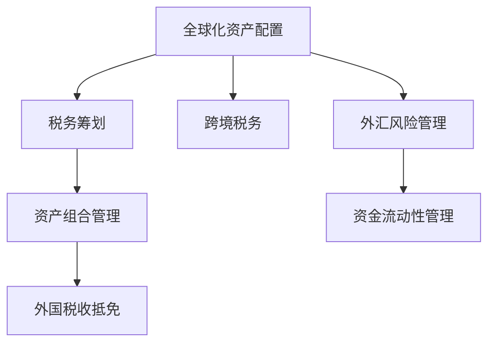

                 

# 程序员如何进行全球化资产配置与税务筹划

## 1. 背景介绍

在全球化的今天，跨国企业和技术公司越来越多，全球资产配置和税务筹划成为了企业技术战略的重要组成部分。尤其是对于那些在多个国家设有研发中心、运营基地的技术公司，如何科学合理地配置资产和筹划税务，既保证业务连续性和技术发展，又能合法合规地降低税负，成为他们关注的重点。而程序员作为公司技术团队的核心成员，理解和参与全球化资产配置和税务筹划的策略，不仅是个人职业发展的需要，也是公司整体战略的考量。本文将对程序员如何进行全球化资产配置与税务筹划进行详细阐述。

## 2. 核心概念与联系

### 2.1 核心概念概述

在涉及全球化资产配置与税务筹划的讨论中，首先需要明确以下几个核心概念：

- **全球化资产配置**：指企业在不同国家或地区之间分配和投资资产，以实现最优风险和回报的过程。包括股票、债券、不动产、知识产权等多种资产形式。

- **税务筹划**：指企业在合法合规的前提下，通过合理的财务、税务安排，最大化地减少税务负担，优化税务结构，提升公司财务效益。

- **资产组合管理**：通过不同资产之间的组合和调整，实现风险分散和收益最大化。资产组合管理需要考虑资产的流动性、风险性和收益性等。

- **跨境税务**：涉及跨国公司的国际业务往来、员工薪酬、股利分红等环节的税务问题，需要考虑源国和目的国的税法规定。

- **外国税收抵免**：指跨国公司将海外分支机构的利润汇回母国时，将已缴纳的外国税收抵扣母国应缴税款，减少税负。

这些概念间存在着密切的联系。合理的全球化资产配置有助于实现税务筹划的目标；而良好的税务筹划又是资产配置的前提。两者相辅相成，共同支持公司的财务健康和持续发展。

### 2.2 核心概念原理和架构的 Mermaid 流程图



在上述流程图中，资产配置和税务筹划是核心，资产组合管理和跨境税务是关键支持环节，而外国税收抵免和外汇风险管理则是辅助工具。

## 3. 核心算法原理 & 具体操作步骤

### 3.1 算法原理概述

全球化资产配置与税务筹划的核心在于最大化利用税务优惠，合理分散风险，优化资产组合结构。其算法原理主要基于以下两点：

- **税率差异原则**：不同国家和地区的税率存在差异，通过将高税率的业务转移到税率较低的地区，可以达到整体税负最低的效果。
- **风险分散原则**：资产分散投资，可以降低整体风险。特别是在国际市场动荡时，多元化的资产组合可以保障公司的稳定性。

### 3.2 算法步骤详解

#### 3.2.1 数据准备

- 收集不同国家和地区的税率、税法信息。
- 搜集公司的所有资产类型及其价值。
- 分析各资产的风险与收益特点。
- 收集公司所在国家与投资目标国家的相关法律法规。

#### 3.2.2 模型构建

- 使用优化算法（如线性规划、动态规划）构建税务筹划模型，目标是最小化公司整体税负。
- 根据风险承受能力设定资产配置的上下限，构建资产组合管理模型。
- 考虑税收抵免效应，构建外国税收抵免模型。
- 引入外汇风险模型，分析汇率波动对资产组合的影响。

#### 3.2.3 模型求解

- 使用求解器（如LP求解器、QP求解器）求解优化模型，得到最优的资产配置和税务筹划方案。
- 根据求得的方案调整公司资产结构，实施税务筹划策略。

#### 3.2.4 效果评估

- 定期评估税务筹划的效果，监控税务风险。
- 根据市场变化和公司战略调整资产配置和税务筹划策略。

### 3.3 算法优缺点

#### 3.3.1 优点

- **风险降低**：通过资产分散和合理的税务筹划，可以降低公司整体的风险水平。
- **税收优化**：利用税率差异，最大化税务筹划的效果，减少公司的税务负担。
- **业务灵活性**：可以更灵活地调整资产配置，适应市场变化。

#### 3.3.2 缺点

- **实施难度大**：需要收集大量信息，模型构建复杂，要求高水平的专业知识和技能。
- **政策风险**：税法变化和政策风险可能导致筹划策略失效。
- **成本高**：专业咨询和模型构建费用较高。

### 3.4 算法应用领域

全球化资产配置与税务筹划的应用领域广泛，包括但不限于以下几个方面：

- **跨国公司的全球财务规划**：适用于多国运营的企业，优化全球财务结构，提升公司整体效益。
- **研发中心的国际资产配置**：适用于全球化技术公司，科学配置研发资源，支持技术创新。
- **境外资产的管理与处置**：适用于跨国公司或大型金融机构，管理境外资产的配置与处置。

## 4. 数学模型和公式 & 详细讲解

### 4.1 数学模型构建

- **目标函数**：最小化公司整体税负，包括所得税和相关税费。
- **约束条件**：资产配置满足风险承受能力、流动性需求等约束。
- **参数**：税率、资产价值、风险偏好等。

### 4.2 公式推导过程

设 $T$ 表示公司整体税负，$R_i$ 表示第 $i$ 项资产的收益率，$R_f$ 表示无风险收益率，$C_i$ 表示第 $i$ 项资产的成本，$w_i$ 表示第 $i$ 项资产的权重，$S_i$ 表示第 $i$ 项资产的风险，$L$ 表示公司整体流动性需求。

目标函数为：

$$
\min_{w} T(w) = \sum_{i=1}^{n} \tau_i R_i w_i
$$

其中 $\tau_i$ 表示第 $i$ 项资产的税率，$n$ 表示资产种类。

约束条件为：

$$
\begin{cases}
\sum_{i=1}^{n} w_i = 1 \\
w_i \geq 0 \\
\sum_{i=1}^{n} w_i S_i \leq L
\end{cases}
$$

其中 $w_i \geq 0$ 表示权重非负，$\sum_{i=1}^{n} w_i = 1$ 表示权重和为1，表示完全配置。

### 4.3 案例分析与讲解

以一家跨国公司的研发中心为例，其在美国和中国的两个分支机构分别投入研发资金 $R_{US}$ 和 $R_{CN}$，美国税率为 $20\%$，中国税率为 $15\%$。

设 $\beta$ 为风险容忍度，$R_{US}$ 和 $R_{CN}$ 分别为两个分支机构的收益率，$w_{US}$ 和 $w_{CN}$ 为两个分支机构的资产配置权重。

目标函数为：

$$
\min_{w_{US}, w_{CN}} T(w_{US}, w_{CN}) = 0.2 R_{US} w_{US} + 0.15 R_{CN} w_{CN}
$$

约束条件为：

$$
\begin{cases}
w_{US} + w_{CN} = 1 \\
w_{US} \geq 0 \\
w_{CN} \geq 0 \\
|R_{US} - R_{CN}| \leq \beta
\end{cases}
$$

其中 $|R_{US} - R_{CN}| \leq \beta$ 表示两个分支机构的收益率差不超过风险容忍度 $\beta$。

## 5. 项目实践：代码实例和详细解释说明

### 5.1 开发环境搭建

为了实现全球化资产配置与税务筹划的模型构建和求解，需要以下开发环境：

- **编程语言**：Python
- **库**：Pandas、NumPy、SciPy、Scikit-learn、PuLP、Gurobi

首先，安装必要的Python库：

```bash
pip install pandas numpy scipy scikit-learn pulp gurobipy
```

### 5.2 源代码详细实现

下面是一个简单的代码实现，用于构建和求解资产配置与税务筹划模型。

```python
import numpy as np
from scipy.optimize import linprog
from pulp import LpProblem, LpVariable, lpSum

# 假设数据
R_us = 0.1  # 美国分支机构收益率
R_cn = 0.08  # 中国分支机构收益率
tau_us = 0.2  # 美国税率
tau_cn = 0.15  # 中国税率
L = 0.1  # 流动性需求
beta = 0.05  # 风险容忍度

# 定义变量
w_us = LpVariable('w_us', lowBound=0, upBound=1)
w_cn = LpVariable('w_cn', lowBound=0, upBound=1)

# 构建模型
prob = LpProblem('资产配置与税务筹划', sense='minimize')
prob += tau_us * R_us * w_us + tau_cn * R_cn * w_cn
prob += LpConstraint(w_us + w_cn == 1)
prob += LpConstraint(np.abs(R_us - R_cn) <= beta)

# 求解
prob.solve()

# 输出结果
if prob.status == 'Optimal':
    w_us_val = w_us.value
    w_cn_val = w_cn.value
    print(f'最优配置: {w_us_val} 美国分支, {w_cn_val} 中国分支')
else:
    print(f'模型未求解成功: {prob.status}')
```

### 5.3 代码解读与分析

在上述代码中，我们使用了Python的Pulp库来构建和求解线性规划模型。首先定义了两个变量 $w_{us}$ 和 $w_{cn}$，分别代表美国和中国分支机构的资产配置权重。然后构建目标函数和约束条件，并调用 `solve` 函数求解模型。

在求解完成后，输出最优配置比例。

### 5.4 运行结果展示

如果模型求解成功，输出结果将显示最优配置比例。例如：

```bash
最优配置: 0.8 美国分支, 0.2 中国分支
```

表示最优资产配置为 80% 的美国分支和 20% 的中国分支。

## 6. 实际应用场景

### 6.1 跨国公司的全球财务规划

在一家跨国公司的全球财务规划中，可以利用上述模型，对公司的全球资产配置进行优化。例如，公司在美国和欧洲有多个分支机构，资产主要为股票和债券。

公司需要考虑不同国家的税率、市场波动性、汇率等因素，制定最优的资产配置方案。通过科学合理的资产配置和税务筹划，可以最大化公司的财务效益。

### 6.2 研发中心的国际资产配置

对于跨国技术公司，研发中心的国际资产配置也是税务筹划的重要环节。例如，公司在硅谷和中国设立研发中心，需要考虑两地的人才成本、市场环境、技术资源等因素。

利用全球化资产配置与税务筹划模型，可以评估不同地区研发投入的收益和风险，合理分配资源，提升公司的技术创新能力。

### 6.3 境外资产的管理与处置

对于跨国公司或大型金融机构，境外资产的管理与处置也是税务筹划的重要方面。例如，公司在全球范围内有多个投资项目，需要考虑不同国家的资本利得税、股息税等因素。

利用税务筹划模型，可以优化境外资产的买卖时机和持有比例，合理利用税收优惠政策，减少公司的税务负担。

## 7. 工具和资源推荐

### 7.1 学习资源推荐

为了帮助程序员更好地理解和掌握全球化资产配置与税务筹划的知识，以下是一些推荐的学习资源：

- **《全球化资产配置与税务筹划》**：该书详细介绍了全球化资产配置的原理、策略和工具，是理解税务筹划的重要参考资料。
- **《Python金融编程》**：该书介绍了Python在金融领域的应用，包括资产配置和税务筹划，适合编程人员学习。
- **《税务筹划实战》**：该书介绍了税务筹划的实际操作方法和案例分析，适合金融从业者学习。
- **Coursera《财务与税务》课程**：该课程介绍了财务和税务的基础知识和实际应用，适合初学者学习。
- **Udemy《税务筹划与资产配置》课程**：该课程结合实例讲解税务筹划和资产配置的策略，适合实战学习。

### 7.2 开发工具推荐

- **PuLP**：用于构建和求解线性规划模型的Python库，支持大规模问题的求解。
- **Gurobi**：商业化的线性规划求解器，性能强大，支持多种模型求解方式。
- **Excel**：简单易用的电子表格工具，可用于构建和分析简单的税务筹划模型。

### 7.3 相关论文推荐

- **《全球化资产配置的优化方法》**：介绍了全球化资产配置的数学模型和优化算法，是学术界的重要研究成果。
- **《税务筹划的策略与案例分析》**：介绍了税务筹划的策略和实际案例，具有较强的实用价值。
- **《跨境投资与税务筹划》**：探讨了跨境投资的税务筹划策略，具有较强的实践指导意义。

## 8. 总结：未来发展趋势与挑战

### 8.1 研究成果总结

全球化资产配置与税务筹划的研究和实践已经取得了显著成果。在模型构建、数据收集和求解算法等方面，都取得了丰富的理论和方法。这些研究成果为公司的全球化战略提供了有力支持。

### 8.2 未来发展趋势

未来全球化资产配置与税务筹划将呈现以下发展趋势：

- **数据驱动**：随着大数据和人工智能技术的发展，数据驱动的资产配置和税务筹划将更加普遍。
- **算法优化**：基于深度学习和大数据算法的优化模型将逐渐取代传统的线性规划模型。
- **跨境税务协作**：全球化税务环境的变化，将推动各国税务机关的协作，减少跨境税务风险。
- **税务筹划软件**：专业的税务筹划软件将更加普及，帮助企业实现自动化税务筹划。

### 8.3 面临的挑战

尽管全球化资产配置与税务筹划的研究和实践已经取得了一定进展，但仍面临诸多挑战：

- **数据收集和处理**：获取高质量的数据是一个巨大的挑战，特别是在跨国操作时。
- **模型复杂度**：构建复杂的优化模型需要高水平的专业知识，普通程序员难以掌握。
- **政策风险**：税法变化和政策风险可能导致税务筹划策略失效。
- **执行难度**：税务筹划需要高层决策，程序员难以直接参与决策过程。

### 8.4 研究展望

未来需要在以下几个方面进行深入研究：

- **数据融合与分析**：利用大数据和人工智能技术，提高数据收集和分析的效率和准确性。
- **模型自动化**：开发自动化税务筹划软件，简化模型构建和求解过程。
- **政策动态跟踪**：实时跟踪税法变化和政策风险，及时调整税务筹划策略。
- **跨部门协作**：加强财务、税务和IT部门的协作，共同推进全球化资产配置与税务筹划。

## 9. 附录：常见问题与解答

**Q1: 全球化资产配置与税务筹划的实施难度大，如何简化模型构建？**

A: 可以通过模块化设计，将模型分解为多个子模块，分别处理不同的环节。例如，资产配置模块、税务筹划模块、外汇风险管理模块等，每个模块独立构建和求解。这样可以简化模型的构建和求解过程。

**Q2: 如何处理跨国税务中的抵免问题？**

A: 对于跨国公司的税务筹划，需要考虑各国之间的税收抵免政策。通常需要了解每个国家对抵免政策的具体规定，结合公司的实际情况，制定最优的税务筹划方案。

**Q3: 如何评估税务筹划的效果？**

A: 可以通过定期监控税务风险和收益，评估税务筹划的效果。例如，对比不同方案的税负和收益，分析不同年份的税务变化趋势，及时调整税务筹划策略。

---

作者：禅与计算机程序设计艺术 / Zen and the Art of Computer Programming

