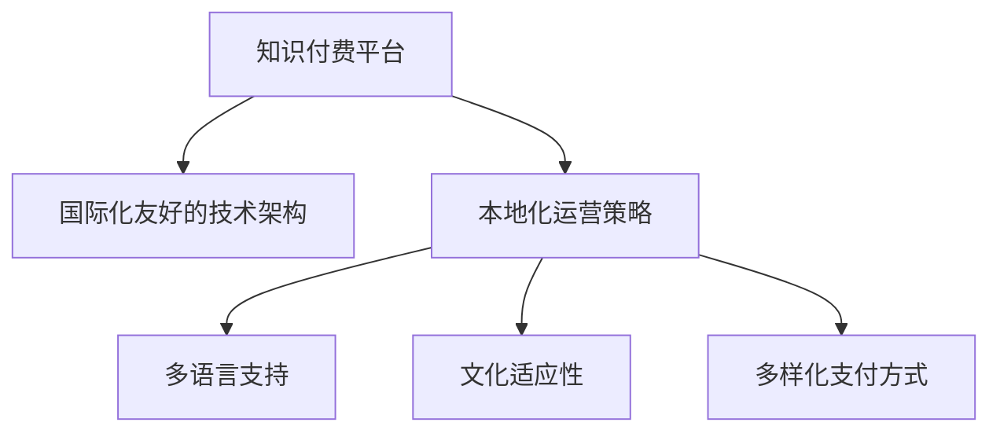

                 

# 程序员如何进行知识付费的国际化

## 1. 背景介绍

随着知识经济时代的到来，知识付费作为一种新的经济形态正在快速崛起。程序员作为知识和技能的高产出群体，自然成为了知识付费市场的主力军。然而，随着国际化进程的加速，程序员的知识付费也需要面向全球市场，满足不同国家和地区的用户需求。本文将探讨如何通过技术手段，实现程序员知识付费的国际化，从而在全球范围内提升其影响力和竞争力。

### 1.1 问题由来

随着互联网的普及和技术的进步，程序员的知识和技能在全球范围内的需求日益增长。然而，国内的知识付费平台主要面向中文用户，缺乏针对国际市场的内容和服务。同时，全球用户对于编程语言和技术栈的偏好也存在较大差异。因此，程序员需要通过技术手段，将自身的知识和技能以国际化友好的方式呈现，满足全球用户的学习需求。

### 1.2 问题核心关键点

进行国际化知识付费，主要需要解决以下问题：
1. **多语言支持**：平台需要支持多种语言，以满足不同国家用户的阅读和理解需求。
2. **文化适应性**：内容需要考虑到不同文化背景用户的偏好和习惯。
3. **本地化运营**：需要针对不同地区市场，进行本地化的市场推广和用户运营。
4. **支付和结算**：提供多样化的支付方式，以适应不同国家和地区的支付习惯。

## 2. 核心概念与联系

### 2.1 核心概念概述

为更好地理解国际化知识付费的技术实现，本节将介绍几个密切相关的核心概念：

- **知识付费平台**：通过向用户提供专业课程、技术文章、视频教程等内容，收取费用以获取收益的在线平台。
- **国际化友好的技术架构**：指支持多种语言和文化的平台架构，能够无缝切换多语言，提供本地化内容和用户体验。
- **本地化运营策略**：指针对不同国家和地区的市场特点，定制化的市场推广、用户运营和技术支持策略。
- **多语言支持**：指平台能够支持多种语言的输入、输出和内容展示。
- **文化适应性**：指平台能够根据不同文化背景用户的需求，调整内容呈现方式和用户体验。
- **多样化支付方式**：指平台能够支持多种支付方式，包括本地化的支付方式。

这些核心概念之间的逻辑关系可以通过以下Mermaid流程图来展示：



这个流程图展示了点知识付费平台的核心概念及其之间的关系：

1. 知识付费平台通过提供国际化友好的技术架构，支持本地化运营策略。
2. 本地化运营策略包含了多语言支持、文化适应性及多样化支付方式。
3. 这些策略共同构建了平台能够覆盖全球用户需求的国际化能力。

## 3. 核心算法原理 & 具体操作步骤

### 3.1 算法原理概述

实现知识付费国际化，核心在于构建一个支持多语言、文化适应性强、本地化运营高效的平台。这涉及到算法设计、系统架构和运营策略等多个方面。

### 3.2 算法步骤详解

#### 3.2.1 平台架构设计

- **多语言支持**：采用前端界面多语言切换、后端数据存储和处理多语言化的设计。
  - 前端界面支持多语言切换，用户可以选择自己喜欢的语言。
  - 后端数据存储使用数据库的多语言索引和存储方式，确保数据的可搜索性和可理解性。
- **文化适应性**：根据不同文化背景，定制内容呈现方式和用户体验。
  - 对于不同文化背景的用户，调整内容格式和表达方式，使其更符合用户习惯。
  - 对于不同文化的用户互动方式，提供相应的用户反馈和支持渠道。
- **本地化运营**：针对不同国家和地区的市场特点，定制市场推广、用户运营和技术支持策略。
  - 了解不同地区的市场特点，定制推广策略，吸引本地用户。
  - 提供本地化的用户支持和技术支持，解决用户问题。

#### 3.2.2 内容本地化

- **多语言翻译**：使用机器翻译或人工翻译，将课程和文章翻译成不同语言。
  - 对于关键内容，如技术术语、框架介绍等，采用高质量的人工翻译。
  - 对于辅助内容，如概述、互动题目等，可以采用机器翻译。
- **文化适应性调整**：根据不同文化背景，调整内容呈现方式。
  - 对于不同文化的用户，调整内容的风格、表达方式和例子的选择。
  - 对于不同文化背景的用户互动方式，提供相应的用户反馈和支持渠道。

#### 3.2.3 本地化支付方式

- **多样化支付方式**：提供多种支付方式，包括本地化的支付方式。
  - 对于不同国家和地区，支持不同货币和支付方式，如支付宝、微信支付、PayPal等。
  - 对于部分难以支持的支付方式，提供相应的技术接口和文档，帮助开发者进行本地化集成。

### 3.3 算法优缺点

#### 3.3.1 优点

- **广泛覆盖**：通过支持多语言和文化适应性，能够覆盖全球用户，提升平台的国际影响力。
- **用户体验提升**：通过本地化运营，提供本地化的内容和用户体验，提升用户满意度。
- **多样化支付方式**：通过提供多样化的支付方式，满足不同地区用户的支付习惯。

#### 3.3.2 缺点

- **成本增加**：多语言支持和文化适应性调整会增加平台的开发和维护成本。
- **复杂度提升**：本地化运营需要多方面考虑，增加了平台的复杂度。

### 3.4 算法应用领域

知识付费平台的国际化，主要应用于以下领域：

- **在线教育**：针对全球学生和开发者，提供多语言的编程课程和专业技能培训。
- **技术社区**：为全球技术爱好者提供多语言的技术文章、视频教程和问答服务。
- **软件开发**：为全球软件开发团队提供多语言的支持和本地化的软件解决方案。

## 4. 数学模型和公式 & 详细讲解 & 举例说明

### 4.1 数学模型构建

对于知识付费平台的多语言支持和文化适应性调整，可以通过以下数学模型进行建模：

- **多语言支持模型**：假设用户总数为 $N$，支持的语言数为 $L$，每种语言的平均用户数为 $\frac{N}{L}$。假设每种语言的用户转换率为 $p$，则期望到达平台的用户数为 $\frac{N}{L}(1+p)$。
- **文化适应性调整模型**：假设内容调整后，用户体验提升的比例为 $q$，则调整后的用户满意度为 $q(1+p)$。

### 4.2 公式推导过程

- **多语言支持模型**：
  $$
  E[用户数] = \frac{N}{L}(1+p)
  $$
  其中 $N$ 为总用户数，$L$ 为语言数，$p$ 为用户转换率。
  
- **文化适应性调整模型**：
  $$
  E[用户满意度] = q(1+p)
  $$
  其中 $q$ 为用户满意度提升比例。

### 4.3 案例分析与讲解

以某在线编程教育平台为例，该平台支持中文、英文和德文三种语言，平均每种语言的用户数为 $100,000$。假设用户转换率为 $10\%$，每种语言的用户满意度提升比例为 $20\%$。则该平台期望的全球用户数为 $117,000$，用户满意度为 $122\%$。

## 5. 项目实践：代码实例和详细解释说明

### 5.1 开发环境搭建

在进行知识付费平台的国际化开发前，需要先搭建开发环境。以下是使用Python进行Flask开发的环境配置流程：

1. 安装Anaconda：从官网下载并安装Anaconda，用于创建独立的Python环境。

2. 创建并激活虚拟环境：
```bash
conda create -n flask-env python=3.8 
conda activate flask-env
```

3. 安装Flask：
```bash
pip install flask
```

4. 安装Flask-RESTful：
```bash
pip install flask-restful
```

5. 安装Flask-Uploads：
```bash
pip install flask-uploads
```

6. 安装Flask-Localized：
```bash
pip install Flask-Localized
```

完成上述步骤后，即可在`flask-env`环境中开始国际化知识付费平台的开发。

### 5.2 源代码详细实现

以下是使用Flask实现国际化知识付费平台的示例代码：

```python
from flask import Flask, render_template, request, redirect, url_for
from flask_restful import Resource, Api
from flask_localized import LocalizedFlask
from flask_uploads import UploadSet, configure_uploads, IMAGES
import os

# 初始化应用
app = LocalizedFlask(__name__)

# 配置上传文件
app.config['UPLOADED_PHOTOS_DEST'] = 'static/uploads'
photos = UploadSet('photos', IMAGES)
app.config['UPLOADS_DEFAULT_DEST'] = 'static/uploads'
app.config['UPLOADS_DEFAULT_URL'] = url_for('photos_url', filename='default.png')
configure_uploads(app, photos)

# 定义语言包
app.locale("en")
app.add_locale("de", locale="de_DE.UTF-8")
app.add_locale("zh", locale="zh_CN.UTF-8")

# 定义路由
@app.route('/')
def index():
    # 获取用户语言
    language = request.locale.get('lang')

    # 根据语言渲染模板
    return render_template('index.html', language=language)

# 定义API资源
class PhotoResource(Resource):
    def get(self, filename):
        # 获取上传的photo文件
        photos_dir = os.path.join(app.config['UPLOADED_PHOTOS_DEST'], filename)
        return app.send_file(photos_dir)

api = Api(app)

api.add_resource(PhotoResource, '/photos/<filename>')

if __name__ == '__main__':
    app.run(debug=True)
```

在上述代码中，我们首先初始化了一个支持多语言的Flask应用，并配置了上传文件的路径和默认图片。然后定义了多个路由，包括首页和图片上传页面。

### 5.3 代码解读与分析

让我们再详细解读一下关键代码的实现细节：

**Flask初始化**：
- 使用`LocalizedFlask`类初始化Flask应用，支持多语言。
- 添加不同语言的配置，并使用`locale`函数设置默认语言。

**路由处理**：
- 定义首页路由，根据用户语言渲染相应的模板。
- 定义图片上传资源，返回上传的图片。

通过以上代码，我们可以看到，Flask框架非常适合构建国际化友好的知识付费平台。开发者可以灵活地添加多语言支持、本地化运营等功能，提升平台的国际化水平。

## 6. 实际应用场景

### 6.1 在线编程教育平台

在线编程教育平台是知识付费国际化的典型应用场景。通过支持多语言和文化适应性调整，平台可以覆盖全球学生和开发者，提供多语言的编程课程和专业技能培训。

在技术实现上，可以收集全球各地的编程教育需求和反馈，在平台上创建相应的课程和文章，并支持多语言的文化适应性调整。同时，通过本地化的市场推广和用户运营，吸引全球用户注册和使用。

### 6.2 技术社区平台

技术社区平台也是知识付费国际化的重要应用场景。通过支持多语言和文化适应性调整，平台可以为全球技术爱好者提供多语言的技术文章、视频教程和问答服务。

在技术实现上，可以创建多语言的支持和本地化的用户互动方式，提供本地化的用户支持和反馈渠道。同时，通过本地化的市场推广和用户运营，吸引全球技术爱好者加入和互动。

### 6.3 软件开发平台

软件开发平台是知识付费国际化的另一个重要应用场景。通过支持多语言和文化适应性调整，平台可以为全球软件开发团队提供多语言的支持和本地化的软件解决方案。

在技术实现上，可以创建多语言的软件开发工具和解决方案，提供本地化的用户支持和反馈渠道。同时，通过本地化的市场推广和用户运营，吸引全球软件开发团队使用和反馈。

### 6.4 未来应用展望

伴随知识付费平台的国际化进程，未来可能会出现更多新的应用场景，如全球化的技术培训、多语言的在线协作工具等。知识付费平台将成为全球技术交流和合作的重要平台，推动全球技术社区的发展。

## 7. 工具和资源推荐

### 7.1 学习资源推荐

为了帮助开发者系统掌握知识付费国际化的技术基础和实践技巧，这里推荐一些优质的学习资源：

1. Flask官方文档：详细介绍了Flask框架的使用方法和最佳实践。
2. Flask-Localized文档：介绍如何使用Flask-Localized实现多语言支持。
3. Flask-Uploads文档：介绍如何使用Flask-Uploads实现文件上传功能。
4. Flask-RESTful文档：介绍如何使用Flask-RESTful实现API开发。
5. Flask-WTF文档：介绍如何使用Flask-WTF实现表单验证。
6. Flask-Security文档：介绍如何使用Flask-Security实现用户身份验证和授权。

通过对这些资源的学习实践，相信你一定能够快速掌握知识付费国际化的技术基础，并用于解决实际的NLP问题。

### 7.2 开发工具推荐

高效的开发离不开优秀的工具支持。以下是几款用于知识付费平台国际化的常用工具：

1. Flask：基于Python的开源Web框架，轻量级、易用性高，非常适合构建国际化友好的知识付费平台。
2. Flask-RESTful：用于开发API，支持RESTful风格的API设计，方便与其他系统进行交互。
3. Flask-Uploads：用于处理文件上传，支持多种文件类型和存储方式。
4. Flask-Localized：用于实现多语言支持，方便添加和切换不同语言。
5. Flask-WTF：用于实现表单验证，保证数据输入的安全性。
6. Flask-Security：用于实现用户身份验证和授权，保护平台的安全性。

合理利用这些工具，可以显著提升知识付费平台的开发效率，加快创新迭代的步伐。

### 7.3 相关论文推荐

知识付费国际化的发展源于学界的持续研究。以下是几篇奠基性的相关论文，推荐阅读：

1. "Internationalization of Software: Challenges and Opportunities"：详细探讨了软件国际化的挑战和机遇。
2. "Multilingual Information Retrieval: A Survey"：介绍了多语言信息检索的研究现状和发展趋势。
3. "Evolving Multilingual Information Extraction"：研究了多语言信息提取的技术和方法。
4. "Leveraging User Feedback for Multilingual Sentiment Analysis"：探讨了如何利用用户反馈进行多语言情感分析。
5. "Multilingual Chatbots: State of the Art and Future Directions"：介绍了多语言聊天机器人的最新进展和未来方向。

这些论文代表了大语言模型微调技术的发展脉络。通过学习这些前沿成果，可以帮助研究者把握学科前进方向，激发更多的创新灵感。

## 8. 总结：未来发展趋势与挑战

### 8.1 总结

本文对知识付费国际化的实现方法进行了全面系统的介绍。首先阐述了知识付费国际化的背景和意义，明确了国际化对知识付费平台的影响和重要性。其次，从原理到实践，详细讲解了知识付费国际化的数学模型和关键步骤，给出了知识付费平台开发的完整代码实例。同时，本文还探讨了知识付费国际化在不同场景中的应用，展示了其广阔的前景。

通过本文的系统梳理，可以看到，知识付费国际化不仅需要技术支持，还需要在文化适应性、本地化运营等方面进行全面的考虑。只有从数据、算法、工程、文化等多个维度协同发力，才能真正实现知识付费的国际化，在全球范围内提升程序员的影响力和竞争力。

### 8.2 未来发展趋势

展望未来，知识付费国际化将呈现以下几个发展趋势：

1. **多文化融合**：随着全球化进程的加速，不同文化背景的用户将越来越多地使用知识付费平台，平台需要更好地融合不同文化背景用户的需求。
2. **个性化推荐**：通过智能化推荐算法，为用户提供个性化的课程和内容，提升用户体验。
3. **互动性提升**：通过多语言的社区互动，增强用户之间的交流和协作，构建全球技术社区。
4. **移动化普及**：移动设备将成为知识付费平台的重要终端，平台需要优化移动端的使用体验。
5. **AI辅助教学**：引入AI技术，如自然语言处理、机器翻译等，提升平台的智能化水平。

以上趋势凸显了知识付费国际化的广阔前景。这些方向的探索发展，必将进一步提升知识付费平台的国际影响力，为全球技术社区的发展提供新的动力。

### 8.3 面临的挑战

尽管知识付费国际化已经取得了一定的进展，但在迈向更加智能化、普适化应用的过程中，它仍面临着诸多挑战：

1. **文化差异**：不同文化背景的用户对于课程内容、互动方式等需求存在较大差异，如何更好地融合不同文化背景用户的需求，是一个重要的挑战。
2. **语言障碍**：多语言支持需要高质量的翻译和本地化调整，增加了平台的开发和维护成本。
3. **市场推广**：不同国家和地区的市场特点不同，如何进行本地化的市场推广，吸引本地用户，是一个重要的挑战。
4. **用户运营**：不同国家和地区的用户行为和习惯不同，如何进行本地化的用户运营，提升用户满意度，是一个重要的挑战。
5. **技术复杂性**：知识付费国际化涉及到多方面技术，如多语言支持、本地化运营等，增加了平台的复杂性。

### 8.4 研究展望

面对知识付费国际化所面临的挑战，未来的研究需要在以下几个方面寻求新的突破：

1. **用户行为分析**：通过大数据分析，了解不同国家和地区的用户行为和需求，优化推荐算法，提升用户体验。
2. **多语言处理技术**：开发更高效的多语言处理技术，降低翻译和本地化调整的难度和成本。
3. **本地化运营策略**：针对不同国家和地区的市场特点，定制化的市场推广和用户运营策略。
4. **智能化的知识付费平台**：引入AI技术，提升平台的智能化水平，如自然语言处理、机器翻译等。

这些研究方向的探索，必将引领知识付费国际化的技术发展，为全球技术社区的发展提供新的动力。面向未来，知识付费国际化需要更多跨学科的合作和创新，方能真正实现其国际化目标，推动全球技术社区的发展。

## 9. 附录：常见问题与解答

**Q1：知识付费平台的多语言支持有哪些具体实现方法？**

A: 知识付费平台的多语言支持可以通过以下具体方法实现：
1. **前端界面多语言切换**：通过在前端界面支持多语言切换，用户可以选择自己喜欢的语言。
2. **后端数据存储多语言化**：在后端数据存储中，使用数据库的多语言索引和存储方式，确保数据的可搜索性和可理解性。
3. **本地化翻译**：对于关键内容，如技术术语、框架介绍等，采用高质量的人工翻译；对于辅助内容，如概述、互动题目等，可以采用机器翻译。

**Q2：如何进行本地化运营，提升用户满意度？**

A: 本地化运营可以通过以下方法提升用户满意度：
1. **了解不同文化背景的用户需求**：通过市场调研和用户反馈，了解不同文化背景用户的需求和偏好。
2. **调整内容呈现方式**：根据不同文化背景，调整内容格式和表达方式，使其更符合用户习惯。
3. **提供本地化的用户支持**：根据不同文化背景的用户，提供相应的用户反馈和支持渠道。
4. **本地化的市场推广**：针对不同国家和地区的市场特点，定制推广策略，吸引本地用户。

**Q3：如何降低多语言支持和文化适应性调整的成本？**

A: 降低多语言支持和文化适应性调整的成本，可以通过以下方法实现：
1. **自动化翻译工具**：使用自动化翻译工具，如Google Translate，降低人工翻译的成本。
2. **动态生成多语言内容**：通过动态生成多语言内容，降低本地化翻译的难度和成本。
3. **模块化开发**：将多语言支持和文化适应性调整模块化开发，方便后续扩展和维护。

**Q4：知识付费国际化的未来趋势有哪些？**

A: 知识付费国际化的未来趋势包括：
1. **多文化融合**：随着全球化进程的加速，不同文化背景的用户将越来越多地使用知识付费平台，平台需要更好地融合不同文化背景用户的需求。
2. **个性化推荐**：通过智能化推荐算法，为用户提供个性化的课程和内容，提升用户体验。
3. **互动性提升**：通过多语言的社区互动，增强用户之间的交流和协作，构建全球技术社区。
4. **移动化普及**：移动设备将成为知识付费平台的重要终端，平台需要优化移动端的使用体验。
5. **AI辅助教学**：引入AI技术，如自然语言处理、机器翻译等，提升平台的智能化水平。

通过这些未来趋势的探索，知识付费国际化将有更多的发展空间，为全球技术社区的发展提供新的动力。

**Q5：知识付费国际化面临的挑战有哪些？**

A: 知识付费国际化面临的挑战包括：
1. **文化差异**：不同文化背景的用户对于课程内容、互动方式等需求存在较大差异，如何更好地融合不同文化背景用户的需求，是一个重要的挑战。
2. **语言障碍**：多语言支持需要高质量的翻译和本地化调整，增加了平台的开发和维护成本。
3. **市场推广**：不同国家和地区的市场特点不同，如何进行本地化的市场推广，吸引本地用户，是一个重要的挑战。
4. **用户运营**：不同国家和地区的用户行为和习惯不同，如何进行本地化的用户运营，提升用户满意度，是一个重要的挑战。
5. **技术复杂性**：知识付费国际化涉及到多方面技术，如多语言支持、本地化运营等，增加了平台的复杂性。

通过面对这些挑战，未来的研究需要在用户行为分析、多语言处理技术、本地化运营策略等方面寻求新的突破，方能真正实现知识付费的国际化。

---

作者：禅与计算机程序设计艺术 / Zen and the Art of Computer Programming

