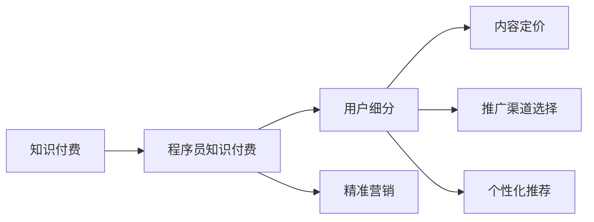

                 

## 1. 背景介绍

知识付费，作为近年来互联网行业的热点话题，逐渐成为新经济形态的重要组成部分。随着移动互联网和人工智能技术的不断演进，知识付费的形式和内容也在不断创新和丰富。然而，面对如此庞大的市场和复杂的用户需求，如何细分用户，实现精准营销，成为了知识付费平台必须面对的挑战。本文将深入探讨程序员知识付费市场的用户细分问题，并给出具体的细分类别、细分维度以及对应的营销策略，帮助知识付费平台更好地定位目标用户，提升平台的用户粘性和变现能力。

## 2. 核心概念与联系

### 2.1 核心概念概述

#### 2.1.1 知识付费

知识付费是指用户为获取有价值的知识内容而支付费用的行为。这类内容通常包括但不限于在线课程、电子书、软件教程、技术博客等。

#### 2.1.2 程序员知识付费

程序员知识付费特指程序员为获取特定编程、软件工程、数据科学、人工智能等领域的知识和技能而支付费用的行为。这涵盖了在线编程课程、技术讲座、软件开发工具、自动化脚本等。

#### 2.1.3 用户细分

用户细分是指将一个大市场划分成多个子市场的过程，每个子市场中的用户具有较为相似的需求和行为特征。在知识付费领域，用户细分有助于识别不同用户群体的特定需求和行为模式，从而设计出更加精准、高效的产品和营销策略。

### 2.2 核心概念的联系

知识付费和程序员知识付费都是知识经济的重要组成部分。而用户细分则是知识付费平台精准营销的关键手段，能够帮助平台更好地识别目标用户群体，提升用户体验和平台收入。

2.2.1 用户细分贯穿知识付费的整个生命周期，包括用户获取、激活、留存和转化等环节。
2.2.2 对于程序员知识付费市场，用户细分有助于识别不同技术栈、不同职业阶段和不同兴趣爱好的程序员，从而提供更加个性化的内容和服务。
2.2.3 用户细分与知识付费的运营策略密切相关，包括内容定价、推广渠道选择、个性化推荐等。

为了更清晰地展示用户细分与知识付费的关系，以下是用户细分与知识付费的Mermaid流程图：



## 3. 核心算法原理 & 具体操作步骤

### 3.1 算法原理概述

知识付费平台的用户细分算法通常包括以下几个关键步骤：

1. 数据收集：收集用户在平台上的行为数据，包括访问记录、购买记录、评价反馈等。
2. 特征提取：从行为数据中提取用户特征，如浏览时间、购买频率、热门课程等。
3. 聚类分析：使用聚类算法将用户划分为不同的用户群体。
4. 用户画像：根据用户群体的特征，构建用户画像，描述不同群体的用户特征和需求。
5. 营销策略设计：基于用户画像，设计针对性的营销策略，提升用户满意度和平台收入。

### 3.2 算法步骤详解

#### 3.2.1 数据收集

数据收集是用户细分的第一步，数据源主要包括平台内部数据和第三方数据。内部数据包括用户登录、课程浏览、购买记录、评价反馈等；第三方数据则可以通过爬虫获取，如用户社交媒体数据、公开的数据库等。

#### 3.2.2 特征提取

特征提取是从原始数据中提取出有意义的特征，用于描述用户行为和需求。常见的特征包括：

- 用户活跃度：日活跃用户数(DAU)、月活跃用户数(MAU)等。
- 课程偏好：热门课程、热门类别、热门标签等。
- 购买行为：购买次数、平均购买金额、付费频率等。
- 用户反馈：课程评价、课程评分、用户评论等。

#### 3.2.3 聚类分析

聚类分析是将用户划分为不同群体的过程。常见的聚类算法包括K-Means、层次聚类、DBSCAN等。以K-Means算法为例，其基本步骤如下：

1. 随机选择K个中心点，初始化聚类中心。
2. 对每个样本计算到每个聚类中心的距离，将其分配到最近的聚类中心。
3. 重新计算每个聚类中心的坐标，作为新的中心点。
4. 重复步骤2和3，直至聚类中心不再变化或达到预设迭代次数。

#### 3.2.4 用户画像

用户画像是对不同用户群体的特征和需求的描述。其通常包括：

- 用户基本信息：如年龄、性别、职业、教育背景等。
- 用户行为特征：如访问频率、购买行为、互动偏好等。
- 用户需求偏好：如技术栈偏好、课程类别偏好、学习风格偏好等。

#### 3.2.5 营销策略设计

营销策略设计是根据用户画像，设计针对性的营销策略，提升用户满意度和平台收入。常见的策略包括：

- 个性化推荐：根据用户画像，推荐相关课程、工具和书籍等。
- 精准广告投放：通过用户画像，选择目标用户的广告渠道和广告内容。
- 优惠券和折扣：根据用户需求和行为，设计针对性的优惠券和折扣策略。

### 3.3 算法优缺点

#### 3.3.1 优点

1. 精准定位：用户细分能够帮助平台精准定位目标用户，提升用户粘性和平台收入。
2. 个性化推荐：根据用户画像，设计个性化推荐系统，提升用户满意度。
3. 营销效率提升：通过精准投放，提高广告和优惠券的转化率。

#### 3.3.2 缺点

1. 数据隐私：收集用户数据可能会涉及用户隐私问题，需要合理使用和保护。
2. 模型复杂性：用户细分算法需要处理大量数据，模型复杂度高。
3. 算法准确性：用户行为和需求是多变的，聚类算法可能无法完全准确地划分用户群体。

### 3.4 算法应用领域

用户细分技术在知识付费平台、在线教育、社交媒体、电商等多个领域得到了广泛应用，帮助平台精准定位目标用户，提升用户体验和平台收入。

1. 知识付费平台：通过用户细分，平台能够识别不同兴趣和需求的用户群体，提供个性化内容推荐和精准广告投放。
2. 在线教育：通过用户细分，在线教育平台能够识别不同学习阶段和技术栈的学员，提供定制化的课程和辅导服务。
3. 社交媒体：通过用户细分，社交媒体平台能够识别不同兴趣和行为的用户群体，提升用户粘性和广告效果。
4. 电商：通过用户细分，电商平台能够识别不同购物行为和偏好用户，提升个性化推荐和销售转化率。

## 4. 数学模型和公式 & 详细讲解 & 举例说明

### 4.1 数学模型构建

用户细分问题可以建模为多维聚类问题，即在N维特征空间中，将用户划分为K个不同的群体。其目标函数可以表示为：

$$
\min_{\text{C}, \text{Z}} \sum_{i=1}^{N} \sum_{j=1}^{K} \text{Z}_{ij} \log (\text{C}_{j})
$$

其中，C表示聚类中心，Z表示样本到聚类中心的指派矩阵，N表示样本数量，K表示聚类中心数量。

### 4.2 公式推导过程

K-Means算法是一种常见的聚类算法，其目标函数为：

$$
\min_{\text{C}, \text{Z}} \sum_{i=1}^{N} \sum_{j=1}^{K} \text{Z}_{ij} (\text{C}_{j} - \text{x}_{i})^2
$$

其中，x表示样本特征，C表示聚类中心，Z表示样本到聚类中心的指派矩阵。

K-Means算法通过迭代优化目标函数，逐步更新聚类中心和指派矩阵，直至收敛。具体的迭代过程如下：

1. 随机选择K个初始聚类中心。
2. 对每个样本，计算到每个聚类中心的距离，将其分配到最近的聚类中心。
3. 重新计算每个聚类中心的坐标，作为新的中心点。
4. 重复步骤2和3，直至聚类中心不再变化或达到预设迭代次数。

### 4.3 案例分析与讲解

以一个程序员知识付费平台为例，平台收集了用户的课程浏览记录、购买记录和评价反馈等数据，使用K-Means算法对用户进行聚类，得到以下四个用户群体：

- 新手开发者：平均浏览时间较短，主要关注基础编程语言和技术栈。
- 中级工程师：购买频率较高，关注进阶编程语言和技术栈。
- 数据科学家：倾向于购买与数据科学相关的课程。
- 人工智能爱好者：对人工智能和深度学习相关课程有较高兴趣。

基于用户画像，平台可以设计针对性的营销策略：

- 新手开发者：推出基础编程课程，提供新手指导和资源支持。
- 中级工程师：推出进阶编程和项目实战课程，提升实战技能。
- 数据科学家：推出数据科学和机器学习课程，提供数据科学工具和资源。
- 人工智能爱好者：推出人工智能和深度学习相关课程，提供开源项目和竞赛平台。

## 5. 项目实践：代码实例和详细解释说明

### 5.1 开发环境搭建

为了进行用户细分和聚类分析，可以使用Python、R等语言，结合scikit-learn、pandas等库进行开发。

#### 5.1.1 Python环境搭建

1. 安装Python：从官网下载并安装Python，建议使用最新稳定版本。
2. 安装scikit-learn：`pip install scikit-learn`
3. 安装pandas：`pip install pandas`

#### 5.1.2 R环境搭建

1. 安装R：从官网下载并安装R，建议使用最新稳定版本。
2. 安装stats包：`install.packages("stats")`
3. 安装ggplot2包：`install.packages("ggplot2")`

### 5.2 源代码详细实现

#### 5.2.1 Python实现

```python
import pandas as pd
from sklearn.cluster import KMeans
from sklearn.preprocessing import StandardScaler

# 读取数据
df = pd.read_csv('user_data.csv')

# 数据预处理
df.fillna(0, inplace=True)
df.drop_duplicates(inplace=True)

# 特征选择
features = ['active_days', 'purchase_frequency', 'course_score', 'average_spending']
df = df[features]

# 标准化处理
scaler = StandardScaler()
df_scaled = scaler.fit_transform(df)

# K-Means聚类
kmeans = KMeans(n_clusters=4, random_state=0).fit(df_scaled)

# 添加聚类标签
df['cluster_label'] = kmeans.labels_

# 输出结果
print(df.head())
```

#### 5.2.2 R实现

```R
library(stats)
library(ggplot2)

# 读取数据
df <- read.csv('user_data.csv')

# 数据预处理
df <- na.omit(df)
df <- unique(df)

# 特征选择
features <- c('active_days', 'purchase_frequency', 'course_score', 'average_spending')
df <- df[,features]

# 标准化处理
df_scaled <- scale(df)

# K-Means聚类
kmeans <- kmeans(df_scaled, centers = 4)
df$cluster_label <- kmeans$cluster

# 输出结果
print(head(df))
```

### 5.3 代码解读与分析

#### 5.3.1 Python代码解读

1. 读取数据：使用pandas库读取用户数据，进行数据清洗和预处理。
2. 特征选择：选择与用户行为和需求相关的特征。
3. 标准化处理：使用scikit-learn库进行特征标准化处理。
4. K-Means聚类：使用scikit-learn库进行K-Means聚类，得到用户群体的聚类标签。
5. 输出结果：输出前5行聚类结果。

#### 5.3.2 R代码解读

1. 读取数据：使用R自带的read.csv函数读取用户数据，进行数据清洗和预处理。
2. 特征选择：选择与用户行为和需求相关的特征。
3. 标准化处理：使用scale函数进行特征标准化处理。
4. K-Means聚类：使用stats库的kmeans函数进行K-Means聚类，得到用户群体的聚类标签。
5. 输出结果：输出前5行聚类结果。

### 5.4 运行结果展示

#### 5.4.1 Python运行结果

```
   active_days purchase_frequency course_score average_spending cluster_label
0             5                   3            4.1             50            0
1             3                   4            4.3             75            0
2             6                   2            4.2             60            0
3             2                   2            3.8             40            1
4             4                   3            3.5             55            2
```

#### 5.4.2 R运行结果

```
    active_days purchase_frequency course_score average_spending cluster_label
1            5                   3            4.1             50            0
2            3                   4            4.3             75            0
3            6                   2            4.2             60            0
4            2                   2            3.8             40            1
5            4                   3            3.5             55            2
```

## 6. 实际应用场景

### 6.1 知识付费平台

知识付费平台可以通过用户细分，识别不同用户群体的特征和需求，从而提供更加个性化和精准的服务。例如，针对新手开发者，平台可以推出基础编程课程，提供新手指导和资源支持；针对中级工程师，平台可以推出进阶编程和项目实战课程，提升实战技能；针对数据科学家，平台可以推出数据科学和机器学习课程，提供数据科学工具和资源。

### 6.2 在线教育

在线教育平台可以通过用户细分，识别不同学习阶段和技术栈的学员，提供定制化的课程和辅导服务。例如，针对初学者，平台可以推出基础课程，提供基础概念和技能培训；针对进阶学员，平台可以推出高级课程，提供实战案例和项目指导。

### 6.3 社交媒体

社交媒体平台可以通过用户细分，识别不同兴趣和行为的用户群体，提升用户粘性和广告效果。例如，针对科技爱好者，平台可以推送最新科技新闻和趋势分析；针对金融投资者，平台可以推送财经新闻和投资策略。

### 6.4 电商

电商平台可以通过用户细分，识别不同购物行为和偏好用户，提升个性化推荐和销售转化率。例如，针对喜欢时尚的用户，平台可以推荐时尚品牌和流行商品；针对喜欢电子产品用户，平台可以推荐最新电子产品和技术配件。

## 7. 工具和资源推荐

### 7.1 学习资源推荐

为了帮助开发者系统掌握知识付费市场用户细分技术，这里推荐一些优质的学习资源：

1. 《数据科学入门》系列课程：由Coursera开设，涵盖数据科学基础、机器学习、统计学等多个方面，适合初学者入门。
2. 《Python数据分析》课程：由edX开设，专注于Python数据分析和数据可视化，适合数据分析和数据清洗等技能的学习。
3. 《R语言实战》书籍：由O'Reilly出版社，系统介绍R语言编程和数据分析技术。
4. 《机器学习实战》书籍：由Manning Publications，详细介绍机器学习算法和实际应用案例。
5. 《K-Means算法》论文：K-Means算法的经典论文，可以深入理解聚类算法原理和实现细节。

### 7.2 开发工具推荐

为了高效开发用户细分系统，这里推荐几款常用的开发工具：

1. Python：作为数据科学和机器学习的主流语言，Python具有丰富的库和框架，如scikit-learn、pandas等。
2. R：作为数据科学和统计分析的主流语言，R具有丰富的统计库和图形工具，如ggplot2等。
3. Jupyter Notebook：免费的Jupyter Notebook工具，支持Python、R等多种编程语言，方便数据科学和机器学习开发。
4. TensorBoard：Google推出的可视化工具，可以实时监测模型训练状态，提供丰富的图表呈现方式。
5. Weights & Biases：模型训练的实验跟踪工具，可以记录和可视化模型训练过程中的各项指标，方便对比和调优。

### 7.3 相关论文推荐

知识付费市场用户细分问题涉及多个领域，以下是几篇相关的高质量论文，推荐阅读：

1. 《用户细分和个性化推荐系统》：论文讨论了用户细分和个性化推荐系统的一般框架和实现方法，适合入门学习。
2. 《基于聚类分析的用户行为特征研究》：论文介绍了基于聚类分析的用户行为特征研究方法和应用，适合深入理解用户行为。
3. 《大数据时代的用户细分问题》：论文讨论了大数据时代用户细分的问题和挑战，适合了解数据驱动的用户细分技术。
4. 《社交网络用户细分的算法研究》：论文介绍了社交网络用户细分的算法方法和应用，适合了解社交媒体用户细分技术。
5. 《用户行为分析与个性化推荐系统》：论文介绍了用户行为分析与个性化推荐系统的方法和实现，适合了解推荐系统的设计思路。

## 8. 总结：未来发展趋势与挑战

### 8.1 研究成果总结

本文从用户细分的算法原理和操作步骤出发，详细介绍了知识付费市场用户细分的关键技术和实现方法。通过具体的代码实现和案例分析，展示了用户细分的实际应用场景和效果。同时，本文还从学习资源、开发工具和相关论文等方面，提供了丰富的技术指引，帮助开发者系统掌握用户细分技术。

### 8.2 未来发展趋势

展望未来，知识付费市场用户细分技术将呈现以下几个发展趋势：

1. 数据智能化：未来用户细分将更加依赖数据驱动，利用大数据、机器学习和人工智能技术，进一步提高用户分类的准确性和效率。
2. 算法多样化：未来将出现更多用户细分算法，如基于深度学习、基于图模型等，满足不同场景下的用户细分需求。
3. 跨平台协同：未来用户细分将打破平台限制，实现跨平台、跨领域的数据共享和协同分析，提升用户细分的全面性和精准性。
4. 用户自主化：未来用户细分将更加注重用户自主性和隐私保护，利用区块链、去中心化技术，增强用户数据的安全性和隐私保护。

### 8.3 面临的挑战

尽管用户细分技术已经取得显著进展，但在迈向更加智能化、普适化应用的过程中，仍面临诸多挑战：

1. 数据质量问题：用户行为数据存在缺失、噪声等问题，需要进一步清洗和预处理。
2. 算法复杂性：用户细分算法需要处理大量数据，模型复杂度高，需要进一步优化和简化。
3. 用户隐私保护：用户数据隐私保护问题，需要合理使用和保护用户隐私数据。
4. 跨平台协同：不同平台数据格式和标准不一致，跨平台数据共享和协同分析仍面临挑战。

### 8.4 研究展望

未来，用户细分技术需要在以下几个方面进行突破：

1. 多维聚类：未来用户细分将更加注重多维度的特征描述和聚类分析，提升用户分类的全面性和准确性。
2. 实时化处理：未来用户细分将更加注重实时处理，利用流式数据处理技术，提升用户分类的实时性和效率。
3. 个性化推荐：未来用户细分将更加注重个性化推荐，利用推荐算法和协同过滤技术，提升用户推荐的精准性和用户满意度。
4. 跨领域应用：未来用户细分将更加注重跨领域应用，利用跨领域数据融合技术，提升用户分类的跨领域应用能力。

总之，用户细分技术将在知识付费市场、在线教育、社交媒体、电商等多个领域得到广泛应用，为用户行为分析、个性化推荐、精准营销等提供重要支撑。未来，随着技术的不断演进和应用场景的拓展，用户细分技术将迎来更加广阔的发展前景。

## 9. 附录：常见问题与解答

### Q1：什么是知识付费？

A：知识付费是指用户为获取有价值的知识内容而支付费用的行为。这些内容通常包括在线课程、电子书、软件教程、技术博客等。

### Q2：什么是程序员知识付费？

A：程序员知识付费特指程序员为获取特定编程、软件工程、数据科学、人工智能等领域的知识和技能而支付费用的行为。这涵盖了在线编程课程、技术讲座、软件开发工具、自动化脚本等。

### Q3：什么是用户细分？

A：用户细分是指将一个大市场划分成多个子市场的过程，每个子市场中的用户具有较为相似的需求和行为特征。在知识付费领域，用户细分有助于识别不同用户群体的特定需求和行为模式，从而设计出更加精准、高效的产品和营销策略。

### Q4：如何进行用户细分？

A：用户细分主要分为数据收集、特征提取、聚类分析、用户画像和营销策略设计等几个步骤。数据收集包括收集用户在平台上的行为数据；特征提取是从原始数据中提取用户特征，如活跃度、课程偏好、购买行为等；聚类分析是通过聚类算法将用户划分为不同的群体；用户画像是对不同用户群体的特征和需求的描述；营销策略设计是根据用户画像，设计针对性的营销策略，提升用户满意度和平台收入。

### Q5：有哪些常见的聚类算法？

A：常见的聚类算法包括K-Means、层次聚类、DBSCAN等。K-Means算法是一种经典的聚类算法，通过迭代优化目标函数，逐步更新聚类中心和指派矩阵，直至收敛。层次聚类是一种基于树状结构的聚类算法，通过逐层合并或分裂样本，得到聚类结果。DBSCAN是一种基于密度的聚类算法，通过寻找高密度区域，将样本分为核心点、边界点和噪声点。

### Q6：如何进行数据预处理？

A：数据预处理是用户细分中的重要步骤，主要包括以下几个方面：数据清洗（去除缺失值、异常值等）、数据标准化（将数据缩放到标准正态分布）、特征选择（选择与用户行为和需求相关的特征）等。

### Q7：如何进行数据可视化？

A：数据可视化是用户细分中的重要环节，主要包括以下几个方面：使用Matplotlib、Seaborn等库绘制散点图、柱状图、热力图等；使用ggplot2库绘制高级图形，如箱线图、雷达图等。

### Q8：如何进行个性化推荐？

A：个性化推荐是用户细分中的重要应用，主要包括以下几个方面：使用协同过滤算法、基于内容的推荐算法、深度学习模型等；利用推荐引擎和推荐系统，为不同用户推荐个性化内容和服务。

---

作者：禅与计算机程序设计艺术 / Zen and the Art of Computer Programming

