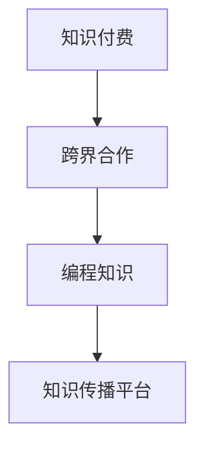

                 

# 程序员如何进行知识付费的跨界合作

## 1. 背景介绍

### 1.1 问题由来
近年来，随着互联网技术的发展，知识付费市场迅速崛起，成为了一种新型的消费模式。特别是对程序员这一高需求、高薪水的职业群体来说，通过知识付费获取有价值的编程知识和技能，成为许多程序员的学习新途径。知识付费不仅满足了程序员对深入学习的渴望，也促进了知识与技术的快速传播和应用。

但是，程序员作为技术工作者，常常面临时间和精力的限制，同时也不习惯于传统的知识学习方式。传统学习方式中，教师往往是知识输出方，而学生则是被动接受方，难以形成良好的互动。然而，知识付费提供了平台化的学习方式，程序员可以自主选择知识付费内容，更加灵活高效地获取所需知识。

### 1.2 问题核心关键点
知识付费跨界合作的核心关键点在于如何构建一个高效、灵活、互动的知识传播平台，通过跨界合作，整合多领域专家的知识和资源，为程序员提供专业、实用的编程知识。这样的平台需要具备以下特点：

1. **内容丰富**：涵盖编程语言、架构设计、项目管理、算法优化等各类编程相关知识。
2. **专家互动**：邀请行业内的专家、企业CTO、技术大牛进行互动直播，提供现场解答和指导。
3. **学习灵活**：支持即时学习、视频回放、离线阅读等多种学习方式，符合程序员的时间安排和习惯。
4. **知识应用**：提供实战项目、代码库、学习社区，让程序员在实践中应用和提升知识。

### 1.3 问题研究意义
知识付费的跨界合作不仅能够促进知识的传播和应用，还能帮助程序员提升技术水平，加速技术创新，提升工作效率，对行业发展和个人成长都具有重要意义。

1. **行业发展**：知识付费能够带动整个IT行业的技术进步和知识传播，提升整个行业的技术水平和生产力。
2. **个人成长**：知识付费为程序员提供了系统、深入的学习资源，帮助他们不断提升自己的技术能力，快速适应市场变化，拓宽职业发展路径。
3. **成本效益**：相比于传统的学习和培训方式，知识付费往往更具成本效益，节省了时间、金钱和资源。
4. **市场机会**：知识付费平台为程序员提供了新的商业模式，如编程教练、技术咨询等，拓宽了职业发展的新机会。

## 2. 核心概念与联系

### 2.1 核心概念概述

为更好地理解知识付费的跨界合作，本节将介绍几个密切相关的核心概念：

- **知识付费**：指用户通过支付一定的费用，获取有价值的知识或技能的服务模式。
- **跨界合作**：指不同领域的专家、企业、平台之间进行合作，共同开发知识付费产品。
- **编程知识**：涵盖编程语言、框架、算法、数据结构、软件开发方法学等多个方面的知识。
- **知识传播平台**：提供在线学习、视频课程、社区互动、专家讲座等功能的平台，用于知识传播和共享。

这些核心概念之间的逻辑关系可以通过以下Mermaid流程图来展示：



这个流程图展示的知识付费的跨界合作的核心概念及其之间的关系：

1. 知识付费是核心驱动方式，通过付费获取知识。
2. 跨界合作是实现方式，不同领域专家和资源整合。
3. 编程知识是内容核心，程序员获取的是编程技能和知识。
4. 知识传播平台是载体，提供学习资源和互动平台。

## 3. 核心算法原理 & 具体操作步骤
### 3.1 算法原理概述

知识付费的跨界合作本质上是一个知识传播和共享的过程，通过跨领域合作，整合各类资源，为程序员提供系统、深入的知识体系。其核心思想是：利用专家的知识，结合平台技术，为用户提供个性化的学习体验和知识服务。

形式化地，假设知识付费平台为 $K$，其中包含专家 $E$、课程 $C$、用户 $U$、平台 $P$。知识付费的传播过程为：

1. 专家 $E$ 提供专业编程知识，形成课程 $C$。
2. 平台 $P$ 提供知识传播和互动服务，整合专家资源，形成知识传播平台。
3. 用户 $U$ 支付费用，通过平台 $P$ 获取课程 $C$，实现知识共享。

知识付费的跨界合作可以简化为如下步骤：

1. 专家资源整合：将专家知识和技能整合为课程。
2. 平台功能设计：设计知识传播平台，支持多种学习方式和互动功能。
3. 用户需求分析：分析程序员的需求和学习习惯，提供个性化的学习方案。
4. 市场推广和运营：通过营销和运营手段，吸引用户加入平台。

### 3.2 算法步骤详解

知识付费的跨界合作一般包括以下几个关键步骤：

**Step 1: 专家资源整合**
- 筛选领域专家，邀请其录制课程或进行直播。
- 确定课程主题和内容，并设计课程大纲。
- 编写脚本和讲义，确保课程内容系统、深入。

**Step 2: 平台功能设计**
- 设计知识传播平台的用户界面和功能。
- 开发课程管理系统，支持课程上传、审核和发布。
- 集成互动功能，如实时问答、弹幕、投票等，增强用户互动体验。
- 支持多种学习方式，如视频课程、文本教程、在线互动等，适应用户需求。

**Step 3: 用户需求分析**
- 调研目标用户群体的需求和学习习惯，设计个性化的学习路径。
- 分析用户行为数据，挖掘学习偏好和需求，提供精准的课程推荐。
- 设计用户反馈机制，收集用户评价和建议，持续优化课程和平台。

**Step 4: 市场推广和运营**
- 制定市场推广策略，通过社交媒体、技术社区等渠道吸引用户。
- 设计会员制度，提供多种会员服务，提升用户粘性。
- 定期组织技术交流、线上活动，增强用户社区的活跃度。
- 引入广告和技术合作，扩大平台的覆盖范围和影响力。

### 3.3 算法优缺点

知识付费的跨界合作具有以下优点：
1. 知识质量高：由行业专家提供专业知识和技能，课程质量有保障。
2. 学习体验好：平台提供多种互动方式，提升学习效率和效果。
3. 覆盖面广：结合多领域专家资源，涵盖编程领域的广泛知识点。
4. 个性化定制：通过用户行为分析，提供个性化的学习方案，提高学习效率。
5. 可操作性强：平台提供了即时的学习互动，易于上手和操作。

同时，该方法也存在一定的局限性：
1. 专家资源获取难度大：邀请专家录制课程和进行直播需要付出较高成本。
2. 课程内容更新慢：知识传播需要时间，课程内容更新速度较慢。
3. 用户粘性低：部分用户可能对课程内容不满意，缺乏持续学习的动力。
4. 技术壁垒高：平台功能设计和开发需要较高的技术水平。
5. 推广成本高：市场推广需要大量的营销投入，成本较高。

尽管存在这些局限性，但就目前而言，知识付费的跨界合作已成为知识传播和技能学习的重要手段。未来相关研究的重点在于如何进一步降低获取专家资源的成本，提高课程内容的更新速度，增强用户粘性，降低推广成本，并提高平台的可操作性。

### 3.4 算法应用领域

知识付费的跨界合作已经广泛应用于各种技术培训和知识传播场景，例如：

- 软件开发培训：涵盖Java、Python、C++等编程语言和框架。
- 架构设计：涵盖微服务、分布式系统、DevOps等架构技术。
- 算法和数据结构：涵盖排序、搜索、图论等算法和数据结构。
- 项目管理：涵盖敏捷开发、Scrum、Kanban等项目管理方法。
- 人工智能和机器学习：涵盖深度学习、自然语言处理、计算机视觉等技术。

除了上述这些经典领域外，知识付费的跨界合作还在不断扩展，如云计算、大数据、区块链、物联网等新兴领域。随着技术的发展和市场的扩展，知识付费的跨界合作将在更多领域得到应用，为技术培训和知识传播带来新的机遇。

## 4. 数学模型和公式 & 详细讲解 & 举例说明

### 4.1 数学模型构建

知识付费的跨界合作涉及多个实体之间的交互，可以构建如下数学模型：

设知识付费平台为 $K$，专家为 $E$，课程为 $C$，用户为 $U$，平台系统为 $P$。则知识付费的过程可以表示为：

$$
K = \{E, C, U, P\}
$$

其中，专家 $E$ 提供课程 $C$，用户 $U$ 通过平台 $P$ 获取课程，平台 $P$ 提供互动和服务。

### 4.2 公式推导过程

设专家 $E$ 提供课程 $C$ 的平均质量为 $Q_E$，平台 $P$ 的平均服务质量为 $Q_P$，用户 $U$ 的平均满意度为 $S_U$。则知识付费的效果可以表示为：

$$
E(K) = Q_E \times Q_P
$$

其中，$E(K)$ 为知识付费的效果，$Q_E$ 和 $Q_P$ 分别为专家和平台的贡献。

设用户 $U$ 的平均满意度为 $S_U$，用户满意度与课程质量和服务质量成正比，即：

$$
S_U = f(Q_E, Q_P)
$$

其中，$f$ 为满意度函数，可通过调查问卷等方式确定。

知识付费的效果与专家、平台、用户满意度成正比，即：

$$
E(K) = Q_E \times Q_P = Q_E \times f(Q_E, Q_P)
$$

即：

$$
E(K) = Q_E^2 \times f(Q_E, Q_P)
$$

通过优化专家和平台的质量，可以提升知识付费的效果。

### 4.3 案例分析与讲解

以下以一个简化的案例进行分析：

假设某知识付费平台邀请三位专家 $E_1, E_2, E_3$，分别录制了3门课程 $C_1, C_2, C_3$。用户 $U$ 通过平台 $P$ 获取课程。

设专家 $E_i$ 提供的课程 $C_i$ 的平均质量为 $Q_i$，平台 $P$ 的平均服务质量为 $Q_P$。用户 $U$ 的平均满意度为 $S_U$。则知识付费的效果可以表示为：

$$
E(K) = Q_1 \times Q_2 \times Q_3 \times Q_P = Q_E \times Q_P
$$

其中，$Q_E = Q_1 \times Q_2 \times Q_3$ 为专家提供的课程平均质量，$Q_P$ 为平台提供的平均服务质量。

设用户 $U$ 的满意度与课程质量和服务质量成正比，即 $S_U = f(Q_E, Q_P)$。通过调查问卷得知 $f(Q_E, Q_P) = 0.5 \times Q_E \times Q_P$，则：

$$
S_U = 0.5 \times Q_E \times Q_P
$$

知识付费的效果可以表示为：

$$
E(K) = Q_E \times S_U = Q_E \times 0.5 \times Q_E \times Q_P = 0.5 \times Q_E^2 \times Q_P
$$

通过优化专家和平台的质量，可以提升知识付费的效果。例如，提升专家提供的课程质量 $Q_E$ 或平台的平均服务质量 $Q_P$，都会提升整体效果 $E(K)$。

## 5. 项目实践：代码实例和详细解释说明
### 5.1 开发环境搭建

在进行知识付费平台开发前，我们需要准备好开发环境。以下是使用Python进行Django开发的环境配置流程：

1. 安装Anaconda：从官网下载并安装Anaconda，用于创建独立的Python环境。

2. 创建并激活虚拟环境：
```bash
conda create -n pyproject python=3.8 
conda activate pyproject
```

3. 安装Django：通过pip安装Django，用于搭建知识付费平台的后台管理系统。

```bash
pip install django
```

4. 安装必要的依赖：
```bash
pip install pillow
```

完成上述步骤后，即可在`pyproject`环境中开始知识付费平台的开发。

### 5.2 源代码详细实现

下面我们以知识付费平台的用户注册和登录为例，给出使用Django进行开发的全流程代码实现。

首先，创建用户模型和认证系统：

```python
from django.contrib.auth.models import AbstractUser
from django.db import models
from django.contrib.auth import get_user_model

User = get_user_model()

class Profile(models.Model):
    user = models.OneToOneField(User, on_delete=models.CASCADE)
    name = models.CharField(max_length=100, blank=True)
    email = models.EmailField(max_length=254, blank=True)
    bio = models.TextField(max_length=500, blank=True)
    website = models.URLField(max_length=200, blank=True)

    def __str__(self):
        return self.user.username
```

然后，定义用户注册和登录视图：

```python
from django.contrib.auth import login, authenticate

def signup(request):
    if request.method == 'POST':
        form = UserRegisterForm(request.POST)
        if form.is_valid():
            form.save()
            username = form.cleaned_data.get('username')
            raw_password = form.cleaned_data.get('password1')
            user = authenticate(username=username, password=raw_password)
            login(request, user)
            return redirect('home')
    else:
        form = UserRegisterForm()
    return render(request, 'user/register.html', {'form': form})

def login_view(request):
    if request.method == 'POST':
        username = request.POST['username']
        password = request.POST['password']
        user = authenticate(request, username=username, password=password)
        if user is not None:
            login(request, user)
            return redirect('home')
        else:
            return render(request, 'user/login.html')
    return render(request, 'user/login.html')
```

最后，启动知识付费平台的用户注册和登录流程：

```python
from django.urls import path
from . import views

urlpatterns = [
    path('signup/', views.signup, name='signup'),
    path('login/', views.login_view, name='login'),
]
```

通过上述代码，即可实现知识付费平台的用户注册和登录功能。用户注册完成后，自动登录到知识付费平台首页。

### 5.3 代码解读与分析

让我们再详细解读一下关键代码的实现细节：

**User模型和Profile模型**：
- `User` 模型继承自Django内置的 `AbstractUser`，定义了用户的基本信息。
- `Profile` 模型通过 OneToOneField 关联到 `User` 模型，定义了用户的基本信息，如姓名、邮箱、简介、个人主页等。

**UserRegisterForm和login_view函数**：
- `UserRegisterForm` 使用 Django 表单，用于用户注册。
- `login_view` 函数实现了用户登录逻辑，通过 `authenticate` 函数验证用户名和密码，若验证通过则登录用户。

**注册和登录视图的URL配置**：
- 使用 Django 的 `path` 函数配置了用户注册和登录的URL路由，并与相应的视图函数关联。

完成以上步骤后，即可在`pyproject`环境中启动知识付费平台的用户注册和登录功能。

## 6. 实际应用场景
### 6.1 技术培训平台

知识付费的跨界合作在技术培训领域具有广泛的应用前景。传统技术培训需要大量的资金、人力和时间投入，而知识付费平台能够提供高质量的培训课程，实现知识的高效传播和共享。

例如，某科技公司可以为程序员提供系统化的编程培训课程，涵盖各种编程语言、框架、算法等。同时邀请行业专家录制课程，并结合平台技术，提供互动和实时答疑服务，帮助程序员快速提升技术水平。

### 6.2 企业内部培训

知识付费的跨界合作同样适用于企业内部培训。企业可以通过知识付费平台，整合内外部专家资源，为员工提供个性化的培训方案，提升员工的技能水平和工作效率。

例如，某金融公司可以邀请技术专家录制数据分析、算法优化等课程，结合平台互动功能，实时答疑解惑，帮助员工在实际工作中应用所学知识，提升业务能力。

### 6.3 在线学习社区

知识付费的跨界合作还可以构建在线学习社区，为程序员提供交流和学习的平台。社区成员可以通过平台分享和交流编程经验和心得，互相学习和提升。

例如，某开源社区可以为程序员提供编程知识的在线学习平台，邀请行业专家进行技术分享，同时社区成员可以上传代码、项目，互相学习和合作。

### 6.4 未来应用展望

随着知识付费的跨界合作不断发展，未来将呈现以下几个趋势：

1. **课程内容丰富化**：知识付费平台将涵盖更多的技术领域，如人工智能、大数据、区块链等，为用户提供更多学习选择。
2. **专家资源多样化**：除了技术专家，还将有更多领域专家参与，如产品经理、销售顾问等，提升平台的综合价值。
3. **互动方式多样化**：除了直播和视频课程，还将有更多互动方式，如在线问答、编程挑战等，增强用户学习体验。
4. **学习模式个性化**：通过用户行为数据分析，提供个性化的学习路径和推荐，提升学习效果。
5. **知识应用化**：提供更多实战项目、开源代码等，让用户在实践中应用和提升所学知识。

## 7. 工具和资源推荐
### 7.1 学习资源推荐

为了帮助开发者系统掌握知识付费的跨界合作，这里推荐一些优质的学习资源：

1. **Django官方文档**：Django的官方文档提供了详细的开发教程和示例，适合新手入门。
2. **《Django实战》**：实战书籍，结合Django开发实践，帮助开发者提升编程技能。
3. **Coursera编程课程**：Coursera提供了多门编程相关的在线课程，涵盖多种编程语言和技术栈。
4. **GitHub开源项目**：GitHub是程序员交流学习的平台，开源项目提供了大量的学习资源和代码库。
5. **技术博客和社区**：如Medium、Stack Overflow等平台，提供了丰富的技术文章和社区交流，帮助开发者提升技术水平。

通过对这些资源的学习实践，相信你一定能够快速掌握知识付费的跨界合作技术，并用于解决实际的编程问题。

### 7.2 开发工具推荐

高效的开发离不开优秀的工具支持。以下是几款用于知识付费平台开发的常用工具：

1. Django：基于Python的Web框架，灵活高效的开发方式，适用于开发知识付费平台的后端系统。
2. Git：版本控制系统，适合管理开发过程中的代码变更和团队协作。
3. GitHub/GitLab：代码托管平台，提供协作、版本控制、代码审查等功能，适合知识付费平台的代码管理和项目管理。
4. Jenkins：开源持续集成工具，支持构建、测试和部署，提升开发效率。
5. Docker：容器化技术，便于知识付费平台的快速部署和扩展。

合理利用这些工具，可以显著提升知识付费平台的开发效率，加快创新迭代的步伐。

### 7.3 相关论文推荐

知识付费的跨界合作涉及多方面的技术和方法，以下是几篇奠基性的相关论文，推荐阅读：

1. **《软件即服务：在线教育平台的建设与管理》**：探讨在线教育平台的建设和管理，提供技术和管理经验。
2. **《知识付费模式与技术应用研究》**：研究知识付费模式和技术应用，提供理论和实践参考。
3. **《在线学习平台的课程推荐算法》**：探讨在线学习平台的课程推荐算法，提升用户学习体验。
4. **《编程学习社区的社交网络分析》**：研究编程学习社区的社交网络，提升社区的活跃度和学习效果。
5. **《基于知识图谱的在线学习资源推荐》**：研究基于知识图谱的在线学习资源推荐，提升推荐效果和精准度。

这些论文代表了大语言模型微调技术的发展脉络。通过学习这些前沿成果，可以帮助研究者把握学科前进方向，激发更多的创新灵感。

## 8. 总结：未来发展趋势与挑战
### 8.1 总结

本文对知识付费的跨界合作进行了全面系统的介绍。首先阐述了知识付费的核心概念和研究背景，明确了知识付费跨界合作的独特价值。其次，从原理到实践，详细讲解了知识付费的跨界合作流程和具体步骤，给出了知识付费平台开发的完整代码实例。同时，本文还探讨了知识付费在技术培训、企业内部培训、在线学习社区等多个领域的应用前景，展示了知识付费跨界合作的广阔前景。

通过本文的系统梳理，可以看到，知识付费的跨界合作正在成为技术传播和技能学习的强大引擎，极大地促进了技术的普及和应用。知识付费平台不仅为用户提供高质量的课程资源，还提供了实时互动和个性化学习体验，满足了程序员对深入学习和技能提升的需求。未来，知识付费跨界合作的发展将进一步拓展编程技术的传播路径，推动行业技术进步和创新。

### 8.2 未来发展趋势

展望未来，知识付费的跨界合作将呈现以下几个发展趋势：

1. **技术融合加速**：知识付费平台将与其他技术深度融合，如大数据、人工智能、区块链等，提升平台的综合能力。
2. **内容质量提升**：知识付费平台将更加注重课程质量和内容创新，提供更多高价值、高体验的课程内容。
3. **用户互动增强**：通过增加实时互动和社区交流功能，提升用户的学习体验和粘性。
4. **个性化学习深入**：通过用户行为数据分析，提供更加个性化的学习路径和推荐，提升学习效果。
5. **知识应用多样化**：结合实战项目、开源代码等，让用户在实践中应用和提升所学知识。
6. **全球化扩展**：知识付费平台将面向全球市场，吸引更多国际用户，拓展市场范围。

以上趋势凸显了知识付费跨界合作的巨大潜力和未来发展方向。这些方向的探索发展，必将进一步提升技术传播和学习的质量和效率，促进技术创新和应用推广。

### 8.3 面临的挑战

尽管知识付费的跨界合作已经取得了瞩目成就，但在迈向更加智能化、普适化应用的过程中，它仍面临着诸多挑战：

1. **内容质量控制**：课程质量和学习体验取决于专家和平台的技术水平，需要持续改进和优化。
2. **用户需求多样**：不同用户群体的需求差异较大，难以统一课程内容和形式。
3. **互动效果提升**：实时互动和社区交流功能需要进一步增强，提升用户学习体验。
4. **市场竞争激烈**：知识付费市场竞争激烈，需要不断创新和优化，提升平台竞争力。
5. **推广成本高昂**：市场推广需要大量的营销投入，成本较高。
6. **平台技术复杂**：知识付费平台的开发需要多方面的技术支持，技术复杂度高。

正视知识付费面临的这些挑战，积极应对并寻求突破，将是大语言模型微调走向成熟的必由之路。相信随着学界和产业界的共同努力，这些挑战终将一一被克服，知识付费跨界合作必将在构建人机协同的智能时代中扮演越来越重要的角色。

### 8.4 未来突破

面对知识付费的跨界合作所面临的种种挑战，未来的研究需要在以下几个方面寻求新的突破：

1. **内容质量提升**：加强课程内容和质量的审核和优化，提升课程的专业性和系统性。
2. **用户需求分析**：通过用户行为数据分析，提供更加个性化和精准的课程推荐。
3. **互动效果增强**：增加实时互动和社区交流功能，提升用户学习体验和粘性。
4. **平台技术创新**：引入最新技术和工具，提升平台的性能和功能。
5. **市场推广创新**：采用更高效的营销手段，降低推广成本，提升用户转化率。
6. **技术生态建设**：构建完整的技术生态系统，提供一站式的学习平台，提升用户体验。

这些研究方向的探索，必将引领知识付费的跨界合作技术迈向更高的台阶，为技术传播和知识学习带来新的机遇。面向未来，知识付费的跨界合作需要在内容、技术、用户和市场等多个维度进行全面优化和创新，才能真正实现知识的有效传播和应用。

## 9. 附录：常见问题与解答
**Q1：知识付费平台如何保证课程质量？**

A: 知识付费平台可以通过以下方式保证课程质量：
1. 专家筛选和审核：邀请行业内知名的专家和专家团队录制课程，通过专家评审保证课程的专业性和系统性。
2. 用户反馈机制：建立用户反馈和评价系统，收集用户对课程的评价和建议，持续优化课程内容。
3. 课程更新机制：定期更新课程内容，添加最新的知识和技能，提升课程的时效性和实用性。

**Q2：知识付费平台如何提升用户互动效果？**

A: 知识付费平台可以通过以下方式提升用户互动效果：
1. 实时互动功能：增加实时问答、在线讨论等互动功能，增强用户之间的互动和交流。
2. 社区交流机制：建立用户社区，提供课程讨论、经验分享等社区交流功能，增强用户粘性和社区活跃度。
3. 课程评论和评分：提供课程评论和评分功能，让用户参与课程评价，提升课程质量。
4. 虚拟教室和直播互动：通过虚拟教室和直播互动，提升课程的实时性和互动性。

**Q3：知识付费平台如何降低推广成本？**

A: 知识付费平台可以通过以下方式降低推广成本：
1. 精准营销：通过用户行为数据分析，进行精准的课程推荐和广告投放，提升广告的转化率。
2. 社交媒体推广：利用社交媒体平台进行课程推广，吸引更多用户关注和参与。
3. 合作伙伴推广：与技术社区、教育机构等进行合作推广，扩大平台的覆盖范围。
4. 优惠和促销活动：通过优惠和促销活动，吸引更多用户订阅和购买课程。

**Q4：知识付费平台如何提升内容质量？**

A: 知识付费平台可以通过以下方式提升内容质量：
1. 专家团队：邀请行业内的专家和专家团队录制课程，保证课程的专业性和系统性。
2. 课程审核机制：建立课程审核机制，确保课程内容符合质量标准。
3. 用户反馈机制：建立用户反馈和评价系统，收集用户对课程的评价和建议，持续优化课程内容。
4. 课程更新机制：定期更新课程内容，添加最新的知识和技能，提升课程的时效性和实用性。

**Q5：知识付费平台如何提升用户学习效果？**

A: 知识付费平台可以通过以下方式提升用户学习效果：
1. 个性化学习路径：通过用户行为数据分析，提供个性化的学习路径和推荐，提升学习效果。
2. 实时互动功能：增加实时问答、在线讨论等互动功能，增强用户之间的互动和交流。
3. 社区交流机制：建立用户社区，提供课程讨论、经验分享等社区交流功能，增强用户粘性和社区活跃度。
4. 课程评论和评分：提供课程评论和评分功能，让用户参与课程评价，提升课程质量。
5. 虚拟教室和直播互动：通过虚拟教室和直播互动，提升课程的实时性和互动性。

这些问题的解答，可以帮助开发者更好地理解和应用知识付费的跨界合作技术，实现知识的高效传播和共享，提升编程技术的普及和应用。

