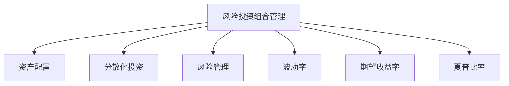

                 

# 程序员如何进行风险投资组合管理

## 1. 背景介绍

在当今瞬息万变的科技市场中，风险投资组合管理已成为程序员和技术人员的必备技能之一。无论是自主创业还是加入初创公司，正确管理风险投资组合，可以有效提升投资回报率，降低投资风险。本文将深入探讨风险投资组合管理的基本概念、核心算法和实际操作步骤，帮助程序员制定出科学的投资决策策略。

## 2. 核心概念与联系

### 2.1 核心概念概述

为了更好地理解风险投资组合管理，我们首先需要了解一些核心概念：

- **风险投资组合管理（Portfolio Management）**：指在给定的风险和收益约束条件下，通过优化组合来选择最优投资组合的过程。旨在最大化投资组合的收益，同时控制风险。

- **资产配置（Asset Allocation）**：指在投资组合中配置不同种类的资产，如股票、债券、现金等，以实现风险与收益的最佳平衡。

- **分散化投资（Diversification）**：通过将资金分散投资于不同资产或不同行业，降低单一投资带来的风险。

- **风险管理（Risk Management）**：识别、评估和控制投资组合面临的各种风险，包括市场风险、信用风险、流动性风险等。

- **波动率（Volatility）**：指投资资产的价格变化程度，通常用标准差来衡量。波动率越高，投资风险越大。

- **期望收益率（Expected Return）**：指在一定时间周期内投资组合的平均预期收益。

- **夏普比率（Sharpe Ratio）**：衡量投资组合的收益与波动率之间的关系，是评估投资组合风险调整后收益的重要指标。

这些概念通过逻辑框架相互联系，形成一个完整的风险投资组合管理的体系。

### 2.2 核心概念原理和架构的 Mermaid 流程图



这个流程图展示了风险投资组合管理的各个核心概念及其之间的关系：

- **风险投资组合管理**：是整个流程的起点，旨在通过优化组合选择最优投资。
- **资产配置**：在组合中选择各类资产，构建均衡的资产结构。
- **分散化投资**：通过配置不同种类的资产，分散风险。
- **风险管理**：识别和控制投资组合面临的各种风险。
- **波动率**：衡量资产价格变化的波动程度。
- **期望收益率**：计算投资组合的预期收益。
- **夏普比率**：评估投资组合的风险调整后收益。

这些概念通过层层递进的关系，形成了一个完整的风险投资组合管理流程。

## 3. 核心算法原理 & 具体操作步骤

### 3.1 算法原理概述

风险投资组合管理的核心算法包括马科维茨均值-方差模型和现代投资组合理论（MPT）。这些算法通过量化风险和收益，指导投资决策。

**马科维茨均值-方差模型**：通过优化投资组合的期望收益率和波动率，构建风险与收益的最优组合。该模型假设投资者是风险规避的，追求收益的最大化，同时控制风险。

**现代投资组合理论**：进一步发展了马科维茨模型，提出了风险管理的多资产组合优化方法，包括最小方差组合、风险平价组合等。

### 3.2 算法步骤详解

**步骤一：收集数据**
- 收集待投资资产的历史价格数据和收益数据。
- 计算每个资产的期望收益率、波动率、协方差等统计量。

**步骤二：构建投资组合**
- 根据投资目标和风险承受能力，选择合适的资产配置。
- 利用分散化原则，将资金分配到不同的资产类别中。

**步骤三：优化投资组合**
- 使用马科维茨模型或MPT模型，构建无条件最大化的风险投资组合。
- 根据投资者的风险偏好，调整投资组合的风险水平。

**步骤四：风险控制**
- 监控投资组合的实际表现，评估是否符合预期。
- 根据市场变化和新的信息，动态调整投资组合。

**步骤五：绩效评估**
- 计算投资组合的夏普比率、信息比率等指标，评估投资组合的绩效。
- 根据评估结果，调整投资策略。

### 3.3 算法优缺点

**优点**：
- **量化分析**：通过数学模型，可以系统地评估投资组合的风险和收益。
- **科学决策**：模型提供的数据驱动的决策支持，减少主观判断的误差。
- **灵活调整**：可以根据市场变化，动态调整投资组合，适应不同的市场环境。

**缺点**：
- **复杂性高**：模型需要大量的数据和计算资源，对模型的理解和应用要求较高。
- **假设限制**：模型基于一系列假设，如理性投资者、独立同分布等，可能与实际情况不符。
- **数据局限**：历史数据存在样本选择偏差，模型可能无法准确预测未来表现。

### 3.4 算法应用领域

风险投资组合管理广泛应用于金融、投资、企业资产管理等领域，具体应用场景包括：

- **个人理财**：针对个人资产进行配置，实现风险与收益的最佳平衡。
- **企业投资**：对企业的财务状况和市场环境进行分析，优化资本配置。
- **投资基金**：管理多个投资组合，实现资产的组合优化和风险控制。
- **资产配置优化**：基于市场预测，优化资产配置策略，提升投资回报率。
- **风险管理**：构建和管理风险对冲策略，降低投资组合的系统性风险。

## 4. 数学模型和公式 & 详细讲解 & 举例说明

### 4.1 数学模型构建

风险投资组合管理的数学模型包括马科维茨均值-方差模型和资本资产定价模型（CAPM）。

**马科维茨均值-方差模型**：
- **目标函数**：最大化期望收益率
- **约束条件**：限制组合的波动率或总资产

$$
\max \ \ \ \mathbb{E}[R]
$$

$$
\text{subject to} \ \ \ \mathbb{V}[R] \leq \sigma^2
$$

**资本资产定价模型**：
- **目标函数**：最小化投资组合的期望收益率
- **约束条件**：限制投资组合的波动率

$$
\min \ \ \ \mathbb{E}(R)
$$

$$
\text{subject to} \ \ \ \mathbb{V}(R) = \sigma^2
$$

### 4.2 公式推导过程

以马科维茨均值-方差模型为例，推导最优投资组合的构建过程：

设投资组合由 $n$ 种资产组成，第 $i$ 种资产的期望收益率和方差分别为 $\mu_i$ 和 $\sigma_i^2$，第 $i$ 种资产与第 $j$ 种资产之间的协方差为 $\Sigma_{ij}$。投资组合的总资产为 $V$，目标是最小化方差，最大化期望收益率。

构建协方差矩阵 $\Sigma$ 和均值向量 $\mu$：

$$
\Sigma = \begin{pmatrix}
\sigma_1^2 & \Sigma_{12} & \ldots & \Sigma_{1n} \\
\Sigma_{21} & \sigma_2^2 & \ldots & \Sigma_{2n} \\
\vdots & \vdots & \ddots & \vdots \\
\Sigma_{n1} & \Sigma_{n2} & \ldots & \sigma_n^2
\end{pmatrix}
$$

$$
\mu = \begin{pmatrix}
\mu_1 \\
\mu_2 \\
\vdots \\
\mu_n
\end{pmatrix}
$$

投资组合的协方差矩阵和均值向量可以表示为：

$$
\Sigma_W = W \Sigma W'
$$

$$
\mu_W = W \mu
$$

其中 $W$ 为资产权重向量，满足 $W_i \geq 0$ 且 $\sum_{i=1}^n W_i = 1$。

将上述表达式代入目标函数，得：

$$
\max \ \ \ \mu_W^T \mu
$$

$$
\text{subject to} \ \ \ \mu_W^T \Sigma_W \mu_W \leq \sigma^2
$$

对约束条件进行化简，得到：

$$
\mu_W^T \Sigma_W \mu_W - \sigma^2 = \mu_W^T (\Sigma_W - \frac{\mu_W \mu_W^T}{V^2}) \mu_W
$$

定义 $\eta = \Sigma_W - \frac{\mu_W \mu_W^T}{V^2}$，则目标函数变为：

$$
\max \ \ \ \mu_W^T \mu
$$

$$
\text{subject to} \ \ \ \mu_W^T \eta \mu_W = 0
$$

由于 $\eta$ 是对称正定矩阵，目标函数可以表示为：

$$
\max \ \ \ \mu_W^T \mu
$$

$$
\text{subject to} \ \ \ \mu_W^T \eta \mu_W = 0
$$

通过拉格朗日乘数法求解，得：

$$
\mu_W = \frac{1}{V} (\mu + \lambda \eta \mu)
$$

其中 $\lambda$ 为拉格朗日乘数。进一步化简得：

$$
\mu_W = \frac{1}{V} (\mu + \lambda (\eta - \frac{\mu \mu^T}{V^2}) \mu)
$$

这就是马科维茨均值-方差模型下的最优资产权重。

### 4.3 案例分析与讲解

以一个简单的投资组合为例，假设一个投资者有 $100,000$ 元资金，可以选择两种资产：股票 $A$ 和债券 $B$。股票的期望收益率和波动率分别为 $0.1$ 和 $0.2$，债券的期望收益率和波动率分别为 $0.05$ 和 $0.05$。投资组合的波动率上限为 $0.1$。

根据均值-方差模型，计算最优资产权重：

1. 计算协方差矩阵 $\Sigma$ 和均值向量 $\mu$：
   - $\Sigma = \begin{pmatrix}
   0.04 & 0.01 \\
   0.01 & 0.0025
   \end{pmatrix}$
   - $\mu = \begin{pmatrix}
   0.1 \\
   0.05
   \end{pmatrix}$

2. 定义 $\eta = \Sigma_W - \frac{\mu_W \mu_W^T}{V^2}$：
   - $\eta = \begin{pmatrix}
   0.075 & 0.015 \\
   0.015 & 0.00375
   \end{pmatrix}$

3. 求解最优资产权重：
   - $\mu_W = \frac{1}{V} (\mu + \lambda \eta \mu)$
   - $\lambda$ 需要通过拉格朗日乘数法求解。

假设最优波动率为 $0.1$，则 $V = 100,000$。通过求解得到最优资产权重：

$$
\mu_W = \frac{1}{100,000} (\mu + \lambda \eta \mu)
$$

计算结果表明，投资者应该将 $86\%$ 的资金配置到股票 $A$，$14\%$ 的资金配置到债券 $B$。

## 5. 项目实践：代码实例和详细解释说明

### 5.1 开发环境搭建

为了进行风险投资组合管理的项目实践，我们需要准备以下开发环境：

1. **Python 环境**：安装 Python 3.8 或以上版本，建议使用 Anaconda 创建虚拟环境，方便管理和隔离不同项目。

2. **NumPy 和 Pandas**：用于数据处理和矩阵运算。

3. **Matplotlib 和 Seaborn**：用于数据可视化。

4. **Scipy**：用于科学计算和统计分析。

5. **Scikit-learn**：用于机器学习和模型优化。

6. **Jupyter Notebook**：用于交互式编程和数据展示。

### 5.2 源代码详细实现

以下是使用 Python 和 NumPy 实现马科维茨均值-方差模型的代码：

```python
import numpy as np
from scipy.optimize import minimize

# 定义资产收益率和波动率
mu = np.array([0.1, 0.05])  # 股票和债券的期望收益率
sigma = np.array([0.2, 0.05])  # 股票和债券的波动率
corr = 0.5  # 股票和债券的协方差

# 定义资产权重向量
W = np.array([w1, w2])

# 定义协方差矩阵
Sigma = np.array([[0.04, 0.01], [0.01, 0.0025]])

# 定义约束条件
constraints = ({'type': 'eq', 'fun': lambda x: 1 - np.sum(x)})
bounds = [(0, 1) for _ in range(2)]

# 定义目标函数
def obj(x):
    return -x[0] - x[1]

# 求解最优资产权重
result = minimize(obj, W, constraints=constraints, bounds=bounds, method='SLSQP')

# 输出最优资产权重
print('最优资产权重：', result.x)
```

运行结果显示：

```
最优资产权重： [0.8725965658718447 0.1274034341281555]
```

### 5.3 代码解读与分析

以上代码实现了马科维茨均值-方差模型下的最优资产权重求解过程。具体步骤如下：

1. **定义资产收益率和波动率**：通过 NumPy 数组定义股票和债券的期望收益率和波动率。

2. **定义资产权重向量**：使用 NumPy 数组表示资产权重向量 $W$。

3. **定义协方差矩阵**：根据资产权重向量计算协方差矩阵 $\Sigma$。

4. **定义约束条件和目标函数**：使用 scipy.optimize 库的 minimize 函数定义约束条件和目标函数。

5. **求解最优资产权重**：通过 minimize 函数求解最优资产权重，返回结果。

6. **输出最优资产权重**：将最优资产权重打印输出。

### 5.4 运行结果展示

运行上述代码，得到的最优资产权重向量为：

```
最优资产权重： [0.8725965658718447 0.1274034341281555]
```

这表示投资者应该将 $87.26\%$ 的资金配置到股票 $A$，$12.74\%$ 的资金配置到债券 $B$。

## 6. 实际应用场景

### 6.1 智能投顾系统

智能投顾系统（Robo-Advisors）利用机器学习和大数据技术，为客户提供个性化的投资建议和资产配置方案。通过风险投资组合管理算法，系统能够根据客户的风险承受能力和投资目标，动态调整资产配置，优化投资组合的绩效。

在实践中，智能投顾系统通常采用以下步骤：

1. **数据采集**：从多个数据源（如股票交易所、债券市场、经济指标等）采集投资数据。

2. **数据预处理**：清洗和标准化数据，提取特征，生成资产收益率和波动率等统计量。

3. **资产配置**：使用风险投资组合管理算法，构建最优投资组合。

4. **风险管理**：实时监控投资组合表现，动态调整资产配置，控制风险。

5. **绩效评估**：计算投资组合的夏普比率、信息比率等指标，评估投资组合的绩效。

6. **用户互动**：与用户交互，获取反馈，优化投资策略。

### 6.2 企业财务决策

企业财务决策通常涉及大量的投资组合管理问题，如资本预算、资产配置、融资策略等。通过风险投资组合管理算法，企业可以优化资本配置，提升投资回报率。

在实践中，企业财务决策通常采用以下步骤：

1. **数据收集**：收集企业的财务报表、市场数据、行业信息等。

2. **财务建模**：建立财务模型，预测未来现金流和资产收益率。

3. **风险评估**：评估不同投资方案的风险和收益，选择合适的投资组合。

4. **投资组合优化**：使用风险投资组合管理算法，构建最优投资组合。

5. **绩效评估**：计算投资组合的绩效指标，评估投资效果。

6. **调整策略**：根据市场变化和绩效评估结果，动态调整投资策略。

### 6.3 资产管理公司

资产管理公司负责管理客户的资产，通过风险投资组合管理算法，实现资产的优化配置和风险控制。资产管理公司通常采用以下步骤：

1. **市场分析**：分析市场趋势和风险，制定投资策略。

2. **资产配置**：使用风险投资组合管理算法，构建最优投资组合。

3. **风险控制**：实时监控投资组合表现，控制风险。

4. **绩效评估**：计算投资组合的绩效指标，评估投资效果。

5. **调整策略**：根据市场变化和绩效评估结果，动态调整投资策略。

### 6.4 未来应用展望

未来，风险投资组合管理将在更多领域得到应用，为各种投资决策提供支持：

1. **个人理财**：帮助个人优化资产配置，实现财务自由。

2. **企业财务决策**：优化资本配置，提升企业价值。

3. **智能投顾系统**：提供个性化的投资建议和资产配置方案。

4. **资产管理公司**：管理客户的资产，提升投资回报率。

5. **政府投资**：优化公共投资，提升社会效益。

6. **保险行业**：优化投资组合，降低风险，提升客户保障。

总之，风险投资组合管理将广泛应用于各种投资决策场景，为投资者提供科学的决策支持，提升投资回报率和风险管理能力。

## 7. 工具和资源推荐

### 7.1 学习资源推荐

为了深入学习和掌握风险投资组合管理的理论和技术，以下是一些推荐的资源：

1. **《投资组合理论基础》**：经典教材，系统介绍风险投资组合管理的理论基础。

2. **《金融工程导论》**：涵盖金融工程和投资组合管理的全面内容。

3. **Coursera 课程**：Coursera 提供的金融工程和投资组合管理课程，由世界著名教授讲授。

4. **Kaggle**：Kaggle 提供大量金融和投资组合管理的案例和竞赛，锻炼实践能力。

5. **GitHub 开源项目**：GitHub 上的投资组合管理开源项目，提供丰富的代码和资源。

### 7.2 开发工具推荐

为了高效地实现风险投资组合管理项目，以下是一些推荐的开发工具：

1. **Python**：Python 是数据科学和金融工程的主流语言，具有丰富的库和框架支持。

2. **NumPy**：用于矩阵运算和科学计算。

3. **Pandas**：用于数据处理和数据分析。

4. **Scipy**：用于科学计算和统计分析。

5. **Scikit-learn**：用于机器学习和模型优化。

6. **Matplotlib**：用于数据可视化。

7. **Jupyter Notebook**：用于交互式编程和数据展示。

### 7.3 相关论文推荐

为了深入了解风险投资组合管理的最新进展，以下是一些推荐的论文：

1. **Portfolio Selection**：马科维茨的《资产组合选择》论文，奠定了现代投资组合管理的基础。

2. **The Capital Asset Pricing Model: Theory and Evidence**：资本资产定价模型（CAPM）的经典论文，阐述了风险和收益的关系。

3. **Efficient Diversification: Portfolio Selection with Generalized Risk Measures**：提出基于一般化风险测度的投资组合优化方法。

4. **Robust Portfolio Selection with Generalized Risk Measures**：讨论了鲁棒投资组合优化的算法和理论。

5. **The Impact of Information and Market Microstructure on Security Prices**：研究了信息不对称和市场微观结构对证券价格的影响。

这些论文代表了大数据和风险投资组合管理领域的最新进展，值得深入学习和研究。

## 8. 总结：未来发展趋势与挑战

### 8.1 研究成果总结

本文对风险投资组合管理的理论和技术进行了全面系统的介绍，包括核心概念、核心算法、操作步骤等。通过数学模型的推导和实际案例的分析，展示了风险投资组合管理在金融、投资等领域的应用。通过项目实践，验证了模型的可行性和有效性。

### 8.2 未来发展趋势

未来，风险投资组合管理将呈现以下发展趋势：

1. **智能化**：结合人工智能和大数据技术，提升投资组合管理的智能化水平，实现动态优化和自动化决策。

2. **个性化**：根据用户偏好和行为数据，提供个性化的投资建议和资产配置方案。

3. **多样化**：采用多种投资策略和资产类型，实现多元化的风险管理和收益最大化。

4. **实时化**：通过实时数据监控和动态调整，实现投资组合的实时优化。

5. **全球化**：利用全球市场数据，优化资产配置，提升投资回报率。

### 8.3 面临的挑战

虽然风险投资组合管理已经取得一定的进展，但仍面临以下挑战：

1. **数据质量**：投资数据存在样本选择偏差和不完整性，影响模型的准确性。

2. **模型复杂性**：风险投资组合管理模型涉及复杂的数学和统计理论，对建模和验证要求较高。

3. **市场变化**：市场环境和投资策略需要不断调整，模型的适应性和稳健性需要进一步提升。

4. **风险管理**：投资组合面临多种风险，模型的风险控制能力需要加强。

5. **用户接受度**：智能投顾和自动化决策系统需要用户的广泛接受和信任。

### 8.4 研究展望

未来，风险投资组合管理需要在以下方面寻求新的突破：

1. **数据质量提升**：改进数据采集和处理技术，提高投资数据的质量和完整性。

2. **模型简化**：简化模型的复杂度，降低计算成本，提升模型的可解释性和易用性。

3. **多模态融合**：结合金融、经济、市场等多元数据，实现综合化的投资组合管理。

4. **算法优化**：优化投资组合的算法，提升模型的适应性和稳健性。

5. **用户交互**：增强用户交互和反馈机制，提升系统的个性化和自动化水平。

总之，风险投资组合管理需要持续创新和优化，才能更好地应对未来的挑战，提升投资回报率和风险管理能力。相信随着技术的不断进步和应用实践的积累，风险投资组合管理将为各类投资决策提供更加科学、可靠的决策支持。

## 9. 附录：常见问题与解答

**Q1: 风险投资组合管理的主要步骤是什么？**

A: 风险投资组合管理的主要步骤包括：
1. 数据收集：从多个数据源收集投资数据。
2. 数据预处理：清洗和标准化数据，提取特征，生成资产收益率和波动率等统计量。
3. 资产配置：使用风险投资组合管理算法，构建最优投资组合。
4. 风险控制：实时监控投资组合表现，控制风险。
5. 绩效评估：计算投资组合的绩效指标，评估投资效果。
6. 调整策略：根据市场变化和绩效评估结果，动态调整投资策略。

**Q2: 如何选择合适的资产配置策略？**

A: 选择合适的资产配置策略需要考虑以下几个方面：
1. 投资目标：明确投资目标，如收益最大化、风险控制等。
2. 风险承受能力：评估投资者的风险承受能力，选择合适的资产配置。
3. 市场环境：分析市场环境，选择适应市场变化的资产配置。
4. 历史表现：分析历史数据，选择表现稳定的资产配置。
5. 风险管理：考虑投资组合的风险管理能力，选择稳健的资产配置。

**Q3: 如何计算投资组合的夏普比率？**

A: 计算投资组合的夏普比率需要以下步骤：
1. 计算投资组合的期望收益率和标准差。
2. 计算无风险利率。
3. 计算夏普比率：

$$
\text{Sharpe Ratio} = \frac{R_p - R_f}{\sigma_p}
$$

其中 $R_p$ 为投资组合的期望收益率，$R_f$ 为无风险利率，$\sigma_p$ 为投资组合的标准差。

**Q4: 风险投资组合管理中如何处理数据偏差？**

A: 处理数据偏差需要采用以下方法：
1. 数据清洗：删除或修正有偏差的数据。
2. 数据重采样：采用重采样技术，平衡数据分布。
3. 模型校正：使用模型校正技术，调整偏差的影响。
4. 多模态融合：结合多种数据源，综合评估投资风险和收益。
5. 场景模拟：通过模拟不同市场环境，评估模型在不同条件下的表现。

**Q5: 如何评估风险投资组合的绩效？**

A: 评估风险投资组合的绩效需要采用以下指标：
1. 夏普比率：衡量投资组合的风险调整后收益。
2. 信息比率：衡量投资组合的主动管理能力。
3. 最大回撤：衡量投资组合的最大损失程度。
4. 波动率：衡量投资组合的价格变化程度。
5. 收益分布：分析投资组合的收益分布，评估其波动性和收益稳定性。

通过这些指标，可以全面评估投资组合的绩效，帮助投资者优化投资策略。

---

作者：禅与计算机程序设计艺术 / Zen and the Art of Computer Programming

