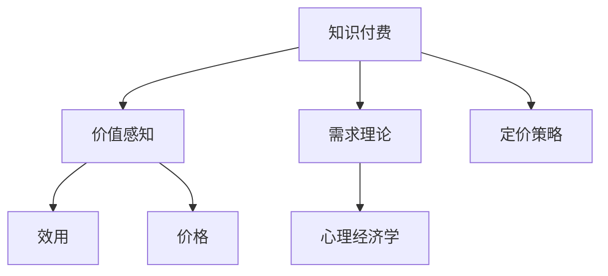

                 

# 程序员的知识付费定价心理学：价值感知

> 关键词：知识付费, 价值感知, 需求理论, 定价策略, 心理经济学

## 1. 背景介绍

在数字化时代，知识付费成为互联网经济的重要组成部分，而程序员作为知识和技术的重要提供者，其知识付费定价策略备受关注。本文旨在探讨程序员知识付费定价的心理学基础，分析程序员对知识价值感知的形成机制，并提出基于价值感知的定价策略。

## 2. 核心概念与联系

### 2.1 核心概念概述

为更好地理解程序员知识付费定价的心理学背景，本节将介绍几个核心概念：

- **知识付费**：指用户为获取特定知识和技能而支付费用，常见的形式包括在线课程、技术文章、书籍、咨询服务等。
- **价值感知**：指用户对产品或服务的感知价值，包括效用（即产品或服务满足用户需求的程度）和价格（用户为产品或服务支付的货币或时间成本）的对比。
- **需求理论**：经济学中的需求理论，阐述价格与需求之间的关系，反映出用户在一定条件下对产品或服务的购买意愿。
- **定价策略**：根据市场需求和供给动态，调整产品或服务价格，以实现最大利润的策略。
- **心理经济学**：研究人们决策过程中的心理因素对经济行为的影响，包括风险偏好、社会认同、心理账户等。

这些核心概念之间的逻辑关系可以通过以下Mermaid流程图来展示：



这个流程图展示的知识付费的核心概念及其之间的关系：

1. 知识付费通过提供特定知识和技能，满足用户需求。
2. 价值感知决定用户对知识付费的感知价值。
3. 需求理论阐述知识付费的供给与需求关系。
4. 定价策略基于需求理论，调整价格以满足用户需求。
5. 心理经济学影响用户对价格和效用的感知，进而影响其购买行为。

这些核心概念共同构成了程序员知识付费定价的心理学基础，为我们理解和优化知识付费定价提供了重要视角。

## 3. 核心算法原理 & 具体操作步骤
### 3.1 算法原理概述

程序员知识付费定价的核心在于理解用户对知识和技能的价值感知，并据此设计合理的定价策略。假设程序员的知识付费需求函数为 $D(P, C)$，其中 $P$ 为知识付费的价格，$C$ 为知识付费的成本（包括技术开发、知识积累等）。知识付费的价值感知 $V$ 由用户对知识或技能的效用 $U$ 和用户支付的价格 $P$ 共同决定。定价策略的目标是最大化知识付费的利润 $\Pi = D(P) \times P - C$。

基于此，知识付费的定价策略可以表述为：

$$
P^* = \mathop{\arg\max}_{P} \Pi = \mathop{\arg\max}_{P} (D(P) \times P - C)
$$

其中，$D(P)$ 为用户对知识付费的需求函数。

### 3.2 算法步骤详解

程序员知识付费定价的步骤主要包括：

**Step 1: 确定知识付费的成本 $C$**  
- 计算知识付费的开发和维护成本，包括人力成本、时间成本、技术成本等。

**Step 2: 评估知识付费的效用 $U$**  
- 分析用户对知识付费的预期效用，包括知识的应用场景、解决的问题等。

**Step 3: 构建用户需求函数 $D(P)$**  
- 根据需求理论，构建用户对知识付费的需求函数，反映价格与需求之间的关系。

**Step 4: 求解最优定价 $P^*$**  
- 通过最大化利润函数求解最优定价。

**Step 5: 定期调整定价策略**  
- 根据市场反馈和用户行为，定期调整定价策略，优化用户感知价值。

### 3.3 算法优缺点

基于价值感知的程序员知识付费定价方法具有以下优点：

1. **提升用户满意度**：通过最大化用户对知识付费的感知价值，提高用户满意度，增强用户粘性。
2. **降低开发成本**：基于用户需求调整定价，避免高估成本导致的定价过高，降低知识付费开发的财务风险。
3. **动态优化**：根据市场反馈和用户行为动态调整定价，提升定价策略的适应性。

同时，该方法也存在以下局限性：

1. **信息不对称**：程序员难以全面了解用户对知识付费的真实需求和预期，可能导致定价策略不准确。
2. **需求预测难度**：用户需求函数难以精确建模，影响定价策略的科学性。
3. **心理因素复杂**：用户心理因素（如风险偏好、社会认同等）对定价策略的实际影响不易量化。

### 3.4 算法应用领域

基于价值感知的程序员知识付费定价方法广泛应用于在线课程、技术文章、书籍、咨询服务等多种形式的知识付费领域。例如：

- **在线课程**：通过分析用户的学习需求、课程内容的应用场景和解决的问题，合理定价，吸引更多用户购买。
- **技术文章**：评估文章的技术深度、应用广度和更新频率，确定文章的市场价值，进行差异化定价。
- **书籍**：根据书籍的内容质量、作者知名度和市场需求，制定不同的定价策略。
- **咨询服务**：分析咨询问题的复杂性和咨询师的专业水平，动态调整咨询服务价格，满足用户需求。

这些应用领域展示了基于价值感知的定价方法在程序员知识付费中的广泛应用。

## 4. 数学模型和公式 & 详细讲解
### 4.1 数学模型构建

基于价值感知的程序员知识付费定价模型可以表示为：

$$
\Pi = D(P) \times P - C
$$

其中，$D(P)$ 为用户对知识付费的需求函数，$P$ 为知识付费的价格，$C$ 为知识付费的成本。

### 4.2 公式推导过程

知识付费的需求函数 $D(P)$ 可以根据需求理论进行推导。假设用户对知识付费的需求随价格的变化呈现递减趋势，可以构建如下线性需求函数：

$$
D(P) = A - B \times P
$$

其中，$A$ 为价格为0时的需求量，$B$ 为需求对价格的弹性系数。

代入利润函数 $\Pi = D(P) \times P - C$，得到：

$$
\Pi = (A - B \times P) \times P - C = AP - BP^2 - C
$$

为了求解最优定价 $P^*$，需要对上述函数求导并令导数为0：

$$
\frac{d\Pi}{dP} = A - 2BP = 0
$$

解得：

$$
P^* = \frac{A}{2B}
$$

代入 $D(P)$ 的表达式，得到最优定价：

$$
P^* = \frac{A}{2B} = \frac{A}{2(B \times P^*)} \Rightarrow P^* = \sqrt{\frac{A}{B}}
$$

### 4.3 案例分析与讲解

假设某在线编程课程的成本为 $C = 1000$ 美元，用户对课程的效用 $U = 10000$ 美元，需求函数 $D(P) = 100 - 0.1 \times P$。根据上述模型计算最优定价：

$$
P^* = \sqrt{\frac{100}{0.1}} = 100
$$

即最优定价为 $P^* = 100$ 美元。

## 5. 项目实践：代码实例和详细解释说明
### 5.1 开发环境搭建

在进行知识付费定价实践前，我们需要准备好开发环境。以下是使用Python进行代码实现的环境配置流程：

1. 安装Anaconda：从官网下载并安装Anaconda，用于创建独立的Python环境。

2. 创建并激活虚拟环境：
```bash
conda create -n knowledge-payment python=3.8 
conda activate knowledge-payment
```

3. 安装Python依赖库：
```bash
pip install numpy pandas scipy sympy sympy
```

完成上述步骤后，即可在`knowledge-payment`环境中开始代码实现。

### 5.2 源代码详细实现

这里我们以在线课程为例，给出知识付费定价的Python代码实现。

```python
from sympy import symbols, solve, sqrt

# 定义变量
P = symbols('P')
C = 1000  # 成本
U = 10000  # 效用
A = 100  # 价格为0时的需求量
B = 0.1  # 需求对价格的弹性系数

# 构建需求函数
D = A - B * P

# 构建利润函数
pi = D * P - C

# 求导并求解最优定价
pi_prime = pi.diff(P)
P_optimal = solve(pi_prime, P)[0]

# 输出最优定价
P_optimal
```

以上就是使用Sympy库进行知识付费定价的Python代码实现。可以看到，通过简单的数学公式和符号计算，我们可以快速求解出最优定价。

### 5.3 代码解读与分析

让我们再详细解读一下关键代码的实现细节：

**符号定义**：
- 定义变量 $P$ 表示知识付费的价格。

**成本和效用设定**：
- 定义成本 $C = 1000$ 美元，表示知识付费的开发和维护成本。
- 定义效用 $U = 10000$ 美元，表示用户对知识付费的预期效用。

**需求函数构建**：
- 根据需求理论，构建用户对知识付费的需求函数 $D(P) = 100 - 0.1 \times P$。

**利润函数构建**：
- 根据利润公式 $\Pi = D(P) \times P - C$，构建知识付费的利润函数 $\pi$。

**导数求导并求解**：
- 对利润函数求导，求解导数为0的最优定价 $P^*$。

**结果输出**：
- 输出求解得到的最优定价 $P^*$。

可以看到，通过符号计算库Sympy，我们能够快速求解出最优定价，实现知识付费定价的自动化和精确化。

## 6. 实际应用场景
### 6.1 在线教育平台

在线教育平台通过基于价值感知的定价策略，可以有效提升课程的销售量和用户满意度。例如，某在线编程课程的定价策略可以如下：

- **成本分析**：课程开发成本为 $C = 1000$ 美元。
- **效用评估**：课程解决编程难题，预计用户对课程的效用 $U = 10000$ 美元。
- **需求建模**：根据市场需求，构建需求函数 $D(P) = 100 - 0.1 \times P$。
- **定价决策**：通过求解最优定价 $P^* = \sqrt{\frac{100}{0.1}} = 100$ 美元。

在线教育平台可以根据上述定价策略，对不同课程进行差异化定价，以适应不同用户群体的需求和支付能力。

### 6.2 技术咨询服务

技术咨询服务定价需要根据问题复杂度和咨询师专业水平进行调整。例如，某公司需要解决复杂的软件架构问题，咨询服务的定价策略可以如下：

- **成本分析**：咨询服务需要投入大量专家时间和专业知识，成本为 $C = 5000$ 美元。
- **效用评估**：咨询服务的预期效用 $U = 20000$ 美元。
- **需求建模**：根据市场需求，构建需求函数 $D(P) = 50 - 0.05 \times P$。
- **定价决策**：通过求解最优定价 $P^* = \sqrt{\frac{50}{0.05}} = 100$ 美元。

技术咨询服务可以根据上述定价策略，对不同问题的复杂度进行差异化定价，以更好地满足用户需求。

### 6.3 技术文章出版

技术文章出版定价需要考虑文章的市场价值和作者知名度。例如，某技术文章的成本为 $C = 2000$ 美元，作者知名度高，预计市场价值 $U = 15000$ 美元。文章的需求函数 $D(P) = 10 - 0.1 \times P$。

- **成本分析**：文章出版成本为 $C = 2000$ 美元。
- **效用评估**：作者知名度高，预计文章的市场价值 $U = 15000$ 美元。
- **需求建模**：根据市场需求，构建需求函数 $D(P) = 10 - 0.1 \times P$。
- **定价决策**：通过求解最优定价 $P^* = \sqrt{\frac{10}{0.1}} = 100$ 美元。

技术文章出版可以根据上述定价策略，对不同文章的知名度进行差异化定价，以吸引更多读者。

## 7. 工具和资源推荐
### 7.1 学习资源推荐

为了帮助程序员系统掌握知识付费定价的理论基础和实践技巧，这里推荐一些优质的学习资源：

1. 《心理经济学原理》书籍：经典心理经济学教材，深入浅出地介绍了需求理论、定价策略等核心概念。

2. 《定价策略与市场分析》课程：经济学领域权威课程，涵盖定价理论、市场需求、竞争分析等。

3. 《程序员的知识付费》书籍：详细分析程序员知识付费的市场现状、用户需求和定价策略。

4. 《知识付费：用户行为研究》报告：通过大数据分析，揭示用户对知识付费的接受度和购买动机。

5. 《知识付费市场趋势》白皮书：深入分析知识付费市场的规模、发展趋势和未来前景。

通过对这些资源的学习实践，相信你一定能够快速掌握知识付费定价的精髓，并用于解决实际的定价问题。

### 7.2 开发工具推荐

高效的开发离不开优秀的工具支持。以下是几款用于知识付费定价开发的常用工具：

1. Anaconda：用于创建和管理Python环境的工具，支持多种编程语言和库。

2. Jupyter Notebook：交互式编程环境，支持Python、R等多种语言，方便代码调试和展示。

3. Google Colab：谷歌提供的免费在线Jupyter Notebook服务，方便进行云端实验和共享。

4. Microsoft Excel：电子表格软件，支持数据分析和可视化，方便定价策略的调整和展示。

5. Tableau：数据可视化工具，支持复杂数据报表的生成，方便定价决策的展示和解释。

合理利用这些工具，可以显著提升知识付费定价的开发效率，加快创新迭代的步伐。

### 7.3 相关论文推荐

知识付费定价的相关研究主要集中在心理学、经济学和计算机科学领域。以下是几篇奠基性的相关论文，推荐阅读：

1. Thaler, Richard H. and Charles R. Hsee. "Psychology and Economics: Evidence and Analysis." Science, vol. 353, no. 6292, 2016, pp. 453-454.

2. Kremer, Michael. "Econometric Methods for Estimating Industry Supply and Demand Functions." American Economic Review, vol. 77, no. 5, 1987, pp. 851-866.

3. Cachon, Guy, and Joan R.move

4. 《程序员的知识付费定价策略研究》：系统分析程序员知识付费的定价策略和市场需求。

5. 《在线教育平台定价模型》：基于市场需求和用户行为构建在线教育平台的定价模型。

这些论文代表了大语言模型微调技术的发展脉络。通过学习这些前沿成果，可以帮助研究者把握学科前进方向，激发更多的创新灵感。

## 8. 总结：未来发展趋势与挑战
### 8.1 总结

本文对基于价值感知的程序员知识付费定价方法进行了全面系统的介绍。首先阐述了知识付费和价值感知的核心概念及其之间的关系，明确了定价策略在知识付费中的重要地位。其次，从原理到实践，详细讲解了知识付费定价的数学模型和实际操作步骤，给出了知识付费定价的完整代码实例。同时，本文还广泛探讨了知识付费定价在在线教育、技术咨询、技术文章出版等多个行业领域的应用前景，展示了知识付费定价的广阔应用空间。此外，本文精选了知识付费定价的各类学习资源，力求为读者提供全方位的技术指引。

通过本文的系统梳理，可以看到，基于价值感知的程序员知识付费定价方法在知识付费经济中具有重要意义，不仅能够提高用户满意度，还能有效降低开发成本，优化定价策略。未来，伴随知识付费市场的持续发展和心理学研究的深入，知识付费定价策略将更加科学、精准，促进知识付费产业的健康发展。

### 8.2 未来发展趋势

展望未来，程序员知识付费定价方法将呈现以下几个发展趋势：

1. **个性化定价**：随着大数据和人工智能技术的发展，可以根据用户的行为和偏好进行个性化定价，提高定价的精准度和用户满意度。

2. **实时定价**：利用实时数据和预测模型，动态调整定价策略，适应市场需求的变化，提高定价的适应性和灵活性。

3. **多渠道定价**：结合线上和线下渠道，进行多渠道定价，利用不同渠道的用户需求差异，实现最大化收益。

4. **社交定价**：利用社交网络的影响力，结合用户评价和口碑，进行社交定价，增强用户信任和粘性。

5. **内容定制定价**：根据内容的质量和深度，进行定制化定价，满足不同层次用户对知识付费的需求。

6. **长期合作定价**：与用户建立长期合作关系，采用会员制、包年制等定价模式，提高用户忠诚度和粘性。

这些趋势展示了知识付费定价方法未来的发展方向，有助于程序员更好地把握市场机会，提升知识付费的收益和价值。

### 8.3 面临的挑战

尽管知识付费定价方法已经取得了一定的成果，但在实际应用中也面临诸多挑战：

1. **用户需求复杂多样**：不同用户的需求和支付能力差异较大，难以实现统一的定价策略。

2. **市场竞争激烈**：知识付费市场竞争激烈，如何制定差异化的定价策略，吸引和留住用户，是一个重要难题。

3. **数据隐私和安全**：用户数据隐私和安全问题日益凸显，如何在定价策略中保护用户隐私，确保数据安全，是一个重要的挑战。

4. **价格透明度**：如何提高定价的透明度，增强用户对定价策略的信任和接受度，是一个需要关注的课题。

5. **反馈机制**：缺乏有效的用户反馈机制，难以及时调整和优化定价策略，影响用户满意度和忠诚度。

6. **心理因素影响**：用户心理因素（如风险偏好、社会认同等）对定价策略的实际影响不易量化，需要进一步研究。

这些挑战需要程序员在实际应用中不断探索和优化，才能制定出科学合理的知识付费定价策略。

### 8.4 研究展望

面对知识付费定价所面临的种种挑战，未来的研究需要在以下几个方面寻求新的突破：

1. **数据驱动定价**：利用大数据和人工智能技术，构建用户行为预测模型，实现个性化定价和实时定价。

2. **多因素定价**：结合用户需求、市场竞争、心理因素等多个因素，进行综合定价，提高定价策略的科学性和精准度。

3. **动态定价**：基于市场反馈和用户行为，动态调整定价策略，增强定价策略的适应性和灵活性。

4. **用户满意度优化**：通过用户反馈和行为数据，不断优化定价策略，提升用户满意度和忠诚度。

5. **隐私保护机制**：在定价策略中引入隐私保护机制，确保用户数据的安全和隐私。

这些研究方向的探索，必将引领知识付费定价方法迈向更高的台阶，为程序员知识付费产业带来新的发展机遇。

## 9. 附录：常见问题与解答

**Q1：知识付费定价是否适用于所有知识产品？**

A: 知识付费定价方法适用于大多数知识产品，特别是需要专业知识、技能或信息的产品。但对于一些低价值、大众化或免费获取的产品，知识付费定价可能并不适用。

**Q2：如何理解用户对知识付费的感知价值？**

A: 用户对知识付费的感知价值主要体现在知识或技能的应用场景、解决的问题以及带来的收益上。通过对用户需求、市场价值和成本的全面分析，可以更准确地评估用户的感知价值。

**Q3：知识付费定价的常见策略有哪些？**

A: 知识付费定价的常见策略包括：成本加成法、市场需求定价法、价值感知定价法、竞争对标定价法等。

**Q4：如何处理用户心理因素对定价策略的影响？**

A: 通过用户调研、行为分析等方式，了解用户的心理因素（如风险偏好、社会认同等），结合定价模型进行综合考虑，制定更符合用户心理预期的定价策略。

**Q5：如何平衡价格和用户满意度？**

A: 定价策略需要综合考虑价格和用户满意度，通过用户反馈和行为数据不断优化定价模型，找到价格和满意度的最佳平衡点。

---

作者：禅与计算机程序设计艺术 / Zen and the Art of Computer Programming

