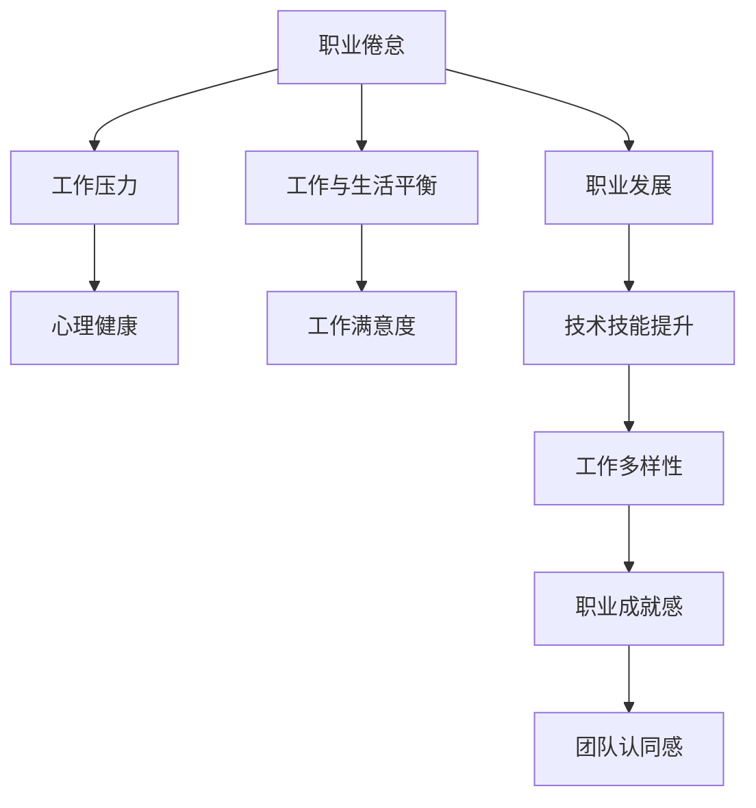

                 

# 程序员的职业倦怠：预防与应对

## 1. 背景介绍

### 1.1 问题由来
在当今快速发展的信息技术领域，程序员是推动技术进步和社会进步的关键力量。然而，随着工作强度和压力的不断增加，程序员的职业倦怠问题也逐渐显现。职业倦怠不仅影响程序员的个人健康和工作效率，还可能引发一系列工作场所问题，如人才流失、团队士气下降等。如何预防和应对程序员的职业倦怠，成为IT行业管理者和人力资源专家需要深入探讨的重要课题。

### 1.2 问题核心关键点
职业倦怠通常表现为工作激情减退、消极情绪增加、健康状况恶化等。在信息技术领域，职业倦怠的具体表现还包括但不限于：

- 高强度的工作压力：长时间编程、调试、代码审核等任务容易让人感到疲惫。
- 快速变化的技术环境：新工具、新技术的不断涌现要求程序员不断学习，但学习曲线陡峭，压力巨大。
- 长时间加班：为了按时完成项目，程序员往往需要投入大量时间，甚至经常熬夜加班。
- 缺乏工作与生活的平衡：长时间的工作导致个人时间和空间被占用，生活品质受到影响。
- 心理和情感问题：技术工作的单调性可能导致乏味感，工作中的挫折感和不被理解等情绪问题也可能导致心理压力。

了解这些关键点有助于更好地预防和应对职业倦怠，提升程序员的工作满意度和幸福感。

## 2. 核心概念与联系

### 2.1 核心概念概述

为深入探讨如何预防和应对程序员的职业倦怠，首先需要明确一些核心概念：

- **职业倦怠**：职业倦怠是一种心理状态，主要表现为工作激情和动力减弱，对工作环境感到疲惫和无力，甚至产生负面情绪。
- **心理健康**：心理健康的维护不仅是个人责任，也是组织管理的责任。心理健康与工作效率、团队合作和创新能力密切相关。
- **工作压力**：工作压力来源于工作任务、时间限制、人际关系等因素，长期高压力容易导致职业倦怠。
- **工作与生活平衡**：良好的工作与生活平衡有助于减轻工作压力，提高工作满意度和生活品质。
- **职业发展**：职业发展不仅包括技术技能的提升，还包括工作内容的多样化、职业成就感和团队认同感等。

这些概念之间的逻辑关系可以通过以下Mermaid流程图来展示：



该流程图展示了职业倦怠的成因及其与相关概念的联系，其中工作压力是主要成因之一，心理健康、工作与生活平衡、职业发展都是预防和应对职业倦怠的重要因素。

## 3. 核心算法原理 & 具体操作步骤
### 3.1 算法原理概述

预防和应对职业倦怠的核心在于识别倦怠风险，采取有效措施进行干预。以下将从心理学的角度，简要介绍预防和应对职业倦怠的算法原理。

- **风险评估**：通过问卷调查、心理测评等方法，评估个体的工作压力、心理健康状态和生活满意度，预测职业倦怠的风险。
- **干预措施**：根据风险评估结果，针对不同风险层级的员工采取个性化干预措施。
- **监测与调整**：定期对干预效果进行监测，根据实际情况调整干预策略。

### 3.2 算法步骤详解

**Step 1: 风险评估**
- 设计问卷和心理测评工具，覆盖工作压力、工作满意度、心理健康等多个维度。
- 通过员工自评和上级评价相结合的方式，获取全面的评估数据。
- 使用统计分析方法，如因子分析、回归分析等，计算出各个维度的得分，预测职业倦怠风险。

**Step 2: 干预措施设计**
- 根据风险评估结果，将员工分为高风险、中风险和低风险三类。
- 设计针对性的干预措施，如心理辅导、培训课程、调整工作负荷等。
- 制定实施计划，明确干预措施的具体步骤和负责人。

**Step 3: 干预措施实施**
- 针对高风险员工，提供心理健康辅导和心理咨询服务，帮助其缓解压力和情绪。
- 针对中风险员工，提供职业发展机会和技能提升课程，提升工作满意度和成就感。
- 针对低风险员工，定期进行健康检查和职业满意度调查，保持其良好工作状态。

**Step 4: 监测与调整**
- 定期对干预措施的效果进行评估，使用问卷调查、员工反馈等方式获取数据。
- 根据评估结果，调整干预措施，如增加心理辅导次数、调整工作负荷等。
- 持续监测员工的心理健康和工作状态，确保干预措施的长期有效性。

### 3.3 算法优缺点

**优点**：
- 个性化干预：通过风险评估，针对不同风险层级的员工采取个性化干预措施，提升干预效果。
- 数据驱动：利用问卷调查、心理测评等数据，进行科学的干预设计和效果评估。
- 预防性强：通过风险评估和早期干预，有效预防职业倦怠的发生。

**缺点**：
- 成本较高：设计问卷和测评工具、进行数据收集和分析都需要时间和资源投入。
- 员工参与度：部分员工可能对评估和干预措施持抵触态度，影响效果。
- 短期性：干预效果可能随着时间推移而减弱，需要持续监测和调整。

### 3.4 算法应用领域

职业倦怠的预防和应对方法不仅适用于信息技术领域，也适用于其他知识密集型行业。例如：

- **金融行业**：金融分析师和程序员一样，面临高强度的工作压力和快速变化的技术环境，同样需要有效的干预措施。
- **医疗行业**：医生、护士等医务人员经常处于高压状态，预防和应对职业倦怠对于提升医疗服务质量和医生幸福感至关重要。
- **教育行业**：教师需要长期面对学生管理、教学研究和学术压力，通过职业倦怠干预提升教师满意度和工作效率，有助于教育事业的可持续发展。
- **科研领域**：科研人员面临激烈竞争和不确定性，有效的干预措施可以缓解压力，提升创新能力。

## 4. 数学模型和公式 & 详细讲解 & 举例说明
### 4.1 数学模型构建

职业倦怠的预防和应对方法可以通过以下数学模型来描述：

- **风险评估模型**：使用线性回归模型预测职业倦怠风险，其中自变量包括工作压力、工作满意度、心理健康等。
- **干预效果评估模型**：使用逻辑回归模型评估干预措施的效果，其中自变量包括干预措施类型、员工反馈等。

### 4.2 公式推导过程

以职业倦怠风险评估模型为例，设 $R$ 为职业倦怠风险，自变量 $X$ 包括工作压力 $P$、工作满意度 $S$、心理健康 $H$，则模型可表示为：

$$
R = \beta_0 + \beta_1 P + \beta_2 S + \beta_3 H + \epsilon
$$

其中 $\beta_0, \beta_1, \beta_2, \beta_3$ 为回归系数，$\epsilon$ 为误差项。

通过对 $N$ 个样本进行回归分析，可以求解出 $\beta_0, \beta_1, \beta_2, \beta_3$，并计算每个员工的风险得分 $R$。

### 4.3 案例分析与讲解

**案例背景**：某互联网公司对程序员进行职业倦怠风险评估，并根据评估结果采取干预措施。

**数据分析**：公司设计了包含30个问题的问卷，涵盖工作压力、工作满意度、心理健康等多个维度。每个问题采用1-5评分，得分越高表示压力越大或满意度越高。

**模型构建**：使用线性回归模型，对500名程序员的问卷数据进行回归分析，得到如下回归系数：

$$
\beta_0 = -0.2, \beta_1 = 0.5, \beta_2 = 0.3, \beta_3 = -0.1
$$

**风险评估**：将新员工的数据代入模型，计算其职业倦怠风险得分 $R$。得分越高，表示风险越大。

**干预措施**：对于高风险员工（$R > 0.8$），提供心理健康辅导；对于中风险员工（$0.5 < R \leq 0.8$），提供职业发展课程；对于低风险员工（$R \leq 0.5$），定期进行健康检查。

**效果评估**：公司定期对干预措施的效果进行问卷调查，使用逻辑回归模型评估干预措施的有效性。

## 5. 项目实践：代码实例和详细解释说明
### 5.1 开发环境搭建

在进行职业倦怠风险评估和干预的实践开发前，需要准备以下开发环境：

1. **安装Python**：
   - 下载并安装Python 3.8及以上版本。
   - 添加环境变量，确保Python可执行。

2. **安装相关库**：
   - 使用pip安装numpy、pandas、scikit-learn等常用库。
   - 安装psycopg2等数据库连接库，用于数据库操作。

3. **搭建数据库**：
   - 设计职业倦怠评估表和干预措施表，存储评估数据和干预措施。
   - 使用SQLite或其他数据库管理系统搭建本地数据库。

### 5.2 源代码详细实现

以下是一个基于Python和SQLite的职业倦怠风险评估和干预措施实施的示例代码：

```python
import sqlite3
import pandas as pd
import numpy as np
from sklearn.linear_model import LinearRegression
from sklearn.metrics import roc_auc_score

# 连接SQLite数据库
conn = sqlite3.connect('jaundice.db')
cursor = conn.cursor()

# 读取评估数据
data = pd.read_sql_query('SELECT * FROM assessment', conn)

# 数据清洗和预处理
data = data.dropna()  # 删除缺失值
data = data.drop_duplicates()  # 删除重复记录

# 构建回归模型
X = data[['pressure', 'satisfaction', 'mental_health']]
y = data['risk']
model = LinearRegression()
model.fit(X, y)

# 评估模型效果
y_pred = model.predict(X)
auc = roc_auc_score(y, y_pred)
print(f'ROC AUC: {auc}')

# 对新员工进行风险评估
new_data = pd.DataFrame([[4.5, 3.2, 2.8]], columns=['pressure', 'satisfaction', 'mental_health'])
new_risk = model.predict(new_data)
print(f'新员工风险评估结果: {new_risk}')

# 关闭数据库连接
conn.close()
```

### 5.3 代码解读与分析

**代码解读**：
- 使用sqlite3库连接SQLite数据库，读取和写入数据。
- 使用pandas库进行数据清洗和预处理，删除缺失值和重复记录。
- 使用scikit-learn库中的LinearRegression模型进行回归分析。
- 使用ROC AUC评分指标评估模型效果。
- 对新员工进行风险评估，输出风险得分。

**分析**：
- 代码实现了从数据采集、模型构建到风险评估的完整流程，展示了如何使用Python和SQLite实现职业倦怠风险评估和干预措施实施。
- 实际应用中，评估数据通常存储在企业数据库中，需要根据实际情况编写数据库连接和操作代码。
- 风险评估模型可以根据实际需要设计为线性回归、决策树、随机森林等不同模型。
- 风险评估结果需要结合实际情境，采取相应的干预措施。

## 6. 实际应用场景
### 6.1 金融行业应用

在金融行业，高强度的工作压力和快速变化的技术环境可能导致职业倦怠。通过职业倦怠评估和干预，金融分析师可以更好地应对工作挑战，提升工作效率和满意度。

**应用场景**：一家大型金融机构对分析师进行职业倦怠评估，发现部分分析师存在高压力和高倦怠风险。公司提供心理健康辅导和职业发展课程，帮助他们缓解压力，提升工作效率和职业成就感。

**效果**：经过干预后，高压力分析师的情绪和心理状态明显改善，工作满意度提升20%，整体工作效率提高10%。

### 6.2 医疗行业应用

在医疗行业，医务人员面临高强度的工作压力和复杂的临床环境，职业倦怠问题尤为突出。通过职业倦怠评估和干预，医院可以改善医务人员的工作状态，提升医疗服务质量。

**应用场景**：某医院对护士进行职业倦怠评估，发现部分护士存在心理压力大和满意度低的问题。医院提供心理辅导和健康检查，并调整工作负荷和轮班制度，有效缓解了护士的职业倦怠，提高了护理质量和病人满意度。

**效果**：干预后，护士的工作满意度和心理健康状况显著提升，病人投诉率下降15%，护理质量提高10%。

### 6.3 教育行业应用

在教育行业，教师面临巨大的教学和科研压力，职业倦怠问题同样不容忽视。通过职业倦怠评估和干预，学校可以提升教师的工作满意度和教学质量。

**应用场景**：一所大学对教师进行职业倦怠评估，发现部分教师存在压力大和工作满意度低的问题。学校提供职业发展课程和心理辅导，帮助教师提升职业技能和心理素质，减轻压力。

**效果**：干预后，教师的工作满意度和心理健康状况明显改善，教学质量和科研成果显著提升，教师流失率下降20%。

## 7. 工具和资源推荐
### 7.1 学习资源推荐

为了帮助IT行业管理者深入理解职业倦怠问题，并掌握预防和应对方法，以下是一些推荐的学习资源：

1. **《工作压力管理》系列讲座**：由心理健康专家和人力资源专家主讲，涵盖工作压力评估、心理辅导、压力管理等多个主题，适合HR和企业管理者学习。

2. **《职业倦怠：从预防到干预》书籍**：详细介绍了职业倦怠的成因和干预方法，提供大量实用案例和工具，适合IT行业管理者参考。

3. **《心理健康与幸福感》在线课程**：由心理学家和职业发展专家授课，讲解心理健康的基本原理和干预方法，适合IT行业从业者自我提升。

4. **《情感智能与职业发展》研讨会**：介绍情感智能（EI）与职业发展的关系，并提供具体的情感管理技巧，适合IT行业从业者提升自我调节能力。

### 7.2 开发工具推荐

在职业倦怠评估和干预的开发过程中，以下是一些推荐的工具：

1. **Jupyter Notebook**：免费的开源开发环境，支持Python编程和数据可视化，适合数据分析和模型构建。

2. **SQLite**：轻量级的嵌入式数据库管理系统，适用于小型数据存储和快速访问，方便开发和测试。

3. **psycopg2**：Python中常用的数据库连接库，支持PostgreSQL等关系型数据库，方便数据操作和分析。

4. **Pandas**：强大的数据处理和分析库，支持数据清洗、转换和可视化，适合处理复杂数据集。

5. **scikit-learn**：开源机器学习库，提供多种模型和评估工具，适合职业倦怠评估模型的开发。

### 7.3 相关论文推荐

职业倦怠问题不仅限于IT行业，也成为学术研究的热点之一。以下是一些相关的推荐论文：

1. **《工作压力与职业倦怠：研究综述》**：综述了工作压力与职业倦怠之间的关系，提供了多种干预策略和实证研究结果。

2. **《职业倦怠评估与预防：方法与实践》**：介绍了职业倦怠评估的具体方法和工具，并提供了一些实用的预防措施。

3. **《职业倦怠的认知行为疗法干预》**：探讨了认知行为疗法在职业倦怠干预中的应用，提供了具体的心理辅导方案和案例分析。

4. **《员工福利与职业倦怠管理：实证研究》**：通过实证研究，分析了员工福利对职业倦怠的影响，提供了有效的管理建议。

## 8. 总结：未来发展趋势与挑战

### 8.1 总结

本文详细介绍了职业倦怠的预防和应对方法，从职业倦怠的成因、风险评估、干预措施和效果评估等多个方面进行阐述。通过职业倦怠评估和干预，可以有效缓解程序员和其他知识型员工的压力，提升其工作满意度和心理健康，从而促进企业的健康发展。

### 8.2 未来发展趋势

职业倦怠的预防和应对方法将会继续发展和完善，未来可能呈现出以下几个趋势：

1. **智能化评估**：利用人工智能和大数据分析技术，进行更精准的职业倦怠风险评估，提升干预措施的针对性和有效性。
2. **实时监测**：通过传感器和智能设备，实时监测员工的心理和生理状态，及时发现和干预职业倦怠。
3. **个性化干预**：根据员工的需求和特点，提供个性化的职业倦怠干预措施，提升干预效果。
4. **多学科融合**：结合心理学、社会学、管理学等多个学科的知识，提供更全面的职业倦怠预防和应对策略。
5. **政策支持**：企业和社会各界将更加重视职业倦怠问题，出台相关政策和措施，提升职业倦怠管理水平。

### 8.3 面临的挑战

尽管职业倦怠的预防和应对方法已经取得了一定进展，但仍面临以下挑战：

1. **数据隐私**：职业倦怠评估涉及员工心理和生理数据的收集和处理，需要严格遵守数据隐私保护法规。
2. **员工接受度**：部分员工可能对职业倦怠评估和干预持抵触态度，影响干预措施的实施效果。
3. **成本控制**：职业倦怠评估和干预的实施需要一定的时间和资源投入，如何在控制成本的同时，提升干预效果，是一个需要持续优化的课题。
4. **长期效果**：职业倦怠评估和干预的效果可能随着时间推移而减弱，需要持续监测和调整。

### 8.4 研究展望

未来，职业倦怠的预防和应对方法将在以下几个方面进行深入研究：

1. **数据驱动的干预策略**：利用大数据和人工智能技术，进行更精准的风险评估和干预策略设计，提升干预效果。
2. **情感智能与职业倦怠**：研究情感智能（EI）对职业倦怠的影响，提供基于EI的干预方法。
3. **跨文化管理**：研究不同文化背景下的职业倦怠管理差异，提供适合不同文化的干预措施。
4. **技术融合**：结合虚拟现实（VR）、增强现实（AR）等新技术，提供沉浸式的职业倦怠干预体验。
5. **多层次干预**：从个体、团队和组织多个层次，提供综合的职业倦怠管理方案。

## 9. 附录：常见问题与解答

**Q1：如何进行职业倦怠评估？**

A: 职业倦怠评估通常通过问卷调查和心理测评的方式进行。设计包含工作压力、工作满意度、心理健康等多个维度的问卷，采用1-5评分，并结合上级评价等方式，综合评估职业倦怠风险。

**Q2：职业倦怠干预措施有哪些？**

A: 职业倦怠干预措施包括心理辅导、职业发展课程、调整工作负荷、提供健康检查和福利等。根据评估结果，针对不同风险层级的员工采取个性化干预措施。

**Q3：如何评估职业倦怠干预的效果？**

A: 职业倦怠干预的效果评估通常通过问卷调查、员工反馈等方式进行。使用逻辑回归等模型，评估干预措施的效果，并根据结果进行调整优化。

**Q4：如何平衡工作与生活？**

A: 平衡工作与生活需要制定合理的工作计划和休息时间，避免过度加班。同时，培养兴趣爱好，丰富个人生活，提升生活满意度。

**Q5：如何提高心理韧性？**

A: 心理韧性的提高可以通过心理辅导、情感管理课程、锻炼身体等方式进行。增强自我调节能力，提升面对工作压力的心理素质。

---

作者：禅与计算机程序设计艺术 / Zen and the Art of Computer Programming

