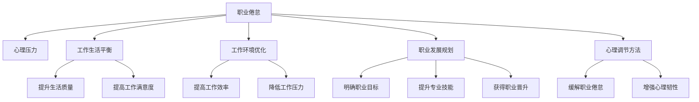

                 

# 程序员的职业倦怠：预防与应对

> 关键词：职业倦怠, 心理压力, 工作生活平衡, 工作环境优化, 职业发展规划, 心理调节方法, 职业成就与满足感

## 1. 背景介绍

### 1.1 问题由来
随着科技的迅速发展和数字化转型的推进，程序员这一职业的需求不断上升，其工作压力和职业倦怠问题也日益凸显。职业倦怠不仅影响了程序员的个人健康和家庭生活，还对企业的生产力和创新能力产生不良影响。如何预防和应对职业倦怠，成为了科技公司和组织越来越关注的重要议题。

### 1.2 问题核心关键点
程序员职业倦怠的核心在于长时间的高强度工作、长期的心理压力、以及工作与生活的失衡。其表现形式包括情绪低落、工作效率下降、频繁的疲劳感和缺乏工作热情。问题根源在于工作的挑战性、职业发展前景的不确定性、以及对工作环境的适应不良。

## 2. 核心概念与联系

### 2.1 核心概念概述

为深入理解程序员职业倦怠的成因和应对策略，本节将介绍几个密切相关的核心概念：

- 职业倦怠(Burnout)：一种由长期工作压力、情感耗竭和低个人成就感组成的工作相关心理状态。表现为工作积极性下降、情绪低落、身心健康受损。
- 心理压力(Psychological Stress)：由工作需求、社会期望和个人期望等因素导致的一种心理负担。长期高压力会引发心理和生理上的各种问题。
- 工作生活平衡(Work-Life Balance)：在工作与个人生活之间寻找最佳平衡状态，以提升生活质量和工作满意度。
- 工作环境优化(Work Environment Optimization)：通过改善工作环境、提高工作效率、降低工作压力，以提高员工满意度和生产效率。
- 职业发展规划(Career Development Planning)：个人职业发展的规划与设计，通过明确目标、提升技能、获得晋升等方式，增强职业成就感和满足感。
- 心理调节方法(Psychological Coping Mechanisms)：通过心理辅导、运动、社交、冥想等方式，缓解职业倦怠和心理压力，增强心理韧性。

这些核心概念之间的逻辑关系可以通过以下Mermaid流程图来展示：



这个流程图展示了几类核心概念及其之间的关系：

1. 职业倦怠由心理压力、工作生活失衡、工作环境不适、职业发展困难、心理调节不足等因素引起。
2. 改善心理压力和工作生活平衡，优化工作环境和职业发展规划，以及增强心理调节能力，都能有效预防和减轻职业倦怠。
3. 工作满意度和效率的提升，职业成就感的增强，同样能对职业倦怠产生积极影响。

## 3. 核心算法原理 & 具体操作步骤
### 3.1 算法原理概述

预防和应对程序员职业倦怠，本质上是一个多维度、系统性的工程。其核心思想是：通过系统地评估和优化工作环境、职业发展规划、以及个人心理调节策略，全面提升程序员的工作满意度和心理韧性，从而预防和减轻职业倦怠。

形式化地，假设程序员 $P$ 面临职业倦怠，其影响因素包括工作环境 $E$、职业发展规划 $D$、心理调节能力 $C$ 等。理想的目标是找到最优的组合 $E^*, D^*, C^*$，使得 $P$ 的职业倦怠水平最小化，即：

$$
\min_{E^*, D^*, C^*} \text{倦怠水平} = f(E^*, D^*, C^*)
$$

其中 $f$ 为评估程序员职业倦怠水平的函数。

### 3.2 算法步骤详解

基于系统性预防和应对程序员职业倦怠的思路，本节将详细介绍具体的步骤和操作方法：

**Step 1: 评估职业倦怠程度**

1. 采用标准化的职业倦怠测评问卷，如 Maslach倦怠问卷(MBI)，对程序员进行心理状态测评。
2. 通过问卷结果，量化程序员的情感耗竭、人格解体、个人成就感等倦怠维度。

**Step 2: 诊断职业倦怠成因**

1. 分析问卷结果，识别出导致职业倦怠的主要影响因素。
2. 通过一对一访谈、团队讨论等方式，深入了解程序员的具体问题和需求。
3. 从工作环境、职业发展规划、心理调节能力等方面，细化倦怠成因。

**Step 3: 制定改善策略**

1. 针对不同影响因素，制定个性化的职业倦怠改善策略。
2. 在企业层面，制定系统化的工作环境优化方案，如弹性工作时间、灵活办公空间、支持工作-生活平衡等。
3. 在个人层面，帮助程序员制定职业发展规划，明确职业目标、提升专业技能、获得职业晋升等。
4. 引入心理调节方法，如心理咨询、团队建设活动、运动减压、冥想放松等。

**Step 4: 实施改善措施**

1. 在企业内部进行职业倦怠改善措施的宣传和培训，提高全体员工的认识和参与度。
2. 落实改善措施，如调整工作安排、提供职业发展机会、改善办公环境等。
3. 定期评估措施效果，根据反馈进行持续优化。

**Step 5: 持续监测与改进**

1. 定期对程序员进行职业倦怠评估，监控改善措施的效果。
2. 收集改善措施的反馈意见，持续优化措施。
3. 引入新的改善策略，保持改进的持续性和动态性。

### 3.3 算法优缺点

预防和应对程序员职业倦怠的系统性方法，具有以下优点：
1. 系统性全面：通过多维度评估和改进，从根本上解决职业倦怠问题。
2. 个性化方案：根据个人和组织的具体情况，制定个性化改善策略。
3. 持续改进：定期监测和反馈，确保改善措施的有效性和持续性。

同时，该方法也存在一定的局限性：
1. 实施难度大：需要投入大量资源和时间，实施复杂。
2. 评估复杂：需要采用多种评估工具和方法，综合分析结果。
3. 效果短期：改善措施的短期效果可能不明显，需要长期坚持。

尽管如此，系统性预防和应对职业倦怠的方法，仍是目前企业中较为科学和有效的应对策略。

### 3.4 算法应用领域

该方法广泛应用于科技公司、软件开发团队、以及任何需要高度专注和创新的工作环境。特别适用于技术研发部门、项目管理团队、以及长期面对高强度工作压力的职业群体。

## 4. 数学模型和公式 & 详细讲解 & 举例说明

### 4.1 数学模型构建

本节将使用数学语言对预防和应对程序员职业倦怠的系统性方法进行更加严格的刻画。

记程序员 $P$ 面临的职业倦怠水平为 $B$，其影响因素包括工作环境 $E$、职业发展规划 $D$、心理调节能力 $C$ 等。设 $E$、$D$、$C$ 均为可量化指标，分别表示为 $E_k$、$D_k$、$C_k$。则职业倦怠水平的量化模型为：

$$
B = f(E_1, E_2, E_3, D_1, D_2, D_3, C_1, C_2, C_3)
$$

其中 $E_k$ 为工作环境的第 $k$ 个指标，$D_k$ 为职业发展规划的第 $k$ 个指标，$C_k$ 为心理调节能力的第 $k$ 个指标。函数 $f$ 可以通过统计学方法，如线性回归、因子分析等，构建量化模型。

### 4.2 公式推导过程

以一个简单的线性回归模型为例，推导 $B$ 与 $E$、$D$、$C$ 的关系。

设 $B = \beta_0 + \beta_1 E_1 + \beta_2 E_2 + \beta_3 E_3 + \beta_4 D_1 + \beta_5 D_2 + \beta_6 D_3 + \beta_7 C_1 + \beta_8 C_2 + \beta_9 C_3 + \epsilon$

其中 $\beta$ 为回归系数，$\epsilon$ 为误差项。

为了求解最优的 $\beta$ 值，可以通过最小二乘法求解，构建目标函数：

$$
\min \frac{1}{N} \sum_{i=1}^N (y_i - \hat{y}_i)^2
$$

其中 $y_i$ 为第 $i$ 个样本的 $B$ 值，$\hat{y}_i$ 为第 $i$ 个样本的预测值。

通过求解上述目标函数的极小值，可以得到最优的 $\beta$ 值，进而构建出职业倦怠水平的量化模型。

### 4.3 案例分析与讲解

假设某科技公司的程序员团队存在职业倦怠问题，通过标准化问卷评估其倦怠水平，得到结果如下：

| 评估维度 | 评分 |
| --- | --- |
| 情感耗竭 | 4.5 |
| 人格解体 | 3.2 |
| 个人成就感 | 2.8 |

经分析发现，情感耗竭和人格解体是主要成因。进一步访谈发现，问题根源在于工作时间过长、工作环境不佳、缺乏职业发展机会、以及心理调节不足。

根据上述分析，制定以下改善策略：
- 调整工作时间，实行弹性工作制。
- 改善工作环境，提供更舒适的工作空间。
- 提供职业发展机会，提升团队成员的技能和职位。
- 引入心理调节方法，如心理辅导、团队建设活动、冥想放松等。

实施上述措施后，定期对团队进行职业倦怠评估，结果显示情感耗竭和人格解体的评分显著下降，个人成就感提升，整体工作满意度提高。

## 5. 项目实践：代码实例和详细解释说明
### 5.1 开发环境搭建

在进行职业倦怠预防和应对的实践前，我们需要准备好开发环境。以下是使用Python进行数据分析的开发环境配置流程：

1. 安装Anaconda：从官网下载并安装Anaconda，用于创建独立的Python环境。

2. 创建并激活虚拟环境：
```bash
conda create -n pyanalysis python=3.8 
conda activate pyanalysis
```

3. 安装必要的库：
```bash
conda install pandas numpy matplotlib seaborn scikit-learn jupyter notebook
```

完成上述步骤后，即可在`pyanalysis-env`环境中开始职业倦怠分析的实践。

### 5.2 源代码详细实现

这里我们以一个简单的线性回归模型为例，对职业倦怠水平的预测进行代码实现。

首先，导入必要的库并准备数据：

```python
import pandas as pd
import numpy as np
import matplotlib.pyplot as plt
import seaborn as sns
from sklearn.linear_model import LinearRegression

# 准备数据
data = pd.read_csv('burnout_data.csv')
```

接着，进行数据预处理和模型训练：

```python
# 数据预处理
X = data[['E1', 'E2', 'E3', 'D1', 'D2', 'D3', 'C1', 'C2', 'C3']]
y = data['B']

# 划分训练集和测试集
from sklearn.model_selection import train_test_split
X_train, X_test, y_train, y_test = train_test_split(X, y, test_size=0.2, random_state=42)

# 线性回归模型训练
model = LinearRegression()
model.fit(X_train, y_train)
```

最后，评估模型性能并进行预测：

```python
# 模型评估
y_pred = model.predict(X_test)

# 计算R^2和RMSE
from sklearn.metrics import r2_score, mean_squared_error
r2_score(y_test, y_pred), mean_squared_error(y_test, y_pred)

# 预测新数据
new_data = np.array([[2.5, 3.0, 4.0, 3.5, 3.2, 3.8, 4.0, 4.2, 4.3]])
y_new_pred = model.predict(new_data)
print(y_new_pred)
```

以上是使用Python和Scikit-learn库进行线性回归模型分析的完整代码实现。可以看到，通过简单的线性回归模型，我们可以对程序员职业倦怠水平进行预测和评估。

### 5.3 代码解读与分析

让我们再详细解读一下关键代码的实现细节：

**数据预处理**：
- `pd.read_csv`：从CSV文件中读取数据。
- `X_train, X_test, y_train, y_test = train_test_split`：将数据划分为训练集和测试集，分别用于模型训练和评估。

**模型训练**：
- `LinearRegression()`：创建线性回归模型对象。
- `model.fit(X_train, y_train)`：使用训练数据拟合模型。

**模型评估**：
- `y_pred = model.predict(X_test)`：使用测试数据预测职业倦怠水平。
- `r2_score(y_test, y_pred)`：计算模型拟合度（R^2）。
- `mean_squared_error(y_test, y_pred)`：计算模型均方误差（RMSE）。

**新数据预测**：
- `new_data`：创建一个新的数据样本。
- `y_new_pred = model.predict(new_data)`：使用新数据样本进行职业倦怠水平预测。

可以看到，通过Python和Scikit-learn库，我们可以轻松实现对程序员职业倦怠水平的预测和评估。

## 6. 实际应用场景

### 6.1 软件公司
在大规模软件开发公司中，程序员职业倦怠问题尤为突出。长期的高强度工作、代码审核压力、项目截止时间紧迫等因素，容易导致程序员感到身心俱疲。通过系统性预防和应对措施，公司可以有效降低职业倦怠率，提高员工满意度和工作效率。

具体应用场景包括：
- 引入弹性工作制，允许程序员灵活安排工作时间。
- 优化工作环境，如提供更好的办公设施、改善办公空间、设立舒适的工作区域等。
- 提供职业发展机会，如培训课程、技术交流会、职业晋升渠道等。
- 引入心理调节方法，如心理健康讲座、团队建设活动、心理咨询等。

### 6.2 互联网企业
在互联网企业中，程序员面临的挑战更多元化，如快速变化的市场需求、复杂的技术栈、频繁的产品迭代等。这些因素可能导致程序员频繁加班、工作压力大。通过系统性预防和应对措施，互联网企业可以缓解职业倦怠，提升创新力和竞争力。

具体应用场景包括：
- 优化项目管理流程，合理分配任务、减少加班。
- 引入跨部门合作机制，提高协作效率，减轻单个程序员的工作负担。
- 提供灵活的工作方式，如远程办公、自由工作时间等。
- 定期进行员工满意度调查，及时发现和解决问题。

### 6.3 初创企业
在初创企业中，资源有限、项目不确定性高，程序员常常需要超额付出。高强度的工作压力、缺乏职业发展机会、以及未来的不确定性，可能导致职业倦怠。通过系统性预防和应对措施，初创企业可以改善员工福利，增强团队凝聚力，吸引和留住人才。

具体应用场景包括：
- 提供合理薪酬和福利，增强员工归属感。
- 建立透明的项目评估机制，明确职业发展路径。
- 引入心理辅导和团队建设活动，关注员工心理健康。
- 提供学习和成长机会，如技术分享会、培训课程等。

## 7. 工具和资源推荐

### 7.1 学习资源推荐

为了帮助程序员了解和应对职业倦怠，推荐以下学习资源：

1. **《程序员的自我修养》**：讲解了程序员的心理健康、职业规划、时间管理等关键主题，提供实用的自我调节方法。
2. **《压力管理的心理学》**：通过心理学的视角，探讨了压力产生的原因和应对策略，适合程序员了解基础心理知识。
3. **《职业倦怠管理》**：详细介绍了职业倦怠的成因、评估和改善方法，提供了系统性的解决方案。
4. **Coursera职业倦怠课程**：提供了多门关于职业倦怠管理的在线课程，涵盖了评估、预防和干预等多个方面。
5. **Work-Fit博客**：专注于员工福利和职业发展，提供实用的职业倦怠管理建议和案例分析。

通过学习这些资源，程序员可以更好地理解职业倦怠的成因和应对策略，提升自身的心理健康和工作满意度。

### 7.2 开发工具推荐

高效的开发离不开优秀的工具支持。以下是几款用于职业倦怠预防和应对开发的常用工具：

1. **JIRA**：项目管理工具，帮助团队高效分配任务、跟踪进度，减少加班和压力。
2. **GitLab**：代码托管和版本控制工具，提供持续集成和部署功能，提升代码质量和开发效率。
3. **Slack**：即时通讯工具，增强团队协作和信息共享，提高工作效率。
4. **Asana**：任务管理工具，帮助团队合理分配任务、监控进度，减少工作负担。
5. **Habitica**：习惯养成工具，通过游戏化的方式，帮助程序员养成良好的工作和生活习惯。

合理利用这些工具，可以显著提升职业倦怠预防和应对的实践效率，加速创新迭代的步伐。

### 7.3 相关论文推荐

职业倦怠研究领域有着丰富的学术成果，以下是几篇奠基性的相关论文，推荐阅读：

1. **《职业倦怠的心理学》**：探讨了职业倦怠的心理学定义、成因和干预方法，提供了系统性的理论基础。
2. **《工作环境与职业倦怠的关系》**：分析了工作环境因素对职业倦怠的影响，提出了改善工作环境的具体建议。
3. **《职业发展规划对职业倦怠的影响》**：研究了职业发展规划在预防职业倦怠中的作用，提出了职业发展规划的具体策略。
4. **《心理调节与职业倦怠的关系》**：探讨了心理调节方法对职业倦怠的缓解作用，提供了具体的心理调节技术。
5. **《技术企业中的职业倦怠管理》**：分析了技术企业在职业倦怠管理中的挑战和策略，提供了实际案例和经验总结。

这些论文代表了大语言模型微调技术的发展脉络。通过学习这些前沿成果，可以帮助研究者把握学科前进方向，激发更多的创新灵感。

## 8. 总结：未来发展趋势与挑战

### 8.1 总结

本文对系统性预防和应对程序员职业倦怠的方法进行了全面系统的介绍。首先阐述了职业倦怠的成因和重要性，明确了系统性方法和措施在预防和减轻职业倦怠中的关键作用。其次，从原理到实践，详细讲解了职业倦怠评估、成因诊断、策略制定、措施实施等关键步骤，给出了职业倦怠预防和应对的完整操作流程。同时，本文还广泛探讨了系统性方法在软件公司、互联网企业、初创企业等多个行业领域的应用前景，展示了系统性方法在实际应用中的广泛适用性和显著效果。

通过本文的系统梳理，可以看到，系统性预防和应对职业倦怠的方法，正在成为企业中越来越重视的管理工具。这些方法通过多维度的系统设计和持续优化，可以有效预防和减轻职业倦怠，提升程序员的工作满意度和心理健康水平。未来，随着技术的不断进步和应用的深入，系统性方法将在更大范围内得到推广和应用，助力企业构建更加健康、高效的工作环境。

### 8.2 未来发展趋势

展望未来，系统性预防和应对职业倦怠的方法将呈现以下几个发展趋势：

1. **数据驱动优化**：通过大数据分析和机器学习技术，优化职业倦怠评估和改善策略，实现更精准的个性化管理。
2. **智能化决策支持**：引入人工智能和自然语言处理技术，构建智能化的职业倦怠管理平台，提高管理效率和效果。
3. **全生命周期管理**：从入职培训、职业规划、团队协作到离职管理，构建全面系统的职业倦怠管理生态。
4. **跨文化适应性**：适应全球化背景下多样化的工作环境和员工需求，提供跨国界的职业倦怠解决方案。
5. **多维度融合**：结合人力资源管理、组织行为学、心理健康等多学科知识，构建综合性的职业倦怠管理体系。

以上趋势凸显了系统性方法在职业倦怠预防和应对中的广泛前景和深远影响。这些方向的探索发展，必将进一步提升企业的人力资源管理水平，为构建健康、高效、智能的工作环境提供新的思路。

### 8.3 面临的挑战

尽管系统性预防和应对职业倦怠的方法已经取得了瞩目成就，但在迈向更加智能化、普适化应用的过程中，它仍面临着诸多挑战：

1. **实施难度大**：系统性方法需要多方面的协作和资源投入，实施复杂，难度较大。
2. **效果短期**：改善措施的短期效果可能不明显，需要长期坚持和持续优化。
3. **数据隐私**：在收集和分析员工数据时，需要严格遵守隐私保护法律法规，确保数据安全。
4. **组织变革**：系统性方法需要对现有工作流程和企业文化进行变革，存在一定阻力。
5. **资源投入高**：改善措施的实施和维护需要大量人力、物力和财力投入，成本较高。

尽管存在这些挑战，系统性方法仍然是目前企业中较为科学和有效的职业倦怠应对策略。通过积极应对并不断优化，这些挑战将逐步得到解决，系统性方法将进一步得到推广和应用。

### 8.4 研究展望

面对系统性预防和应对职业倦怠所面临的种种挑战，未来的研究需要在以下几个方面寻求新的突破：

1. **多学科交叉**：结合心理学、管理学、经济学等多学科知识，深入理解职业倦怠的成因和应对策略。
2. **技术融合**：引入大数据、人工智能、自然语言处理等技术，优化职业倦怠评估和改善策略。
3. **个性化管理**：通过机器学习和人工智能技术，实现职业倦怠评估和改善的个性化定制。
4. **实时监控**：开发实时监控系统，实时采集和分析员工状态数据，及时发现和解决问题。
5. **跨文化适应**：构建跨文化适应性强的职业倦怠管理体系，适应多样化的工作环境和员工需求。

这些研究方向的探索，必将引领职业倦怠管理方法迈向更高的台阶，为构建健康、高效、智能的工作环境提供新的思路和工具。

## 9. 附录：常见问题与解答

**Q1：如何判断程序员是否存在职业倦怠？**

A: 通过标准化的职业倦怠测评问卷，如 Maslach倦怠问卷(MBI)，对程序员进行心理状态测评。通过问卷结果，量化情感耗竭、人格解体、个人成就感等倦怠维度，综合评估职业倦怠水平。

**Q2：如何制定个性化的职业倦怠改善策略？**

A: 通过一对一访谈、团队讨论等方式，深入了解程序员的具体问题和需求。从工作环境、职业发展规划、心理调节能力等方面，细化倦怠成因。根据不同影响因素，制定个性化的改善策略。

**Q3：如何确保职业倦怠改善措施的有效性？**

A: 定期对程序员进行职业倦怠评估，监控改善措施的效果。收集改善措施的反馈意见，持续优化措施。引入新的改善策略，保持改进的持续性和动态性。

**Q4：如何在全球化背景下适应多样化的工作环境？**

A: 构建跨文化适应性强的职业倦怠管理体系，结合不同国家和地区的文化特点，设计符合当地工作习惯和价值观的改善措施。引入国际化的职业倦怠评估工具，进行全球范围内的职业倦怠管理。

**Q5：如何平衡职业倦怠预防和应对的投入和效果？**

A: 通过系统化的方法，多维度评估和改进，从根本上解决职业倦怠问题。采用数据驱动和智能化决策支持，优化资源投入，提升管理效率和效果。定期监测和反馈，持续优化改善措施，确保投入与效果的平衡。

总之，系统性预防和应对职业倦怠的方法需要企业在多方面进行投入和优化，但通过科学的评估和改进，能够有效缓解职业倦怠，提升程序员的工作满意度和生产效率。通过持续的技术创新和实践优化，这些方法将进一步提升职业倦怠管理的科学性和有效性，助力企业构建更加健康、高效、智能的工作环境。

---

作者：禅与计算机程序设计艺术 / Zen and the Art of Computer Programming

