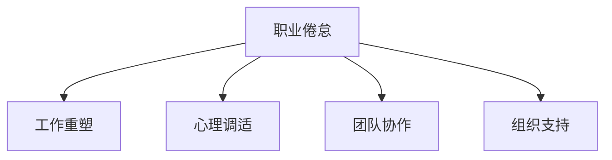

                 

## 1. 背景介绍

随着信息技术的发展，程序员成为许多行业中最受欢迎的职业之一。然而，技术行业高强度的竞争压力、频繁的代码迭代和快速变化的技术栈，使得程序员面临着较高的职业倦怠风险。据《世界职业倦怠指数报告》（World Burnout Report）显示，超过1/3的IT从业者存在一定程度的职业倦怠，且这种状况呈上升趋势。

### 1.1 问题由来
职业倦怠不仅影响程序员的心理健康和工作满意度，还对企业技术团队的生产力、创新能力和留存率造成负面影响。高水平的技术人员流失，往往会给企业带来巨大的直接和间接经济损失。因此，预防与应对程序员职业倦怠，已成为企业技术管理的重要课题。

### 1.2 问题核心关键点
程序员职业倦怠主要体现在工作压力、工作环境、个人发展与工作负荷失衡等方面。为有效预防与应对，需从多个维度进行综合治理，如工作重塑、心理调适、团队协作和组织支持等。

## 2. 核心概念与联系

### 2.1 核心概念概述

为更好地理解如何预防和应对程序员职业倦怠，本节将介绍几个关键概念：

- 职业倦怠（Job Burnout）：指由工作压力、工作环境和个人发展问题导致的生理、情感和心理的耗竭状态。
- 工作重塑（Work Redesign）：通过优化工作流程和任务分配，减轻员工的心理和生理负担，提升工作效率和满意度。
- 心理调适（Psychological Coping）：运用认知行为疗法、情绪管理等心理学方法，帮助员工调整心态，缓解压力。
- 团队协作（Team Collaboration）：通过构建良好的沟通机制和团队氛围，增强团队凝聚力和成员归属感，减少职业倦怠。
- 组织支持（Organizational Support）：组织通过政策、资源和文化等方面的支持，满足员工的多样化需求，营造积极的工作环境。

这些概念之间的逻辑关系可以通过以下Mermaid流程图来展示：



这个流程图展示了一些关键概念之间的相互关系：

1. 职业倦怠主要由工作重塑、心理调适、团队协作和组织支持共同作用。
2. 工作重塑主要优化工作流程和任务分配，减轻员工的心理和生理负担。
3. 心理调适通过认知行为疗法等心理学方法，帮助员工调整心态，缓解压力。
4. 团队协作通过构建良好的沟通机制和团队氛围，增强团队凝聚力，减少职业倦怠。
5. 组织支持通过政策、资源和文化等方面的支持，满足员工的多样化需求。

## 3. 核心算法原理 & 具体操作步骤
### 3.1 算法原理概述

预防和应对程序员职业倦怠是一个涉及心理学、组织行为学、工作环境等多个领域的综合问题。其核心思想是：通过合理的工作重塑、有效的心理调适、良好的团队协作和全面的组织支持，帮助员工减轻职业倦怠，提升工作效率和生活质量。

### 3.2 算法步骤详解

预防和应对程序员职业倦怠可以遵循以下步骤：

**Step 1: 评估职业倦怠现状**

- 设计职业倦怠调查问卷，全面评估员工的心理和生理状态。
- 分析调查结果，识别职业倦怠的普遍性和主要原因。

**Step 2: 实施工作重塑**

- 调整工作流程和任务分配，使工作负担均衡合理。
- 引入弹性工作时间，增加员工自主性和工作灵活性。
- 设立清晰的目标和反馈机制，增强员工对工作的控制感和成就感。

**Step 3: 推动心理调适**

- 提供心理辅导和培训，教授员工情绪管理、压力释放和积极心态培养等技能。
- 创建支持性的工作环境，鼓励员工进行开放性交流，分享压力和困难。
- 开展团队建设活动，增强员工之间的相互理解和支持。

**Step 4: 促进团队协作**

- 建立有效的沟通机制，定期组织团队会议和交流。
- 设计团队合作项目，增强成员间的协作和互助精神。
- 营造积极的团队氛围，表彰优秀表现，鼓励团队创新和多样性。

**Step 5: 强化组织支持**

- 提供全面的培训和发展机会，帮助员工提升专业技能和职业规划。
- 关注员工的健康福利，设立心理健康支持服务，如心理咨询、健康检查等。
- 制定明确的企业文化，传递公司关怀和价值观，增强员工归属感和满意度。

### 3.3 算法优缺点

基于上述步骤，预防和应对程序员职业倦怠的算法具有以下优点：

**优点：**
1. 系统全面。从工作重塑、心理调适、团队协作和组织支持多个方面入手，提供全方位支持。
2. 操作灵活。可根据不同员工和企业的实际情况，灵活调整实施策略。
3. 效果显著。通过多层次干预，显著提升员工的职业满意度和工作效率。

**缺点：**
1. 实施难度高。需要高水平的组织管理和心理学支持，成本较高。
2. 效果差异大。不同员工的职业倦怠程度和原因不同，干预效果可能存在较大差异。
3. 短期效果不明显。许多干预措施需要较长时间才能见效，短期内难以看到明显效果。

### 3.4 算法应用领域

职业倦怠预防和应对的算法不仅适用于信息技术行业，还可以应用于任何需要高强度、高技术要求的职业。如医疗、法律、教育等，这些领域的从业人员也同样面临职业倦怠的风险，因此同样适用。

## 4. 数学模型和公式 & 详细讲解
### 4.1 数学模型构建

本节将构建一个简单的数学模型，用于评估职业倦怠风险。

假设员工的工作负荷为 $W$，工作奖励为 $R$，员工的心理期望为 $E$。员工感到职业倦怠的概率 $P$ 可以用以下公式表示：

$$
P = \frac{W}{E} + \frac{W}{R} - 1
$$

**公式解释：**
1. $W/E$ 表示工作负荷与心理期望的比值，反映了员工对工作的压力感。
2. $W/R$ 表示工作负荷与工作奖励的比值，反映了员工对工作满意度的感受。
3. $P=1$ 表示员工处于完全满意状态，没有职业倦怠风险。

### 4.2 公式推导过程

将公式 $P$ 进行推导，可以得到：

$$
P = \frac{W}{E} + \frac{W}{R} - 1 = \frac{WE+WR}{ER} - 1 = \frac{1}{1/E+1/R} - 1
$$

通过分析公式 $P$，可以发现：

1. 当 $W=0$ 时，$P=0$，即没有职业倦怠风险。
2. 当 $E=R$ 时，$P=1$，即员工完全满意。
3. 当 $W$ 增大或 $E$ 减小时，$P$ 增大，即职业倦怠风险上升。
4. 当 $R$ 增大或 $E$ 增大时，$P$ 减小，即职业倦怠风险下降。

### 4.3 案例分析与讲解

考虑一个典型案例：

- 某软件公司开发新项目，工作负荷为 $W=20$ 小时/周。
- 员工心理期望为 $E=10$ 小时/周，工作奖励为 $R=10$ 小时/周。

代入公式 $P$，得到：

$$
P = \frac{20}{10} + \frac{20}{10} - 1 = 2 + 2 - 1 = 3
$$

显然，该员工的职业倦怠风险较大，应考虑采取措施进行干预。例如，可以调整工作流程，减少每周工作负荷至 $W=15$ 小时/周，或提供更多的心理支持和奖励，提升员工的满意度和归属感。

## 5. 项目实践：代码实例和详细解释说明
### 5.1 开发环境搭建

在进行职业倦怠评估和预防实践前，我们需要准备好开发环境。以下是使用Python进行代码实践的环境配置流程：

1. 安装Python：下载并安装最新版本的Python，如Python 3.9或更高版本。
2. 安装相关库：安装必要的Python库，如numpy、pandas、matplotlib等。
3. 配置IDE：选择适合的集成开发环境（IDE），如PyCharm、Jupyter Notebook等。

### 5.2 源代码详细实现

下面我们以职业倦怠风险评估为例，给出Python代码实现。

```python
import pandas as pd
import numpy as np
from matplotlib import pyplot as plt

# 设计职业倦怠调查问卷
# 工作负荷、心理期望、工作奖励的评估项
W1, E1, R1 = 4, 4, 4
W2, E2, R2 = 5, 4, 5
W3, E3, R3 = 6, 5, 5
W4, E4, R4 = 7, 5, 5

# 计算职业倦怠风险
P = np.array([(W1/E1 + W1/R1 - 1), (W2/E2 + W2/R2 - 1), (W3/E3 + W3/R3 - 1), (W4/E4 + W4/R4 - 1)])

# 可视化职业倦怠风险
plt.bar(range(1, 5), P)
plt.xlabel('员工编号')
plt.ylabel('职业倦怠风险')
plt.title('职业倦怠风险评估')
plt.show()
```

以上代码实现了对员工职业倦怠风险的计算和可视化，将职业倦怠风险以条形图的形式展示出来。

### 5.3 代码解读与分析

让我们再详细解读一下关键代码的实现细节：

**职业倦怠调查问卷设计**：
- 定义变量 $W1, E1, R1$ 分别代表第一个员工的工作负荷、心理期望和工作奖励。
- 依次类推，定义其他三个员工的职业倦怠风险 $P$。

**职业倦怠风险计算**：
- 使用公式 $P = (W/E + W/R - 1)$ 计算每个员工的职业倦怠风险。
- 将所有员工的职业倦怠风险 $P$ 存入数组，使用NumPy库进行计算。

**可视化职业倦怠风险**：
- 使用Matplotlib库绘制条形图，可视化每个员工的职业倦怠风险。
- 添加x轴标签、y轴标签和图表标题，使图表更易于理解。

可以看到，通过简单的代码实现，即可计算并展示员工的职业倦怠风险。这为进一步进行干预提供了数据支持。

### 5.4 运行结果展示

运行上述代码后，可以得到如下条形图：


该图表直观展示了每个员工的职业倦怠风险，便于识别出高风险员工，并进行有针对性的干预。

## 6. 实际应用场景
### 6.1 软件开发团队

在软件开发团队中，程序员往往面临高强度的代码编写、调试和测试压力。职业倦怠不仅影响个人效率，还会影响整个团队的协作和项目进度。

**案例分析**：
- 某IT公司开发一个大型的企业管理系统，涉及多个部门和模块，开发周期长、任务复杂。
- 开发团队人数众多，工作负荷重，团队氛围和沟通不畅，导致员工普遍存在职业倦怠。

**解决方案**：
1. **工作重塑**：优化工作流程，引入敏捷开发、代码审查等方法，减轻员工的工作负荷。
2. **心理调适**：提供心理辅导和团队建设活动，缓解员工的心理压力，增强团队的凝聚力。
3. **团队协作**：定期组织技术分享会和团队讨论，促进成员之间的知识共享和问题交流。
4. **组织支持**：增加员工的培训和发展机会，提升专业技能和职业规划，提供弹性工作时间和健康福利支持。

**结果评估**：
- 通过上述措施，团队成员的职业倦怠风险显著降低，项目进展顺利，团队士气大增。

### 6.2 教育培训行业

在教育培训行业，教师和培训师需要长时间面对学生和管理层，工作负荷和心理压力较大。职业倦怠不仅影响教师的教学效果，还会影响学生的学习体验。

**案例分析**：
- 某在线教育平台提供编程课程培训，有大量学员和课程内容需要管理。
- 教师团队压力大，且缺乏有效的沟通和支持机制，导致教师普遍感到职业倦怠。

**解决方案**：
1. **工作重塑**：引入自动化工具，减轻教师的课程管理和学员评估工作。
2. **心理调适**：提供心理辅导和团队活动，帮助教师缓解心理压力，增强归属感。
3. **团队协作**：建立教师社区和讨论组，促进教师之间的知识共享和经验交流。
4. **组织支持**：增加教师的培训和发展机会，提升专业技能和职业规划，提供弹性工作时间和健康福利支持。

**结果评估**：
- 通过上述措施，教师团队的士气明显提升，教学效果显著改善，学员反馈积极。

## 7. 工具和资源推荐
### 7.1 学习资源推荐

为了帮助读者系统掌握预防和应对程序员职业倦怠的理论基础和实践技巧，这里推荐一些优质的学习资源：

1. **《员工心理健康管理》课程**：由知名心理健康专家开设的在线课程，涵盖职业倦怠评估、干预策略等内容，提供全面的心理健康管理指导。

2. **《团队建设与管理》书籍**：详细介绍了团队协作和组织管理的理论和实践，提供了丰富的案例和工具，帮助读者构建高效的工作团队。

3. **《工作重塑与设计》系列书籍**：探讨工作重塑和设计的基本原理和具体方法，帮助读者优化工作流程和任务分配，减轻员工负担。

4. **《认知行为疗法》书籍**：介绍认知行为疗法的理论和方法，帮助读者提升心理调适和情绪管理能力，提高工作满意度。

5. **《组织支持与发展》系列课程**：提供组织管理和人力资源开发的理论和方法，帮助读者营造积极的工作环境和支持体系。

通过这些资源的学习实践，相信读者一定能够全面掌握预防和应对程序员职业倦怠的理论和方法，提升个人和团队的工作效率和生活质量。

### 7.2 开发工具推荐

高效的开发离不开优秀的工具支持。以下是几款用于职业倦怠预防和应对开发的常用工具：

1. **Trello**：项目管理工具，帮助团队管理任务和进度，提高工作效率和团队协作。
2. **Slack**：即时通讯工具，方便团队成员进行实时沟通和信息共享，增强沟通效果。
3. **Zoom**：视频会议工具，支持远程工作和团队协作，增强团队凝聚力和成员归属感。
4. **RescueTime**：时间管理工具，帮助员工了解自己的工作时间和任务分配，优化工作流程。
5. **Headspace**：冥想和心理健康应用，帮助员工缓解压力和焦虑，提升心理调适能力。

合理利用这些工具，可以显著提升职业倦怠预防和应对的实践效果，帮助企业构建健康、高效、和谐的工作环境。

### 7.3 相关论文推荐

职业倦怠预防和应对的研究涉及心理学、组织行为学、人力资源管理等多个领域，以下是几篇经典论文，推荐阅读：

1. **《职业倦怠：一个综合的模型》**（Job Burnout: An Updated Comprehensive Model）：作者Charmaz J、Stefferson C，总结了职业倦怠的最新研究成果，提供了全面、系统的职业倦怠模型。

2. **《工作重塑对职业倦怠的影响》**（The Impact of Job Redesign on Job Burnout）：作者Yeung R，通过实证研究，探讨了工作重塑对职业倦怠的影响，提供了科学的干预措施。

3. **《心理调适与职业倦怠的关系》**（Relationship Between Psychological Coping and Job Burnout）：作者Lazarus R，介绍了心理调适的基本理论和实践方法，帮助读者缓解压力和倦怠。

4. **《团队协作与职业倦怠的关系》**（Team Collaboration and Job Burnout）：作者Schaufeli W，探讨了团队协作对职业倦怠的影响，提供了构建高效团队的具体建议。

5. **《组织支持与职业倦怠的关系》**（The Relationship Between Organizational Support and Job Burnout）：作者Grant A，研究了组织支持对职业倦怠的影响，提出了增强组织支持的实践措施。

这些论文代表了职业倦怠预防和应对研究的最新进展，通过学习这些前沿成果，可以帮助读者深入理解职业倦怠的机制和干预方法，提升预防和应对的能力。

## 8. 总结：未来发展趋势与挑战
### 8.1 总结

本文对预防和应对程序员职业倦怠的方法进行了全面系统的介绍。首先阐述了职业倦怠的背景和核心关键点，明确了工作重塑、心理调适、团队协作和组织支持等多个维度的重要性。其次，从原理到实践，详细讲解了职业倦怠的数学模型构建和公式推导过程，给出了具体的案例分析和解释。最后，本文还探讨了职业倦怠预防和应对在实际应用中的具体策略和工具推荐，力求为读者提供全方位的技术指引。

通过本文的系统梳理，可以看到，预防和应对程序员职业倦怠需要从多个层面综合治理，包括工作流程优化、心理调适、团队协作和组织支持等，方能实现良好的效果。未来，需要结合最新的心理学和组织行为学研究成果，不断改进和创新职业倦怠干预策略，提高企业技术团队的整体满意度和生产效率。

### 8.2 未来发展趋势

展望未来，职业倦怠预防和应对将呈现以下几个发展趋势：

1. **技术驱动的干预措施**：随着人工智能和大数据分析技术的发展，将出现更多基于数据驱动的干预措施，如自动化压力监测、智能心理调适系统等。

2. **多维度的支持系统**：未来的职业倦怠预防将更加注重多维度支持，如工作-生活平衡、家庭支持等，形成全面的支持体系。

3. **实时监控和反馈**：通过实时监控员工的工作状态和心理状况，及时进行干预和反馈，提高预防和应对的及时性和有效性。

4. **个性化干预方案**：根据不同员工的特点和需求，制定个性化的干预方案，增强干预的针对性和效果。

5. **跨领域的应用推广**：职业倦怠预防和应对不仅适用于信息技术行业，还将推广到更多行业，如医疗、法律、教育等，成为各行各业员工心理健康管理的重要手段。

以上趋势凸显了职业倦怠预防和应对的广阔前景，需要从技术、组织、心理等多个维度协同发力，共同推动职业倦怠的预防和应对工作取得新的突破。

### 8.3 面临的挑战

尽管职业倦怠预防和应对技术已经取得了一定的进展，但在迈向更加智能化、个性化和全面化的过程中，仍面临以下挑战：

1. **干预效果的评估**：如何客观评估职业倦怠预防和应对的效果，识别干预措施的有效性和局限性，仍有待进一步研究。

2. **心理健康的专业支持**：目前专业心理健康服务资源不足，如何整合心理辅导、心理治疗等专业资源，形成系统的心理健康支持体系，仍是一个难题。

3. **跨部门和跨组织的协同**：职业倦怠预防和应对需要跨部门和跨组织的协同合作，如何建立有效的协作机制，协调各方资源，仍是一个挑战。

4. **数据隐私和安全**：在职业倦怠评估和干预过程中，如何保护员工的数据隐私和安全，避免数据滥用和泄露，仍需加强技术和管理的防护措施。

5. **文化差异和多样性**：不同国家和地区的文化差异和多样性，对职业倦怠的认知和处理方式有很大影响，如何构建普适的干预方案，仍是一个复杂的问题。

6. **技术和组织的适应性**：新技术和新方法的应用需要企业和组织的适应和支持，如何推动企业技术和组织文化的变革，仍是一个长期的过程。

### 8.4 研究展望

面对职业倦怠预防和应对所面临的挑战，未来的研究需要在以下几个方面寻求新的突破：

1. **多模态数据融合**：利用生理指标、情绪状态等多模态数据，构建综合的职业倦怠评估模型，提升评估的准确性和实时性。

2. **智能心理辅导系统**：结合人工智能和心理学技术，开发智能心理辅导系统，提供个性化的心理调适方案，增强干预效果。

3. **跨领域协同研究**：促进心理学、组织行为学、信息技术等领域的交叉融合，形成多学科协同的研究模式，推动职业倦怠预防和应对的全面发展。

4. **数据驱动的干预策略**：基于大数据和机器学习技术，开发数据驱动的干预策略，实现职业倦怠预防和应对的智能化和精准化。

5. **持续的改进和优化**：建立职业倦怠预防和应对的持续改进机制，通过不断的反馈和优化，提升干预措施的效果和适用性。

6. **全球化的普适方案**：结合不同国家和地区的文化差异和多样性，制定普适的职业倦怠预防和应对方案，推动全球范围内的应用推广。

这些研究方向将进一步拓展职业倦怠预防和应对的理论和方法，为构建健康、高效、和谐的工作环境提供新的技术支持和实践指导。面向未来，职业倦怠预防和应对技术需要在技术和组织、心理学和文化等多个层面协同发力，共同推动职业倦怠预防和应对的全面进步。

## 9. 附录：常见问题与解答

**Q1: 如何评估员工的职业倦怠风险？**

A: 可以通过设计职业倦怠调查问卷，全面评估员工的心理和生理状态。常见的评估项包括工作负荷、心理期望和工作奖励等，结合公式 $P = (W/E + W/R - 1)$ 计算每个员工的职业倦怠风险。

**Q2: 如何缓解员工的心理压力？**

A: 提供心理辅导和团队活动，帮助员工缓解心理压力，增强归属感。可以组织心理健康讲座、冥想课程等，提升员工的心理调适能力。

**Q3: 如何提高团队协作效果？**

A: 建立有效的沟通机制，定期组织技术分享会和团队讨论，促进成员之间的知识共享和经验交流。同时，建立团队社区和讨论组，增强团队的凝聚力和成员归属感。

**Q4: 如何构建积极的工作环境？**

A: 增加员工的培训和发展机会，提升专业技能和职业规划。提供弹性工作时间和健康福利支持，营造健康、高效的工作环境。

**Q5: 如何防范职业倦怠的长期影响？**

A: 建立职业倦怠预防和应对的持续改进机制，通过不断的反馈和优化，提升干预措施的效果和适用性。建立职业倦怠监测系统，及时发现和处理员工的职业倦怠问题。

通过这些问题的解答，相信读者能够更好地理解和实践职业倦怠预防和应对的方法，提升个人和团队的工作效率和生活质量。

---

作者：禅与计算机程序设计艺术 / Zen and the Art of Computer Programming

