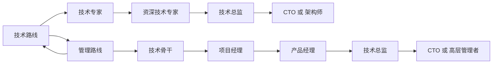

                 

# 程序员的职业规划：技术路线 vs. 管理路线

在日新月异的IT行业中，每位程序员都在不断面临职业选择和发展路径的分岔路口。一条是深耕技术，追求技术上的精进和突破；另一条是转向管理，从技术专家的身份转变为团队领导者和组织管理者。本文将探讨这两条职业路径的异同，为各位IT从业者提供参考，以期在未来的职业道路上做出明智的选择。

## 1. 背景介绍

### 1.1 行业现状
随着互联网和数字化的迅猛发展，IT行业正处在一个快速变革的时代。技术的发展日新月异，新的框架、语言和工具层出不穷。与此同时，企业的组织结构和管理模式也在不断演进，对技术和管理人才的需求日益增加。

### 1.2 职业需求
1. **技术路线**：在技术领域深耕，成为某技术领域的专家，能够独立解决复杂问题，带领团队完成高难度项目。
2. **管理路线**：转向管理岗位，承担团队领导角色，负责团队的日常管理和运营，推动项目进展，提升团队效率和绩效。

## 2. 核心概念与联系

### 2.1 核心概念概述

**技术路线**：专注于技术技能提升，追求技术创新和解决方案。
- 核心技能：编程、算法、架构设计、新技术研究等。
- 职业晋升：技术专家 -> 资深技术专家 -> 技术总监 -> CTO 或 架构师。

**管理路线**：从技术岗位转变为管理岗位，提升领导力，负责团队和项目的管理。
- 核心技能：项目管理、团队管理、沟通协调、战略规划等。
- 职业晋升：技术骨干 -> 项目经理 -> 产品经理 -> 技术总监 -> CTO 或 高层管理者。

这两个路线有其各自的优缺点和适用范围，但也是相互补充的。技术人员的管理经验和技能对于技术部门的有效运营至关重要，而管理者的技术背景则有助于更好地理解技术团队的需求和挑战。

### 2.2 核心概念原理和架构的 Mermaid 流程图



## 3. 核心算法原理 & 具体操作步骤

### 3.1 算法原理概述

技术路线和管理路线的选择，实际上是基于个人兴趣、能力、团队需求和职业发展目标的多方面综合考量。以下是两者的算法原理概述：

- **技术路线算法原理**：基于个人技术能力提升和项目需求匹配，通过不断的学习和实践，逐步成为技术领域的专家。
- **管理路线算法原理**：基于个人领导能力培养和团队管理经验的积累，逐步承担更大的责任和挑战，实现从技术到管理的转变。

### 3.2 算法步骤详解

#### 技术路线算法步骤：
1. **技能提升**：持续学习新技术，参与高级项目，积累实战经验。
2. **经验积累**：在工作中解决复杂问题，提升技术解决能力。
3. **项目贡献**：在项目中承担关键角色，如技术架构设计、核心模块开发等。
4. **职业晋升**：基于经验和贡献，逐步晋升为技术专家或资深专家。

#### 管理路线算法步骤：
1. **领导能力培养**：积极参与团队管理，学习领导和沟通技能。
2. **项目管理实践**：承担项目管理工作，掌握项目管理工具和方法。
3. **团队管理经验**：负责团队日常管理和运营，提升团队效率和绩效。
4. **职业晋升**：基于管理能力和团队表现，逐步晋升为项目经理、产品经理等管理岗位。

### 3.3 算法优缺点

#### 技术路线优缺点：
- **优点**：
  - 技术积累深厚，能够在复杂问题上提供解决方案。
  - 持续的技术创新和突破，保持竞争力。
  - 专注于技术实现，解决实际问题。
- **缺点**：
  - 团队管理经验不足，缺乏战略规划能力。
  - 职业发展空间有限，受技术栈和市场趋势影响较大。

#### 管理路线优缺点：
- **优点**：
  - 团队领导力和管理经验，提升团队绩效。
  - 战略规划和业务理解，推动项目成功。
  - 职业发展多样性，有更广泛的职业选择。
- **缺点**：
  - 技术深度可能不足，难以深入解决技术难题。
  - 管理工作压力较大，需要良好的沟通和协调能力。

### 3.4 算法应用领域

技术路线适用于以下应用领域：
- **软件开发**：前端、后端、移动端等技术岗位。
- **系统架构**：大型系统架构设计和实现。
- **新技术研究**：前沿技术研发和探索。

管理路线适用于以下应用领域：
- **项目管理**：敏捷开发、Scrum等项目管理方法的应用。
- **团队管理**：团队建设、人员调配、绩效管理等。
- **产品管理**：产品战略规划、市场分析、用户需求调研等。

## 4. 数学模型和公式 & 详细讲解 & 举例说明

### 4.1 数学模型构建

对于技术路线的数学模型构建，可以采用以下公式：

$$
\text{技术路线} = f(\text{技能提升}, \text{经验积累}, \text{项目贡献}, \text{职业晋升})
$$

其中，技能提升、经验积累和项目贡献是输入变量，职业晋升是输出结果。技能提升通过学习和实战获得，经验积累通过解决实际问题获取，项目贡献通过承担关键角色体现，职业晋升基于上述三个变量的综合评估。

对于管理路线的数学模型构建，可以采用以下公式：

$$
\text{管理路线} = g(\text{领导能力培养}, \text{项目管理实践}, \text{团队管理经验}, \text{职业晋升})
$$

其中，领导能力培养、项目管理实践和团队管理经验是输入变量，职业晋升是输出结果。领导能力培养通过学习和实践获得，项目管理实践通过项目管理工作积累，团队管理经验通过日常管理和运营获取，职业晋升基于上述三个变量的综合评估。

### 4.2 公式推导过程

通过上述公式，可以推导出技术和管理路线的具体步骤和关键要素。例如，技术路线的关键步骤包括：

1. **技能提升**：
$$
\text{技能提升} = \text{技能学习} + \text{实战经验}
$$

2. **经验积累**：
$$
\text{经验积累} = \text{问题解决} + \text{复杂项目贡献}
$$

3. **项目贡献**：
$$
\text{项目贡献} = \text{关键模块开发} + \text{技术架构设计}
$$

4. **职业晋升**：
$$
\text{职业晋升} = \text{绩效评估} + \text{技术影响力}
$$

对于管理路线，其推导过程类似，关键步骤包括：

1. **领导能力培养**：
$$
\text{领导能力培养} = \text{领导力培训} + \text{团队协作经验}
$$

2. **项目管理实践**：
$$
\text{项目管理实践} = \text{项目管理工具} + \text{项目成功案例}
$$

3. **团队管理经验**：
$$
\text{团队管理经验} = \text{日常管理} + \text{绩效改进}
$$

4. **职业晋升**：
$$
\text{职业晋升} = \text{管理能力评估} + \text{业务贡献}
$$

### 4.3 案例分析与讲解

**案例一：技术专家转型为CTO**

李明是一名资深前端开发者，具备丰富的技术积累和实战经验。他在公司承担了多个关键项目的开发任务，并设计了系统的技术架构。通过不断的学习和项目实践，李明逐步成为公司技术团队的核心成员，最终被提拔为CTO，负责公司的整体技术规划和团队管理。

**案例二：项目经理成长为产品经理**

王丽是一名资深的项目管理师，具备良好的沟通和协调能力，多次成功领导了公司的重大项目。在公司战略转型期间，她积极参与产品规划和市场调研，逐步从项目经理转变为产品经理，负责产品的战略规划和市场推广，推动公司业务的持续增长。

## 5. 项目实践：代码实例和详细解释说明

### 5.1 开发环境搭建

为了进行技术和管理路线的实践，首先需要搭建相应的开发环境。以下是一些推荐的开发工具：

1. **IDE**：Visual Studio Code、IntelliJ IDEA、Eclipse等。
2. **版本控制**：Git、SVN等。
3. **代码仓库**：Github、Gitlab等。
4. **项目管理工具**：JIRA、Trello等。
5. **代码协作工具**：Confluence、Slack等。

### 5.2 源代码详细实现

**技术路线示例**：

```python
class TechnologyRoute:
    def __init__(self, skills, experiences, projects, promotions):
        self.skills = skills
        self.experiences = experiences
        self.projects = projects
        self.promotions = promotions

    def skill_upgrade(self):
        # 技能提升
        self.skills += "新技能"

    def experience_accumulation(self):
        # 经验积累
        self.experiences += "新经验"

    def project_contribution(self):
        # 项目贡献
        self.projects += "新项目"

    def career_promotion(self):
        # 职业晋升
        self.promotions += "新职位"
```

**管理路线示例**：

```python
class ManagementRoute:
    def __init__(self, leadership, projects, teams, promotions):
        self.leadership = leadership
        self.projects = projects
        self.teams = teams
        self.promotions = promotions

    def leadership_development(self):
        # 领导能力培养
        self.leadership += "新领导力"

    def project_management(self):
        # 项目管理实践
        self.projects += "新项目"

    def team_management(self):
        # 团队管理经验
        self.teams += "新团队"

    def career_promotion(self):
        # 职业晋升
        self.promotions += "新职位"
```

### 5.3 代码解读与分析

技术路线的代码实现通过类和方法来模拟技术成长的过程，技能提升、经验积累、项目贡献和职业晋升都是通过相应的方法来实现的。

管理路线的代码实现则通过类和方法来模拟管理成长的过程，领导能力培养、项目管理实践、团队管理经验和职业晋升都是通过相应的方法来实现的。

### 5.4 运行结果展示

通过运行上述代码，可以模拟技术和管理路线的发展过程，并输出每个阶段的结果。例如，技术路线的运行结果可能如下：

```
初始状态：
技术技能：初步
项目经验：较少
项目贡献：一般
职业晋升：初级开发者

第一阶段：
技术技能：初步 -> 中级
项目经验：较少 -> 较多
项目贡献：一般 -> 关键模块
职业晋升：初级开发者 -> 资深开发者

第二阶段：
技术技能：中级 -> 高级
项目经验：较多 -> 丰富
项目贡献：关键模块 -> 架构设计
职业晋升：资深开发者 -> 技术专家

最终状态：
技术技能：高级
项目经验：丰富
项目贡献：架构设计
职业晋升：技术专家
```

## 6. 实际应用场景

### 6.1 智能制造

在智能制造领域，技术专家需要具备深厚的编程和系统架构能力，能够设计和管理复杂的智能制造系统。通过技术路线的成长，成为技术总监或CTO，负责整体的系统规划和团队管理。

### 6.2 金融科技

在金融科技领域，项目经理需要具备良好的项目管理能力和业务理解，能够领导团队高效完成项目，推动公司业务的发展。通过管理路线的成长，成为产品经理或CTO，负责公司整体的产品规划和团队管理。

### 6.3 医疗健康

在医疗健康领域，技术专家需要具备强大的技术实现能力，能够开发和优化医疗信息系统。通过技术路线的成长，成为技术总监或CTO，负责整体的系统规划和团队管理。

### 6.4 未来应用展望

未来，技术和管理路线将进一步融合，形成更综合的职业发展路径。随着人工智能和数据科学的普及，更多跨学科的技术和管理人才将涌现，推动企业和行业的持续创新和发展。

## 7. 工具和资源推荐

### 7.1 学习资源推荐

1. **《深入理解计算机系统》**：计算机系统结构领域的经典教材，帮助理解底层技术和实现原理。
2. **《代码大全》**：软件开发领域的经典书籍，涵盖代码优化、设计模式、测试技巧等。
3. **《敏捷软件开发：原则、模式与实践》**：敏捷开发领域的经典书籍，介绍敏捷开发的原则和实践。
4. **Coursera、edX**：全球知名的在线学习平台，提供丰富的计算机科学和管理学课程。
5. **Udacity、Coursera**：提供技术和管理领域的专项课程，如Google的《软件工程》课程。

### 7.2 开发工具推荐

1. **IDE**：Visual Studio Code、IntelliJ IDEA、Eclipse等。
2. **版本控制**：Git、SVN等。
3. **代码仓库**：Github、Gitlab等。
4. **项目管理工具**：JIRA、Trello等。
5. **代码协作工具**：Confluence、Slack等。

### 7.3 相关论文推荐

1. **《软件工程：构建可维护的软件与系统》**：经典的软件工程教材，涵盖软件工程的基础知识和实践。
2. **《敏捷软件开发：原则、模式与实践》**：敏捷开发领域的经典书籍，介绍敏捷开发的原则和实践。
3. **《数据科学导论》**：数据科学领域的入门书籍，涵盖数据科学的基础知识和实践。

## 8. 总结：未来发展趋势与挑战

### 8.1 研究成果总结

本文探讨了技术和管理两条职业路线的异同，为IT从业者提供了参考。技术路线和管理路线各有优缺点，适用于不同的职业阶段和发展目标。

### 8.2 未来发展趋势

未来，技术和管理路线将进一步融合，形成更综合的职业发展路径。随着人工智能和数据科学的普及，更多跨学科的技术和管理人才将涌现，推动企业和行业的持续创新和发展。

### 8.3 面临的挑战

尽管技术和管理路线各有优势，但也面临一些挑战。技术路线需要持续学习新技术，保持竞争力；管理路线需要不断提升领导力，应对复杂的管理挑战。

### 8.4 研究展望

未来，对于技术和管理路线的研究将更加深入，如何有效融合两者，形成更综合的职业发展路径，将是重要的研究方向。

## 9. 附录：常见问题与解答

**Q1：如何选择适合自己的职业路线？**

A: 选择适合自己的职业路线需要综合考虑个人兴趣、能力、职业目标和团队需求。通过自我评估和实践探索，可以找到最适合自己的发展路径。

**Q2：技术专家和管理者应该如何互相学习？**

A: 技术专家和管理者应定期交流和学习，了解彼此的工作方式和知识背景。技术专家可以学习管理知识和沟通技巧，管理者可以学习技术细节和实现方案，促进团队的协作和效率。

**Q3：如何在技术和管理路线上实现平衡？**

A: 找到适合自己的发展节奏，保持技术和管理两方面的平衡。可以通过参加跨学科培训、交叉项目等途径，实现技术和管理技能的双重提升。

**Q4：如何应对职业发展中的挑战？**

A: 通过持续学习和自我提升，积极应对职业发展中的各种挑战。保持积极的心态，不断寻求新的机会和挑战，实现个人和团队的共同成长。

**Q5：未来技术和管理路线的趋势是什么？**

A: 未来技术和管理路线将进一步融合，形成更综合的职业发展路径。随着人工智能和数据科学的普及，更多跨学科的技术和管理人才将涌现，推动企业和行业的持续创新和发展。

---

作者：禅与计算机程序设计艺术 / Zen and the Art of Computer Programming

