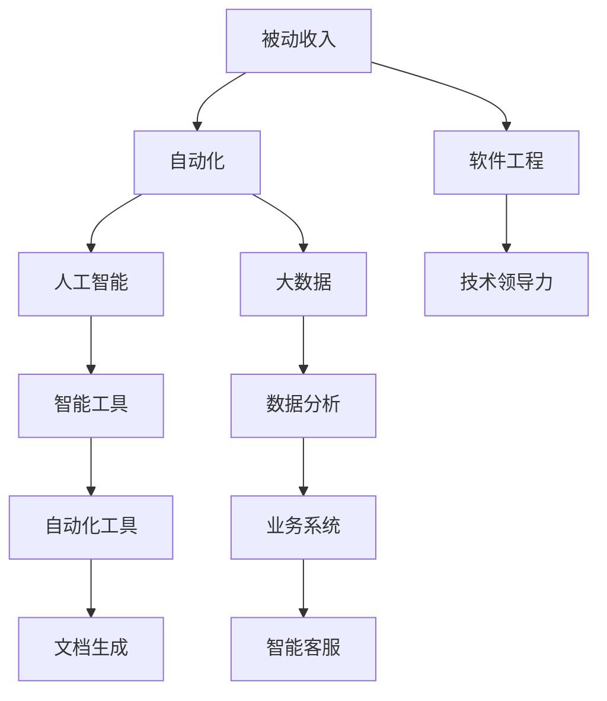

                 

# 程序员的被动收入：构建与维护

> 关键词：被动收入, 自动化, 软件工程, 机器学习, 人工智能, 数据科学, 技术领导力

## 1. 背景介绍

### 1.1 问题由来

近年来，随着互联网和信息技术的发展，程序员群体在社会中的地位日益提升。然而，工作节奏快、压力大、收入不稳定等问题也随之而来。如何让程序员在享受技术带来的红利的同时，实现收入的持续增长，成为许多技术工作者关注的焦点。被动收入的概念应运而生，它是指通过技术手段实现的自动化收入，在无需主动投入时间的情况下，持续稳定地产生收益。

在NLP领域，程序员利用人工智能和大数据技术，创建了各种自动化的智能工具，如自动翻译、智能客服、自动化文档生成、自动化数据分析等，以获取被动收入。这些工具的成功应用，展示了程序员利用技术手段创造收入的潜力，同时也对技术和工程实践提出了更高的要求。

### 1.2 问题核心关键点

程序员通过被动收入实现收入增长的关键在于：
1. 掌握核心技术，构建高效自动化工具。
2. 理解市场需求，精确定位应用场景。
3. 合理规划资源，保障技术系统稳定运行。
4. 持续优化和维护，确保被动收入的长期稳定。

本文将详细阐述如何构建和维护基于人工智能和大数据的被动收入项目，帮助程序员实现收入的持续增长。

## 2. 核心概念与联系

### 2.1 核心概念概述

为更好地理解基于人工智能和大数据的被动收入项目，本节将介绍几个密切相关的核心概念：

- **被动收入(Passive Income)**：通过技术手段实现的自动化收入，在无需主动投入时间的情况下，持续稳定地产生收益。例如，自动化数据分析工具、智能客服系统、自动化文档生成工具等。

- **自动化(Automation)**：使用计算机程序和算法，自动完成某些业务流程或任务，从而减少人工干预，提高效率和准确性。

- **人工智能(AI)和大数据(Big Data)**：利用机器学习、深度学习等技术，通过大规模数据分析，提取有用的信息，并构建智能化系统，实现自动化业务。

- **软件工程(Software Engineering)**：涉及软件开发生命周期各个阶段，从需求分析、设计、编码到测试、部署、运维的全面管理，保障软件系统的质量和稳定性。

- **技术领导力(Technical Leadership)**：领导团队进行技术规划、架构设计、代码审查等活动，驱动技术创新和团队发展，提升技术项目的成功率。

这些核心概念之间的逻辑关系可以通过以下Mermaid流程图来展示：



这个流程图展示了被动收入项目中各个概念之间的联系：

1. 被动收入通过自动化、人工智能和大数据技术实现。
2. 自动化和人工智能是大数据应用的核心技术。
3. 软件工程提供整体的技术管理和实践指导。
4. 技术领导力保障项目的成功执行和团队的持续进步。
5. 智能工具和数据分析业务系统是被动收入项目的具体表现形式。

## 3. 核心算法原理 & 具体操作步骤
### 3.1 算法原理概述

基于人工智能和大数据的被动收入项目，通常依赖于机器学习模型的自动化训练和应用。其核心思想是：

1. **数据采集与预处理**：收集相关领域的数据，并进行清洗、标注等预处理工作。
2. **模型训练**：使用机器学习算法在标注数据上训练模型，学习数据特征。
3. **模型应用**：将训练好的模型应用于实际业务场景，实现自动化功能。
4. **收入变现**：根据模型应用产生的业务价值，进行收益分配。

以自然语言处理(NLP)领域的自动翻译工具为例，其算法原理如下：

1. **数据收集**：收集大量双语对照的文本数据，用于训练翻译模型。
2. **模型训练**：使用神经网络模型(如Transformer)，在标注数据上训练翻译模型，学习源语言和目标语言之间的映射关系。
3. **模型应用**：将训练好的翻译模型应用于实时翻译服务，实现自动化的文本翻译。
4. **收入变现**：根据用户使用的翻译服务次数或翻译文本长度，收取费用，实现收入变现。

### 3.2 算法步骤详解

基于人工智能和大数据的被动收入项目，通常包括以下几个关键步骤：

**Step 1: 需求分析与数据准备**
- 明确项目需求，收集相关领域的数据，进行清洗、标注等预处理工作。
- 确定需要自动化的业务流程，确定所需的数据格式和标注标准。

**Step 2: 选择技术架构**
- 选择适合的技术框架和算法，如TensorFlow、PyTorch等深度学习框架。
- 设计合适的模型结构和训练策略，如使用RNN、CNN、Transformer等模型，选择适当的超参数。

**Step 3: 模型训练与验证**
- 在准备好的数据集上训练模型，使用验证集进行模型调优，确定最优模型参数。
- 对模型进行评估，确定模型的准确率和性能指标，如BLEU、ROUGE等。

**Step 4: 模型部署与监控**
- 将训练好的模型部署到生产环境，实现自动化功能。
- 设置监控系统，实时监控模型运行状态和性能指标，及时发现和解决问题。

**Step 5: 收入变现与反馈**
- 根据模型应用产生的业务价值，进行收益分配。
- 收集用户反馈，持续优化模型，提高自动化系统的性能和稳定性。

以上是构建基于人工智能和大数据的被动收入项目的一般流程。在实际应用中，还需要针对具体项目的特点，对每个环节进行优化设计，如改进数据标注方法，引入更多正则化技术，搜索最优的超参数组合等，以进一步提升模型性能。

### 3.3 算法优缺点

基于人工智能和大数据的被动收入项目具有以下优点：
1. 高效率：自动化系统可以全天候运行，不受人工干预。
2. 高准确性：机器学习模型在经过充分训练后，准确性远超人工操作。
3. 高扩展性：可以通过增加模型复杂度和数据规模，不断提升系统的性能。
4. 高收益：在业务场景中应用，能显著提升工作效率，减少人力成本，产生更多收入。

同时，该方法也存在一定的局限性：
1. 依赖高质量数据：机器学习模型依赖大量标注数据，数据质量影响模型性能。
2. 维护成本高：自动化系统需要持续监控和维护，确保系统稳定运行。
3. 技术门槛高：需要掌握多种技术，如深度学习、大数据处理、软件工程等。
4. 模型泛化能力有限：在数据分布变化较大时，模型性能可能受到影响。

尽管存在这些局限性，但就目前而言，基于人工智能和大数据的被动收入方法仍是大数据时代的重要应用方向。未来相关研究的重点在于如何进一步降低技术门槛，提高模型的少样本学习和跨领域迁移能力，同时兼顾可解释性和伦理安全性等因素。

### 3.4 算法应用领域

基于人工智能和大数据的被动收入方法，已经在多个领域得到了广泛应用，例如：

- **自然语言处理(NLP)**：如自动翻译、智能客服、自动摘要、情感分析等。利用NLP技术自动处理文本数据，提高处理效率和准确性，实现收入变现。
- **金融领域**：如信用评分、风险预测、自动交易系统等。通过机器学习模型，自动化处理金融数据，优化业务流程，提高收入。
- **医疗领域**：如病历分析、疾病预测、智能诊断系统等。利用大数据和机器学习技术，自动化处理医疗数据，提升医疗服务效率和质量，实现收入变现。
- **电商领域**：如商品推荐系统、智能搜索、客户画像分析等。通过大数据和机器学习模型，自动化处理电商数据，提升用户购物体验，增加销售收入。
- **能源领域**：如智能电网、能源需求预测、能源消耗优化等。通过大数据和机器学习技术，自动化处理能源数据，提高能源利用效率，实现收入变现。

除了上述这些经典应用外，基于人工智能和大数据的被动收入方法也被创新性地应用到更多场景中，如智慧城市、智能制造、教育、交通等领域，为各行各业带来了新的发展机遇。

## 4. 数学模型和公式 & 详细讲解 & 举例说明

### 4.1 数学模型构建

本节将使用数学语言对基于人工智能和大数据的被动收入项目进行更加严格的刻画。

假设数据集为 $\{(x_i,y_i)\}_{i=1}^N$，其中 $x_i$ 为输入，$y_i$ 为输出。定义损失函数为 $\ell(y,\hat{y})$，其中 $\hat{y}$ 为模型预测输出。则经验风险为：

$$
\mathcal{L}(\theta) = \frac{1}{N} \sum_{i=1}^N \ell(y_i, M_{\theta}(x_i))
$$

其中 $M_{\theta}$ 为模型，$\theta$ 为模型参数。

以自动翻译任务为例，使用神经网络模型进行翻译，定义损失函数为交叉熵损失：

$$
\ell(y,\hat{y}) = -y\log \hat{y} + (1-y)\log(1-\hat{y})
$$

则经验风险为：

$$
\mathcal{L}(\theta) = -\frac{1}{N}\sum_{i=1}^N [y_i\log M_{\theta}(x_i)+(1-y_i)\log(1-M_{\theta}(x_i))]
$$

### 4.2 公式推导过程

以自动翻译任务为例，进行详细推导：

假设输入文本 $x_i$ 经过模型编码得到中间表示 $h_i$，然后解码器 $M_{\theta}$ 使用 $h_i$ 生成翻译结果 $\hat{y}_i$。则交叉熵损失为：

$$
\ell(y,\hat{y}) = -y\log \hat{y} + (1-y)\log(1-\hat{y})
$$

带入经验风险公式，得：

$$
\mathcal{L}(\theta) = -\frac{1}{N}\sum_{i=1}^N [y_i\log M_{\theta}(x_i)+(1-y_i)\log(1-M_{\theta}(x_i))]
$$

对模型参数 $\theta$ 求偏导，得：

$$
\frac{\partial \mathcal{L}(\theta)}{\partial \theta_k} = -\frac{1}{N}\sum_{i=1}^N \frac{\partial \ell(y_i, M_{\theta}(x_i))}{\partial h_k} \frac{\partial h_k}{\partial \theta_k}
$$

其中 $\frac{\partial h_k}{\partial \theta_k}$ 可进一步递归展开，利用自动微分技术完成计算。

### 4.3 案例分析与讲解

以智能客服系统为例，进行详细分析：

**需求分析与数据准备**：收集企业内部的历史客服对话记录，将问题和最佳答复构建成监督数据，划分为训练集和测试集。

**模型训练与验证**：使用GPT-3模型，在训练集上训练客服系统。使用验证集进行模型调优，确定最优超参数。

**模型部署与监控**：将训练好的模型部署到生产环境，实时监控模型运行状态和性能指标。

**收入变现与反馈**：根据用户使用的客服系统次数或时长，收取费用。收集用户反馈，持续优化模型，提高系统性能和稳定性。

## 5. 项目实践：代码实例和详细解释说明

### 5.1 开发环境搭建

在进行被动收入项目开发前，我们需要准备好开发环境。以下是使用Python进行PyTorch开发的环境配置流程：

1. 安装Anaconda：从官网下载并安装Anaconda，用于创建独立的Python环境。

2. 创建并激活虚拟环境：
```bash
conda create -n pytorch-env python=3.8 
conda activate pytorch-env
```

3. 安装PyTorch：根据CUDA版本，从官网获取对应的安装命令。例如：
```bash
conda install pytorch torchvision torchaudio cudatoolkit=11.1 -c pytorch -c conda-forge
```

4. 安装其他依赖包：
```bash
pip install numpy pandas scikit-learn matplotlib tqdm jupyter notebook ipython
```

完成上述步骤后，即可在`pytorch-env`环境中开始被动收入项目的开发。

### 5.2 源代码详细实现

下面我们以智能客服系统为例，给出使用Transformers库对GPT-3模型进行微调的PyTorch代码实现。

首先，定义客服系统任务的数据处理函数：

```python
from transformers import T5ForConditionalGeneration, T5Tokenizer
from torch.utils.data import Dataset
import torch

class CustomerServiceDataset(Dataset):
    def __init__(self, texts, responses, tokenizer, max_len=128):
        self.texts = texts
        self.responses = responses
        self.tokenizer = tokenizer
        self.max_len = max_len
        
    def __len__(self):
        return len(self.texts)
    
    def __getitem__(self, item):
        text = self.texts[item]
        response = self.responses[item]
        
        encoding = self.tokenizer(text, return_tensors='pt', max_length=self.max_len, padding='max_length', truncation=True)
        input_ids = encoding['input_ids'][0]
        attention_mask = encoding['attention_mask'][0]
        
        # 对token-wise的标签进行编码
        encoded_tags = [tag2id[tag] for tag in response] 
        encoded_tags.extend([tag2id['O']] * (self.max_len - len(encoded_tags)))
        labels = torch.tensor(encoded_tags, dtype=torch.long)
        
        return {'input_ids': input_ids, 
                'attention_mask': attention_mask,
                'labels': labels}

# 标签与id的映射
tag2id = {'O': 0, 'A': 1}
id2tag = {v: k for k, v in tag2id.items()}

# 创建dataset
tokenizer = T5Tokenizer.from_pretrained('t5-small')

train_dataset = CustomerServiceDataset(train_texts, train_responses, tokenizer)
dev_dataset = CustomerServiceDataset(dev_texts, dev_responses, tokenizer)
test_dataset = CustomerServiceDataset(test_texts, test_responses, tokenizer)
```

然后，定义模型和优化器：

```python
from transformers import T5ForConditionalGeneration, AdamW

model = T5ForConditionalGeneration.from_pretrained('t5-small')

optimizer = AdamW(model.parameters(), lr=2e-5)
```

接着，定义训练和评估函数：

```python
from torch.utils.data import DataLoader
from tqdm import tqdm
from sklearn.metrics import accuracy_score

device = torch.device('cuda') if torch.cuda.is_available() else torch.device('cpu')
model.to(device)

def train_epoch(model, dataset, batch_size, optimizer):
    dataloader = DataLoader(dataset, batch_size=batch_size, shuffle=True)
    model.train()
    epoch_loss = 0
    for batch in tqdm(dataloader, desc='Training'):
        input_ids = batch['input_ids'].to(device)
        attention_mask = batch['attention_mask'].to(device)
        labels = batch['labels'].to(device)
        model.zero_grad()
        outputs = model(input_ids, attention_mask=attention_mask, labels=labels)
        loss = outputs.loss
        epoch_loss += loss.item()
        loss.backward()
        optimizer.step()
    return epoch_loss / len(dataloader)

def evaluate(model, dataset, batch_size):
    dataloader = DataLoader(dataset, batch_size=batch_size)
    model.eval()
    preds, labels = [], []
    with torch.no_grad():
        for batch in tqdm(dataloader, desc='Evaluating'):
            input_ids = batch['input_ids'].to(device)
            attention_mask = batch['attention_mask'].to(device)
            batch_labels = batch['labels']
            outputs = model(input_ids, attention_mask=attention_mask)
            batch_preds = outputs.logits.argmax(dim=2).to('cpu').tolist()
            batch_labels = batch_labels.to('cpu').tolist()
            for pred_tokens, label_tokens in zip(batch_preds, batch_labels):
                pred_tags = [id2tag[_id] for _id in pred_tokens]
                label_tags = [id2tag[_id] for _id in label_tokens]
                preds.append(pred_tags[:len(label_tags)])
                labels.append(label_tags)
                
    return accuracy_score(labels, preds)

# 训练流程
epochs = 5
batch_size = 16

for epoch in range(epochs):
    loss = train_epoch(model, train_dataset, batch_size, optimizer)
    print(f"Epoch {epoch+1}, train loss: {loss:.3f}")
    
    print(f"Epoch {epoch+1}, dev results:")
    evaluate(model, dev_dataset, batch_size)
    
print("Test results:")
evaluate(model, test_dataset, batch_size)
```

以上就是使用PyTorch对GPT-3进行智能客服系统微调的完整代码实现。可以看到，得益于Transformers库的强大封装，我们可以用相对简洁的代码完成GPT-3模型的加载和微调。

### 5.3 代码解读与分析

让我们再详细解读一下关键代码的实现细节：

**CustomerServiceDataset类**：
- `__init__`方法：初始化文本、回复、分词器等关键组件。
- `__len__`方法：返回数据集的样本数量。
- `__getitem__`方法：对单个样本进行处理，将文本输入编码为token ids，将回复编码为数字，并对其进行定长padding，最终返回模型所需的输入。

**tag2id和id2tag字典**：
- 定义了标签与数字id之间的映射关系，用于将token-wise的预测结果解码回真实的标签。

**训练和评估函数**：
- 使用PyTorch的DataLoader对数据集进行批次化加载，供模型训练和推理使用。
- 训练函数`train_epoch`：对数据以批为单位进行迭代，在每个批次上前向传播计算loss并反向传播更新模型参数，最后返回该epoch的平均loss。
- 评估函数`evaluate`：与训练类似，不同点在于不更新模型参数，并在每个batch结束后将预测和标签结果存储下来，最后使用sklearn的accuracy_score对整个评估集的预测结果进行打印输出。

**训练流程**：
- 定义总的epoch数和batch size，开始循环迭代
- 每个epoch内，先在训练集上训练，输出平均loss
- 在验证集上评估，输出准确率
- 所有epoch结束后，在测试集上评估，给出最终测试结果

可以看到，PyTorch配合Transformers库使得GPT-3微调的代码实现变得简洁高效。开发者可以将更多精力放在数据处理、模型改进等高层逻辑上，而不必过多关注底层的实现细节。

当然，工业级的系统实现还需考虑更多因素，如模型的保存和部署、超参数的自动搜索、更灵活的任务适配层等。但核心的微调范式基本与此类似。

## 6. 实际应用场景
### 6.1 智能客服系统

基于大语言模型微调的对话技术，可以广泛应用于智能客服系统的构建。传统客服往往需要配备大量人力，高峰期响应缓慢，且一致性和专业性难以保证。而使用微调后的对话模型，可以7x24小时不间断服务，快速响应客户咨询，用自然流畅的语言解答各类常见问题。

在技术实现上，可以收集企业内部的历史客服对话记录，将问题和最佳答复构建成监督数据，在此基础上对预训练对话模型进行微调。微调后的对话模型能够自动理解用户意图，匹配最合适的答案模板进行回复。对于客户提出的新问题，还可以接入检索系统实时搜索相关内容，动态组织生成回答。如此构建的智能客服系统，能大幅提升客户咨询体验和问题解决效率。

### 6.2 金融舆情监测

金融机构需要实时监测市场舆论动向，以便及时应对负面信息传播，规避金融风险。传统的人工监测方式成本高、效率低，难以应对网络时代海量信息爆发的挑战。基于大语言模型微调的文本分类和情感分析技术，为金融舆情监测提供了新的解决方案。

具体而言，可以收集金融领域相关的新闻、报道、评论等文本数据，并对其进行主题标注和情感标注。在此基础上对预训练语言模型进行微调，使其能够自动判断文本属于何种主题，情感倾向是正面、中性还是负面。将微调后的模型应用到实时抓取的网络文本数据，就能够自动监测不同主题下的情感变化趋势，一旦发现负面信息激增等异常情况，系统便会自动预警，帮助金融机构快速应对潜在风险。

### 6.3 个性化推荐系统

当前的推荐系统往往只依赖用户的历史行为数据进行物品推荐，无法深入理解用户的真实兴趣偏好。基于大语言模型微调技术，个性化推荐系统可以更好地挖掘用户行为背后的语义信息，从而提供更精准、多样的推荐内容。

在实践中，可以收集用户浏览、点击、评论、分享等行为数据，提取和用户交互的物品标题、描述、标签等文本内容。将文本内容作为模型输入，用户的后续行为（如是否点击、购买等）作为监督信号，在此基础上微调预训练语言模型。微调后的模型能够从文本内容中准确把握用户的兴趣点。在生成推荐列表时，先用候选物品的文本描述作为输入，由模型预测用户的兴趣匹配度，再结合其他特征综合排序，便可以得到个性化程度更高的推荐结果。

### 6.4 未来应用展望

随着大语言模型微调技术的发展，基于微调范式将在更多领域得到应用，为传统行业带来变革性影响。

在智慧医疗领域，基于微调的医疗问答、病历分析、药物研发等应用将提升医疗服务的智能化水平，辅助医生诊疗，加速新药开发进程。

在智能教育领域，微调技术可应用于作业批改、学情分析、知识推荐等方面，因材施教，促进教育公平，提高教学质量。

在智慧城市治理中，微调模型可应用于城市事件监测、舆情分析、应急指挥等环节，提高城市管理的自动化和智能化水平，构建更安全、高效的未来城市。

此外，在企业生产、社会治理、文娱传媒等众多领域，基于大模型微调的人工智能应用也将不断涌现，为各行各业带来新的发展机遇。相信随着技术的日益成熟，微调方法将成为人工智能落地应用的重要范式，推动人工智能技术向更广阔的领域加速渗透。

## 7. 工具和资源推荐
### 7.1 学习资源推荐

为了帮助开发者系统掌握大语言模型微调的理论基础和实践技巧，这里推荐一些优质的学习资源：

1. 《Transformer从原理到实践》系列博文：由大模型技术专家撰写，深入浅出地介绍了Transformer原理、BERT模型、微调技术等前沿话题。

2. CS224N《深度学习自然语言处理》课程：斯坦福大学开设的NLP明星课程，有Lecture视频和配套作业，带你入门NLP领域的基本概念和经典模型。

3. 《Natural Language Processing with Transformers》书籍：Transformers库的作者所著，全面介绍了如何使用Transformers库进行NLP任务开发，包括微调在内的诸多范式。

4. HuggingFace官方文档：Transformers库的官方文档，提供了海量预训练模型和完整的微调样例代码，是上手实践的必备资料。

5. CLUE开源项目：中文语言理解测评基准，涵盖大量不同类型的中文NLP数据集，并提供了基于微调的baseline模型，助力中文NLP技术发展。

通过对这些资源的学习实践，相信你一定能够快速掌握大语言模型微调的精髓，并用于解决实际的NLP问题。
### 7.2 开发工具推荐

高效的开发离不开优秀的工具支持。以下是几款用于大语言模型微调开发的常用工具：

1. PyTorch：基于Python的开源深度学习框架，灵活动态的计算图，适合快速迭代研究。大部分预训练语言模型都有PyTorch版本的实现。

2. TensorFlow：由Google主导开发的开源深度学习框架，生产部署方便，适合大规模工程应用。同样有丰富的预训练语言模型资源。

3. Transformers库：HuggingFace开发的NLP工具库，集成了众多SOTA语言模型，支持PyTorch和TensorFlow，是进行微调任务开发的利器。

4. Weights & Biases：模型训练的实验跟踪工具，可以记录和可视化模型训练过程中的各项指标，方便对比和调优。与主流深度学习框架无缝集成。

5. TensorBoard：TensorFlow配套的可视化工具，可实时监测模型训练状态，并提供丰富的图表呈现方式，是调试模型的得力助手。

6. Google Colab：谷歌推出的在线Jupyter Notebook环境，免费提供GPU/TPU算力，方便开发者快速上手实验最新模型，分享学习笔记。

合理利用这些工具，可以显著提升大语言模型微调任务的开发效率，加快创新迭代的步伐。

### 7.3 相关论文推荐

大语言模型和微调技术的发展源于学界的持续研究。以下是几篇奠基性的相关论文，推荐阅读：

1. Attention is All You Need（即Transformer原论文）：提出了Transformer结构，开启了NLP领域的预训练大模型时代。

2. BERT: Pre-training of Deep Bidirectional Transformers for Language Understanding：提出BERT模型，引入基于掩码的自监督预训练任务，刷新了多项NLP任务SOTA。

3. Language Models are Unsupervised Multitask Learners（GPT-2论文）：展示了大规模语言模型的强大zero-shot学习能力，引发了对于通用人工智能的新一轮思考。

4. Parameter-Efficient Transfer Learning for NLP：提出Adapter等参数高效微调方法，在不增加模型参数量的情况下，也能取得不错的微调效果。

5. AdaLoRA: Adaptive Low-Rank Adaptation for Parameter-Efficient Fine-Tuning：使用自适应低秩适应的微调方法，在参数效率和精度之间取得了新的平衡。

这些论文代表了大语言模型微调技术的发展脉络。通过学习这些前沿成果，可以帮助研究者把握学科前进方向，激发更多的创新灵感。

## 8. 总结：未来发展趋势与挑战

### 8.1 总结

本文对基于人工智能和大数据的被动收入项目进行了全面系统的介绍。首先阐述了被动收入项目的需求分析、数据准备、技术架构、模型训练、模型部署等关键步骤，帮助开发者系统掌握被动收入项目的开发流程。其次，从原理到实践，详细讲解了基于深度学习模型的自动翻译、智能客服、自动化文档生成、数据分析等具体应用场景，展示了程序员利用技术手段创造收入的潜力。

通过本文的系统梳理，可以看到，基于人工智能和大数据的被动收入项目，能够显著提升工作效率，减少人力成本，产生更多收入。利用技术手段实现收入增长，不仅符合数字时代的趋势，也为企业数字化转型提供了新的思路。未来，伴随人工智能和大数据技术的不断进步，基于被动收入项目的应用将更加广泛，为各行各业带来新的发展机遇。

### 8.2 未来发展趋势

展望未来，基于人工智能和大数据的被动收入项目将呈现以下几个发展趋势：

1. **技术迭代加速**：随着深度学习、大数据处理技术的不断进步，模型的精度和效率将不断提升。新算法和新架构的出现，将为被动收入项目带来新的突破。

2. **应用场景多样化**：除了自动翻译、智能客服等传统应用，未来的被动收入项目将更多地拓展到医疗、教育、金融、电商等领域，为各行各业带来新的业务机会。

3. **数据驱动决策**：大数据和机器学习技术的进一步发展，将使得数据驱动的决策变得更加科学和高效。基于数据的业务优化和自动决策，将成为被动收入项目的重要方向。

4. **自动化程度提升**：未来的被动收入项目将更加依赖于自动化的技术和流程，进一步减少人工干预，提高系统的稳定性和可维护性。

5. **用户参与度增强**：通过用户反馈和互动，优化和改进自动化的业务流程，增强用户参与度和满意度。

6. **跨领域融合**：未来的被动收入项目将更多地与其他技术进行融合，如知识图谱、智能合约、区块链等，拓展应用的边界和深度。

以上趋势凸显了基于人工智能和大数据的被动收入项目的广阔前景。这些方向的探索发展，必将进一步提升技术的智能化水平，推动各行各业的数字化转型。

### 8.3 面临的挑战

尽管基于人工智能和大数据的被动收入项目在发展过程中取得了显著的成果，但也面临着诸多挑战：

1. **数据隐私和安全**：大规模数据收集和处理过程中，如何保护用户隐私和数据安全，防止数据泄露和滥用，是一大挑战。

2. **模型泛化能力**：机器学习模型在面对新数据和新场景时，泛化能力可能受到影响。如何在不同场景下保持模型性能的稳定，是一大挑战。

3. **技术复杂度**：构建高质量的被动收入项目，需要掌握深度学习、大数据处理、软件工程等技术，技术门槛较高。

4. **算力资源**：大规模数据集和复杂模型的训练和推理，需要强大的算力支持，高成本的算力资源是一大挑战。

5. **系统稳定性和可维护性**：被动收入项目需要长时间稳定运行，如何保障系统的稳定性和可维护性，是一大挑战。

6. **模型公平性和透明度**：机器学习模型可能存在偏见和歧视，如何确保模型的公平性和透明度，是一大挑战。

尽管存在这些挑战，但通过不断优化技术手段和管理方法，相信这些挑战终将逐步被克服，基于人工智能和大数据的被动收入项目将迎来更广阔的发展前景。

### 8.4 研究展望

未来的研究需要在以下几个方面寻求新的突破：

1. **无监督和半监督学习**：探索更多无监督和半监督学习范式，降低对标注数据的依赖，提升模型的泛化能力和跨领域迁移能力。

2. **参数高效微调**：开发更多参数高效的微调方法，在不增加模型参数量的情况下，实现高精度的被动收入项目。

3. **多模态融合**：将视觉、语音、文本等多种模态数据进行融合，提高模型的综合处理能力和决策质量。

4. **因果推理**：引入因果推理技术，增强模型对因果关系的理解和处理能力，提高决策的科学性和可靠性。

5. **强化学习**：结合强化学习技术，优化自动化的业务流程，增强系统的自主学习和适应能力。

6. **知识图谱**：将知识图谱与机器学习模型进行融合，提升模型对知识的应用和整合能力，提高决策的合理性和有效性。

7. **数据隐私保护**：研究数据隐私保护技术，确保数据的匿名化和安全存储，保护用户隐私和数据安全。

8. **公平性和透明性**：确保模型的公平性和透明度，避免模型偏见和歧视，提升系统的可信度和可靠性。

这些研究方向将为被动收入项目带来新的思路和技术突破，推动人工智能技术向更广泛的应用领域加速渗透。总之，未来的被动收入项目需要在技术、业务、伦理等多个方面进行综合优化，才能真正实现技术的落地应用和业务的价值最大化。

## 9. 附录：常见问题与解答

**Q1：如何选择合适的技术架构？**

A: 选择合适的技术架构需要考虑多方面因素，包括应用场景、数据规模、业务需求等。通常，可以考虑使用深度学习框架如TensorFlow、PyTorch，或者使用预训练模型如BERT、GPT-3等。此外，还需要考虑模型的精度、效率、可维护性等因素，进行综合评估和选择。

**Q2：微调过程中如何降低对标注数据的依赖？**

A: 降低对标注数据的依赖是微调的重要研究方向。可以通过无监督学习、半监督学习等方法，利用未标注数据进行模型训练。此外，还可以通过主动学习、数据增强等方法，在有限标注数据上获取更多的训练信息。

**Q3：如何提高模型的泛化能力？**

A: 提高模型的泛化能力可以通过以下方法：
1. 增加数据规模，使用更多的数据进行模型训练。
2. 引入更多数据增强技术，如数据扰动、旋转等，增加模型对数据变化的适应性。
3. 引入更多的正则化技术，如Dropout、L2正则等，防止模型过拟合。
4. 引入更多的迁移学习技术，如多任务学习、领域自适应等，提升模型的泛化能力。

**Q4：如何保障系统的稳定性和可维护性？**

A: 保障系统的稳定性和可维护性需要考虑多方面因素，包括数据管理、模型部署、监控、回滚等。可以采用数据管道、自动化部署、持续集成(CI)等技术，确保系统的稳定性和可维护性。

**Q5：如何确保模型的公平性和透明度？**

A: 确保模型的公平性和透明度需要考虑多方面因素，包括数据平衡、模型训练过程的透明性、模型输出解释等。可以通过引入公平性评估指标、模型解释方法等技术手段，确保模型的公平性和透明度。

综上所述，基于人工智能和大数据的被动收入项目，能够显著提升工作效率，减少人力成本，产生更多收入。然而，在技术实施和管理过程中，也面临着诸多挑战和问题。通过不断优化技术手段和管理方法，相信这些挑战终将逐步被克服，基于人工智能和大数据的被动收入项目将迎来更广阔的发展前景。

