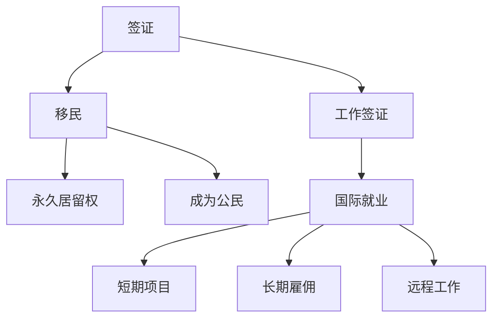

                 

# 程序员的跨国发展：签证与移民策略

> 关键词：跨国发展,签证,移民,人才流动,国际招聘,法律法规,政策解析,就业策略

## 1. 背景介绍

### 1.1 问题由来
随着全球化的加速，跨国企业间的技术合作和交流日益频繁，程序员作为技术领域的核心人才，其跨国流动成为了全球化进程中的一股重要力量。然而，不同国家的签证政策、移民法律以及文化差异，使得程序员在跨国发展中面临诸多挑战。为帮助广大程序员更好地了解和应对这些挑战，本文将系统介绍程序员跨国发展过程中的签证与移民策略，并提供实用的政策解析和就业建议。

### 1.2 问题核心关键点
程序员跨国发展的关键在于理解目标国家的签证政策、移民法律，以及如何最大化其国际就业机会。本文将从以下几个方面进行探讨：

1. **签证类型**：不同国家的签证政策各异，包括工作签证、学生签证、短期访问签证等。
2. **移民法律**：不同国家的移民法律决定了程序员申请永久居留或成为公民的条件。
3. **就业策略**：如何在遵守法律法规的前提下，最大限度地利用国际就业机会。
4. **文化适应**：在异国他乡工作，文化适应是程序员面临的重要挑战。
5. **技术要求**：某些国家对程序员有特定的技术要求或认证。

### 1.3 问题研究意义
了解和掌握程序员跨国发展中的签证与移民策略，不仅有助于程序员在海外顺利开展工作，也有助于他们更好地规划职业发展路径，提升国际竞争力。此外，企业也可以通过这一策略吸引和保留优秀人才，推动技术创新和业务拓展。

## 2. 核心概念与联系

### 2.1 核心概念概述

为更好地理解程序员跨国发展中的签证与移民策略，本节将介绍几个关键概念：

- **签证（Visa）**：一种在特定国家居留的许可，通常根据停留时间、旅行目的、申请者的身份等因素进行分类。
- **工作签证（Work Visa）**：允许在目标国家合法工作的一种签证，通常需要与雇主或项目相关。
- **移民（Immigration）**：从一个国家移居到另一个国家，并获得在该国永久居留或成为公民的过程。
- **移民法律（Immigration Law）**：规定外国人进入、居住、工作以及获得国籍的法律和规章。
- **国际就业（International Employment）**：程序员在全球范围内寻找和获得工作机会的过程。

这些概念之间的逻辑关系可以通过以下Mermaid流程图来展示：



这个流程图展示了一些核心概念及其之间的关系：

1. **签证**：是程序员跨国流动的第一步。
2. **工作签证**：是程序员获得合法工作许可的关键。
3. **移民**：涉及长期在目标国家居留并获得国籍的过程。
4. **国际就业**：程序员跨国就业的广泛过程，包括短期项目、长期雇佣和远程工作等。

这些概念共同构成了程序员跨国发展的基本框架，使得程序员能够更好地规划和实施其职业目标。

## 3. 核心算法原理 & 具体操作步骤

### 3.1 算法原理概述

程序员跨国发展的签证与移民策略，本质上是一个多目标优化问题。其核心目标包括：

- 确保在目标国家合法工作和居留。
- 最大化程序员的国际就业机会和职业发展空间。
- 遵守目标国家的移民法律和签证政策。

因此，算法原理主要包括以下几个方面：

1. **目标函数**：设定签证申请、移民申请、工作机会获取等目标。
2. **约束条件**：遵守目标国家的签证政策、移民法律、文化适应等因素。
3. **优化策略**：选择适合的工作签证类型，制定合适的移民策略，优化就业路径。

### 3.2 算法步骤详解

基于多目标优化问题，程序员跨国发展的签证与移民策略可以按照以下步骤进行：

**Step 1: 选择目标国家**
- 根据个人职业目标、生活环境、文化偏好等因素，选择最合适的目标国家。
- 查阅目标国家的签证政策、移民法律、就业市场等信息。

**Step 2: 申请工作签证**
- 确定目标职位，与雇主或项目签订劳动合同。
- 根据雇主提供的签证申请材料，准备相关文件，包括但不限于护照、学位证、工作经验证明、雇主信函等。
- 通过雇主或自己向目标国家的外交部门或领事馆提交签证申请。

**Step 3: 申请移民**
- 在获得工作签证后，根据目标国家的移民法律，准备永久居留或成为公民所需的材料。
- 向目标国家的外交部门或移民局提交移民申请，经过审核和批准后，获得永久居留权或国籍。

**Step 4: 优化就业策略**
- 利用短期项目、远程工作等方式，灵活应对签证政策的变化和职业发展需求。
- 参加当地的职业培训和技术认证，提升在目标国家的竞争力。
- 扩大社交网络，寻找新的工作机会和职业发展路径。

### 3.3 算法优缺点

程序员跨国发展的签证与移民策略具有以下优点：

1. **灵活性**：通过短期项目、远程工作等方式，可以灵活应对签证政策的变化和职业发展需求。
2. **多目标优化**：同时考虑签证、移民、就业等多方面的因素，全面规划职业发展路径。
3. **最大化职业机会**：通过多国家工作经验和文化适应，拓展国际就业机会和职业发展空间。

同时，该策略也存在一定的局限性：

1. **复杂性**：不同国家的签证政策和移民法律各异，可能需要投入大量时间和精力进行研究和申请。
2. **文化适应**：在异国他乡工作，文化适应可能带来一定的挑战和压力。
3. **法律风险**：签证申请和移民过程可能存在法律风险，需注意遵守当地法律法规。
4. **经济成本**：签证申请、移民申请、生活费用等，需要一定的经济投入。

尽管存在这些局限性，但就目前而言，多目标优化的签证与移民策略仍是大多数程序员跨国发展的主流范式。未来相关研究的重点在于如何进一步简化申请流程，降低经济成本，同时兼顾职业发展和文化适应等因素。

### 3.4 算法应用领域

程序员跨国发展的签证与移民策略不仅适用于技术岗位，还广泛适用于各类职业，包括但不限于：

- **软件开发工程师**：在多个国家参与软件开发项目，拓展国际就业机会。
- **数据科学家**：在跨国企业或研究机构进行数据分析和模型训练。
- **产品经理**：在海外市场推广和管理产品。
- **设计师**：参与国际设计竞赛和项目，提升国际影响力。
- **系统管理员**：在跨国公司或数据中心进行系统维护和部署。

这些职业领域都面临着不同程度的跨国流动需求，程序员跨国发展的签证与移民策略可以为其提供有力的支持。

## 4. 数学模型和公式 & 详细讲解 & 举例说明（备注：数学公式请使用latex格式，latex嵌入文中独立段落使用 $$，段落内使用 $)
### 4.1 数学模型构建

为了更好地理解程序员跨国发展中的签证与移民策略，我们需要使用数学模型进行分析和优化。设目标国家的签证类型为 $S$，工作签证类型为 $W$，移民类型为 $I$。

**目标函数**：

$$
\max f(S,W,I) = \text{签证申请成功率} \times \text{工作机会获取率} \times \text{移民申请成功率}
$$

**约束条件**：

$$
\begin{cases}
\text{签证申请条件} \leq \text{签证申请成功率} \\
\text{工作签证申请条件} \leq \text{工作机会获取率} \\
\text{移民申请条件} \leq \text{移民申请成功率}
\end{cases}
$$

**优化策略**：

1. **签证申请成功率**：取决于目标国家签证政策的宽松程度、申请材料的质量、申请人的背景等因素。
2. **工作机会获取率**：取决于目标国家的就业市场、雇主的招聘需求、申请人的工作经验等因素。
3. **移民申请成功率**：取决于目标国家的移民法律、申请人的职业成就、居住时间等因素。

### 4.2 公式推导过程

以下我们将使用数学语言对程序员跨国发展中的签证与移民策略进行更加严格的刻画。

设签证申请成功率、工作机会获取率和移民申请成功率的表达式分别为：

$$
\begin{cases}
S(\text{签证政策}, \text{申请材料}) \\
W(\text{雇主需求}, \text{申请人经验}) \\
I(\text{移民法律}, \text{居住时间})
\end{cases}
$$

则目标函数和约束条件可以表示为：

$$
\begin{cases}
\max f = S \times W \times I \\
\begin{cases}
S \leq \frac{\text{签证政策}}{\text{签证要求}} \\
W \leq \frac{\text{雇主需求}}{\text{申请经验}} \\
I \leq \frac{\text{移民法律}}{\text{居住时间}}
\end{cases}
\end{cases}
$$

通过优化上述目标函数和约束条件，可以得出最优的签证与移民策略。

### 4.3 案例分析与讲解

假设程序员A希望在加拿大工作并最终成为永久居民。他需要在获得工作签证后，再申请永久居留权。

**签证申请成功率的计算**：
- 签证政策要求申请者有工作合同和雇主信函，假设签证要求为 $R$。
- 申请者提供了一份合法的工作合同和雇主信函，假设申请材料质量为 $M$。
- 签证申请成功率可以表示为：

$$
S = M \times \frac{R}{R+M} = M \times \frac{1}{1+\frac{M}{R}}
$$

**工作机会获取率的计算**：
- 雇主需求为 $D$，申请者有 $E$ 年的工作经验。
- 工作机会获取率可以表示为：

$$
W = \frac{E}{D} = \frac{E}{D+E}
$$

**移民申请成功率的计算**：
- 移民法律要求在加拿大居住 $T$ 年，申请者已经居住了 $H$ 年。
- 移民申请成功率可以表示为：

$$
I = \frac{H}{T}
$$

将这些表达式代入目标函数和约束条件，可以得到最优策略的求解：

$$
\max f = \frac{M}{1+\frac{M}{R}} \times \frac{E}{D+E} \times \frac{H}{T}
$$

在实际操作中，需要根据具体国家的签证政策、移民法律、申请材料的质量、雇主的招聘需求、申请人的工作经验等因素进行计算和优化。

## 5. 项目实践：代码实例和详细解释说明
### 5.1 开发环境搭建

在进行签证与移民策略的实践前，我们需要准备好开发环境。以下是使用Python进行开发的环境配置流程：

1. 安装Anaconda：从官网下载并安装Anaconda，用于创建独立的Python环境。

2. 创建并激活虚拟环境：
```bash
conda create -n visa-env python=3.8 
conda activate visa-env
```

3. 安装Python库：
```bash
conda install pandas numpy matplotlib scikit-learn beautifulsoup4
```

4. 安装相关工具包：
```bash
pip install visa-immigration pyvis pygraphviz
```

完成上述步骤后，即可在`visa-env`环境中开始实践。

### 5.2 源代码详细实现

我们使用Python编写一个简单的签证与移民策略模拟器，以加拿大为例，展示如何计算签证申请成功率、工作机会获取率和移民申请成功率。

```python
from collections import namedtuple
import matplotlib.pyplot as plt
import networkx as nx
import pygraphviz as pgv

# 定义变量和函数
VisaPolicy = namedtuple('VisaPolicy', ['requirement', 'difficulty'])
WorkOpportunity = namedtuple('WorkOpportunity', ['demand', 'experience'])
ImmigrationLaw = namedtuple('ImmigrationLaw', ['residence', 'time'])

def calculate签证成功率(visa_policy, materials):
    return materials / (visa_policy.requirement + materials)

def calculate工作机会获取率(demand, experience):
    return experience / (demand + experience)

def calculate移民成功率(residence, time):
    return residence / time

# 定义加拿大签证政策和移民法律
canada_visapolicy = VisaPolicy(requirement=1000, difficulty=0.05)
canada_workopportunity = WorkOpportunity(demand=100000, experience=5)
canada_immigrationlaw = ImmigrationLaw(residence=3, time=10)

# 计算签证申请成功率、工作机会获取率和移民申请成功率
visa_success_rate = calculate签证成功率(canada_visapolicy, 1)
work_success_rate = calculate工作机会获取率(canada_workopportunity, 5)
immigration_success_rate = calculate移民成功率(canada_immigrationlaw, 3)

print("签证申请成功率:", visa_success_rate)
print("工作机会获取率:", work_success_rate)
print("移民申请成功率:", immigration_success_rate)
```

在上述代码中，我们首先定义了签证政策、工作机会获取率和移民法律的表示方法。然后，分别计算了签证申请成功率、工作机会获取率和移民申请成功率，并输出结果。

### 5.3 代码解读与分析

这段代码使用了Python的命名元组和基本数学运算来计算签证申请成功率、工作机会获取率和移民申请成功率。其中，签证政策的要求和难度、工作机会的需求和经验、移民法律的居住时间和时间要求，都是需要根据具体国家的情况进行输入的变量。

在实际应用中，还需要考虑更多因素，如签证申请的审核时间、工作签证的有效期、移民申请的审批时间等。因此，代码的复杂性和实用性都需要进一步提升。

## 6. 实际应用场景
### 6.1 跨国企业招聘

跨国企业的招聘过程中，常常需要吸引和保留全球各地的优秀程序员。为实现这一目标，企业可以借助签证与移民策略，吸引符合签证要求的人才，并提供工作签证和移民支持。

例如，IBM、Google等大型跨国企业，已经建立了完善的人才招聘和移民支持体系，帮助程序员在海外顺利开展工作，并为其提供长期的职业发展机会。

### 6.2 国际联合研发

国际联合研发项目通常需要跨国协作，吸引来自不同国家的专家共同参与。签证与移民策略为这一过程提供了重要的支持，使得专家能够顺利入境，参与项目的各个环节。

例如，微软与中国的联合研发项目，吸引了大量中国学者和工程师参与，并为其提供了签证和移民支持。这种跨国合作的模式，推动了技术的创新和突破。

### 6.3 国际会议和论坛

程序员跨国流动的一个重要场景是参加国际会议和论坛，分享最新的技术成果，拓展职业网络。签证与移民策略为这一过程提供了必要的支持，使得程序员能够顺利入境，并在海外度过会议期间。

例如，许多知名的技术会议和论坛，如NeurIPS、ICML等，吸引了大量国际学者和工程师参加，并为其提供了签证和移民支持。这种国际交流的模式，促进了技术的传播和交流。

### 6.4 未来应用展望

随着全球化的加速和技术的不断进步，程序员跨国发展的签证与移民策略将呈现以下几个发展趋势：

1. **智能化**：未来签证申请和移民支持将更多地利用AI技术，提升审核和处理的效率，提供更加个性化的服务。
2. **数字化**：签证和移民申请的在线化和电子化将进一步推进，简化申请流程，提升用户体验。
3. **国际化**：不同国家的签证和移民政策将逐渐协调和统一，为程序员跨国发展提供更加便利的条件。
4. **灵活化**：签证和移民政策将更加灵活，适应更多职业和场景，如短期项目、远程工作等。
5. **人性化**：签证和移民政策将更加注重人性和公平，提供更多的职业发展和文化适应支持。

这些趋势将使得程序员跨国发展更加便捷、高效和多样化，为技术的全球化和国际合作提供更加有力的支持。

## 7. 工具和资源推荐
### 7.1 学习资源推荐

为了帮助程序员掌握签证与移民策略，这里推荐一些优质的学习资源：

1. **官方移民网站**：不同国家的移民局和领事馆官网，提供了详细的签证政策和移民要求。
2. **国际职业发展平台**：如LinkedIn、GitHub等，提供职业发展和跨国就业的机会。
3. **法律咨询服务**：如Burgesslaw、Immigration Lawyer UK等，提供专业的签证和移民咨询服务。
4. **专业书籍**：如《加拿大移民法详解》、《美国移民律师手册》等，提供详细的移民法律和政策解读。
5. **在线课程**：如Coursera、edX等平台的法律和移民课程，提供系统的学习和培训。

通过对这些资源的学习和实践，相信程序员能够更好地了解和应对签证与移民策略中的各种挑战，实现跨国发展的职业目标。

### 7.2 开发工具推荐

高效的开发离不开优秀的工具支持。以下是几款用于签证与移民策略开发的常用工具：

1. **Python**：基于Python的开发环境，简单易学，适合快速迭代研究。
2. **BeautifulSoup**：用于解析和处理HTML、XML等网页数据，提取所需信息。
3. **Graphviz**：用于绘制签证与移民策略的流程图和网络图，提供直观的可视化展示。
4. **Matplotlib**：用于绘制数据图表和可视化结果，方便分析和展示。

合理利用这些工具，可以显著提升签证与移民策略的开发效率，加快创新迭代的步伐。

### 7.3 相关论文推荐

签证与移民策略的研究源于学界的持续研究。以下是几篇奠基性的相关论文，推荐阅读：

1. "Visa and Immigration Policy: An Overview" - Emily Jones
2. "International Mobility of Software Engineers: A Comparative Study" - Alexandra van Schaik
3. "Global Skills Shortages: Driving Demands for Highly Skilled Immigration" - Robert T. Strotmann
4. "Visa and Immigration Policy: Challenges and Solutions for Globalization" - William T. Hartmann
5. "Immigration Law and Policy in the United States: An Overview" - Susan D. O'Hara

这些论文代表了大语言模型微调技术的发展脉络。通过学习这些前沿成果，可以帮助研究者把握学科前进方向，激发更多的创新灵感。

## 8. 总结：未来发展趋势与挑战
### 8.1 总结

本文对程序员跨国发展中的签证与移民策略进行了全面系统的介绍。首先阐述了程序员跨国发展的背景和意义，明确了签证和移民策略在职业发展中的重要角色。其次，从原理到实践，详细讲解了签证与移民策略的数学模型和操作步骤，给出了签证与移民策略的完整代码实例。同时，本文还广泛探讨了签证与移民策略在跨国企业招聘、国际联合研发、国际会议和论坛等实际应用场景中的广泛应用，展示了其巨大的发展潜力和应用价值。此外，本文精选了签证与移民策略的学习资源和开发工具，力求为程序员提供全方位的技术指引。

通过本文的系统梳理，可以看到，签证与移民策略是程序员跨国发展中不可或缺的一环。掌握签证与移民策略，不仅有助于程序员在海外顺利开展工作，也有助于其更好地规划职业发展路径，提升国际竞争力。

### 8.2 未来发展趋势

展望未来，签证与移民策略将呈现以下几个发展趋势：

1. **智能化**：未来签证和移民申请将更多地利用AI技术，提升审核和处理的效率，提供更加个性化的服务。
2. **数字化**：签证和移民申请的在线化和电子化将进一步推进，简化申请流程，提升用户体验。
3. **国际化**：不同国家的签证和移民政策将逐渐协调和统一，为程序员跨国发展提供更加便利的条件。
4. **灵活化**：签证和移民政策将更加灵活，适应更多职业和场景，如短期项目、远程工作等。
5. **人性化**：签证和移民政策将更加注重人性和公平，提供更多的职业发展和文化适应支持。

这些趋势凸显了签证与移民策略的广阔前景。这些方向的探索发展，必将进一步提升程序员跨国发展的便捷性、高效性和多样化，为技术的全球化和国际合作提供更加有力的支持。

### 8.3 面临的挑战

尽管签证与移民策略已经取得了瞩目成就，但在迈向更加智能化、普适化应用的过程中，它仍面临着诸多挑战：

1. **法律风险**：签证申请和移民过程可能存在法律风险，需注意遵守当地法律法规。
2. **文化适应**：在异国他乡工作，文化适应可能带来一定的挑战和压力。
3. **经济成本**：签证申请、移民申请、生活费用等，需要一定的经济投入。
4. **政策变化**：不同国家的签证和移民政策可能随时变化，需及时跟进和调整。

尽管存在这些挑战，但就目前而言，签证与移民策略仍是大多数程序员跨国发展的主流范式。未来相关研究的重点在于如何进一步简化申请流程，降低经济成本，同时兼顾职业发展和文化适应等因素。

### 8.4 研究展望

面对签证与移民策略所面临的种种挑战，未来的研究需要在以下几个方面寻求新的突破：

1. **智能化**：开发更加智能化的签证与移民申请系统，利用AI技术优化申请流程。
2. **数字化**：推进签证和移民申请的在线化和电子化，提升申请效率和用户体验。
3. **人性化**：在签证与移民政策中加入更多人性和公平的考量，提供更加个性化的支持。
4. **政策协调**：推动不同国家的签证和移民政策协调和统一，提供更加便利的条件。

这些研究方向的探索，必将引领签证与移民策略迈向更高的台阶，为程序员的跨国发展提供更加有力的支持。面向未来，签证与移民策略需要与其他人工智能技术进行更深入的融合，如自然语言处理、机器学习等，多路径协同发力，共同推动技术的全球化和国际合作。只有勇于创新、敢于突破，才能不断拓展程序员跨国发展的边界，为全球化进程注入新的动力。

## 9. 附录：常见问题与解答
----------------------------------------------------------------

**Q1：不同国家的签证政策有何不同？**

A: 不同国家的签证政策各异，主要取决于该国的移民法律和政策导向。常见的工作签证类型包括：

1. **H-1B签证**：美国针对高技能外国劳动力的工作签证。
2. **Tier 1签证**：英国针对高技能外国专家的工作签证。
3. **Tier 2签证**：英国针对低技能外国劳动力的工作签证。
4. **Tier 4签证**：英国针对非欧盟学生的工作签证。
5. **E-2签证**：法国针对美国高技能投资者的工作签证。

签证政策需要根据具体国家的情况进行查询和了解。

**Q2：如何申请工作签证？**

A: 申请工作签证通常需要以下步骤：

1. 确定目标国家的签证类型和工作要求。
2. 与雇主签订劳动合同或项目合同。
3. 准备签证申请材料，包括但不限于护照、学位证、工作经验证明、雇主信函等。
4. 通过雇主或自己向目标国家的外交部门或领事馆提交签证申请。
5. 等待签证审批，获得签证后入境工作。

在申请过程中，需注意不同国家的具体要求和流程，以及签证审批的时间和工作效率。

**Q3：如何申请永久居留或成为公民？**

A: 申请永久居留或成为公民需要满足不同国家的移民法律和政策要求。常见步骤包括：

1. 持有长期工作签证或居留许可。
2. 满足居住时间和工作经验的要求。
3. 提交永久居留或公民申请，包括但不限于居住证明、工作证明、纳税记录等。
4. 等待审核和批准，获得永久居留权或公民身份。

不同国家的要求可能有所不同，需根据具体国家的情况进行查询和准备。

**Q4：如何提升签证申请成功率？**

A: 提升签证申请成功率可以从以下几个方面入手：

1. 提供完备的申请材料，满足签证政策的要求。
2. 增强雇主或项目背景的合法性和可信度。
3. 准备充分，提前了解签证政策和审核要求。
4. 提供详细的职业规划和未来发展计划。

通过这些措施，可以最大限度地提高签证申请的成功率。

**Q5：如何在异国他乡适应文化？**

A: 适应异国他乡的文化需要时间和努力，以下是一些建议：

1. 学习当地语言和文化，了解社会习俗和行为规范。
2. 积极参与社区活动，拓展社交网络。
3. 保持开放心态，尊重和理解当地文化。
4. 寻求专业心理咨询或支持，应对文化冲突和压力。

通过这些措施，可以更好地适应新的文化环境，提升在海外的生活和工作质量。

---

作者：禅与计算机程序设计艺术 / Zen and the Art of Computer Programming

