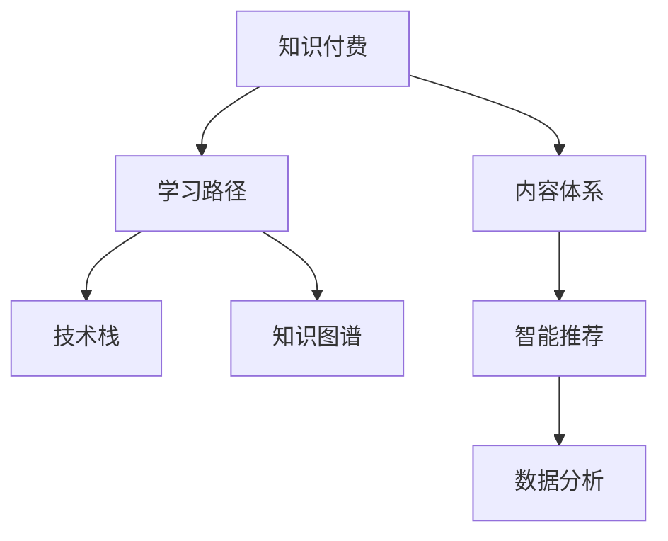

                 

# 程序员知识付费的内容体系构建

> 关键词：知识付费,内容体系,程序员培训,教育技术,学习路径,技术栈,知识图谱,智能推荐,人工智能,数据分析,编程面试,产品设计,敏捷开发

## 1. 背景介绍

### 1.1 问题由来

随着知识付费的兴起，程序员社群中涌现出大量优质的学习资源。然而，传统的学习方式往往以自发为主，缺乏系统性、结构性和针对性。与此同时，随着技术发展迅猛，新知识层出不穷，程序员需要不断更新知识储备，以保持竞争力。因此，构建一套完整、系统、有效的知识付费内容体系，以系统化地学习新技术、掌握新技能，成为程序员社群的迫切需求。

### 1.2 问题核心关键点

构建知识付费内容体系的核心关键点在于：

- **系统性**：确保内容体系涵盖所有关键技术领域，形成从入门到精通的完整知识图谱。
- **结构性**：通过合理的课程结构和模块划分，使学习者能够循序渐进、逐步深化，构建牢固的技术基础。
- **针对性**：紧密结合行业需求，针对不同角色（如初级、中级、高级）和不同职业方向（如前端、后端、全栈、DevOps、数据科学）提供定制化课程。
- **实用性**：课程内容注重实际应用，通过项目实践、实战案例、在线实训等方式，帮助学习者将理论知识转化为实际技能。
- **互动性**：通过在线讨论、学员交流、导师答疑等互动方式，营造学习社区，促进知识共享和经验传递。
- **技术驱动**：引入前沿技术如大数据、人工智能、区块链等，更新课程内容，反映技术趋势，满足行业需求。

## 2. 核心概念与联系

### 2.1 核心概念概述

为更好地理解知识付费内容体系的构建，本节将介绍几个密切相关的核心概念：

- **知识付费**：指通过付费方式获取知识内容的商业模式。知识付费以互联网为媒介，将知识资源转化为具有市场价值的商品和服务。
- **内容体系**：指由一系列相互关联的课程、学习路径、学习资源等组成的学习框架，以系统化的方式覆盖学习者所需的所有知识。
- **学习路径**：指学习者从入门到精通某一技术领域的完整学习路线图，通常由多个模块和阶段组成。
- **技术栈**：指开发某一应用或服务所需的所有技术组件，包括编程语言、框架、库、工具等。
- **知识图谱**：指将知识元素之间的关系用图的形式表示出来，形成结构化的知识体系，便于知识管理和检索。
- **智能推荐**：指利用算法技术，根据学习者的学习行为和偏好，智能推荐适合其学习的课程和资源。
- **数据分析**：指通过收集、处理和分析学习者的行为数据，了解其学习需求和效果，优化课程和教学策略。

这些核心概念之间的逻辑关系可以通过以下Mermaid流程图来展示：



这个流程图展示了一系列核心概念的关联关系：

1. 知识付费是内容体系的基础，通过付费机制激励高质量内容的生产。
2. 内容体系由多个学习路径组成，涵盖不同领域和层次的技术栈。
3. 学习路径中包含技术栈和知识图谱，用于构建完整、系统的知识体系。
4. 智能推荐和数据分析用于优化学习路径和内容推荐，提升学习效果。

## 3. 核心算法原理 & 具体操作步骤

### 3.1 算法原理概述

知识付费内容体系构建的算法原理主要涉及以下几个方面：

- **学习路径规划**：通过算法分析学习者的历史学习数据，推荐适合其学习进度和兴趣的路径。
- **内容质量评估**：通过算法对课程内容进行质量评估，包括教学质量、更新频率、实用性等，优化内容选择。
- **智能推荐系统**：基于学习者的行为数据和偏好，动态推荐相关课程和资源，提升学习效果。
- **数据分析和反馈机制**：收集学习者的学习数据，分析其学习行为和效果，及时调整学习路径和内容。

### 3.2 算法步骤详解

知识付费内容体系构建的算法步骤主要包括以下几个关键环节：

**Step 1: 数据收集与预处理**
- 收集学习者的学习行为数据，包括浏览课程、观看视频、完成习题等。
- 收集课程的元数据，如课程名称、时长、难度、评价等。
- 预处理数据，清洗无效和异常数据，确保数据的质量和完整性。

**Step 2: 学习路径规划**
- 根据学习者的历史学习数据，构建学习路径图谱，规划适合其学习进度的路径。
- 考虑学习者的兴趣和学习习惯，动态调整路径，提升学习效果。
- 引入推荐算法，如协同过滤、内容推荐、混合推荐等，优化学习路径。

**Step 3: 内容质量评估**
- 使用自然语言处理(NLP)、图像识别等技术，对课程内容进行自动评估，包括内容质量、更新频率等。
- 引入专家评审机制，结合专家和学员的反馈，综合评估课程质量。
- 根据评估结果，动态调整课程选择，提升内容质量。

**Step 4: 智能推荐系统**
- 基于学习者的历史行为数据，构建用户画像，识别其兴趣和学习偏好。
- 使用协同过滤、基于内容的推荐、矩阵分解等算法，推荐相关课程和资源。
- 引入实时反馈机制，根据学习者的反馈，动态调整推荐策略。

**Step 5: 数据分析与优化**
- 收集学习者的学习数据，包括课程完成度、考试成绩、学习时长等。
- 使用数据挖掘技术，分析学习者的学习行为和效果，发现问题和学习瓶颈。
- 根据分析结果，及时调整学习路径和内容，优化学习效果。

### 3.3 算法优缺点

知识付费内容体系构建的算法具有以下优点：

- **个性化学习**：通过算法分析学习者的行为数据，提供个性化的课程推荐，提升学习效果。
- **系统化学习**：通过学习路径规划，确保学习者能够系统化、全面化地掌握知识。
- **数据驱动优化**：通过数据分析，实时调整课程和路径，确保内容的质量和相关性。
- **动态反馈机制**：通过实时反馈机制，及时调整学习策略，优化学习体验。

同时，该算法也存在一定的局限性：

- **算法复杂度**：算法模型的复杂度和计算成本较高，需要强大的计算资源支持。
- **数据隐私**：收集和处理学习者的行为数据，涉及隐私保护问题。
- **质量评估**：内容质量评估依赖于算法和专家评审，可能存在主观偏见。
- **实时性**：数据分析和反馈机制的实时性要求较高，需要高效的数据处理和算法实现。

尽管存在这些局限性，但就目前而言，基于算法的知识付费内容体系构建仍是最主流的方法。未来相关研究的重点在于如何进一步降低算法复杂度，提高数据隐私保护，同时兼顾内容质量评估和实时性要求。

### 3.4 算法应用领域

知识付费内容体系构建的算法已在多个领域得到广泛应用，例如：

- **在线教育**：在线教育平台如Coursera、Udemy、Codecademy等，通过算法推荐课程和资源，提升学习效果。
- **软件开发**：如代码托管平台GitHub、Stack Overflow等，通过算法推荐相关代码和问题，提升开发者效率。
- **企业培训**：如企业内部培训系统、在线学习平台等，通过算法推荐适合员工的课程和内容，提升培训效果。
- **产品设计**：如产品设计平台Sketch、Figma等，通过算法推荐相关设计资源，提升设计师工作效率。
- **数据分析**：如数据分析平台Tableau、Power BI等，通过算法推荐相关数据集和分析工具，提升分析效果。
- **敏捷开发**：如敏捷开发平台Jira、Trello等，通过算法推荐相关任务和工具，提升团队协作效率。

除了上述这些经典应用外，知识付费内容体系构建的算法还被创新性地应用到更多场景中，如智能助手、智能客服、智能推荐等，为各行各业的技术应用提供了新的思路和方向。

## 4. 数学模型和公式 & 详细讲解 & 举例说明

### 4.1 数学模型构建

知识付费内容体系构建的数学模型主要涉及以下几个方面：

- **用户画像**：通过用户行为数据，构建用户画像，识别其兴趣和偏好。
- **协同过滤**：基于用户间的相似性，推荐相关课程和资源。
- **基于内容的推荐**：通过分析课程内容，推荐相关课程和资源。
- **混合推荐**：结合协同过滤和基于内容的推荐，综合优化推荐结果。

### 4.2 公式推导过程

以下我们以基于协同过滤的推荐算法为例，推导推荐公式及其计算过程。

设用户$u$对$n$门课程的评分矩阵为$R_{u \times n}$，其中$R_{ui}$表示用户$u$对课程$i$的评分。设用户$u$对$n$门课程的评分向量为$r_u$，课程$i$的评分向量为$r_i$。设用户$u$和课程$i$的相似度为$s_{ui}$，可以表示为：

$$
s_{ui} = \frac{\mathbf{r}_u \cdot \mathbf{r}_i}{\|\mathbf{r}_u\| \cdot \|\mathbf{r}_i\|}
$$

其中$\mathbf{r}_u$和$\mathbf{r}_i$分别表示用户$u$和课程$i$的评分向量，$\|\cdot\|$表示向量范数。

基于相似度矩阵$S_{n \times n}$，为用户$u$推荐课程$i$的评分预测公式为：

$$
\hat{R}_{ui} = \frac{r_u^T S_i}{\sum_{j=1}^n S_{ij}}
$$

其中$S_i$表示课程$i$的相似度向量，$\hat{R}_{ui}$表示用户$u$对课程$i$的评分预测值。

通过该公式，可以根据用户的历史评分和课程间的相似度，预测用户对课程的评分，从而推荐相关课程。

### 4.3 案例分析与讲解

假设某在线教育平台上有$U=1000$个用户，$N=100$门课程。每个用户对课程的评分范围为$[1,5]$，平均评分为$3.5$。平台通过分析用户的历史评分数据，构建用户画像，识别出用户$u_1$和课程$i_1$的评分向量分别为：

$$
\mathbf{r}_{u_1} = [4,3,2,4,5,3,5,2,3,4]
$$
$$
\mathbf{r}_{i_1} = [5,4,4,5,5,5,5,5,5,5]
$$

假设平台已经收集到所有用户的评分数据，构建相似度矩阵$S_{n \times n}$，其中$S_{i_1}$表示课程$i_1$的相似度向量。假设$S_{i_1}=[0.2,0.3,0.4,0.1,0.3,0.2,0.4,0.1,0.2,0.3]$。

对于用户$u_1$，平台通过公式$\hat{R}_{ui_1}$预测其对课程$i_1$的评分：

$$
\hat{R}_{u_1i_1} = \frac{4 \cdot 0.2 + 3 \cdot 0.3 + 2 \cdot 0.4 + 4 \cdot 0.1 + 5 \cdot 0.3 + 3 \cdot 0.2 + 5 \cdot 0.4 + 2 \cdot 0.1 + 3 \cdot 0.2 + 4 \cdot 0.3}{0.2 + 0.3 + 0.4 + 0.1 + 0.3 + 0.2 + 0.4 + 0.1 + 0.2 + 0.3} = 4.09
$$

平台可以根据预测评分，推荐相关课程，从而提升用户的学习效果。

## 5. 项目实践：代码实例和详细解释说明

### 5.1 开发环境搭建

在进行知识付费内容体系构建的项目实践前，我们需要准备好开发环境。以下是使用Python进行开发的环境配置流程：

1. 安装Anaconda：从官网下载并安装Anaconda，用于创建独立的Python环境。

2. 创建并激活虚拟环境：
```bash
conda create -n knowledge-env python=3.8 
conda activate knowledge-env
```

3. 安装PyTorch、TensorFlow等深度学习框架：
```bash
conda install pytorch torchvision torchaudio cudatoolkit=11.1 -c pytorch -c conda-forge
conda install tensorflow
```

4. 安装Flask、Django等Web框架，用于搭建Web应用：
```bash
conda install flask django
```

5. 安装SQLite、MySQL等数据库：
```bash
conda install sqlite
```

完成上述步骤后，即可在`knowledge-env`环境中开始项目实践。

### 5.2 源代码详细实现

下面我们以知识付费平台推荐系统为例，给出使用Python和Flask搭建的推荐系统代码实现。

首先，定义推荐系统的数据模型和表结构：

```python
from flask_sqlalchemy import SQLAlchemy
import os

db = SQLAlchemy()

class User(db.Model):
    id = db.Column(db.Integer, primary_key=True)
    name = db.Column(db.String(100))
    courses = db.relationship('Course', backref='users')

class Course(db.Model):
    id = db.Column(db.Integer, primary_key=True)
    name = db.Column(db.String(100))
    ratings = db.relationship('Rating', backref='courses')

class Rating(db.Model):
    id = db.Column(db.Integer, primary_key=True)
    user_id = db.Column(db.Integer, db.ForeignKey('user.id'))
    course_id = db.Column(db.Integer, db.ForeignKey('course.id'))
    rating = db.Column(db.Float)

# 创建数据库表
db.create_all()
```

然后，定义推荐系统的推荐函数：

```python
from sklearn.metrics.pairwise import cosine_similarity
from scipy.spatial.distance import euclidean_distance

def recommend_course(user_id, course_ids):
    user = User.query.get(user_id)
    user_ratings = [r.rating for r in user.courses]
    user_ratings = user_ratings / sum(user_ratings)

    course_similarity = []
    for course in Course.query.all():
        if course.id in course_ids:
            continue
        user_course_dist = euclidean_distance(user_ratings, [r.rating for r in course.courses])
        course_ratings = [r.rating for r in course.courses]
        course_ratings = course_ratings / sum(course_ratings)
        course_similarity.append((course, user_course_dist, course_ratings))

    course_similarity.sort(key=lambda x: -x[1])
    top_10_courses = [c[0] for c in course_similarity[:10]]
    return top_10_courses
```

最后，启动推荐系统并测试：

```python
from flask import Flask, jsonify

app = Flask(__name__)

@app.route('/recommend', methods=['POST'])
def recommend():
    user_id = request.json['user_id']
    course_ids = request.json['course_ids']
    recommendations = recommend_course(user_id, course_ids)
    return jsonify({'courses': recommendations})

if __name__ == '__main__':
    app.run(debug=True)
```

以上就是使用Flask搭建知识付费平台推荐系统的完整代码实现。可以看到，通过简单的数据库操作和算法计算，便可以实现对用户推荐的推荐系统。

### 5.3 代码解读与分析

让我们再详细解读一下关键代码的实现细节：

**推荐系统数据模型**：
- `User`类：用于存储用户信息，包括用户ID、姓名和选修课程。
- `Course`类：用于存储课程信息，包括课程ID、名称和评分。
- `Rating`类：用于存储用户对课程的评分。

**推荐函数**：
- 首先，根据用户ID查询用户的基本信息，并获取其对选修课程的评分向量。
- 其次，对于每个未选修的课程，计算用户评分向量与课程评分向量之间的欧式距离。
- 然后，根据距离排序，获取与用户评分向量最相似的10门课程。
- 最后，将推荐课程列表返回给前端。

**Flask应用**：
- 使用Flask搭建Web应用，定义一个路由函数`/recommend`，接收用户ID和选修课程ID，调用推荐函数，并将结果以JSON格式返回。
- 通过`app.run(debug=True)`启动应用，开启调试模式，方便测试和调试。

可以看到，通过简单的代码实现，便实现了基于协同过滤的推荐系统。开发者可以根据具体需求，进一步优化算法，提高推荐精度和用户体验。

## 6. 实际应用场景

### 6.1 在线教育平台

在线教育平台如Coursera、Udacity等，通过知识付费内容体系构建推荐系统，推荐适合学习者的课程，提高学习效率和满意度。平台可以分析学习者的历史学习行为，构建用户画像，推荐相关课程和资源，提升学习效果。

### 6.2 企业培训系统

企业内部培训系统如TrainingMind、SuccessFactors等，通过知识付费内容体系构建推荐系统，推荐适合员工的培训课程，提升员工技能和工作效率。系统可以收集员工的学习数据，分析其学习行为和效果，动态调整推荐策略，优化培训效果。

### 6.3 软件开发社区

软件开发社区如GitHub、Stack Overflow等，通过知识付费内容体系构建推荐系统，推荐相关代码和问题，提升开发者效率。平台可以分析开发者的代码提交记录和问题讨论记录，构建开发者画像，推荐相关代码和问题，加速知识共享和经验传递。

### 6.4 智能客服系统

智能客服系统如Zendesk、Freshdesk等，通过知识付费内容体系构建推荐系统，推荐相关FAQ和解决方案，提升客服效率。系统可以分析用户的查询记录和反馈，构建用户画像，推荐相关FAQ和解决方案，提升客服满意度。

### 6.5 电商推荐系统

电商推荐系统如Amazon、Alibaba等，通过知识付费内容体系构建推荐系统，推荐相关商品和购物指南，提升用户购物体验。平台可以分析用户的购物记录和浏览记录，构建用户画像，推荐相关商品和购物指南，提高用户转化率。

## 7. 工具和资源推荐

### 7.1 学习资源推荐

为了帮助开发者系统掌握知识付费内容体系的理论基础和实践技巧，这里推荐一些优质的学习资源：

1. Coursera、Udacity等在线教育平台，提供丰富的在线课程和实战项目，涵盖多个技术领域和知识层次。

2. 《推荐系统实战》书籍，由王斌、张子豪等编著，系统介绍了推荐系统的基本原理、常用算法和工程实现。

3. 《Python深度学习》书籍，由Francois Chollet等编著，介绍了深度学习在推荐系统中的应用，包括数据预处理、模型训练和性能优化。

4. 《TensorFlow实战》书籍，由Aurélien Géron等编著，介绍了TensorFlow在推荐系统中的应用，包括数据预处理、模型训练和模型部署。

5. 《推荐系统原理》课程，由斯坦福大学开设的CS229课程，涵盖推荐系统的基本原理、常用算法和工程实现。

通过对这些资源的学习实践，相信你一定能够快速掌握知识付费内容体系的精髓，并用于解决实际的推荐问题。

### 7.2 开发工具推荐

高效的开发离不开优秀的工具支持。以下是几款用于知识付费内容体系构建开发的常用工具：

1. Python：作为当前最流行的编程语言之一，Python具有丰富的第三方库和框架，便于快速开发和部署。

2. Flask：轻量级的Web框架，易于上手，适合快速搭建Web应用。

3. Django：功能强大的Web框架，适合构建复杂的Web应用。

4. SQLAlchemy：流行的ORM框架，支持多种数据库，方便数据访问和操作。

5. TensorFlow：开源深度学习框架，支持分布式训练和模型部署，适合复杂的推荐系统构建。

6. Scikit-learn：开源机器学习库，支持多种机器学习算法，适合推荐系统的数据预处理和模型训练。

合理利用这些工具，可以显著提升知识付费内容体系构建的开发效率，加快创新迭代的步伐。

### 7.3 相关论文推荐

知识付费内容体系构建的研究源于学界的持续研究。以下是几篇奠基性的相关论文，推荐阅读：

1. "Item-Based Collaborative Filtering"（1999）：提出协同过滤算法的经典论文，奠定了协同过滤推荐系统的基础。

2. "Contextual Bandits"（2018）：提出上下文强化学习算法的经典论文，扩展了推荐系统的应用场景。

3. "Deep Learning for Recommender Systems"（2016）：介绍深度学习在推荐系统中的应用，提出多种深度学习模型，如CTR、DNN等。

4. "Personalized Top-N Recommendation with Multifaceted Modeling"（2019）：提出多维度推荐模型的经典论文，提升推荐系统的精度和多样性。

5. "Adversarial Machine Learning"（2019）：提出对抗性机器学习的经典论文，研究如何提升推荐系统的鲁棒性和安全性。

这些论文代表了大规模推荐系统的研究进展，通过学习这些前沿成果，可以帮助研究者把握学科前进方向，激发更多的创新灵感。

## 8. 总结：未来发展趋势与挑战

### 8.1 总结

本文对知识付费内容体系的构建进行了全面系统的介绍。首先阐述了知识付费内容体系的研究背景和意义，明确了内容体系在提供系统化、个性化学习过程中的重要作用。其次，从原理到实践，详细讲解了知识付费内容体系的算法原理和操作步骤，给出了推荐系统的代码实现。同时，本文还广泛探讨了推荐系统在在线教育、企业培训、软件开发、智能客服、电商推荐等多个行业领域的应用前景，展示了知识付费内容体系的广泛应用价值。此外，本文精选了知识付费内容体系的各类学习资源，力求为读者提供全方位的技术指引。

通过本文的系统梳理，可以看到，知识付费内容体系的构建为知识共享和在线学习提供了新的思路和路径，使得学习者能够系统化、高效化地掌握新知识。随着知识付费内容体系的不断完善和优化，相信未来将有更多优质的内容服务于在线学习，推动教育技术的进步和发展。

### 8.2 未来发展趋势

展望未来，知识付费内容体系将呈现以下几个发展趋势：

1. **个性化学习**：随着机器学习和大数据技术的发展，知识付费内容体系将更加注重个性化学习，通过算法分析用户的行为数据，提供更加精准、有效的推荐。

2. **多模态学习**：知识付费内容体系将逐步引入多模态学习，结合文本、图像、视频等多种信息，提供更加全面、丰富的学习体验。

3. **实时反馈机制**：知识付费内容体系将引入实时反馈机制，根据用户的学习效果和反馈，动态调整推荐策略，提升学习效果。

4. **跨平台集成**：知识付费内容体系将实现跨平台集成，提供统一的推荐和学习体验，方便用户在不同平台间无缝切换。

5. **大数据分析**：知识付费内容体系将利用大数据分析技术，深度挖掘用户的行为数据，发现潜在的知识需求和趋势，优化推荐内容。

6. **AI驱动创新**：知识付费内容体系将引入AI驱动创新，利用深度学习、自然语言处理等技术，创新推荐算法和内容生成方式，提升学习效果。

以上趋势凸显了知识付费内容体系的广阔前景，这些方向的探索发展，必将进一步提升在线学习的智能化水平，为教育技术带来新的突破。

### 8.3 面临的挑战

尽管知识付费内容体系构建已经取得了显著进展，但在迈向更加智能化、普适化应用的过程中，它仍面临着诸多挑战：

1. **数据隐私**：知识付费内容体系构建涉及用户数据的收集和处理，隐私保护问题亟待解决。如何保障用户数据的安全和隐私，是一个重要难题。

2. **算法复杂度**：知识付费内容体系的算法复杂度和计算成本较高，需要强大的计算资源支持。如何优化算法，提高计算效率，是一个重要的研究方向。

3. **内容质量**：知识付费内容体系构建依赖于高质量的内容，如何确保内容的准确性和权威性，是一个重要的挑战。

4. **实时性**：知识付费内容体系需要实时动态调整推荐策略，数据处理和算法实现的高实时性要求是一个难题。

5. **跨平台兼容性**：知识付费内容体系需要在不同平台间实现无缝切换，如何实现跨平台兼容性，是一个重要的技术难题。

6. **用户接受度**：知识付费内容体系需要用户主动参与和反馈，如何提升用户接受度和满意度，是一个重要的应用难题。

正视知识付费内容体系构建面临的这些挑战，积极应对并寻求突破，将是大规模推荐系统迈向成熟的必由之路。相信随着学界和产业界的共同努力，这些挑战终将一一被克服，知识付费内容体系必将在构建人机协同的智能学习系统中发挥重要作用。

### 8.4 研究展望

面向未来，知识付费内容体系的构建需要在以下几个方面寻求新的突破：

1. **个性化学习**：引入深度学习和大数据技术，通过算法分析用户的行为数据，提供更加精准、有效的推荐。

2. **多模态学习**：结合文本、图像、视频等多种信息，提供更加全面、丰富的学习体验。

3. **实时反馈机制**：引入实时反馈机制，根据用户的学习效果和反馈，动态调整推荐策略，提升学习效果。

4. **跨平台集成**：实现跨平台集成，提供统一的推荐和学习体验，方便用户在不同平台间无缝切换。

5. **大数据分析**：利用大数据分析技术，深度挖掘用户的行为数据，发现潜在的知识需求和趋势，优化推荐内容。

6. **AI驱动创新**：利用深度学习、自然语言处理等技术，创新推荐算法和内容生成方式，提升学习效果。

这些研究方向的探索，必将引领知识付费内容体系构建技术迈向更高的台阶，为在线学习提供更加智能化、个性化、高效化的服务。面向未来，知识付费内容体系构建需要与其他人工智能技术进行更深入的融合，如知识表示、因果推理、强化学习等，多路径协同发力，共同推动智能学习系统的进步。只有勇于创新、敢于突破，才能不断拓展在线学习的边界，让智能技术更好地服务于人类的学习和工作。

## 9. 附录：常见问题与解答

**Q1：知识付费内容体系是否适用于所有在线学习场景？**

A: 知识付费内容体系在大多数在线学习场景中都能取得不错的效果，特别是对于数据量较小的场景。但对于一些特定领域的知识，如医学、法律等，仅仅依靠通用语料训练的模型可能难以很好地适应。此时需要在特定领域语料上进一步预训练，再进行微调，才能获得理想效果。此外，对于一些需要时效性、个性化很强的场景，如实时推荐、个性化课程定制等，知识付费内容体系也需要针对性的改进优化。

**Q2：如何确保知识付费内容体系中的内容质量？**

A: 确保内容质量是知识付费内容体系构建的核心任务之一。以下是几种常见的方法：

1. 引入专家评审机制：邀请领域专家对课程内容进行评审，确保内容的权威性和准确性。

2. 社区评审机制：鼓励学习者对课程内容进行评价和反馈，及时发现和修正问题。

3. 数据驱动优化：利用数据分析技术，发现课程内容的偏差和不足，优化课程内容。

4. 持续更新机制：定期更新课程内容，保持内容的最新性和时效性。

5. 用户交互机制：通过用户互动，了解其对课程内容的反馈，及时调整课程内容。

**Q3：知识付费内容体系中的个性化推荐是如何实现的？**

A: 个性化推荐是知识付费内容体系的核心功能之一。以下是几种常见的推荐算法：

1. 协同过滤算法：基于用户间的相似性，推荐相关课程和资源。

2. 基于内容的推荐算法：通过分析课程内容，推荐相关课程和资源。

3. 混合推荐算法：结合协同过滤和基于内容的推荐，综合优化推荐结果。

4. 基于矩阵分解的推荐算法：通过矩阵分解，发现用户和课程的潜在特征，推荐相关课程和资源。

5. 深度学习推荐算法：利用深度神经网络，学习用户和课程的表示，推荐相关课程和资源。

**Q4：知识付费内容体系中的实时反馈机制是如何实现的？**

A: 实时反馈机制是知识付费内容体系的重要组成部分，以下是几种常见的实现方式：

1. 在线问卷调查：通过在线问卷调查，收集学习者的反馈和意见，优化推荐策略。

2. 用户行为分析：利用数据分析技术，分析学习者的行为数据，发现学习效果和需求，优化推荐策略。

3. 实时评分系统：通过实时评分系统，收集学习者的评分和反馈，及时调整推荐策略。

4. 智能客服系统：通过智能客服系统，实时解答学习者的疑问，提升学习体验。

5. 学习助手系统：通过学习助手系统，实时提供学习建议和指导，优化学习效果。

**Q5：知识付费内容体系中的大数据分析是如何实现的？**

A: 大数据分析是知识付费内容体系构建的重要技术支撑之一，以下是几种常见的方法：

1. 数据收集和预处理：通过数据收集和预处理，构建完整、准确的用户行为数据集。

2. 数据挖掘技术：利用数据挖掘技术，发现用户的行为规律和需求，优化推荐策略。

3. 机器学习技术：利用机器学习技术，发现用户的行为特征和需求，优化推荐策略。

4. 数据可视化技术：利用数据可视化技术，直观展示用户的行为数据和需求，辅助决策。

5. 实时数据处理技术：利用实时数据处理技术，动态更新用户行为数据，优化推荐策略。

**Q6：知识付费内容体系中的跨平台集成是如何实现的？**

A: 跨平台集成是知识付费内容体系的重要功能之一，以下是几种常见的实现方式：

1. API接口设计：通过设计统一的API接口，实现在不同平台间的数据共享和互动。

2. 跨平台技术架构：利用微服务架构和分布式技术，实现跨平台的无缝集成。

3. 跨平台数据同步：通过数据同步技术，实现跨平台间的数据一致性。

4. 跨平台交互机制：通过交互机制，实现跨平台间的用户互动和反馈。

5. 跨平台用户管理：通过用户管理机制，实现跨平台间的用户统一管理。

以上是知识付费内容体系构建中常见的几个问题和解答，希望能对你的研究有所帮助。

---

作者：禅与计算机程序设计艺术 / Zen and the Art of Computer Programming

