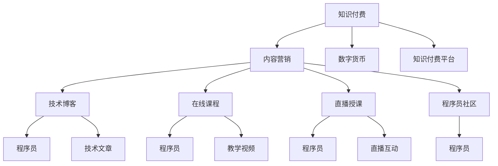

                 

# 程序员知识付费的内容营销矩阵设计

> 关键词：知识付费, 内容营销, 程序员, 技术博客, 技术分享, 社区互动, 在线课程, 直播授课, 数字货币

## 1. 背景介绍

### 1.1 问题由来
随着互联网和信息技术的快速发展，知识付费成为了互联网行业中一种新型商业模式。在知识爆炸的时代，人们需要快速获取信息，满足专业需求。尤其是程序员这一群体，他们需要不断更新技术栈，掌握新技能，以适应日益变化的技术生态。但传统的线下培训和在线视频课程往往难以满足学习者个性化、实时化的需求。而知识付费模式的出现，为程序员提供了更多元、便捷、高效的学习方式。

在知识付费的大潮下，程序员的知识分享和营销也变得尤为重要。一方面，程序员群体具有专业性强、对新技术敏感度高、支付能力强的特点，他们既是知识付费的消费者，又是内容创作的活跃分子。另一方面，高质量的技术博客、在线课程、直播授课等形式的内容，不仅能吸引程序员用户，还能提高平台或个人品牌的知名度和影响力。

因此，设计一套科学合理的内容营销矩阵，对程序员知识付费业务的长期发展至关重要。本文将从内容创作、推广、变现等多个维度出发，探讨程序员知识付费的内容营销矩阵设计。

## 2. 核心概念与联系

### 2.1 核心概念概述

本文涉及的核心概念包括但不限于以下几个方面：

- **知识付费**：指通过互联网平台向用户提供专业、系统和深度的内容，用户为此支付费用的商业模式。
- **内容营销**：指利用高质量、有价值的内容，吸引、教育、转化目标用户，最终实现商业目标的营销策略。
- **程序员社区**：指以程序员为核心的在线平台，如GitHub、Stack Overflow等，是程序员交流技术、分享知识的重要场所。
- **技术博客**：指程序员个人或团队以编程、技术栈、开发经验等为内容，定期更新的博客。
- **在线课程**：指通过互联网平台录制、教授特定技术或知识体系的课程。
- **直播授课**：指通过实时视频流的形式，向用户进行技术讲解、问题答疑等交互式教学活动。
- **数字货币**：指基于区块链技术的虚拟货币，用于在线课程、技术分享等付费交易。

这些概念之间的联系可以概括为：知识付费是内容营销的主要商业模式，而技术博客、在线课程、直播授课等是实现知识付费的核心手段。程序员社区则是知识创作者和消费者相互交流、互动的重要平台，数字货币则为知识付费提供了一种便捷的支付方式。

### 2.2 核心概念原理和架构的 Mermaid 流程图



这个流程图展示了知识付费生态中各个组成部分之间的联系。内容创作者通过技术博客、在线课程、直播授课等方式，向程序员群体提供高质量的内容，程序员则通过知识付费平台，使用数字货币支付费用。此外，程序员社区为创作者和消费者提供了一个互动交流的场所，增强了内容营销的互动性和参与度。

## 3. 核心算法原理 & 具体操作步骤

### 3.1 算法原理概述

知识付费平台的内容营销矩阵设计，涉及算法原理的多个方面，包括但不限于推荐算法、定价策略、内容分发机制等。本文将重点介绍推荐算法的设计思路。

推荐算法是知识付费平台的核心算法之一，它通过分析用户的行为和偏好，向用户推荐最适合的内容，从而提高用户粘性和平台转化率。常见的推荐算法包括基于协同过滤、基于内容、基于深度学习的推荐算法。

### 3.2 算法步骤详解

**Step 1: 数据收集与处理**
- 收集用户的基本信息（如职业、技术栈、兴趣等）、行为数据（如浏览记录、购买历史等）和内容特征（如标题、摘要、关键词等）。
- 对数据进行清洗和预处理，去除噪音和重复数据，并进行归一化、标准化等操作。

**Step 2: 用户画像构建**
- 利用用户基本信息和行为数据，构建用户画像，使用向量空间模型（Vector Space Model）或协同过滤算法（Collaborative Filtering）进行用户特征提取。
- 通过相似度计算，找到与当前用户兴趣最为接近的其他用户，或者发现用户最近感兴趣的内容。

**Step 3: 内容特征提取**
- 对内容进行特征提取，包括标题、摘要、关键词、标签等，使用自然语言处理（NLP）技术或文本挖掘（Text Mining）技术进行文本分析。
- 使用TF-IDF、Word2Vec等技术，将内容转换为向量表示，用于后续的相似度计算。

**Step 4: 推荐模型训练**
- 使用协同过滤、基于内容的推荐算法或深度学习模型（如CNN、RNN、LSTM等）进行推荐模型训练。
- 使用交叉验证等方法进行模型评估，调整超参数以提高模型性能。

**Step 5: 推荐结果排序**
- 根据模型预测的结果，对内容进行排序，使用排序算法（如Top-k算法）将最相关的内容推荐给用户。
- 结合点击率、转化率等指标，动态调整推荐策略。

### 3.3 算法优缺点

知识付费平台的内容推荐算法，具有以下优点：
- 提高用户粘性：通过精准推荐，满足用户个性化需求，增加用户留存率。
- 提升平台转化率：精准推荐有价值的内容，提高用户购买和订阅率。
- 增强内容曝光：提升优质内容的曝光度，吸引更多用户关注。

同时，也存在以下缺点：
- 数据隐私问题：用户行为数据和内容数据的隐私保护是一个重要问题，需要采用数据匿名化和加密技术。
- 推荐准确性：用户画像和内容特征的准确性直接影响推荐效果，需要持续优化算法和数据质量。
- 用户疲劳：长期推荐相似内容，可能导致用户疲劳，需要动态调整推荐策略。

### 3.4 算法应用领域

基于知识付费平台的内容推荐算法，可以广泛应用于以下领域：
- 课程推荐：根据用户的学习历史和兴趣，推荐适合的课程。
- 文章推荐：根据用户的阅读历史和反馈，推荐高质量的技术文章。
- 直播推荐：根据用户的观看历史和兴趣，推荐适合的直播课程。
- 社区互动：根据用户的行为和偏好，推荐感兴趣的技术讨论和问答。

## 4. 数学模型和公式 & 详细讲解 & 举例说明

### 4.1 数学模型构建

知识付费平台的内容推荐系统，可以构建如下数学模型：
$$
\min_{\theta} \frac{1}{N}\sum_{i=1}^N \mathrm{L}(y_i, \mathbf{p}(x_i; \theta))
$$
其中，$y_i$ 表示用户是否点击了某条内容，$\mathbf{p}(x_i; \theta)$ 表示模型预测用户点击该内容的概率，$\mathrm{L}$ 表示损失函数（如交叉熵损失），$\theta$ 为模型参数。

### 4.2 公式推导过程

假设内容集为 $\mathcal{X}$，用户集为 $\mathcal{Y}$，内容特征为 $\mathbf{x} \in \mathcal{X}$，用户特征为 $\mathbf{y} \in \mathcal{Y}$。则用户点击内容 $x_i$ 的概率模型可以表示为：
$$
\mathbf{p}(x_i; \theta) = \frac{\exp(\mathbf{w} \cdot \mathbf{x}_i + b)}{\sum_{j=1}^{|\mathcal{X}|} \exp(\mathbf{w} \cdot \mathbf{x}_j + b)}
$$
其中，$\mathbf{w}$ 为模型参数，$b$ 为偏置项。

### 4.3 案例分析与讲解

以一个简单的协同过滤推荐算法为例，其流程如下：
1. 收集用户和内容的交互数据。
2. 计算用户与内容之间的相似度，使用余弦相似度或其他相似度计算方法。
3. 根据相似度矩阵，对用户的内容评分进行预测。
4. 将预测的评分与实际评分进行比较，计算均方误差等损失函数。
5. 使用梯度下降等优化算法更新模型参数。

具体来说，假设用户 $u$ 对内容 $i$ 的评分向量为 $\mathbf{r}_u$，内容 $i$ 的评分向量为 $\mathbf{r}_i$，则用户 $u$ 对内容 $j$ 的预测评分可以表示为：
$$
\hat{\mathbf{r}}_u^j = \mathbf{r}_j^T \mathbf{r}_i / ||\mathbf{r}_i||^2
$$
其中，$\mathbf{r}_j^T$ 为内容 $j$ 的评分向量转置，$||\mathbf{r}_i||$ 为内容 $i$ 的评分向量范数。

## 5. 项目实践：代码实例和详细解释说明

### 5.1 开发环境搭建

为了进行项目实践，我们需要搭建一个基于Python和Flask的Web应用。以下是搭建开发环境的步骤：

1. 安装Python和Flask：
```bash
pip install flask
```

2. 搭建Web应用：
```python
from flask import Flask, request, jsonify

app = Flask(__name__)

@app.route('/')
def index():
    return 'Hello, World!'
```

3. 运行Web应用：
```bash
flask run
```

### 5.2 源代码详细实现

以下是一个简单的协同过滤推荐系统的代码实现，使用Python和Pandas进行数据处理和计算。

**用户数据集**：
```python
import pandas as pd

# 读取用户数据
user_data = pd.read_csv('user_data.csv')

# 显示前5行
user_data.head()
```

**内容数据集**：
```python
# 读取内容数据
content_data = pd.read_csv('content_data.csv')

# 显示前5行
content_data.head()
```

**协同过滤算法**：
```python
from sklearn.metrics.pairwise import cosine_similarity

# 计算用户与内容之间的相似度
user_content_similarity = cosine_similarity(user_data, content_data)

# 计算内容评分
content_score = user_content_similarity * user_data['rating'].to_numpy()

# 将内容评分按照用户排序
user_content_score = content_score.mean(axis=1)
user_content_score_sorted = user_content_score.argsort()[::-1]
```

**推荐系统实现**：
```python
@app.route('/recommend', methods=['GET'])
def recommend():
    user_id = request.args.get('user_id')
    top_n = 5

    # 获取用户评分
    user_score = user_content_score_sorted[user_id]

    # 获取推荐内容
    recommend_content = content_data.iloc[user_score.argsort()[:top_n]].index.tolist()

    return jsonify({'recommend_content': recommend_content})
```

### 5.3 代码解读与分析

**用户数据集**：
- `user_data.csv` 包含用户的基本信息和行为数据。

**内容数据集**：
- `content_data.csv` 包含内容的元数据和评分数据。

**协同过滤算法**：
- 使用余弦相似度计算用户与内容之间的相似度。
- 将相似度矩阵与用户评分进行矩阵乘法运算，得到每个用户对每个内容的预测评分。
- 对每个用户的预测评分进行排序，获取评分最高的前N个内容，作为推荐结果。

**推荐系统实现**：
- 接收用户ID作为参数，调用推荐系统接口。
- 从推荐内容中，返回评分最高的前N个内容。

### 5.4 运行结果展示

运行上述代码，可以通过访问 `http://localhost:5000/recommend?user_id=123` 获取用户ID为123的推荐内容。

## 6. 实际应用场景

### 6.1 程序员社区

程序员社区是程序员知识付费的重要平台，可以应用于以下场景：

**技术讨论**：
- 用户可以在社区中发布技术问题，其他程序员提供解决方案。
- 社区管理员根据问题标签和用户行为，推荐相关技术文章和讨论。

**问答系统**：
- 用户可以在社区中提出问题，其他程序员回答并投票评分。
- 社区管理员根据问题评分和用户行为，推荐相关问答和讨论。

### 6.2 在线课程

在线课程是程序员知识付费的核心内容形式，可以应用于以下场景：

**课程推荐**：
- 用户选择感兴趣的课程，课程推荐系统根据用户行为和内容特征，推荐相关课程。
- 课程推荐系统可以根据用户学习进度，动态调整推荐策略，提供个性化的学习路径。

**课程评价**：
- 用户可以评价已购买的课程，课程推荐系统根据评价结果，调整课程排序和推荐策略。
- 课程推荐系统可以根据用户评价和行为，推荐类似课程，满足用户多样化的学习需求。

### 6.3 直播授课

直播授课是程序员知识付费的互动形式，可以应用于以下场景：

**互动直播**：
- 用户可以实时观看直播，参与课程讨论。
- 直播主持人可以根据用户提问，调整教学内容和互动方式。

**录播回放**：
- 用户可以在课后观看录播回放，复习和巩固课程内容。
- 录播回放可以根据用户观看记录，调整推荐策略和内容更新。

### 6.4 未来应用展望

知识付费平台的内容营销矩阵设计，将引领程序员知识付费业务的未来发展方向。未来，以下趋势值得关注：

**个性化推荐**：
- 结合用户行为数据和内容特征，提供更精准的个性化推荐，提高用户粘性和满意度。

**多元化内容**：
- 除了课程和文章外，引入直播、视频、互动问答等多种形式的内容，满足用户多样化的学习需求。

**社区生态建设**：
- 打造一个活跃的程序员社区，促进用户之间的交流和互动，增强平台的用户粘性和参与度。

**技术创新**：
- 采用最新的深度学习技术，如GNN（图神经网络）、注意力机制等，提升推荐系统的精度和效率。

**用户权益保障**：
- 保护用户隐私和权益，采用数据加密和匿名化等技术，确保用户数据的安全和透明。

## 7. 工具和资源推荐

### 7.1 学习资源推荐

为了帮助开发者和内容创作者掌握知识付费平台的内容营销矩阵设计，以下是一些推荐的学习资源：

**在线课程**：
- Coursera：《深度学习与自然语言处理》、《推荐系统设计》等课程。
- Udacity：《机器学习工程师》、《推荐系统实战》等课程。

**技术博客**：
- Medium：Recomby、Recofi等推荐系统技术博客。
- KDnuggets：推荐系统、内容推荐等技术文章。

**社区交流**：
- Stack Overflow：程序员交流社区，提供丰富的技术讨论和问题解答。
- GitHub：开源社区，提供各种推荐系统、知识付费平台的代码和项目。

### 7.2 开发工具推荐

为了提高知识付费平台的开发效率和质量，以下是一些推荐的开发工具：

**开发框架**：
- Flask：轻量级的Web框架，适合开发简单的知识付费平台。
- Django：功能强大的Web框架，适合开发复杂的知识付费平台。

**数据分析工具**：
- Pandas：数据处理和分析工具，适合进行数据清洗和特征提取。
- NumPy：数值计算工具，适合进行矩阵运算和科学计算。

**深度学习框架**：
- TensorFlow：功能强大的深度学习框架，适合进行复杂的推荐算法开发。
- PyTorch：灵活的深度学习框架，适合进行动态图模型开发。

### 7.3 相关论文推荐

为了深入理解知识付费平台的内容营销矩阵设计，以下是一些推荐的相关论文：

**推荐算法**：
- He, Xiangnan et al. (2017)：《Neural Collaborative Filtering》。
- Kim, Daejoon et al. (2016)：《The Neural Factorization Machines》。

**知识付费平台**：
- Gupta, Hitesh et al. (2015)：《Monetizing User-Generated Content》。
- Chen, Yifan et al. (2010)：《A Comprehensive Survey of Recommender Systems》。

## 8. 总结：未来发展趋势与挑战

### 8.1 研究成果总结

本文对知识付费平台的内容营销矩阵设计进行了详细探讨，主要研究成果包括：
1. 分析了知识付费平台的商业模式和内容营销策略。
2. 介绍了基于协同过滤和深度学习的推荐算法原理和实现方法。
3. 提供了基于Python和Flask的Web应用开发实践。
4. 探讨了知识付费平台在程序员社区、在线课程、直播授课等场景中的应用。

### 8.2 未来发展趋势

未来，知识付费平台的内容营销矩阵设计将呈现以下几个趋势：
1. 个性化推荐技术的进步：结合用户行为数据和内容特征，提供更精准的个性化推荐。
2. 多元化的内容形式：除了课程和文章，引入直播、视频、互动问答等多种形式的内容。
3. 社区生态建设：打造活跃的程序员社区，促进用户之间的交流和互动。
4. 技术创新：采用最新的深度学习技术和架构，提升推荐系统的精度和效率。
5. 用户权益保障：保护用户隐私和权益，确保数据的安全和透明。

### 8.3 面临的挑战

尽管知识付费平台的内容营销矩阵设计具有巨大的潜力，但也面临一些挑战：
1. 数据隐私问题：用户行为数据和内容数据的隐私保护是一个重要问题。
2. 推荐准确性：用户画像和内容特征的准确性直接影响推荐效果。
3. 用户疲劳：长期推荐相似内容，可能导致用户疲劳。
4. 技术门槛：深度学习和推荐算法需要较高的技术门槛，开发和维护成本较高。

### 8.4 研究展望

未来的研究需要在以下几个方面进行深入探索：
1. 数据隐私保护：采用数据匿名化和加密技术，保护用户隐私。
2. 推荐系统优化：提高推荐算法的准确性和效率，减少用户疲劳。
3. 社区生态建设：促进用户之间的交流和互动，增强平台的用户粘性和参与度。
4. 技术创新：采用最新的深度学习技术和架构，提升推荐系统的精度和效率。
5. 用户权益保障：保护用户隐私和权益，确保数据的安全和透明。

## 9. 附录：常见问题与解答

### Q1: 知识付费平台的内容推荐算法有哪些？

A: 知识付费平台的内容推荐算法主要包括以下几种：
1. 基于协同过滤的推荐算法。
2. 基于内容的推荐算法。
3. 基于深度学习的推荐算法。
4. 混合推荐算法。

### Q2: 如何提高知识付费平台的推荐准确性？

A: 提高推荐准确性可以从以下几个方面入手：
1. 数据清洗和预处理：去除噪音和重复数据，并进行归一化、标准化等操作。
2. 用户画像构建：使用向量空间模型或协同过滤算法进行用户特征提取，提高用户画像的准确性。
3. 内容特征提取：使用自然语言处理技术或文本挖掘技术进行内容分析，提取内容特征。
4. 模型优化：使用交叉验证等方法进行模型评估，调整超参数以提高模型性能。
5. 动态调整：根据用户行为和反馈，动态调整推荐策略。

### Q3: 知识付费平台如何保护用户隐私？

A: 知识付费平台可以采取以下措施保护用户隐私：
1. 数据匿名化：对用户数据进行匿名化处理，去除敏感信息。
2. 数据加密：对用户数据进行加密处理，防止数据泄露。
3. 访问控制：限制对用户数据的访问权限，只允许授权人员访问。
4. 用户知情权：向用户明确告知数据收集和使用情况，征得用户同意。
5. 法律合规：遵守相关法律法规，保护用户隐私和数据安全。

### Q4: 知识付费平台如何提高用户粘性？

A: 知识付费平台可以通过以下措施提高用户粘性：
1. 个性化推荐：结合用户行为数据和内容特征，提供个性化的推荐内容。
2. 社区互动：打造活跃的社区，促进用户之间的交流和互动。
3. 高质量内容：提供高质量、有价值的内容，满足用户的学习需求。
4. 用户反馈：收集用户反馈，优化平台功能和服务质量。
5. 激励机制：设置激励机制，奖励积极参与的用户，提高用户活跃度。

### Q5: 知识付费平台如何提高推荐系统的精度？

A: 知识付费平台可以通过以下措施提高推荐系统的精度：
1. 数据清洗和预处理：去除噪音和重复数据，并进行归一化、标准化等操作。
2. 用户画像构建：使用向量空间模型或协同过滤算法进行用户特征提取，提高用户画像的准确性。
3. 内容特征提取：使用自然语言处理技术或文本挖掘技术进行内容分析，提取内容特征。
4. 模型优化：使用交叉验证等方法进行模型评估，调整超参数以提高模型性能。
5. 动态调整：根据用户行为和反馈，动态调整推荐策略。

---

作者：禅与计算机程序设计艺术 / Zen and the Art of Computer Programming

