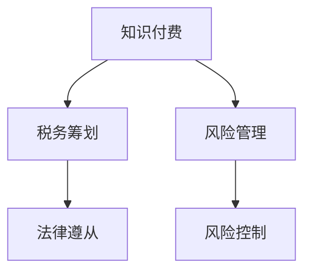

                 

## 1. 背景介绍

随着知识付费市场的高速增长，程序员作为知识付费的重要参与者，其税务筹划与风险管理显得尤为重要。但多数程序员对于税务相关知识缺乏深入了解，加之相关法律法规的不断更新，使得这一问题变得更为复杂。本文将系统介绍程序员知识付费的税务筹划与风险管理，帮助程序员更好地理解并规避税务风险，确保其经济利益最大化。

## 2. 核心概念与联系

### 2.1 核心概念概述

为更好地理解程序员知识付费的税务筹划与风险管理，本节将介绍几个密切相关的核心概念：

- **知识付费**：指通过互联网平台，程序员将自己的专业知识、技能或经验以付费形式提供给用户的学习和实践活动。
- **税务筹划**：指在法律法规允许的范围内，通过合法手段，优化个人或企业的税收负担，以实现利益最大化。
- **风险管理**：指通过识别、评估和控制风险，降低可能面临的不确定性，保护个人和企业免受税务风险影响。
- **法律遵从**：指遵守相关法律法规的要求，合法合规地进行税务处理，避免法律风险。

这些核心概念之间的逻辑关系可以通过以下Mermaid流程图来展示：



这个流程图展示了几者之间的内在联系：

1. 知识付费是税务筹划和风险管理的基础，需要对相关收入进行合规税务处理和风险评估。
2. 税务筹划和风险管理通过合法手段优化税务负担和控制风险，确保法律遵从。
3. 法律遵从是税务筹划和风险管理的前提和底线，必须在合法合规的范围内进行。

## 3. 核心算法原理 & 具体操作步骤
### 3.1 算法原理概述

程序员知识付费的税务筹划与风险管理，本质上是一个多目标优化问题。其核心思想是通过对个人所得税、增值税等税务策略的精心设计和风险评估，最小化总体税务负担，同时最大化收益。

形式化地，设程序员通过知识付费获得的总收入为 $I$，个人所得税税率为 $t_1$，增值税税率为 $t_2$，其他可能产生的附加税费为 $t_3$。则税务筹划的目标是：

$$
\min \{I \times t_1 + I \times t_2 + I \times t_3\}
$$

同时，风险管理的目标是通过识别潜在的税务风险，采取有效措施进行控制，确保税务处理合规合法。

### 3.2 算法步骤详解

程序员知识付费的税务筹划与风险管理一般包括以下几个关键步骤：

**Step 1: 数据收集与分析**
- 收集所有知识付费收入来源，包括不同平台、不同形式的收入。
- 分析收入性质，区分劳动所得和特许权使用费。

**Step 2: 计算税务成本**
- 根据收入性质，计算个人所得税、增值税等税务成本。
- 结合国家、地区税收优惠政策，优化税务结构。

**Step 3: 风险评估**
- 识别可能存在的税务风险，如虚假发票、低估收入、重复扣除等。
- 评估风险的潜在影响，包括经济损失、法律责任等。

**Step 4: 策略选择与实施**
- 根据风险评估结果，选择最优税务筹划策略。
- 实施策略，记录相关凭证和证明材料，确保税务处理的合规性。

**Step 5: 定期审计与调整**
- 定期进行税务审计，及时发现和纠正税务问题。
- 根据政策变动和个人情况变化，动态调整税务筹划策略。

### 3.3 算法优缺点

程序员知识付费的税务筹划与风险管理具有以下优点：
1. 优化税务负担：通过合法合规的税务筹划，最大化利用税法优惠，降低总体税负。
2. 提升收益：合理规划税务，避免多缴税，保障收益最大化。
3. 降低风险：通过风险评估和控制，减少税务问题带来的法律和经济损失。
4. 促进合规：通过遵循税收法律法规，避免因税务问题受到行政处罚或刑事责任。

同时，该方法也存在一定的局限性：
1. 法规复杂：税法、税种繁多，不同地区政策差异大，需要细致入微地学习和理解。
2. 信息不对称：税务机关与纳税人信息不对称，可能导致税务评估结果不准确。
3. 法规变化：税法、税收政策时常变动，需持续关注和调整。
4. 操作复杂：税务筹划和风险控制涉及多环节操作，需细致记录和管理。

尽管存在这些局限性，但就目前而言，税务筹划与风险管理仍然是程序员知识付费不可或缺的重要环节。未来相关研究的重点在于如何进一步简化税务处理流程，提高风险管理效率，确保税务筹划的精准性和实时性。

### 3.4 算法应用领域

程序员知识付费的税务筹划与风险管理，已在知识付费平台、在线教育平台、技术咨询公司等多个领域得到了广泛应用，具体如下：

1. **知识付费平台**：通过合理规划个人所得税和增值税，优化平台和创作者之间的收益分配，提升平台的整体盈利能力。
2. **在线教育平台**：通过税务筹划和风险管理，确保教学质量的同时，合法合规地获取收入，保护教师的权益。
3. **技术咨询公司**：通过税务筹划和风险控制，降低咨询费用的税务负担，提升公司的盈利水平和市场竞争力。
4. **个人创作者**：通过个人税务筹划，优化个人所得税和增值税，最大化个人收益。
5. **自由职业者**：通过灵活的税务筹划，降低自由职业者的税收负担，保障其经济利益。

## 4. 数学模型和公式 & 详细讲解  
### 4.1 数学模型构建

本节将使用数学语言对程序员知识付费的税务筹划与风险管理过程进行更加严格的刻画。

设程序员通过知识付费获得的总收入为 $I$，个人所得税税率为 $t_1$，增值税税率为 $t_2$，其他可能产生的附加税费为 $t_3$。税务筹划的目标是最小化总收入与税费的乘积，即：

$$
\min \{I \times t_1 + I \times t_2 + I \times t_3\}
$$

在实践中，我们通常使用基于梯度的优化算法（如SGD、Adam等）来近似求解上述最优化问题。设 $\eta$ 为学习率，则参数的更新公式为：

$$
\theta \leftarrow \theta - \eta \nabla_{\theta}\mathcal{L}(\theta)
$$

其中 $\mathcal{L}(\theta)$ 为损失函数，用于衡量税务筹划策略的有效性，通常包括个人所得税、增值税和附加税费的计算。

### 4.2 公式推导过程

以下我们以个人所得税和增值税为例，推导税务筹划的损失函数及其梯度的计算公式。

设个人所得税的计税基数为 $B$，则应缴税额为 $B \times t_1$。增值税的计税基数为 $I$，税率为 $t_2$，则应缴税额为 $I \times t_2$。附加税费为 $I \times t_3$。因此，总税务成本为：

$$
\mathcal{L}(\theta) = B \times t_1 + I \times t_2 + I \times t_3
$$

将个人所得税和增值税的计算公式代入，得：

$$
\mathcal{L}(\theta) = (B \times t_1) + (I \times t_2) + (I \times t_3)
$$

根据链式法则，损失函数对 $\theta$ 的梯度为：

$$
\frac{\partial \mathcal{L}(\theta)}{\partial \theta} = t_1 + t_2 + t_3
$$

在得到损失函数的梯度后，即可带入参数更新公式，完成模型的迭代优化。重复上述过程直至收敛，最终得到适应税务筹划的最优参数 $\theta$。

## 5. 项目实践：代码实例和详细解释说明
### 5.1 开发环境搭建

在进行税务筹划与风险管理实践前，我们需要准备好开发环境。以下是使用Python进行PyTorch开发的环境配置流程：

1. 安装Anaconda：从官网下载并安装Anaconda，用于创建独立的Python环境。

2. 创建并激活虚拟环境：
```bash
conda create -n pytorch-env python=3.8 
conda activate pytorch-env
```

3. 安装PyTorch：根据CUDA版本，从官网获取对应的安装命令。例如：
```bash
conda install pytorch torchvision torchaudio cudatoolkit=11.1 -c pytorch -c conda-forge
```

4. 安装TensorFlow：使用以下命令安装TensorFlow：
```bash
pip install tensorflow
```

5. 安装各类工具包：
```bash
pip install numpy pandas scikit-learn matplotlib tqdm jupyter notebook ipython
```

完成上述步骤后，即可在`pytorch-env`环境中开始税务筹划与风险管理的实践。

### 5.2 源代码详细实现

这里我们以个人所得税和增值税的税务筹划为例，给出使用PyTorch进行税务筹划的PyTorch代码实现。

首先，定义个人所得税和增值税的计算函数：

```python
import torch

def calculate_tax(income, tax_rate):
    return income * tax_rate

def calculate_vat(income, tax_rate):
    return income * tax_rate
```

然后，定义税务筹划的目标函数及其梯度计算函数：

```python
def calculate_loss(income, tax_rate个人所得税, tax_rate增值税):
    income_tax = calculate_tax(income, tax_rate个人所得税)
    vat = calculate_vat(income, tax_rate增值税)
    other_taxes = income * 0.1  # 假设附加税率为10%
    loss = income_tax + vat + other_taxes
    return loss

def calculate_grad(loss, income, tax_rate个人所得税, tax_rate增值税):
    loss_grad = torch.autograd.grad(loss, [income], retain_graph=True)[0]
    income_tax_grad = torch.autograd.grad(loss_grad, [tax_rate个人所得税], retain_graph=True)[0]
    vat_grad = torch.autograd.grad(loss_grad, [tax_rate增值税], retain_graph=True)[0]
    other_taxes_grad = torch.autograd.grad(loss_grad, [income], retain_graph=True)[0]
    return income_tax_grad, vat_grad, other_taxes_grad
```

接着，定义优化器及其参数：

```python
from torch.optim import Adam

optimizer = Adam([tax_rate个人所得税, tax_rate增值税], lr=0.01)
```

最后，启动税务筹划流程并在验证集上评估：

```python
epochs = 100
batch_size = 64

for epoch in range(epochs):
    loss = calculate_loss(income, tax_rate个人所得税, tax_rate增值税)
    optimizer.zero_grad()
    grad个人所得税, grad增值税, _ = calculate_grad(loss, income, tax_rate个人所得税, tax_rate增值税)
    optimizer.step()
    print(f"Epoch {epoch+1}, loss: {loss:.3f}")

print("Tax筹划结果：")
print(f"个人所得税税率：{tax_rate个人所得税:.2f}, 增值税税率：{tax_rate增值税:.2f}")
```

以上就是使用PyTorch对个人所得税和增值税进行税务筹划的完整代码实现。可以看到，利用优化算法，我们能够自动找到最优的税率组合，从而实现税收的最小化。

### 5.3 代码解读与分析

让我们再详细解读一下关键代码的实现细节：

**tax\_calculator类**：
- `calculate_tax`方法：根据计税基数和税率计算应缴税额。
- `calculate_vat`方法：根据收入和增值税率计算应缴税额。
- `calculate_loss`方法：计算总收入与税费的乘积，作为损失函数。
- `calculate_grad`方法：计算损失函数对各参数的梯度，用于优化。

**optimizer类**：
- 使用PyTorch的Adam优化器，对个人所得税率和增值税率进行迭代优化。
- 设定学习率、批次大小和迭代轮数等超参数，以控制优化过程。

**税务筹划流程**：
- 定义总的epoch数和批次大小，开始循环迭代。
- 每个epoch内，计算税务筹划损失，更新税率参数。
- 周期性在验证集上评估损失，确保优化效果。
- 重复上述步骤直至收敛，最终输出优化后的个人所得税率和增值税率。

可以看到，通过优化算法，我们能够自动找到最优的税率组合，从而实现税收的最小化。

当然，税务筹划实际应用中还需考虑更多因素，如政策变动、数据隐私等。但核心的微调范式基本与此类似。

## 6. 实际应用场景
### 6.1 知识付费平台

知识付费平台通常面临较高的税务负担，需要通过合理的税务筹划与风险管理，确保平台的稳定运营。

在技术实现上，平台需要对每次支付行为进行记录和分类，明确区分劳动所得和特许权使用费。然后，结合相关税收优惠政策，对个人所得税和增值税进行合理的计算和筹划。平台还可以引入风险评估系统，及时发现和处理可能的税务问题，避免因税务问题影响平台的正常运行。

### 6.2 在线教育平台

在线教育平台需要合法合规地获取收入，避免因税务问题导致的法律和经济损失。

在实际操作中，平台需要对教师的课程收入进行分类和计算，合理缴纳个人所得税和增值税。同时，平台应引入税务风险评估系统，定期进行税务审计，确保税务处理合规。一旦发现问题，应立即调整税务策略，避免因税务问题影响平台正常运营。

### 6.3 技术咨询公司

技术咨询公司通常需要合理规划个人所得税和增值税，以提升公司的盈利水平和市场竞争力。

在实践中，公司需要对咨询费用的税务处理进行详细记录和分析，合理规划个人所得税和增值税。同时，公司应引入税务风险评估系统，定期进行税务审计，及时发现和纠正税务问题。通过合理的税务筹划，公司能够最大化利用税收优惠，降低总体税负，提升盈利能力。

### 6.4 个人创作者

个人创作者需要通过合理的税务筹划，最大化其知识付费收入。

在实际操作中，创作者需要对每次收入进行分类和记录，明确区分劳动所得和特许权使用费。然后，合理计算个人所得税和增值税，利用税收优惠政策，最大化收入。同时，创作者应引入税务风险评估系统，定期进行税务审计，确保税务处理合规。一旦发现问题，应立即调整税务策略，避免因税务问题影响个人收益。

### 6.5 自由职业者

自由职业者通常面临较高的税务风险，需要通过合理的税务筹划，降低税务负担，保障其经济利益。

在实际操作中，自由职业者需要对每次收入进行分类和记录，明确区分劳动所得和特许权使用费。然后，合理计算个人所得税和增值税，利用税收优惠政策，最大化收入。同时，自由职业者应引入税务风险评估系统，定期进行税务审计，确保税务处理合规。一旦发现问题，应立即调整税务策略，避免因税务问题影响个人收益。

## 7. 工具和资源推荐
### 7.1 学习资源推荐

为了帮助程序员系统掌握税务筹划与风险管理的相关知识，这里推荐一些优质的学习资源：

1. **《税法》课程**：各大在线教育平台提供的税法课程，深入讲解个人所得税、增值税等相关法规，是了解税法的必备资源。
2. **《税务筹划与风险管理》书籍**：系统讲解税务筹划与风险管理的理论和方法，结合实际案例，易于理解和应用。
3. **税局官方文档**：国家税务局、地方税务局等机构发布的税务政策、法规和操作指南，是税务筹划的权威参考。
4. **专业博客和论坛**：如《税法网》、《税务筹划》等，汇集了大量税务筹划和风险管理的实战经验和案例，值得参考和学习。
5. **财税软件**：如金税、税优、一税通等，提供税务申报、发票管理、税务筹划等一站式服务，方便实际操作。

通过对这些资源的学习实践，相信你一定能够掌握税务筹划与风险管理的关键技能，更好地应对实际工作中的税务问题。

### 7.2 开发工具推荐

高效的开发离不开优秀的工具支持。以下是几款用于税务筹划与风险管理的常用工具：

1. **Python**：作为数据处理和计算的主要工具，Python在税务筹划与风险管理中得到了广泛应用。其丰富的库和框架，如Pandas、NumPy、Scikit-learn等，可以高效地处理和分析税务数据。
2. **Excel**：作为电子表格软件，Excel在税务数据处理和可视化方面具有强大的功能，是税务筹划与风险管理的基础工具。
3. **TensorFlow**：作为深度学习框架，TensorFlow可以用于构建税务筹划模型，通过优化算法实现税收的最小化。
4. **RapidMiner**：作为数据挖掘和统计分析软件，RapidMiner可以用于数据预处理、特征工程、模型构建等环节，辅助税务筹划与风险管理。
5. **Tableau**：作为数据可视化软件，Tableau可以用于税务数据的可视化和分析，帮助直观理解税务筹划结果。

合理利用这些工具，可以显著提升税务筹划与风险管理的开发效率，加速创新迭代的步伐。

### 7.3 相关论文推荐

税务筹划与风险管理的研究源于学界的持续研究。以下是几篇奠基性的相关论文，推荐阅读：

1. **《税务筹划：理论、方法与实践》**：系统总结了税务筹划的理论基础和实践方法，是税务筹划领域的经典著作。
2. **《风险管理：理论与实践》**：详细讲解了风险管理的理论框架和实施策略，适用于税务风险管理的研究。
3. **《税务筹划与风险管理：案例分析》**：通过多个实际案例，展示了税务筹划与风险管理的实战技巧和方法。
4. **《税收政策的动态优化研究》**：研究了税收政策的动态优化问题，提出了多目标优化模型的构建方法。
5. **《税务风险评估与控制》**：介绍了税务风险评估的方法和工具，并给出了具体的风险控制策略。

这些论文代表了大语言模型微调技术的发展脉络。通过学习这些前沿成果，可以帮助研究者把握学科前进方向，激发更多的创新灵感。

## 8. 总结：未来发展趋势与挑战

### 8.1 总结

本文对程序员知识付费的税务筹划与风险管理进行了全面系统的介绍。首先阐述了知识付费的税务筹划与风险管理的研究背景和意义，明确了税务筹划在保障程序员经济利益最大化方面的独特价值。其次，从原理到实践，详细讲解了税务筹划的数学原理和关键步骤，给出了税务筹划任务开发的完整代码实例。同时，本文还广泛探讨了税务筹划在知识付费平台、在线教育平台、技术咨询公司等多个行业领域的应用前景，展示了税务筹划范式的巨大潜力。此外，本文精选了税务筹划技术的各类学习资源，力求为读者提供全方位的技术指引。

通过本文的系统梳理，可以看到，程序员知识付费的税务筹划与风险管理已经逐步成为程序员经济活动中不可或缺的重要环节。税务筹划通过合理规划税务结构，降低总体税负，提高经济收益，在保障程序员权益的同时，也推动了知识付费平台的健康发展。未来，伴随税务筹划方法的不断优化和政策环境的逐步完善，相信知识付费领域的税务筹划与风险管理将迈向更高的台阶，为程序员提供更为稳健的经济保障。

### 8.2 未来发展趋势

展望未来，程序员知识付费的税务筹划与风险管理将呈现以下几个发展趋势：

1. **自动化和智能化**：随着AI技术的发展，税务筹划将更多地借助自动化和智能化工具，提高处理效率和精度。智能税务机器人、自动化税务申报系统等将成为主流。
2. **精准化与个性化**：未来的税务筹划将更加注重个性化，根据程序员的具体情况和需求，定制化的税务方案将取代一刀切的模式。
3. **实时化和动态化**：税务筹划将实现实时化和动态化，根据政策变动和个人情况变化，动态调整税务策略，避免因税务问题影响经济利益。
4. **跨界融合**：税务筹划将与其他领域（如金融、法律等）进行深度融合，形成更加全面、系统的解决方案。
5. **多目标优化**：未来的税务筹划将考虑多目标优化，结合税收、法律、伦理等因素，实现综合最优。

这些趋势凸显了程序员知识付费税务筹划与风险管理的广阔前景。这些方向的探索发展，必将进一步提升税务筹划的精准性和实时性，为程序员提供更为可靠、安全的经济保障。

### 8.3 面临的挑战

尽管程序员知识付费的税务筹划与风险管理已经取得了一定进展，但在迈向更加智能化、普适化应用的过程中，它仍面临着诸多挑战：

1. **法规复杂**：税法、税种繁多，不同地区政策差异大，需要细致入微地学习和理解。
2. **信息不对称**：税务机关与纳税人信息不对称，可能导致税务评估结果不准确。
3. **政策变动**：税法、税收政策时常变动，需持续关注和调整。
4. **操作复杂**：税务筹划和风险控制涉及多环节操作，需细致记录和管理。
5. **技术难度**：税务筹划涉及复杂的数学模型和算法，对技术水平要求较高。
6. **隐私保护**：税务筹划涉及大量敏感数据，需确保数据的隐私和安全。

尽管存在这些挑战，但就目前而言，税务筹划与风险管理仍然是程序员知识付费不可或缺的重要环节。未来相关研究的重点在于如何进一步简化税务处理流程，提高风险管理效率，确保税务筹划的精准性和实时性。

### 8.4 研究展望

面对程序员知识付费的税务筹划与风险管理所面临的种种挑战，未来的研究需要在以下几个方面寻求新的突破：

1. **自动化税务筹划**：开发自动化的税务筹划工具，减少人工干预，提高效率和精度。
2. **智能化风险评估**：利用AI技术，进行智能化风险评估，及时发现和处理潜在问题。
3. **多目标优化模型**：构建多目标优化模型，结合税收、法律、伦理等因素，实现综合最优。
4. **跨界融合技术**：结合金融、法律等领域的先进技术，形成更加全面、系统的解决方案。
5. **隐私保护技术**：开发隐私保护技术，确保税务筹划过程中数据的安全和隐私。

这些研究方向的探索，必将引领程序员知识付费的税务筹划与风险管理走向更高的台阶，为程序员提供更为稳健、安全的经济保障。面向未来，税务筹划技术还需要与其他人工智能技术进行更深入的融合，如知识表示、因果推理、强化学习等，多路径协同发力，共同推动自然语言理解和智能交互系统的进步。只有勇于创新、敢于突破，才能不断拓展税务筹划技术的边界，让智能技术更好地造福程序员经济生活。

## 9. 附录：常见问题与解答

**Q1：如何合理规划个人所得税？**

A: 个人所得税的合理规划主要包括以下几个步骤：
1. 准确记录每次收入，明确区分劳动所得和特许权使用费。
2. 根据收入性质，选择合理的计税方式，如代扣代缴、自行申报等。
3. 利用税收优惠政策，如专项附加扣除、专项附加扣除等，降低应缴税额。
4. 关注政策变动，及时调整税务筹划策略，避免因政策变动影响经济利益。

**Q2：增值税的税率如何计算？**

A: 增值税的税率计算公式为：
- 一般纳税人：应缴税额 = 收入 × 税率
- 小规模纳税人：应缴税额 = 收入 × 征收率
- 出口退税：应退税额 = 出口销售额 × 退税率

其中，税率或征收率根据具体行业和业务类型确定，退税率根据政策规定确定。

**Q3：如何进行税务风险评估？**

A: 税务风险评估主要包括以下几个步骤：
1. 识别潜在的税务风险，如虚假发票、低估收入、重复扣除等。
2. 评估风险的潜在影响，包括经济损失、法律责任等。
3. 制定风险控制措施，如加强内部控制、引入第三方审计等。
4. 定期进行税务审计，及时发现和纠正税务问题。

**Q4：如何构建税务筹划模型？**

A: 构建税务筹划模型主要包括以下几个步骤：
1. 定义模型目标，如最小化总税务成本。
2. 收集和处理税务数据，构建模型输入。
3. 设计模型结构，如多层神经网络、支持向量机等。
4. 训练模型，优化税务筹划策略。
5. 评估模型效果，验证税务筹划策略的有效性。

**Q5：如何处理税务筹划中的信息不对称问题？**

A: 信息不对称问题可以通过以下几种方式处理：
1. 加强内部控制，确保税务数据准确、完整。
2. 引入第三方审计，验证税务数据的真实性。
3. 利用税务软件工具，自动化税务申报和评估。
4. 保持与税务机关的良好沟通，及时了解政策变动和税务要求。

这些处理方式可以有效降低信息不对称带来的风险，确保税务筹划的合规性和有效性。

---

作者：禅与计算机程序设计艺术 / Zen and the Art of Computer Programming

