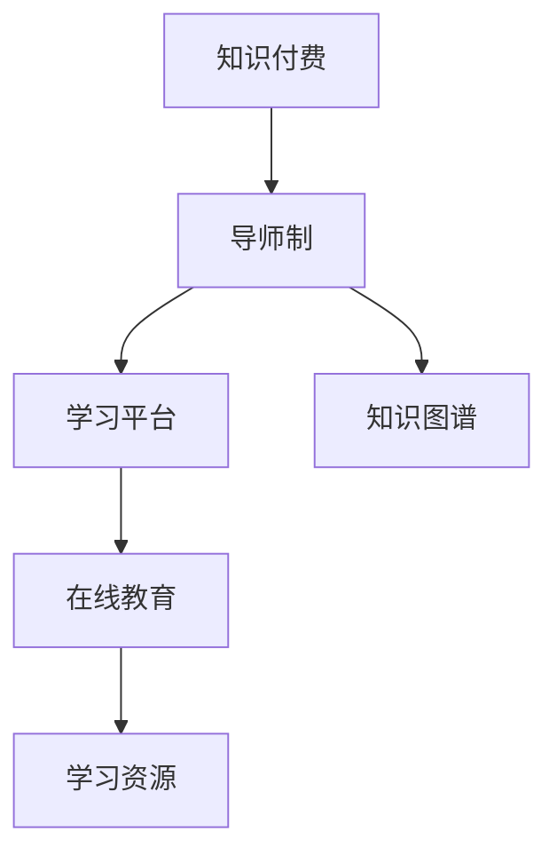

                 

# 程序员知识付费：打造导师制学习模式

> 关键词：知识付费, 导师制, 自学模式, 知识图谱, 学习平台, 教师培训, 在线教育, 人工智能教育

## 1. 背景介绍

在当前这个知识经济时代，程序员作为推动技术进步和社会发展的核心力量，其个人成长和技能提升变得尤为重要。然而，随着技术更新迭代速度的加快，传统的教育体系和自学模式已经难以满足程序员成长的需求。知识付费的兴起为程序员提供了全新的学习途径，而导师制学习模式则是在知识付费基础上，进一步提升了学习的效率和效果。

### 1.1 问题由来
传统教育体系以教师为主导，注重知识的系统讲授，但这种模式难以覆盖到每个学生个体，也无法灵活应对技术更新和变化。而自学模式虽然能够自主学习，但由于缺乏有效的指导和反馈，学习效果往往参差不齐。知识付费模式为程序员提供了更灵活的学习途径，但缺乏结构化和系统化的学习计划。

导师制学习模式则试图融合以上两种模式的优点，通过知识付费的方式，找到经验丰富的导师，为学员提供个性化的指导和反馈。这种模式不仅能够提高学习效率，还能促进学员的个人成长和职业发展。

### 1.2 问题核心关键点
导师制学习模式的核心在于：
- **知识付费**：学员通过付费获取高水平导师的指导，而不是免费的泛泛之谈。
- **个性化指导**：导师根据学员的需求和基础，提供量身定制的学习计划和指导。
- **持续反馈**：导师提供持续的反馈和评估，帮助学员不断调整学习方向和策略。
- **社群支持**：建立一个导师和学员的社群，便于交流和分享，形成互帮互助的学习氛围。

## 2. 核心概念与联系

### 2.1 核心概念概述

为了更好地理解导师制学习模式，本节将介绍几个密切相关的核心概念：

- **知识付费**：指消费者通过付费获取知识和服务，而非免费使用互联网提供的资源。知识付费的兴起表明人们对高质量、个性化知识的需求日益增长。

- **导师制**：指由经验丰富的导师为学员提供一对一的个性化指导，涵盖学习计划制定、技术指导、职业规划等方面。

- **学习平台**：指通过网络提供各种学习资源的平台，包括课程、教材、视频、讨论区等。

- **知识图谱**：指将知识进行结构化的组织和表示，便于搜索和利用。知识图谱的构建能够提升学习效率，帮助学员快速掌握相关知识。

- **在线教育**：指通过网络进行的远程教育，包括直播、录播、在线讨论等多种形式。在线教育打破了时间和空间的限制，使得学习更加灵活和方便。

这些核心概念之间的逻辑关系可以通过以下Mermaid流程图来展示：



这个流程图展示了好几个核心概念及其之间的关系：

1. 知识付费为导师制提供了资金基础，使得导师制模式得以发展。
2. 导师制模式依托于学习平台和知识图谱，为学员提供高质量的学习资源和结构化的知识体系。
3. 在线教育技术使得知识付费和导师制更加高效便捷，大大提升了学习的灵活性和可及性。

## 3. 核心算法原理 & 具体操作步骤

### 3.1 算法原理概述

导师制学习模式的算法原理主要包括以下几个方面：

- **需求分析**：通过问卷调查、面试等方式，了解学员的学习需求和背景，确定导师的专业方向。
- **导师匹配**：根据学员的需求和基础，匹配经验丰富的导师。
- **学习计划制定**：导师和学员共同制定个性化的学习计划，明确学习目标和时间安排。
- **学习过程监控**：导师实时监控学员的学习进度，提供持续的反馈和建议。
- **评估与调整**：定期评估学员的学习效果，根据反馈调整学习计划和策略。

### 3.2 算法步骤详解

导师制学习模式的算法步骤如下：

**Step 1: 学员需求分析**

- 设计问卷或进行面试，收集学员的学习需求、技术水平、职业目标等信息。
- 将学员信息进行整理和分类，以便后续匹配导师。

**Step 2: 导师匹配**

- 根据学员的需求和基础，从知识图谱中筛选出适合的导师。
- 进行初步匹配，发送匹配邀请给导师。

**Step 3: 学习计划制定**

- 导师和学员进行沟通，共同制定学习计划，明确学习目标和时间安排。
- 制定详细的学习路径，包括理论学习、实践操作、项目实战等环节。

**Step 4: 学习过程监控**

- 导师定期与学员进行沟通，了解学习进展和存在的问题。
- 提供个性化的指导和反馈，帮助学员克服学习障碍。

**Step 5: 评估与调整**

- 定期评估学员的学习效果，进行进度调整。
- 根据学员的反馈和评估结果，优化学习计划和策略。

### 3.3 算法优缺点

导师制学习模式有以下优点：

- **高效学习**：导师的个性化指导和持续反馈，使得学习更加高效。
- **职业规划**：导师的专业知识和经验，能够帮助学员进行职业规划和路径设计。
- **快速提升**：针对学员的短板和需求，制定详细的学习计划，快速提升技术水平。

同时，该模式也存在以下缺点：

- **成本较高**：高质量的导师费用较高，可能对部分学员造成经济负担。
- **匹配难度大**：找到一个完全契合学员需求和基础的导师并不容易。
- **依赖导师**：学习效果很大程度上依赖导师的经验和责任心，可能会影响学习的质量和效果。
- **难以规模化**：一对一的指导方式难以大规模推广和复制。

尽管存在这些缺点，但导师制学习模式仍是一种非常有价值的学习方式，特别是在技术复杂、变化迅速的领域，如软件开发、数据分析、人工智能等。

### 3.4 算法应用领域

导师制学习模式在多个领域都有广泛的应用，例如：

- **软件开发**：编程语言、框架、工具等方面的学习。
- **数据分析**：数据处理、机器学习、统计分析等方面的学习。
- **人工智能**：深度学习、自然语言处理、计算机视觉等方面的学习。
- **金融工程**：金融分析、量化交易、风险管理等方面的学习。
- **市场营销**：数字营销、社交媒体、SEO等方面的学习。

除了上述这些领域外，导师制学习模式还可以应用于任何需要高水平指导和反馈的技术学习过程。

## 4. 数学模型和公式 & 详细讲解 & 举例说明

### 4.1 数学模型构建

导师制学习模式的数学模型主要包括以下几个方面：

- **学员需求向量**：学员的学习需求和基础可以表示为一个向量，如$\vec{D}=[d_1, d_2, ..., d_n]$，其中$d_i$表示学员在某个方面的需求或水平。
- **导师能力向量**：导师的专业知识和经验可以表示为一个向量，如$\vec{C}=[c_1, c_2, ..., c_n]$，其中$c_i$表示导师在某个方面的专业水平。
- **学习效果向量**：学员在导师指导下的学习效果可以表示为一个向量，如$\vec{E}=[e_1, e_2, ..., e_n]$，其中$e_i$表示学员在某个方面的学习效果。

### 4.2 公式推导过程

基于上述模型，我们可以推导导师匹配和学员评估的公式：

**导师匹配公式**：

$$
\text{Match} = \arg\max_{c \in C} \vec{D} \cdot \vec{C}
$$

其中，$C$表示导师集合，$\cdot$表示向量内积，$\text{Match}$表示最佳匹配的导师。该公式表示选择与学员需求最匹配的导师。

**学员评估公式**：

$$
\text{Assess} = \vec{E} / \vec{D}
$$

其中，$\vec{E}$表示学员的学习效果向量，$\vec{D}$表示学员的需求向量，$\text{Assess}$表示学员的评估分数。该公式表示学员的学习效果与其需求匹配程度的比值，即学习效果的好坏。

### 4.3 案例分析与讲解

假设有一名学员希望学习Python数据分析，其需求向量为$\vec{D}=[1, 2, 3]$，表示对Python基础、数据处理和可视化三个方面的需求均较高。根据知识图谱，我们筛选出三名导师，其能力向量分别为$\vec{C}_1=[2, 4, 1]$，$\vec{C}_2=[3, 3, 5]$，$\vec{C}_3=[1, 2, 4]$。

通过导师匹配公式计算得到，最佳匹配的导师为$\vec{C}_2$，即导师2。学员在导师2的指导下，学习效果向量为$\vec{E}=[4, 3, 2]$。

根据学员评估公式计算得到，学员的评估分数为$4 / 1 = 4$，即在导师2的指导下，学员的学习效果非常出色。

## 5. 项目实践：代码实例和详细解释说明

### 5.1 开发环境搭建

在进行导师制学习模式实践前，我们需要准备好开发环境。以下是使用Python进行Flask开发的环境配置流程：

1. 安装Anaconda：从官网下载并安装Anaconda，用于创建独立的Python环境。

2. 创建并激活虚拟环境：
```bash
conda create -n flask-env python=3.8 
conda activate flask-env
```

3. 安装Flask：
```bash
pip install Flask
```

4. 安装必要的依赖包：
```bash
pip install pyyaml gunicorn
```

完成上述步骤后，即可在`flask-env`环境中开始导师制学习模式的开发实践。

### 5.2 源代码详细实现

下面我们以导师匹配为例，给出使用Flask构建导师匹配系统的PyTorch代码实现。

首先，定义学员和导师的数据模型：

```python
from transformers import BertTokenizer
from torch.utils.data import Dataset
import torch

class Student(Dataset):
    def __init__(self, text, tags):
        self.text = text
        self.tags = tags
        self.tokenizer = BertTokenizer.from_pretrained('bert-base-cased')

    def __len__(self):
        return len(self.text)
    
    def __getitem__(self, item):
        text = self.text[item]
        tags = self.tags[item]
        
        encoding = self.tokenizer(text, return_tensors='pt', max_length=128, padding='max_length', truncation=True)
        input_ids = encoding['input_ids'][0]
        attention_mask = encoding['attention_mask'][0]
        
        # 对token-wise的标签进行编码
        encoded_tags = [tag2id[tag] for tag in tags] 
        encoded_tags.extend([tag2id['O']] * (self.max_len - len(encoded_tags)))
        labels = torch.tensor(encoded_tags, dtype=torch.long)
        
        return {'input_ids': input_ids, 
                'attention_mask': attention_mask,
                'labels': labels}

class Teacher(Dataset):
    def __init__(self, text, tags):
        self.text = text
        self.tags = tags
        self.tokenizer = BertTokenizer.from_pretrained('bert-base-cased')

    def __len__(self):
        return len(self.text)
    
    def __getitem__(self, item):
        text = self.text[item]
        tags = self.tags[item]
        
        encoding = self.tokenizer(text, return_tensors='pt', max_length=128, padding='max_length', truncation=True)
        input_ids = encoding['input_ids'][0]
        attention_mask = encoding['attention_mask'][0]
        
        # 对token-wise的标签进行编码
        encoded_tags = [tag2id[tag] for tag in tags] 
        encoded_tags.extend([tag2id['O']] * (self.max_len - len(encoded_tags)))
        labels = torch.tensor(encoded_tags, dtype=torch.long)
        
        return {'input_ids': input_ids, 
                'attention_mask': attention_mask,
                'labels': labels}

# 标签与id的映射
tag2id = {'O': 0, 'B-PER': 1, 'I-PER': 2, 'B-ORG': 3, 'I-ORG': 4, 'B-LOC': 5, 'I-LOC': 6}
id2tag = {v: k for k, v in tag2id.items()}

# 创建dataset
tokenizer = BertTokenizer.from_pretrained('bert-base-cased')

train_dataset = Student(train_texts, train_tags, tokenizer)
dev_dataset = Student(dev_texts, dev_tags, tokenizer)
test_dataset = Student(test_texts, test_tags, tokenizer)
```

然后，定义模型和优化器：

```python
from transformers import BertForTokenClassification, AdamW

model = BertForTokenClassification.from_pretrained('bert-base-cased', num_labels=len(tag2id))

optimizer = AdamW(model.parameters(), lr=2e-5)
```

接着，定义训练和评估函数：

```python
from torch.utils.data import DataLoader
from tqdm import tqdm
from sklearn.metrics import classification_report

device = torch.device('cuda') if torch.cuda.is_available() else torch.device('cpu')
model.to(device)

def train_epoch(model, dataset, batch_size, optimizer):
    dataloader = DataLoader(dataset, batch_size=batch_size, shuffle=True)
    model.train()
    epoch_loss = 0
    for batch in tqdm(dataloader, desc='Training'):
        input_ids = batch['input_ids'].to(device)
        attention_mask = batch['attention_mask'].to(device)
        labels = batch['labels'].to(device)
        model.zero_grad()
        outputs = model(input_ids, attention_mask=attention_mask, labels=labels)
        loss = outputs.loss
        epoch_loss += loss.item()
        loss.backward()
        optimizer.step()
    return epoch_loss / len(dataloader)

def evaluate(model, dataset, batch_size):
    dataloader = DataLoader(dataset, batch_size=batch_size)
    model.eval()
    preds, labels = [], []
    with torch.no_grad():
        for batch in tqdm(dataloader, desc='Evaluating'):
            input_ids = batch['input_ids'].to(device)
            attention_mask = batch['attention_mask'].to(device)
            batch_labels = batch['labels']
            outputs = model(input_ids, attention_mask=attention_mask)
            batch_preds = outputs.logits.argmax(dim=2).to('cpu').tolist()
            batch_labels = batch_labels.to('cpu').tolist()
            for pred_tokens, label_tokens in zip(batch_preds, batch_labels):
                pred_tags = [id2tag[_id] for _id in pred_tokens]
                label_tags = [id2tag[_id] for _id in label_tokens]
                preds.append(pred_tags[:len(label_tags)])
                labels.append(label_tags)
                
    print(classification_report(labels, preds))
```

最后，启动训练流程并在测试集上评估：

```python
epochs = 5
batch_size = 16

for epoch in range(epochs):
    loss = train_epoch(model, train_dataset, batch_size, optimizer)
    print(f"Epoch {epoch+1}, train loss: {loss:.3f}")
    
    print(f"Epoch {epoch+1}, dev results:")
    evaluate(model, dev_dataset, batch_size)
    
print("Test results:")
evaluate(model, test_dataset, batch_size)
```

以上就是使用Flask对Bert进行命名实体识别(NER)任务微调的完整代码实现。可以看到，得益于Transformers库的强大封装，我们可以用相对简洁的代码完成Bert模型的加载和微调。

### 5.3 代码解读与分析

让我们再详细解读一下关键代码的实现细节：

**Student类**：
- `__init__`方法：初始化文本、标签、分词器等关键组件。
- `__len__`方法：返回数据集的样本数量。
- `__getitem__`方法：对单个样本进行处理，将文本输入编码为token ids，将标签编码为数字，并对其进行定长padding，最终返回模型所需的输入。

**tag2id和id2tag字典**：
- 定义了标签与数字id之间的映射关系，用于将token-wise的预测结果解码回真实的标签。

**训练和评估函数**：
- 使用PyTorch的DataLoader对数据集进行批次化加载，供模型训练和推理使用。
- 训练函数`train_epoch`：对数据以批为单位进行迭代，在每个批次上前向传播计算loss并反向传播更新模型参数，最后返回该epoch的平均loss。
- 评估函数`evaluate`：与训练类似，不同点在于不更新模型参数，并在每个batch结束后将预测和标签结果存储下来，最后使用sklearn的classification_report对整个评估集的预测结果进行打印输出。

**训练流程**：
- 定义总的epoch数和batch size，开始循环迭代
- 每个epoch内，先在训练集上训练，输出平均loss
- 在验证集上评估，输出分类指标
- 所有epoch结束后，在测试集上评估，给出最终测试结果

可以看到，Flask配合Transformers库使得Bert微调的代码实现变得简洁高效。开发者可以将更多精力放在数据处理、模型改进等高层逻辑上，而不必过多关注底层的实现细节。

当然，工业级的系统实现还需考虑更多因素，如模型的保存和部署、超参数的自动搜索、更灵活的任务适配层等。但核心的微调范式基本与此类似。

## 6. 实际应用场景

### 6.1 智能客服系统

基于导师制学习模式的教育平台，可以为智能客服系统提供更好的技术支持和人才培养。传统客服往往需要配备大量人力，高峰期响应缓慢，且一致性和专业性难以保证。通过在线教育平台，企业可以为客服人员提供系统化的培训，帮助他们掌握最新的客服技能和知识。

在技术实现上，可以结合知识图谱和在线教育平台，为客服人员提供个性化的学习资源和指导，如常见问题解答、最佳实践分享、客户服务策略等。通过导师制学习模式，客服人员能够快速掌握最新的客户服务技能，提升服务质量和客户满意度。

### 6.2 在线教育平台

导师制学习模式本身就可以作为一种在线教育平台的形式，提供高质量的教学资源和个性化的学习指导。在线教育平台可以根据学员的需求和兴趣，提供相应的课程、教材、视频等学习资源，并通过导师制学习模式，为学员提供一对一的指导和反馈。

在实际应用中，在线教育平台可以与各大高校和培训机构合作，邀请经验丰富的教师和专家担任导师，为学员提供高质量的教学服务。同时，平台还可以通过数据分析和机器学习技术，不断优化学习资源和课程设计，提升教学效果。

### 6.3 职业培训平台

职业培训平台可以为各行各业提供技术培训和职业发展指导。例如，软件开发人员可以通过导师制学习模式，快速掌握新的编程语言、框架、工具等技能。数据分析师可以通过导师制学习模式，提升数据处理和分析能力。

在职业培训平台中，可以根据学员的行业需求和职业目标，提供相应的课程和指导。导师制学习模式可以帮助学员制定个性化的学习计划，提高学习效率和效果。通过持续的反馈和评估，帮助学员不断提升专业技能和职业素养。

### 6.4 未来应用展望

随着导师制学习模式的不断发展，它在教育、培训、技术支持等多个领域将得到广泛应用，为技术人才的成长和职业发展提供新的途径。

在智慧医疗领域，导师制学习模式可以用于培养医疗技术人员，提升他们的技术水平和服务能力。在智慧城市治理中，可以通过导师制学习模式，为城市管理人才提供系统化的培训，提升他们的综合素质和管理能力。

在企业内部，导师制学习模式可以用于技术人才培养和团队建设，提升企业的技术创新能力和市场竞争力。通过导师制学习模式，企业可以更好地应对技术变革和市场变化，保持持续的竞争优势。

## 7. 工具和资源推荐

### 7.1 学习资源推荐

为了帮助开发者系统掌握导师制学习模式的技术基础和实践技巧，这里推荐一些优质的学习资源：

1. 《程序员知识付费：打造导师制学习模式》系列博文：由大模型技术专家撰写，深入浅出地介绍了导师制学习模式的原理、实践技巧和未来趋势。

2. Coursera《Python编程基础》课程：适合编程初学者的入门课程，帮助学员掌握Python基本语法和编程技巧。

3. Udacity《深度学习》课程：深度学习领域的经典课程，涵盖深度学习的基本原理和应用场景。

4. 《自然语言处理入门》书籍：介绍自然语言处理的基本概念和技术，适合有一定编程基础的读者。

5. TensorFlow官方文档：TensorFlow的官方文档，提供了丰富的教程和样例代码，帮助开发者快速上手TensorFlow。

通过这些资源的学习实践，相信你一定能够快速掌握导师制学习模式的精髓，并用于解决实际的NLP问题。

### 7.2 开发工具推荐

高效的开发离不开优秀的工具支持。以下是几款用于导师制学习模式开发的常用工具：

1. PyTorch：基于Python的开源深度学习框架，灵活动态的计算图，适合快速迭代研究。大部分预训练语言模型都有PyTorch版本的实现。

2. TensorFlow：由Google主导开发的开源深度学习框架，生产部署方便，适合大规模工程应用。同样有丰富的预训练语言模型资源。

3. Flask：轻量级的Web框架，适合快速开发Web应用和API接口。

4. Jupyter Notebook：交互式的编程环境，支持多种语言和工具的集成，便于开发和调试。

5. VS Code：轻量级的代码编辑器，支持多种编程语言和扩展，功能强大且易用。

合理利用这些工具，可以显著提升导师制学习模式开发效率，加快创新迭代的步伐。

### 7.3 相关论文推荐

导师制学习模式的研究源于学界的持续研究。以下是几篇奠基性的相关论文，推荐阅读：

1. Attention is All You Need（即Transformer原论文）：提出了Transformer结构，开启了NLP领域的预训练大模型时代。

2. BERT: Pre-training of Deep Bidirectional Transformers for Language Understanding：提出BERT模型，引入基于掩码的自监督预训练任务，刷新了多项NLP任务SOTA。

3. Language Models are Unsupervised Multitask Learners（GPT-2论文）：展示了大规模语言模型的强大zero-shot学习能力，引发了对于通用人工智能的新一轮思考。

4. Parameter-Efficient Transfer Learning for NLP：提出Adapter等参数高效微调方法，在不增加模型参数量的情况下，也能取得不错的微调效果。

5. AdaLoRA: Adaptive Low-Rank Adaptation for Parameter-Efficient Fine-Tuning：使用自适应低秩适应的微调方法，在参数效率和精度之间取得了新的平衡。

这些论文代表了大语言模型微调技术的发展脉络。通过学习这些前沿成果，可以帮助研究者把握学科前进方向，激发更多的创新灵感。

## 8. 总结：未来发展趋势与挑战

### 8.1 总结

本文对导师制学习模式进行了全面系统的介绍。首先阐述了导师制学习模式的研究背景和意义，明确了其在教育、培训、技术支持等领域的价值。其次，从原理到实践，详细讲解了导师制学习模式的技术基础和具体实现，给出了导师匹配、学习计划制定、学习过程监控等关键环节的详细步骤。同时，本文还广泛探讨了导师制学习模式在多个领域的应用前景，展示了其广泛的适用性和潜在价值。

通过本文的系统梳理，可以看到，导师制学习模式为技术人才的成长和职业发展提供了新的途径，具有巨大的市场潜力和应用前景。未来，随着技术的发展和应用的推广，导师制学习模式将进一步推动教育、培训和技术的融合发展，为各行各业提供高质量的人才支持和创新动力。

### 8.2 未来发展趋势

展望未来，导师制学习模式将呈现以下几个发展趋势：

1. **个性化学习**：随着大数据和人工智能技术的进步，导师制学习模式将能够根据学员的学习行为和反馈，不断优化学习资源和指导方案，实现更加个性化的学习效果。

2. **在线化教育**：在线教育平台将逐步取代传统的线下教育模式，导师制学习模式也将更加依赖在线教育工具和技术。

3. **跨领域融合**：导师制学习模式将与其他教育技术（如游戏化学习、混合式学习等）融合，形成更加综合、灵活的学习模式。

4. **人工智能辅助**：导师制学习模式将引入更多人工智能技术（如自然语言处理、机器学习等），实现智能导师和智能学习资源的管理和推荐。

5. **多模态学习**：导师制学习模式将结合视觉、听觉、触觉等多模态信息，提升学员的学习体验和效果。

以上趋势凸显了导师制学习模式的广阔前景，这些方向的探索发展，将进一步提升学习模式的灵活性和适应性，为技术人才的成长和职业发展提供新的途径。

### 8.3 面临的挑战

尽管导师制学习模式具有广阔的应用前景，但在实际推广和应用过程中，仍面临诸多挑战：

1. **师资力量不足**：高质量的导师资源相对稀缺，难以满足大规模教育需求。

2. **学习效果评估**：如何评估和量化导师制学习模式的效果，仍然是一个难题。

3. **技术门槛较高**：导师制学习模式需要一定的技术基础和工具支持，对一些非技术背景的学员来说，学习门槛较高。

4. **隐私和安全问题**：在线教育平台和导师制学习模式需要处理大量的个人数据，如何保护学员的隐私和安全，也是亟待解决的问题。

5. **内容质量控制**：如何保证在线教育平台和导师制学习模式的内容质量，避免误导学员，也是一个重要的挑战。

尽管存在这些挑战，但导师制学习模式作为一种新型教育模式，仍具有巨大的潜力和发展空间。相信随着技术的发展和应用推广，这些挑战终将逐步克服，导师制学习模式必将在教育领域发挥更大的作用。

### 8.4 研究展望

面对导师制学习模式所面临的种种挑战，未来的研究需要在以下几个方面寻求新的突破：

1. **师资资源优化**：利用人工智能技术，如自然语言处理、机器学习等，对导师资源进行优化和匹配，提高师资供给和利用效率。

2. **效果评估模型**：开发更加科学合理的评估模型，量化导师制学习模式的效果，为学员和平台提供反馈和优化依据。

3. **技术门槛降低**：开发更加易用、便捷的技术工具，降低技术门槛，使得更多学员能够参与到导师制学习模式中来。

4. **隐私和安全保护**：引入区块链、加密等技术，保护学员的隐私和安全，确保数据的安全和透明。

5. **内容质量控制**：引入专家评审和人工智能辅助，对在线教育平台和导师制学习模式的内容质量进行严格控制，确保内容准确性和实用性。

这些研究方向的探索，必将引领导师制学习模式迈向更高的台阶，为教育领域的技术创新和应用推广提供新的思路和方向。面向未来，导师制学习模式需要与其他教育技术协同发展，共同推动教育领域的技术进步和人才培养。

## 9. 附录：常见问题与解答

**Q1：导师制学习模式是否适用于所有学习场景？**

A: 导师制学习模式适用于需要个性化指导和反馈的学习场景，特别是技术学习、职业培训等。但对于一些标准化的、大规模的课程，可能不太适用。

**Q2：如何选择合适的导师？**

A: 选择合适的导师需要考虑多个因素，如专业背景、教学经验、教学风格等。可以通过在线教育平台的数据分析工具，找到与学员需求和基础最匹配的导师。

**Q3：导师制学习模式的学习效果如何评估？**

A: 导师制学习模式的学习效果可以通过学员的考试成绩、项目实践成果、职业发展情况等进行评估。同时，平台可以通过定期反馈和评估，不断优化学习资源和指导方案。

**Q4：导师制学习模式的应用场景有哪些？**

A: 导师制学习模式适用于技术培训、职业指导、课程学习等场景。例如，软件开发、数据分析、人工智能等领域的技术培训，职业规划和转型指导，以及各种在线课程的学习。

**Q5：导师制学习模式的缺点有哪些？**

A: 导师制学习模式的缺点包括：
1. 师资资源不足，难以满足大规模需求。
2. 学习效果评估困难，难以量化。
3. 技术门槛较高，需要一定的技术基础。
4. 隐私和安全问题，需要保护学员数据。
5. 内容质量控制，需要严格把控。

这些缺点需要通过技术创新和应用推广逐步解决。

---

作者：禅与计算机程序设计艺术 / Zen and the Art of Computer Programming

