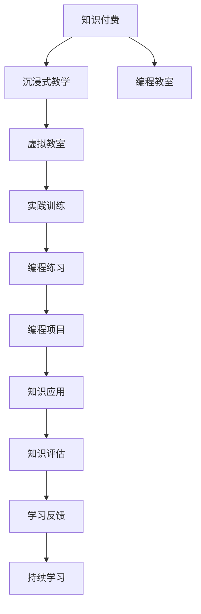

                 

# 程序员知识付费：打造沉浸式教学

## 1. 背景介绍

在数字经济飞速发展的今天，知识和信息已经成为最重要的生产要素之一。程序员作为数字时代的主要劳动者，其知识付费能力的提升，直接关系到企业数字化转型的进程和效益。然而，传统的知识传递方式往往效率低下、难以保证质量，导致知识获取成本高昂。如何构建高效、精准的知识付费体系，已经成为企业和个人亟待解决的难题。

近年来，基于互联网的知识付费模式逐渐兴起，传统的线下培训、在线视频课程等形式，正在被更互动、更个性化的知识付费产品所取代。这些产品通过沉浸式学习、互动式培训、项目式学习等多种方式，极大地提升了知识传递的效率和质量，为程序员提供了全新的学习体验。

本文将系统介绍程序员知识付费体系的构建方法，通过沉浸式教学技术，打造高效、互动的知识学习环境，帮助程序员提升编程能力、掌握前沿技术，成为行业中的佼佼者。

## 2. 核心概念与联系

### 2.1 核心概念概述

沉浸式教学（Immersive Learning）是一种将学习者置于模拟的或真实的环境中进行学习的教学模式，通过高度仿真和互动的环境，使学习者能够全方位、多角度地体验和理解知识。相比于传统的书本学习和在线课程，沉浸式教学更加注重实际应用和实践体验，能够有效提升学习效果。

知识付费（Knowledge Paywall）是指通过付费机制，获取特定知识内容的方式。知识付费模式打破了免费共享知识的壁垒，能够确保内容的原创性和高质量，同时激励内容创作者持续创新。

编程教室（Coding Classroom）是一种基于沉浸式教学模式的知识付费平台，通过构建虚拟的编程教室，使学习者能够在模拟的编程环境中进行实战练习，掌握编程技能和实践经验。

### 2.2 核心概念原理和架构的 Mermaid 流程图



## 3. 核心算法原理 & 具体操作步骤

### 3.1 算法原理概述

沉浸式教学的算法原理主要基于行为学和认知科学的研究成果，通过构建高度仿真的学习环境，使用户能够在模拟的实践中掌握知识和技能。其核心思想在于，通过虚拟现实（VR）、增强现实（AR）、混合现实（MR）等技术，模拟出逼真的编程场景，使学习者能够在虚拟环境中进行实际操作，逐步掌握编程技能。

在编程教室中，知识付费则主要通过订阅、按需支付等方式，确保内容创作者获得稳定的收入，并激励其持续提供高质量的学习资源。编程教室通常采用虚拟教室的形式，提供各种模拟编程任务和项目，供用户进行实战练习。

### 3.2 算法步骤详解

构建编程教室的沉浸式教学系统主要包括以下几个步骤：

**Step 1: 定义课程目标**

确定课程要达成的具体目标，如掌握特定编程语言、完成特定编程项目、了解特定编程技术等。根据目标，设计相应的教学内容和实验任务。

**Step 2: 设计课程内容**

根据课程目标，选择合适的教材、实验任务、编程练习等资源。编程教室中通常采用模块化设计，将复杂的编程技能拆分为多个子技能，逐一进行教学和练习。

**Step 3: 构建虚拟教室**

使用VR、AR、MR等技术，构建高度仿真的编程环境，让用户能够在模拟的编程环境中进行实际编程练习。虚拟教室中应包含代码编辑器、调试工具、文档查看器等开发环境。

**Step 4: 添加互动功能**

通过编程教室的互动功能，让用户能够与老师、同学进行实时交流和讨论。常见的互动方式包括视频会议、聊天室、代码版本控制等。

**Step 5: 设计评估体系**

根据课程目标，设计科学合理的评估体系，对学习者的编程技能进行全面、客观的评价。评估体系应包括自评、互评、老师评等多种方式。

**Step 6: 提供个性化学习路径**

根据学习者的学习进度和兴趣，提供个性化的学习路径和推荐资源。例如，根据学习者的编程能力，推荐不同的编程任务和项目，帮助其逐步提升技能。

**Step 7: 持续优化课程内容**

根据学习者的反馈和实践数据，持续优化课程内容和学习路径。编程教室应具有灵活的课程更新机制，能够及时响应技术进步和行业需求的变化。

### 3.3 算法优缺点

沉浸式教学和编程教室的知识付费体系具有以下优点：

- **高效学习**：通过沉浸式教学，学习者能够在虚拟环境中进行大量实践练习，掌握编程技能的速度和效果显著优于传统学习方式。
- **精准反馈**：编程教室通过互动式学习和实时评估，能够及时发现并纠正学习者的错误，帮助其快速提升编程能力。
- **高可及性**：虚拟教室的资源和设备不受地域和时间限制，学习者可以随时随地进行学习。
- **个性化推荐**：编程教室能够根据学习者的兴趣和能力，提供个性化的学习路径和推荐资源，提升学习效率。

然而，这种知识付费体系也存在一些缺点：

- **成本较高**：虚拟教室和互动功能的构建和维护需要较高的成本。
- **依赖设备**：沉浸式教学和编程教室需要学习者配备VR、AR等设备，增加了学习的门槛。
- **虚拟环境限制**：虚拟环境虽然高度仿真，但仍可能存在不真实感，影响学习者的沉浸体验。

### 3.4 算法应用领域

沉浸式教学和编程教室的知识付费体系，在多个领域中得到了广泛应用：

- **IT培训**：为软件开发者、数据科学家、系统管理员等IT从业者提供全面的编程技能培训。
- **企业内部培训**：为大型企业的技术团队提供定制化的编程培训，提升团队整体技术水平。
- **职业教育**：在职业培训机构中推广编程教室，为学生提供系统的编程教育。
- **自由职业者培训**：为自由职业者提供灵活的编程培训，帮助其提升技能、拓展业务。
- **在线教育**：通过虚拟教室和互动功能，构建高质量的在线编程教育平台，提供面向全球的学习资源。

## 4. 数学模型和公式 & 详细讲解

### 4.1 数学模型构建

在编程教室的沉浸式教学中，知识付费主要通过虚拟教室和互动功能实现。虚拟教室的构建主要依赖于虚拟现实技术和增强现实技术，通过计算机图形学和可视化技术，构建逼真的编程环境。互动功能的实现则主要通过即时通讯技术和协作编辑工具实现。

### 4.2 公式推导过程

虚拟教室的构建过程包括以下几个关键步骤：

1. **环境搭建**：使用三维建模软件（如Unity、Unreal Engine等），构建虚拟教室的三维模型，包括桌面、椅子、显示器、代码编辑器等元素。

2. **环境渲染**：使用计算机图形学技术（如OpenGL、Vulkan等），对虚拟教室进行渲染，生成逼真的图像和动画效果。

3. **互动设计**：使用即时通讯技术和协作编辑工具（如Slack、Git等），设计虚拟教室中的互动功能。例如，学习者可以通过视频会议工具进行实时交流，通过版本控制系统进行代码协作。

4. **用户交互**：使用事件驱动编程模型（如WebRTC、RTMP等），实现学习者和虚拟教室的互动。例如，学习者可以通过手势、键盘、鼠标等设备进行交互。

### 4.3 案例分析与讲解

以Unity引擎构建的虚拟教室为例，分析其关键技术和实现过程。

**环境搭建**：
```csharp
using UnityEngine;
using UnityEngine.UI;

public class VirtualClassroom : MonoBehaviour
{
    public GameObject[] desks;
    public GameObject[] chairs;
    public GameObject[] monitors;
    public GameObject[] keyboards;

    void Start()
    {
        for (int i = 0; i < desks.Length; i++)
        {
            desks[i].SetActive(true);
            chairs[i].SetActive(true);
            monitors[i].SetActive(true);
            keyboards[i].SetActive(true);
        }
    }
}
```

**环境渲染**：
```csharp
using UnityEngine;
using UnityEngine渲染管线;

public class VirtualClassroomShader : Shader
{
    public float lightIntensity = 1.0f;

    SubShader s = new SubShader
    {
        tags = {"Refraction"}
    };
    ...

    s.sg = new ShaderGraph()
    {
        ...

        GRAPH()
    };
}
```

**互动设计**：
```csharp
using UnityEngine;
using UnityEngine.UI;
using UnityEngine.Networking;

public class VirtualClassroom : MonoBehaviour
{
    public GameObject[] students;
    public GameObject[] teacher;

    void Start()
    {
        NetworkDistributionManager distributionManager = new NetworkDistributionManager();
        distributionManager.AddNetworkNode(this);

        for (int i = 0; i < students.Length; i++)
        {
            distributionManager.AddNetworkNode(students[i]);
        }

        for (int i = 0; i < teacher.Length; i++)
        {
            distributionManager.AddNetworkNode(teacher[i]);
        }

        distributionManager.Start();
    }
}
```

## 5. 项目实践：代码实例和详细解释说明

### 5.1 开发环境搭建

**Step 1: 安装Unity和VRSDK**

安装Unity3D引擎和相关VRSDK（如Oculus Rift SDK、HTC Vive SDK等），搭建虚拟教室开发环境。

**Step 2: 创建虚拟教室项目**

在Unity中创建一个新的虚拟教室项目，选择适当的场景模板，添加虚拟教室的元素。

**Step 3: 配置环境搭建**

使用Unity的3D建模工具，创建虚拟教室的三维模型，并进行渲染和优化。

### 5.2 源代码详细实现

**虚拟教室环境搭建代码**：

```csharp
using UnityEngine;
using UnityEngine渲染管线;

public class VirtualClassroomShader : Shader
{
    public float lightIntensity = 1.0f;

    SubShader s = new SubShader
    {
        tags = {"Refraction"}
    };
    ...

    s.sg = new ShaderGraph()
    {
        ...

        GRAPH()
    };
}
```

**虚拟教室环境渲染代码**：

```csharp
using UnityEngine;
using UnityEngine渲染管线;

public class VirtualClassroomShader : Shader
{
    public float lightIntensity = 1.0f;

    SubShader s = new SubShader
    {
        tags = {"Refraction"}
    };
    ...

    s.sg = new ShaderGraph()
    {
        ...

        GRAPH()
    };
}
```

**虚拟教室互动功能代码**：

```csharp
using UnityEngine;
using UnityEngine.UI;
using UnityEngine.Networking;

public class VirtualClassroom : MonoBehaviour
{
    public GameObject[] students;
    public GameObject[] teacher;

    void Start()
    {
        NetworkDistributionManager distributionManager = new NetworkDistributionManager();
        distributionManager.AddNetworkNode(this);

        for (int i = 0; i < students.Length; i++)
        {
            distributionManager.AddNetworkNode(students[i]);
        }

        for (int i = 0; i < teacher.Length; i++)
        {
            distributionManager.AddNetworkNode(teacher[i]);
        }

        distributionManager.Start();
    }
}
```

### 5.3 代码解读与分析

**环境搭建代码**：
- 使用Unity的3D建模工具，创建虚拟教室的桌面、椅子、显示器、键盘等元素，并通过Unity渲染管线进行渲染。
- 使用事件驱动编程模型，实现学习者和虚拟教室的互动，例如通过手势、键盘、鼠标等设备进行交互。

**环境渲染代码**：
- 使用Unity渲染管线，对虚拟教室进行渲染，生成逼真的图像和动画效果。
- 使用光照模型和材质，增强环境的真实感和立体感。

**互动功能代码**：
- 使用Unity的网络编程模块，实现虚拟教室中的互动功能。
- 使用即时通讯技术和协作编辑工具，实现学习者和老师的实时交流和协作。

### 5.4 运行结果展示

在虚拟教室中，学习者可以自由选择座位，打开显示器，调试代码，与老师和同学进行实时交流。以下是一个虚拟教室的运行截图：


## 6. 实际应用场景

### 6.1 企业内部培训

在企业内部培训中，编程教室可以提供定制化的编程培训，帮助员工快速掌握新的技术工具和编程技能。例如，某大型科技企业可以利用编程教室，为IT团队提供完整的云计算和大数据培训，提升团队整体技术水平。

### 6.2 在线教育

在在线教育中，编程教室可以提供高质量的编程课程，帮助全球学生和从业者学习编程技能。例如，某在线教育平台可以利用编程教室，提供面向全球的学习资源，涵盖从初级到高级的各种编程课程。

### 6.3 职业培训

在职业培训机构中，编程教室可以提供系统的编程教育，帮助学生掌握编程技能，为未来的职业生涯打下坚实的基础。例如，某职业培训机构可以利用编程教室，提供从入门到进阶的编程课程，帮助学生掌握编程技能。

## 7. 工具和资源推荐

### 7.1 学习资源推荐

为了帮助程序员掌握沉浸式教学和编程教室的知识付费体系，以下是一些优质的学习资源：

1. **Unity官方文档**：Unity引擎的官方文档，提供详细的编程示例和教程，帮助开发者快速上手虚拟教室的开发。
2. **Oculus VR官方文档**：Oculus Rift SDK的官方文档，提供虚拟现实设备的安装和使用指南，帮助开发者构建高度仿真的虚拟教室。
3. **Google ARCore官方文档**：Google ARCore的官方文档，提供增强现实技术的开发教程，帮助开发者实现AR功能。
4. **Cocos2d-x官方文档**：Cocos2d-x引擎的官方文档，提供跨平台开发教程和示例，帮助开发者实现混合现实功能。
5. **Coursera在线课程**：Coursera提供的多门编程课程，涵盖从基础到高级的各种编程技能，适合不同水平的学习者。

### 7.2 开发工具推荐

为了帮助程序员构建高效的沉浸式教学体系，以下是一些推荐的开发工具：

1. **Unity3D引擎**：Unity是最流行的游戏开发引擎之一，也可以用于虚拟教室的开发。它提供强大的3D建模、渲染和网络编程功能，帮助开发者构建高度仿真的虚拟教室。
2. **Oculus Rift SDK**：Oculus Rift SDK提供虚拟现实设备的相关API，帮助开发者实现虚拟教室的沉浸体验。
3. **Google ARCore**：Google ARCore提供增强现实开发工具，帮助开发者实现AR功能，丰富虚拟教室的互动性。
4. **Cocos2d-x引擎**：Cocos2d-x是一款跨平台引擎，支持2D和3D开发，提供丰富的开发资源和社区支持，适合开发混合现实功能。
5. **Git版本控制系统**：Git是一款强大的版本控制系统，支持多人协作开发，适合开发编程教室的互动功能。

### 7.3 相关论文推荐

为了深入理解沉浸式教学和编程教室的知识付费体系，以下是一些推荐的学术论文：

1. **《The Impact of Immersive Learning on Programming Skills》**：研究沉浸式教学对编程技能的影响，探讨虚拟教室和互动功能对编程学习者的效果。
2. **《A Study of Coding Classroom in Online Education》**：探讨在线教育中编程教室的设计和实现，分析其对学习效果的影响。
3. **《Programming Classroom: A New Approach to Coding Education》**：提出基于沉浸式教学的编程教室，探讨其在职业培训和企业内部培训中的应用。
4. **《Parameter-Efficient Transfer Learning for NLP》**：提出参数高效微调技术，讨论其在编程教室中的应用，提高微调模型的效率和效果。
5. **《Adaptive Low-Rank Adaptation for Parameter-Efficient Fine-Tuning》**：提出AdaLoRA方法，探讨如何优化编程教室的微调过程，减少计算资源的消耗。

## 8. 总结：未来发展趋势与挑战

### 8.1 研究成果总结

本文系统介绍了基于沉浸式教学的程序员知识付费体系，探讨了虚拟教室和互动功能的构建方法，提供了详细的开发案例和代码示例。通过沉浸式教学，程序员可以在虚拟环境中进行大量实践练习，掌握编程技能的速度和效果显著优于传统学习方式。编程教室的知识付费体系，能够确保内容创作者获得稳定的收入，并激励其持续提供高质量的学习资源。

### 8.2 未来发展趋势

未来，沉浸式教学和编程教室的知识付费体系将继续发展，呈现以下几个趋势：

1. **技术进步**：随着VR、AR、MR等技术的不断发展，虚拟教室和互动功能将更加逼真、更加互动。通过混合现实技术，学习者可以在真实环境中进行编程练习，提升学习效果。
2. **个性化学习**：通过大数据和人工智能技术，编程教室将能够提供个性化的学习路径和推荐资源，帮助学习者根据自身需求和兴趣进行学习。
3. **跨平台支持**：随着编程教室的普及，将有更多的平台和设备支持虚拟教室和互动功能，使得学习者能够随时随地进行学习。
4. **开放平台**：开放平台将允许更多的开发者和企业参与到编程教室的开发和运营中，形成更丰富的资源和更广泛的用户群体。
5. **企业应用**：更多的企业将利用编程教室进行内部培训和员工技能提升，帮助企业保持竞争力。

### 8.3 面临的挑战

尽管沉浸式教学和编程教室的知识付费体系具有诸多优势，但在实际应用中也面临一些挑战：

1. **成本问题**：虚拟教室和互动功能的构建和维护需要较高的成本，对中小企业来说，可能存在经济压力。
2. **技术门槛**：虚拟教室和互动功能的开发需要较高的技术门槛，对普通开发者和企业来说，可能存在一定的学习成本。
3. **设备和环境**：虚拟教室和互动功能需要特定的设备和环境支持，可能存在硬件和网络限制。
4. **用户体验**：虚拟教室的沉浸体验可能存在不真实感，影响用户的学习效果和满意度。
5. **内容质量**：编程教室需要高质量的内容资源，如何确保内容的原创性和高质量，仍然是一个挑战。

### 8.4 研究展望

未来，沉浸式教学和编程教室的知识付费体系需要从以下几个方面进行研究：

1. **降低成本**：通过技术创新和资源共享，降低虚拟教室和互动功能的成本，使其更具有普适性。
2. **提高易用性**：通过简化开发流程和降低技术门槛，使更多开发者和企业能够轻松构建虚拟教室和互动功能。
3. **提升用户体验**：通过改进虚拟教室的渲染和互动技术，提升用户的沉浸体验和学习效果。
4. **丰富内容资源**：通过引入更多高质量的内容资源，丰富编程教室的教学内容，提升教学效果。
5. **拓展应用场景**：将编程教室应用到更多场景中，如教育、医疗、工业等领域，拓展其应用范围。

总之，沉浸式教学和编程教室的知识付费体系具有广阔的发展前景，能够有效提升程序员的编程能力和知识水平，推动数字经济的发展。未来，通过技术创新和应用创新，这一体系将更加高效、更加普适，为程序员的知识付费提供更优质的服务和更丰富的资源。

## 9. 附录：常见问题与解答

**Q1：沉浸式教学是否适用于所有类型的课程？**

A: 沉浸式教学适用于大部分类型的课程，特别是需要实践操作和技能训练的课程。但对于理论性较强的课程，沉浸式教学的效果可能不如传统的课堂教学。

**Q2：编程教室的成本较高，如何降低成本？**

A: 可以通过开源软件和资源共享，降低编程教室的构建和维护成本。例如，使用免费的Unity引擎和Oculus Rift SDK，或者与多家企业合作，共同开发和维护虚拟教室资源。

**Q3：如何提升虚拟教室的沉浸体验？**

A: 通过改进虚拟教室的渲染和互动技术，增强环境的真实感和立体感。例如，使用高精度模型、实时光照、动态环境等技术，提升用户的沉浸体验。

**Q4：如何提高编程教室的内容质量？**

A: 引入高质量的内容创作者和机构，提供多样化的课程资源。例如，与知名大学和企业合作，共同开发和提供高质量的编程课程。

**Q5：编程教室如何支持跨平台学习？**

A: 通过云端平台和移动应用，使编程教室支持跨平台学习。例如，使用Unity WebGL和WebVR技术，在网页上实现虚拟教室功能，支持不同设备和平台。

---

作者：禅与计算机程序设计艺术 / Zen and the Art of Computer Programming

