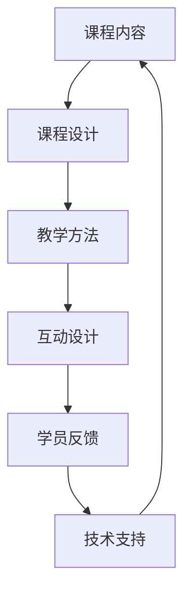

                 

## 1. 背景介绍

### 1.1 问题由来

随着互联网和移动设备的普及，人们对于在线学习的需求日益增长。无论是学生还是职场人士，在线教育提供了更多的学习和培训机会。同时，知识付费也成为越来越多人的选择，付费获取优质课程成为主流。

然而，在线教育市场也面临诸多挑战。传统的大班授课模式难以照顾到每个学员的需求，且学习效果难以保证。知识付费平台面临版权纠纷、内容质量参差不齐等问题。此时，高端课程的打造和运营显得尤为重要。

### 1.2 问题核心关键点

高端课程的打造需要考虑以下几个关键点：
- **课程内容**：需要具备深度和广度，紧贴行业前沿，满足目标学员的学习需求。
- **教学设计**：通过科学的教学方法和互动设计，提升学员的学习体验和效果。
- **讲师团队**：邀请行业专家和经验丰富的讲师，提供高质量的教学服务。
- **技术支持**：借助先进的技术手段，如人工智能、大数据等，提升课程的互动性和个性化。
- **学员反馈**：收集和分析学员反馈，持续优化课程内容和教学方法。

### 1.3 问题研究意义

打造高端课程对于教育行业的健康发展具有重要意义：
- **提升教育质量**：高端课程通过优质的内容和专业的教学，能够提升整体教育质量。
- **满足个性化需求**：通过技术手段，实现课程内容的个性化推荐，满足不同学员的学习需求。
- **促进知识传播**：高质量的课程内容能够更快地传播知识，加速技术发展和行业进步。
- **激发创新能力**：高端课程鼓励学员探索和创新，推动技术进步和行业变革。

## 2. 核心概念与联系

### 2.1 核心概念概述

为了更好地理解高端课程的打造，我们需要介绍以下几个关键概念：

- **课程内容**：指课程中所涉及的知识、技能、方法等内容。
- **课程设计**：指对课程内容进行结构化和组织，使其易于理解和学习。
- **教学方法**：指教师采用哪些方式传授知识，包括讲授、讨论、实验等。
- **学员反馈**：指学员在学习过程中对课程内容的评价和建议。
- **互动设计**：指课程中如何设计互动环节，如提问、讨论、实践等。
- **技术支持**：指课程开发和运行过程中使用的技术手段，如人工智能、大数据等。

这些概念之间的联系可以通过以下Mermaid流程图来展示：



这个流程图展示了课程内容、课程设计、教学方法、互动设计、学员反馈和技术支持之间的关系：

1. 课程内容是课程设计的起点。
2. 课程设计决定了教学方法的选择。
3. 教学方法影响互动设计。
4. 互动设计促进学员反馈的形成。
5. 学员反馈和技术支持共同影响课程内容的迭代和优化。

## 3. 核心算法原理 & 具体操作步骤

### 3.1 算法原理概述

高端课程的打造需要运用多种算法和技术，以提升课程的质量和效果。这些算法和技术可以大致分为以下几类：

- **机器学习算法**：用于分析学员行为数据，个性化推荐课程内容。
- **自然语言处理(NLP)**：用于处理课程文本内容，如自动生成课程大纲、自动评分等。
- **计算机视觉(CV)**：用于分析课程视频中的视觉内容，如识别人脸表情、提取关键帧等。
- **大数据技术**：用于分析大规模数据，如学员学习行为、课程互动情况等。

这些算法和技术相互结合，形成了完整的课程打造流程。

### 3.2 算法步骤详解

高端课程的打造一般包括以下几个关键步骤：

**Step 1: 课程需求分析**

- 确定课程目标和受众群体，明确课程的核心内容和难度。
- 收集学员反馈和市场需求，调整课程内容和教学方法。

**Step 2: 课程内容构建**

- 组织行业专家和讲师，构建课程大纲和教学内容。
- 对课程内容进行结构化处理，如章节划分、知识点归纳等。

**Step 3: 教学方法设计**

- 根据课程内容选择适合的教学方法，如讲授、讨论、实验等。
- 设计互动环节，如提问、讨论、实践等，提升学员参与度。

**Step 4: 课程实施与评估**

- 实施课程内容，根据学员反馈调整教学方法。
- 使用大数据技术分析学员学习行为，持续优化课程内容。

**Step 5: 技术支持**

- 选择合适的技术工具，如机器学习、自然语言处理等。
- 集成技术工具，提升课程的互动性和个性化。

### 3.3 算法优缺点

高端课程的打造涉及多种算法和技术，每种算法和技术都有其优点和缺点：

**机器学习算法的优点**：
- 能够处理大规模数据，提供个性化推荐。
- 能够实时分析学员行为，及时调整课程内容。

**机器学习算法的缺点**：
- 需要大量标注数据进行训练，数据准备成本高。
- 算法模型复杂，难以解释。

**自然语言处理(NLP)的优点**：
- 能够自动处理课程文本内容，提升课程制作的效率。
- 能够自动评分和生成课程大纲，减轻讲师工作量。

**自然语言处理(NLP)的缺点**：
- 处理多语言文本时，效果可能不如单语言文本。
- 处理非结构化文本时，效果可能不如结构化数据。

**计算机视觉(CV)的优点**：
- 能够处理视频中的视觉内容，提升课程互动性。
- 能够识别人脸表情，提升课程的情感分析能力。

**计算机视觉(CV)的缺点**：
- 处理大规模视频数据时，计算成本高。
- 处理视频质量较低时，效果可能不如高质量视频。

**大数据技术的优点**：
- 能够处理大规模数据，提供多维度分析。
- 能够实时分析学员行为，及时调整课程内容。

**大数据技术的缺点**：
- 数据准备成本高，需要大规模数据进行训练。
- 数据隐私和安全问题需要特别注意。

## 4. 数学模型和公式 & 详细讲解 & 举例说明

### 4.1 数学模型构建

高端课程的打造涉及多种数学模型和技术，以下介绍其中几个关键模型：

- **回归分析模型**：用于预测学员学习效果，如学员成绩预测。
- **聚类分析模型**：用于学员分组，提供个性化推荐。
- **时间序列模型**：用于分析学员学习行为随时间的变化趋势。

### 4.2 公式推导过程

以回归分析模型为例，介绍其公式推导过程：

假设学员成绩为 $y$，影响因素为 $x_1, x_2, \ldots, x_n$，则回归模型可以表示为：

$$
y = \beta_0 + \beta_1 x_1 + \beta_2 x_2 + \ldots + \beta_n x_n + \epsilon
$$

其中 $\beta_0, \beta_1, \ldots, \beta_n$ 为回归系数，$\epsilon$ 为误差项。

根据最小二乘法，可以得到回归系数的求解公式：

$$
\hat{\beta} = (X^T X)^{-1} X^T y
$$

其中 $X$ 为自变量矩阵，$\hat{\beta}$ 为回归系数的估计值。

### 4.3 案例分析与讲解

假设某高端课程的学员成绩 $y$ 受到课程难度 $x_1$、讲师经验 $x_2$、学员参与度 $x_3$ 三个因素的影响，通过回归分析模型可以得到以下结果：

$$
y = 0.5x_1 + 0.3x_2 + 0.2x_3 + 2
$$

这表示课程难度越高，学员成绩越低；讲师经验越丰富，学员成绩越高；学员参与度越高，学员成绩越好。

## 5. 项目实践：代码实例和详细解释说明

### 5.1 开发环境搭建

在进行高端课程的开发前，我们需要准备好开发环境。以下是使用Python进行Web开发的环境配置流程：

1. 安装Anaconda：从官网下载并安装Anaconda，用于创建独立的Python环境。

2. 创建并激活虚拟环境：
```bash
conda create -n web-env python=3.8 
conda activate web-env
```

3. 安装Flask：
```bash
pip install flask
```

4. 安装SQLAlchemy：
```bash
pip install sqlalchemy
```

5. 安装TensorFlow：
```bash
pip install tensorflow
```

6. 安装Keras：
```bash
pip install keras
```

完成上述步骤后，即可在`web-env`环境中开始课程开发。

### 5.2 源代码详细实现

这里我们以构建一个在线编程课程为例，使用Flask框架实现课程内容的展示和互动。

首先，定义Flask应用和数据库连接：

```python
from flask import Flask, render_template, request
from flask_sqlalchemy import SQLAlchemy

app = Flask(__name__)
app.config['SQLALCHEMY_DATABASE_URI'] = 'sqlite:///example.db'
db = SQLAlchemy(app)
```

然后，定义课程表和模型：

```python
class Course(db.Model):
    id = db.Column(db.Integer, primary_key=True)
    name = db.Column(db.String(80), nullable=False)
    description = db.Column(db.Text, nullable=False)
    difficulty = db.Column(db.String(20), nullable=False)
    lecturer = db.Column(db.String(80), nullable=False)
    participants = db.Column(db.Integer, nullable=False)
    average_score = db.Column(db.Float, nullable=True)

@app.route('/')
def index():
    courses = Course.query.all()
    return render_template('index.html', courses=courses)
```

最后，定义课程展示页面和互动界面：

```html
<!-- index.html -->
<html>
<head>
    <title>课程列表</title>
</head>
<body>
    <h1>课程列表</h1>
    <ul>
        
            <li>
                <h2>{{ course.name }}</h2>
                <p>{{ course.description }}</p>
                <p>难度：{{ course.difficulty }}</p>
                <p>讲师：{{ course.lecturer }}</p>
                <p>参与人数：{{ course.participants }}</p>
                <p>平均分数：{{ course.average_score }}</p>
                <a href="{{ course.id }}">详细信息</a>
            </li>
        
    </ul>
</body>
</html>
```

以上代码实现了课程列表的展示，点击课程名称可以跳转到课程详细信息页面。

### 5.3 代码解读与分析

让我们再详细解读一下关键代码的实现细节：

**Flask应用和数据库连接**：
- `Flask`：轻量级的Web框架，方便开发交互式的Web应用。
- `SQLAlchemy`：Python的SQL工具库，用于数据库的交互操作。
- 配置数据库连接信息，创建数据库连接对象。

**课程表和模型**：
- 定义课程表，包含课程名称、描述、难度、讲师、参与人数和平均分数等属性。
- 定义`Course`模型，继承`db.Model`，用于与数据库交互。

**课程展示页面和互动界面**：
- 使用Flask的路由功能，定义`index`路由，展示课程列表。
- 使用HTML模板语言，渲染课程列表页面。
- 点击课程名称，跳转到课程详细信息页面。

可以看到，使用Flask框架开发Web应用，可以非常方便地实现课程展示和互动功能。开发者可以将更多精力放在业务逻辑和用户体验上，而不必过多关注底层实现。

当然，实际的课程开发还需要考虑更多的因素，如学员管理、课程进度、考试系统等。但核心的开发流程基本与此类似。

## 6. 实际应用场景

### 6.1 在线编程课程

在线编程课程是一种高端课程的重要应用场景。传统的线下编程课程往往需要大量的面授资源，且学员的学习进度和效果难以控制。而在线编程课程能够提供高质量的教学资源，并通过互动设计提升学员的学习效果。

在技术实现上，可以开发一个在线编程平台，提供代码提交、自动评分、即时反馈等功能。平台可以根据学员的学习行为和代码提交情况，生成个性化推荐，帮助学员快速提升编程技能。

### 6.2 数据科学课程

数据科学课程涉及大量数据分析和建模，是高端课程中的另一重要应用场景。传统的数据科学课程往往需要耗费大量时间进行实验和演示，而在线数据科学课程可以借助虚拟实验和数据模拟，提升课程的互动性和实验效果。

在技术实现上，可以开发一个数据科学实验平台，提供多种数据集和分析工具。平台可以根据学员的学习行为和实验结果，生成个性化推荐，帮助学员掌握数据科学的核心技能。

### 6.3 编程竞赛平台

编程竞赛平台是一种高端课程的特殊应用场景。编程竞赛平台需要提供高质量的竞赛题目和评判标准，同时能够实时发布竞赛结果和分析学员成绩。平台可以借助机器学习算法，对竞赛题目进行难度和匹配度分析，提升竞赛的质量和效果。

在技术实现上，可以开发一个编程竞赛平台，提供在线编程环境和竞赛系统。平台可以根据学员的竞赛成绩和行为数据，生成个性化推荐，帮助学员提升编程竞赛技能。

## 7. 工具和资源推荐

### 7.1 学习资源推荐

为了帮助开发者系统掌握高端课程的开发技术，这里推荐一些优质的学习资源：

1. 《Flask Web Development》书籍：介绍Flask框架的开发实践，适合初学者和中级开发者。
2. 《TensorFlow实战》书籍：介绍TensorFlow框架的开发实践，适合中级和高级开发者。
3. 《Keras实战》书籍：介绍Keras框架的开发实践，适合中级和高级开发者。
4. Coursera和edX等在线课程平台：提供丰富的在线课程资源，涵盖从基础到高级的编程和数据科学课程。
5. GitHub和CSDN等代码托管平台：提供丰富的开源项目和代码示例，方便开发者学习和参考。

通过对这些资源的学习实践，相信你一定能够快速掌握高端课程的开发技术，并用于解决实际的课程开发问题。

### 7.2 开发工具推荐

高效的开发离不开优秀的工具支持。以下是几款用于高端课程开发的常用工具：

1. Jupyter Notebook：Python开发的交互式编程环境，方便开发者编写和调试代码。
2. PyCharm：Python的IDE，提供代码高亮、自动补全、代码重构等功能。
3. VSCode：跨平台的IDE，支持多种编程语言和扩展，功能强大。
4. Git和GitHub：版本控制和代码托管平台，方便开发者协作开发和代码版本管理。
5. PostgreSQL和MySQL：关系型数据库，提供数据存储和查询功能。

合理利用这些工具，可以显著提升课程开发的效率和质量，加快创新迭代的步伐。

### 7.3 相关论文推荐

高端课程的开发涉及多种技术和方法，以下是几篇奠基性的相关论文，推荐阅读：

1. "Data-Driven Personalization in Large-Scale Educational Technologies"：介绍数据驱动的个性化推荐技术，适用于课程推荐和学员分析。
2. "Deep Learning for AI Education: A Survey"：综述了深度学习在AI教育中的应用，包括课程推荐、智能辅导等。
3. "Computer-Generated Texts for Language Learning"：介绍生成式模型在语言学习中的应用，包括自动评分、智能辅导等。
4. "Interactive Learning in Science Education"：介绍交互式学习技术在科学教育中的应用，包括虚拟实验、互动问答等。
5. "Machine Learning for Educational Data Mining"：综述了机器学习在教育数据挖掘中的应用，包括课程推荐、学员分析等。

这些论文代表了大数据和人工智能技术在教育领域的应用方向，可以帮助研究者把握学科前进方向，激发更多的创新灵感。

## 8. 总结：未来发展趋势与挑战

### 8.1 总结

本文对高端课程的开发进行了全面系统的介绍。首先阐述了高端课程开发的意义和关键点，明确了课程内容、课程设计、教学方法、学员反馈和技术支持之间的关系。其次，从原理到实践，详细讲解了高端课程开发的技术流程和具体实现，给出了完整的课程开发案例。最后，本文还广泛探讨了高端课程在在线编程、数据科学、编程竞赛等多个领域的应用前景，展示了高端课程开发的广阔前景。

通过本文的系统梳理，可以看到，高端课程的开发需要运用多种技术和方法，结合课程内容和学员需求，不断迭代和优化，方能得到理想的效果。

### 8.2 未来发展趋势

展望未来，高端课程的开发将呈现以下几个发展趋势：

1. **个性化推荐**：随着人工智能和大数据分析技术的进步，个性化推荐技术将不断优化，能够更好地满足不同学员的学习需求。
2. **实时反馈**：通过实时分析和即时反馈，及时调整课程内容和教学方法，提升学员的学习效果。
3. **多模态互动**：结合计算机视觉、自然语言处理等技术，实现多模态的互动体验，提升课程的互动性和趣味性。
4. **在线实验**：借助虚拟实验和数据模拟，提升课程的实验效果，方便学员进行实践和验证。
5. **智能化评估**：通过人工智能技术，实现自动化评估和评分，减轻讲师的工作负担。
6. **虚拟助教**：结合自然语言处理和机器学习技术，开发虚拟助教，提升课程的互动性和教学效果。

这些趋势将进一步推动高端课程的开发和应用，为教育行业的健康发展提供有力支持。

### 8.3 面临的挑战

尽管高端课程开发已经取得了一定的成果，但在迈向更加智能化、普适化应用的过程中，仍然面临诸多挑战：

1. **数据隐私和安全**：课程开发和运营过程中涉及大量学员数据，如何保护学员隐私和数据安全，是一个重要的课题。
2. **技术成本高**：开发和运营高质量的课程，需要投入大量的技术资源，如何降低技术成本，是一个需要解决的问题。
3. **内容质量参差不齐**：高质量的课程内容难以保障，如何提高内容质量，是一个需要解决的问题。
4. **教学质量难以保证**：传统的线下教学难以保障，如何提升在线教学质量，是一个需要解决的问题。
5. **学员参与度低**：在线课程的学员参与度较低，如何提升学员的参与度，是一个需要解决的问题。
6. **技术迭代快**：技术更新换代速度快，如何保持技术领先，是一个需要解决的问题。

这些挑战需要开发者在课程开发和运营过程中不断探索和优化，才能实现高端课程的可持续发展和应用。

### 8.4 研究展望

面向未来，高端课程的开发需要在以下几个方面进行探索和优化：

1. **数据隐私保护**：开发数据保护技术和机制，保障学员数据隐私和安全。
2. **技术成本优化**：采用开源技术和社区资源，降低技术开发和运营成本。
3. **内容质量提升**：邀请行业专家和经验丰富的讲师，提升课程内容的深度和广度。
4. **教学质量保障**：结合在线和线下教学优势，提升在线教学质量。
5. **学员参与度提升**：通过互动设计和实时反馈，提升学员的参与度和学习效果。
6. **技术领先保持**：持续跟踪最新技术进展，保持技术领先地位。

这些研究方向和探索方向将进一步推动高端课程的开发和应用，为教育行业的健康发展提供有力支持。

## 9. 附录：常见问题与解答

**Q1：如何构建高质量的课程内容？**

A: 构建高质量的课程内容需要遵循以下几个步骤：
1. 确定课程目标和受众群体，明确课程的核心内容和难度。
2. 收集行业专家的意见和经验，组织讲师进行课程内容编写。
3. 对课程内容进行结构化处理，如章节划分、知识点归纳等。
4. 引入最新的行业技术和应用案例，提升课程内容的实用性和前沿性。

**Q2：如何提升学员的学习效果？**

A: 提升学员的学习效果需要综合考虑以下几个方面：
1. 科学设计教学方法，如讲授、讨论、实验等。
2. 设计互动环节，如提问、讨论、实践等，提升学员参与度。
3. 实时分析和即时反馈，及时调整课程内容和教学方法。
4. 引入虚拟实验和数据模拟，提升课程的实验效果。
5. 采用个性化推荐技术，提供量身定制的学习内容。

**Q3：如何保障学员数据隐私和安全？**

A: 保障学员数据隐私和安全需要遵循以下几个步骤：
1. 明确数据收集和使用规则，确保数据收集透明和合法。
2. 采用加密技术和匿名化处理，保障数据传输和存储安全。
3. 严格控制数据访问权限，确保数据使用合规。
4. 定期审计和监控数据使用情况，及时发现和解决安全问题。
5. 制定数据保护政策和应急预案，保障数据隐私和安全。

**Q4：如何降低技术成本？**

A: 降低技术成本需要综合考虑以下几个方面：
1. 采用开源技术和社区资源，减少技术开发和维护成本。
2. 引入云计算和大数据技术，降低硬件成本和运维成本。
3. 优化代码和算法，提升开发效率和运行效率。
4. 采用自动化工具和持续集成系统，减少手动操作和人为错误。
5. 引入虚拟助教和智能辅导系统，提升教学效果，减少讲师工作量。

**Q5：如何保持技术领先？**

A: 保持技术领先需要综合考虑以下几个方面：
1. 持续跟踪最新技术进展，关注技术动态。
2. 参与技术交流和社区活动，学习行业经验。
3. 加强技术团队建设，提高技术创新能力。
4. 引入新技术和工具，提升技术水平和效率。
5. 定期进行技术评估和优化，保持技术领先地位。

通过这些问题和解答，相信你能够更好地理解高端课程的开发和运营，掌握课程开发的关键技术和方法。

---

作者：禅与计算机程序设计艺术 / Zen and the Art of Computer Programming

