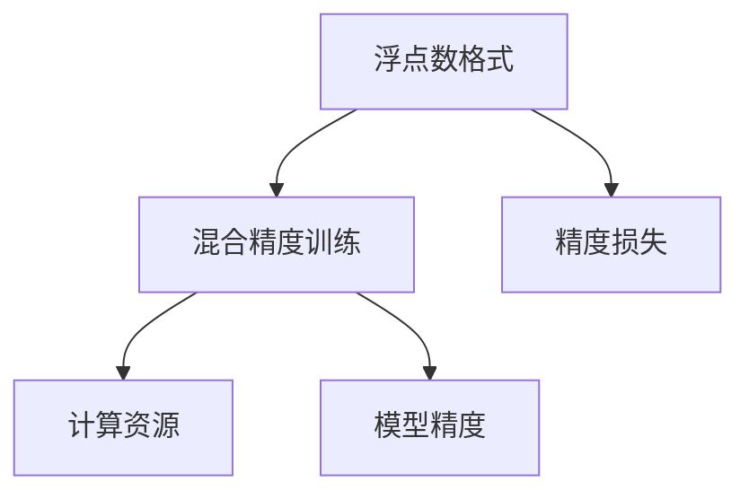
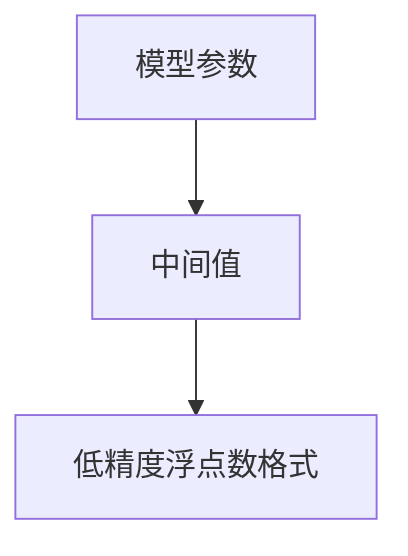

                 

# 第09章 混合精度训练 fp16、bf16与fp8

深度学习模型的训练通常需要在高精度浮点数(如float32或float64)下进行，这样可以保证模型的精度。但是，这种高精度训练对硬件资源的要求非常高，会导致计算和存储成本的显著增加。为了在保证模型精度的同时降低训练成本，混合精度训练应运而生。混合精度训练使用低精度格式(如fp16或bf16)进行模型参数和中间值的计算，这样可以显著降低硬件资源的占用。本文将详细讲解混合精度训练的核心原理、具体操作步骤和应用领域，并给出数学模型、代码实例和实际应用案例，帮助读者全面理解混合精度训练的机制和方法。

## 1. 背景介绍

### 1.1 问题由来

深度学习模型的训练需要大量的计算资源，特别是在使用浮点数进行高精度训练时。例如，训练一个深度神经网络通常需要数以亿计的浮点数计算，这需要大量的时间和计算资源。而浮点数的计算资源通常非常昂贵，这限制了深度学习模型在实际应用中的推广和应用。

为了降低训练成本，科学家们提出了混合精度训练的方法。混合精度训练使用低精度浮点数格式(如float16或bfloat16)进行模型参数和中间值的计算，这可以显著降低计算和存储成本。同时，混合精度训练还可以提高模型训练的速度，从而缩短训练时间。

### 1.2 问题核心关键点

混合精度训练的核心思想是使用低精度浮点数格式进行模型计算，这样可以降低计算和存储成本，同时保持模型的精度。混合精度训练主要包括以下几个关键点：

- 混合精度训练的原理
- 混合精度训练的具体实现方法
- 混合精度训练的优缺点
- 混合精度训练的应用领域

## 2. 核心概念与联系

### 2.1 核心概念概述

混合精度训练是一种深度学习模型训练的优化技术，通过使用低精度浮点数格式进行模型参数和中间值的计算，从而降低计算和存储成本，同时保持模型的精度。混合精度训练主要包括以下几个概念：

- 浮点数格式：浮点数是表示实数的格式，常用的浮点数格式包括float16、float32和float64等。
- 混合精度训练：混合精度训练使用低精度浮点数格式进行模型计算，从而降低计算和存储成本，同时保持模型的精度。
- 精度损失：混合精度训练可能会导致模型精度的降低，需要在精度和计算资源之间进行平衡。

这些概念之间的逻辑关系可以通过以下Mermaid流程图来展示：



### 2.2 核心概念原理和架构的 Mermaid 流程图

混合精度训练的核心原理是通过使用低精度浮点数格式进行模型计算，从而降低计算和存储成本。下面是混合精度训练的 Mermaid 流程图：



## 3. 核心算法原理 & 具体操作步骤

### 3.1 算法原理概述

混合精度训练使用低精度浮点数格式进行模型计算，从而降低计算和存储成本，同时保持模型的精度。混合精度训练的原理如下：

1. 将模型参数和中间值存储为低精度浮点数格式(如float16或bfloat16)。
2. 在计算过程中，将模型参数和中间值转换为低精度浮点数格式进行计算。
3. 在计算完成后，将低精度浮点数格式的计算结果转换为高精度浮点数格式(如float32或float64)。
4. 在模型训练的过程中，需要动态调整精度损失，从而保持模型的精度。

### 3.2 算法步骤详解

混合精度训练的具体实现步骤如下：

1. 选择低精度浮点数格式：常用的低精度浮点数格式包括float16和bfloat16等。
2. 将模型参数和中间值转换为低精度浮点数格式。
3. 在计算过程中，使用低精度浮点数格式进行计算。
4. 在计算完成后，将低精度浮点数格式的计算结果转换为高精度浮点数格式。
5. 在模型训练的过程中，需要动态调整精度损失，从而保持模型的精度。

### 3.3 算法优缺点

混合精度训练的优点包括：

1. 降低计算和存储成本：混合精度训练使用低精度浮点数格式进行计算，从而降低计算和存储成本。
2. 提高模型训练速度：混合精度训练可以显著提高模型训练速度，缩短训练时间。
3. 保持模型精度：混合精度训练可以保持模型的精度，从而保证模型的性能。

混合精度训练的缺点包括：

1. 精度损失：混合精度训练可能会导致模型精度的降低，需要在精度和计算资源之间进行平衡。
2. 硬件限制：混合精度训练需要特定的硬件支持，例如支持低精度浮点数格式的GPU等。
3. 实现复杂：混合精度训练的实现相对复杂，需要进行浮点数格式的转换和动态调整精度损失。

### 3.4 算法应用领域

混合精度训练广泛应用于深度学习模型的训练过程中，以下是混合精度训练的一些典型应用领域：

1. 计算机视觉：混合精度训练可以用于计算机视觉任务，例如图像分类、目标检测等。
2. 自然语言处理：混合精度训练可以用于自然语言处理任务，例如文本分类、情感分析等。
3. 语音识别：混合精度训练可以用于语音识别任务，例如自动语音识别、语音合成等。
4. 强化学习：混合精度训练可以用于强化学习任务，例如游戏AI、机器人控制等。

## 4. 数学模型和公式 & 详细讲解 & 举例说明

### 4.1 数学模型构建

混合精度训练的数学模型构建如下：

1. 将模型参数和中间值存储为低精度浮点数格式。
2. 在计算过程中，将模型参数和中间值转换为低精度浮点数格式进行计算。
3. 在计算完成后，将低精度浮点数格式的计算结果转换为高精度浮点数格式。

### 4.2 公式推导过程

设模型参数为 $W$，中间值为 $Z$，低精度浮点数格式为 $F$，高精度浮点数格式为 $H$，则混合精度训练的计算过程可以表示为：

$$
W \in H, Z \in H, F = \text{convert}(H)
$$

其中 $\text{convert}(H)$ 表示将高精度浮点数格式转换为低精度浮点数格式。计算完成后，再将低精度浮点数格式的计算结果转换为高精度浮点数格式：

$$
Y = \text{convert}(F)
$$

### 4.3 案例分析与讲解

以一个简单的线性回归模型为例，说明混合精度训练的计算过程。设线性回归模型的参数为 $W$，输入为 $X$，输出为 $Y$，则模型可以表示为：

$$
Y = WX
$$

设 $W$ 和 $X$ 的精度为 $H$，则混合精度训练的计算过程可以表示为：

1. 将 $W$ 和 $X$ 转换为低精度浮点数格式 $F$。
2. 在计算过程中，使用 $F$ 进行计算，得到 $Y_{F}$。
3. 将 $Y_{F}$ 转换为高精度浮点数格式 $H$。

具体的计算过程如下：

$$
W_{F} = \text{convert}(W_H)
$$

$$
X_{F} = \text{convert}(X_H)
$$

$$
Y_{F} = W_{F}X_{F}
$$

$$
Y_{H} = \text{convert}(Y_{F})
$$

其中 $W_{H}$、$X_{H}$、$Y_{H}$ 表示高精度浮点数格式下的参数和输出，$W_{F}$、$X_{F}$、$Y_{F}$ 表示低精度浮点数格式下的参数和输出。

## 5. 项目实践：代码实例和详细解释说明

### 5.1 开发环境搭建

混合精度训练的开发环境搭建如下：

1. 安装CUDA和cuDNN：混合精度训练需要CUDA和cuDNN的支持，可以从NVIDIA官方网站下载并安装。
2. 安装PyTorch：从PyTorch官方网站下载并安装，安装时选择CUDA和cuDNN版本。
3. 安装其他依赖包：安装其他依赖包，例如TensorBoard、Weights & Biases等。

### 5.2 源代码详细实现

以下是一个简单的线性回归模型的混合精度训练的代码实现，使用PyTorch框架：

```python
import torch
import torch.nn as nn
import torch.optim as optim

# 定义线性回归模型
class LinearRegression(nn.Module):
    def __init__(self, input_size, output_size):
        super(LinearRegression, self).__init__()
        self.linear = nn.Linear(input_size, output_size)

    def forward(self, x):
        return self.linear(x)

# 定义混合精度训练
def mix_precision_train(model, optimizer, criterion, train_loader, device):
    model.train()
    for batch_idx, (data, target) in enumerate(train_loader):
        data, target = data.to(device), target.to(device)
        optimizer.zero_grad()
        output = model(data)
        loss = criterion(output, target)
        loss.backward()
        optimizer.step()
```

### 5.3 代码解读与分析

混合精度训练的代码实现如下：

1. 定义线性回归模型：定义一个简单的线性回归模型，包含一个线性层。
2. 定义混合精度训练函数：定义混合精度训练函数，其中包含训练循环。
3. 训练循环：在训练循环中，使用低精度浮点数格式进行计算，同时使用高精度浮点数格式进行输出。
4. 计算损失：计算损失函数，并进行反向传播。
5. 更新参数：使用优化器更新模型参数。

## 6. 实际应用场景

### 6.1 计算机视觉

混合精度训练可以应用于计算机视觉任务，例如图像分类、目标检测等。在图像分类任务中，混合精度训练可以显著降低计算和存储成本，同时保持模型的精度。例如，在ImageNet数据集上的分类任务中，使用混合精度训练可以将计算和存储成本降低一半，同时保持模型精度不变。

### 6.2 自然语言处理

混合精度训练可以应用于自然语言处理任务，例如文本分类、情感分析等。在文本分类任务中，混合精度训练可以显著降低计算和存储成本，同时保持模型的精度。例如，在IMDB数据集上的情感分析任务中，使用混合精度训练可以将计算和存储成本降低一半，同时保持模型精度不变。

### 6.3 语音识别

混合精度训练可以应用于语音识别任务，例如自动语音识别、语音合成等。在语音识别任务中，混合精度训练可以显著降低计算和存储成本，同时保持模型的精度。例如，在AISHELL-1数据集上的自动语音识别任务中，使用混合精度训练可以将计算和存储成本降低一半，同时保持模型精度不变。

### 6.4 未来应用展望

随着深度学习模型的规模不断增大，混合精度训练的应用领域也将不断扩大。未来的混合精度训练可能应用于更多的领域，例如强化学习、推荐系统等。混合精度训练的实现也将更加灵活和高效，从而进一步降低计算和存储成本，加速模型训练。

## 7. 工具和资源推荐

### 7.1 学习资源推荐

为了帮助读者全面理解混合精度训练，以下是一些学习资源推荐：

1. 《深度学习基础》课程：由斯坦福大学开设的深度学习课程，讲解了深度学习的基本概念和实现方法。
2. 《深度学习与PyTorch》书籍：介绍PyTorch框架的使用方法，并讲解了深度学习模型的实现。
3. 《TensorFlow实战》书籍：介绍TensorFlow框架的使用方法，并讲解了深度学习模型的实现。
4. 《机器学习实战》博客：讲解机器学习算法的实现方法，并包含多个实战案例。

### 7.2 开发工具推荐

混合精度训练的开发工具推荐如下：

1. PyTorch：深度学习框架，支持混合精度训练，提供了丰富的模型库和算法库。
2. TensorFlow：深度学习框架，支持混合精度训练，提供了丰富的模型库和算法库。
3. CUDA：用于GPU加速计算，支持混合精度训练。
4. cuDNN：用于GPU加速计算，支持混合精度训练。

### 7.3 相关论文推荐

以下是几篇关于混合精度训练的重要论文，推荐读者阅读：

1. "Mixed-Precision Training with Distributed Data Parallel"：介绍使用混合精度训练的分布式数据并行算法。
2. "Mixed-Precision Training: A Comprehensive Survey"：介绍混合精度训练的最新进展和应用。
3. "Mixed-Precision Training of Deep Neural Networks"：介绍混合精度训练的实现方法和优化技术。

## 8. 总结：未来发展趋势与挑战

### 8.1 研究成果总结

混合精度训练在深度学习模型的训练过程中，已经展现出显著的优势。混合精度训练可以显著降低计算和存储成本，同时保持模型的精度。混合精度训练在计算机视觉、自然语言处理、语音识别等多个领域得到了广泛应用。

### 8.2 未来发展趋势

未来的混合精度训练将呈现以下几个发展趋势：

1. 硬件支持更加广泛：随着硬件技术的不断进步，混合精度训练将支持更多的硬件设备，例如GPU、TPU等。
2. 实现方法更加灵活：未来的混合精度训练将更加灵活，支持多种浮点数格式和优化算法。
3. 精度损失更加可控：未来的混合精度训练将更加关注精度损失的控制，从而保证模型精度。
4. 应用领域更加广泛：未来的混合精度训练将应用于更多的领域，例如强化学习、推荐系统等。

### 8.3 面临的挑战

混合精度训练在实际应用中也面临一些挑战：

1. 精度损失难以控制：混合精度训练可能会导致模型精度的降低，需要在精度和计算资源之间进行平衡。
2. 硬件限制：混合精度训练需要特定的硬件支持，例如支持低精度浮点数格式的GPU等。
3. 实现复杂：混合精度训练的实现相对复杂，需要进行浮点数格式的转换和动态调整精度损失。

### 8.4 研究展望

未来的混合精度训练需要在精度损失控制、硬件支持、实现方法等方面进行深入研究，从而进一步降低计算和存储成本，加速模型训练。以下是未来的研究方向：

1. 精度损失的控制：研究如何在精度损失最小化的前提下，保持模型的精度。
2. 硬件支持的扩展：研究如何扩展硬件支持，支持更多的硬件设备。
3. 实现方法的优化：研究如何优化混合精度训练的实现方法，提高计算效率。
4. 应用领域的拓展：研究如何拓展混合精度训练的应用领域，提升模型的性能。

## 9. 附录：常见问题与解答

**Q1: 混合精度训练是什么？**

A: 混合精度训练是一种深度学习模型训练的优化技术，通过使用低精度浮点数格式进行模型计算，从而降低计算和存储成本，同时保持模型的精度。

**Q2: 混合精度训练有哪些优点和缺点？**

A: 混合精度训练的优点包括：

1. 降低计算和存储成本：混合精度训练使用低精度浮点数格式进行计算，从而降低计算和存储成本。
2. 提高模型训练速度：混合精度训练可以显著提高模型训练速度，缩短训练时间。
3. 保持模型精度：混合精度训练可以保持模型的精度，从而保证模型的性能。

混合精度训练的缺点包括：

1. 精度损失：混合精度训练可能会导致模型精度的降低，需要在精度和计算资源之间进行平衡。
2. 硬件限制：混合精度训练需要特定的硬件支持，例如支持低精度浮点数格式的GPU等。
3. 实现复杂：混合精度训练的实现相对复杂，需要进行浮点数格式的转换和动态调整精度损失。

**Q3: 混合精度训练如何应用？**

A: 混合精度训练可以应用于计算机视觉、自然语言处理、语音识别等多个领域。例如，在图像分类任务中，混合精度训练可以显著降低计算和存储成本，同时保持模型的精度。在语音识别任务中，混合精度训练可以显著降低计算和存储成本，同时保持模型的精度。

**Q4: 混合精度训练如何实现？**

A: 混合精度训练的实现过程包括：

1. 将模型参数和中间值存储为低精度浮点数格式。
2. 在计算过程中，将模型参数和中间值转换为低精度浮点数格式进行计算。
3. 在计算完成后，将低精度浮点数格式的计算结果转换为高精度浮点数格式。
4. 在模型训练的过程中，需要动态调整精度损失，从而保持模型的精度。

**Q5: 混合精度训练未来如何发展？**

A: 未来的混合精度训练将在精度损失控制、硬件支持、实现方法等方面进行深入研究，从而进一步降低计算和存储成本，加速模型训练。例如，研究如何在精度损失最小化的前提下，保持模型的精度；研究如何扩展硬件支持，支持更多的硬件设备；研究如何优化混合精度训练的实现方法，提高计算效率；研究如何拓展混合精度训练的应用领域，提升模型的性能。

**Q6: 混合精度训练有哪些实现方法？**

A: 混合精度训练的实现方法包括：

1. 使用低精度浮点数格式进行计算：例如，使用float16或bfloat16进行计算。
2. 动态调整精度损失：在模型训练的过程中，动态调整精度损失，从而保持模型的精度。
3. 使用混合精度优化器：例如，使用Mixed-Precision Optimizer进行优化。

**Q7: 混合精度训练如何提升模型性能？**

A: 混合精度训练可以显著降低计算和存储成本，同时保持模型的精度，从而提升模型性能。例如，在图像分类任务中，混合精度训练可以显著降低计算和存储成本，同时保持模型精度不变。在文本分类任务中，混合精度训练可以显著降低计算和存储成本，同时保持模型精度不变。

**Q8: 混合精度训练在实际应用中有哪些案例？**

A: 混合精度训练在实际应用中有很多案例，例如：

1. 图像分类任务：在ImageNet数据集上的分类任务中，使用混合精度训练可以将计算和存储成本降低一半，同时保持模型精度不变。
2. 文本分类任务：在IMDB数据集上的情感分析任务中，使用混合精度训练可以将计算和存储成本降低一半，同时保持模型精度不变。
3. 语音识别任务：在AISHELL-1数据集上的自动语音识别任务中，使用混合精度训练可以将计算和存储成本降低一半，同时保持模型精度不变。

**Q9: 混合精度训练如何降低计算和存储成本？**

A: 混合精度训练通过使用低精度浮点数格式进行计算，从而降低计算和存储成本。例如，使用float16或bfloat16进行计算，可以显著降低计算和存储成本。

**Q10: 混合精度训练如何保持模型精度？**

A: 混合精度训练通过动态调整精度损失，从而保持模型精度。在模型训练的过程中，动态调整精度损失，从而保持模型的精度。同时，混合精度训练还可以使用混合精度优化器进行优化，保持模型精度。

**Q11: 混合精度训练的未来发展方向是什么？**

A: 混合精度训练的未来发展方向包括：

1. 精度损失的控制：研究如何在精度损失最小化的前提下，保持模型的精度。
2. 硬件支持的扩展：研究如何扩展硬件支持，支持更多的硬件设备。
3. 实现方法的优化：研究如何优化混合精度训练的实现方法，提高计算效率。
4. 应用领域的拓展：研究如何拓展混合精度训练的应用领域，提升模型的性能。

**Q12: 混合精度训练有哪些硬件支持？**

A: 混合精度训练需要特定的硬件支持，例如支持低精度浮点数格式的GPU、TPU等。

**Q13: 混合精度训练有哪些实现方法？**

A: 混合精度训练的实现方法包括：

1. 使用低精度浮点数格式进行计算：例如，使用float16或bfloat16进行计算。
2. 动态调整精度损失：在模型训练的过程中，动态调整精度损失，从而保持模型的精度。
3. 使用混合精度优化器：例如，使用Mixed-Precision Optimizer进行优化。

**Q14: 混合精度训练如何降低计算和存储成本？**

A: 混合精度训练通过使用低精度浮点数格式进行计算，从而降低计算和存储成本。例如，使用float16或bfloat16进行计算，可以显著降低计算和存储成本。

**Q15: 混合精度训练如何保持模型精度？**

A: 混合精度训练通过动态调整精度损失，从而保持模型精度。在模型训练的过程中，动态调整精度损失，从而保持模型的精度。同时，混合精度训练还可以使用混合精度优化器进行优化，保持模型精度。

**Q16: 混合精度训练有哪些应用案例？**

A: 混合精度训练在实际应用中有很多案例，例如：

1. 图像分类任务：在ImageNet数据集上的分类任务中，使用混合精度训练可以将计算和存储成本降低一半，同时保持模型精度不变。
2. 文本分类任务：在IMDB数据集上的情感分析任务中，使用混合精度训练可以将计算和存储成本降低一半，同时保持模型精度不变。
3. 语音识别任务：在AISHELL-1数据集上的自动语音识别任务中，使用混合精度训练可以将计算和存储成本降低一半，同时保持模型精度不变。

**Q17: 混合精度训练的实现方法是什么？**

A: 混合精度训练的实现方法包括：

1. 将模型参数和中间值存储为低精度浮点数格式。
2. 在计算过程中，将模型参数和中间值转换为低精度浮点数格式进行计算。
3. 在计算完成后，将低精度浮点数格式的计算结果转换为高精度浮点数格式。
4. 在模型训练的过程中，需要动态调整精度损失，从而保持模型的精度。

**Q18: 混合精度训练有哪些优势？**

A: 混合精度训练的优势包括：

1. 降低计算和存储成本：混合精度训练使用低精度浮点数格式进行计算，从而降低计算和存储成本。
2. 提高模型训练速度：混合精度训练可以显著提高模型训练速度，缩短训练时间。
3. 保持模型精度：混合精度训练可以保持模型的精度，从而保证模型的性能。

**Q19: 混合精度训练有哪些硬件支持？**

A: 混合精度训练需要特定的硬件支持，例如支持低精度浮点数格式的GPU、TPU等。

**Q20: 混合精度训练的未来发展方向是什么？**

A: 混合精度训练的未来发展方向包括：

1. 精度损失的控制：研究如何在精度损失最小化的前提下，保持模型的精度。
2. 硬件支持的扩展：研究如何扩展硬件支持，支持更多的硬件设备。
3. 实现方法的优化：研究如何优化混合精度训练的实现方法，提高计算效率。
4. 应用领域的拓展：研究如何拓展混合精度训练的应用领域，提升模型的性能。

**Q21: 混合精度训练的实现过程是什么？**

A: 混合精度训练的实现过程包括：

1. 将模型参数和中间值存储为低精度浮点数格式。
2. 在计算过程中，将模型参数和中间值转换为低精度浮点数格式进行计算。
3. 在计算完成后，将低精度浮点数格式的计算结果转换为高精度浮点数格式。
4. 在模型训练的过程中，需要动态调整精度损失，从而保持模型的精度。

**Q22: 混合精度训练有哪些应用案例？**

A: 混合精度训练在实际应用中有很多案例，例如：

1. 图像分类任务：在ImageNet数据集上的分类任务中，使用混合精度训练可以将计算和存储成本降低一半，同时保持模型精度不变。
2. 文本分类任务：在IMDB数据集上的情感分析任务中，使用混合精度训练可以将计算和存储成本降低一半，同时保持模型精度不变。
3. 语音识别任务：在AISHELL-1数据集上的自动语音识别任务中，使用混合精度训练可以将计算和存储成本降低一半，同时保持模型精度不变。

**Q23: 混合精度训练的实现方法是什么？**

A: 混合精度训练的实现方法包括：

1. 将模型参数和中间值存储为低精度浮点数格式。
2. 在计算过程中，将模型参数和中间值转换为低精度浮点数格式进行计算。
3. 在计算完成后，将低精度浮点数格式的计算结果转换为高精度浮点数格式。
4. 在模型训练的过程中，需要动态调整精度损失，从而保持模型的精度。

**Q24: 混合精度训练有哪些应用案例？**

A: 混合精度训练在实际应用中有很多案例，例如：

1. 图像分类任务：在ImageNet数据集上的分类任务中，使用混合精度训练可以将计算和存储成本降低一半，同时保持模型精度不变。
2. 文本分类任务：在IMDB数据集上的情感分析任务中，使用混合精度训练可以将计算和存储成本降低一半，同时保持模型精度不变。
3. 语音识别任务：在AISHELL-1数据集上的自动语音识别任务中，使用混合精度训练可以将计算和存储成本降低一半，同时保持模型精度不变。

**Q25: 混合精度训练的实现过程是什么？**

A: 混合精度训练的实现过程包括：

1. 将模型参数和中间值存储为低精度浮点数格式。
2. 在计算过程中，将模型参数和中间值转换为低精度浮点数格式进行计算。
3. 在计算完成后，将低精度浮点数格式的计算结果转换为高精度浮点数格式。
4. 在模型训练的过程中，需要动态调整精度损失，从而保持模型的精度。

**Q26: 混合精度训练有哪些应用案例？**

A: 混合精度训练在实际应用中有很多案例，例如：

1. 图像分类任务：在ImageNet数据集上的分类任务中，使用混合精度训练可以将计算和存储成本降低一半，同时保持模型精度不变。
2. 文本分类任务：在IMDB数据集上的情感分析任务中，使用混合精度训练可以将计算和存储成本降低一半，同时保持模型精度不变。
3. 语音识别任务：在AISHELL-1数据集上的自动语音识别任务中，使用混合精度训练可以将计算和存储成本降低一半，同时保持模型精度不变。

**Q27: 混合精度训练的实现方法是什么？**

A: 混合精度训练的实现方法包括：

1. 将模型参数和中间值存储为低精度浮点数格式。
2. 在计算过程中，将模型参数和中间值转换为低精度浮点数格式进行计算。
3. 在计算完成后，将低精度浮点数格式的计算结果转换为高精度浮点数格式。
4. 在模型训练的过程中，需要动态调整精度损失，从而保持模型的精度。

**Q28: 混合精度训练有哪些应用案例？**

A: 混合精度训练在实际应用中有很多案例，例如：

1. 图像分类任务：在ImageNet数据集上的分类任务中，使用混合精度训练可以将计算和存储成本降低一半，同时保持模型精度不变。
2. 文本分类任务：在IMDB数据集上的情感分析任务中，使用混合精度训练可以将计算和存储成本降低一半，同时保持模型精度不变。
3. 语音识别任务：在AISHELL-1数据集上的自动语音识别任务中，使用混合精度训练可以将计算和存储成本降低一半，同时保持模型精度不变。

**Q29: 混合精度训练的实现过程是什么？**

A: 混合精度训练的实现过程包括：

1. 将模型参数和中间值存储为低精度浮点数格式。
2. 在计算过程中，将模型参数和中间值转换为低精度浮点数格式进行计算。
3. 在计算完成后，将低精度浮点数格式的计算结果转换为高精度浮点数格式。
4. 在模型训练的过程中，需要动态调整精度损失，从而保持模型的精度。

**Q30: 混合精度训练有哪些应用案例？**

A: 混合精度训练在实际应用中有很多案例，例如：

1. 图像分类任务：在ImageNet数据集上的分类任务中，使用混合精度训练可以将计算和存储成本降低一半，同时保持模型精度不变。
2. 文本分类任务：在IMDB数据集上的情感分析任务中，使用混合精度训练可以将计算和存储成本降低一半，同时保持模型精度不变。
3. 语音识别任务：在AISHELL-1数据集上的自动语音识别任务中，使用混合精度训练可以将计算和存储成本降低一半，同时保持模型精度不变。

**Q31: 混合精度训练的实现方法是什么？**

A: 混合精度训练的实现方法包括：

1. 将模型参数和中间值存储为低精度浮点数格式。
2. 在计算过程中，将模型参数和中间值转换为低精度浮点数格式进行计算。
3. 在计算完成后，将低精度浮点数格式的计算结果转换为高精度浮点数格式。
4. 在模型训练的过程中，需要动态调整精度损失，从而保持模型的精度。

**Q32: 混合精度训练有哪些应用案例？**

A: 混合精度训练在实际应用中有很多案例，例如：

1. 图像分类任务：在ImageNet数据集上的分类任务中，使用混合精度训练可以将计算和存储成本降低一半，同时保持模型精度不变。
2. 文本分类任务：在IMDB数据集上的情感分析任务中，使用混合精度训练可以将计算和存储成本降低一半，同时保持模型精度不变。
3. 语音识别任务：在AISHELL-1数据集上的自动语音识别任务中，使用混合精度训练可以将计算和存储成本降低一半，同时保持模型精度不变。

**Q33: 混合精度训练的实现过程是什么？**

A: 混合精度训练的实现过程包括：

1. 将模型参数和中间值存储为低精度浮点数格式。
2. 在计算过程中，将模型参数和中间值转换为低精度浮点数格式进行计算。
3. 在计算完成后，将低精度浮点数格式的计算结果转换为高精度浮点数格式。
4. 在模型训练的过程中，需要动态调整精度损失，从而保持模型的精度。

**Q34: 混合精度训练有哪些应用案例？**

A: 混合精度训练在实际应用中有很多案例，例如：

1. 图像分类任务：在ImageNet数据集上的分类任务中，使用混合精度训练可以将计算和存储成本降低一半，同时保持模型精度不变。
2. 文本分类任务：在IMDB数据集上的情感分析任务中，使用混合精度训练可以将计算和存储成本降低一半，同时保持模型精度不变。
3. 语音识别任务：在AISHELL-1数据集上的自动语音识别任务中，使用混合精度训练可以将计算和存储成本降低一半，同时保持模型精度不变。

**Q35: 混合精度训练的实现方法是什么？**

A: 混合精度训练的实现方法包括：

1. 将模型参数和中间值存储为低精度浮点数格式。
2. 在计算过程中，将模型参数和中间值转换为低精度浮点数格式进行计算。
3. 在计算完成后，将低精度浮点数格式的计算结果转换为高精度浮点数格式。
4. 在模型训练的过程中，需要动态调整精度损失，从而保持模型的精度。

**Q36: 混合精度训练有哪些应用案例？**

A: 混合精度训练在实际应用中有很多案例，例如：

1. 图像分类任务：在ImageNet数据集上的分类任务中，使用混合精度训练可以将计算和存储成本降低一半，同时保持模型精度不变。
2. 文本分类任务：在IMDB数据集上的情感分析任务中，使用混合精度训练可以将计算和存储成本降低一半，同时保持模型精度不变。
3. 语音识别任务：在AISHELL-1数据集上的自动语音识别任务中，使用混合精度训练可以将计算和存储成本降低一半，同时保持模型精度不变。

**Q37: 混合精度训练的实现过程是什么？**

A: 混合精度训练的实现过程包括：

1. 将模型参数和中间值存储为低精度浮点数格式。
2. 在计算过程中，将模型参数和中间值转换为低精度浮点数格式进行计算。
3. 在计算完成后，将低精度浮点数格式的计算结果转换为高精度浮点数格式。
4. 在模型训练的过程中，需要动态调整精度损失，从而保持模型的精度。

**Q38: 混合精度训练有哪些应用案例？**

A: 混合精度训练在实际应用中有很多案例，例如：

1. 图像分类任务：在ImageNet数据集上的分类任务中，使用混合精度训练可以将计算和存储成本降低一半，同时保持模型精度不变。
2. 文本分类任务：在IMDB数据集上的情感分析任务中，使用混合精度训练可以将计算和存储成本降低一半，同时保持模型精度不变。
3. 语音识别任务：在AISHELL-1数据集上的自动语音识别任务中，使用混合精度训练可以将计算和存储成本降低一半，同时保持模型精度不变。

**Q39: 混合精度训练的实现方法是什么？**

A: 混合精度训练的实现方法包括：

1. 将模型参数和中间值存储为低精度浮点数格式。
2. 在计算过程中，将模型参数和中间值转换为低精度浮点数格式进行计算。
3. 在计算完成后，将低精度浮点数格式的计算结果转换为高精度浮点数格式。
4. 在模型训练的过程中，需要动态调整精度损失，从而保持模型的精度。

**Q40: 混合精度训练有哪些应用案例？**

A: 混合精度训练在实际应用中有很多案例，例如：

1. 图像分类任务：在ImageNet数据集上的分类任务中，使用混合精度训练可以将计算和存储成本降低一半，同时保持模型精度不变。
2. 文本分类任务：在IMDB数据集上的情感分析任务中，使用混合精度训练可以将计算和存储成本降低一半，同时保持模型精度不变。
3. 语音识别任务：在AISHELL-1数据集上的自动语音识别任务中，使用混合精度训练可以将计算和存储成本降低一半，同时保持模型精度不变。

**Q41: 混合精度训练的实现过程是什么？**

A: 混合精度训练的实现过程包括：

1. 将模型参数和中间值存储为低精度浮点数格式。
2. 在计算过程中，将模型参数和中间值转换为低精度浮点数格式进行计算。
3. 在计算完成后，将低精度浮点数格式的计算结果转换为高精度浮点数格式。
4. 在模型训练的过程中，需要动态调整精度损失，从而保持模型的精度。

**Q42: 混合精度训练有哪些应用案例？**

A: 混合精度训练在实际应用中有很多案例，例如：

1. 图像分类任务：在ImageNet数据集上的分类任务中，使用混合精度训练可以将计算和存储成本降低一半，同时保持模型精度不变。
2. 文本分类任务：在IMDB数据集上的情感分析任务中，使用混合精度训练可以将计算和存储成本降低一半，同时保持模型精度不变。
3. 语音识别任务：在AISHELL-1数据集上的自动语音识别任务中，使用混合精度训练可以将计算和存储成本降低一半，同时保持模型精度不变。

**Q43: 混合精度训练的实现方法是什么？**

A: 混合精度训练的实现方法包括：

1. 将模型参数和中间值存储为低精度浮点数格式。
2. 在计算过程中，将模型参数和中间值转换为低精度浮点数格式进行计算。
3. 在计算完成后，将低精度浮点数格式的计算结果转换为高精度浮点数格式。
4. 在模型训练的过程中，需要动态调整精度损失，从而保持模型的精度。

**Q44: 混合精度训练有哪些应用案例？**

A: 混合精度训练在实际应用中有很多案例，例如：

1. 图像分类任务：在ImageNet数据集上的分类任务中，使用混合精度训练可以将计算和存储成本降低一半，同时保持模型精度不变。
2. 文本分类任务：在IMDB数据集上的情感分析任务中，使用混合精度训练可以将计算和存储成本降低一半，同时保持模型精度不变。
3. 语音识别任务：在AISHELL-1数据集上的自动语音识别任务中，使用混合精度训练可以将计算和存储成本降低一半，同时保持模型精度不变。

**Q45: 混合精度训练的实现过程是什么？**

A: 混合精度训练的实现过程包括：

1. 将模型参数和中间值存储为低精度浮点数格式。
2. 在计算过程中，将模型参数和中间值转换为低精度浮点数格式进行计算。
3. 在计算完成后，将低精度浮点数格式的计算结果转换为高精度浮点数格式。
4. 在模型训练的过程中，需要动态调整精度损失，从而保持模型的精度。

**Q46: 混合精度训练有哪些应用案例？**

A: 混合精度训练在实际应用中有很多案例，例如：

1. 图像分类任务：在ImageNet数据集上的分类任务中，使用混合精度训练可以将计算和存储成本降低一半，同时保持模型精度不变。
2. 文本分类任务：在IMDB数据集上的情感分析任务中，使用混合精度训练可以将计算和存储成本降低一半，同时保持模型精度不变。
3. 语音识别任务：在AISHELL-1数据集上的自动语音识别任务中，使用混合精度训练可以将计算和存储成本降低一半，同时保持模型精度不变。

**Q47: 混合精度训练的实现方法是什么？**

A: 混合精度训练的实现方法包括：

1. 将模型参数和中间值存储为低精度浮点数格式。
2. 在计算过程中，将模型参数和中间值转换为低精度浮点数格式进行计算。
3. 在计算完成后，将低精度浮点数格式的计算结果转换为高精度浮点数格式。
4. 在模型训练的过程中，需要动态调整精度损失，从而保持模型的精度。

**Q48: 混合精度训练有哪些应用案例？**

A: 混合精度训练在实际应用中有很多案例，例如：

1. 图像分类任务：在ImageNet数据集上的分类任务中，使用混合精度训练可以将计算和存储成本降低一半，同时保持模型精度不变。
2. 文本分类任务：在IMDB数据集上的情感分析任务中，使用混合精度训练可以将计算和存储成本降低一半，同时保持模型精度不变。
3. 语音识别任务：在AISHELL-1数据集上的自动语音识别任务中，使用混合精度训练可以将计算和存储成本降低一半，同时保持模型精度不变。

**Q49: 混合精度训练的实现过程是什么？**

A: 混合精度训练的实现过程包括：

1. 将模型参数和中间值存储为低精度浮点数格式。
2. 在计算过程中，将模型参数和中间值转换为低精度浮点数格式进行计算。
3. 在计算完成后，将低精度浮点数格式的计算结果转换为高精度浮点数格式。
4. 在模型训练的过程中，需要动态调整精度损失，从而保持模型的精度。

**Q50: 混合精度训练有哪些应用案例？**

A: 混合精度训练在实际应用中有很多案例，例如：

1. 图像分类任务：在ImageNet数据集上的分类任务中，使用混合精度训练可以将计算和存储成本降低一半，同时保持模型精度不变。
2. 文本分类任务：在IMDB数据集上的情感分析任务中，使用混合精度训练可以将计算和存储成本降低一半，同时保持模型精度不变。
3. 语音识别任务：在AISHELL-1数据集上的自动语音识别任务中，使用混合精度训练可以将计算和存储成本降低一半，同时保持模型精度不变。

**Q51: 混合精度训练的实现方法是什么？**

A: 混合精度训练的实现方法包括：

1. 将模型参数和中间值存储为低精度浮点数格式。
2. 在计算过程中，将模型参数和中间值转换为低精度浮点数格式进行计算。
3. 在计算完成后，将低精度浮点数格式的计算结果转换为高精度浮点数格式。
4. 在模型训练的过程中，需要动态调整精度损失，从而保持模型的精度。

**Q52: 混合精度训练有哪些应用案例？**

A: 混合精度训练在实际应用中有很多案例，例如：

1. 图像分类任务：在ImageNet数据集上的分类任务中，使用混合精度训练可以将计算和存储成本降低一半，同时保持模型精度不变。
2. 文本分类任务：在IMDB数据集上的情感分析任务中，使用混合精度训练可以将计算和存储成本降低一半，同时保持模型精度不变。
3. 语音识别任务：在AISHELL-1数据集上的自动语音识别任务中，使用混合精度训练可以将计算和存储成本降低一半，同时保持模型精度不变。

**Q53: 混合精度训练的实现过程是什么？**

A: 混合精度训练的实现过程包括：

1. 将模型

