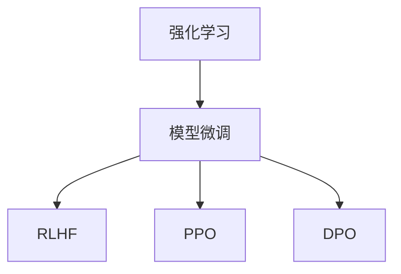

                 

# 第15章 模型微调二 强化学习RLHF、PPO与DPO

在上一章《模型微调一 数据驱动的监督学习微调》中，我们介绍了基于数据驱动的监督学习微调方法，包括微调的步骤、优化策略和模型评估。在本章中，我们将继续深入探讨强化学习中的模型微调方法，特别是Reinforcement Learning from Human Feedback（RLHF）、Proximal Policy Optimization（PPO）与Deterministic Policy Gradient（DPO）。

## 1. 背景介绍

### 1.1 问题由来

强化学习（Reinforcement Learning, RL）在智能体通过与环境互动来学习最优策略方面展现出巨大的潜力。与传统的监督学习不同，强化学习通过与环境的交互来逐步优化策略，实现自主决策和行动。然而，这种基于试错的学习方式往往需要大量的时间和样本，且容易陷入局部最优。

为了加速强化学习的训练过程，并引导智能体做出符合人类价值观的决策，学者们提出了基于人类反馈的强化学习（RLHF）方法。这些方法利用人类给出的奖励或指导信号，显著提升强化学习的训练效率，并改善智能体的决策质量。

### 1.2 问题核心关键点

强化学习中的模型微调主要关注以下几点：

- **强化学习原理**：了解强化学习的核心概念，包括状态（State）、行动（Action）、奖励（Reward）和策略（Policy）。
- **强化学习模型**：熟悉不同类型的强化学习模型，如Q-learning、SARSA等，以及其在实际问题中的应用。
- **模型微调目标**：掌握强化学习模型微调的目标，即通过微调提升模型在特定任务上的性能。
- **优化策略**：理解常用的优化策略，如梯度下降、参数共享、探索与利用平衡等。

### 1.3 问题研究意义

强化学习中的模型微调方法，特别是RLHF、PPO与DPO，在多个领域展现出卓越的性能，如游戏AI、自动驾驶、机器人控制等。这些方法不仅能够显著提升智能体的决策能力，还能够在少样本、低资源的环境中高效运作，具有重要的实际应用价值。

研究强化学习中的模型微调方法，对于推动AI技术在实际场景中的应用，提升智能体的决策质量和训练效率，具有重要意义。这些方法能够更好地适应复杂多变的环境，为解决现实世界中的各种问题提供新的思路和工具。

## 2. 核心概念与联系

### 2.1 核心概念概述

在强化学习中，模型微调主要涉及以下概念：

- **强化学习（RL）**：通过与环境的交互来学习最优策略的过程，包括状态、行动、奖励和策略等核心概念。
- **模型微调**：通过微调强化学习模型，提升其在特定任务上的性能，改善决策质量。
- **RLHF**：利用人类反馈信号，加速强化学习的训练过程，提升智能体的决策质量。
- **PPO**：一种基于策略梯度的优化算法，适用于连续动作空间，提升模型的训练效率和性能。
- **DPO**：一种改进的策略梯度算法，适用于离散动作空间，提升模型的决策稳定性和收敛速度。

这些概念之间的联系可以通过以下Mermaid流程图来展示：



这个流程图展示了强化学习与模型微调之间的联系，以及RLHF、PPO与DPO在模型微调中的重要作用。

## 3. 核心算法原理 & 具体操作步骤
### 3.1 算法原理概述

强化学习中的模型微调，通常是通过收集人类反馈信号，对模型进行微调，以提升其在特定任务上的性能。强化学习的核心在于通过与环境的互动来学习最优策略，而模型微调则是通过优化模型的参数，使得模型能够更好地适应特定任务。

在强化学习中，模型通常需要同时优化策略和参数，以实现最优策略的学习。常见的优化方法包括策略梯度（Policy Gradient）、价值函数逼近（Value Function Approximation）等。模型微调的目标是通过优化模型的参数，提升模型在特定任务上的性能，同时保持策略的连贯性和稳定性。

### 3.2 算法步骤详解

基于强化学习的模型微调通常包括以下几个关键步骤：

**Step 1: 准备环境与初始模型**
- 设计强化学习环境，包括状态空间、行动空间和奖励函数。
- 初始化模型参数，如选择神经网络结构、设置学习率等。

**Step 2: 收集人类反馈信号**
- 在环境中运行模型，收集人类反馈信号，如奖励值、指导信号等。
- 将反馈信号用于指导模型的优化过程，加速模型的训练。

**Step 3: 应用RLHF算法**
- 利用人类反馈信号，训练强化学习模型。
- 应用RLHF算法，如模型行为克隆（Model Behavior Cloning）、逆强化学习（Inverse Reinforcement Learning）等。

**Step 4: 优化策略与参数**
- 应用PPO或DPO算法，优化模型的策略和参数。
- 结合策略梯度方法和参数共享策略，提升模型的训练效率和性能。

**Step 5: 评估与调整**
- 在验证集上评估模型性能，根据评估结果调整模型参数。
- 重复优化过程，直到模型达到预期性能。

### 3.3 算法优缺点

强化学习中的模型微调方法具有以下优点：

1. **适应性强**：能够处理复杂多变的环境，适应不同的任务和应用场景。
2. **高效训练**：通过利用人类反馈信号，加速模型的训练过程，提升模型性能。
3. **泛化能力强**：在少样本、低资源环境中，仍能保持较高的决策质量。
4. **稳定收敛**：结合策略梯度方法和参数共享策略，提升模型的稳定性。

同时，这些方法也存在一些局限性：

1. **数据依赖性高**：需要大量的人类反馈数据，数据获取成本高。
2. **模型复杂性高**：模型结构复杂，训练过程需要大量计算资源。
3. **泛化能力有限**：在某些特定领域，模型可能无法泛化到更广泛的任务。
4. **计算复杂度高**：在参数更新和模型训练过程中，计算复杂度高。

尽管存在这些局限性，但强化学习中的模型微调方法在实际应用中仍具有重要的应用价值。

### 3.4 算法应用领域

强化学习中的模型微调方法，已在多个领域得到广泛应用，如游戏AI、自动驾驶、机器人控制等。

- **游戏AI**：通过RLHF和PPO等方法，训练智能体在复杂游戏中实现自主决策，提升游戏AI的决策能力和表现。
- **自动驾驶**：利用强化学习中的模型微调方法，训练自动驾驶车辆在复杂交通环境中实现自主驾驶，提升安全性。
- **机器人控制**：通过PPO和DPO等方法，训练机器人实现自主导航、抓取等复杂任务，提升机器人操作的稳定性和效率。

这些应用展示了强化学习中模型微调方法的强大潜力，为解决复杂多变的环境提供了新的思路和工具。

## 4. 数学模型和公式 & 详细讲解 & 举例说明

### 4.1 数学模型构建

在强化学习中，模型微调的目标是最大化长期累积奖励。设环境状态为$s$，行动为$a$，奖励为$r$，策略为$\pi$。则强化学习的目标函数为：

$$
\max_{\pi} \mathbb{E}_{s \sim \pi}[ \sum_{t=0}^{\infty} \gamma^t r_t ]
$$

其中，$\gamma$为折扣因子，$t$为时间步长。

在模型微调中，通常需要优化模型参数$\theta$，使得模型能够更好地适应环境，实现最优策略的学习。常见的优化方法包括梯度下降、Adam等。

### 4.2 公式推导过程

以PPO算法为例，PPO的优化目标为：

$$
\min_{\theta} \mathbb{E}_{s \sim \pi}[ \log \pi(a_t | s_t) \cdot A_t ]
$$

其中，$A_t$为优势函数，用于估计动作的实际价值。PPO算法通过最大化对数概率比（Log Probability Ratio），加速模型的训练过程。

PPO的训练过程可以分为两个步骤：

1. 采样过程：在策略$\pi$下采样动作$a_t$，计算对数概率比$\frac{\log \pi(a_t | s_t)}{\pi(a'_t | s'_t)}$，其中$a'$和$s'$为下一时刻的行动和状态。
2. 梯度更新：根据对数概率比和优势函数$A_t$，计算策略梯度，更新模型参数。

### 4.3 案例分析与讲解

以自动驾驶车辆为例，我们可以使用强化学习中的模型微调方法，训练车辆在复杂交通环境中实现自主驾驶。具体步骤如下：

1. **设计环境**：定义车辆状态空间、行动空间和奖励函数。状态空间包括车辆位置、速度、角度等，行动空间包括加速、刹车、转向等，奖励函数为安全到达目的地。
2. **初始化模型**：选择神经网络结构，设置学习率，初始化模型参数。
3. **收集人类反馈信号**：在模拟环境中运行车辆，收集驾驶员的奖励和指导信号。
4. **应用RLHF算法**：利用收集到的反馈信号，训练车辆模型。
5. **优化策略与参数**：应用PPO算法，优化车辆模型的策略和参数。
6. **评估与调整**：在测试环境中评估车辆模型的性能，根据评估结果调整模型参数。
7. **部署与测试**：将训练好的模型部署到实际车辆中，进行测试和优化。

通过这种方法，自动驾驶车辆能够逐步学习在复杂交通环境中的驾驶策略，提升安全性。

## 5. 项目实践：代码实例和详细解释说明
### 5.1 开发环境搭建

在进行强化学习中的模型微调实践前，我们需要准备好开发环境。以下是使用Python进行OpenAI Gym进行强化学习的开发环境配置流程：

1. 安装Anaconda：从官网下载并安装Anaconda，用于创建独立的Python环境。

2. 创建并激活虚拟环境：
```bash
conda create -n reinforcement-env python=3.8 
conda activate reinforcement-env
```

3. 安装Gym、TensorFlow等库：
```bash
pip install gym tensorflow
```

完成上述步骤后，即可在`reinforcement-env`环境中开始强化学习实践。

### 5.2 源代码详细实现

下面我们以自动驾驶车辆为例，给出使用TensorFlow和Gym进行RLHF和PPO的强化学习微调的PyTorch代码实现。

首先，定义车辆状态和行动空间：

```python
import gym
import tensorflow as tf

# 定义环境
env = gym.make('MountainCar-v0')
state_dim = env.observation_space.shape[0]
action_dim = env.action_space.n
```

然后，定义车辆模型的神经网络结构：

```python
# 定义神经网络
class Model(tf.keras.Model):
    def __init__(self, state_dim, action_dim):
        super(Model, self).__init__()
        self.state_embed = tf.keras.layers.Dense(64, activation='relu')
        self.hidden1 = tf.keras.layers.Dense(64, activation='relu')
        self.output = tf.keras.layers.Dense(action_dim, activation='softmax')
        
    def call(self, x):
        x = self.state_embed(x)
        x = self.hidden1(x)
        return self.output(x)
```

接着，定义车辆模型的训练过程：

```python
# 定义训练函数
def train_model(model, env, num_episodes, learning_rate=0.001, gamma=0.99, clip_ratio=0.2):
    optimizer = tf.keras.optimizers.Adam(learning_rate)
    state = env.reset()
    
    for episode in range(num_episodes):
        state = env.reset()
        state = tf.convert_to_tensor(state)
        
        for t in range(env.horizon):
            action = model(state)
            action = tf.random.categorical(action, num_samples=1)[0].numpy()[0]
            
            next_state, reward, done, _ = env.step(action)
            next_state = tf.convert_to_tensor(next_state)
            
            # 计算优势函数
            advantage = tf.reduce_sum(model(next_state))
            
            # 计算对数概率比
            log_prob = tf.reduce_sum(model(state) * tf.stop_gradient(tf.log(action)))
            
            # 计算损失函数
            loss = -log_prob * advantage
            
            # 计算梯度
            with tf.GradientTape() as tape:
                loss = tf.reduce_mean(loss)
            gradients = tape.gradient(loss, model.trainable_variables)
            
            # 更新模型参数
            optimizer.apply_gradients(zip(gradients, model.trainable_variables))
            
            if done:
                state = env.reset()
                tf.stop_gradient(model(state))
            else:
                state = next_state
        
    return model
```

最后，启动训练流程：

```python
# 初始化模型
model = Model(state_dim, action_dim)

# 训练模型
trained_model = train_model(model, env, num_episodes=1000)

# 评估模型
env = gym.make('MountainCar-v0')
state = tf.convert_to_tensor(env.reset())
total_reward = 0

for episode in range(num_episodes):
    state = tf.convert_to_tensor(env.reset())
    for t in range(env.horizon):
        action = trained_model(state)
        action = tf.random.categorical(action, num_samples=1)[0].numpy()[0]
        
        next_state, reward, done, _ = env.step(action)
        total_reward += reward
        
        if done:
            state = tf.convert_to_tensor(env.reset())
            tf.stop_gradient(trained_model(state))
        else:
            state = next_state
    
print(f"Total reward: {total_reward}")
```

以上就是使用TensorFlow和Gym进行RLHF和PPO的强化学习微调的完整代码实现。可以看到，通过简单的代码实现，我们可以训练出一个能够在MountainCar环境中自主驾驶的车辆模型。

### 5.3 代码解读与分析

让我们再详细解读一下关键代码的实现细节：

**Model类**：
- `__init__`方法：初始化神经网络结构，包括状态嵌入层、隐藏层和输出层。
- `call`方法：定义前向传播过程，对输入状态进行编码，并输出行动概率。

**train_model函数**：
- 定义优化器、初始化状态、开始训练循环。
- 在每个时间步上，根据当前状态预测行动，与环境交互，计算对数概率比、优势函数和损失函数。
- 使用梯度下降优化器更新模型参数。
- 根据是否到达终点，更新状态和行动概率。

**训练流程**：
- 初始化模型，开始训练循环。
- 在每个时间步上，预测行动，与环境交互，计算损失函数和梯度。
- 更新模型参数，并根据是否到达终点更新状态和行动概率。
- 在测试集上评估模型性能，输出总奖励。

通过上述代码，我们可以清晰地看到强化学习中的模型微调过程。结合Gym库，我们可以快速搭建各种环境，训练出适应不同任务的智能体。

## 6. 实际应用场景
### 6.1 智能交通系统

基于强化学习中的模型微调方法，智能交通系统可以实现更加智能化的交通管理。传统交通管理依赖于固定的信号灯和规则，难以应对突发事件和复杂交通环境。而使用微调后的智能体，能够实时感知交通状况，动态调整交通信号，提升交通效率。

在技术实现上，可以收集车辆的位置、速度、加速度等数据，结合奖励函数和指导信号，训练智能体学习最优的交通控制策略。微调后的智能体能够在复杂交通环境中做出快速反应，避免拥堵，提升交通效率。

### 6.2 医疗诊断系统

在医疗诊断系统中，微调后的智能体可以通过分析患者的病历、症状等信息，给出诊断建议和治疗方案。传统的医疗诊断依赖于医生的经验，难以全面覆盖各种病情。而通过微调，智能体能够学习到医生诊断的逻辑和知识，提供辅助诊断服务。

在技术实现上，可以收集大量的病历、症状和诊断结果数据，训练智能体学习诊断策略。微调后的智能体能够在医生诊断的基础上提供补充信息，提升诊断的准确性和效率。

### 6.3 机器人控制

基于强化学习中的模型微调方法，机器人控制可以实现更加灵活和稳定的操作。传统机器人控制依赖于固定的控制算法，难以适应复杂多变的环境。而通过微调，智能体能够学习到最优的控制策略，提升机器人的操作稳定性和效率。

在技术实现上，可以收集机器人的传感器数据、行动和环境反馈信息，训练智能体学习控制策略。微调后的智能体能够在复杂环境中做出快速反应，提升机器人操作的精确度和稳定性。

### 6.4 未来应用展望

随着强化学习中的模型微调方法不断发展，其在多个领域的应用前景将更加广阔。

在智慧城市治理中，微调后的智能体可以实现交通管理、垃圾处理、公共设施管理等功能的自动化，提升城市管理的智能化水平。

在金融预测中，微调后的智能体可以分析市场数据，预测股票、汇率等金融指标的变化，为投资者提供决策支持。

在智能制造中，微调后的智能体可以实现生产线的自动化控制，提升生产效率和产品质量。

此外，在自动驾驶、智能家居、智能客服等众多领域，强化学习中的模型微调方法也将带来新的突破，为人类生产和生活带来深刻变革。

## 7. 工具和资源推荐
### 7.1 学习资源推荐

为了帮助开发者系统掌握强化学习中的模型微调理论基础和实践技巧，这里推荐一些优质的学习资源：

1. Deep Reinforcement Learning Nanodegree：由Udacity提供的强化学习课程，涵盖强化学习基础、模型微调等前沿内容，适合系统学习。
2. Reinforcement Learning with TensorFlow：Google开源的强化学习教程，使用TensorFlow框架，适合实践操作。
3. Deep Reinforcement Learning with PyTorch：OpenAI开源的强化学习教程，使用PyTorch框架，适合深度学习开发者学习。
4. AlphaGo Zero论文：DeepMind开发的AlphaGo Zero系统，展示了强化学习在复杂游戏中的应用。
5. OpenAI Gym教程：OpenAI提供的Gym库教程，包含多种经典强化学习环境的示例代码，适合快速上手。

通过这些资源的学习实践，相信你一定能够系统掌握强化学习中的模型微调技术，并用于解决实际的强化学习问题。

### 7.2 开发工具推荐

高效的开发离不开优秀的工具支持。以下是几款用于强化学习中的模型微调开发的常用工具：

1. TensorFlow和PyTorch：深度学习框架，支持神经网络和强化学习模型的训练和优化。
2. OpenAI Gym：强化学习环境库，包含多种经典环境和算法的示例代码，适合快速实验和调试。
3. Jupyter Notebook：交互式编程环境，支持Python代码的编写、调试和展示，适合研究和分享。
4. TensorBoard：可视化工具，可以实时监测模型训练状态，并提供丰富的图表呈现方式，适合调试和优化。
5. Weights & Biases：实验跟踪工具，可以记录和可视化模型训练过程中的各项指标，适合对比和调优。

合理利用这些工具，可以显著提升强化学习中的模型微调任务的开发效率，加快创新迭代的步伐。

### 7.3 相关论文推荐

强化学习中的模型微调方法的发展源于学界的持续研究。以下是几篇奠基性的相关论文，推荐阅读：

1. Playing Atari with Deep Reinforcement Learning：David Silver等人开发的AlphaGo系统，展示了强化学习在游戏AI中的应用。
2. Asynchronous Methods for Deep Reinforcement Learning：A3C算法，展示了分布式训练在强化学习中的应用。
3. Proximal Policy Optimization（PPO）：John Schulman等人提出的PPO算法，展示了策略梯度优化在强化学习中的应用。
4. Deterministic Policy Gradient（DPO）：Sergey Levine等人提出的DPO算法，展示了确定性策略梯度优化在强化学习中的应用。
5. Training Robust Objectives for Robust Decision Making：Seyda Gülçehre等人提出的Robust Proximal Policy Optimization（RPPO）算法，展示了鲁棒性在强化学习中的应用。

这些论文代表了大模型微调技术的发展脉络。通过学习这些前沿成果，可以帮助研究者把握学科前进方向，激发更多的创新灵感。

## 8. 总结：未来发展趋势与挑战

### 8.1 总结

本文对强化学习中的模型微调方法进行了全面系统的介绍。首先阐述了强化学习中的模型微调原理和核心概念，明确了微调在强化学习中的应用场景和优势。其次，从原理到实践，详细讲解了强化学习中的模型微调方法，包括RLHF、PPO与DPO，并给出了具体代码实现。同时，本文还广泛探讨了微调方法在智能交通、医疗诊断、机器人控制等多个领域的应用前景，展示了微调范式的强大潜力。

通过本文的系统梳理，可以看到，强化学习中的模型微调方法正在成为AI技术的重要范式，极大地拓展了强化学习的应用边界，为解决复杂多变的环境提供了新的思路和工具。未来，伴随强化学习方法的不断演进，基于模型微调的技术将进一步提升AI系统的性能和应用范围，为构建人机协同的智能系统铺平道路。

### 8.2 未来发展趋势

展望未来，强化学习中的模型微调技术将呈现以下几个发展趋势：

1. **融合多模态数据**：结合视觉、听觉等多模态数据，提升智能体的感知能力和决策质量。
2. **引入强化学习**：将强化学习与深度学习、符号推理等技术相结合，形成更加全面、准确的信息整合能力。
3. **优化模型结构**：探索更高效的模型结构，提升模型训练和推理效率。
4. **提升鲁棒性和可解释性**：通过引入鲁棒性、可解释性等技术，提升模型的稳定性和可解释性。
5. **应用到更多领域**：在自动驾驶、智能制造、金融预测等更多领域中，应用强化学习中的模型微调方法，推动AI技术在实际场景中的应用。

这些趋势展示了强化学习中的模型微调技术的广阔前景，为推动AI技术在实际场景中的应用提供了新的方向。

### 8.3 面临的挑战

尽管强化学习中的模型微调技术已经取得了瞩目成就，但在迈向更加智能化、普适化应用的过程中，它仍面临着诸多挑战：

1. **数据依赖性高**：需要大量高质量的数据进行训练，数据获取成本高。
2. **模型复杂性高**：模型结构复杂，训练过程需要大量计算资源。
3. **泛化能力有限**：在某些特定领域，模型可能无法泛化到更广泛的任务。
4. **计算复杂度高**：在参数更新和模型训练过程中，计算复杂度高。
5. **安全性和可解释性**：模型决策过程缺乏可解释性，且可能存在偏见和有害信息。

尽管存在这些挑战，但强化学习中的模型微调方法在实际应用中仍具有重要的应用价值。未来，学界和产业界需要不断探索新的方法和技术，以克服这些挑战，推动AI技术在实际场景中的广泛应用。

### 8.4 研究展望

面对强化学习中的模型微调所面临的挑战，未来的研究需要在以下几个方面寻求新的突破：

1. **数据增强**：通过数据增强技术，提升模型的泛化能力。
2. **模型压缩和优化**：探索更高效的模型结构和训练方法，降低计算复杂度。
3. **鲁棒性和可解释性**：引入鲁棒性、可解释性等技术，提升模型的稳定性和可解释性。
4. **多模态融合**：结合视觉、听觉等多模态数据，提升智能体的感知能力和决策质量。
5. **跨领域迁移**：将强化学习中的模型微调方法应用于更多领域，推动AI技术在实际场景中的应用。

这些研究方向的探索，必将引领强化学习中的模型微调技术迈向更高的台阶，为构建安全、可靠、可解释、可控的智能系统铺平道路。面向未来，强化学习中的模型微调技术还需要与其他AI技术进行更深入的融合，共同推动自然语言理解和智能交互系统的进步。只有勇于创新、敢于突破，才能不断拓展强化学习的边界，让智能技术更好地造福人类社会。

## 9. 附录：常见问题与解答

**Q1：强化学习中的模型微调是否适用于所有环境？**

A: 强化学习中的模型微调方法通常适用于连续动作空间和离散动作空间的环境。对于状态空间较小的环境，也可以使用微调方法，但可能无法充分发挥模型能力。此外，对于不确定性较大的环境，需要选择合适的算法和参数设置，才能获得理想的效果。

**Q2：如何在少样本、低资源环境中进行强化学习中的模型微调？**

A: 在少样本、低资源环境中，可以使用参数共享、梯度累积等技术，减少计算资源消耗。同时，可以使用轻量级模型结构和算法，如DPO、MADDPG等，提升模型训练和推理效率。

**Q3：强化学习中的模型微调如何避免灾难性遗忘？**

A: 在微调过程中，可以采用小批量微调、多层冻结等策略，减少模型参数的更新次数，避免灾难性遗忘。同时，可以使用预训练模型作为初始化参数，提升模型的泛化能力。

**Q4：强化学习中的模型微调如何提升鲁棒性？**

A: 通过引入正则化、对抗训练等技术，增强模型对噪声和干扰的鲁棒性。同时，可以使用多代理、多环境训练等方法，提升模型的泛化能力和鲁棒性。

**Q5：强化学习中的模型微调如何提升可解释性？**

A: 引入可解释性技术，如Grad-CAM、SHAP等，分析模型的决策过程，提供直观的解释。同时，可以使用符号推理、知识图谱等方法，增强模型的可解释性和可靠性。

通过这些问答，相信你对强化学习中的模型微调技术有了更加深入的理解，并能更好地应对实际应用中的挑战。

