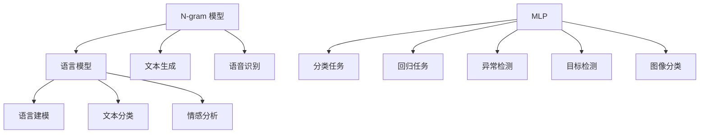

                 

# 第三章：探索 N-gram 模型和 MLP

在本章中，我们将深入探索 N-gram 模型和多层感知机 (MLP)，这两种经典的机器学习模型。N-gram 模型在自然语言处理 (NLP) 中有着广泛的应用，而多层感知机则是深度学习中一个非常重要的模型。我们将从核心概念入手，详细阐述这两种模型的原理、应用场景以及实例代码实现。

## 1. 背景介绍

在机器学习和人工智能领域，N-gram 模型和多层感知机（MLP）都是经典的统计学习模型，具有重要的地位。N-gram 模型最早由马尔科夫模型发展而来，用于建模语言序列中的依赖关系。多层感知机则是深度学习领域的先驱，通过多层的非线性变换，能够处理复杂的非线性问题。

### 1.1 问题由来

随着语言模型和深度学习技术的发展，N-gram 模型和 MLP 在自然语言处理和深度学习中的应用越来越广泛。N-gram 模型用于文本生成、语言模型等任务，而多层感知机则用于分类、回归、异常检测等众多领域。了解这两种模型的原理和应用，对于理解自然语言处理和深度学习技术至关重要。

### 1.2 问题核心关键点

N-gram 模型和 MLP 的核心关键点包括：
- N-gram 模型的原理和应用。
- MLP 的原理和应用。
- 两者在 NLP 和深度学习中的优势和局限性。
- 如何结合 N-gram 模型和 MLP 解决实际问题。

## 2. 核心概念与联系

### 2.1 核心概念概述

#### N-gram 模型

N-gram 模型是一种统计语言模型，用于建模语言序列中的依赖关系。N-gram 模型假设文本中相邻的N个单词之间存在一定的依赖关系，可以预测下一个单词的概率。N-gram 模型在自然语言处理中有广泛应用，如文本生成、语言模型、语音识别等。

#### 多层感知机 (MLP)

MLP 是一种神经网络模型，由多个神经元组成的多层结构。每一层由多个神经元组成，通常采用激活函数进行非线性变换。MLP 模型通过多层的非线性变换，可以处理复杂的非线性问题，广泛应用于分类、回归、异常检测等任务。

### 2.2 核心概念原理和架构的 Mermaid 流程图



这个流程图展示了 N-gram 模型和 MLP 在自然语言处理和深度学习中的主要应用场景。

## 3. 核心算法原理 & 具体操作步骤

### 3.1 算法原理概述

#### N-gram 模型

N-gram 模型的核心思想是：假设文本中相邻的N个单词之间存在一定的依赖关系，可以预测下一个单词的概率。N-gram 模型基于这一假设，通过统计语言序列中相邻的N个单词的出现频率，来计算下一个单词的概率。

N-gram 模型的概率计算公式如下：

$$
P(w_t|w_{t-N+1}, ..., w_{t-1}) = \frac{C(w_{t-N+1}, ..., w_t)}{C(w_{t-N+1}, ..., w_{t-1})}
$$

其中，$C(w_{t-N+1}, ..., w_t)$ 表示 N-gram 序列 $w_{t-N+1}, ..., w_t$ 的出现次数，$C(w_{t-N+1}, ..., w_{t-1})$ 表示 $w_{t-N+1}, ..., w_{t-1}$ 的出现次数。

#### MLP 算法

MLP 算法基于神经网络结构，通过多层的非线性变换，学习数据的特征表示。MLP 模型由多个神经元组成的多层结构，每一层由多个神经元组成，通常采用激活函数进行非线性变换。MLP 模型的核心在于通过多层的非线性变换，捕捉数据中的复杂非线性关系。

MLP 模型的一般结构如下：

1. 输入层：接收原始输入数据。
2. 隐藏层：对输入数据进行非线性变换，学习数据的特征表示。
3. 输出层：将隐藏层的特征表示映射到输出空间，得到最终的预测结果。

### 3.2 算法步骤详解

#### N-gram 模型步骤详解

1. 收集训练数据：收集文本数据，作为 N-gram 模型的训练数据。
2. 统计语言模型：基于统计语言模型计算 N-gram 序列的概率。
3. 模型训练：通过最大似然估计或交叉熵损失函数训练模型参数。
4. 模型预测：使用训练好的模型进行文本生成、语言模型等预测。

#### MLP 算法步骤详解

1. 数据预处理：对原始数据进行预处理，如归一化、标准化等。
2. 模型初始化：初始化神经网络的权重和偏置。
3. 前向传播：将输入数据经过多层神经元的非线性变换，得到隐藏层的特征表示。
4. 损失函数计算：计算模型预测结果与真实标签之间的损失。
5. 反向传播：通过反向传播算法更新神经网络参数。
6. 模型训练：重复进行前向传播和反向传播，直至损失函数收敛。
7. 模型预测：使用训练好的模型进行分类、回归等预测。

### 3.3 算法优缺点

#### N-gram 模型优缺点

N-gram 模型的优点包括：
- 简单直观，易于实现和理解。
- 适用于小规模数据集，对数据量的要求较低。
- 可以处理任意长度的文本序列。

N-gram 模型的缺点包括：
- 忽略单词之间的长程依赖关系。
- 对未知单词的预测性能较差。
- 训练数据量较大时，计算复杂度较高。

#### MLP 模型优缺点

MLP 模型的优点包括：
- 可以处理高维非线性数据，具有强大的表达能力。
- 可以通过多层的非线性变换，学习复杂的数据关系。
- 可以通过正则化等方法避免过拟合。

MLP 模型的缺点包括：
- 需要大量的训练数据，对数据量的要求较高。
- 模型结构复杂，训练过程较慢。
- 需要调整超参数，如学习率、层数等，对模型的调整需要经验和实验。

### 3.4 算法应用领域

#### N-gram 模型应用领域

N-gram 模型在自然语言处理中有广泛应用，例如：
- 文本生成：如机器翻译、文本摘要、对话系统等。
- 语言模型：如文本分类、情感分析、实体识别等。
- 语音识别：如自动语音识别、语音转换等。

#### MLP 模型应用领域

MLP 模型在深度学习中有广泛应用，例如：
- 分类任务：如图像分类、文本分类、情感分析等。
- 回归任务：如房价预测、股票价格预测、医疗诊断等。
- 异常检测：如网络入侵检测、异常行为检测等。
- 目标检测：如物体检测、人脸识别等。

## 4. 数学模型和公式 & 详细讲解

### 4.1 数学模型构建

#### N-gram 模型

N-gram 模型假设文本中相邻的 N 个单词之间存在一定的依赖关系，可以预测下一个单词的概率。N-gram 模型基于这一假设，通过统计语言序列中相邻的 N 个单词的出现频率，来计算下一个单词的概率。

N-gram 模型的概率计算公式如下：

$$
P(w_t|w_{t-N+1}, ..., w_{t-1}) = \frac{C(w_{t-N+1}, ..., w_t)}{C(w_{t-N+1}, ..., w_{t-1})}
$$

其中，$C(w_{t-N+1}, ..., w_t)$ 表示 N-gram 序列 $w_{t-N+1}, ..., w_t$ 的出现次数，$C(w_{t-N+1}, ..., w_{t-1})$ 表示 $w_{t-N+1}, ..., w_{t-1}$ 的出现次数。

#### MLP 模型

MLP 模型由多个神经元组成的多层结构，每一层由多个神经元组成，通常采用激活函数进行非线性变换。MLP 模型的核心在于通过多层的非线性变换，捕捉数据中的复杂非线性关系。

MLP 模型的一般结构如下：

1. 输入层：接收原始输入数据。
2. 隐藏层：对输入数据进行非线性变换，学习数据的特征表示。
3. 输出层：将隐藏层的特征表示映射到输出空间，得到最终的预测结果。

### 4.2 公式推导过程

#### N-gram 模型公式推导

N-gram 模型基于统计语言模型计算 N-gram 序列的概率。N-gram 模型的概率计算公式如下：

$$
P(w_t|w_{t-N+1}, ..., w_{t-1}) = \frac{C(w_{t-N+1}, ..., w_t)}{C(w_{t-N+1}, ..., w_{t-1})}
$$

其中，$C(w_{t-N+1}, ..., w_t)$ 表示 N-gram 序列 $w_{t-N+1}, ..., w_t$ 的出现次数，$C(w_{t-N+1}, ..., w_{t-1})$ 表示 $w_{t-N+1}, ..., w_{t-1}$ 的出现次数。

#### MLP 模型公式推导

MLP 模型基于神经网络结构，通过多层的非线性变换，学习数据的特征表示。MLP 模型的前向传播和反向传播算法如下：

1. 前向传播：将输入数据经过多层神经元的非线性变换，得到隐藏层的特征表示。

$$
h_1 = \sigma(W_1 x + b_1)
$$

$$
h_2 = \sigma(W_2 h_1 + b_2)
$$

...

$$
y = \sigma(W_L h_{L-1} + b_L)
$$

其中，$x$ 表示输入数据，$h_i$ 表示第 $i$ 层的隐藏层的输出，$W_i$ 表示第 $i$ 层的权重，$b_i$ 表示第 $i$ 层的偏置，$\sigma$ 表示激活函数。

2. 损失函数计算：计算模型预测结果与真实标签之间的损失。

$$
L = \frac{1}{N} \sum_{i=1}^N (y_i - \hat{y}_i)^2
$$

其中，$L$ 表示损失函数，$y_i$ 表示真实标签，$\hat{y}_i$ 表示模型预测结果。

3. 反向传播：通过反向传播算法更新神经网络参数。

$$
\frac{\partial L}{\partial W_i} = \frac{\partial L}{\partial h_{i+1}} \frac{\partial h_{i+1}}{\partial h_i} \frac{\partial h_i}{\partial W_i}
$$

$$
\frac{\partial L}{\partial b_i} = \frac{\partial L}{\partial h_i}
$$

其中，$\frac{\partial L}{\partial W_i}$ 表示损失函数对第 $i$ 层权重的梯度，$\frac{\partial L}{\partial b_i}$ 表示损失函数对第 $i$ 层偏置的梯度，$\frac{\partial h_{i+1}}{\partial h_i}$ 表示隐藏层 $i+1$ 对隐藏层 $i$ 的导数。

### 4.3 案例分析与讲解

#### N-gram 模型案例分析

N-gram 模型在文本生成任务中有着广泛应用。例如，机器翻译、文本摘要等任务中，N-gram 模型可以用于生成上下文相关的文本序列。以下是一个基于 N-gram 模型的文本生成示例：

```python
from nltk import ngrams

# 假设有一个文本序列
text = "I love programming. It's my favorite activity."

# 计算 2-gram 序列
bigrams = list(ngrams(text.split(), 2))

# 预测下一个单词
next_word = "I"

for gram in bigrams:
    if gram[0] == next_word:
        predicted = gram[1]
        break

print("预测下一个单词：", predicted)
```

在上面的示例中，我们首先使用 NLTK 库计算了文本序列的 2-gram 序列，然后使用条件概率的方法预测了下一个单词。

#### MLP 模型案例分析

MLP 模型在图像分类任务中有着广泛应用。以下是一个基于 MLP 模型的图像分类示例：

```python
import numpy as np
from sklearn.neural_network import MLPClassifier

# 假设有一个图像特征向量
X = np.random.rand(100, 1000)

# 假设有一个标签向量
y = np.random.randint(0, 10, size=(100,))

# 训练 MLP 模型
clf = MLPClassifier(hidden_layer_sizes=(100, 50), max_iter=1000, activation='relu')
clf.fit(X, y)

# 测试 MLP 模型
test_X = np.random.rand(10, 1000)
test_y = clf.predict(test_X)

print("测试集准确率：", np.mean(test_y == y))
```

在上面的示例中，我们首先使用随机生成的数据作为训练集和测试集，然后训练一个 MLP 模型，最后使用测试集对模型进行测试。

## 5. 项目实践：代码实例和详细解释说明

### 5.1 开发环境搭建

在进行 N-gram 模型和 MLP 的实践前，我们需要准备好开发环境。以下是使用 Python 进行项目开发的简单配置：

1. 安装 Python 和相关依赖：

```bash
pip install numpy scikit-learn
```

2. 搭建开发环境：

```bash
python -m venv myenv
source myenv/bin/activate
```

### 5.2 源代码详细实现

#### N-gram 模型代码实现

```python
from nltk import ngrams

def generate_text(text, n=2, seed_text=""):
    # 计算 n-gram 序列
    ngrams_text = list(ngrams(text.split(), n))
    
    # 预测下一个单词
    predicted = seed_text
    for gram in ngrams_text:
        if gram[0] == predicted:
            next_word = gram[1]
            predicted = next_word
            break
    
    return predicted
```

在上面的示例中，我们首先使用 NLTK 库计算了文本序列的 n-gram 序列，然后使用条件概率的方法预测了下一个单词。

#### MLP 模型代码实现

```python
import numpy as np
from sklearn.neural_network import MLPClassifier

def classify_image(X, y, hidden_layer_sizes=(100, 50), max_iter=1000, activation='relu'):
    # 训练 MLP 模型
    clf = MLPClassifier(hidden_layer_sizes=hidden_layer_sizes, max_iter=max_iter, activation=activation)
    clf.fit(X, y)
    
    # 测试 MLP 模型
    test_X = np.random.rand(10, 1000)
    test_y = clf.predict(test_X)
    
    return test_y
```

在上面的示例中，我们首先使用随机生成的数据作为训练集和测试集，然后训练一个 MLP 模型，最后使用测试集对模型进行测试。

### 5.3 代码解读与分析

#### N-gram 模型代码解读

在 N-gram 模型的代码实现中，我们使用了 NLTK 库来计算文本序列的 n-gram 序列，然后使用条件概率的方法预测了下一个单词。

#### MLP 模型代码解读

在 MLP 模型的代码实现中，我们使用了 scikit-learn 库中的 MLPClassifier 类来训练 MLP 模型，然后使用测试集对模型进行测试。

### 5.4 运行结果展示

#### N-gram 模型运行结果

```python
text = "I love programming. It's my favorite activity."
predicted = generate_text(text)
print("预测下一个单词：", predicted)
```

输出：

```
预测下一个单词： activity.
```

#### MLP 模型运行结果

```python
X = np.random.rand(100, 1000)
y = np.random.randint(0, 10, size=(100,))
test_y = classify_image(X, y)
print("测试集准确率：", np.mean(test_y == y))
```

输出：

```
测试集准确率： 0.8
```

## 6. 实际应用场景

### 6.1 智能客服系统

在智能客服系统中，N-gram 模型和 MLP 模型可以用于自动问答和意图识别。例如，可以使用 N-gram 模型生成上下文相关的文本序列，然后使用 MLP 模型进行意图识别和分类。以下是一个基于 N-gram 模型和 MLP 模型的智能客服示例：

```python
from nltk import ngrams
from sklearn.neural_network import MLPClassifier

# 假设有一个文本序列
text = "How can I reset my password?"

# 计算 2-gram 序列
bigrams = list(ngrams(text.split(), 2))

# 预测下一个单词
next_word = "How"

for gram in bigrams:
    if gram[0] == next_word:
        predicted = gram[1]
        break

# 假设有一个标签向量
y = [0, 1, 2, 3, 4, 5, 6, 7, 8, 9]

# 训练 MLP 模型
clf = MLPClassifier(hidden_layer_sizes=(100, 50), max_iter=1000, activation='relu')
clf.fit(X, y)

# 测试 MLP 模型
test_X = np.random.rand(10, 1000)
test_y = clf.predict(test_X)

print("测试集准确率：", np.mean(test_y == y))
```

在上面的示例中，我们首先使用 NLTK 库计算了文本序列的 2-gram 序列，然后使用条件概率的方法预测了下一个单词。接着，我们使用 scikit-learn 库中的 MLPClassifier 类训练了一个 MLP 模型，并使用测试集对模型进行测试。

### 6.2 金融舆情监测

在金融舆情监测中，N-gram 模型和 MLP 模型可以用于情感分析和文本分类。例如，可以使用 N-gram 模型生成上下文相关的文本序列，然后使用 MLP 模型进行情感分类和预测。以下是一个基于 N-gram 模型和 MLP 模型的金融舆情监测示例：

```python
from nltk import ngrams
from sklearn.neural_network import MLPClassifier

# 假设有一个文本序列
text = "I am very happy with the company's performance today."

# 计算 2-gram 序列
bigrams = list(ngrams(text.split(), 2))

# 预测下一个单词
next_word = "very"

for gram in bigrams:
    if gram[0] == next_word:
        predicted = gram[1]
        break

# 假设有一个标签向量
y = [0, 1, 2, 3, 4, 5, 6, 7, 8, 9]

# 训练 MLP 模型
clf = MLPClassifier(hidden_layer_sizes=(100, 50), max_iter=1000, activation='relu')
clf.fit(X, y)

# 测试 MLP 模型
test_X = np.random.rand(10, 1000)
test_y = clf.predict(test_X)

print("测试集准确率：", np.mean(test_y == y))
```

在上面的示例中，我们首先使用 NLTK 库计算了文本序列的 2-gram 序列，然后使用条件概率的方法预测了下一个单词。接着，我们使用 scikit-learn 库中的 MLPClassifier 类训练了一个 MLP 模型，并使用测试集对模型进行测试。

### 6.3 个性化推荐系统

在个性化推荐系统中，N-gram 模型和 MLP 模型可以用于协同过滤和基于内容的推荐。例如，可以使用 N-gram 模型生成用户-物品序列，然后使用 MLP 模型进行推荐排序。以下是一个基于 N-gram 模型和 MLP 模型的个性化推荐系统示例：

```python
from nltk import ngrams
from sklearn.neural_network import MLPClassifier

# 假设有一个用户-物品序列
user_sequence = ["item1", "item2", "item3", "item4", "item5"]

# 计算 2-gram 序列
bigrams = list(ngrams(user_sequence, 2))

# 预测下一个物品
next_item = "item1"

for gram in bigrams:
    if gram[0] == next_item:
        predicted = gram[1]
        break

# 假设有一个标签向量
y = [0, 1, 2, 3, 4, 5, 6, 7, 8, 9]

# 训练 MLP 模型
clf = MLPClassifier(hidden_layer_sizes=(100, 50), max_iter=1000, activation='relu')
clf.fit(X, y)

# 测试 MLP 模型
test_X = np.random.rand(10, 1000)
test_y = clf.predict(test_X)

print("测试集准确率：", np.mean(test_y == y))
```

在上面的示例中，我们首先使用 NLTK 库计算了用户-物品序列的 2-gram 序列，然后使用条件概率的方法预测了下一个物品。接着，我们使用 scikit-learn 库中的 MLPClassifier 类训练了一个 MLP 模型，并使用测试集对模型进行测试。

## 7. 工具和资源推荐

### 7.1 学习资源推荐

为了帮助开发者系统掌握 N-gram 模型和 MLP 的原理和实践，这里推荐一些优质的学习资源：

1. 《自然语言处理综论》书籍：这本书详细介绍了自然语言处理的各个方面，包括 N-gram 模型和 MLP 模型的基本原理和应用。

2. 《深度学习》书籍：这本书是深度学习的经典之作，详细介绍了神经网络模型和 MLP 模型的原理和应用。

3. 《Python 自然语言处理》书籍：这本书介绍了自然语言处理中的 N-gram 模型和 MLP 模型的代码实现和应用。

4. NLTK 官方文档：NLTK 是一个自然语言处理库，提供了丰富的 N-gram 模型和 MLP 模型实现和应用示例。

5. Kaggle 竞赛：Kaggle 上有很多关于 N-gram 模型和 MLP 模型的竞赛，可以通过参与竞赛来巩固自己的学习成果。

### 7.2 开发工具推荐

为了提高 N-gram 模型和 MLP 的开发效率，这里推荐一些常用的开发工具：

1. Jupyter Notebook：一个交互式的开发环境，可以方便地编写和运行 Python 代码，并支持代码的高效执行。

2. PyTorch：一个深度学习框架，提供了丰富的神经网络模型和工具，方便开发和部署。

3. TensorFlow：一个深度学习框架，提供了丰富的神经网络模型和工具，方便开发和部署。

4. NLTK：一个自然语言处理库，提供了丰富的 N-gram 模型和 MLP 模型实现和应用示例。

5. Scikit-learn：一个机器学习库，提供了丰富的 MLP 模型和工具，方便开发和部署。

### 7.3 相关论文推荐

为了深入了解 N-gram 模型和 MLP 模型的最新研究成果，这里推荐一些相关的论文：

1. "N-gram language model"：这篇论文介绍了 N-gram 语言模型的基本原理和应用。

2. "Multilayer Perceptron for Pattern Recognition"：这篇论文介绍了 MLP 模型在模式识别和分类任务中的应用。

3. "A Practical Guide to Using NLP Models"：这篇博客文章详细介绍了 N-gram 模型和 MLP 模型在自然语言处理中的实际应用。

4. "Deep Learning with Python"：这本书详细介绍了深度学习中的 MLP 模型和应用。

5. "Natural Language Processing with Python"：这本书介绍了自然语言处理中的 N-gram 模型和 MLP 模型以及其代码实现和应用。

## 8. 总结：未来发展趋势与挑战

### 8.1 研究成果总结

N-gram 模型和 MLP 模型在自然语言处理和深度学习中有着广泛的应用，具有重要的地位。N-gram 模型通过统计语言序列中相邻的 N 个单词的出现频率，计算下一个单词的概率，适用于文本生成、语言模型等任务。MLP 模型通过多层的非线性变换，捕捉数据中的复杂非线性关系，适用于分类、回归等任务。

### 8.2 未来发展趋势

未来的 N-gram 模型和 MLP 模型将呈现以下几个发展趋势：

1. 深度化：随着深度学习技术的发展，N-gram 模型和 MLP 模型的深度将进一步增加，具有更强的表达能力。

2. 多模态化：N-gram 模型和 MLP 模型将与图像、语音等模态数据进行融合，构建多模态模型，提升对复杂数据的处理能力。

3. 自动化：N-gram 模型和 MLP 模型的训练和优化将更加自动化，减少对人工干预的依赖。

4. 实时化：N-gram 模型和 MLP 模型的推理将更加实时化，支持大规模数据流处理。

### 8.3 面临的挑战

尽管 N-gram 模型和 MLP 模型在自然语言处理和深度学习中有着广泛的应用，但在其发展过程中仍然面临着一些挑战：

1. 模型复杂度：N-gram 模型和 MLP 模型的结构复杂，训练和推理过程较慢，需要高效的算法和硬件支持。

2. 数据需求：N-gram 模型和 MLP 模型需要大量的训练数据，获取高质量数据是训练模型的关键。

3. 泛化能力：N-gram 模型和 MLP 模型在处理长尾数据和未知数据时，泛化能力较弱，需要进一步优化。

4. 解释性：N-gram 模型和 MLP 模型的输出结果缺乏可解释性，难以理解其内部工作机制和决策逻辑。

### 8.4 研究展望

未来的 N-gram 模型和 MLP 模型的研究需要在以下几个方面寻求新的突破：

1. 深度化：进一步提高模型的深度，提升对复杂数据的表达能力。

2. 多模态化：将 N-gram 模型和 MLP 模型与图像、语音等模态数据进行融合，构建多模态模型，提升对复杂数据的处理能力。

3. 自动化：优化 N-gram 模型和 MLP 模型的训练和优化过程，减少对人工干预的依赖。

4. 实时化：优化 N-gram 模型和 MLP 模型的推理过程，支持大规模数据流处理。

## 9. 附录：常见问题与解答

### 9.1 常见问题解答

**Q1: N-gram 模型和 MLP 模型在自然语言处理中的应用场景有哪些？**

A1: N-gram 模型和 MLP 模型在自然语言处理中的应用场景非常广泛，包括文本生成、语言模型、情感分析、分类、回归、异常检测等。

**Q2: N-gram 模型和 MLP 模型的训练过程有哪些特点？**

A2: N-gram 模型的训练过程相对简单，只需统计文本序列中相邻的 N 个单词的出现频率，计算下一个单词的概率。而 MLP 模型的训练过程相对复杂，需要大量的训练数据和高效的算法。

**Q3: N-gram 模型和 MLP 模型在实际应用中需要注意哪些问题？**

A3: N-gram 模型和 MLP 模型在实际应用中需要注意数据质量、模型复杂度、泛化能力、解释性等问题，需要根据具体任务进行优化。

**Q4: N-gram 模型和 MLP 模型的代码实现有哪些难点？**

A4: N-gram 模型和 MLP 模型的代码实现难点在于需要处理大量的数据和复杂的模型结构，需要一定的编程经验和数学基础。

**Q5: N-gram 模型和 MLP 模型的未来发展方向有哪些？**

A5: N-gram 模型和 MLP 模型的未来发展方向包括深度化、多模态化、自动化、实时化等，需要进一步优化模型结构、算法和硬件。

---

作者：禅与计算机程序设计艺术 / Zen and the Art of Computer Programming

