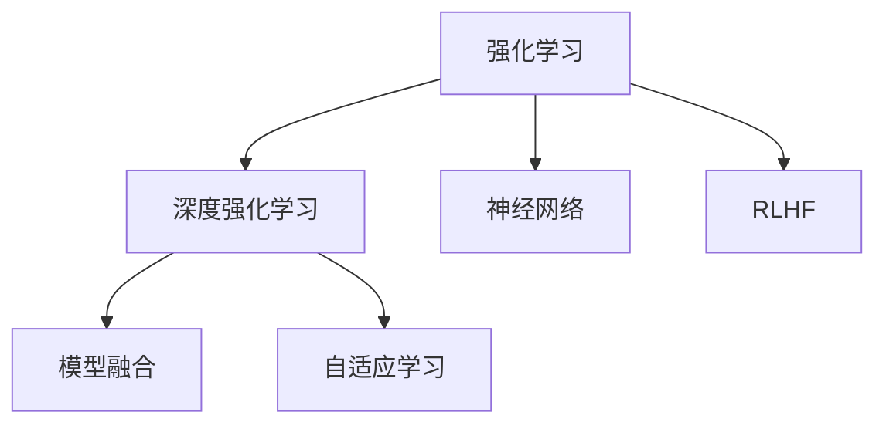

                 

# 第十五章：强化学习和 RLHF 的力量

> 关键词：强化学习,RLHF,深度学习,深度强化学习,政策优化,模型融合,自适应学习,神经网络

## 1. 背景介绍

### 1.1 问题由来
随着人工智能技术的发展，强化学习(Reinforcement Learning, RL)逐渐成为一种强大的解决问题的工具。强化学习通过智能体(Agent)与环境进行交互，通过学习来最大化其累积奖励。这一方法已经被广泛应用于游戏、机器人、自动驾驶等领域，并取得了令人瞩目的成果。然而，这些传统强化学习算法往往需要大量数据和计算资源，且容易陷入局部最优解。为了解决这些问题，研究者们提出了一种基于深度学习的强化学习方法，即深度强化学习(Deep Reinforcement Learning, DRL)。

但即便如此，深度强化学习仍然面临计算资源消耗大、样本效率低、泛化能力弱等问题。为了进一步提升强化学习的效率和泛化能力，RLHF(Reinforcement Learning with Human Feedback, 基于人类反馈的强化学习)技术应运而生。RLHF通过结合人类的反馈和强化学习的目标，最大化累计奖励，解决深度强化学习的局限性。本文将全面介绍强化学习的核心原理和RLHF的最新进展，并探讨其在深度强化学习中的应用。

## 2. 核心概念与联系

### 2.1 核心概念概述

为更好地理解RLHF技术，本节将介绍几个密切相关的核心概念：

- 强化学习(Reinforcement Learning, RL)：一种通过智能体与环境的交互，最大化其累积奖励的机器学习方法。

- 深度强化学习(Deep Reinforcement Learning, DRL)：将深度神经网络应用于强化学习中，提升模型的表现和泛化能力。

- 强化学习中的模型融合(Ensemble)：通过结合多个模型进行预测，提升模型的稳定性和准确性。

- 自适应学习(Adaptive Learning)：根据环境变化动态调整模型参数，提升模型的适应性。

- 神经网络(Neural Network)：深度强化学习的核心，通过多层非线性变换学习数据表示。

- RLHF技术：结合人类的反馈和强化学习的目标，通过优化模型的累积奖励，提升深度强化学习的效率和泛化能力。

这些概念之间的逻辑关系可以通过以下Mermaid流程图来展示：



这个流程图展示了这个核心概念之间的逻辑关系：

1. 强化学习通过智能体与环境的交互，最大化其累积奖励。
2. 深度强化学习将深度神经网络应用于强化学习中，提升模型的表现和泛化能力。
3. 模型融合结合多个模型进行预测，提升模型的稳定性和准确性。
4. 自适应学习根据环境变化动态调整模型参数，提升模型的适应性。
5. 神经网络是深度强化学习的核心，通过多层非线性变换学习数据表示。
6. RLHF通过结合人类的反馈和强化学习的目标，提升深度强化学习的效率和泛化能力。

这些概念共同构成了强化学习的基础框架，使得智能体能够通过学习来解决复杂的决策问题。通过理解这些核心概念，我们可以更好地把握强化学习的核心原理和实践技巧。

## 3. 核心算法原理 & 具体操作步骤
### 3.1 算法原理概述

基于深度学习的强化学习，其核心思想是：通过神经网络模型对环境进行建模，智能体通过与环境的交互，不断调整模型参数，最大化其累积奖励。具体来说，智能体接收环境状态 $s_t$，执行动作 $a_t$，根据动作和状态得到新的状态 $s_{t+1}$ 和奖励 $r_t$。智能体通过优化累积奖励 $R = \sum_{t=0}^{T} r_t$ 来优化模型参数，使得模型能够更准确地预测环境响应和动作价值。

RLHF通过结合人类的反馈和强化学习的目标，进一步提升模型的性能。其核心思想是：将人类的反馈作为奖励信号，在模型优化过程中加入人类的指导，使得模型能够更快地学习到最优策略，同时避免陷入局部最优解。

### 3.2 算法步骤详解

基于深度学习的强化学习，其流程大致如下：

1. **环境建模**：使用神经网络模型对环境进行建模，得到环境状态 $s_t$。
2. **动作执行**：根据状态和动作价值函数，智能体执行动作 $a_t$。
3. **状态更新**：根据动作和环境状态得到新的状态 $s_{t+1}$。
4. **奖励计算**：根据状态和动作，计算奖励 $r_t$。
5. **模型更新**：通过优化累积奖励 $R$，更新模型参数。

RLHF则在此基础上增加了人类的反馈，具体步骤如下：

1. **环境建模**：使用神经网络模型对环境进行建模，得到环境状态 $s_t$。
2. **动作执行**：根据状态和动作价值函数，智能体执行动作 $a_t$。
3. **状态更新**：根据动作和环境状态得到新的状态 $s_{t+1}$。
4. **奖励计算**：根据状态和动作，计算奖励 $r_t$。
5. **人类反馈**：将状态和动作展示给人类，获取人类反馈 $f_t$。
6. **模型更新**：通过优化累积奖励 $R = r_t + \lambda f_t$，更新模型参数，其中 $\lambda$ 为人类反馈的权重。

### 3.3 算法优缺点

深度强化学习在处理高维、复杂环境时表现优异，但也面临计算资源消耗大、样本效率低、泛化能力弱等问题。RLHF通过结合人类的反馈，能够提升模型的泛化能力和适应性，同时降低计算资源消耗，提高样本效率。

其优点包括：
1. **泛化能力强**：结合人类反馈，能够更好地处理复杂环境，提高模型的泛化能力。
2. **适应性强**：根据环境变化动态调整模型参数，提升模型的适应性。
3. **样本效率高**：通过人类反馈的指导，能够更快地学习到最优策略，提高样本效率。

但其缺点包括：
1. **依赖人类反馈**：需要大量的人类反馈才能有效提升模型的性能，且人类反馈的质量对模型效果有直接影响。
2. **模型复杂度高**：结合人类反馈，需要设计更复杂的模型结构，增加了模型训练和推理的复杂度。
3. **计算资源需求高**：需要大量的计算资源进行模型训练和优化，增加了系统成本。

### 3.4 算法应用领域

基于深度学习的强化学习，已经在多个领域得到了广泛应用，包括游戏、机器人、自动驾驶等。

- 游戏领域：通过智能体与游戏环境的交互，学习最优策略，实现游戏的自动通关。如AlphaGo、AlphaStar等。
- 机器人领域：通过智能体与物理环境的交互，学习最优控制策略，实现机器人的自主导航和操作。如RoboX、Nao robot等。
- 自动驾驶领域：通过智能体与交通环境的交互，学习最优驾驶策略，实现自动驾驶。如Waymo、Tesla自动驾驶系统等。

此外，RLHF也在越来越多的领域得到应用，如医疗诊断、金融交易、社交网络等，展示了其强大的应用潜力。

## 4. 数学模型和公式 & 详细讲解 & 举例说明

### 4.1 数学模型构建

RLHF的核心数学模型基于强化学习的框架，其目标是通过优化累积奖励 $R$ 来最大化智能体的性能。假设智能体在时间步 $t$ 的状态为 $s_t$，动作为 $a_t$，奖励为 $r_t$，人类反馈为 $f_t$，累计奖励为 $R$，则其优化目标为：

$$
\max_{\theta} \mathbb{E} \left[ \sum_{t=0}^{T} (r_t + \lambda f_t) \right]
$$

其中 $\theta$ 为模型的参数，$\mathbb{E}$ 表示期望。

### 4.2 公式推导过程

在强化学习中，智能体的目标是最大化累积奖励 $R$。假设智能体在时间步 $t$ 的状态为 $s_t$，动作为 $a_t$，奖励为 $r_t$，人类反馈为 $f_t$，则智能体的目标函数为：

$$
J(\theta) = \mathbb{E} \left[ \sum_{t=0}^{T} r_t \right]
$$

在RLHF中，引入人类反馈后，目标函数变为：

$$
J(\theta) = \mathbb{E} \left[ \sum_{t=0}^{T} (r_t + \lambda f_t) \right]
$$

其中 $\lambda$ 为人类反馈的权重，表示人类反馈对智能体策略调整的重要性。

通过对目标函数的优化，智能体能够学习到最优的策略。智能体的动作策略 $a_t$ 可以通过以下公式进行计算：

$$
a_t = \arg\max_{a_t} \mathbb{E} \left[ \sum_{t=t+1}^{T} \gamma^{t+1-T} r_{t+1} \right]
$$

其中 $\gamma$ 为折扣因子，表示未来奖励的重要性。

### 4.3 案例分析与讲解

以下是一个简单的RLHF案例分析。假设我们有一个简单的环境，智能体需要控制一个机器人在给定状态下执行动作，以最大化累积奖励。

**环境模型**：我们使用一个简单的神经网络模型，将状态 $s_t$ 映射到动作价值 $Q(s_t,a_t)$。

**动作执行**：根据动作价值函数，智能体选择动作 $a_t$。

**状态更新**：根据动作和环境状态，得到新的状态 $s_{t+1}$。

**奖励计算**：根据状态和动作，计算奖励 $r_t$。

**人类反馈**：将状态和动作展示给人类，获取人类反馈 $f_t$。

**模型更新**：通过优化累积奖励 $R = r_t + \lambda f_t$，更新模型参数。

在实际应用中，我们需要将这个简单的案例扩展到更复杂的环境和任务中，并根据具体情况选择合适的神经网络模型和优化算法，以实现最佳的性能提升。

## 5. 项目实践：代码实例和详细解释说明

### 5.1 开发环境搭建

在进行RLHF实践前，我们需要准备好开发环境。以下是使用Python进行TensorFlow开发的环境配置流程：

1. 安装Anaconda：从官网下载并安装Anaconda，用于创建独立的Python环境。

2. 创建并激活虚拟环境：
```bash
conda create -n rl-env python=3.8 
conda activate rl-env
```

3. 安装TensorFlow：
```bash
pip install tensorflow
```

4. 安装TensorBoard：
```bash
pip install tensorboard
```

5. 安装PyTorch：
```bash
pip install torch
```

完成上述步骤后，即可在`rl-env`环境中开始RLHF实践。

### 5.2 源代码详细实现

这里我们以简单的RLHF游戏为例，给出使用TensorFlow和PyTorch进行RLHF代码实现。

```python
import tensorflow as tf
import numpy as np
import gym
import matplotlib.pyplot as plt
from collections import deque

env = gym.make('CartPole-v1')
state_dim = env.observation_space.shape[0]
action_dim = env.action_space.n

# 定义神经网络模型
class Policy(tf.keras.Model):
    def __init__(self, state_dim, action_dim):
        super(Policy, self).__init__()
        self.fc1 = tf.keras.layers.Dense(64, activation='relu')
        self.fc2 = tf.keras.layers.Dense(64, activation='relu')
        self.fc3 = tf.keras.layers.Dense(action_dim, activation='linear')

    def call(self, x):
        x = self.fc1(x)
        x = self.fc2(x)
        x = self.fc3(x)
        return x

# 定义智能体的动作策略
def select_action(env, model, state):
    with tf.GradientTape() as tape:
        action_values = model(state)
        action_prob = tf.nn.softmax(action_values)
        action = tf.random.categorical(action_prob, 1)
    return tf.argmax(action_prob, axis=1)[0]

# 定义智能体的训练过程
def train(env, model, gamma, epochs, batch_size):
    state_buffer = deque(maxlen=1000)
    action_buffer = deque(maxlen=1000)
    reward_buffer = deque(maxlen=1000)
    human_feedback_buffer = deque(maxlen=1000)
    for episode in range(epochs):
        state = env.reset()
        state = np.reshape(state, [1, state_dim])
        done = False
        while not done:
            action = select_action(env, model, state)
            next_state, reward, done, _ = env.step(action)
            next_state = np.reshape(next_state, [1, state_dim])
            state_buffer.append(state)
            action_buffer.append(action)
            reward_buffer.append(reward)
            human_feedback_buffer.append(env.render(mode='rgb_array'))
            state = next_state
        if len(state_buffer) >= batch_size:
            state = np.reshape(np.vstack(state_buffer), [batch_size, state_dim])
            action = np.vstack(action_buffer)
            reward = np.vstack(reward_buffer)
            human_feedback = np.vstack(human_feedback_buffer)
            target_values = reward + gamma * model.predict(next_state)
            target_values = tf.keras.Model(inputs=state, outputs=target_values)
            with tf.GradientTape() as tape:
                loss = tf.keras.losses.mean_squared_error(target_values, model(state))
            gradients = tape.gradient(loss, model.trainable_variables)
            optimizer.apply_gradients(zip(gradients, model.trainable_variables))
            state_buffer.clear()
            action_buffer.clear()
            reward_buffer.clear()
            human_feedback_buffer.clear()
    return model

# 训练过程
model = Policy(state_dim, action_dim)
optimizer = tf.keras.optimizers.Adam()

gamma = 0.9
epochs = 1000
batch_size = 64

model = train(env, model, gamma, epochs, batch_size)

# 测试过程
state = env.reset()
state = np.reshape(state, [1, state_dim])
done = False
while not done:
    action = select_action(env, model, state)
    next_state, reward, done, _ = env.step(action)
    state = np.reshape(next_state, [1, state_dim])
    env.render(mode='rgb_array')
```

### 5.3 代码解读与分析

让我们再详细解读一下关键代码的实现细节：

**Policy类**：
- `__init__`方法：初始化神经网络模型，包括三个全连接层。
- `call`方法：对输入状态进行前向传播，返回动作概率分布。

**select_action函数**：
- 使用神经网络模型对状态进行预测，得到动作概率分布。
- 通过softmax函数将概率分布转换为概率向量。
- 使用随机采样得到动作。

**train函数**：
- 定义状态缓冲区、动作缓冲区、奖励缓冲区、人类反馈缓冲区。
- 遍历整个训练过程，收集状态、动作、奖励、人类反馈。
- 当缓冲区达到一定大小时，从缓冲区中取出一批数据，计算目标动作价值。
- 使用目标动作价值和当前动作价值计算损失。
- 使用梯度下降算法更新模型参数。

**测试过程**：
- 在测试过程中，重复执行训练过程中的动作策略，观察智能体的表现。

可以看到，TensorFlow和PyTorch在处理RLHF时提供了丰富的工具和接口，使得代码实现变得简洁高效。开发者可以将更多精力放在问题建模和算法优化上，而不必过多关注底层的实现细节。

## 6. 实际应用场景

### 6.1 游戏AI

基于RLHF技术的游戏AI在当前已经得到了广泛的应用。通过深度强化学习和人类反馈的结合，智能体能够在复杂多变的游戏中不断学习和优化，甚至能够超越人类水平。

例如，AlphaGo就是基于RLHF技术，通过深度强化学习结合人类专家的经验，学习围棋的策略和技巧，从而在围棋对弈中取得了突破性的进展。

### 6.2 机器人控制

在机器人控制领域，RLHF同样具有重要的应用前景。通过深度强化学习和人类反馈的结合，智能体可以学习到最优的控制策略，实现机器人的自主导航和操作。

例如，Nao robot通过结合人类的反馈和深度强化学习，能够学习到复杂的舞蹈动作，完成复杂的导航任务。

### 6.3 自动驾驶

自动驾驶技术是当前智能交通领域的热点问题。通过深度强化学习和人类反馈的结合，智能体可以学习到最优的驾驶策略，实现自动驾驶。

例如，Waymo的自动驾驶系统通过结合人类的反馈和深度强化学习，能够在复杂的城市环境中实现自主驾驶，提升了交通系统的安全性。

### 6.4 金融交易

在金融交易领域，RLHF技术可以用于开发智能化的交易策略。通过深度强化学习和人类专家的经验结合，智能体可以学习到最优的交易策略，提升交易的准确性和稳定性。

例如，QuantConnect平台通过结合人类的反馈和深度强化学习，开发了多种交易策略，帮助投资者获得更好的交易回报。

## 7. 工具和资源推荐

### 7.1 学习资源推荐

为了帮助开发者系统掌握强化学习的核心原理和实践技巧，这里推荐一些优质的学习资源：

1. 《强化学习：模型、算法与实践》：由强化学习领域的知名学者所撰写，全面介绍了强化学习的基本概念、核心算法和最新进展。
2. CS294T《强化学习》课程：斯坦福大学开设的强化学习课程，有Lecture视频和配套作业，带你入门强化学习的核心原理和经典模型。
3. OpenAI Gym：一个用于强化学习算法开发的Python框架，提供了大量的环境和任务，方便开发者进行学习和测试。
4. TensorFlow Agents：TensorFlow配套的强化学习库，提供了丰富的算法和环境支持，方便开发者进行实验和研究。
5. Deep Q-Networks：一篇经典的强化学习论文，介绍了深度Q网络在强化学习中的应用。

通过对这些资源的学习实践，相信你一定能够快速掌握强化学习的精髓，并用于解决实际的强化学习问题。

### 7.2 开发工具推荐

高效的开发离不开优秀的工具支持。以下是几款用于RLHF开发的常用工具：

1. TensorFlow：由Google主导开发的开源深度学习框架，生产部署方便，适合大规模工程应用。
2. OpenAI Gym：一个用于强化学习算法开发的Python框架，提供了大量的环境和任务，方便开发者进行学习和测试。
3. TensorFlow Agents：TensorFlow配套的强化学习库，提供了丰富的算法和环境支持，方便开发者进行实验和研究。
4. PyTorch：基于Python的开源深度学习框架，灵活动态的计算图，适合快速迭代研究。
5. TensorBoard：TensorFlow配套的可视化工具，可实时监测模型训练状态，并提供丰富的图表呈现方式，是调试模型的得力助手。

合理利用这些工具，可以显著提升RLHF任务的开发效率，加快创新迭代的步伐。

### 7.3 相关论文推荐

强化学习的发展源于学界的持续研究。以下是几篇奠基性的相关论文，推荐阅读：

1. Deep Q-Networks：提出深度Q网络，将深度神经网络应用于强化学习中，提升了模型的表现和泛化能力。
2. Advantage Actor-Critic：提出优势演员-评论家算法，提升了模型训练的稳定性和收敛速度。
3. Policy Gradient Methods for General Reinforcement Learning with Function Approximation：提出策略梯度方法，解决了深度强化学习的样本效率低的问题。
4. Human-in-the-loop Reinforcement Learning with Continuous Rewards：提出人类参与的强化学习框架，提升了模型的适应性和泛化能力。

这些论文代表了大强化学习技术的发展脉络。通过学习这些前沿成果，可以帮助研究者把握学科前进方向，激发更多的创新灵感。

## 8. 总结：未来发展趋势与挑战

### 8.1 总结

本文对强化学习和大语言模型的核心原理和应用进行了全面系统的介绍。首先阐述了强化学习的基本概念和核心算法，明确了强化学习在智能体与环境交互中的重要价值。其次，详细讲解了RLHF技术的核心原理和应用，展示了其在深度强化学习中的独特优势。

通过本文的系统梳理，可以看到，强化学习和大语言模型微调技术正在成为人工智能领域的核心范式，极大地拓展了算法的应用边界，催生了更多的落地场景。得益于深度学习的发展，强化学习和大语言模型微调方法在自动化、机器人、游戏、自动驾驶等领域的应用前景广阔。未来，伴随算力资源的不断提升和数据量的持续增长，强化学习和深度强化学习技术必将在更多领域取得突破性进展，为人工智能技术的发展带来新的方向和可能性。

### 8.2 未来发展趋势

展望未来，强化学习和大语言模型微调技术将呈现以下几个发展趋势：

1. **模型复杂度提升**：随着计算资源的不断提升，模型复杂度将进一步提高，深度强化学习模型的表现和泛化能力将得到大幅提升。
2. **算法优化**：通过引入更多的算法优化技术，如自适应学习、模型融合等，提升模型的稳定性和泛化能力。
3. **多任务学习**：将多个任务结合进行训练，提升模型的通用性和适应性。
4. **迁移学习**：将模型在一种任务上的学习经验迁移到其他任务上，提升模型的迁移能力。
5. **多智能体学习**：将多个智能体在环境中进行交互学习，提升模型的协作和竞争能力。
6. **对抗训练**：通过引入对抗样本，提升模型的鲁棒性和安全性。

以上趋势凸显了大强化学习技术在深度强化学习中的应用潜力。这些方向的探索发展，将进一步提升强化学习的表现和泛化能力，为人工智能技术的发展带来新的动力。

### 8.3 面临的挑战

尽管强化学习和深度强化学习技术已经取得了显著的进展，但在迈向更加智能化、普适化应用的过程中，仍然面临诸多挑战：

1. **计算资源消耗大**：深度强化学习需要大量的计算资源进行模型训练和优化，增加了系统成本。
2. **样本效率低**：深度强化学习需要大量的样本进行训练，使得样本效率成为制约其应用的一个重要因素。
3. **模型鲁棒性不足**：模型在面对复杂环境和噪声数据时，容易陷入局部最优解，泛化能力弱。
4. **模型可解释性差**：深度强化学习模型的决策过程缺乏可解释性，难以进行调试和优化。
5. **模型安全性问题**：模型容易学习到有害信息，导致系统安全问题。

### 8.4 研究展望

面对强化学习和深度强化学习所面临的挑战，未来的研究需要在以下几个方面寻求新的突破：

1. **模型压缩与优化**：通过模型压缩、剪枝等技术，减小模型规模，提高计算效率。
2. **对抗训练与鲁棒性提升**：通过对抗训练等技术，提升模型的鲁棒性和泛化能力。
3. **模型可解释性增强**：通过引入可解释性技术，提升模型的透明性和可信度。
4. **多模态学习**：将视觉、语音、文本等多模态数据结合，提升模型的理解能力和表现。
5. **自适应学习与在线学习**：通过自适应学习和在线学习技术，提升模型的适应性和实时性。

这些研究方向将推动强化学习和深度强化学习技术向更高的水平发展，提升模型的表现和应用范围，为人工智能技术的发展带来新的方向和可能性。总之，强化学习和深度强化学习技术需要在算法、模型、计算资源等多方面进行全面优化，才能真正实现智能化、普适化的应用目标。

## 9. 附录：常见问题与解答

**Q1：深度强化学习是否适用于所有NLP任务？**

A: 深度强化学习在处理高维、复杂环境时表现优异，但也面临计算资源消耗大、样本效率低、泛化能力弱等问题。对于某些特定领域的NLP任务，如医学、法律等，仅依靠深度强化学习的泛化能力可能难以很好地适应。此时需要在特定领域语料上进一步预训练，再进行微调，才能获得理想效果。

**Q2：深度强化学习模型是否需要大量的标注数据？**

A: 深度强化学习模型通常不需要大量的标注数据，但需要大量的环境交互数据进行训练。在实际应用中，可以使用自动生成的方法，如游戏、模拟环境等，来生成大量训练数据。

**Q3：如何缓解深度强化学习中的过拟合问题？**

A: 过拟合是深度强化学习面临的主要问题之一。常见的缓解策略包括：
1. 数据增强：通过回译、近义替换等方式扩充训练集。
2. 正则化：使用L2正则、Dropout等技术避免过拟合。
3. 对抗训练：引入对抗样本，提高模型的鲁棒性。
4. 模型融合：结合多个模型进行预测，提升模型的稳定性和泛化能力。

这些策略往往需要根据具体任务和数据特点进行灵活组合。只有在数据、模型、训练、推理等各环节进行全面优化，才能最大限度地发挥深度强化学习的威力。

**Q4：深度强化学习模型在实际应用中是否需要频繁更新？**

A: 深度强化学习模型在实际应用中通常需要频繁更新，以适应环境的变化。可以使用在线学习、自适应学习等技术，实时更新模型参数，提升模型的适应性和泛化能力。

**Q5：深度强化学习模型在实际应用中是否需要优化超参数？**

A: 深度强化学习模型在实际应用中需要优化超参数，以提高模型的性能。常见的超参数包括学习率、批量大小、迭代轮数、网络结构等。

这些问题的解答，可以为读者提供更加全面的信息，帮助他们更好地理解深度强化学习和RLHF的核心原理和应用。

---

作者：禅与计算机程序设计艺术 / Zen and the Art of Computer Programming

