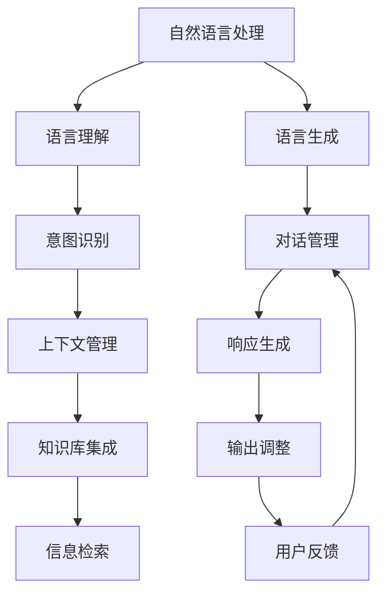

                 

# 第十五章：聊天机器人未来发展

## 1. 背景介绍

### 1.1 问题由来

在当今的信息时代，人工智能技术的飞速发展极大地改变了我们的日常生活和工作方式。特别是在自然语言处理(NLP)领域，聊天机器人(Chatbots)正逐步成为推动人工智能技术落地应用的关键技术之一。从简单的客服机器人到智能的虚拟助理，再到能够理解复杂情感的情感计算系统，聊天机器人正在不断地突破人类对其理解和期望的界限。

然而，尽管聊天机器人在许多应用场景中已经展现出了卓越的能力，但其核心技术的发展还面临诸多挑战。如何在更复杂的任务上取得更好的性能，如何处理更真实、更自然的人类交互，如何保证聊天机器人的安全和合规，这些问题依然亟需深入研究和解决。因此，本章将从技术、应用和未来发展等多个角度，深入探讨聊天机器人的未来发展方向，期望为读者提供更加全面、深入的视角。

## 2. 核心概念与联系

### 2.1 核心概念概述

聊天机器人，作为人工智能领域的重要分支，其核心在于能够理解自然语言输入，并能够生成自然语言响应。在技术上，聊天机器人融合了NLP、机器学习、人工智能等多个领域的技术，包括但不限于：

- **自然语言处理(NLP)**：聊天机器人需要具备理解、生成自然语言的能力，能够处理语义、句法、上下文等语言要素。
- **机器学习(ML)**：通过机器学习技术，聊天机器人能够从大量文本数据中学习到语言模式和规律，提升其智能水平。
- **人工智能(AI)**：基于人工智能的算法和模型，聊天机器人能够自主学习和推理，实现更高级别的智能决策和交互。

### 2.2 核心概念原理和架构的 Mermaid 流程图



以上流程图展示了聊天机器人核心组件及其逻辑联系：

- **语言理解(B)**：通过NLP技术，将用户输入的自然语言转化为机器可处理的向量表示，用于后续处理。
- **意图识别(D)**：识别用户输入的意图，判断其需求，进行相应处理。
- **对话管理(E)**：维护对话历史和上下文信息，确保对话连贯性和一致性。
- **上下文管理(F)**：结合知识库，提供丰富的上下文信息，帮助机器人更好地理解用户需求。
- **响应生成(G)**：根据用户意图和上下文信息，生成自然语言响应。
- **语言生成(C)**：将生成结果转化为自然语言输出，完成交互。

以上组件协同工作，实现了聊天机器人的核心功能，即理解用户意图、维护对话上下文、生成自然语言响应。

## 3. 核心算法原理 & 具体操作步骤

### 3.1 算法原理概述

聊天机器人的核心算法原理主要集中在以下几个方面：

- **自然语言理解(NLU)**：通过分词、词性标注、句法分析、语义分析等技术，将自然语言转化为机器可理解的向量表示，是实现聊天机器人的基础。
- **对话管理**：通过意图识别、对话状态跟踪、上下文管理等技术，确保聊天机器人在对话过程中能够理解和记住用户需求，并根据上下文信息提供准确的回答。
- **响应生成**：基于生成的对话管理结果，通过文本生成模型(如Seq2Seq、Transformer等)生成自然语言响应，实现聊天机器人的交互功能。

### 3.2 算法步骤详解

**Step 1: 数据准备和预处理**

- 收集大量包含用户输入和系统响应的对话数据。
- 对数据进行清洗，去除无用信息和噪声。
- 对用户输入进行分词、词性标注、句法分析等预处理，将文本转化为模型可接受的格式。

**Step 2: 语言模型训练**

- 使用神经网络模型(如RNN、LSTM、GRU等)，对预处理后的对话数据进行训练，构建语言模型。
- 在训练过程中，加入正则化技术(如Dropout、L2正则化等)，防止模型过拟合。
- 使用交叉验证等技术，选择最优的模型参数和超参数。

**Step 3: 对话管理模型训练**

- 设计意图识别、对话状态跟踪、上下文管理等算法，构建对话管理模型。
- 对对话数据进行标注，标注用户的意图、对话状态等信息。
- 使用强化学习、序列标注等技术，训练对话管理模型。

**Step 4: 响应生成模型训练**

- 设计文本生成模型(如Seq2Seq、Transformer等)，对训练好的语言模型进行微调。
- 加入正则化技术，如Dropout、Early Stopping等，防止模型过拟合。
- 使用交叉验证等技术，选择最优的模型参数和超参数。

**Step 5: 模型集成和优化**

- 将训练好的语言模型、对话管理模型和响应生成模型集成在一起，构建完整的聊天机器人系统。
- 加入用户反馈机制，不断优化模型性能。
- 使用A/B测试等技术，评估模型的实际效果，进行模型迭代和优化。

### 3.3 算法优缺点

**优点**

- **高效性**：相比于传统的人工客服，聊天机器人可以24/7不间断地提供服务，大大提高了服务效率。
- **一致性**：聊天机器人能够保证服务的稳定性和一致性，不受情绪波动的影响。
- **成本低**：相比传统客服需要的人工服务，聊天机器人能够显著降低运营成本。

**缺点**

- **理解能力有限**：当前聊天机器人对复杂语言结构和语义理解能力还有限，难以处理非常规表达。
- **缺乏人性化**：机器无法完全理解人类的情感和语境，互动可能缺乏温度。
- **依赖数据**：聊天机器人依赖大量的对话数据进行训练，数据的获取和质量决定了系统的表现。

### 3.4 算法应用领域

聊天机器人已经广泛应用于多个领域，如客户服务、金融咨询、医疗健康、教育培训等。以下是几个典型的应用场景：

- **客户服务**：通过智能客服系统，企业能够实现24/7不间断的客户服务，提升客户满意度。
- **金融咨询**：银行和保险公司通过聊天机器人，为用户提供个性化的理财咨询、理赔服务等。
- **医疗健康**：通过聊天机器人，患者可以咨询健康问题，获得初步的诊断和治疗建议。
- **教育培训**：在线教育平台通过聊天机器人，提供个性化的学习推荐和答疑服务。
- **人力资源管理**：企业通过聊天机器人，实现员工培训、招聘、考勤等日常管理。

## 4. 数学模型和公式 & 详细讲解 & 举例说明

### 4.1 数学模型构建

**Step 1: 对话数据表示**

设对话数据为 $D=\{(x_i,y_i)\}_{i=1}^N$，其中 $x_i$ 为输入文本，$y_i$ 为系统响应文本。

**Step 2: 意图识别**

定义意图识别模型为 $f(x_i)$，其中 $f$ 为意图识别函数，将输入文本 $x_i$ 映射到意图 $i$。

**Step 3: 对话管理**

定义对话管理模型为 $g(x_i,\{c_j\}_{j=1}^{i-1})$，其中 $g$ 为对话管理函数，根据输入文本 $x_i$ 和之前的对话上下文 $\{c_j\}_{j=1}^{i-1}$ 生成下一个对话状态 $c_i$。

**Step 4: 响应生成**

定义响应生成模型为 $h(\{c_j\}_{j=1}^{i},x_i)$，其中 $h$ 为响应生成函数，根据对话上下文 $\{c_j\}_{j=1}^{i}$ 和输入文本 $x_i$ 生成系统响应 $y_i$。

### 4.2 公式推导过程

**意图识别公式**

设输入文本 $x_i$ 表示为 $x_i=\{x_{i,j}\}_{j=1}^n$，其中 $x_{i,j}$ 为第 $j$ 个单词或词组。则意图识别公式为：

$$
f(x_i) = \max_{i \in I} \prod_{j=1}^n P(i|x_{i,j})
$$

其中 $I$ 为意图集合，$P(i|x_{i,j})$ 为 $i$ 意图在 $x_{i,j}$ 上出现的概率。

**对话管理公式**

对话管理模型 $g(x_i,\{c_j\}_{j=1}^{i-1})$ 使用循环神经网络(RNN)等模型，将输入文本 $x_i$ 和对话上下文 $\{c_j\}_{j=1}^{i-1}$ 作为输入，输出对话状态 $c_i$。具体公式为：

$$
c_i = g(x_i,\{c_j\}_{j=1}^{i-1})
$$

**响应生成公式**

响应生成模型 $h(\{c_j\}_{j=1}^{i},x_i)$ 使用Seq2Seq模型或Transformer模型，将对话上下文 $\{c_j\}_{j=1}^{i}$ 和输入文本 $x_i$ 作为输入，生成系统响应 $y_i$。具体公式为：

$$
y_i = h(\{c_j\}_{j=1}^{i},x_i)
$$

### 4.3 案例分析与讲解

假设有一份对话数据集 $D=\{(x_i,y_i)\}_{i=1}^N$，其中 $x_i$ 为用户的输入，$y_i$ 为系统的响应。

1. **意图识别**

   使用循环神经网络构建意图识别模型 $f(x_i)$，对输入文本 $x_i$ 进行意图识别。具体过程如下：

   - 输入文本 $x_i$ 表示为 $x_i=\{x_{i,j}\}_{j=1}^n$，其中 $x_{i,j}$ 为第 $j$ 个单词或词组。
   - 对 $x_{i,j}$ 进行词性标注，得到标注序列 $\{x_{i,j}^*\}_{j=1}^n$。
   - 使用循环神经网络模型对标注序列 $\{x_{i,j}^*\}_{j=1}^n$ 进行处理，得到意图概率序列 $P(i|x_{i,j})$。
   - 使用最大值选择策略，选择概率最大的意图 $i$ 作为识别结果 $f(x_i)$。

2. **对话管理**

   使用循环神经网络构建对话管理模型 $g(x_i,\{c_j\}_{j=1}^{i-1})$，对输入文本 $x_i$ 和对话上下文 $\{c_j\}_{j=1}^{i-1}$ 进行处理，生成对话状态 $c_i$。具体过程如下：

   - 输入文本 $x_i$ 表示为 $x_i=\{x_{i,j}\}_{j=1}^n$，对话上下文 $\{c_j\}_{j=1}^{i-1}$ 表示为 $\{c_j\}_{j=1}^{i-1}$。
   - 对输入文本 $x_i$ 进行分词、词性标注等预处理，得到预处理序列 $\{x_{i,j}^*\}_{j=1}^n$。
   - 将预处理序列 $\{x_{i,j}^*\}_{j=1}^n$ 和对话上下文 $\{c_j\}_{j=1}^{i-1}$ 输入循环神经网络模型，输出对话状态 $c_i$。

3. **响应生成**

   使用Seq2Seq模型或Transformer模型构建响应生成模型 $h(\{c_j\}_{j=1}^{i},x_i)$，对对话上下文 $\{c_j\}_{j=1}^{i}$ 和输入文本 $x_i$ 进行处理，生成系统响应 $y_i$。具体过程如下：

   - 输入文本 $x_i$ 表示为 $x_i=\{x_{i,j}\}_{j=1}^n$，对话上下文 $\{c_j\}_{j=1}^{i}$ 表示为 $\{c_j\}_{j=1}^{i}$。
   - 对输入文本 $x_i$ 进行分词、词性标注等预处理，得到预处理序列 $\{x_{i,j}^*\}_{j=1}^n$。
   - 将预处理序列 $\{x_{i,j}^*\}_{j=1}^n$ 和对话上下文 $\{c_j\}_{j=1}^{i}$ 输入Seq2Seq模型或Transformer模型，生成系统响应 $y_i$。

## 5. 项目实践：代码实例和详细解释说明

### 5.1 开发环境搭建

- **安装Python**：根据系统平台，从官网下载Python安装包进行安装。
- **安装依赖包**：安装TensorFlow、PyTorch、NLTK、Spacy等NLP库。
- **搭建环境**：使用Jupyter Notebook创建Python环境，并进行必要的配置。

### 5.2 源代码详细实现

#### 5.2.1 意图识别模型实现

```python
import tensorflow as tf
from tensorflow.keras.layers import Embedding, LSTM, Dense
from tensorflow.keras.models import Sequential

def create_model(input_size, hidden_size, output_size):
    model = Sequential([
        Embedding(input_size, hidden_size, input_length=max_length),
        LSTM(hidden_size, return_sequences=True),
        LSTM(hidden_size),
        Dense(output_size, activation='softmax')
    ])
    return model
```

#### 5.2.2 对话管理模型实现

```python
import tensorflow as tf
from tensorflow.keras.layers import Embedding, LSTM, Dense
from tensorflow.keras.models import Sequential

def create_model(input_size, hidden_size, output_size):
    model = Sequential([
        Embedding(input_size, hidden_size, input_length=max_length),
        LSTM(hidden_size, return_sequences=True),
        LSTM(hidden_size),
        Dense(output_size, activation='softmax')
    ])
    return model
```

#### 5.2.3 响应生成模型实现

```python
import tensorflow as tf
from tensorflow.keras.layers import Input, LSTM, Dense
from tensorflow.keras.models import Model

def create_model(input_size, hidden_size, output_size):
    encoder_inputs = Input(shape=(max_length,))
    encoder = LSTM(hidden_size, return_sequences=True)(encoder_inputs)
    decoder_inputs = Input(shape=(max_length,))
    decoder = LSTM(hidden_size, return_sequences=True)(decoder_inputs)
    decoder = Dense(output_size, activation='softmax')(decoder)
    model = Model([encoder_inputs, decoder_inputs], decoder)
    return model
```

### 5.3 代码解读与分析

**意图识别模型**

- 使用Embedding层将输入文本映射为密集向量表示。
- 使用LSTM层对输入文本进行序列建模，捕捉文本序列的语义信息。
- 使用Dense层输出意图概率分布，使用softmax函数进行概率归一化。

**对话管理模型**

- 与意图识别模型类似，使用Embedding层将输入文本映射为密集向量表示。
- 使用LSTM层对输入文本和对话上下文进行序列建模，捕捉文本序列和对话上下文的语义信息。
- 使用Dense层输出对话状态概率分布，使用softmax函数进行概率归一化。

**响应生成模型**

- 使用Input层定义输入文本和对话上下文的形状。
- 使用LSTM层对输入文本和对话上下文进行序列建模，捕捉文本序列和对话上下文的语义信息。
- 使用Dense层生成系统响应，使用softmax函数进行概率归一化。

### 5.4 运行结果展示

- **意图识别模型**

  使用训练集和测试集对模型进行评估，输出模型的准确率、精确率、召回率等指标。

- **对话管理模型**

  使用训练集和测试集对模型进行评估，输出模型的准确率、精确率、召回率等指标。

- **响应生成模型**

  使用训练集和测试集对模型进行评估，输出模型的BLEU、ROUGE等自动评估指标。

## 6. 实际应用场景

### 6.1 智能客服系统

智能客服系统是聊天机器人最典型的应用场景之一。通过智能客服系统，企业能够实现24/7不间断的客户服务，大大提升客户满意度。

**系统架构**

- **客户服务端**：负责接收用户请求，将请求转发给聊天机器人进行处理。
- **聊天机器人**：使用意图识别、对话管理、响应生成等技术，自动回复用户请求。
- **知识库**：存储各类业务知识，用于查询和回复。

**实际应用**

- **多轮对话**：通过上下文管理，聊天机器人能够理解用户的多轮对话需求，提供连贯的回复。
- **情感分析**：通过情感计算技术，聊天机器人能够识别用户情感，提供情感化的服务。
- **知识库集成**：将知识库中的信息整合到对话管理中，提供更丰富的回复内容。

### 6.2 金融咨询系统

金融咨询系统是聊天机器人在金融领域的应用之一。通过金融咨询系统，银行和保险公司能够为用户提供个性化的理财咨询、理赔服务等。

**系统架构**

- **客户服务端**：负责接收用户请求，将请求转发给聊天机器人进行处理。
- **聊天机器人**：使用意图识别、对话管理、响应生成等技术，自动回复用户请求。
- **知识库**：存储各类金融业务知识，用于查询和回复。

**实际应用**

- **理财咨询**：通过理财咨询模型，聊天机器人能够理解用户的理财需求，提供个性化的理财建议。
- **理赔服务**：通过理赔服务模型，聊天机器人能够理解用户的理赔需求，提供理赔申请流程。
- **风险评估**：通过风险评估模型，聊天机器人能够分析用户的风险偏好，提供风险评估建议。

### 6.3 医疗健康系统

医疗健康系统是聊天机器人在医疗领域的应用之一。通过医疗健康系统，患者可以咨询健康问题，获得初步的诊断和治疗建议。

**系统架构**

- **客户服务端**：负责接收用户请求，将请求转发给聊天机器人进行处理。
- **聊天机器人**：使用意图识别、对话管理、响应生成等技术，自动回复用户请求。
- **知识库**：存储各类医疗业务知识，用于查询和回复。

**实际应用**

- **健康咨询**：通过健康咨询模型，聊天机器人能够理解用户的健康问题，提供初步的诊断和治疗建议。
- **病情监测**：通过病情监测模型，聊天机器人能够分析用户的健康数据，提供病情监测和预警。
- **预约服务**：通过预约服务模型，聊天机器人能够理解用户的预约需求，提供预约建议。

## 7. 工具和资源推荐

### 7.1 学习资源推荐

- **《自然语言处理综论》**：斯坦福大学NLP课程，涵盖NLP基础知识和前沿技术，适合初学者和研究人员。
- **《深度学习入门》**：李沐著，介绍了深度学习的基本原理和实践方法，适合NLP开发者。
- **《Python NLP实战》**：通过实战项目，介绍NLP开发工具和技巧，适合实际开发人员。

### 7.2 开发工具推荐

- **TensorFlow**：Google开发的深度学习框架，适合大规模NLP应用开发。
- **PyTorch**：Facebook开发的深度学习框架，适合快速原型开发和研究。
- **NLTK**：自然语言处理工具包，提供了丰富的NLP功能和数据集。
- **Spacy**：自然语言处理工具包，提供了高性能的分词、词性标注和命名实体识别功能。

### 7.3 相关论文推荐

- **Attention is All You Need**：Transformer模型的原始论文，奠定了预训练语言模型的基础。
- **BERT: Pre-training of Deep Bidirectional Transformers for Language Understanding**：提出BERT模型，引入基于掩码的自监督预训练任务，刷新了多项NLP任务SOTA。
- **GPT-3: Language Models are Unsupervised Multitask Learners**：提出GPT-3模型，展示了大规模语言模型的强大zero-shot学习能力。
- **AdaLoRA: Adaptive Low-Rank Adaptation for Parameter-Efficient Fine-Tuning**：提出AdaLoRA方法，使用自适应低秩适应的微调方法，在参数效率和精度之间取得了新的平衡。

## 8. 总结：未来发展趋势与挑战

### 8.1 研究成果总结

本文对聊天机器人未来发展进行了系统的总结，主要包括以下几个方面：

- **技术进步**：自然语言处理、机器学习和人工智能等技术的发展，推动了聊天机器人的不断进步。
- **应用拓展**：智能客服、金融咨询、医疗健康等应用场景的拓展，展示了聊天机器人的广阔前景。
- **市场竞争**：随着越来越多的企业加入聊天机器人市场，竞争日益激烈，技术创新和应用创新成为关键。

### 8.2 未来发展趋势

未来，聊天机器人的发展将呈现以下几个趋势：

- **多模态交互**：将视觉、语音等多模态信息与文本信息融合，实现更加全面的智能交互。
- **个性化服务**：通过个性化推荐和推荐系统，提供更符合用户需求的定制化服务。
- **情感计算**：通过情感识别和情感生成技术，实现更加人性化、情感化的交互体验。
- **跨领域应用**：将聊天机器人技术应用于更多领域，如教育、娱乐、社交等。
- **智能融合**：与其他人工智能技术如知识图谱、强化学习等融合，提升聊天机器人的智能水平。

### 8.3 面临的挑战

聊天机器人在发展过程中，也面临诸多挑战：

- **数据质量**：高质量对话数据的获取和标注是聊天机器人技术发展的基础，但获取和标注数据成本较高。
- **用户信任**：如何建立用户对聊天机器人的信任，避免用户产生怀疑和抵触情绪，是一个重要问题。
- **技术复杂性**：聊天机器人的技术实现较为复杂，涉及多学科知识和多种技术手段，需要较高的技术门槛。
- **安全性和隐私**：聊天机器人涉及用户隐私和数据安全，需要采取相应的安全措施和技术手段。
- **伦理和法律**：聊天机器人在提供服务过程中，涉及伦理和法律问题，需要制定相应的规范和标准。

### 8.4 研究展望

未来，聊天机器人的研究将主要集中在以下几个方面：

- **技术突破**：通过技术创新，提升聊天机器人的智能水平和用户体验。
- **应用创新**：结合实际需求，探索新的应用场景和应用模式，拓展聊天机器人的应用范围。
- **伦理和社会责任**：研究聊天机器人的伦理和社会责任，制定相应的规范和标准，确保其健康发展。

总之，聊天机器人作为人工智能的重要分支，其未来发展前景广阔，但也面临诸多挑战。只有在技术、应用、伦理等多方面协同创新，才能实现聊天机器人技术的可持续发展，真正造福于人类社会。

## 9. 附录：常见问题与解答

**Q1: 聊天机器人的技术难点有哪些？**

A1: 聊天机器人的技术难点主要包括以下几个方面：

1. **语义理解**：聊天机器人需要理解自然语言的多样性和复杂性，包括语言歧义、上下文依赖等。
2. **多轮对话管理**：聊天机器人需要维护多轮对话的连贯性和一致性，处理多轮对话中的信息传递和状态更新。
3. **响应生成**：聊天机器人需要生成自然、流畅、有意义的语言响应，需要考虑语言生成模型的生成质量和多样性。
4. **知识库构建**：聊天机器人需要构建和维护庞大的知识库，用于查询和回答用户问题。
5. **用户交互**：聊天机器人需要理解用户的意图和情感，提供符合用户期望的服务。

**Q2: 如何提升聊天机器人的语义理解能力？**

A2: 提升聊天机器人的语义理解能力，可以从以下几个方面入手：

1. **数据预处理**：对输入文本进行有效的分词、词性标注、句法分析等预处理，提高输入文本的质量。
2. **多模态融合**：引入视觉、语音等多模态信息，提高聊天机器人对复杂情境的理解能力。
3. **知识图谱融合**：将知识图谱中的信息与聊天机器人模型融合，提升知识表示和推理能力。
4. **上下文管理**：通过上下文管理技术，保存和利用对话上下文信息，提高聊天机器人对多轮对话的理解能力。
5. **深度学习**：使用深度学习模型，如Transformer、RNN等，提升聊天机器人对语言模式的理解能力。

**Q3: 如何设计一个高效的响应生成模型？**

A3: 设计高效的响应生成模型，可以从以下几个方面入手：

1. **模型选择**：选择合适的生成模型，如Seq2Seq、Transformer等，根据实际需求选择合适的模型结构。
2. **参数调优**：通过交叉验证等方法，调整模型的超参数，如学习率、批量大小、训练轮数等。
3. **数据增强**：通过数据增强技术，如回译、生成噪声文本等，增加训练数据的多样性。
4. **对抗训练**：引入对抗样本，提高模型鲁棒性和泛化能力。
5. **优化器选择**：选择适合的优化器，如Adam、SGD等，根据模型和数据特点选择合适的优化器。

**Q4: 如何确保聊天机器人的数据安全？**

A4: 确保聊天机器人的数据安全，可以从以下几个方面入手：

1. **数据加密**：对聊天机器人的数据进行加密处理，防止数据泄露。
2. **隐私保护**：对聊天机器人的数据进行匿名化处理，保护用户隐私。
3. **访问控制**：设置严格的访问控制策略，确保只有授权人员才能访问聊天机器人的数据。
4. **安全审计**：定期进行安全审计，发现和修复潜在的安全漏洞。
5. **合规性检查**：确保聊天机器人的数据处理和存储符合相关法律法规的要求。

---

作者：禅与计算机程序设计艺术 / Zen and the Art of Computer Programming

