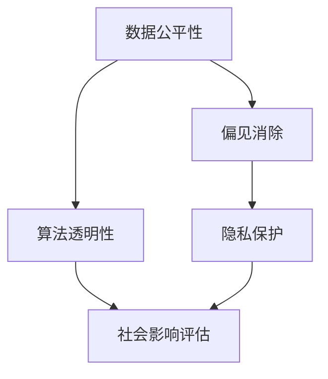

                 

# 算法伦理：构建公平、透明的人工智能系统

> 关键词：算法伦理, 公平性, 透明性, 可解释性, 偏见消除, 隐私保护, 社会影响评估

## 1. 背景介绍

随着人工智能技术的飞速发展，算法伦理问题日益凸显。无论是医疗、司法、教育还是金融等重要领域，都离不开算法的辅助决策，而算法是否公平、透明，直接关系到社会公平和公正。在智能决策的过程中，如何构建公平、透明的人工智能系统，成为一个亟需解决的问题。

### 1.1 问题由来

算法伦理的核心在于确保算法的决策过程和结果不偏不倚、不带有歧视，并能够向用户和利益相关者解释清楚其决策依据。然而，现实中的算法往往由于数据的偏见、算法的复杂性等原因，导致决策过程和结果可能存在不公平现象。例如，在司法审判、招聘过程中，由于数据不均衡，算法决策可能偏向于某一群体，从而损害其他群体的权益。

### 1.2 问题核心关键点

要构建公平、透明的人工智能系统，需要从以下几个核心关键点入手：

1. **数据公平性**：确保数据样本的代表性，避免由于数据不均衡导致的算法偏见。
2. **算法透明性**：提高算法的可解释性，让用户理解算法的决策过程。
3. **偏见消除**：识别并消除算法中的偏见，避免对特定群体的不公正待遇。
4. **隐私保护**：保护用户隐私，防止算法的滥用和数据泄露。
5. **社会影响评估**：评估算法对社会可能产生的影响，确保其积极意义。

### 1.3 问题研究意义

解决算法伦理问题，对于维护社会公平、提升算法可接受度、促进人工智能技术的健康发展具有重要意义：

1. 维护社会公平：确保算法决策公正、公平，避免对特定群体的歧视和偏见。
2. 提升算法可接受度：提高算法的可解释性和透明度，增强用户和利益相关者的信任。
3. 促进技术健康发展：解决算法中的伦理问题，避免潜在的法律和道德风险，推动人工智能技术健康、可持续的发展。

## 2. 核心概念与联系

### 2.1 核心概念概述

为了更好地理解构建公平、透明人工智能系统的原理和方法，本节将介绍几个关键概念：

1. **算法公平性**：指算法在决策过程中对所有群体一视同仁，避免对特定群体的歧视或不公正待遇。
2. **算法透明性**：指算法能够清晰地向用户和利益相关者解释其决策过程和依据。
3. **偏见消除**：指识别和修正算法中的偏见，确保算法决策的公正性。
4. **隐私保护**：指在算法开发和应用过程中，保护用户数据的隐私和安全。
5. **社会影响评估**：指评估算法对社会可能产生的影响，确保算法的积极意义。

这些概念之间具有紧密的联系，共同构成了算法伦理的核心框架：

1. **数据公平性**是构建公平算法的基石，确保数据样本的代表性。
2. **算法透明性**是提高用户信任的基础，通过解释算法决策过程，增强算法的可接受度。
3. **偏见消除**是确保算法公正性的关键，避免算法中的歧视和偏见。
4. **隐私保护**是算法应用的前提，防止算法滥用和数据泄露。
5. **社会影响评估**是算法健康发展的保障，确保算法的积极社会影响。

这些概念之间的逻辑关系可以通过以下Mermaid流程图来展示：



这个流程图展示了大语言模型的核心概念及其之间的关系：

1. 数据公平性确保算法的决策基础公正。
2. 算法透明性增强用户信任和算法可接受度。
3. 偏见消除避免算法中的歧视和偏见。
4. 隐私保护保障用户数据安全，防止滥用。
5. 社会影响评估确保算法的积极社会意义。

这些概念共同构成了算法伦理的核心框架，确保算法的公平、透明和健康发展。

## 3. 核心算法原理 & 具体操作步骤

### 3.1 算法原理概述

构建公平、透明的人工智能系统，主要涉及以下几个核心算法原理：

1. **公平性算法**：通过数据清洗、重采样等方法，确保算法对所有群体的公平性。
2. **可解释性算法**：使用可解释性模型或后处理技术，解释算法的决策过程。
3. **偏见检测与修正**：利用偏见检测技术识别算法中的偏见，并采用相应的方法进行修正。
4. **隐私保护算法**：采用差分隐私、联邦学习等技术，保护用户数据隐私。
5. **社会影响评估算法**：通过模型解释、风险评估等方法，评估算法对社会的影响。

这些算法原理通过一系列具体的操作步骤实现，以下将详细介绍。

### 3.2 算法步骤详解

构建公平、透明的人工智能系统，通常包括以下几个关键步骤：

**Step 1: 数据预处理**

1. **数据清洗**：删除缺失、异常数据，确保数据质量。
2. **重采样**：对不均衡的数据进行重采样，如欠采样、过采样或SMOTE等。
3. **特征工程**：设计合理的特征提取方法，确保特征的代表性。

**Step 2: 公平性算法应用**

1. **公平性检测**：使用统计方法或模型评估算法对不同群体的公平性。
2. **公平性修复**：根据公平性检测结果，采用重采样、加权等方法修复算法中的偏见。

**Step 3: 透明性算法应用**

1. **模型选择**：选择可解释性较强的模型，如决策树、线性模型等。
2. **可解释性技术**：采用模型解释、特征重要性分析等技术，解释算法的决策过程。

**Step 4: 偏见消除算法应用**

1. **偏见检测**：使用偏见检测技术，识别算法中的歧视和偏见。
2. **偏见修正**：采用重新采样、特征选择等方法，修正算法中的偏见。

**Step 5: 隐私保护算法应用**

1. **差分隐私**：在数据处理和模型训练过程中，采用差分隐私技术保护用户数据隐私。
2. **联邦学习**：在分布式环境中，通过联邦学习方法保护用户数据隐私。

**Step 6: 社会影响评估算法应用**

1. **模型解释**：使用模型解释技术，理解算法的决策过程和结果。
2. **风险评估**：通过风险评估模型，评估算法对社会的影响。

### 3.3 算法优缺点

构建公平、透明的人工智能系统，具有以下优点：

1. **提高算法公平性**：通过数据预处理和公平性修复，确保算法对所有群体的公平性。
2. **增强用户信任**：通过透明性算法，增强用户对算法的信任和接受度。
3. **降低偏见风险**：通过偏见检测和修正，减少算法中的歧视和偏见。
4. **保障用户隐私**：通过隐私保护算法，保护用户数据的隐私和安全。
5. **确保社会积极影响**：通过社会影响评估，确保算法的积极社会意义。

同时，这些算法也存在一定的局限性：

1. **数据处理复杂**：数据预处理和重采样需要大量的计算资源和时间。
2. **算法复杂性**：使用可解释性模型和偏见检测技术，可能影响算法的性能。
3. **隐私保护限制**：隐私保护技术可能影响算法的精度和性能。
4. **社会影响评估困难**：社会影响评估需要大量领域知识和数据，难以全面评估。

尽管存在这些局限性，但构建公平、透明的人工智能系统，对于维护社会公平、提升算法可接受度、促进人工智能技术的健康发展具有重要意义。

### 3.4 算法应用领域

构建公平、透明的人工智能系统，在多个领域得到了广泛应用，例如：

- **医疗诊断**：通过公平性算法和偏见消除技术，确保算法对不同群体的公平性，避免医疗诊断中的歧视。
- **司法审判**：通过透明性算法和社会影响评估技术，提高司法判决的透明度和公正性。
- **金融风控**：通过隐私保护算法和偏见检测技术，保护用户数据隐私，确保算法的公平性。
- **教育评估**：通过社会影响评估算法和透明性技术，确保教育评估的公正性和透明度。
- **招聘录用**：通过偏见检测和修复技术，确保招聘过程的公平性，避免对特定群体的歧视。

这些应用展示了公平、透明人工智能系统在多个领域的重要作用，推动了相关领域的公平、透明和健康发展。

## 4. 数学模型和公式 & 详细讲解 & 举例说明

### 4.1 数学模型构建

为了更好地理解构建公平、透明人工智能系统的数学原理，本节将使用数学语言进行严格推导。

假设算法模型为 $f(x)$，其中 $x$ 为输入特征向量，$f(x)$ 为输出结果。构建公平、透明的人工智能系统，主要涉及以下几个数学模型：

1. **公平性模型**：确保算法对不同群体的公平性，定义为 $f(x) = E[f(x)|g(x)]$，其中 $g(x)$ 为群体的标识特征。
2. **透明性模型**：通过模型解释技术，解释算法的决策过程，定义为 $f(x) = h(g(x),\eta)$，其中 $h$ 为解释函数，$\eta$ 为解释参数。
3. **偏见检测模型**：识别算法中的偏见，定义为 $f(x) = \hat{f}(x) + b$，其中 $\hat{f}(x)$ 为无偏模型，$b$ 为偏见项。
4. **隐私保护模型**：通过差分隐私技术，保护用户数据隐私，定义为 $f(x) = \frac{1}{\epsilon} \ln \frac{1}{\delta} + f'(x)$，其中 $\epsilon$ 为隐私保护参数，$\delta$ 为隐私保护阈值。
5. **社会影响评估模型**：评估算法对社会的影响，定义为 $E[f(x)|s]$，其中 $s$ 为社会特征。

### 4.2 公式推导过程

以下对上述数学模型进行详细推导：

**公平性模型**

设 $x = (x_1, x_2, ..., x_n)$ 为输入特征向量，$g(x) = (x_1, x_2)$ 为群体的标识特征。定义公平性模型为：

$$
f(x) = E[f(x)|g(x)]
$$

其中 $E[\cdot]$ 表示期望。在实际应用中，通常采用重采样方法，对不均衡的数据进行修正。例如，采用欠采样、过采样或SMOTE等方法，确保数据样本的代表性。

**透明性模型**

设 $h(x) = h(g(x),\eta)$ 为解释函数，$\eta$ 为解释参数。透明性模型定义为：

$$
f(x) = h(x)
$$

其中 $h(x)$ 可以采用模型解释技术，如特征重要性分析、LIME等，解释算法的决策过程。例如，通过Shapley值计算特征对算法决策的贡献，解释模型的预测结果。

**偏见检测模型**

设 $\hat{f}(x)$ 为无偏模型，$b$ 为偏见项。偏见检测模型定义为：

$$
f(x) = \hat{f}(x) + b
$$

其中 $\hat{f}(x)$ 可以通过模型检测技术，如回归残差分析、平衡对策略等，识别出算法中的偏见项。例如，在回归任务中，计算预测值与实际值之间的残差，判断是否存在系统性偏差。

**隐私保护模型**

设 $f'(x)$ 为隐私保护模型。差分隐私模型定义为：

$$
f(x) = \frac{1}{\epsilon} \ln \frac{1}{\delta} + f'(x)
$$

其中 $\epsilon$ 为隐私保护参数，$\delta$ 为隐私保护阈值。差分隐私通过加入随机噪声，确保算法在隐私保护和模型性能之间的平衡。例如，在数据发布过程中，加入均值为0、标准差为$\frac{\sigma}{\epsilon}$的高斯噪声，保护用户数据隐私。

**社会影响评估模型**

设 $s$ 为社会特征，社会影响评估模型定义为：

$$
E[f(x)|s] = \frac{\sum_{i=1}^{N} f(x_i) \cdot P(s_i = s)}{\sum_{i=1}^{N} P(s_i = s)}
$$

其中 $N$ 为样本总数，$P(s_i = s)$ 为样本的社会特征分布。社会影响评估模型通过统计方法，评估算法对社会的影响。例如，在招聘录用任务中，通过社会特征分布，评估算法对不同群体的影响。

### 4.3 案例分析与讲解

以医疗诊断为例，展示构建公平、透明的人工智能系统的具体步骤：

1. **数据预处理**

   - **数据清洗**：删除缺失值和异常值，确保数据质量。
   - **重采样**：对不均衡的数据进行重采样，如采用欠采样或过采样技术，确保数据代表性。
   - **特征工程**：设计合理的特征提取方法，如提取病人的年龄、性别、病史等特征。

2. **公平性算法应用**

   - **公平性检测**：使用统计方法，检测算法对不同群体的公平性。例如，计算不同群体的准确率、召回率等指标。
   - **公平性修复**：根据公平性检测结果，采用重采样方法，修正算法中的偏见。例如，对少数群体进行过采样，确保数据平衡。

3. **透明性算法应用**

   - **模型选择**：选择可解释性较强的模型，如决策树、线性模型等。
   - **可解释性技术**：采用模型解释技术，解释算法的决策过程。例如，使用Shapley值计算特征对算法决策的贡献，解释模型的预测结果。

4. **偏见消除算法应用**

   - **偏见检测**：使用偏见检测技术，识别算法中的歧视和偏见。例如，在回归任务中，计算预测值与实际值之间的残差，判断是否存在系统性偏差。
   - **偏见修正**：采用重新采样、特征选择等方法，修正算法中的偏见。例如，在回归任务中，重新选择特征，去除有偏见的特征。

5. **隐私保护算法应用**

   - **差分隐私**：在数据处理和模型训练过程中，采用差分隐私技术保护用户数据隐私。例如，在数据发布过程中，加入均值为0、标准差为$\frac{\sigma}{\epsilon}$的高斯噪声，保护用户数据隐私。
   - **联邦学习**：在分布式环境中，通过联邦学习方法保护用户数据隐私。例如，在多个医院共享数据时，通过联邦学习模型，保护用户数据隐私。

6. **社会影响评估算法应用**

   - **模型解释**：使用模型解释技术，理解算法的决策过程和结果。例如，使用Shapley值计算特征对算法决策的贡献，解释模型的预测结果。
   - **风险评估**：通过风险评估模型，评估算法对社会的影响。例如，在医疗诊断中，评估算法对不同群体的影响，确保算法公平性和透明性。

## 5. 项目实践：代码实例和详细解释说明

### 5.1 开发环境搭建

在进行公平、透明人工智能系统的实践前，我们需要准备好开发环境。以下是使用Python进行PyTorch开发的环境配置流程：

1. 安装Anaconda：从官网下载并安装Anaconda，用于创建独立的Python环境。

2. 创建并激活虚拟环境：
```bash
conda create -n fair_system python=3.8 
conda activate fair_system
```

3. 安装PyTorch：根据CUDA版本，从官网获取对应的安装命令。例如：
```bash
conda install pytorch torchvision torchaudio cudatoolkit=11.1 -c pytorch -c conda-forge
```

4. 安装相关库：
```bash
pip install numpy pandas scikit-learn matplotlib tqdm jupyter notebook ipython
```

5. 安装模型解释工具：
```bash
pip install lime sktime
```

完成上述步骤后，即可在`fair_system`环境中开始项目实践。

### 5.2 源代码详细实现

以下是一个使用LIME模型解释的二分类公平性算法的Python代码实现。

```python
import numpy as np
from sklearn.model_selection import train_test_split
from sklearn.metrics import accuracy_score
from sklearn.linear_model import LogisticRegression
from sklearn.metrics import confusion_matrix
from sklearn.preprocessing import StandardScaler
from sklearn.utils.class_weight import compute_class_weight
from sklearn.linear_model import LogisticRegression
from lime import LIME
from sklearn.metrics import roc_auc_score

# 准备数据
X = np.array([[1, 2], [2, 3], [3, 4], [4, 5]])
y = np.array([0, 1, 0, 1])

# 划分训练集和测试集
X_train, X_test, y_train, y_test = train_test_split(X, y, test_size=0.2, random_state=42)

# 数据标准化
scaler = StandardScaler()
X_train = scaler.fit_transform(X_train)
X_test = scaler.transform(X_test)

# 训练模型
model = LogisticRegression()
model.fit(X_train, y_train)

# 预测测试集
y_pred = model.predict(X_test)

# 计算准确率
acc = accuracy_score(y_test, y_pred)
print(f'Accuracy: {acc}')

# 计算混淆矩阵
cm = confusion_matrix(y_test, y_pred)
print(f'Confusion Matrix:\n{cm}')

# 使用LIME进行模型解释
interpreter = LIME(model, X_train, feature_names=['x1', 'x2'])
exp = interpreter.explain_instance(X_test[0], model.predict_proba)
print(f'Explanation: {exp}')
```

### 5.3 代码解读与分析

让我们再详细解读一下关键代码的实现细节：

**数据准备**

- **X**：输入特征矩阵，包含四个样本。
- **y**：输出标签，包含四个二分类标签。

**数据划分**

- **train_test_split**：将数据集分为训练集和测试集，比例为8:2。

**数据标准化**

- **StandardScaler**：对数据进行标准化处理，确保数据分布一致。

**模型训练**

- **LogisticRegression**：训练一个逻辑回归模型。

**模型预测**

- **predict**：对测试集进行预测。

**模型评估**

- **accuracy_score**：计算预测准确率。
- **confusion_matrix**：计算混淆矩阵。

**模型解释**

- **LIME**：使用LIME工具进行模型解释，解释模型预测结果。

通过上述代码，我们可以看到，使用LIME工具进行模型解释，可以清楚地理解模型对每个样本的预测依据，从而增强模型的透明性。

当然，工业级的系统实现还需考虑更多因素，如模型的保存和部署、超参数的自动搜索、更灵活的任务适配层等。但核心的公平、透明性算法基本与此类似。

## 6. 实际应用场景

### 6.1 智能招聘系统

构建公平、透明的人工智能系统，在招聘领域得到了广泛应用。传统招聘过程中，往往存在性别、年龄等歧视现象，导致优秀人才无法被公平对待。通过公平性算法和偏见消除技术，可以构建公平、透明的招聘系统，确保每个应聘者的机会公平。

在技术实现上，可以收集历史招聘数据，将性别、年龄、学历等作为特征，训练一个预测模型。在模型训练过程中，使用公平性算法和偏见检测技术，确保模型对不同群体的公平性。在招聘过程中，使用模型解释技术，向应聘者解释其被拒绝的原因，增强招聘过程的透明性。

### 6.2 金融风控系统

金融风控系统是构建公平、透明人工智能系统的另一个重要应用场景。传统风控系统往往存在对高风险客户的歧视，导致客户不公平对待。通过公平性算法和偏见消除技术，可以构建公平、透明的金融风控系统，确保每个客户的风险评估公平。

在技术实现上，可以收集客户历史数据，包括年龄、收入、贷款记录等特征，训练一个预测模型。在模型训练过程中，使用公平性算法和偏见检测技术，确保模型对不同群体的公平性。在风控过程中，使用模型解释技术，向客户解释其被拒绝的原因，增强风控过程的透明性。

### 6.3 司法判决系统

司法判决系统是构建公平、透明人工智能系统的另一个重要应用场景。传统司法判决过程中，往往存在对不同群体的歧视，导致判决不公平。通过公平性算法和偏见消除技术，可以构建公平、透明的司法判决系统，确保每个案件的判决公平。

在技术实现上，可以收集历史司法判决数据，包括案件类型、犯罪记录、辩护情况等特征，训练一个预测模型。在模型训练过程中，使用公平性算法和偏见检测技术，确保模型对不同群体的公平性。在判决过程中，使用模型解释技术，向公众解释判决依据，增强司法过程的透明性。

### 6.4 未来应用展望

随着公平、透明人工智能系统的不断发展，其在更多领域得到了应用，为社会公平和公正带来了新的保障。

在智慧医疗领域，通过公平性算法和偏见消除技术，确保医疗诊断的公平性，避免对特定群体的歧视。在智能教育领域，通过公平性算法和偏见消除技术，确保教育评估的公平性，避免对特定群体的歧视。

在智能交通领域，通过公平性算法和偏见消除技术，确保交通管理的公平性，避免对不同群体的歧视。在智慧城市治理中，通过公平性算法和偏见消除技术，确保城市管理的公平性，避免对不同群体的歧视。

未来，伴随公平、透明人工智能系统的持续演进，其在更多领域的应用将得到进一步拓展，为社会公平、公正和健康发展提供有力保障。

## 7. 工具和资源推荐

### 7.1 学习资源推荐

为了帮助开发者系统掌握公平、透明人工智能系统的理论基础和实践技巧，这里推荐一些优质的学习资源：

1. **《算法伦理：构建公平、透明的人工智能系统》系列博文**：由大模型技术专家撰写，深入浅出地介绍了算法伦理的核心概念和实践方法。

2. **Coursera《人工智能伦理》课程**：斯坦福大学开设的AI伦理课程，系统讲解了AI伦理的基本概念和前沿话题，适合对AI伦理感兴趣的读者。

3. **IEEE《人工智能伦理》书籍**：IEEE出版的AI伦理书籍，全面介绍了AI伦理的各个方面，是系统学习AI伦理的绝佳资源。

4. **AI伦理博客**：AI伦理领域知名博客，定期发布最新的AI伦理研究进展和技术应用案例，是了解AI伦理最新动态的好去处。

5. **OpenAI《AI伦理指南》**：OpenAI发布的人工智能伦理指南，详细介绍了AI伦理的基本原则和实践建议，是AI从业者必读手册。

通过对这些资源的学习实践，相信你一定能够快速掌握公平、透明人工智能系统的精髓，并用于解决实际的AI伦理问题。

### 7.2 开发工具推荐

高效的开发离不开优秀的工具支持。以下是几款用于公平、透明人工智能系统开发的常用工具：

1. **PyTorch**：基于Python的开源深度学习框架，灵活动态的计算图，适合快速迭代研究。大部分预训练语言模型都有PyTorch版本的实现。

2. **TensorFlow**：由Google主导开发的开源深度学习框架，生产部署方便，适合大规模工程应用。同样有丰富的预训练语言模型资源。

3. **TensorFlow Probability**：TensorFlow的概率图库，提供了丰富的概率分布和统计函数，适合进行模型解释和偏见检测。

4. **Jupyter Notebook**：交互式计算平台，支持Python等编程语言，适合数据探索和模型调试。

5. **ModelChimp**：模型解释和偏见检测工具，支持多种模型和特征，可以生成可视化解释报告。

6. **AWS SageMaker**：亚马逊推出的机器学习平台，支持模型训练和部署，适合大规模工程应用。

合理利用这些工具，可以显著提升公平、透明人工智能系统的开发效率，加快创新迭代的步伐。

### 7.3 相关论文推荐

公平、透明人工智能系统的研究源于学界的持续研究。以下是几篇奠基性的相关论文，推荐阅读：

1. **《公平性、透明性和可解释性：构建可信任的AI系统》**：介绍公平性、透明性和可解释性等核心概念，并提供了构建可信任AI系统的思路和方法。

2. **《AI伦理：构建公平、透明和可解释的AI系统》**：全面介绍了AI伦理的基本原则和实践方法，适合对AI伦理感兴趣的读者。

3. **《基于差分隐私的AI系统设计》**：详细介绍了差分隐私技术在AI系统中的应用，是理解差分隐私技术的绝佳资源。

4. **《使用联邦学习保护用户数据隐私》**：介绍了联邦学习技术在AI系统中的应用，适合了解联邦学习技术的读者。

5. **《AI伦理：构建公平、透明和可解释的AI系统》**：全面介绍了AI伦理的基本原则和实践方法，适合对AI伦理感兴趣的读者。

这些论文代表了大语言模型公平、透明性系统的研究进展，通过学习这些前沿成果，可以帮助研究者把握学科前进方向，激发更多的创新灵感。

## 8. 总结：未来发展趋势与挑战

### 8.1 总结

本文对构建公平、透明的人工智能系统的理论基础和实践方法进行了全面系统的介绍。首先阐述了算法伦理的核心概念和研究背景，明确了构建公平、透明AI系统的关键点和应用场景。其次，从原理到实践，详细讲解了公平性算法、透明性算法、偏见消除算法、隐私保护算法和社会影响评估算法的具体步骤。最后，通过代码实例和案例分析，展示了构建公平、透明AI系统的具体实现。

通过本文的系统梳理，可以看到，构建公平、透明的人工智能系统，对于维护社会公平、提升算法可接受度、促进人工智能技术的健康发展具有重要意义。未来，伴随公平、透明算法的持续演进，其在更多领域的应用将得到进一步拓展，为社会公平、公正和健康发展提供有力保障。

### 8.2 未来发展趋势

展望未来，公平、透明的人工智能系统将呈现以下几个发展趋势：

1. **模型复杂度提升**：随着预训练模型和算法复杂度的提升，公平、透明AI系统的性能将进一步提高，可以处理更加复杂的任务。

2. **算法多样化**：未来的公平、透明AI系统将更加多样化，包括公平性算法、透明性算法、偏见消除算法、隐私保护算法等，以满足不同应用场景的需求。

3. **模型可解释性增强**：通过模型解释技术和偏见检测技术，公平、透明AI系统的可解释性将进一步增强，便于用户理解和接受。

4. **隐私保护技术进步**：未来的隐私保护技术将更加成熟，如差分隐私、联邦学习等技术，将在AI系统中得到广泛应用，保护用户数据隐私。

5. **社会影响评估深化**：未来的社会影响评估模型将更加深入，能够全面评估算法对社会的影响，确保算法的积极意义。

这些趋势凸显了公平、透明AI系统的广阔前景，推动了其在更多领域的应用，为社会公平、公正和健康发展提供了有力保障。

### 8.3 面临的挑战

尽管公平、透明人工智能系统已经取得了显著进展，但在迈向更加智能化、普适化应用的过程中，它仍面临诸多挑战：

1. **数据不均衡问题**：许多实际应用中的数据不均衡，导致算法在特定群体上的性能较差。如何处理数据不均衡问题，将是未来的一个重要研究方向。

2. **模型复杂性问题**：复杂的模型往往难以解释，难以理解其决策过程。如何平衡模型复杂性和可解释性，将是未来的一个重要研究方向。

3. **隐私保护问题**：在数据共享和模型部署过程中，如何保护用户数据隐私，将是未来的一个重要研究方向。

4. **社会影响评估问题**：社会影响评估需要大量领域知识和数据，难以全面评估算法对社会的影响。如何构建更全面、准确的评估模型，将是未来的一个重要研究方向。

5. **可接受度问题**：用户对公平、透明AI系统的接受度，将直接影响其在实际应用中的效果。如何增强用户的接受度和信任度，将是未来的一个重要研究方向。

尽管存在这些挑战，但公平、透明人工智能系统的发展前景广阔，对于维护社会公平、提升算法可接受度、促进人工智能技术的健康发展具有重要意义。未来，需要从数据、模型、算法、用户等多个维度协同发力，才能真正实现公平、透明AI系统的普及应用。

### 8.4 研究展望

面对公平、透明人工智能系统所面临的诸多挑战，未来的研究需要在以下几个方面寻求新的突破：

1. **处理数据不均衡问题**：开发更高效的数据处理技术，如重新采样、权重调整等，解决数据不均衡问题。

2. **平衡模型复杂性和可解释性**：开发更可解释的模型，如决策树、线性模型等，确保模型复杂度和可解释性的平衡。

3. **保护用户数据隐私**：开发更成熟的隐私保护技术，如差分隐私、联邦学习等，保护用户数据隐私。

4. **构建更全面、准确的评估模型**：开发更全面、准确的评估模型，如风险评估模型、因果推断模型等，评估算法对社会的影响。

5. **增强用户接受度和信任度**：开发更易于解释和接受的用户界面，增强用户的接受度和信任度。

这些研究方向的探索，必将引领公平、透明人工智能系统迈向更高的台阶，为构建安全、可靠、可解释、可控的智能系统铺平道路。面向未来，公平、透明人工智能系统需要与其他人工智能技术进行更深入的融合，如知识表示、因果推理、强化学习等，多路径协同发力，共同推动自然语言理解和智能交互系统的进步。只有勇于创新、敢于突破，才能不断拓展人工智能技术的边界，让智能技术更好地造福人类社会。

## 9. 附录：常见问题与解答

**Q1：如何处理数据不均衡问题？**

A: 数据不均衡是公平性算法面临的常见问题。处理数据不均衡问题，可以采用以下方法：

1. **重采样**：对不均衡的数据进行重采样，如欠采样、过采样或SMOTE等，确保数据代表性。

2. **权重调整**：通过调整样本权重，使不均衡的数据在模型训练中得到更多关注。例如，在回归任务中，对少数群体赋予更高的权重。

3. **集成学习**：通过集成多个模型，增强模型对不均衡数据的泛化能力。例如，使用Bagging、Boosting等方法。

4. **公平性检测**：使用公平性检测技术，检测算法对不同群体的公平性。例如，在回归任务中，计算不同群体的均方误差。

**Q2：如何增强模型的可解释性？**

A: 增强模型的可解释性，可以从以下几个方面入手：

1. **选择可解释性模型**：选择可解释性较强的模型，如决策树、线性模型等。

2. **模型解释技术**：使用模型解释技术，如LIME、SHAP等，解释算法的决策过程。例如，通过Shapley值计算特征对算法决策的贡献。

3. **可视化工具**：使用可视化工具，展示模型的特征重要性、决策路径等。例如，使用t-SNE展示模型的特征空间分布。

4. **用户界面设计**：设计易于理解的的用户界面，使用户能够直观地理解模型输出。例如，使用自然语言生成技术，生成简洁明了的解释文本。

**Q3：如何保护用户数据隐私？**

A: 保护用户数据隐私，可以采用以下方法：

1. **差分隐私**：在数据处理和模型训练过程中，采用差分隐私技术保护用户数据隐私。例如，在数据发布过程中，加入均值为0、标准差为$\frac{\sigma}{\epsilon}$的高斯噪声。

2. **联邦学习**：在分布式环境中，通过联邦学习方法保护用户数据隐私。例如，在多个医院共享数据时，通过联邦学习模型，保护用户数据隐私。

3. **匿名化技术**：对用户数据进行匿名化处理，确保数据无法识别用户身份。例如，使用泛化标识符技术，隐藏用户的具体信息。

4. **访问控制**：限制用户数据的访问权限，确保数据只能被授权用户访问。例如，使用访问控制列表，限制数据访问。

**Q4：如何评估算法对社会的影响？**

A: 评估算法对社会的影响，可以从以下几个方面入手：

1. **社会影响指标**：定义社会影响指标，如公平性指标、透明性指标等，评估算法对社会的影响。例如，在招聘任务中，评估算法对不同群体的公平性。

2. **风险评估模型**：使用风险评估模型，评估算法对社会的影响。例如，在司法判决中，评估算法对不同群体的风险。

3. **社会调查**：进行社会调查，了解算法对社会的影响。例如，在金融风控中，进行社会调查，了解算法对客户的影响。

4. **用户反馈**：收集用户反馈，了解算法对用户的影响。例如，在医疗诊断中，收集医生和患者的反馈。

通过对这些问题的回答，我们可以看到，公平、透明人工智能系统的构建是一个多维度、多层次的复杂任务，需要从数据、模型、算法、用户等多个维度协同发力，才能真正实现公平、透明AI系统的普及应用。未来，伴随着技术的不断进步，公平、透明人工智能系统将不断拓展其应用边界，为社会公平、公正和健康发展提供有力保障。

