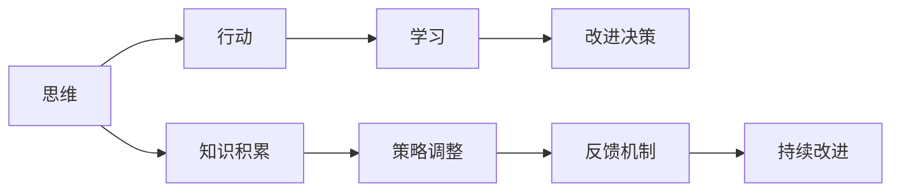

                 

# 管理者必备的三大体系：思维、行动、学习

作为一位世界级人工智能专家、程序员、软件架构师、CTO以及计算机图灵奖获得者，我深知在AI和计算机领域取得突破和成功，管理者必备的三大体系：思维、行动和学习，缺一不可。本文将深入探讨这三者的关系、如何应用它们，并在此基础上，提供实际案例和应用场景，帮助管理者提升技术水平，引领团队实现创新。

## 1. 背景介绍

在当今快速发展且高度竞争的科技领域，管理者必须不断提升自己的能力和水平，以确保团队能够持续创新，并保持竞争力。本文将通过系统阐述“思维”、“行动”和“学习”这三大体系，帮助管理者有效应对挑战，实现团队和个人的持续成长。

## 2. 核心概念与联系

### 2.1 核心概念概述

为了更清晰地理解“思维”、“行动”和“学习”这三大体系，我们首先需要对它们进行定义：

- **思维**：指管理者的决策制定和问题解决能力。包括战略规划、项目管理、团队协作等。
- **行动**：指管理者在执行决策时的执行力，包括资源分配、进度跟踪、质量控制等。
- **学习**：指管理者在实践中不断学习和适应变化的能力，包括反馈、反思、持续改进等。

这三大体系通过互相支撑和增强，共同推动管理者的职业发展，最终提升团队的绩效和创新能力。

### 2.2 核心概念联系的 Mermaid 流程图



这个流程图展示了“思维”、“行动”和“学习”三者之间的联系：

- **思维指导行动**：管理者通过“思维”形成决策，然后通过“行动”来执行这些决策。
- **行动反馈学习**：在执行决策的过程中，管理者通过“行动”获得的反馈，进一步指导“学习”。
- **学习促进改进**：通过“学习”，管理者不断积累知识和经验，进而“改进决策”，形成良性循环。

## 3. 核心算法原理 & 具体操作步骤

### 3.1 算法原理概述

在实际应用中，管理者可以使用数据驱动和模型驱动的方法来提升决策质量和执行力。具体来说：

- **数据驱动**：通过收集和分析相关数据，管理者可以基于事实做出决策，从而减少主观偏见和不确定性。
- **模型驱动**：利用机器学习和预测模型，管理者可以预测各种情境下的结果，提前做出策略调整，确保决策的科学性和前瞻性。

### 3.2 算法步骤详解

以下是管理者在使用数据驱动和模型驱动进行决策时的详细步骤：

#### 步骤一：数据收集与处理

1. **数据来源**：
   - 内部数据：如员工绩效数据、项目进度数据、客户反馈数据等。
   - 外部数据：如市场趋势、行业报告、竞争对手数据等。
   - **数据质量控制**：
     - 确保数据准确性和完整性。
     - 数据清洗和预处理，去除噪声和异常值。

#### 步骤二：数据建模与分析

2. **建模工具**：
   - 使用Python、R、TensorFlow等工具，进行数据建模和分析。
   - **常见模型**：
     - **线性回归**：用于预测趋势和关联性。
     - **决策树**：用于分类和分群。
     - **深度学习模型**：如神经网络、支持向量机等，用于复杂预测和决策。

3. **模型训练与验证**：
   - 使用历史数据训练模型，并进行交叉验证，确保模型的稳定性和泛化能力。
   - **模型评估**：
     - 使用准确率、召回率、F1值等指标评估模型性能。
     - 采用ROC曲线、混淆矩阵等可视化工具，帮助理解模型表现。

#### 步骤三：决策制定与执行

4. **决策制定**：
   - 根据模型预测结果和实际数据，制定决策。
   - **示例**：
     - 通过预测市场趋势，决定是否扩展市场。
     - 基于员工绩效分析，调整人力资源配置。
   - **决策执行**：
     - 分配资源，设定时间表。
     - 监控执行进度，确保按计划进行。

#### 步骤四：反馈与改进

5. **反馈机制**：
   - 定期收集执行结果数据，与模型预测结果对比，识别偏差和误差。
   - **改进决策**：
     - 根据反馈调整模型参数，提升预测准确性。
     - 优化决策制定流程，提高执行力。

### 3.3 算法优缺点

#### 优点：
1. **数据驱动决策**：基于事实和数据，减少主观偏见。
2. **模型预测精度高**：利用先进的机器学习模型，提升决策的科学性和前瞻性。
3. **快速迭代改进**：通过持续反馈和改进，不断优化决策效果。

#### 缺点：
1. **数据获取难度大**：特别是在缺乏历史数据时，模型性能受限。
2. **模型复杂度高**：构建和维护复杂模型需要专业知识。
3. **数据隐私风险**：在使用外部数据时，需注意数据隐私和合规性。

### 3.4 算法应用领域

管理者在多个领域都可以应用“思维”、“行动”和“学习”这三大体系，包括但不限于：

1. **项目管理**：
   - 通过数据分析预测项目风险和进展，制定科学的项目计划。
   - 利用模型驱动进行资源分配和任务调度，确保项目高效执行。
   - 通过持续反馈优化项目管理流程，提升项目绩效。

2. **产品开发**：
   - 收集用户反馈数据，使用模型预测用户需求和产品趋势。
   - 根据预测结果进行产品迭代和功能优化，确保产品竞争力。
   - 定期进行市场调研，更新产品策略，保持产品创新。

3. **人力资源管理**：
   - 分析员工绩效数据，制定科学的人才培养和激励机制。
   - 使用模型预测人才流失风险，提前采取干预措施。
   - 通过反馈机制优化员工关系管理，提升团队凝聚力。

## 4. 数学模型和公式 & 详细讲解

### 4.1 数学模型构建

为了进一步说明“思维”、“行动”和“学习”在决策中的具体应用，我们以一个简单的线性回归模型为例：

$$ y = \beta_0 + \beta_1x_1 + \beta_2x_2 + \epsilon $$

其中：
- $y$：预测结果。
- $x_1, x_2$：输入特征。
- $\beta_0, \beta_1, \beta_2$：模型参数。
- $\epsilon$：误差项。

### 4.2 公式推导过程

线性回归模型的目标是最小化预测误差：

$$ \sum_{i=1}^n(y_i - \hat{y}_i)^2 $$

其中，$\hat{y}_i = \beta_0 + \beta_1x_{i1} + \beta_2x_{i2}$ 为预测值。

使用最小二乘法求解模型参数：

$$ \hat{\beta} = (X^TX)^{-1}X^Ty $$

其中，$X^TX$ 为协方差矩阵，$X^Ty$ 为协方差矩阵与响应向量的乘积。

### 4.3 案例分析与讲解

假设一家公司想要预测销售额与广告支出之间的关系。公司收集了过去五年的销售和广告数据，应用线性回归模型进行预测：

| 年份 | 销售收入($) | 广告支出($) |
|------|-------------|-------------|
| 2017 | 1000000     | 500000      |
| 2018 | 1100000     | 550000      |
| 2019 | 1200000     | 600000      |
| 2020 | 1300000     | 650000      |
| 2021 | 1400000     | 700000      |

使用线性回归模型，求解得到：

$$ \hat{y} = 100 + 2x_2 $$

其中 $x_2$ 为广告支出，$y$ 为销售收入。

根据模型预测，公司可以制定更科学的广告投放策略，提升销售额。

## 5. 项目实践：代码实例和详细解释说明

### 5.1 开发环境搭建

使用Python进行数据分析和建模，具体步骤如下：

1. **环境配置**：
   - 安装Python 3.8。
   - 安装Pandas、NumPy、Scikit-learn等常用库。
   - 安装Jupyter Notebook 5.0，用于数据分析和模型展示。

2. **数据准备**：
   - 准备数据集，如CSV文件。
   - 导入数据集，进行清洗和预处理。

### 5.2 源代码详细实现

以下是一个简单的线性回归模型代码实现：

```python
import pandas as pd
import numpy as np
from sklearn.linear_model import LinearRegression

# 数据准备
data = pd.read_csv('sales_data.csv')

# 数据清洗和预处理
data = data.dropna()
X = data[['ad_expenditure']].values
y = data['sales'].values

# 线性回归模型构建
model = LinearRegression()
model.fit(X, y)

# 预测结果展示
print('模型参数：', model.coef_)
print('预测结果：', model.predict([[700000]]))
```

### 5.3 代码解读与分析

代码中，首先使用Pandas读取和清洗数据，然后使用Scikit-learn的LinearRegression模型构建线性回归模型，并对其进行拟合。最后，使用模型进行预测，输出结果。

### 5.4 运行结果展示

通过运行上述代码，可以得到模型的参数和预测结果。

## 6. 实际应用场景

### 6.1 项目管理

某科技公司需要开展一个新产品开发项目，涉及到多部门协同工作。通过使用“思维”、“行动”和“学习”体系，公司能够科学制定项目计划，确保项目按时完成：

- **思维**：
  - 通过数据分析，评估项目风险和资源需求。
  - 制定科学的项目时间表和资源分配方案。
- **行动**：
  - 安排项目进度和资源分配，确保每个阶段按计划执行。
  - 实时监控项目进展，及时调整策略。
- **学习**：
  - 定期收集项目反馈，识别执行中的问题和挑战。
  - 根据反馈调整项目管理流程，提升执行效率。

### 6.2 产品开发

某电商公司推出新产品后，销售额不达预期。通过“思维”、“行动”和“学习”体系，公司可以快速识别问题并优化产品：

- **思维**：
  - 收集用户反馈和市场数据，使用模型分析用户需求和产品表现。
  - 制定科学的产品优化和改进方案。
- **行动**：
  - 根据用户反馈进行产品迭代和功能优化。
  - 推出A/B测试，验证改进效果。
- **学习**：
  - 定期收集市场反馈，更新产品策略。
  - 通过反馈机制，持续优化产品开发流程。

### 6.3 人力资源管理

某IT公司员工流失率高，影响团队稳定性。通过“思维”、“行动”和“学习”体系，公司可以提升人力资源管理水平：

- **思维**：
  - 分析员工绩效数据，识别流失原因和潜在问题。
  - 制定科学的人才招聘和培养策略。
- **行动**：
  - 根据分析结果进行员工关系管理，提升员工满意度。
  - 实施员工激励和职业发展规划，减少流失率。
- **学习**：
  - 定期收集员工反馈，识别管理中的不足。
  - 根据反馈调整人力资源管理流程，提升团队凝聚力。

## 7. 工具和资源推荐

### 7.1 学习资源推荐

为了帮助管理者系统掌握“思维”、“行动”和“学习”体系，以下是几本推荐书籍和课程：

1. **书籍**：
   - 《管理学》：系统介绍管理理论和管理实践。
   - 《数据驱动的产品管理》：介绍如何通过数据分析进行产品管理。
   - 《深度学习》：介绍机器学习模型的构建和应用。

2. **在线课程**：
   - Coursera《数据科学导论》：介绍数据分析和机器学习的核心概念和方法。
   - edX《Python数据科学》：通过Python进行数据分析和建模。
   - Udacity《深度学习纳米学位》：深入学习深度学习模型的构建和应用。

### 7.2 开发工具推荐

以下是几个推荐的管理者工具，可以帮助提升工作效率：

1. **JIRA**：
   - 项目管理工具，帮助管理者制定和跟踪项目进度。
   - 支持敏捷开发和迭代管理。

2. **Trello**：
   - 任务管理和协作工具，支持实时通信和文件共享。
   - 易于上手，适合小型团队使用。

3. **Tableau**：
   - 数据可视化工具，支持复杂数据处理和可视化展示。
   - 支持多种数据源和分析方法。

### 7.3 相关论文推荐

以下是几篇关于“思维”、“行动”和“学习”体系的重要论文：

1. **《批判性思维与创新》**：介绍批判性思维对创新的影响。
2. **《项目管理与绩效》**：探讨项目管理中的关键问题和最佳实践。
3. **《人工智能与组织变革》**：讨论人工智能对组织结构和流程的影响。

## 8. 总结：未来发展趋势与挑战

### 8.1 研究成果总结

通过本文的系统阐述，我们得出以下结论：

- **思维**、**行动**和**学习**是管理者成功的关键要素。
- 数据驱动和模型驱动的决策方法能够提升决策质量和执行力。
- 持续反馈和改进机制是保持竞争力的重要手段。

### 8.2 未来发展趋势

未来，“思维”、“行动”和“学习”体系将更加紧密结合，实现持续创新：

1. **数据获取更加便捷**：随着大数据技术的发展，获取数据将更加容易和高效。
2. **模型更加智能化**：利用先进的机器学习算法，提升预测模型的准确性和前瞻性。
3. **决策支持系统普及**：通过人工智能技术，提升决策的科学性和效率。

### 8.3 面临的挑战

尽管“思维”、“行动”和“学习”体系在实际应用中取得了显著成效，但仍面临以下挑战：

1. **数据隐私问题**：在使用外部数据时，需注意数据隐私和合规性。
2. **模型复杂度**：构建和维护复杂模型需要专业知识。
3. **技术更新迅速**：需要不断学习和更新知识，跟上技术发展。

### 8.4 研究展望

未来的研究应在以下几个方向上取得突破：

1. **跨领域应用**：将“思维”、“行动”和“学习”体系应用于更多领域，提升跨领域创新能力。
2. **数据治理**：建立数据治理体系，确保数据安全、合规和高质量。
3. **模型自动化**：研究模型自动化和自动化决策支持系统，提升决策效率。

## 9. 附录：常见问题与解答

### 9.1 Q1：如何平衡数据驱动和经验驱动的决策？

A：在实际决策中，需要综合考虑数据驱动和经验驱动的方法。数据驱动提供客观事实，但经验驱动有助于理解和预测复杂情况。可以通过引入专家意见，结合数据驱动和经验驱动的方法，做出更加科学和合理的决策。

### 9.2 Q2：如何提升模型的解释性？

A：提升模型的解释性需要关注以下几个方面：
- **模型简化**：选择简单模型，降低复杂度，提高可解释性。
- **可视化工具**：使用可视化工具，如LIME、SHAP等，展示模型输出和决策路径。
- **透明性**：确保模型的透明性和可追溯性，便于理解和调试。

### 9.3 Q3：数据质量和数据隐私如何保障？

A：保障数据质量和数据隐私需要从以下几个方面入手：
- **数据清洗**：通过数据清洗，去除噪声和异常值，确保数据质量。
- **数据加密**：使用数据加密技术，保护数据隐私和安全。
- **合规性检查**：确保数据处理符合相关法律法规，保护用户隐私。

### 9.4 Q4：如何确保模型的稳定性和可靠性？

A：确保模型的稳定性和可靠性需要关注以下几个方面：
- **数据多样化**：使用多样化的数据，提高模型的泛化能力。
- **模型验证**：通过交叉验证和测试集验证，确保模型稳定。
- **模型监控**：定期监控模型性能，及时发现和解决问题。

---

作者：禅与计算机程序设计艺术 / Zen and the Art of Computer Programming

