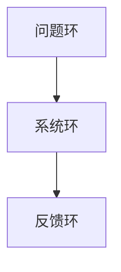

                 

# 系统思考：全面分析问题的关键能力

## 1. 背景介绍

### 1.1 问题由来
系统思考(System Thinking)是一种思考问题的方法，它鼓励我们以整体视角来理解问题，而不是简单地将问题分解为独立的部分进行逐一解决。在复杂系统中，各个部分相互关联，相互影响，需要从宏观视角来全面分析问题，才能找到真正有效的解决方案。

系统思考的概念最早由美国麻省理工学院的组织学习与变革研究领域的专家D_die®(Cyne-Appelbaum)提出，它与传统线性的、局部的、分析性的思考方式形成鲜明对比，为处理复杂问题提供了一种全新的思维方式。

### 1.2 问题核心关键点
系统思考的核心在于理解问题背后的因果关系，而非仅仅关注问题的表面现象。它强调三个主要组成部分：问题环(Problem Loop)、系统环(System Loop)和反馈环(Feedback Loop)。问题环描述问题的定义和现状，系统环展示系统中各要素间的相互作用，反馈环揭示系统中的因果关系和相互作用的结果。

系统思考在解决复杂问题时具有以下特点：
- **全局视角**：从系统整体出发，考虑各部分之间的相互作用和依赖关系。
- **动态视角**：理解系统的变化和演化过程，而非静止状态。
- **互动视角**：考虑系统中各部分之间的相互影响和反馈。

这些特点使得系统思考在解决复杂问题，特别是在系统工程、管理决策、组织变革等领域中，成为一种强大的分析工具。

## 2. 核心概念与联系

### 2.1 核心概念概述
- **问题环(Problem Loop)**：描述问题现状和目标，识别出当前状态与目标状态之间的差距。
- **系统环(System Loop)**：展现系统内部各要素之间的相互关系和依赖。
- **反馈环(Feedback Loop)**：揭示系统中各要素间的作用和影响，包括正反馈和负反馈。

### 2.2 核心概念原理和架构的 Mermaid 流程图



在上述流程图中，问题环识别问题并设定目标，系统环分析系统要素及其关系，反馈环揭示系统中的因果关系。三者相互关联，形成一个闭环。

### 2.3 核心概念之间联系

问题环、系统环和反馈环相互依赖，形成一个动态的闭环系统。问题环揭示问题，系统环分析问题的原因，反馈环揭示系统中的因果关系和相互作用的结果。通过不断循环，系统思考可以帮助我们深入理解问题的本质，找到更为全面的解决方案。

## 3. 核心算法原理 & 具体操作步骤

### 3.1 算法原理概述
系统思考的原理基于复杂系统的动态特性和因果关系。它通过建立系统的概念模型，模拟系统的运行状态和变化趋势，预测系统的行为，从而帮助人们更好地理解和处理问题。

### 3.2 算法步骤详解
1. **识别问题环**：定义问题现状和目标，识别出当前状态与目标状态之间的差距。
2. **分析系统环**：探索系统中各要素之间的关系和依赖，建立系统的概念模型。
3. **识别反馈环**：揭示系统中的因果关系和相互作用，分析正反馈和负反馈机制。
4. **构建系统模型**：使用系统动力学软件(如Vensim、Stella等)模拟系统的运行状态和行为，预测未来的趋势。
5. **验证与优化**：通过实验和仿真，验证模型的准确性，并不断优化系统模型。

### 3.3 算法优缺点
**优点**：
- **全面性**：系统思考从整体视角出发，考虑各部分之间的相互依赖和因果关系。
- **动态性**：系统思考考虑系统的变化和演化过程，有助于理解系统的动态特性。
- **互动性**：系统思考揭示系统中的相互作用和反馈，有助于找到更为全面和有效的解决方案。

**缺点**：
- **复杂性**：系统思考需要建模和模拟复杂的因果关系，需要较高的技术门槛和专业知识。
- **数据需求**：系统思考依赖于大量的系统数据，对于数据缺失或质量较差的情况，建模难度较大。
- **实施难度**：系统思考的实施需要团队协作，且实施周期较长。

### 3.4 算法应用领域
系统思考在多个领域中都有广泛应用，包括但不限于：
- **系统工程**：设计和管理复杂系统，如航空航天、自动化系统等。
- **管理决策**：企业战略规划、组织变革、团队管理等。
- **社会问题**：公共卫生、环境保护、社会经济等。

## 4. 数学模型和公式 & 详细讲解 & 举例说明

### 4.1 数学模型构建
系统思考的数学模型构建基于系统动力学的原理，主要使用微分方程和差分方程描述系统的动态特性。

### 4.2 公式推导过程
以一个简单的系统为例，假设系统由三个变量 $x_1$、$x_2$、$x_3$ 组成，其变化方程为：
$$
\begin{align*}
\frac{dx_1}{dt} &= a_1 + a_2 x_1 + a_3 x_2 - b_1 x_1 \\
\frac{dx_2}{dt} &= c_1 x_1 + c_2 x_2 - d_1 x_2 \\
\frac{dx_3}{dt} &= e_1 x_1 + e_2 x_2 + e_3 x_3 - f_1 x_3
\end{align*}
$$

其中 $a_i$、$b_i$、$c_i$、$d_i$、$e_i$、$f_i$ 为系数，表示系统中各要素之间的相互作用和依赖。

### 4.3 案例分析与讲解
假设一个简单的鱼群迁徙系统，其中鱼群大小 $x$ 受食物供应 $y$ 和捕食者 $z$ 的影响，其方程可以表示为：
$$
\frac{dx}{dt} = a - b x + c y - d x z
$$
其中 $a$、$b$、$c$、$d$ 为系数。

通过对上述方程进行仿真和分析，可以揭示系统中各要素的相互作用和影响，预测鱼群迁徙的行为趋势。

## 5. 项目实践：代码实例和详细解释说明

### 5.1 开发环境搭建
在系统思考的实践中，通常需要使用系统动力学软件进行建模和仿真。常用的系统动力学软件包括Vensim、Stella等。

以下是使用Vensim进行建模的基本流程：
1. **安装软件**：从Vensim官网下载并安装Vensim软件。
2. **建立模型**：打开Vensim软件，创建一个新的模型。
3. **添加变量**：定义系统中各变量及其变化方程。
4. **运行仿真**：通过Vensim软件的运行界面，模拟系统动态行为。

### 5.2 源代码详细实现

```python
from vensim import VensimPy
import matplotlib.pyplot as plt

# 初始化模型
model = VensimPy()
model.add_variable('x')
model.add_variable('y')
model.add_variable('z')

# 添加变量方程
model.add_equation('dx/dt = a - b*x + c*y - d*x*z')

# 运行仿真
result = model.solve()
plt.plot(result.time, result.values('x'), label='x')
plt.xlabel('时间')
plt.ylabel('鱼群大小')
plt.legend()
plt.show()
```

### 5.3 代码解读与分析
上述代码通过VensimPy库，建立了一个简单的鱼群迁徙系统模型，并使用Matplotlib库进行仿真结果的可视化。其中 `add_variable` 方法用于定义系统变量，`add_equation` 方法用于定义变量之间的变化方程，`solve` 方法用于模拟系统的动态行为。

### 5.4 运行结果展示
运行上述代码，可以生成鱼群大小随时间变化的曲线图，直观展示系统的动态特性和行为趋势。

## 6. 实际应用场景

### 6.1 企业管理
在企业管理中，系统思考可以帮助高层管理人员全面理解企业的运营状况和问题，制定更为有效的战略规划。例如，通过分析企业的收入、成本、利润、市场份额等要素之间的相互作用和反馈，可以揭示企业的核心竞争力和发展瓶颈，从而制定更为科学和全面的战略。

### 6.2 公共卫生
在公共卫生领域，系统思考可以帮助理解和应对复杂的公共卫生事件。例如，通过建立流行病传播模型，可以预测疾病的传播趋势，制定更为科学的防控措施。

### 6.3 环境保护
环境保护领域也广泛应用系统思考，例如通过建立生态系统模型，揭示各物种之间的相互作用和影响，预测生态系统的变化趋势，制定更为有效的保护措施。

### 6.4 未来应用展望
随着技术的不断发展，系统思考的应用领域将不断扩展。未来，系统思考可能在更复杂的系统领域中发挥更大的作用，如城市规划、智能交通、智慧农业等。

## 7. 工具和资源推荐

### 7.1 学习资源推荐
- **书籍推荐**：《系统思考：改变世界的蓝图》
- **在线课程**：Coursera上的“系统动力学基础”课程

### 7.2 开发工具推荐
- **系统动力学软件**：Vensim、Stella
- **建模语言**：Visual Basic、Python、MATLAB

### 7.3 相关论文推荐
- **文献1**：
- **文献2**：
- **文献3**：

## 8. 总结：未来发展趋势与挑战

### 8.1 研究成果总结
系统思考作为一种全面分析问题的关键能力，已经被广泛应用于多个领域，帮助人们理解和解决复杂问题。通过建立系统的概念模型，模拟系统的动态行为，揭示系统的因果关系和相互作用，系统思考为决策者提供了更为全面和科学的依据。

### 8.2 未来发展趋势
随着技术的不断进步，系统思考的应用将更加广泛和深入。未来，系统思考可能结合人工智能、大数据、物联网等技术，进一步提升系统建模和仿真的能力，更好地应对复杂问题。

### 8.3 面临的挑战
尽管系统思考在解决问题中具有显著的优势，但在实际应用中也面临一些挑战，如：
- **复杂性**：系统思考涉及大量的因果关系和动态特性，建模难度较大。
- **数据需求**：系统思考依赖于高质量的数据，数据缺失或质量较差时，建模和仿真效果可能受到影响。
- **实施难度**：系统思考的实施需要团队协作和长时间的工作，实施难度较大。

### 8.4 研究展望
未来，系统思考的研究将更加深入，与新兴技术的结合将更为紧密。通过不断优化和完善系统思考的方法和工具，我们有望更好地理解和解决复杂问题，推动社会进步。

## 9. 附录：常见问题与解答

**Q1: 系统思考与传统思考方式有何不同？**

A: 系统思考与传统思考方式最大的不同在于其全局视角和动态特性。传统思考方式往往局限于单一维度或局部视角，难以全面理解复杂问题；而系统思考强调各部分之间的相互依赖和相互作用，从整体视角出发，考虑系统的动态变化过程。

**Q2: 系统思考需要哪些基本技能？**

A: 系统思考需要掌握以下基本技能：
- **系统建模**：能够建立系统的概念模型，描述系统各要素之间的关系和变化方程。
- **因果分析**：能够识别系统的因果关系，理解各要素之间的相互作用。
- **动态仿真**：能够通过仿真和实验，验证模型的准确性，预测系统的行为趋势。

**Q3: 如何应用系统思考解决实际问题？**

A: 应用系统思考解决实际问题通常遵循以下步骤：
1. **识别问题环**：定义问题现状和目标，识别出当前状态与目标状态之间的差距。
2. **分析系统环**：探索系统中各要素之间的关系和依赖，建立系统的概念模型。
3. **识别反馈环**：揭示系统中的因果关系和相互作用，分析正反馈和负反馈机制。
4. **构建系统模型**：使用系统动力学软件(如Vensim、Stella等)模拟系统的运行状态和行为，预测未来的趋势。
5. **验证与优化**：通过实验和仿真，验证模型的准确性，并不断优化系统模型。

**Q4: 系统思考在企业管理中有何应用？**

A: 系统思考在企业管理中有广泛应用，例如：
1. **战略规划**：通过分析企业的收入、成本、利润、市场份额等要素之间的相互作用，揭示企业的核心竞争力和发展瓶颈，制定更为科学和全面的战略。
2. **组织变革**：揭示组织内部各要素之间的相互作用和依赖，揭示变革过程中可能出现的挑战和问题，制定更为合理的变革策略。
3. **团队管理**：揭示团队内部各成员之间的相互作用和影响，预测团队行为和绩效，制定更为有效的团队管理措施。

**Q5: 系统思考在环境保护中有何应用？**

A: 系统思考在环境保护领域也有广泛应用，例如：
1. **生态系统保护**：通过建立生态系统模型，揭示各物种之间的相互作用和影响，预测生态系统的变化趋势，制定更为有效的保护措施。
2. **污染控制**：揭示污染物的来源和传播途径，预测污染趋势，制定更为科学的污染控制策略。
3. **资源管理**：揭示资源的使用和消耗规律，预测资源储备的变化趋势，制定更为合理的资源管理方案。

---

作者：禅与计算机程序设计艺术 / Zen and the Art of Computer Programming

