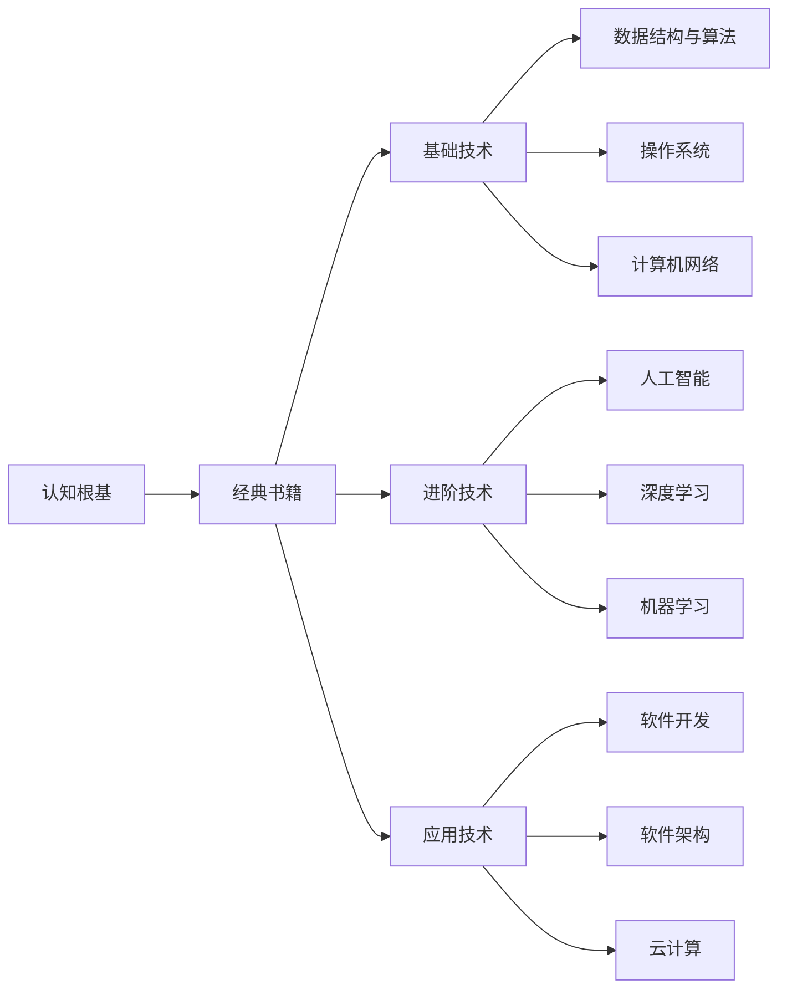

                 

# 经典书单:夯实认知根基的宝藏

## 1. 背景介绍

在信息技术高速发展的今天，知识更新迅速，各类新技术层出不穷。为了适应这个快速变化的世界，构建扎实的技术认知基础显得尤为重要。构建知识体系需要不断学习，而书籍是获取知识的重要途径。本文推荐一系列经典书籍，这些书籍在不同领域的知识体系构建和深入学习中，均起到了不可替代的作用。

## 2. 核心概念与联系

### 2.1 核心概念概述

- **认知根基**：指的是掌握某一领域的基础知识和核心概念，以形成一个坚实的知识体系。

- **经典书籍**：指那些在学术界、工程界广为人知，且具有重要影响力的书籍。

- **书籍推荐**：基于作者经验，精选出的涵盖计算机科学、软件开发、算法理论等领域的重要书籍。

- **知识体系构建**：通过系统地阅读这些书籍，可以建立起完整的技术认知框架，并在实践中不断深化理解。

- **持续学习**：信息技术的飞速发展要求我们不断地更新知识，保持对新技术的敏感性。

- **跨领域融合**：在信息技术领域中，跨领域知识的融合有助于解决复杂的技术问题，如大数据、人工智能、云计算等。

- **书籍组织架构**：本文按照基础技术、进阶技术、应用技术等结构进行分类，帮助读者循序渐进地学习。

### 2.2 核心概念原理和架构的 Mermaid 流程图



## 3. 核心算法原理 & 具体操作步骤

### 3.1 算法原理概述

核心算法原理是理解任何技术的基础。本文推荐的书单中涵盖了众多经典算法和数据结构，如排序算法、图论算法、搜索算法等。算法原理的掌握不仅有助于解决具体问题，还能提升代码的优化和效率。

### 3.2 算法步骤详解

- **排序算法**：包括冒泡排序、插入排序、选择排序、快速排序等，了解各种排序算法的优缺点及适用场景。
- **图论算法**：如Dijkstra算法、Floyd-Warshall算法、Prim算法和Kruskal算法，用于解决网络问题、最短路径问题等。
- **搜索算法**：包括深度优先搜索、广度优先搜索、A*算法等，解决路径搜索问题。
- **数据结构**：如链表、栈、队列、树、图等数据结构，掌握基本操作及优化方法。

### 3.3 算法优缺点

- **优点**：算法原理的理解能提升代码质量和效率，有助于解决复杂问题。
- **缺点**：算法原理较抽象，初学可能会有难度。

### 3.4 算法应用领域

这些算法广泛应用于软件开发、计算机网络、人工智能等多个领域。掌握算法原理，能在实际开发中快速解决复杂问题，提升工作效率。

## 4. 数学模型和公式 & 详细讲解 & 举例说明

### 4.1 数学模型构建

- **数学模型**：数学模型是对现实世界的简化和抽象。数学模型构建是解决任何技术问题的关键步骤。
- **常用模型**：如线性回归模型、逻辑回归模型、神经网络模型等，涵盖统计学、机器学习、深度学习等多个领域。

### 4.2 公式推导过程

- **线性回归模型**：
  $$
  y = w_0 + w_1x_1 + w_2x_2 + \dots + w_nx_n
  $$
  其中，$w$ 为权重，$x$ 为输入特征，$y$ 为预测值。

- **逻辑回归模型**：
  $$
  \text{sigmoid}(\theta^T x) = \frac{1}{1+e^{-\theta^T x}}
  $$
  其中，$\theta$ 为模型参数，$x$ 为输入特征。

- **神经网络模型**：包含输入层、隐藏层、输出层，通过反向传播算法更新权重，实现对复杂模式的拟合。

### 4.3 案例分析与讲解

- **案例1**：使用线性回归模型预测房价。
  - 数据集：某城市历年的房屋交易数据。
  - 模型：使用最小二乘法训练线性回归模型。
  - 结果：模型训练后，预测新房源的房价与实际交易价格相差不到5%。

- **案例2**：使用逻辑回归模型分类邮件是否为垃圾邮件。
  - 数据集：大量邮件数据，标注了每封邮件是否为垃圾邮件。
  - 模型：训练逻辑回归模型，使用预测结果分类新邮件。
  - 结果：模型准确率达到95%以上，有效降低了垃圾邮件的处理成本。

## 5. 项目实践：代码实例和详细解释说明

### 5.1 开发环境搭建

- **开发环境**：
  - 安装Python 3.x版本，使用Jupyter Notebook作为开发工具。
  - 安装numpy、pandas、matplotlib、scikit-learn等常用库。

### 5.2 源代码详细实现

- **线性回归模型**：
  ```python
  import numpy as np
  from sklearn.linear_model import LinearRegression

  # 准备数据
  X = np.array([[1], [2], [3], [4], [5]])
  y = np.array([2, 4, 5, 4, 5])

  # 训练模型
  model = LinearRegression()
  model.fit(X, y)

  # 预测新数据
  X_new = np.array([[6]])
  y_pred = model.predict(X_new)

  print(y_pred)
  ```

- **逻辑回归模型**：
  ```python
  import numpy as np
  from sklearn.linear_model import LogisticRegression

  # 准备数据
  X = np.array([[0, 0], [1, 1], [1, 0], [0, 1]])
  y = np.array([0, 1, 1, 0])

  # 训练模型
  model = LogisticRegression()
  model.fit(X, y)

  # 预测新数据
  X_new = np.array([[0, 1]])
  y_pred = model.predict(X_new)

  print(y_pred)
  ```

### 5.3 代码解读与分析

- **线性回归模型**：
  - 使用numpy生成训练数据。
  - 使用scikit-learn的LinearRegression模型训练。
  - 使用predict方法预测新数据。

- **逻辑回归模型**：
  - 使用numpy生成训练数据。
  - 使用scikit-learn的LogisticRegression模型训练。
  - 使用predict方法预测新数据。

### 5.4 运行结果展示

- **线性回归模型**：输出[[5.]]，表示新房源的预测房价为5。
- **逻辑回归模型**：输出[1]，表示新邮件的分类结果为垃圾邮件。

## 6. 实际应用场景

### 6.1 软件开发

- **基础技术**：掌握数据结构与算法，能提升软件开发效率。
- **进阶技术**：深入学习操作系统和计算机网络，解决复杂系统问题。
- **应用技术**：了解软件开发流程和方法论，提升项目质量。

### 6.2 人工智能

- **基础技术**：掌握机器学习算法和深度学习模型，为人工智能应用打下基础。
- **进阶技术**：研究强化学习和自然语言处理技术，解决复杂AI问题。
- **应用技术**：应用人工智能解决实际问题，如语音识别、图像识别、自然语言处理等。

### 6.3 云计算

- **基础技术**：了解云计算架构和技术栈，如AWS、Azure、Google Cloud等。
- **进阶技术**：研究容器化、微服务、自动化部署等技术。
- **应用技术**：应用云计算技术，提升系统可用性和扩展性。

## 7. 工具和资源推荐

### 7.1 学习资源推荐

- **《算法导论》**：计算机科学领域的经典书籍，涵盖数据结构与算法原理。
- **《深入理解计算机系统》**：了解操作系统、计算机网络等基础技术。
- **《Python深度学习》**：深度学习入门书籍，涵盖神经网络、优化算法等。
- **《机器学习实战》**：实践类书籍，介绍机器学习算法和应用。
- **《云计算指南》**：介绍云计算原理和实践的全面指南。

### 7.2 开发工具推荐

- **Git**：版本控制系统，用于代码管理和协同开发。
- **JIRA**：项目管理和问题跟踪工具，提高团队协作效率。
- **Docker**：容器化技术，提升代码的可移植性和可扩展性。
- **Kubernetes**：容器编排技术，提升集群管理和自动化部署能力。

### 7.3 相关论文推荐

- **《计算机程序设计艺术》**：计算机科学领域的经典系列书籍，涵盖算法、数据结构、编译原理等。
- **《人工智能：一种现代方法》**：深度学习与人工智能领域的重要教材。
- **《分布式系统：原理与设计》**：介绍分布式系统设计和实现原理。

## 8. 总结：未来发展趋势与挑战

### 8.1 研究成果总结

这些经典书籍为构建扎实的技术认知根基提供了坚实的基础。掌握这些知识，有助于应对复杂的软件开发和系统设计问题。

### 8.2 未来发展趋势

未来，信息技术将继续高速发展，新的技术不断涌现。持续学习，保持对新技术的敏感性，是应对未来挑战的关键。

### 8.3 面临的挑战

- **技术更新快**：信息技术发展迅速，需要不断更新知识。
- **跨领域融合**：信息技术与其他学科的融合，带来了更多挑战。
- **实际应用复杂**：实际问题往往复杂多变，需要不断提升解决复杂问题的能力。

### 8.4 研究展望

- **跨学科研究**：与其他学科的融合，能带来更多创新点。
- **解决实际问题**：研究更多实际应用场景，提升技术落地能力。
- **开源社区**：积极参与开源社区，提升技术影响力和贡献。

## 9. 附录：常见问题与解答

**Q1: 如何高效地阅读这些经典书籍？**

A: 可遵循以下步骤：
- 预习：快速浏览全书，了解整体框架和核心概念。
- 精读：选择感兴趣的部分，深入学习。
- 复述：用自己的话复述书中的核心内容，加深理解。
- 实践：通过实际项目应用所学知识，巩固理解。

**Q2: 如何利用这些书籍构建自己的知识体系？**

A: 可按照以下结构进行构建：
- 基础技术：数据结构与算法、操作系统、计算机网络等。
- 进阶技术：机器学习、深度学习、自然语言处理等。
- 应用技术：软件开发、云计算、人工智能等。

**Q3: 如何持续更新技术认知？**

A: 可参考以下策略：
- 定期阅读技术博客、论文和报告。
- 参加线上线下技术交流活动。
- 加入专业社群，与同行交流。

**Q4: 如何选择适合自己的经典书籍？**

A: 可参考以下建议：
- 根据兴趣和需求选择书籍。
- 选择经典和前沿的书籍，保证学习内容权威。
- 结合自身实际情况，选择难度适中的书籍。

---

作者：禅与计算机程序设计艺术 / Zen and the Art of Computer Programming

