                 

# 经典阅读:夯实认知根基的必由之路

> 关键词：经典阅读,认知根基,必由之路,深度学习,神经网络,认知科学,计算机科学,学术研究

## 1. 背景介绍

### 1.1 问题由来

在当前快速发展的科技时代，深度学习和人工智能(AI)成为了推动科技进步的重要引擎。然而，任何技术的发展都必须建立在坚实的理论基础之上。深度学习虽然取得了巨大的成功，但其背后的理论基础仍需要不断夯实和完善。其中，经典阅读作为学术研究的必由之路，对于构建深度学习的理论基础具有不可替代的重要作用。

### 1.2 问题核心关键点

经典阅读的核心目的在于：通过阅读和理解经典学术文献，帮助研究人员建立起坚实的理论基础，为深度学习研究提供扎实的理论支持和灵感。经典阅读不仅能够帮助研究者把握学科的前沿动态，还能在其基础上进行创新，推动深度学习技术的不断进步。

### 1.3 问题研究意义

经典阅读对于深度学习研究具有重要的意义：

1. 建立理论基础：经典文献往往包含了深度学习领域的基础理论和方法，通过阅读和理解这些文献，可以建立系统的理论框架。
2. 把握前沿动态：深度学习是一个快速发展的领域，通过阅读最新的经典文献，可以及时了解最新的研究方向和技术进展。
3. 启发创新思维：经典文献中蕴含着丰富的创新思维和独特视角，通过深度学习经典文献的阅读，可以激发新的研究思路和灵感。
4. 提高研究效率：经典文献已经经过时间的检验，其方法和结论往往具有一定的普适性和可靠性，通过经典阅读可以减少研究过程中的试错成本。
5. 增强研究深度：深度学习研究涉及多个交叉学科的知识，经典阅读可以丰富研究者的知识结构，提高研究的深度和广度。

## 2. 核心概念与联系

### 2.1 核心概念概述

为了更好地理解经典阅读在深度学习研究中的重要性，本节将介绍几个密切相关的核心概念：

- 经典文献：深度学习领域的重要研究成果，经过时间的考验，具有较高的学术价值和研究意义。
- 深度学习：基于神经网络，通过多层非线性变换，实现数据建模和模式识别的学习范式。
- 认知科学：研究人类认知过程和智能行为的学科，与深度学习有着密切的联系。
- 学术研究：基于严格的科学方法，通过实验、观察和理论分析，验证研究假设和结论的过程。

### 2.2 核心概念原理和架构的 Mermaid 流程图

```mermaid
graph LR
    A[深度学习] --> B[神经网络]
    B --> C[多层感知机]
    C --> D[卷积神经网络]
    D --> E[循环神经网络]
    E --> F[卷积循环神经网络]
    F --> G[深度强化学习]
    G --> H[迁移学习]
    H --> I[大模型预训练]
    I --> J[经典阅读]
    J --> K[理论基础]
    K --> L[创新思路]
    L --> M[研究效率]
    M --> N[研究深度]
    N --> O[学术研究]
```



这个流程图展示了深度学习、神经网络、经典阅读等概念之间的逻辑关系：

1. 深度学习基于神经网络，包含多层感知机、卷积神经网络、循环神经网络等。
2. 经典阅读通过理解深度学习领域的经典文献，建立起理论基础。
3. 理论基础不仅为深度学习研究提供了扎实的理论支持，还能启发创新思路，提高研究效率和深度。
4. 学术研究则是通过实验和理论分析验证经典文献和理论的可靠性，推动深度学习技术的发展。

## 3. 核心算法原理 & 具体操作步骤

### 3.1 算法原理概述

经典阅读的算法原理，主要体现在对深度学习经典文献的理解和应用上。其核心思想是通过阅读和理解深度学习领域的经典文献，建立起扎实的理论基础，并在这一基础上进行创新研究。

深度学习经典文献通常包括：

- 深度学习的基本原理和算法，如反向传播、卷积神经网络、循环神经网络等。
- 深度学习模型的应用，如计算机视觉、自然语言处理、语音识别等。
- 深度学习模型的优化方法，如正则化、Dropout、Batch Normalization等。
- 深度学习模型的理论分析，如梯度消失、梯度爆炸、神经网络的结构与性能等。

### 3.2 算法步骤详解

经典阅读的算法步骤主要包括以下几个关键步骤：

**Step 1: 选择经典文献**
- 根据研究领域和兴趣方向，选择相关的深度学习经典文献。可以从顶级会议的论文、顶级期刊的综述文章等途径获取。

**Step 2: 深度阅读理解**
- 通过阅读和理解经典文献，掌握其核心思想、主要方法和结论。需要进行细致的笔记和思考，确保对文献的理解深入全面。

**Step 3: 批判性思考**
- 对经典文献的方法和结论进行批判性思考，评估其优缺点和适用范围。可以提出自己的疑问和见解，深入理解深度学习的本质和局限。

**Step 4: 应用于实践**
- 将经典文献中的理论和思想应用于实际研究中，尝试解决具体的问题。通过实践验证理论的可靠性和创新性，推动深度学习技术的发展。

**Step 5: 持续学习**
- 深度学习是一个快速发展的领域，需要持续学习最新的经典文献和研究成果，不断更新和完善自己的知识体系。

### 3.3 算法优缺点

经典阅读的算法具有以下优点：

- 深度理解：通过阅读和理解经典文献，可以建立系统的理论框架，深入理解深度学习的本质。
- 启发创新：经典文献中蕴含着丰富的创新思维和独特视角，可以激发新的研究思路和灵感。
- 学术严谨：经典文献经过严格的学术审核和同行评议，具有较高的学术价值和可靠性。

同时，经典阅读也存在一定的局限性：

- 理解难度：经典文献往往需要较高的数学和理论基础，对理解能力和研究经验有一定要求。
- 文献选择：选择经典文献需要根据研究领域和兴趣方向，具有较高的选择难度。
- 实践验证：经典文献的理论和方法需要经过实践验证，才能证明其可靠性和创新性。

尽管存在这些局限性，但经典阅读仍是深度学习研究的重要手段，对于建立理论基础和推动技术创新具有不可替代的作用。

### 3.4 算法应用领域

经典阅读不仅适用于深度学习研究，还广泛应用于多个领域：

- 计算机视觉：通过阅读计算机视觉领域的经典文献，了解深度学习在该领域的应用和优化方法。
- 自然语言处理：通过阅读自然语言处理领域的经典文献，掌握深度学习在语言理解和生成方面的技术和方法。
- 语音识别：通过阅读语音识别领域的经典文献，学习深度学习在语音信号处理和建模方面的技术。
- 认知科学：通过阅读认知科学的经典文献，了解人类认知过程和智能行为的基础，推动认知计算的发展。
- 数据科学：通过阅读数据科学的经典文献，掌握深度学习在数据挖掘和处理方面的技术和方法。

## 4. 数学模型和公式 & 详细讲解 & 举例说明

### 4.1 数学模型构建

深度学习经典文献中，常常包含数学模型和公式的推导。以下是几个常用的数学模型：

- 神经网络模型：$y=f(Wx+b)$，其中$f$为激活函数，$W$和$b$为网络参数。
- 卷积神经网络模型：$y=\sum_i w_i\star x_i$，其中$\star$为卷积操作。
- 循环神经网络模型：$y=f(\overrightarrow{W}x+\overrightarrow{b})$，其中$\overrightarrow{W}$和$\overrightarrow{b}$为循环层参数。
- 深度强化学习模型：$Q(\overrightarrow{W}x+\overrightarrow{b})$，其中$\overrightarrow{W}$和$\overrightarrow{b}$为深度强化学习参数。

### 4.2 公式推导过程

以下以卷积神经网络模型为例，进行公式推导：

卷积神经网络中的卷积操作可以表示为：

$$
y=\sum_i w_i\star x_i
$$

其中，$w_i$为卷积核，$x_i$为输入数据。在二维情况下，卷积操作可以表示为：

$$
y_{i,j}=\sum_{k,l}w_{k,l}\cdot x_{i-k,j-l}
$$

这个公式描述了卷积操作的本质，即卷积核在输入数据上滑动并计算加权和。通过不断增加卷积核的数量和大小，卷积神经网络可以逐步提取出输入数据的多层次特征。

### 4.3 案例分析与讲解

以深度学习在计算机视觉领域的应用为例，分析经典阅读的实际效果：

**案例背景：**
计算机视觉中的目标检测任务，即在图像中定位和识别特定目标。

**文献选择：**
选择《R-CNN: Rich feature hierarchies for accurate object detection and semantic segmentation》作为经典文献，了解其目标检测方法。

**文献阅读：**
通过阅读该文献，了解其基于特征金字塔的目标检测算法，包括Selective Search、Region Proposal Network、Fast R-CNN等步骤。

**文献理解：**
理解该算法通过多层次特征提取和分类器学习，实现了准确的目标检测和语义分割。

**文献应用：**
将文献中的方法和思想应用于实际研究，尝试改进和优化目标检测算法，提高检测精度和效率。

## 5. 项目实践：代码实例和详细解释说明

### 5.1 开发环境搭建

在进行经典阅读和深度学习实践前，我们需要准备好开发环境。以下是使用Python进行深度学习开发的环境配置流程：

1. 安装Anaconda：从官网下载并安装Anaconda，用于创建独立的Python环境。

2. 创建并激活虚拟环境：
```bash
conda create -n pytorch-env python=3.8 
conda activate pytorch-env
```

3. 安装PyTorch：根据CUDA版本，从官网获取对应的安装命令。例如：
```bash
conda install pytorch torchvision torchaudio cudatoolkit=11.1 -c pytorch -c conda-forge
```

4. 安装TensorFlow：
```bash
pip install tensorflow
```

5. 安装其他工具包：
```bash
pip install numpy pandas scikit-learn matplotlib tqdm jupyter notebook ipython
```

完成上述步骤后，即可在`pytorch-env`环境中开始实践。

### 5.2 源代码详细实现

这里我们以图像分类任务为例，给出使用PyTorch进行卷积神经网络训练的PyTorch代码实现。

首先，定义卷积神经网络的模型：

```python
import torch.nn as nn
import torch.nn.functional as F

class CNNModel(nn.Module):
    def __init__(self):
        super(CNNModel, self).__init__()
        self.conv1 = nn.Conv2d(3, 32, kernel_size=3, padding=1)
        self.conv2 = nn.Conv2d(32, 64, kernel_size=3, padding=1)
        self.pool = nn.MaxPool2d(kernel_size=2, stride=2)
        self.fc1 = nn.Linear(64 * 14 * 14, 128)
        self.fc2 = nn.Linear(128, 10)
    
    def forward(self, x):
        x = F.relu(self.conv1(x))
        x = self.pool(x)
        x = F.relu(self.conv2(x))
        x = self.pool(x)
        x = x.view(-1, 64 * 14 * 14)
        x = F.relu(self.fc1(x))
        x = self.fc2(x)
        return x
```

然后，定义训练和评估函数：

```python
from torch.utils.data import DataLoader
from torchvision import datasets, transforms

device = torch.device('cuda' if torch.cuda.is_available() else 'cpu')

def train_model(model, train_loader, optimizer, epoch):
    model.train()
    for batch_idx, (data, target) in enumerate(train_loader):
        data, target = data.to(device), target.to(device)
        optimizer.zero_grad()
        output = model(data)
        loss = F.cross_entropy(output, target)
        loss.backward()
        optimizer.step()
        
def evaluate_model(model, test_loader):
    model.eval()
    correct = 0
    total = 0
    with torch.no_grad():
        for data, target in test_loader:
            data, target = data.to(device), target.to(device)
            output = model(data)
            _, predicted = torch.max(output.data, 1)
            total += target.size(0)
            correct += (predicted == target).sum().item()
    
    print('Test Accuracy of the model on the 10000 test images: %d %%' % (100 * correct / total))
    
def train_and_evaluate(model, train_loader, test_loader, optimizer, num_epochs):
    for epoch in range(num_epochs):
        train_model(model, train_loader, optimizer, epoch)
        evaluate_model(model, test_loader)
```

最后，启动训练流程并在测试集上评估：

```python
train_loader = DataLoader(train_dataset, batch_size=64, shuffle=True)
test_loader = DataLoader(test_dataset, batch_size=64, shuffle=False)
num_epochs = 10

optimizer = torch.optim.Adam(model.parameters(), lr=0.001)

train_and_evaluate(model, train_loader, test_loader, optimizer, num_epochs)
```

以上就是使用PyTorch进行卷积神经网络训练的完整代码实现。可以看到，通过经典阅读和深度学习实践，可以掌握卷积神经网络的基本构建和训练方法。

### 5.3 代码解读与分析

让我们再详细解读一下关键代码的实现细节：

**CNNModel类**：
- `__init__`方法：初始化卷积层、池化层和全连接层。
- `forward`方法：定义前向传播过程，通过卷积、池化和全连接层，计算输入数据的分类输出。

**train_model函数**：
- 将模型和数据加载到GPU上进行前向传播，计算损失函数并反向传播更新参数。

**evaluate_model函数**：
- 在测试集上进行推理预测，计算模型的准确率。

**train_and_evaluate函数**：
- 循环训练模型并评估其性能，最终输出测试集上的准确率。

**训练流程**：
- 定义训练集和测试集的数据加载器。
- 定义学习率和优化器，并调用`train_and_evaluate`函数进行模型训练和评估。

可以看到，通过经典阅读和深度学习实践，可以掌握卷积神经网络的基本构建和训练方法。开发者可以在此基础上进行进一步的优化和改进，满足实际应用的需求。

## 6. 实际应用场景

### 6.1 计算机视觉

基于卷积神经网络的经典阅读和深度学习实践，计算机视觉领域得到了广泛的应用。卷积神经网络通过多层次特征提取和分类器学习，实现了图像分类、目标检测、语义分割等任务。

**案例背景：**
一个电商平台的商品分类系统，需要快速准确地将商品图片分类。

**应用流程：**
1. 收集大量的商品图片，并标注其类别。
2. 使用经典阅读中的目标检测算法，提取出商品图片的特征。
3. 基于提取的特征，使用卷积神经网络进行分类预测。
4. 在测试集上评估模型的准确率和召回率，优化模型参数。
5. 部署模型，应用于实际的商品分类系统中。

### 6.2 自然语言处理

自然语言处理(NLP)领域，经典阅读和深度学习实践同样具有重要的应用。卷积神经网络可以通过多层次特征提取和分类器学习，实现文本分类、情感分析、命名实体识别等任务。

**案例背景：**
一个社交媒体情感分析系统，需要自动判断用户的情感倾向。

**应用流程：**
1. 收集社交媒体用户的评论和帖子，并标注其情感类别。
2. 使用经典阅读中的卷积神经网络模型，提取评论和帖子的特征。
3. 基于提取的特征，使用分类器进行情感分类预测。
4. 在测试集上评估模型的准确率和F1-score，优化模型参数。
5. 部署模型，应用于实际的情感分析系统中。

### 6.3 语音识别

语音识别领域，经典阅读和深度学习实践也具有广泛的应用。卷积神经网络可以通过多层次特征提取和分类器学习，实现语音识别和语音信号处理。

**案例背景：**
一个智能语音助手系统，需要自动识别用户的语音指令。

**应用流程：**
1. 收集用户的语音指令，并标注其指令类别。
2. 使用经典阅读中的卷积神经网络模型，提取语音指令的特征。
3. 基于提取的特征，使用分类器进行语音指令分类预测。
4. 在测试集上评估模型的准确率和召回率，优化模型参数。
5. 部署模型，应用于实际的智能语音助手系统中。

## 7. 工具和资源推荐

### 7.1 学习资源推荐

为了帮助开发者系统掌握经典阅读和深度学习的研究基础，这里推荐一些优质的学习资源：

1. 《深度学习》书籍：Ian Goodfellow所著，深入浅出地介绍了深度学习的原理、算法和应用。

2. 《计算机视觉:算法与应用》书籍：Russell Bryan所著，详细介绍了计算机视觉的算法和技术。

3. 《自然语言处理综论》书籍：Christopher Manning所著，全面介绍了NLP的原理和技术。

4. Coursera《深度学习专项课程》：由Andrew Ng教授主讲，涵盖深度学习的基本原理和实际应用。

5. edX《人工智能基础》课程：由Sebastian Thrun教授主讲，介绍了AI的基本概念和前沿技术。

通过对这些资源的学习实践，相信你一定能够快速掌握经典阅读和深度学习的精髓，并用于解决实际的NLP问题。

### 7.2 开发工具推荐

高效的开发离不开优秀的工具支持。以下是几款用于经典阅读和深度学习开发的常用工具：

1. PyTorch：基于Python的开源深度学习框架，灵活动态的计算图，适合快速迭代研究。

2. TensorFlow：由Google主导开发的开源深度学习框架，生产部署方便，适合大规模工程应用。

3. Keras：高层次的深度学习框架，提供了简洁的API和丰富的预训练模型。

4. Weights & Biases：模型训练的实验跟踪工具，可以记录和可视化模型训练过程中的各项指标，方便对比和调优。

5. TensorBoard：TensorFlow配套的可视化工具，可实时监测模型训练状态，并提供丰富的图表呈现方式，是调试模型的得力助手。

6. Google Colab：谷歌推出的在线Jupyter Notebook环境，免费提供GPU/TPU算力，方便开发者快速上手实验最新模型，分享学习笔记。

合理利用这些工具，可以显著提升经典阅读和深度学习开发的效率，加快创新迭代的步伐。

### 7.3 相关论文推荐

经典阅读和深度学习的发展源于学界的持续研究。以下是几篇奠基性的相关论文，推荐阅读：

1. AlexNet: ImageNet Classification with Deep Convolutional Neural Networks：提出了卷积神经网络，标志着深度学习在计算机视觉领域的重大突破。

2. Convolutional Neural Networks for Sentence Classification：介绍卷积神经网络在NLP中的应用，拓展了深度学习在文本分类和情感分析方面的应用。

3. Deep Residual Learning for Image Recognition：提出了残差网络，解决了深度神经网络训练中的梯度消失问题。

4. Attention is All You Need：提出了Transformer结构，开启了NLP领域的预训练大模型时代。

5. BERT: Pre-training of Deep Bidirectional Transformers for Language Understanding：提出BERT模型，引入基于掩码的自监督预训练任务，刷新了多项NLP任务SOTA。

这些论文代表了大语言模型和微调技术的发展脉络。通过学习这些前沿成果，可以帮助研究者把握学科前进方向，激发更多的创新灵感。

## 8. 总结：未来发展趋势与挑战

### 8.1 总结

本文对经典阅读和深度学习的研究基础进行了全面系统的介绍。首先阐述了经典阅读在深度学习研究中的重要性，明确了经典阅读在建立理论基础和推动技术创新方面的独特价值。其次，从原理到实践，详细讲解了经典阅读和深度学习的数学模型和具体步骤，给出了深度学习实践的完整代码实例。同时，本文还广泛探讨了经典阅读在计算机视觉、自然语言处理、语音识别等多个领域的应用前景，展示了经典阅读范式的巨大潜力。此外，本文精选了经典阅读和深度学习的各类学习资源，力求为读者提供全方位的技术指引。

通过本文的系统梳理，可以看到，经典阅读和深度学习在多个领域的研究中具有不可替代的重要作用。经典阅读不仅能够帮助研究者建立扎实的理论基础，还能在实践中不断验证和完善理论，推动深度学习技术的不断进步。

### 8.2 未来发展趋势

展望未来，经典阅读和深度学习的发展呈现以下几个趋势：

1. 理论深度不断增强：经典阅读和深度学习的研究将更加深入，涵盖更多交叉学科的知识，如认知科学、计算机视觉、自然语言处理等。

2. 技术应用更加广泛：经典阅读和深度学习的应用将拓展到更多领域，如医疗、金融、教育等，带来更加广泛的社会效益。

3. 计算资源不断优化：经典阅读和深度学习的计算资源将更加优化，利用分布式计算、GPU加速等技术，提升训练和推理效率。

4. 模型效果持续提升：经典阅读和深度学习模型的效果将持续提升，更多高效的模型和算法将被提出和验证，推动技术的突破。

5. 跨领域融合更加深入：经典阅读和深度学习将与其他技术进行更深入的融合，如强化学习、知识图谱等，推动智能系统的全面发展。

### 8.3 面临的挑战

尽管经典阅读和深度学习已经取得了显著的成果，但在迈向更加智能化、普适化应用的过程中，仍面临诸多挑战：

1. 数据质量和多样性：深度学习模型的性能依赖于高质量的数据，但不同领域的数据质量和多样性存在差异，导致模型泛化能力不足。

2. 模型复杂性和可解释性：经典阅读和深度学习模型的复杂性较高，难以解释其内部工作机制和决策逻辑，带来一定的挑战。

3. 计算资源和成本：深度学习模型的训练和推理需要大量的计算资源和成本，如何优化资源使用，提高效率，仍是一个重要的问题。

4. 隐私和安全：深度学习模型涉及大量的用户数据，如何保护用户隐私和安全，避免数据滥用和恶意攻击，是一个重要的研究方向。

5. 伦理和社会影响：深度学习模型的应用可能带来伦理和社会问题，如偏见、歧视等，如何构建公平、透明、可控的模型，是一个重要的课题。

### 8.4 研究展望

面对经典阅读和深度学习所面临的种种挑战，未来的研究需要在以下几个方面寻求新的突破：

1. 数据增强和生成：利用数据增强和生成对抗网络等技术，提升数据质量和多样性，推动深度学习模型的泛化能力。

2. 模型压缩和优化：利用模型压缩和优化技术，降低模型复杂性和计算资源需求，提升训练和推理效率。

3. 可解释性和公平性：利用可解释性和公平性技术，增强深度学习模型的可解释性和公平性，提升其可靠性和可信度。

4. 跨模态学习：利用跨模态学习技术，实现多模态数据的协同建模，提升深度学习模型的应用效果。

5. 隐私保护和安全：利用隐私保护和安全技术，保护用户数据隐私和安全，防止数据滥用和恶意攻击。

这些研究方向的探索，必将引领经典阅读和深度学习技术的不断进步，推动深度学习系统在更多领域的应用和落地。总之，经典阅读和深度学习仍需不断深化和拓展，才能更好地应对未来智能社会的挑战，为人类社会带来更大的福祉。

## 9. 附录：常见问题与解答

**Q1：经典阅读和深度学习有什么区别？**

A: 经典阅读是深度学习的基础，通过阅读和理解经典文献，建立起深度学习的理论基础。而深度学习是一种基于神经网络，通过多层非线性变换实现数据建模和模式识别的学习范式。经典阅读是深度学习的理论基础，深度学习则是经典阅读在实践中的应用。

**Q2：如何进行经典阅读？**

A: 经典阅读需要遵循以下步骤：
1. 选择经典文献：根据研究领域和兴趣方向，选择相关的深度学习经典文献。
2. 深度阅读理解：通过阅读和理解经典文献，掌握其核心思想、主要方法和结论。
3. 批判性思考：对经典文献的方法和结论进行批判性思考，评估其优缺点和适用范围。
4. 应用于实践：将经典文献中的理论和思想应用于实际研究中，尝试解决具体的问题。
5. 持续学习：深度学习是一个快速发展的领域，需要持续学习最新的经典文献和研究成果，不断更新和完善自己的知识体系。

**Q3：经典阅读和深度学习有哪些应用？**

A: 经典阅读和深度学习在多个领域具有广泛的应用：
1. 计算机视觉：实现图像分类、目标检测、语义分割等任务。
2. 自然语言处理：实现文本分类、情感分析、命名实体识别等任务。
3. 语音识别：实现语音识别和语音信号处理。
4. 认知科学：推动认知计算的发展。
5. 数据科学：实现数据挖掘和处理。

**Q4：经典阅读和深度学习有哪些工具和资源？**

A: 经典阅读和深度学习的应用需要以下工具和资源：
1. PyTorch：基于Python的开源深度学习框架。
2. TensorFlow：由Google主导开发的开源深度学习框架。
3. Keras：高层次的深度学习框架，提供了简洁的API和丰富的预训练模型。
4. Weights & Biases：模型训练的实验跟踪工具。
5. TensorBoard：TensorFlow配套的可视化工具。
6. Google Colab：谷歌推出的在线Jupyter Notebook环境。

**Q5：经典阅读和深度学习有哪些前沿研究成果？**

A: 经典阅读和深度学习的发展源于学界的持续研究。以下是几篇奠基性的相关论文：
1. AlexNet: ImageNet Classification with Deep Convolutional Neural Networks。
2. Convolutional Neural Networks for Sentence Classification。
3. Deep Residual Learning for Image Recognition。
4. Attention is All You Need。
5. BERT: Pre-training of Deep Bidirectional Transformers for Language Understanding。

通过对这些前沿成果的学习，可以帮助研究者把握学科前进方向，激发更多的创新灵感。

---

作者：禅与计算机程序设计艺术 / Zen and the Art of Computer Programming

