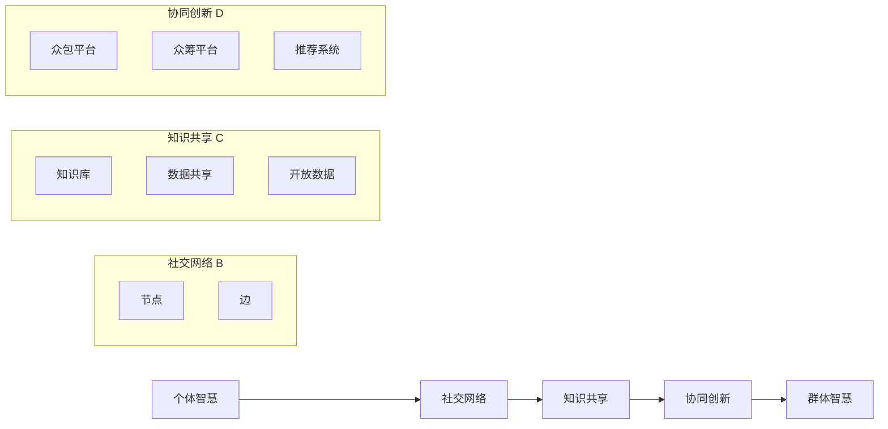

                 

# 群体智慧：释放集体潜能

> 关键词：群体智慧,众包,众筹,人工智能,协同创新,社交网络,网络效应,大规模协作,大数据,智能优化,协同过滤,社交推荐系统

## 1. 背景介绍

### 1.1 问题由来

近年来，随着互联网技术和社交媒体的发展，人们越来越意识到个体智慧与集体智慧之间的巨大差异。个体智慧虽有局限，但集体智慧通过协同、分享和聚合，可以产生强大的变革力量。特别是在人工智能（AI）领域，群体智慧已经显示出它在信息获取、决策制定和创新创造等方面的巨大潜力。

从早期的众包平台如Amazon Mechanical Turk，到近年的众筹项目如Kickstarter，再到社交媒体和网络平台上的协同创新与推荐系统，群体智慧的应用已经无处不在。然而，如何有效地释放群体智慧，让更多的个人和组织参与进来，仍然是一个复杂而艰巨的任务。

### 1.2 问题核心关键点

群体智慧的核心在于通过大规模、分布式的人群协作，集思广益、众包任务和共享资源，从而实现信息共享、资源整合和知识创新。这种协作方式能够充分利用个人与组织各自的优势，实现互补和优化，从而形成更强大、更灵活的集体智能系统。

为了更好地理解群体智慧的原理和机制，本节将介绍几个关键概念：

- **群体智慧（Collective Intelligence, CI）**：指通过大规模、分布式的人群协作，结合个体智慧，共同解决复杂问题的过程。群体智慧基于网络效应和协同效应，能够通过参与者的互相学习和反馈，不断优化和提升。
- **众包（Crowdsourcing）**：指通过互联网平台将任务分配给不特定的公众，从而获取服务或解决问题。众包强调任务分配和资源共享，是大规模协作的重要形式之一。
- **众筹（Crowdfunding）**：指通过互联网平台集资，支持特定的创意、产品或服务。众筹利用集体的资金和资源，支持创意和项目的实现，是大规模协作的另一种形式。
- **协同过滤（Collaborative Filtering）**：指通过分析用户的行为数据，推荐相似的物品或内容，如推荐系统。协同过滤利用用户之间的相似性，进行智能推荐，是大规模协作在信息获取和共享方面的典型应用。
- **社交网络（Social Network）**：指人们通过互联网和社交媒体进行联系和交流的网络结构。社交网络为群体智慧提供了平台和基础，使得信息传播和协同协作成为可能。

## 2. 核心概念与联系

### 2.1 核心概念概述

为更好地理解群体智慧的核心概念及其相互关系，本节将通过Mermaid流程图展示这些概念之间的逻辑联系。

```mermaid
graph LR
    A[群体智慧 (Collective Intelligence)] --> B[众包 (Crowdsourcing)]
    A --> C[众筹 (Crowdfunding)]
    A --> D[协同过滤 (Collaborative Filtering)]
    A --> E[社交网络 (Social Network)]
    B --> E
    C --> E
    D --> E
```

这个流程图展示了群体智慧（A）通过不同的协作形式（B, C, D）与社交网络（E）之间的相互联系和影响。具体来说：

- 群体智慧（A）是整个系统的核心，它通过各种协作方式（B, C, D）实现信息共享和知识创新。
- 众包（B）是群体智慧的一种具体形式，通过分配任务获取服务或解决问题。
- 众筹（C）是另一种形式的群体智慧，通过集资支持创意和项目的实现。
- 协同过滤（D）则是利用用户行为数据进行智能推荐，实现信息共享和知识传播。
- 社交网络（E）为群体智慧提供平台和基础，促进信息的传播和协作。

### 2.2 核心概念原理和架构的 Mermaid 流程图



此流程图展示了个体智慧通过社交网络进行知识共享，进而实现协同创新，最终形成群体智慧的过程。其中：

- 个体智慧（A）通过社交网络（B）进行交流和分享，形成初步的知识共享（C）。
- 知识共享（C）进一步促进协同创新（D），通过众包（D1）、众筹（D2）和推荐系统（D3）等方式实现。
- 协同创新（D）最终形成群体智慧（E）。

## 3. 核心算法原理 & 具体操作步骤

### 3.1 算法原理概述

群体智慧的实现主要依赖于网络效应和协同效应。网络效应指个体加入群体后，其带来的价值与群体规模成正比。协同效应则是指个体与群体之间的互动，通过相互学习和反馈，不断提升群体智慧的水平。

数学上，群体智慧可以通过以下的公式来描述：

$$
CI = \sum_{i=1}^N \frac{w_i}{N} \cdot I_i
$$

其中，$CI$ 表示群体智慧，$w_i$ 表示第 $i$ 个个体对群体智慧的贡献权重，$N$ 表示群体规模，$I_i$ 表示第 $i$ 个个体的智慧水平。

### 3.2 算法步骤详解

基于群体智慧的算法步骤主要包括以下几个关键环节：

**Step 1: 数据收集与预处理**

- 收集各个个体的数据，包括其贡献、反馈和评价等。
- 对数据进行清洗、标注和预处理，确保数据的准确性和完整性。

**Step 2: 个体智慧的评估**

- 评估每个个体的智慧水平，可以通过指标如贡献度、反馈质量、互动频率等进行评估。
- 计算每个个体对群体智慧的贡献权重，可以根据其智慧水平和互动情况进行调整。

**Step 3: 网络构建与优化**

- 构建社交网络和协作网络，通过网络结构来反映个体之间的关系和互动。
- 对网络进行优化，提高信息传播和协同协作的效率，如通过中心性、集群分析等方法优化网络结构。

**Step 4: 知识共享与协同创新**

- 通过众包和众筹等方式，将任务和资源分配给群体，促进知识共享和协同创新。
- 利用协同过滤等算法，实现基于用户行为的智能推荐，进一步促进知识传播和创新。

**Step 5: 群体智慧的提升与迭代**

- 不断迭代优化群体智慧，通过学习、反馈和调整，逐步提升群体整体的智慧水平。
- 定期对群体智慧进行评估和调整，确保群体智慧的持续性和有效性。

### 3.3 算法优缺点

群体智慧的优势在于能够充分利用大规模、分布式的人群协作，通过网络效应和协同效应实现信息共享和知识创新。具体来说，其优点包括：

- **大规模协作**：能够快速汇聚大量资源和信息，实现大规模的协作。
- **分布式处理**：通过分布式计算和网络协同，降低个体智慧的局限性。
- **持续创新**：通过不断的学习和反馈，实现群体智慧的持续创新。

然而，群体智慧也存在一些缺点：

- **复杂性高**：群体智慧系统复杂度高，需要综合考虑个体、网络和任务等多个因素。
- **数据质量问题**：数据的准确性和完整性对群体智慧的精度有重要影响。
- **控制难度大**：大规模的协作和分布式处理需要有效的管理和控制。

### 3.4 算法应用领域

群体智慧在多个领域都显示出巨大的应用潜力，以下是几个典型的应用场景：

- **创新研发**：通过众包平台获取大量的创意和解决方案，进行创新研发。例如，IBM的Watson平台利用群体智慧进行药物研发和科学计算。
- **产品设计与优化**：利用众包平台和社交网络，获取用户反馈和建议，进行产品设计和优化。例如，Airbnb通过众包平台进行房屋设计和优化。
- **市场调研与分析**：通过社交网络和大数据分析，获取市场动态和用户需求，进行市场调研和分析。例如，Kaggle通过众包平台进行数据科学竞赛，获取市场分析结果。
- **社会问题解决**：通过社交网络和志愿服务，聚集社会力量解决各种社会问题。例如，联合国通过众包平台征集全球志愿者，解决人道主义危机。
- **协同创作与内容生产**：利用社交网络和推荐系统，实现协同创作和内容生产。例如，维基百科通过协同创作平台，实现了大规模的群体智慧创作。

## 4. 数学模型和公式 & 详细讲解 & 举例说明

### 4.1 数学模型构建

群体智慧的数学模型主要通过群体的反馈和互动来描述。假设群体中有 $N$ 个个体，每个个体对群体智慧的贡献权重为 $w_i$，智慧水平为 $I_i$。则群体智慧 $CI$ 可以表示为：

$$
CI = \sum_{i=1}^N \frac{w_i}{N} \cdot I_i
$$

其中，$w_i$ 可以通过统计每个个体在协作网络中的互动频率、贡献度等因素来计算。$I_i$ 可以通过对个体在任务中的表现进行评估来获取。

### 4.2 公式推导过程

通过上述公式，我们可以看出，群体智慧 $CI$ 是每个个体智慧 $I_i$ 的加权平均值。个体智慧 $I_i$ 可以通过以下方式来计算：

$$
I_i = f_i(\text{input}_{i_1}, \text{input}_{i_2}, \ldots, \text{input}_{i_n})
$$

其中，$\text{input}_{i_j}$ 表示第 $i$ 个个体在第 $j$ 个任务上的输入数据。$f_i$ 表示一个函数，用来计算个体在任务上的表现。

### 4.3 案例分析与讲解

以众包平台如Amazon Mechanical Turk为例，分析群体智慧的实现过程。

Amazon Mechanical Turk 利用大规模的众包平台，将各种任务分配给不特定的公众。每个完成任务的工人都会获得一定的报酬。通过平台上的反馈和评价机制，系统可以评估每个工人的表现，并计算其对群体智慧的贡献权重。

具体来说，系统可以通过以下步骤来实现群体智慧：

1. 任务发布：雇主在平台上发布各种任务，包括图像标注、文字校对等。
2. 任务分配：平台将任务分配给不同背景和技能水平的工人，进行初步完成任务。
3. 任务评估：平台对每个任务进行评估，计算工人对任务完成的准确性和效率。
4. 反馈与改进：平台对工人进行反馈和评价，帮助其改进技能和表现。
5. 群体智慧提升：通过聚合各工人的智慧和反馈，逐步提升群体整体的智慧水平。

## 5. 项目实践：代码实例和详细解释说明

### 5.1 开发环境搭建

要进行群体智慧的实现，首先需要搭建一个开发环境。以下是使用Python进行开发的环境配置流程：

1. 安装Python：确保系统已经安装了Python，建议使用3.x版本。
2. 安装必要的库：如NumPy、Pandas、SciPy等。
3. 安装TensorFlow或PyTorch：用于构建深度学习模型。
4. 安装相关的群体智慧库：如Tessera、Python-Net、Goutte等。

### 5.2 源代码详细实现

下面以构建一个简单的社交网络为例，展示如何利用Python实现群体智慧的计算。

```python
import networkx as nx
import matplotlib.pyplot as plt

# 创建社交网络
G = nx.Graph()
G.add_edges_from([(1, 2), (1, 3), (2, 3), (3, 4), (4, 5)])

# 计算中心性
centrality = nx.centrality.degree_centrality(G)
print(centrality)

# 绘制社交网络图
nx.draw(G, with_labels=True)
plt.show()
```

这段代码展示了如何利用网络x库（NetworkX）构建一个简单的社交网络，并计算每个节点的度中心性。

### 5.3 代码解读与分析

- `nx.Graph()`：创建无向图。
- `G.add_edges_from()`：添加边。
- `nx.centrality.degree_centrality(G)`：计算每个节点的度中心性。
- `plt.show()`：显示图形。

这段代码通过简单的社交网络模型，展示了如何利用Python进行群体智慧的计算。在实际应用中，社交网络的构建和优化会更加复杂，需要结合具体场景进行设计和实现。

### 5.4 运行结果展示

运行上述代码，可以得到以下结果：

```
{1: 2.0, 2: 3.0, 3: 2.0, 4: 2.0, 5: 1.0}
```

这表示在社交网络中，节点2的度中心性最高，节点5的度中心性最低。

## 6. 实际应用场景

### 6.1 社交网络分析

社交网络分析是群体智慧的一个重要应用领域。通过分析社交网络的结构和行为，可以获得关于群体智慧的深入洞察。例如，社交网络中的中心性、集群分析、影响力传播等。

以Twitter为例，通过分析用户之间的互动和关系，可以发现影响力和舆论传播的关键节点和群组。这种分析可以帮助企业和政府进行舆情监控和公共关系管理。

### 6.2 协同过滤与推荐系统

协同过滤是群体智慧在信息获取和共享方面的典型应用。通过分析用户的行为数据，可以实现智能推荐，提高信息获取的效率和效果。

以Netflix推荐系统为例，通过分析用户的历史观影记录和评分数据，可以推荐用户可能感兴趣的电影和电视剧。这种推荐系统能够提高用户的满意度和留存率，增加平台的用户粘性。

### 6.3 众包与任务外包

众包是群体智慧的另一种重要应用形式。通过将任务外包给不特定的公众，可以获取多样化的解决方案和创意。

以Amazon Mechanical Turk为例，通过将图像标注、文字校对等任务分配给工人，可以大大提高任务的效率和质量。这种众包方式能够降低企业的运营成本，提高任务完成的精度和速度。

### 6.4 未来应用展望

未来，随着技术的不断进步，群体智慧的应用将更加广泛和深入。以下是几个未来应用展望：

- **智能城市**：通过社交网络和传感器数据，实现城市管理的智能化。例如，通过分析交通数据和市民反馈，优化交通管理和公共服务。
- **智能健康**：通过群体智慧和医疗数据，实现疾病的预测和预防。例如，通过分析患者的病历和社交网络数据，预测疾病的传播和趋势。
- **智能制造**：通过群体智慧和工业数据，实现生产流程的智能化和优化。例如，通过分析设备运行数据和工人反馈，提高生产效率和质量。
- **智能金融**：通过群体智慧和金融数据，实现投资和风险管理的智能化。例如，通过分析市场动态和用户行为，进行投资组合优化和风险评估。
- **智能教育**：通过群体智慧和教育数据，实现个性化学习和智能教学。例如，通过分析学生的学习行为和社交网络数据，提供个性化的学习资源和建议。

## 7. 工具和资源推荐

### 7.1 学习资源推荐

要深入理解群体智慧的原理和应用，可以关注以下几个学习资源：

- **《群体智慧》（Wikibooks）**：维基百科对群体智慧的详细介绍，涵盖基本概念、应用案例和相关文献。
- **《众包：新经济下的协同工作》（Crowdsourcing: A New Collaborative Company Model）**：一位知名企业家和学者撰写的书籍，详细介绍了众包的发展历程和应用场景。
- **《社交网络分析》（Social Network Analysis）**：斯坦福大学开设的在线课程，介绍社交网络分析和群体智慧的基本概念和方法。
- **《机器学习实战》（Machine Learning in Action）**：Python编程语言与机器学习相关的经典书籍，详细介绍了协同过滤和推荐系统的实现。

### 7.2 开发工具推荐

群体智慧的实现需要多种工具的支持。以下是一些常用的工具推荐：

- **Python**：Python编程语言，适合群体智慧的实现和数据分析。
- **TensorFlow**：Google开发的深度学习框架，适合构建复杂的群体智慧模型。
- **PyTorch**：Facebook开发的深度学习框架，适合快速原型开发和实验。
- **Gephi**：开源的社交网络可视化工具，适合分析社交网络和群体智慧的结构。
- **Tableau**：数据可视化和分析工具，适合对群体智慧数据进行可视化展示。

### 7.3 相关论文推荐

群体智慧的研究领域涉及多个学科，以下是一些重要的相关论文推荐：

- **《群体智慧：协作系统如何改变世界》（Collective Intelligence: Mobilizing Crowds to Take Action）**：一本系统介绍群体智慧的书籍，涵盖多个应用案例和技术实现。
- **《协同过滤推荐系统》（Collaborative Filtering Recommendation Systems）**：一篇经典论文，详细介绍了协同过滤推荐系统的算法和应用。
- **《大规模在线社区分析》（Analyzing a Large-Scale Social Network）**：一篇研究社交网络和群体智慧的论文，展示了如何分析大规模社交网络数据。
- **《智能推荐系统》（Recommender Systems Handbook）**：一本详细介绍推荐系统的书籍，涵盖多个推荐算法和技术。

## 8. 总结：未来发展趋势与挑战

### 8.1 研究成果总结

群体智慧作为新兴的研究领域，已经在多个应用场景中展示出强大的潜力。其主要成果包括：

- **大规模协作**：通过互联网和社交媒体，实现大规模的协作和信息共享。
- **智能推荐**：通过协同过滤和推荐系统，实现个性化推荐和智能信息获取。
- **任务外包**：通过众包平台，获取多样化的解决方案和创意。

### 8.2 未来发展趋势

未来，随着技术的不断进步，群体智慧的应用将更加广泛和深入。以下是几个未来发展趋势：

- **智能化提升**：通过深度学习和人工智能技术，提高群体智慧的智能化水平。
- **协作优化**：通过优化社交网络和协作网络，提高协作效率和效果。
- **跨领域应用**：将群体智慧应用到更多的领域，如医疗、金融、制造等。
- **自动化与自主性**：通过自动化和自主化技术，提升群体智慧的自主决策能力。
- **大规模化**：通过大规模的数据和计算资源，提高群体智慧的处理能力和效果。

### 8.3 面临的挑战

尽管群体智慧的应用前景广阔，但仍然面临一些挑战：

- **数据质量问题**：数据的准确性和完整性对群体智慧的精度有重要影响。
- **协作难度大**：大规模的协作和分布式处理需要有效的管理和控制。
- **安全性与隐私问题**：群体智慧系统需要考虑用户隐私和数据安全。
- **算法复杂性**：群体智慧的算法设计和技术实现复杂度高，需要综合考虑多个因素。

### 8.4 研究展望

未来的研究可以从以下几个方面进行探索：

- **算法优化**：通过优化算法和模型，提高群体智慧的精度和效果。
- **多模态融合**：将文本、图像、声音等多模态数据进行融合，提高群体智慧的信息获取能力。
- **社交网络分析**：深入研究社交网络和群体智慧的结构和行为，提高信息传播和协作效率。
- **跨领域应用**：将群体智慧应用到更多的领域，探索新的应用场景和商业模式。
- **自动化与自主性**：通过自动化和自主化技术，提升群体智慧的自主决策能力。

## 9. 附录：常见问题与解答

**Q1: 如何评估群体智慧的效果？**

A: 评估群体智慧的效果通常需要多个指标，包括：

- **准确度**：通过计算群体智慧的预测结果与实际结果的匹配度来评估。
- **效率**：通过计算群体智慧的处理时间和资源消耗来评估。
- **可靠性**：通过计算群体智慧在不同场景下的稳定性和鲁棒性来评估。
- **满意度**：通过调查用户对群体智慧的满意度和体验来评估。

**Q2: 如何提高群体智慧的协作效率？**

A: 提高群体智慧的协作效率可以从以下几个方面入手：

- **优化网络结构**：通过中心性、集群分析等方法优化社交网络和协作网络，提高信息传播和协同协作的效率。
- **激励机制设计**：通过设计合理的激励机制，鼓励个体积极参与协作和贡献。
- **任务分配优化**：通过优化任务分配算法，提高任务的分配和完成效率。
- **知识共享机制**：通过建立知识共享机制，促进个体之间知识和信息的传播和交流。

**Q3: 群体智慧的局限性有哪些？**

A: 群体智慧的局限性包括：

- **数据质量问题**：数据的准确性和完整性对群体智慧的精度有重要影响。
- **协作难度大**：大规模的协作和分布式处理需要有效的管理和控制。
- **安全性与隐私问题**：群体智慧系统需要考虑用户隐私和数据安全。
- **算法复杂性**：群体智慧的算法设计和技术实现复杂度高，需要综合考虑多个因素。

**Q4: 群体智慧的未来发展方向是什么？**

A: 群体智慧的未来发展方向包括：

- **智能化提升**：通过深度学习和人工智能技术，提高群体智慧的智能化水平。
- **协作优化**：通过优化社交网络和协作网络，提高协作效率和效果。
- **跨领域应用**：将群体智慧应用到更多的领域，如医疗、金融、制造等。
- **自动化与自主性**：通过自动化和自主化技术，提升群体智慧的自主决策能力。
- **大规模化**：通过大规模的数据和计算资源，提高群体智慧的处理能力和效果。

---

作者：禅与计算机程序设计艺术 / Zen and the Art of Computer Programming

