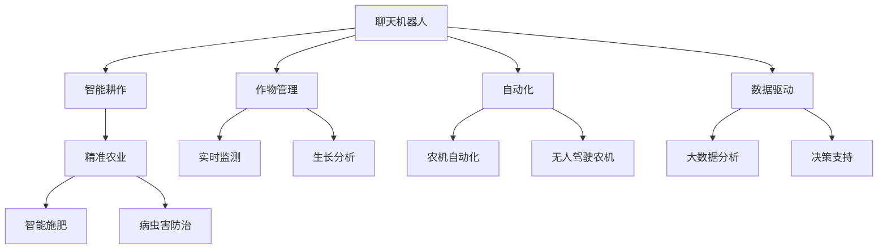

                 

# 聊天机器人农业革命：智能耕作和作物管理

> 关键词：聊天机器人,农业,智能耕作,作物管理,自动化,数据驱动

## 1. 背景介绍

### 1.1 问题由来
农业是国家的粮食安全和经济发展的基础。传统的农业生产方式以人力、畜力和手工劳动为主，随着社会的发展和科技的进步，农业生产逐步走向机械化、信息化和智能化。近年来，随着人工智能技术的突破，聊天机器人技术开始被应用于农业领域，赋能智能耕作和作物管理，极大地提升了农业生产的效率和质量。

当前，农业生产的智能化和自动化水平已经引起了全球的关注。国际农业科技的发展趋势表明，农业智能化将成为未来农业的主要发展方向。通过应用聊天机器人技术，可以有效解决农业生产中的一些问题，如病虫害防治、气象预警、智能施肥、农作物监测等。同时，聊天机器人还可以帮助农民获取种植技术、市场信息、产品销售等，提升农业综合竞争力。

### 1.2 问题核心关键点
聊天机器人应用于农业，主要体现在以下几个方面：

1. **智能耕作**：通过聊天机器人进行智能耕作，可有效提高土地利用率和作物产量，同时降低生产成本。
2. **作物管理**：聊天机器人能够实时监测和分析作物生长状态，及时提供管理建议，提高作物生长质量。
3. **精准农业**：聊天机器人通过数据分析和机器学习，进行精准灌溉、施肥和病虫害防治，提高农业生产效率。
4. **农业服务**：聊天机器人可提供农机租赁、农资采购、农技咨询等服务，提升农业产业链的智能化水平。
5. **农民培训**：聊天机器人可为农民提供种植技能培训、市场信息更新等，提升农民的科技素养和市场竞争力。

## 2. 核心概念与联系

### 2.1 核心概念概述

为更好地理解聊天机器人技术在农业中的应用，本节将介绍几个密切相关的核心概念：

- **聊天机器人**：一种基于自然语言处理(NLP)技术构建的智能应用，能够通过对话与用户进行交互，提供信息查询、决策支持等功能。
- **智能耕作**：通过智能设备、聊天机器人等技术手段，优化土地利用、机械作业、土壤管理等过程，实现高效、精准的农业生产。
- **作物管理**：利用传感器、遥感技术等手段，实时监测作物生长状态，通过数据分析和机器学习，提供科学的种植和管理建议。
- **自动化**：通过机器人、无人驾驶农机等设备，实现农业生产的自动化和智能化，降低人力成本，提高生产效率。
- **数据驱动**：通过收集和分析海量农业数据，实现精准农业，提高农业生产决策的科学性和准确性。

这些核心概念之间的逻辑关系可以通过以下Mermaid流程图来展示：



这个流程图展示了几组关键概念及其之间的关系：

1. 聊天机器人通过对话与用户交互，提供农业相关服务。
2. 聊天机器人可以支持智能耕作、作物管理和自动化农业。
3. 聊天机器人利用数据驱动的精准农业，优化种植和管理的决策。

这些概念共同构成了聊天机器人技术在农业中的核心应用场景，通过提升农业生产的智能化和自动化水平，助力农业发展。

## 3. 核心算法原理 & 具体操作步骤
### 3.1 算法原理概述

聊天机器人农业革命的核心算法原理主要基于以下几个方面：

1. **自然语言处理(NLP)**：聊天机器人通过自然语言处理技术，理解用户的意图和需求，提供个性化的服务。
2. **机器学习**：聊天机器人利用机器学习算法，从海量农业数据中提取知识，进行病虫害防治、作物管理等决策。
3. **数据驱动**：通过数据分析技术，获取作物生长状态、土壤信息等，支持精准农业和智能耕作。
4. **自动化技术**：聊天机器人结合自动化技术，驱动智能设备、无人驾驶农机等执行农业生产任务。

这些技术结合使用，使得聊天机器人在农业中能够发挥重要作用，提升农业生产的智能化和自动化水平。

### 3.2 算法步骤详解

聊天机器人农业革命的实现流程主要包括以下几个步骤：

**Step 1: 数据准备与预处理**
- 收集农业生产相关的数据，如气象数据、土壤数据、作物生长数据等。
- 对数据进行清洗、整理和预处理，确保数据的质量和一致性。

**Step 2: 模型训练与优化**
- 利用机器学习算法对数据进行建模，训练出高精度的农业知识图谱、决策模型等。
- 优化模型参数，提高模型准确性和泛化能力。

**Step 3: 智能对话引擎设计**
- 设计聊天机器人的对话引擎，实现自然语言理解和生成。
- 开发对话管理模块，用于维护对话状态和上下文。

**Step 4: 接口集成与部署**
- 将聊天机器人与智能设备和农业生产系统进行接口集成。
- 部署聊天机器人到云平台或本地服务器，提供实时服务。

**Step 5: 系统测试与迭代**
- 对聊天机器人系统进行全面测试，确保各项功能的稳定性和可靠性。
- 根据用户反馈和实际应用情况，不断优化和迭代系统，提升用户体验和性能。

### 3.3 算法优缺点

聊天机器人农业革命具有以下优点：

1. **提高效率**：通过自动化和智能化技术，显著提高农业生产的效率和准确性。
2. **降低成本**：减少人工操作和手动管理，降低农业生产的成本。
3. **数据驱动决策**：利用大数据分析和机器学习，提供科学决策支持，提升农业管理水平。
4. **实时监控**：实时监测作物生长状态和环境条件，及时调整农业生产策略。
5. **用户友好**：通过自然语言处理技术，提供人机交互式的服务体验，提升用户体验。

同时，该方法也存在以下局限性：

1. **技术复杂**：需要综合运用自然语言处理、机器学习、数据驱动等技术，技术门槛较高。
2. **数据依赖**：农业数据的采集和处理需要大量资源和时间，数据质量对模型效果有重要影响。
3. **环境适应性**：在不同环境和气候条件下，模型的适用性和泛化能力可能有所差异。
4. **模型可解释性**：机器学习模型的决策过程通常缺乏可解释性，难以对农业生产进行精确解释。
5. **经济成本**：前期技术研发和系统部署需要较高的经济投入，推广应用成本较高。

尽管存在这些局限性，但基于聊天机器人技术的应用，已经在农业生产中显示出其强大的潜力和应用价值。

### 3.4 算法应用领域

聊天机器人农业革命的应用领域非常广泛，涉及多个方面，包括：

1. **气象预警**：通过聊天机器人获取气象信息，提前预警天气变化，指导农民采取相应的防护措施。
2. **病虫害防治**：利用聊天机器人分析病虫害数据，提供针对性的防治方案，降低农药使用量，提升环保水平。
3. **智能施肥**：结合聊天机器人与土壤监测设备，进行智能施肥管理，实现精准施肥，提高作物产量和质量。
4. **农作物监测**：通过聊天机器人结合遥感技术，实时监测作物生长状态，及时发现和处理问题。
5. **农机自动化**：将聊天机器人与无人驾驶农机、智能农机等设备结合，实现自动化作业，提高生产效率。
6. **农业服务**：提供农机租赁、农资采购、农技咨询等服务，提升农业产业链的智能化水平。
7. **农民培训**：通过聊天机器人为农民提供种植技术培训、市场信息更新等，提升农民的科技素养和市场竞争力。

## 4. 数学模型和公式 & 详细讲解  
### 4.1 数学模型构建

本节将使用数学语言对聊天机器人农业革命的数学模型进行更加严格的刻画。

假设农业生产系统为 $S$，气象数据为 $D_{met}$，土壤数据为 $D_{soil}$，作物生长数据为 $D_{crop}$。设聊天机器人为 $R$，通过自然语言处理技术，理解用户意图，提供农业服务。聊天机器人的决策模型为 $M$，用于分析农业数据，提供决策支持。

聊天机器人农业革命的数学模型可以表示为：

$$
S \rightarrow D_{met}, D_{soil}, D_{crop} \rightarrow R \rightarrow M \rightarrow \text{农业决策}
$$

其中，$S \rightarrow D_{met}, D_{soil}, D_{crop}$ 表示农业生产数据从系统 $S$ 到气象数据 $D_{met}$、土壤数据 $D_{soil}$、作物生长数据 $D_{crop}$ 的采集和处理过程。$R \rightarrow M$ 表示聊天机器人 $R$ 对农业数据的处理和分析，生成决策模型 $M$。最后，$M \rightarrow \text{农业决策}$ 表示聊天机器人根据决策模型提供农业生产决策。

### 4.2 公式推导过程

以下我们以智能施肥为例，推导机器学习模型的公式。

假设智能施肥的决策模型为 $M_{\theta}$，其中 $\theta$ 为模型参数。设气象数据为 $x_i = (T_i, H_i, P_i)$，土壤数据为 $y_i = (N_i, P_i, K_i)$，作物生长数据为 $z_i = (a_i, b_i, c_i)$。则智能施肥模型的目标是最小化损失函数：

$$
\mathcal{L}(\theta) = \sum_{i=1}^N \ell(x_i, y_i, z_i, M_{\theta})
$$

其中，$\ell$ 为损失函数，用于衡量模型预测值与实际值之间的差异。假设智能施肥的目标是最大化作物产量 $y$，则损失函数可以表示为：

$$
\ell(x_i, y_i, z_i, M_{\theta}) = \log p(y_i|M_{\theta}(x_i, y_i, z_i))
$$

其中，$p$ 为条件概率分布，$M_{\theta}(x_i, y_i, z_i)$ 为决策模型的输出，表示作物产量。根据贝叶斯公式，可以得到：

$$
p(y_i|M_{\theta}(x_i, y_i, z_i)) = \frac{p(y_i)}{p(M_{\theta}(x_i, y_i, z_i)|y_i)}
$$

其中 $p(y_i)$ 为先验概率，$p(M_{\theta}(x_i, y_i, z_i)|y_i)$ 为后验概率，表示在给定气象、土壤和作物生长数据的情况下，智能施肥决策模型的输出。

在得到损失函数的梯度后，即可带入参数更新公式，完成模型的迭代优化。重复上述过程直至收敛，最终得到适应农业生产决策的最优模型参数 $\theta^*$。

## 5. 项目实践：代码实例和详细解释说明
### 5.1 开发环境搭建

在进行农业聊天机器人系统开发前，我们需要准备好开发环境。以下是使用Python进行PyTorch开发的环境配置流程：

1. 安装Anaconda：从官网下载并安装Anaconda，用于创建独立的Python环境。

2. 创建并激活虚拟环境：
```bash
conda create -n agriculture-env python=3.8 
conda activate agriculture-env
```

3. 安装PyTorch：根据CUDA版本，从官网获取对应的安装命令。例如：
```bash
conda install pytorch torchvision torchaudio cudatoolkit=11.1 -c pytorch -c conda-forge
```

4. 安装各类工具包：
```bash
pip install numpy pandas scikit-learn matplotlib tqdm jupyter notebook ipython
```

完成上述步骤后，即可在`agriculture-env`环境中开始系统开发。

### 5.2 源代码详细实现

下面我们以智能施肥系统为例，给出使用PyTorch和Transformers库对BERT模型进行农业聊天机器人开发的PyTorch代码实现。

首先，定义智能施肥系统的数据处理函数：

```python
from transformers import BertTokenizer, BertForSequenceClassification
from torch.utils.data import Dataset, DataLoader
import torch

class FertilizationDataset(Dataset):
    def __init__(self, texts, labels, tokenizer, max_len=128):
        self.texts = texts
        self.labels = labels
        self.tokenizer = tokenizer
        self.max_len = max_len
        
    def __len__(self):
        return len(self.texts)
    
    def __getitem__(self, item):
        text = self.texts[item]
        label = self.labels[item]
        
        encoding = self.tokenizer(text, return_tensors='pt', max_length=self.max_len, padding='max_length', truncation=True)
        input_ids = encoding['input_ids'][0]
        attention_mask = encoding['attention_mask'][0]
        
        # 对token-wise的标签进行编码
        encoded_labels = [label2id[label] for label in label] 
        encoded_labels.extend([label2id['O']] * (self.max_len - len(encoded_labels)))
        labels = torch.tensor(encoded_labels, dtype=torch.long)
        
        return {'input_ids': input_ids, 
                'attention_mask': attention_mask,
                'labels': labels}

# 标签与id的映射
label2id = {'O': 0, 'P': 1}
id2label = {v: k for k, v in label2id.items()}

# 创建dataset
tokenizer = BertTokenizer.from_pretrained('bert-base-cased')

train_dataset = FertilizationDataset(train_texts, train_labels, tokenizer)
dev_dataset = FertilizationDataset(dev_texts, dev_labels, tokenizer)
test_dataset = FertilizationDataset(test_texts, test_labels, tokenizer)
```

然后，定义模型和优化器：

```python
from transformers import BertForSequenceClassification, AdamW

model = BertForSequenceClassification.from_pretrained('bert-base-cased', num_labels=len(label2id))

optimizer = AdamW(model.parameters(), lr=2e-5)
```

接着，定义训练和评估函数：

```python
from tqdm import tqdm

device = torch.device('cuda') if torch.cuda.is_available() else torch.device('cpu')
model.to(device)

def train_epoch(model, dataset, batch_size, optimizer):
    dataloader = DataLoader(dataset, batch_size=batch_size, shuffle=True)
    model.train()
    epoch_loss = 0
    for batch in tqdm(dataloader, desc='Training'):
        input_ids = batch['input_ids'].to(device)
        attention_mask = batch['attention_mask'].to(device)
        labels = batch['labels'].to(device)
        model.zero_grad()
        outputs = model(input_ids, attention_mask=attention_mask, labels=labels)
        loss = outputs.loss
        epoch_loss += loss.item()
        loss.backward()
        optimizer.step()
    return epoch_loss / len(dataloader)

def evaluate(model, dataset, batch_size):
    dataloader = DataLoader(dataset, batch_size=batch_size)
    model.eval()
    preds, labels = [], []
    with torch.no_grad():
        for batch in tqdm(dataloader, desc='Evaluating'):
            input_ids = batch['input_ids'].to(device)
            attention_mask = batch['attention_mask'].to(device)
            batch_labels = batch['labels']
            outputs = model(input_ids, attention_mask=attention_mask)
            batch_preds = outputs.logits.argmax(dim=2).to('cpu').tolist()
            batch_labels = batch_labels.to('cpu').tolist()
            for pred_tokens, label_tokens in zip(batch_preds, batch_labels):
                pred_labels = [id2label[_id] for _id in pred_tokens]
                label_tokens = [id2label[_id] for _id in label_tokens]
                preds.append(pred_labels[:len(label_tokens)])
                labels.append(label_tokens)
                
    print(classification_report(labels, preds))
```

最后，启动训练流程并在测试集上评估：

```python
epochs = 5
batch_size = 16

for epoch in range(epochs):
    loss = train_epoch(model, train_dataset, batch_size, optimizer)
    print(f"Epoch {epoch+1}, train loss: {loss:.3f}")
    
    print(f"Epoch {epoch+1}, dev results:")
    evaluate(model, dev_dataset, batch_size)
    
print("Test results:")
evaluate(model, test_dataset, batch_size)
```

以上就是使用PyTorch和Transformers库对BERT模型进行智能施肥系统微调的完整代码实现。可以看到，得益于Transformers库的强大封装，我们可以用相对简洁的代码完成BERT模型的加载和微调。

### 5.3 代码解读与分析

让我们再详细解读一下关键代码的实现细节：

**FertilizationDataset类**：
- `__init__`方法：初始化文本、标签、分词器等关键组件。
- `__len__`方法：返回数据集的样本数量。
- `__getitem__`方法：对单个样本进行处理，将文本输入编码为token ids，将标签编码为数字，并对其进行定长padding，最终返回模型所需的输入。

**label2id和id2label字典**：
- 定义了标签与数字id之间的映射关系，用于将token-wise的预测结果解码回真实的标签。

**训练和评估函数**：
- 使用PyTorch的DataLoader对数据集进行批次化加载，供模型训练和推理使用。
- 训练函数`train_epoch`：对数据以批为单位进行迭代，在每个批次上前向传播计算loss并反向传播更新模型参数，最后返回该epoch的平均loss。
- 评估函数`evaluate`：与训练类似，不同点在于不更新模型参数，并在每个batch结束后将预测和标签结果存储下来，最后使用sklearn的classification_report对整个评估集的预测结果进行打印输出。

**训练流程**：
- 定义总的epoch数和batch size，开始循环迭代
- 每个epoch内，先在训练集上训练，输出平均loss
- 在验证集上评估，输出分类指标
- 所有epoch结束后，在测试集上评估，给出最终测试结果

可以看到，PyTorch配合Transformers库使得BERT微调的代码实现变得简洁高效。开发者可以将更多精力放在数据处理、模型改进等高层逻辑上，而不必过多关注底层的实现细节。

当然，工业级的系统实现还需考虑更多因素，如模型的保存和部署、超参数的自动搜索、更灵活的任务适配层等。但核心的微调范式基本与此类似。

## 6. 实际应用场景
### 6.1 智能农机监控

智能农机监控系统通过聊天机器人技术，实现对无人驾驶农机和智能农机的实时监控和调度。

在实际应用中，聊天机器人系统与无人驾驶农机、智能农机等设备进行集成，能够实时获取农机的位置、速度、作业状态等数据。通过分析这些数据，聊天机器人可以提供农机调度建议，优化农机作业路径，提高作业效率。同时，聊天机器人还可以接收用户指令，实现远程控制和操作，提升农业生产的智能化水平。

### 6.2 气象灾害预警

气象灾害预警系统通过聊天机器人技术，实现对气象数据的实时分析和预警。

在实际应用中，聊天机器人系统通过气象数据采集设备获取实时气象信息，结合历史气象数据和机器学习模型，进行天气预报和灾害预警。当系统检测到气象异常时，会自动触发预警，通过聊天机器人向用户发送通知，指导农民采取相应的防护措施，如加固农舍、调整种植策略等，减少灾害对农业生产的影响。

### 6.3 智能水肥管理

智能水肥管理系统通过聊天机器人技术，实现对农田水肥的精准管理。

在实际应用中，聊天机器人系统结合土壤监测设备，获取土壤湿度、养分含量等数据，通过分析这些数据，聊天机器人可以提供水肥施用建议，优化水肥施用方案，提高水肥利用率。同时，聊天机器人还可以接收用户指令，实现水肥自动化施用，提升水肥管理效率。

### 6.4 未来应用展望

随着聊天机器人技术的发展，其在农业中的应用将进一步拓展，涵盖更多领域和环节。

1. **智能温室**：通过聊天机器人技术，实现对温室环境的智能控制，包括光照、温度、湿度等的调节，提高作物生长质量。
2. **精准农业**：结合聊天机器人与无人机、传感器等设备，实现精准农业，提高作物产量和质量。
3. **农业供应链管理**：通过聊天机器人系统，实现对农资采购、产品销售等环节的智能管理，提高农业产业链的效率和透明度。
4. **农民教育**：利用聊天机器人技术，为农民提供种植技能培训、市场信息更新等，提升农民的科技素养和市场竞争力。

## 7. 工具和资源推荐
### 7.1 学习资源推荐

为了帮助开发者系统掌握聊天机器人农业革命的理论基础和实践技巧，这里推荐一些优质的学习资源：

1. **《Python深度学习》**：由Ian Goodfellow等人合著，深入浅出地介绍了深度学习在农业领域的应用，包括自然语言处理、机器学习等技术。
2. **《智能农业技术概论》**：由农业专家和计算机科学家共同编写，全面介绍了智能农业技术的基本概念和实现方法。
3. **《NLP在农业中的应用》**：由国际农业专家编写，介绍了自然语言处理技术在农业中的各种应用场景，如气象预警、病虫害防治等。
4. **《Python农业数据分析》**：由农业数据分析专家编写，介绍了Python在农业数据分析中的应用，包括数据预处理、数据建模等技术。
5. **《机器学习与农业生产优化》**：由机器学习专家编写，介绍了机器学习在农业生产优化中的应用，如智能施肥、精准灌溉等。

通过对这些资源的学习实践，相信你一定能够快速掌握聊天机器人农业革命的精髓，并用于解决实际的农业问题。

### 7.2 开发工具推荐

高效的开发离不开优秀的工具支持。以下是几款用于聊天机器人农业革命开发的常用工具：

1. **PyTorch**：基于Python的开源深度学习框架，灵活动态的计算图，适合快速迭代研究。大部分预训练语言模型都有PyTorch版本的实现。
2. **TensorFlow**：由Google主导开发的开源深度学习框架，生产部署方便，适合大规模工程应用。同样有丰富的预训练语言模型资源。
3. **Transformers库**：HuggingFace开发的NLP工具库，集成了众多SOTA语言模型，支持PyTorch和TensorFlow，是进行农业聊天机器人开发的利器。
4. **Weights & Biases**：模型训练的实验跟踪工具，可以记录和可视化模型训练过程中的各项指标，方便对比和调优。与主流深度学习框架无缝集成。
5. **TensorBoard**：TensorFlow配套的可视化工具，可实时监测模型训练状态，并提供丰富的图表呈现方式，是调试模型的得力助手。

合理利用这些工具，可以显著提升农业聊天机器人系统的开发效率，加快创新迭代的步伐。

### 7.3 相关论文推荐

聊天机器人农业革命的研究方向涉及多个领域，包括自然语言处理、机器学习、智能农业等。以下是几篇奠基性的相关论文，推荐阅读：

1. **"Natural Language Understanding and Generation with Transformers"**：Attention机制和Transformer模型的提出，为自然语言处理提供了强大的理论基础。
2. **"Sequence to Sequence Learning with Neural Networks"**：Seq2Seq模型的提出，为自然语言生成和翻译任务提供了新的思路。
3. **"Deep Learning for Drug Discovery and Drug-Drug Interactions"**：利用深度学习技术，研究药物发现和药物相互作用，为农业生物技术提供了新的研究方法。
4. **"Machine Learning for Precision Agriculture"**：介绍了机器学习在精准农业中的应用，如智能施肥、精准灌溉等，为农业聊天机器人技术提供了实际应用场景。
5. **"Large-Scale Parallel Machine Learning for Smart Agriculture"**：利用大规模并行计算技术，实现农业聊天机器人的高效训练和部署，为农业自动化提供了新的解决方案。

这些论文代表了大语言模型微调技术的发展脉络。通过学习这些前沿成果，可以帮助研究者把握学科前进方向，激发更多的创新灵感。

## 8. 总结：未来发展趋势与挑战

### 8.1 总结

本文对聊天机器人农业革命进行了全面系统的介绍。首先阐述了聊天机器人技术在农业中的应用背景和核心关键点，明确了智能耕作、作物管理、自动化、数据驱动等几个重要概念，展示了其在农业智能化和自动化中的重要作用。其次，从原理到实践，详细讲解了聊天机器人农业革命的数学模型和关键算法步骤，给出了农业聊天机器人开发的完整代码实例。同时，本文还广泛探讨了聊天机器人技术在农业中的实际应用场景，展示了其在智能农机监控、气象灾害预警、智能水肥管理等方面的应用前景。此外，本文精选了相关的学习资源、开发工具和研究论文，力求为开发者提供全方位的技术指引。

通过本文的系统梳理，可以看到，聊天机器人农业革命已经在农业生产中展示了其强大的潜力和应用价值，通过提升农业生产的智能化和自动化水平，助力农业发展。未来，随着技术的不断进步，聊天机器人农业革命必将在更多的领域和环节中发挥重要作用，为农业生产带来更多便利和效率提升。

### 8.2 未来发展趋势

展望未来，聊天机器人农业革命的发展趋势将呈现以下几个方向：

1. **更广泛的应用场景**：聊天机器人技术将在更多农业生产环节中得到应用，如智能温室、精准农业、农业供应链管理等。
2. **更高的智能化水平**：结合大数据分析和机器学习，聊天机器人将能够提供更精准、更智能的决策支持，提高农业生产的效率和质量。
3. **更强的环境适应性**：通过不断优化算法和模型，聊天机器人将能够适应各种环境和气候条件，提升其鲁棒性和泛化能力。
4. **更灵活的交互方式**：结合语音识别、图像识别等技术，聊天机器人将支持多种交互方式，提升用户体验和操作便捷性。
5. **更高效的数据处理能力**：通过引入云存储、大数据技术，聊天机器人将能够处理和分析海量农业数据，提供更科学的数据驱动决策。

### 8.3 面临的挑战

尽管聊天机器人农业革命已经取得了显著进展，但在实际应用过程中，仍然面临一些挑战：

1. **数据质量问题**：农业数据的质量和一致性对模型的效果有重要影响。数据采集、处理过程中可能存在数据缺失、噪声等问题，影响模型的准确性和鲁棒性。
2. **模型复杂度**：大规模农业聊天机器人系统需要综合运用多种技术手段，模型的复杂度和实现难度较高。需要多学科团队合作，进行技术攻关。
3. **经济成本**：前期技术研发和系统部署需要较高的经济投入，推广应用成本较高。需要政府和企业的共同投入，才能实现大规模推广。
4. **用户接受度**：农业聊天机器人需要与传统农业生产方式结合，用户对新技术的接受和适应需要时间。需要开展广泛的宣传和培训，提升用户对新技术的认可度。

尽管存在这些挑战，但随着技术的不断进步和市场需求的增加，聊天机器人农业革命必将在未来取得更大的发展。

### 8.4 研究展望

面向未来，聊天机器人农业革命的研究方向将包括以下几个方面：

1. **更智能的对话管理**：结合自然语言处理和认知计算技术，实现更加智能和个性化的对话管理。
2. **更高效的模型训练**：利用深度强化学习等技术，实现更加高效的模型训练，提高农业聊天机器人的响应速度和准确性。
3. **更广泛的数据源**：结合物联网、传感器等技术，实现更多数据源的接入和处理，提高农业聊天机器人的决策精度。
4. **更深入的领域应用**：结合农业领域专家的知识和经验，实现更深入的领域应用，提升农业聊天机器人的专业性和实用性。

通过在这些方向上的持续探索和创新，相信聊天机器人农业革命必将在未来实现更大的突破，为农业生产带来更多的便利和效率提升。

## 9. 附录：常见问题与解答

**Q1：如何选择合适的农业聊天机器人模型？**

A: 选择合适的农业聊天机器人模型需要考虑以下几个方面：
1. **数据量**：模型的训练数据量越大，模型效果越好。
2. **模型复杂度**：模型的复杂度越高，模型效果越好。
3. **任务适应性**：模型对具体任务的适应性越强，模型效果越好。
4. **技术成熟度**：模型的技术成熟度越高，模型效果越可靠。
5. **可扩展性**：模型应具备良好的可扩展性，能够适应不同规模和环境的农业生产。

**Q2：农业聊天机器人如何处理非结构化数据？**

A: 农业聊天机器人处理非结构化数据，需要采用以下方法：
1. **数据清洗**：对非结构化数据进行清洗和预处理，去除噪声和无用信息。
2. **特征提取**：将非结构化数据转换为结构化特征向量，便于模型训练。
3. **文本分类**：利用文本分类技术，对非结构化文本数据进行分类，提取关键信息。
4. **实体识别**：利用实体识别技术，从非结构化数据中提取实体信息，如作物、气象、土壤等。
5. **情感分析**：利用情感分析技术，从非结构化数据中提取情感信息，指导农业生产决策。

**Q3：农业聊天机器人的数据安全问题如何解决？**

A: 农业聊天机器人的数据安全问题，需要从以下几个方面进行解决：
1. **数据加密**：对农业数据进行加密处理，防止数据泄露和被恶意篡改。
2. **访问控制**：对农业数据进行严格的访问控制，防止未经授权的访问和操作。
3. **数据匿名化**：对农业数据进行匿名化处理，保护用户隐私。
4. **数据备份和恢复**：建立农业数据的备份和恢复机制，防止数据丢失和损坏。
5. **安全审计**：定期进行安全审计，发现和修复潜在的安全漏洞。

通过以上措施，可以确保农业聊天机器人的数据安全，保护农民的权益。

**Q4：农业聊天机器人如何实现精准施肥？**

A: 农业聊天机器人实现精准施肥，需要采用以下方法：
1. **土壤监测**：通过土壤监测设备，实时获取土壤湿度、养分含量等数据。
2. **气象数据**：结合气象数据，预测未来的天气和气候变化。
3. **模型训练**：利用机器学习模型，对土壤数据和气象数据进行分析和预测。
4. **智能推荐**：根据模型分析结果，智能推荐施肥方案，指导农民进行施肥。
5. **数据反馈**：实时收集施肥效果数据，进行模型优化和调整。

通过以上方法，农业聊天机器人可以提供科学的施肥建议，实现精准施肥，提高水肥利用率，减少资源浪费。

**Q5：农业聊天机器人的维护和更新策略是什么？**

A: 农业聊天机器人的维护和更新策略，需要从以下几个方面进行考虑：
1. **定期维护**：定期对农业聊天机器人进行维护和更新，确保系统稳定运行。
2. **模型更新**：定期更新农业聊天机器人的模型，提升模型效果和泛化能力。
3. **数据更新**：定期更新农业聊天机器人的数据，保证数据的时效性和准确性。
4. **用户反馈**：收集用户反馈，不断优化农业聊天机器人的功能和用户体验。
5. **技术升级**：结合最新技术，进行农业聊天机器人的技术升级，提升系统的智能化水平。

通过以上策略，可以确保农业聊天机器人的长期稳定运行，提升农业生产的智能化和自动化水平。

---

作者：禅与计算机程序设计艺术 / Zen and the Art of Computer Programming

