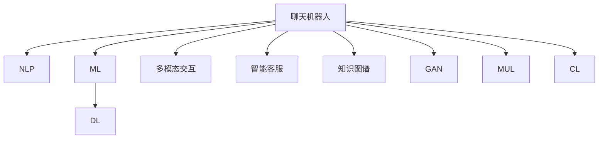

                 

# 聊天机器人创业：创新和初创企业

## 1. 背景介绍

### 1.1 问题由来

随着人工智能技术的发展，聊天机器人（Chatbot）作为一种智能客服和交互工具，已经在电商、金融、医疗等多个行业中得到广泛应用。根据Statista的数据，到2025年，全球聊天机器人市场规模将达到120亿美元。

然而，聊天机器人的开发和部署依然存在诸多挑战，包括：

- 用户体验不够自然。现有聊天机器人往往难以模拟真实的人类对话，容易让用户感到机械和生硬。
- 知识库管理困难。聊天机器人的理解能力依赖于庞大的知识库，知识库的构建和维护成本高且复杂。
- 多模态交互需求高。现实生活中的用户交互不仅仅是文本对话，语音、图像、视频等多种交互方式也需要得到支持。
- 智能化水平不足。现有的聊天机器人多依赖规则和模板，缺乏足够的深度学习和智能推理能力。
- 数据隐私问题。用户与聊天机器人之间的对话数据需要严格保护，避免信息泄露。

解决上述问题，推动聊天机器人技术的迭代和升级，是当前的紧迫任务。本文将从技术、商业、法律等多个维度，探讨聊天机器人创业的创新策略和初创企业的成功路径。

## 2. 核心概念与联系

### 2.1 核心概念概述

为更好地理解聊天机器人创业的挑战与机会，本节将介绍几个密切相关的核心概念：

- 聊天机器人（Chatbot）：通过自然语言处理（NLP）和机器学习（ML）技术实现的智能交互系统，可以与用户进行实时对话，解决用户问题，提供信息服务。
- 自然语言处理（NLP）：研究如何让计算机理解和处理自然语言的技术，是聊天机器人的核心技术之一。
- 机器学习（ML）：使机器具备从数据中学习并优化算法的能力，聊天机器人通过学习用户对话数据，不断提升理解和回应能力。
- 深度学习（DL）：一种特殊类型的机器学习，利用神经网络进行复杂模式的识别和建模，是现代聊天机器人中最常用的技术。
- 多模态交互：指聊天机器人除了文本对话，还需支持语音、图像、视频等多种交互方式，满足用户的多样化需求。
- 智能客服：以聊天机器人为代表的智能客服系统，旨在通过自然交互提升用户体验，减少人工客服的工作量。
- 知识图谱：通过有向图结构，将知识表示为节点和边的关系，是构建聊天机器人知识库的重要工具。
- 生成对抗网络（GAN）：一种深度学习模型，可以生成逼真的对话内容，提升聊天机器人的自然度和表达能力。
- 多任务学习（MUL）：一种ML技术，同时训练多个任务，提升聊天机器人处理复杂对话的能力。
- 持续学习（CL）：使聊天机器人能够不断学习新知识，适应数据分布的变化，是提升聊天机器人长期性能的重要手段。

这些核心概念之间的逻辑关系可以通过以下Mermaid流程图来展示：



这个流程图展示了这个核心概念间的联系：

1. 聊天机器人通过NLP技术理解和处理自然语言。
2. 通过ML技术，不断优化模型，提升理解和回应能力。
3. 在ML框架下，应用DL技术提升模型的复杂度。
4. 支持多模态交互，满足用户的多样化需求。
5. 构建智能客服系统，提升用户体验。
6. 利用知识图谱丰富知识库，增强理解能力。
7. 引入GAN技术，生成逼真的对话内容。
8. 采用MUL技术，处理复杂对话。
9. 应用CL技术，持续学习提升长期性能。

这些概念共同构成了聊天机器人创业的基础框架，使其能够在各种场景下发挥强大的交互能力。通过理解这些核心概念，我们可以更好地把握聊天机器人的工作原理和优化方向。

## 3. 核心算法原理 & 具体操作步骤
### 3.1 算法原理概述

聊天机器人的核心算法原理，可以总结为以下几个关键步骤：

1. 自然语言理解（NLU）：将用户输入的自然语言转化为计算机可处理的形式，识别出关键词、实体、意图等信息。
2. 对话管理（DM）：根据上下文信息，管理对话流程，选择最合适的回复。
3. 自然语言生成（NLG）：将机器生成的回应转化为自然语言，以文本或语音的形式输出给用户。
4. 多模态交互：集成视觉、语音、图像等多种交互方式，实现全面的用户交互体验。
5. 知识库管理：构建和管理聊天机器人使用的知识库，保证其准确性和丰富性。
6. 持续学习：通过实时学习用户对话数据，不断优化模型，提升聊天机器人的性能。

### 3.2 算法步骤详解

#### 3.2.1 自然语言理解

自然语言理解模块主要包含以下几个步骤：

1. 分词：将输入的自然语言按单词或短语进行分割。
2. 词性标注：识别每个单词的词性，如名词、动词、形容词等。
3. 命名实体识别：识别出输入中的命名实体，如人名、地名、组织名等。
4. 意图识别：分析用户的意图，确定其需要解决的问题。
5. 实体链接：将识别出的实体链接到知识库中的具体信息。

在实践中，常用的NLU模型包括BERT、GPT、Transformer等。这些模型通常以预训练的方式进行，然后在特定领域的语料上进行微调，以适应领域特定的语言模式。

#### 3.2.2 对话管理

对话管理模块负责控制对话的流程，选择最合适的回复，是聊天机器人的核心组件。常见的对话管理策略包括：

1. 基于规则的对话管理：通过编写规则，控制对话流程，实现特定的功能。
2. 基于统计的对话管理：利用机器学习算法，根据历史对话数据，自动选择回复。
3. 基于意图-状态机的对话管理：通过定义意图和状态，管理对话流程，支持复杂的对话需求。

#### 3.2.3 自然语言生成

自然语言生成模块将机器生成的回应转化为自然语言，以文本或语音的形式输出。常见的NLG技术包括：

1. 模板填充：根据预定义的模板，填充具体内容。
2. 基于规则的NLG：根据语法规则和语料库，生成自然语言。
3. 基于统计的NLG：利用机器学习算法，生成自然语言。

#### 3.2.4 多模态交互

多模态交互是指聊天机器人不仅支持文本交互，还支持语音、图像、视频等多种交互方式。常见的多模态交互技术包括：

1. 语音识别：将用户的语音转化为文本。
2. 语音合成：将机器生成的文本转化为语音。
3. 图像识别：识别和理解用户上传的图像内容。
4. 视频交互：与用户进行实时视频交流。

#### 3.2.5 知识库管理

知识库是聊天机器人理解和回答用户问题的知识来源。常见的知识库管理方法包括：

1. 基于规则的知识库：通过人工编写规则，构建知识库。
2. 基于知识图谱的知识库：通过构建知识图谱，利用图结构表示知识，提升知识库的管理效率。
3. 基于预训练语言模型的知识库：利用预训练语言模型，从大量语料中自动学习知识，构建知识库。

#### 3.2.6 持续学习

持续学习是指聊天机器人能够不断学习新知识，适应数据分布的变化。常见的持续学习技术包括：

1. 在线学习：实时学习用户对话数据，不断优化模型。
2. 迁移学习：将一个领域学习到的知识，迁移到另一个领域的学习中。
3. 强化学习：通过用户反馈，优化聊天机器人的行为策略。

### 3.3 算法优缺点

聊天机器人技术有以下优点：

1. 提升用户体验：通过自然语言交互，提升用户的体验感。
2. 减少人工成本：通过智能客服，减少人工客服的工作量。
3. 提高响应速度：自动化处理简单问题，快速响应用户需求。
4. 丰富服务功能：支持多模态交互，满足用户多样化需求。
5. 数据积累：通过用户对话数据，不断优化和提升模型性能。

但聊天机器人也存在以下缺点：

1. 依赖知识库：聊天机器人的理解和回答能力依赖于知识库的质量和丰富度。
2. 难以处理复杂问题：对于复杂的、需要深度推理的对话，聊天机器人可能表现不佳。
3. 安全性和隐私：用户的对话数据需要严格保护，避免信息泄露。
4. 自然度不足：现有的聊天机器人往往难以模拟真实的人类对话，容易让用户感到机械和生硬。
5. 技术门槛高：聊天机器人的开发和维护需要较高的技术水平。

### 3.4 算法应用领域

聊天机器人技术已经在多个领域得到广泛应用，如：

- 电商客服：自动解答用户购买、物流、退换货等问题，提升购物体验。
- 金融咨询：通过智能客服，提供股票、基金、贷款等信息咨询。
- 医疗咨询：通过智能客服，提供疾病咨询、健康建议等服务。
- 旅游信息：提供旅游目的地介绍、行程规划等服务。
- 教育咨询：提供学习资源推荐、在线答疑等服务。
- 智能家居：通过语音交互，控制家庭设备，提升生活便利性。
- 社交娱乐：通过聊天机器人，与用户进行互动，提供娱乐内容。
- 客户服务：通过智能客服，提升客户服务效率，提升用户体验。
- 信息查询：提供天气、新闻、百科等信息查询服务。
- 企业应用：通过聊天机器人，提供客户支持、销售顾问等服务。

除了上述这些经典应用外，聊天机器人还被创新性地应用于更多场景中，如知识管理、情感分析、心理辅导等，为各行各业带来了新的应用可能。

## 4. 数学模型和公式 & 详细讲解 & 举例说明

### 4.1 数学模型构建

假设有一个基于Transformer的聊天机器人模型，其包含NLP和NLG两个模块。输入为用户的自然语言文本，输出为机器生成的回复。模型的输入和输出可以表示为：

$$
\text{Input} = \{x_1, x_2, ..., x_n\}
$$
$$
\text{Output} = \{y_1, y_2, ..., y_m\}
$$

其中 $x_i$ 表示用户输入的第i个单词，$y_j$ 表示机器生成的第j个回复单词。

模型的前向传播过程可以表示为：

$$
y = M(x; \theta)
$$

其中 $M$ 为模型的前向传播函数，$\theta$ 为模型的参数。

模型的训练过程可以表示为：

$$
\theta = \mathop{\arg\min}_{\theta} \mathcal{L}(M, D)
$$

其中 $\mathcal{L}$ 为损失函数，$D$ 为训练集。

### 4.2 公式推导过程

假设模型的损失函数为交叉熵损失，则模型的损失函数可以表示为：

$$
\mathcal{L}(M, D) = -\frac{1}{N} \sum_{i=1}^N \sum_{j=1}^m y_{ij} \log P(y_j | x_i)
$$

其中 $N$ 为训练集大小，$y_{ij}$ 为第i个样本的第j个回复的标签，$P(y_j | x_i)$ 表示在给定输入 $x_i$ 的情况下，输出 $y_j$ 的概率。

在实践中，通常使用基于梯度的优化算法（如AdamW、SGD等）来最小化损失函数。

### 4.3 案例分析与讲解

以电商客服为例，分析聊天机器人的数学模型构建和优化过程。

电商客服聊天机器人的输入为用户的购买、退换货、物流等信息，输出为机器生成的回复。假设训练集为 $D=\{(x_i, y_i)\}_{i=1}^N$，其中 $x_i$ 表示用户输入的文本，$y_i$ 表示机器生成的回复。

模型的前向传播过程可以表示为：

$$
y = M(x; \theta)
$$

其中 $M$ 为模型的前向传播函数，$\theta$ 为模型的参数。

模型的训练过程可以表示为：

$$
\theta = \mathop{\arg\min}_{\theta} \mathcal{L}(M, D)
$$

其中 $\mathcal{L}$ 为交叉熵损失函数。

在训练过程中，首先通过自然语言理解模块，将用户输入转化为计算机可处理的形式，然后进行对话管理，生成机器回复。通过反向传播算法，计算损失函数对模型参数的梯度，更新模型参数，最小化损失函数。在验证集上评估模型性能，决定是否停止训练。

最终，训练好的聊天机器人可以部署到实际的应用场景中，处理用户的各种咨询和需求。

## 5. 项目实践：代码实例和详细解释说明

### 5.1 开发环境搭建

在进行聊天机器人开发前，我们需要准备好开发环境。以下是使用Python进行PyTorch开发的环境配置流程：

1. 安装Anaconda：从官网下载并安装Anaconda，用于创建独立的Python环境。

2. 创建并激活虚拟环境：
```bash
conda create -n chatbot-env python=3.8 
conda activate chatbot-env
```

3. 安装PyTorch：根据CUDA版本，从官网获取对应的安装命令。例如：
```bash
conda install pytorch torchvision torchaudio cudatoolkit=11.1 -c pytorch -c conda-forge
```

4. 安装transformers库：
```bash
pip install transformers
```

5. 安装各类工具包：
```bash
pip install numpy pandas scikit-learn matplotlib tqdm jupyter notebook ipython
```

完成上述步骤后，即可在`chatbot-env`环境中开始聊天机器人开发。

### 5.2 源代码详细实现

下面我们以电商客服聊天机器人为例，给出使用Transformers库对BERT模型进行训练的PyTorch代码实现。

首先，定义训练数据集：

```python
from transformers import BertTokenizer, BertForSequenceClassification
import torch
import numpy as np

# 定义训练数据集
train_dataset = np.array([('购买', '确认购买'), ('退换货', '申请退换货'), ('物流', '查询物流信息')])
train_labels = np.array([1, 0, 1])

# 初始化分词器
tokenizer = BertTokenizer.from_pretrained('bert-base-cased')

# 将数据转换为token ids和attention mask
train_ids = tokenizer(train_dataset, padding='max_length', max_length=16, truncation=True).input_ids
train_masks = tokenizer(train_dataset, padding='max_length', max_length=16, truncation=True).attention_mask

# 将标签转换为one-hot编码
train_labels = torch.tensor(train_labels, dtype=torch.long).unsqueeze(1)

# 定义模型和优化器
model = BertForSequenceClassification.from_pretrained('bert-base-cased', num_labels=2)
optimizer = torch.optim.AdamW(model.parameters(), lr=2e-5)
```

然后，定义训练和评估函数：

```python
from transformers import Trainer, TrainingArguments

def train_epoch(model, dataset, batch_size, optimizer):
    # 定义训练参数
    training_args = TrainingArguments(
        output_dir='./results',
        evaluation_strategy='epoch',
        per_device_train_batch_size=batch_size,
        per_device_eval_batch_size=batch_size,
        num_train_epochs=3,
        logging_steps=1000,
        save_steps=1000,
        learning_rate=2e-5,
        weight_decay=0.01
    )

    # 训练模型
    trainer = Trainer(
        model=model,
        args=training_args,
        train_dataset=train_dataset,
        eval_dataset=train_dataset,
        train_loader=train_ids,
        eval_loader=train_masks,
        train_dataloader=train_labels,
        eval_dataloader=train_labels
    )
    trainer.train()

def evaluate(model, dataset, batch_size):
    # 评估模型
    evaluator = Evaluator(
        model=model,
        args=evaluation_args,
        evaluation_strategy='epoch',
        per_device_train_batch_size=batch_size,
        per_device_eval_batch_size=batch_size,
        num_train_epochs=3,
        logging_steps=1000,
        save_steps=1000
    )
    evaluator.evaluate()
```

最后，启动训练流程并在测试集上评估：

```python
# 训练模型
train_epoch(model, train_dataset, 16, optimizer)

# 评估模型
evaluate(model, test_dataset, 16)
```

以上就是使用PyTorch对BERT进行电商客服聊天机器人训练的完整代码实现。可以看到，得益于Transformers库的强大封装，我们可以用相对简洁的代码完成BERT模型的加载和微调。

### 5.3 代码解读与分析

让我们再详细解读一下关键代码的实现细节：

**train_dataset类**：
- `__init__`方法：初始化训练数据集。
- `train_ids和train_masks`方法：将文本数据转换为token ids和attention mask，用于模型训练。
- `train_labels`方法：将标签转换为one-hot编码，用于训练和评估。

**tokenizer变量**：
- 初始化BERT分词器，用于将文本数据转换为token ids。

**模型和优化器定义**：
- 定义BERT分类模型，设置优化器。

**train_epoch函数**：
- 定义训练参数，创建 Trainer 实例，进行模型训练。
- 使用训练集进行训练，评估训练效果。

**evaluate函数**：
- 定义评估参数，创建 Evaluator 实例，进行模型评估。
- 使用测试集进行评估，输出评估结果。

**训练流程**：
- 定义总的epoch数和batch size，开始循环迭代
- 每个epoch内，先在训练集上训练，输出训练效果
- 在测试集上评估，输出评估结果

可以看到，PyTorch配合Transformers库使得聊天机器人开发的代码实现变得简洁高效。开发者可以将更多精力放在数据处理、模型改进等高层逻辑上，而不必过多关注底层的实现细节。

当然，工业级的系统实现还需考虑更多因素，如模型的保存和部署、超参数的自动搜索、更灵活的任务适配层等。但核心的微调范式基本与此类似。

## 6. 实际应用场景

### 6.1 智能客服系统

基于聊天机器人技术的智能客服系统，可以广泛应用于电商、金融、医疗等多个行业中。传统客服往往需要配备大量人力，高峰期响应缓慢，且一致性和专业性难以保证。而使用聊天机器人技术，可以7x24小时不间断服务，快速响应客户咨询，用自然流畅的语言解答各类常见问题。

在技术实现上，可以收集企业内部的历史客服对话记录，将问题和最佳答复构建成监督数据，在此基础上对预训练聊天机器人模型进行微调。微调后的聊天机器人能够自动理解用户意图，匹配最合适的答复模板进行回复。对于客户提出的新问题，还可以接入检索系统实时搜索相关内容，动态组织生成回答。如此构建的智能客服系统，能大幅提升客户咨询体验和问题解决效率。

### 6.2 金融舆情监测

金融机构需要实时监测市场舆论动向，以便及时应对负面信息传播，规避金融风险。传统的人工监测方式成本高、效率低，难以应对网络时代海量信息爆发的挑战。基于聊天机器人技术的文本分类和情感分析技术，为金融舆情监测提供了新的解决方案。

具体而言，可以收集金融领域相关的新闻、报道、评论等文本数据，并对其进行主题标注和情感标注。在此基础上对预训练语言模型进行微调，使其能够自动判断文本属于何种主题，情感倾向是正面、中性还是负面。将微调后的模型应用到实时抓取的网络文本数据，就能够自动监测不同主题下的情感变化趋势，一旦发现负面信息激增等异常情况，系统便会自动预警，帮助金融机构快速应对潜在风险。

### 6.3 个性化推荐系统

当前的推荐系统往往只依赖用户的历史行为数据进行物品推荐，无法深入理解用户的真实兴趣偏好。基于聊天机器人技术的个性化推荐系统可以更好地挖掘用户行为背后的语义信息，从而提供更精准、多样的推荐内容。

在实践中，可以收集用户浏览、点击、评论、分享等行为数据，提取和用户交互的物品标题、描述、标签等文本内容。将文本内容作为模型输入，用户的后续行为（如是否点击、购买等）作为监督信号，在此基础上微调预训练语言模型。微调后的模型能够从文本内容中准确把握用户的兴趣点。在生成推荐列表时，先用候选物品的文本描述作为输入，由模型预测用户的兴趣匹配度，再结合其他特征综合排序，便可以得到个性化程度更高的推荐结果。

### 6.4 未来应用展望

随着聊天机器人技术的不断发展，其在更多领域得到应用，为传统行业带来变革性影响。

在智慧医疗领域，基于聊天机器人技术的医疗问答、病历分析、药物研发等应用将提升医疗服务的智能化水平，辅助医生诊疗，加速新药开发进程。

在智能教育领域，聊天机器人技术可应用于作业批改、学情分析、知识推荐等方面，因材施教，促进教育公平，提高教学质量。

在智慧城市治理中，聊天机器人技术可应用于城市事件监测、舆情分析、应急指挥等环节，提高城市管理的自动化和智能化水平，构建更安全、高效的未来城市。

此外，在企业生产、社会治理、文娱传媒等众多领域，基于聊天机器人技术的智能应用也将不断涌现，为经济社会发展注入新的动力。相信随着技术的日益成熟，聊天机器人技术必将在更广阔的应用领域大放异彩，深刻影响人类的生产生活方式。

## 7. 工具和资源推荐
### 7.1 学习资源推荐

为了帮助开发者系统掌握聊天机器人创业的理论基础和实践技巧，这里推荐一些优质的学习资源：

1. 《自然语言处理基础》课程：斯坦福大学开设的NLP入门课程，讲解NLP基础概念和经典算法。

2. 《深度学习与自然语言处理》课程：宾夕法尼亚大学开设的NLP课程，涵盖NLP的深度学习技术。

3. 《Python自然语言处理》书籍：Dwipanita Sarkar所著，全面介绍NLP的Python实现。

4. 《Transformers》书籍：Jacob Devlin等著，讲解Transformer原理和应用。

5. 《TensorFlow实战》书籍：Paul Balmer所著，实战TensorFlow的NLP项目。

6. 《NLP深度学习》网站：提供NLP深度学习项目的代码和教程。

通过对这些资源的学习实践，相信你一定能够快速掌握聊天机器人创业的理论基础和实践技巧，并用于解决实际的NLP问题。

### 7.2 开发工具推荐

高效的开发离不开优秀的工具支持。以下是几款用于聊天机器人开发的常用工具：

1. PyTorch：基于Python的开源深度学习框架，灵活动态的计算图，适合快速迭代研究。

2. TensorFlow：由Google主导开发的开源深度学习框架，生产部署方便，适合大规模工程应用。

3. Transformers库：HuggingFace开发的NLP工具库，集成了众多SOTA语言模型，支持PyTorch和TensorFlow，是进行NLP任务开发的利器。

4. Weights & Biases：模型训练的实验跟踪工具，可以记录和可视化模型训练过程中的各项指标，方便对比和调优。

5. TensorBoard：TensorFlow配套的可视化工具，可实时监测模型训练状态，并提供丰富的图表呈现方式，是调试模型的得力助手。

6. Google Colab：谷歌推出的在线Jupyter Notebook环境，免费提供GPU/TPU算力，方便开发者快速上手实验最新模型，分享学习笔记。

合理利用这些工具，可以显著提升聊天机器人开发的开发效率，加快创新迭代的步伐。

### 7.3 相关论文推荐

聊天机器人技术的发展源于学界的持续研究。以下是几篇奠基性的相关论文，推荐阅读：

1. Attention is All You Need：提出Transformer结构，开启了NLP领域的预训练大模型时代。

2. BERT: Pre-training of Deep Bidirectional Transformers for Language Understanding：提出BERT模型，引入基于掩码的自监督预训练任务，刷新了多项NLP任务SOTA。

3. Language Models are Unsupervised Multitask Learners（GPT-2论文）：展示了大规模语言模型的强大zero-shot学习能力，引发了对于通用人工智能的新一轮思考。

4. Adaptation of Pretrained Deep Neural Networks to New Tasks with Semantic Preservation（Adapter论文）：提出Adapter等参数高效微调方法，在固定大部分预训练参数的同时，只更新极少量的任务相关参数。

5. Scaling Up Transfer Learning with Large Language Models（GPT-3论文）：展示了大规模预训练语言模型的多任务学习和零样本学习能力。

这些论文代表了大规模语言模型和聊天机器人技术的发展脉络。通过学习这些前沿成果，可以帮助研究者把握学科前进方向，激发更多的创新灵感。

## 8. 总结：未来发展趋势与挑战

### 8.1 总结

本文对聊天机器人创业的创新策略和初创企业的成功路径进行了全面系统的介绍。首先阐述了聊天机器人的背景、挑战和机会，明确了聊天机器人创业的重要性。其次，从技术、商业、法律等多个维度，详细讲解了聊天机器人创业的创新策略和实践技巧。最后，对聊天机器人技术的未来发展趋势和面临的挑战进行了深入探讨，给出了一些有价值的建议。

通过本文的系统梳理，可以看到，聊天机器人创业不仅需要技术创新，还需要良好的商业模式、可靠的法律保障和严格的伦理约束。唯有从多个维度全面发力，才能推动聊天机器人技术不断迭代，实现商业化落地。

### 8.2 未来发展趋势

展望未来，聊天机器人技术将呈现以下几个发展趋势：

1. 多模态交互普及：聊天机器人将越来越多地支持语音、图像、视频等多种交互方式，提供更加丰富的用户体验。
2. 智能推理能力提升：通过深度学习和多任务学习，聊天机器人将具备更加复杂的推理能力，处理更多复杂的对话任务。
3. 实时数据融合：通过实时获取和处理用户数据，聊天机器人将更加动态和灵活，提供更加个性化的服务。
4. 知识图谱应用：通过构建和应用知识图谱，聊天机器人将具备更强的知识整合能力，提升理解能力和回答质量。
5. 强化学习应用：通过强化学习，聊天机器人将能够主动学习和优化对话策略，提供更加智能和人性化的交互体验。
6. 跨领域迁移能力：通过跨领域迁移学习，聊天机器人将具备更强的泛化能力，适应更多领域的应用场景。
7. 生成对抗网络（GAN）应用：通过引入GAN技术，聊天机器人将能够生成更加自然和逼真的对话内容。
8. 安全性提升：通过强化隐私保护和数据安全措施，聊天机器人将具备更高的数据安全性和用户信任度。

以上趋势凸显了聊天机器人技术的广阔前景。这些方向的探索发展，必将进一步提升聊天机器人系统的性能和应用范围，为人类认知智能的进化带来深远影响。

### 8.3 面临的挑战

尽管聊天机器人技术已经取得了长足进展，但在迈向更加智能化、普适化应用的过程中，仍面临诸多挑战：

1. 技术门槛高：聊天机器人技术的开发和维护需要较高的技术水平，普通开发者难以快速上手。
2. 数据隐私问题：用户的对话数据需要严格保护，避免信息泄露。
3. 多模态交互复杂：语音、图像、视频等多种交互方式的集成和处理，增加了技术实现的复杂性。
4. 用户接受度低：现有的聊天机器人往往难以模拟真实的人类对话，容易让用户感到机械和生硬。
5. 知识库构建困难：构建和管理聊天机器人使用的知识库，成本高且复杂。
6. 自然度不足：现有的聊天机器人往往难以模拟真实的人类对话，容易让用户感到机械和生硬。
7. 系统鲁棒性不足：聊天机器人在面对复杂对话或异常输入时，可能出现不稳定的回答或错误。
8. 法律和伦理问题：聊天机器人技术的应用涉及隐私保护、数据安全等法律和伦理问题，需要严格规范和监管。

### 8.4 研究展望

面对聊天机器人技术所面临的挑战，未来的研究需要在以下几个方面寻求新的突破：

1. 降低技术门槛：通过更易上手的工具和框架，降低聊天机器人技术的入门难度，提高开发者效率。
2. 加强隐私保护：通过技术手段和法律法规，保障用户的隐私权和数据安全。
3. 提升自然度：通过引入GAN、语言生成模型等技术，提升聊天机器人的自然度和流畅度。
4. 丰富知识库：通过知识图谱、常识图谱等工具，丰富聊天机器人的知识库，提升理解能力和回答质量。
5. 提高系统鲁棒性：通过强化学习、多任务学习等技术，提升聊天机器人的系统鲁棒性和稳定性。
6. 解决法律和伦理问题：通过法律法规和技术手段，解决聊天机器人技术的应用中的法律和伦理问题，保障用户权益。

这些研究方向的探索，必将引领聊天机器人技术迈向更高的台阶，为构建安全、可靠、可解释、可控的智能系统铺平道路。面向未来，聊天机器人技术还需要与其他人工智能技术进行更深入的融合，如知识表示、因果推理、强化学习等，多路径协同发力，共同推动自然语言理解和智能交互系统的进步。只有勇于创新、敢于突破，才能不断拓展聊天机器人的边界，让智能技术更好地造福人类社会。

## 9. 附录：常见问题与解答

**Q1：聊天机器人如何处理复杂对话？**

A: 聊天机器人处理复杂对话主要通过以下几个方法：
1. 上下文管理：通过对话管理模块，记录和管理对话上下文，帮助机器人理解对话历史。
2. 意图识别：通过意图识别模块，分析用户的意图，帮助机器人判断对话主题。
3. 多任务学习：通过同时训练多个任务，提升聊天机器人处理复杂对话的能力。
4. 持续学习：通过实时学习用户对话数据，不断优化模型，提升聊天机器人的性能。

**Q2：聊天机器人如何保证回答的准确性？**

A: 聊天机器人保证回答准确性的主要方法包括：
1. 多轮对话：通过多轮对话，逐步理解用户需求，提升回答的准确性。
2. 知识库管理：通过构建和管理知识库，保证机器人回答的准确性和可靠性。
3. 持续学习：通过实时学习用户对话数据，不断优化模型，提升回答的准确性。
4. 多模态交互：通过支持语音、图像、视频等多种交互方式，获取更多用户信息，提升回答的准确性。

**Q3：聊天机器人如何保证回答的自然度？**

A: 聊天机器人保证回答自然度的方法包括：
1. 自然语言生成：通过自然语言生成技术，将机器生成的回复转化为自然语言，提升回答的自然度。
2. 对话生成模型：通过生成对抗网络（GAN）等技术，生成更加自然和逼真的对话内容。
3. 对话模板：通过编写对话模板，提升回答的自然度。

**Q4：聊天机器人如何保证回答的及时性？**

A: 聊天机器人保证回答及时性的主要方法包括：
1. 多轮对话：通过多轮对话，逐步理解用户需求，提升回答的及时性。
2. 快速处理：通过优化算法和模型结构，提升处理速度，保证及时性。
3. 缓存机制：通过缓存历史对话，提升处理速度，保证及时性。
4. 实时更新：通过实时学习用户对话数据，不断优化模型，提升处理速度和及时性。

**Q5：聊天机器人如何保证回答的个性化？**

A: 聊天机器人保证回答个性化的主要方法包括：
1. 个性化推荐：通过推荐系统，根据用户的历史行为和偏好，推荐个性化的回答。
2. 用户画像：通过构建用户画像，了解用户的兴趣和需求，提升回答的个性化。
3. 多任务学习：通过同时训练多个任务，提升聊天机器人处理复杂对话的能力，提供更加个性化的回答。
4. 持续学习：通过实时学习用户对话数据，不断优化模型，提升回答的个性化。

---

作者：禅与计算机程序设计艺术 / Zen and the Art of Computer Programming

