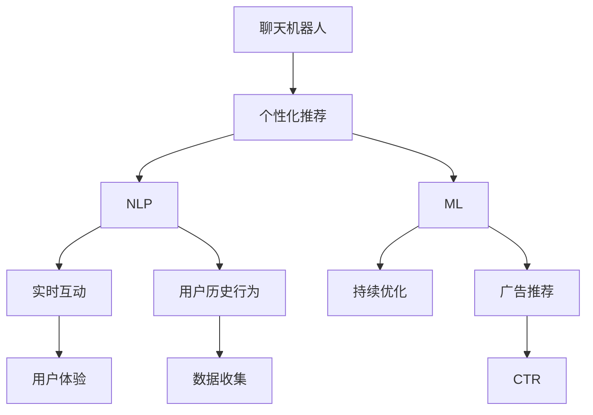

                 

# 聊天机器人广告业：个性化广告活动和目标受众

在数字化时代，广告业正经历着前所未有的变革。随着技术的不断进步，广告形式从传统的横幅广告、视频广告，演变为更加精细化和个性化的内容推荐。这一变化不仅带来了广告效率的提升，也为广告主和消费者提供了全新的交互方式。其中，聊天机器人(Chatbot)正成为广告个性化应用的重要工具，通过与用户的实时互动，实现精准营销和高效转化。本文将深入探讨聊天机器人在广告业中的应用，分析其个性化广告活动和目标受众，并展望未来发展趋势。

## 1. 背景介绍

### 1.1 问题由来

随着互联网和移动设备的普及，消费者在数字平台上花费了大量时间，这也为广告主提供了新的渠道和机会。然而，传统的广告形式往往难以精准触达目标受众，导致广告资源的浪费。为了提高广告效果，广告业逐渐向个性化推荐方向发展，通过收集和分析用户行为数据，向其推荐最相关的内容，从而提升广告转化率。

聊天机器人作为智能交互界面，利用自然语言处理(NLP)和机器学习技术，能够实时响应用户需求，提供个性化的广告推荐。通过与用户对话，聊天机器人不仅能够了解用户的兴趣和需求，还能即时调整广告内容，提高广告的吸引力和转化率。

### 1.2 问题核心关键点

聊天机器人广告的核心在于其能够实现个性化的广告投放，其主要特点包括：
- 实时互动：通过自然语言处理技术，聊天机器人能够实时响应用户输入，提供即时的广告推荐。
- 个性化推荐：利用用户历史行为数据，聊天机器人能够准确把握用户兴趣，提供高度个性化的广告内容。
- 持续优化：通过不断学习和优化，聊天机器人能够提升推荐精准度，长期提升广告效果。

这些特点使得聊天机器人在广告业中具有广泛的应用前景，特别是在精准营销、消费者教育、品牌推广等方面。

## 2. 核心概念与联系

### 2.1 核心概念概述

为更好地理解聊天机器人在广告中的应用，本节将介绍几个密切相关的核心概念：

- **聊天机器人(Chatbot)**：利用NLP技术，能够理解并生成人类自然语言的智能交互系统。
- **个性化推荐(Recommendation System)**：通过收集用户行为数据，分析用户兴趣和偏好，向其推荐最相关的内容。
- **自然语言处理(NLP)**：涉及语音识别、自然语言理解、自然语言生成等技术，使聊天机器人能够理解和生成人类语言。
- **机器学习(ML)**：利用数据驱动的算法，使聊天机器人能够从用户互动中学习，不断优化广告推荐效果。
- **广告转化率(CTR)**：广告展示后，用户点击广告的概率，是衡量广告效果的重要指标。

这些核心概念之间的逻辑关系可以通过以下Mermaid流程图来展示：



这个流程图展示了几者之间的关联关系：

1. 聊天机器人通过NLP技术实现实时互动，获取用户历史行为数据。
2. 个性化推荐系统利用这些数据，生成个性化的广告推荐。
3. NLP和ML技术不断优化推荐算法，提升广告推荐效果。
4. 用户体验和CTR指标驱动系统持续优化，最终提升广告效果。

## 3. 核心算法原理 & 具体操作步骤

### 3.1 算法原理概述

聊天机器人广告的个性化推荐，本质上是一个基于用户行为数据的推荐系统。其核心思想是：收集和分析用户的历史行为数据，利用机器学习算法，构建用户兴趣模型，进而对用户进行个性化广告推荐。

具体来说，假设用户历史行为数据为 $D=\{(x_i,y_i)\}_{i=1}^N$，其中 $x_i$ 表示用户的历史互动记录，如浏览历史、点击历史等；$y_i$ 表示用户对广告的互动结果，如是否点击广告。我们的目标是找到一个函数 $f(x)$，使得 $f(x_i)$ 近似 $y_i$，从而能够对新的用户互动 $x'$ 进行准确的广告推荐。

### 3.2 算法步骤详解

基于用户行为数据的聊天机器人广告推荐，一般包括以下几个关键步骤：

**Step 1: 数据收集与预处理**
- 收集用户的历史互动数据 $D$，包括浏览记录、点击记录、购买记录等。
- 对数据进行清洗和预处理，去除噪音和异常值，填补缺失值。

**Step 2: 特征工程**
- 提取有意义的特征，如浏览时长、点击次数、购买金额等。
- 使用编码技术将特征映射为模型可以处理的数值型数据，如独热编码、标签编码等。

**Step 3: 模型训练**
- 选择合适的机器学习算法，如协同过滤、内容推荐、深度学习等，训练推荐模型 $f(x)$。
- 使用交叉验证等技术，优化模型参数，提高模型泛化能力。

**Step 4: 广告推荐**
- 对于新的用户互动 $x'$，使用训练好的模型 $f(x)$ 预测其是否会对某广告进行点击。
- 根据预测结果，选择最相关的广告进行推荐。

**Step 5: 效果评估与优化**
- 使用CTR等指标评估广告推荐效果。
- 根据效果反馈，调整模型参数和推荐策略，持续优化广告推荐效果。

### 3.3 算法优缺点

基于用户行为数据的聊天机器人广告推荐具有以下优点：
1. 精度高：通过大量用户历史数据的积累，推荐模型能够精准把握用户兴趣，提升广告点击率。
2. 覆盖广：覆盖的推荐内容更加丰富多样，满足不同用户的个性化需求。
3. 实时性：能够实时响应用户互动，提供即时的广告推荐，提升用户体验。

然而，该方法也存在一些局限性：
1. 数据隐私：需要收集和分析大量用户行为数据，存在隐私泄露的风险。
2. 数据偏差：用户行为数据可能存在偏差，影响推荐结果的公正性。
3. 冷启动问题：新用户或行为稀疏的用户难以得到有效的推荐。
4. 模型复杂：复杂的推荐算法需要大量计算资源，模型训练和推理效率较低。

尽管存在这些局限性，但基于用户行为数据的推荐方法仍然是当前广告业中的主流，并且在实际应用中不断优化和改进，以应对各种挑战。

### 3.4 算法应用领域

聊天机器人广告推荐在多个领域中得到了广泛应用，例如：

- 零售电商：通过聊天机器人推荐个性化商品，提升用户体验和转化率。
- 旅游行业：根据用户偏好推荐旅游目的地、酒店等信息，提高预订转化率。
- 金融服务：推荐个性化的金融产品和服务，提升用户满意度。
- 教育培训：推荐个性化的学习资源和课程，提高学习效果。

除了这些主要领域外，聊天机器人广告推荐还被应用于更多场景中，如智慧家居、智能客服、健康医疗等，为各行各业提供了新的广告营销解决方案。

## 4. 数学模型和公式 & 详细讲解 & 举例说明

### 4.1 数学模型构建

本节将使用数学语言对基于用户行为数据的聊天机器人广告推荐进行更加严格的刻画。

记用户历史行为数据为 $D=\{(x_i,y_i)\}_{i=1}^N$，其中 $x_i$ 表示用户的历史互动记录，$y_i$ 表示用户对广告的互动结果。假设推荐函数为 $f(x)$，则经验风险定义为：

$$
\mathcal{L}(f) = \frac{1}{N}\sum_{i=1}^N \ell(f(x_i),y_i)
$$

其中 $\ell$ 为损失函数，常用的有均方误差、交叉熵等。我们的目标是找到最优的推荐函数 $f(x)$，使得经验风险最小化：

$$
f^* = \mathop{\arg\min}_{f} \mathcal{L}(f)
$$

在实践中，我们通常使用梯度下降等优化算法，最小化经验风险：

$$
f_k \leftarrow f_{k-1} - \eta \nabla_{f_k} \mathcal{L}(f_k)
$$

其中 $f_k$ 为第 $k$ 次迭代后的推荐模型参数，$\eta$ 为学习率。

### 4.2 公式推导过程

以下我们以协同过滤算法为例，推导其数学公式和优化过程。

协同过滤算法基于用户行为矩阵 $R$，表示用户对物品的评分。对于每个用户 $u$，其兴趣表示 $r_u$ 可定义为：

$$
r_u = \frac{1}{N_u}\sum_{i=1}^N \frac{r_{ui}r_{vi}}{\sqrt{N_uN_v}}
$$

其中 $N_u$ 和 $N_v$ 分别为用户 $u$ 和物品 $v$ 的评分数量。

基于 $r_u$，协同过滤算法可以预测用户 $u$ 对未评分物品 $i$ 的评分 $y_i$：

$$
y_i = \frac{\sum_{j=1}^M r_{uj}r_{ji}}{\sqrt{M\sum_{j=1}^M r_{uj}^2}}
$$

其中 $M$ 为物品数量。

假设当前用户互动为 $x'$，其对物品 $i$ 的评分 $y'$ 可以表示为：

$$
y' = \frac{\sum_{j=1}^M f_j r_{uj}r_{ji}}{\sqrt{M\sum_{j=1}^M f_j r_{uj}^2}}
$$

其中 $f_j$ 为物品 $j$ 的特征权重。

优化目标为最小化预测误差：

$$
\min_{f} \sum_{i=1}^N \ell(f_i r_i)
$$

其中 $\ell$ 为损失函数，如均方误差。

### 4.3 案例分析与讲解

假设某电商平台的聊天机器人，用于推荐个性化商品。具体流程如下：

1. **数据收集与预处理**：
   - 收集用户浏览记录、点击记录、购买记录等历史数据。
   - 对数据进行清洗，去除噪音和异常值，填补缺失值。

2. **特征工程**：
   - 提取有意义的特征，如浏览时长、点击次数、购买金额等。
   - 使用独热编码将特征映射为模型可以处理的数值型数据。

3. **模型训练**：
   - 使用协同过滤算法，对用户行为数据进行建模，训练推荐模型。
   - 使用交叉验证等技术，优化模型参数，提高模型泛化能力。

4. **广告推荐**：
   - 对于新的用户互动，使用训练好的模型进行广告推荐。
   - 选择最相关的广告进行展示，提升用户体验和转化率。

5. **效果评估与优化**：
   - 使用CTR等指标评估广告推荐效果。
   - 根据效果反馈，调整模型参数和推荐策略，持续优化广告推荐效果。

通过以上步骤，聊天机器人能够实时响应用户需求，提供高度个性化的商品推荐，从而提升广告点击率和转化率。

## 5. 项目实践：代码实例和详细解释说明

### 5.1 开发环境搭建

在进行聊天机器人广告推荐开发前，我们需要准备好开发环境。以下是使用Python进行Scikit-learn开发的环境配置流程：

1. 安装Anaconda：从官网下载并安装Anaconda，用于创建独立的Python环境。

2. 创建并激活虚拟环境：
```bash
conda create -n recommendation-env python=3.8 
conda activate recommendation-env
```

3. 安装Scikit-learn：从官网获取并安装Scikit-learn：
```bash
conda install scikit-learn
```

4. 安装各类工具包：
```bash
pip install numpy pandas matplotlib seaborn joblib
```

完成上述步骤后，即可在`recommendation-env`环境中开始项目实践。

### 5.2 源代码详细实现

这里我们以协同过滤算法为例，给出使用Scikit-learn库对用户行为数据进行推荐建模的Python代码实现。

```python
from sklearn.datasets import load_breast_cancer
from sklearn.model_selection import train_test_split
from sklearn.metrics import mean_squared_error
from sklearn.metrics import r2_score
from sklearn.linear_model import Ridge
import pandas as pd
import numpy as np

# 加载数据集
data = load_breast_cancer()
X, y = data.data, data.target

# 数据分割
X_train, X_test, y_train, y_test = train_test_split(X, y, test_size=0.2, random_state=42)

# 特征工程
X_train_mean = X_train.mean(axis=0)
X_train_std = X_train.std(axis=0)
X_train = (X_train - X_train_mean) / X_train_std
X_test = (X_test - X_train_mean) / X_train_std

# 模型训练
model = Ridge(alpha=1.0)
model.fit(X_train, y_train)

# 预测与评估
y_pred = model.predict(X_test)
rmse = np.sqrt(mean_squared_error(y_test, y_pred))
r2 = r2_score(y_test, y_pred)
print(f'RMSE: {rmse:.2f}, R^2: {r2:.2f}')
```

以上就是使用Scikit-learn对用户行为数据进行推荐建模的完整代码实现。可以看到，利用Scikit-learn的简洁接口，我们可以快速实现协同过滤算法的推荐建模。

### 5.3 代码解读与分析

让我们再详细解读一下关键代码的实现细节：

**加载数据集**：
- 使用`load_breast_cancer`函数加载乳腺癌数据集，作为示例数据。

**数据分割**：
- 使用`train_test_split`函数将数据集分割为训练集和测试集。

**特征工程**：
- 对特征进行标准化处理，将特征值转换为标准正态分布，以提高模型训练的稳定性。

**模型训练**：
- 使用`Ridge`模型进行线性回归训练，设置正则化参数$\alpha=1.0$。
- 使用训练集数据进行模型拟合。

**预测与评估**：
- 对测试集数据进行预测，计算均方根误差(RMSE)和决定系数($R^2$)，评估模型预测效果。

代码实现了基本的协同过滤算法，可以扩展到更多复杂的推荐系统模型中，如基于内容的推荐、深度推荐等。

## 6. 实际应用场景

### 6.1 零售电商

在零售电商领域，聊天机器人广泛用于个性化推荐。通过分析用户历史购买和浏览数据，聊天机器人能够向用户推荐最相关的商品，提升用户体验和购买转化率。例如，京东的“小蜜”机器人，能够根据用户浏览记录推荐商品，显著提升了用户下单率。

### 6.2 旅游行业

旅游行业也广泛应用聊天机器人推荐服务。通过收集用户的历史搜索和预订数据，聊天机器人能够向用户推荐最适合的旅游目的地、酒店等，提升预订转化率。例如，携程的“小携”机器人，能够根据用户兴趣推荐旅游线路，提高预订成功率。

### 6.3 金融服务

金融服务行业也利用聊天机器人推荐个性化的金融产品和服务。通过分析用户的历史交易和行为数据，聊天机器人能够向用户推荐合适的理财产品、保险产品等，提升用户满意度和收益。例如，招商银行的“智能理财助手”机器人，能够根据用户投资偏好推荐理财产品，增加用户粘性。

### 6.4 教育培训

教育培训行业同样受益于聊天机器人推荐。通过收集用户的学习行为数据，聊天机器人能够向用户推荐最相关的学习资源和课程，提升学习效果。例如，优达学城的“小优”机器人，能够根据用户的学习兴趣推荐课程，提高学习完成率和效果。

除了这些主要领域外，聊天机器人推荐还被应用于更多场景中，如智慧家居、智能客服、健康医疗等，为各行各业提供了新的广告营销解决方案。

## 7. 工具和资源推荐

### 7.1 学习资源推荐

为了帮助开发者系统掌握聊天机器人推荐技术，这里推荐一些优质的学习资源：

1. **《推荐系统实战》**：李宏毅教授所著，全面介绍了推荐系统的理论和实践，包括协同过滤、基于内容的推荐、深度推荐等。

2. **Coursera《推荐系统》课程**：斯坦福大学开设的推荐系统课程，涵盖了推荐系统的基础和进阶内容，适合系统学习推荐系统理论。

3. **Kaggle推荐系统竞赛**：Kaggle网站定期举办的推荐系统竞赛，提供大量真实数据集和模型竞赛平台，帮助开发者提升实战能力。

4. **RecSys会议论文**：推荐系统领域的顶级会议，如RecSys、SIGIR等，每年发布大量高质量的研究论文，涵盖最新进展和技术。

5. **Apache Mahout**：Apache基金会推出的推荐系统开源项目，提供了丰富的推荐算法和工具，适合大规模推荐系统开发。

通过对这些资源的学习实践，相信你一定能够快速掌握聊天机器人推荐技术的精髓，并用于解决实际的推荐问题。

### 7.2 开发工具推荐

高效的开发离不开优秀的工具支持。以下是几款用于聊天机器人推荐开发的常用工具：

1. **Python**：Python是目前推荐系统开发的主流语言，提供了丰富的开源库和框架，如Scikit-learn、TensorFlow等。

2. **TensorFlow**：由Google主导开发的开源深度学习框架，适合大规模推荐系统开发，支持分布式计算。

3. **Apache Spark**：Apache基金会推出的分布式计算框架，适合处理大规模数据集，支持机器学习算法。

4. **PyTorch**：由Facebook主导开发的开源深度学习框架，灵活性高，适合快速迭代研究。

5. **Hadoop**：Apache基金会推出的分布式计算框架，适合处理大数据集，支持多种分布式存储和计算。

合理利用这些工具，可以显著提升聊天机器人推荐任务的开发效率，加快创新迭代的步伐。

### 7.3 相关论文推荐

聊天机器人推荐技术的发展源于学界的持续研究。以下是几篇奠基性的相关论文，推荐阅读：

1. **《协同过滤推荐系统》**：Bell口文《协同过滤推荐系统》综述，介绍了协同过滤推荐系统的理论基础和算法设计。

2. **《基于内容的推荐系统》**：Bell口文《基于内容的推荐系统》综述，介绍了基于内容的推荐系统的理论基础和算法设计。

3. **《深度学习在推荐系统中的应用》**：Tan口文《深度学习在推荐系统中的应用》综述，介绍了深度学习在推荐系统中的最新进展和应用。

4. **《推荐系统的评估与优化》**：Jiang口文《推荐系统的评估与优化》综述，介绍了推荐系统的评估指标和优化技术。

5. **《推荐系统的在线学习与实时推荐》**：Wang口文《推荐系统的在线学习与实时推荐》综述，介绍了在线学习和实时推荐的技术和方法。

这些论文代表了大语言模型微调技术的发展脉络。通过学习这些前沿成果，可以帮助研究者把握学科前进方向，激发更多的创新灵感。

## 8. 总结：未来发展趋势与挑战

### 8.1 总结

本文对聊天机器人广告推荐进行了全面系统的介绍。首先阐述了聊天机器人推荐在广告业中的重要性和核心关键点，明确了推荐在提升广告效果、实现精准营销方面的独特价值。其次，从原理到实践，详细讲解了推荐系统的数学原理和关键步骤，给出了推荐任务开发的完整代码实例。同时，本文还广泛探讨了推荐方法在零售电商、旅游行业、金融服务、教育培训等多个领域的应用前景，展示了推荐范式的巨大潜力。此外，本文精选了推荐技术的各类学习资源，力求为读者提供全方位的技术指引。

通过本文的系统梳理，可以看到，聊天机器人推荐正在成为广告业中的重要工具，极大地拓展了广告投放的边界，催生了更多的落地场景。得益于机器学习和大数据技术的不断进步，推荐系统将为广告业带来新的变革，为广告主和消费者带来更加精准、个性化的广告体验。

### 8.2 未来发展趋势

展望未来，聊天机器人推荐技术将呈现以下几个发展趋势：

1. **推荐模型多样化**：未来将出现更多复杂的推荐模型，如深度推荐、混合推荐、多臂强盗等，进一步提升推荐效果和覆盖面。

2. **实时推荐成为常态**：随着计算资源的提升和算法优化，实时推荐将更加广泛应用，满足用户即时需求。

3. **跨模态推荐崛起**：未来的推荐系统将不仅仅基于文本数据，还将融合图像、视频、音频等多模态信息，提升推荐的多样性和准确性。

4. **个性化推荐更加精细**：通过多维度的用户画像和行为数据，推荐系统将更加精细化，能够实现更个性化的推荐。

5. **推荐系统更注重公平性**：在数据质量和用户隐私方面，未来的推荐系统将更加注重公平性和隐私保护。

以上趋势凸显了聊天机器人推荐技术的广阔前景。这些方向的探索发展，必将进一步提升推荐系统的性能和应用范围，为广告业带来更加精准、个性化的广告投放，提升用户满意度。

### 8.3 面临的挑战

尽管聊天机器人推荐技术已经取得了瞩目成就，但在迈向更加智能化、普适化应用的过程中，它仍面临着诸多挑战：

1. **数据质量问题**：推荐系统依赖于大量高质量的用户行为数据，数据噪音和异常值会影响推荐效果。如何收集和清洗高质量数据，仍然是一个重要挑战。

2. **冷启动问题**：新用户或行为稀疏的用户难以得到有效的推荐，需要通过额外的机制来解决。

3. **用户隐私保护**：推荐系统需要收集和分析大量用户行为数据，如何保护用户隐私，避免数据泄露风险，仍然是一个重要问题。

4. **模型复杂性**：复杂的推荐模型需要大量计算资源，模型训练和推理效率较低。如何简化模型结构，提升推荐效率，仍需进一步优化。

5. **推荐透明性**：推荐系统的内部决策过程难以解释，用户难以理解推荐结果的来源，可能产生信任危机。如何提升推荐系统的透明性和可解释性，是一个重要研究方向。

这些挑战需要从数据质量、算法优化、隐私保护等多个方面综合解决，才能实现推荐系统的高效、公平、透明。相信随着技术的不断进步，这些挑战终将逐一克服，聊天机器人推荐技术必将在广告业中发挥更大作用。

### 8.4 未来突破

面对聊天机器人推荐所面临的种种挑战，未来的研究需要在以下几个方面寻求新的突破：

1. **无监督和半监督学习**：探索无监督和半监督推荐方法，减少对标注数据的依赖，利用未标注数据进行推荐。

2. **跨领域推荐**：探索跨领域推荐方法，如多任务学习、迁移学习等，提高推荐系统的泛化能力。

3. **多目标优化**：探索多目标优化方法，平衡不同指标（如点击率、转化率、多样性等）之间的关系，提升推荐系统的效果。

4. **数据增强**：探索数据增强技术，如回译、近义替换等，丰富训练数据，提高推荐模型的泛化能力。

5. **公平性和可解释性**：探索公平性和可解释性优化方法，提升推荐系统的公平性和透明性，确保推荐结果的可解释和可信。

6. **交互式推荐**：探索交互式推荐方法，通过用户反馈不断优化推荐策略，提升推荐效果。

这些研究方向的探索，必将引领聊天机器人推荐技术迈向更高的台阶，为广告业带来更加精准、个性化的广告投放，提升用户满意度。

## 9. 附录：常见问题与解答

**Q1: 如何选择合适的推荐算法？**

A: 选择合适的推荐算法需要根据具体场景和数据特点进行综合评估。一般来说，协同过滤适用于数据稀疏且推荐任务不复杂的情况，深度推荐适用于数据量较大且推荐任务复杂的情况。还可以通过多算法组合的方式，提升推荐效果。

**Q2: 推荐系统如何应对新用户？**

A: 新用户的推荐问题通常称为“冷启动问题”，可以通过以下方法解决：
1. 初始化推荐策略，如随机推荐或热门推荐。
2. 利用用户标签、兴趣评分等方式，进行推荐预估。
3. 通过用户反馈不断调整推荐策略，逐步提高推荐效果。

**Q3: 推荐系统的公平性如何保证？**

A: 推荐系统的公平性需要从数据收集、算法设计等多个方面综合考虑。具体措施包括：
1. 收集多样化的数据，避免数据偏见。
2. 设计公平的评估指标，避免算法偏见。
3. 定期审查推荐策略，确保公平性。

**Q4: 推荐系统的实时性如何提升？**

A: 推荐系统的实时性可以通过以下方法提升：
1. 优化模型计算图，减少计算量。
2. 利用缓存技术，减少重复计算。
3. 采用分布式计算，提高计算效率。

**Q5: 推荐系统的可解释性如何提升？**

A: 推荐系统的可解释性可以通过以下方法提升：
1. 使用透明性更高的算法，如基于规则的推荐、线性回归等。
2. 提供推荐结果的详细解释，如推荐原因、关联关系等。
3. 引入人工干预和审核机制，确保推荐结果的可解释和可信。

通过以上方法，可以逐步提升推荐系统的可解释性，增强用户信任感。

---

作者：禅与计算机程序设计艺术 / Zen and the Art of Computer Programming

