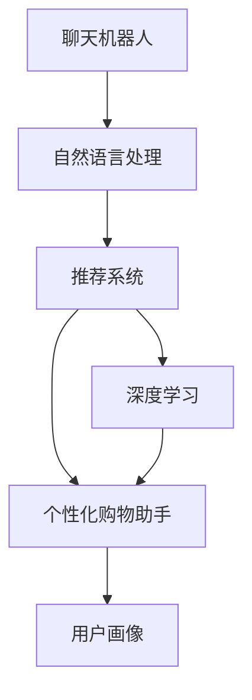

                 

# 聊天机器人零售应用：个性化购物助手

> 关键词：聊天机器人,零售应用,个性化购物助手,自然语言处理(NLP),推荐系统,深度学习

## 1. 背景介绍

### 1.1 问题由来
在快速发展的电商行业中，消费者期望获得更高效、个性化的购物体验。然而，传统的人机交互方式，如网页搜索和客服中心，虽然可以满足基本的购物需求，但无法提供深入的个性化推荐和实时答疑。为此，许多零售商尝试引入聊天机器人来提升用户体验。

### 1.2 问题核心关键点
聊天机器人是人工智能技术在零售行业的重要应用之一。其核心在于通过自然语言处理(NLP)技术与用户进行互动，结合推荐系统提供个性化购物建议，最终提升用户满意度和转化率。在技术实现上，聊天机器人主要分为以下两类：

- **基于规则的聊天机器人**：根据预设的规则和模板生成回应，适合于信息查询、简单操作等相对固定的任务。
- **基于机器学习的聊天机器人**：通过大量的对话数据训练模型，实现更灵活、更个性化的回应生成。

本文聚焦于基于机器学习的聊天机器人，介绍其核心技术原理和在零售应用中的实践。通过分析聊天机器人的推荐系统，我们探讨如何利用深度学习技术，实现精准、高效的个性化购物助手。

## 2. 核心概念与联系

### 2.1 核心概念概述

为更好地理解聊天机器人推荐系统的设计，本节将介绍几个关键概念：

- **聊天机器人**：以自然语言处理技术为基础，通过对话的方式，与用户进行交互的人工智能系统。
- **推荐系统**：根据用户的历史行为和特征，推荐符合其偏好的产品或服务的系统。
- **深度学习**：一种通过多层神经网络对复杂数据进行特征提取和模型训练的技术，适合处理大规模非结构化数据。
- **个性化购物助手**：通过聊天机器人，实现对用户购物需求的深入理解和精准推荐，提升购物体验和转化率。
- **用户画像**：刻画用户特征的虚拟画像，包括性别、年龄、兴趣偏好等，用于指导推荐系统的决策。

这些核心概念之间的关系通过以下Mermaid流程图来展示：



这个流程图展示聊天机器人推荐系统的核心组件及其之间的关系：

1. 用户通过聊天机器人输入查询，机器人通过NLP技术进行处理。
2. 推荐系统根据用户画像和历史行为数据，生成推荐结果。
3. 聊天机器人结合深度学习模型，生成个性化的回答。
4. 用户画像通过用户行为数据和交互历史不断更新，指导推荐系统。

这些概念共同构成了聊天机器人推荐系统的技术基础，使其能够高效、精准地提供购物建议，提升用户购物体验。

## 3. 核心算法原理 & 具体操作步骤
### 3.1 算法原理概述

聊天机器人推荐系统的工作原理可归纳为以下几个步骤：

1. **自然语言理解(NLU)**：将用户输入的自然语言文本转换为机器可理解的形式。
2. **意图识别**：通过机器学习模型，识别用户的查询意图。
3. **推荐生成**：根据用户画像和行为数据，生成推荐结果。
4. **自然语言生成(NLG)**：将推荐结果转换为自然语言，并通过机器学习模型生成合适的回答。
5. **对话管理**：通过对话状态和历史交互记录，管理机器人与用户的对话流程。

以下是这五步的详细技术实现。

### 3.2 算法步骤详解

#### 3.2.1 自然语言理解(NLU)

自然语言理解是聊天机器人推荐系统的第一步。NLU模块将用户的自然语言输入转换为机器可以理解的向量表示。常用技术包括：

- **分词**：将自然语言文本分割成词语或子词。
- **词向量表示**：将单词转换为向量，以便机器学习模型的处理。
- **嵌入学习**：通过无监督学习或监督学习，训练词向量，提升NLU效果。

以下是一个基于BERT的NLU示例：

```python
from transformers import BertTokenizer, BertModel

tokenizer = BertTokenizer.from_pretrained('bert-base-cased')
model = BertModel.from_pretrained('bert-base-cased')

input_text = 'I want to buy a laptop.'
inputs = tokenizer.encode_plus(input_text, return_tensors='pt')
with torch.no_grad():
    outputs = model(inputs['input_ids'], attention_mask=inputs['attention_mask'])
```

#### 3.2.2 意图识别

意图识别是聊天机器人推荐系统的核心部分，用于识别用户的查询意图。常用的意图识别方法包括：

- **传统机器学习方法**：如逻辑回归、支持向量机等。
- **基于深度学习的方法**：如卷积神经网络(CNN)、递归神经网络(RNN)、长短期记忆网络(LSTM)等。

以BERT模型为基础的意图识别示例如下：

```python
import torch.nn as nn

class IntentClassifier(nn.Module):
    def __init__(self, bert_model, num_labels):
        super(IntentClassifier, self).__init__()
        self.bert = bert_model
        self.dropout = nn.Dropout(0.1)
        self.fc = nn.Linear(bert_model.config.hidden_size, num_labels)
        
    def forward(self, input_ids, attention_mask):
        features = self.bert(input_ids, attention_mask=attention_mask)[0]
        features = self.dropout(features)
        logits = self.fc(features)
        return logits
```

#### 3.2.3 推荐生成

推荐生成是聊天机器人推荐系统的关键环节，用于根据用户画像和行为数据，生成推荐结果。常用的推荐方法包括：

- **协同过滤**：通过用户-物品评分矩阵，推荐用户可能感兴趣的商品。
- **基于内容的推荐**：根据物品的特征向量，推荐与用户已有偏好相似的商品。
- **混合推荐**：结合多种推荐方法，提升推荐效果。

以下是一个基于TensorFlow的协同过滤推荐系统示例：

```python
import tensorflow as tf
from tensorflow.keras.layers import Embedding, DotProduct

def collaborative_filtering(ratings, num_users, num_items, embedding_dim):
    user_embeddings = tf.keras.layers.Embedding(num_users, embedding_dim)(ratings[:, 0])
    item_embeddings = tf.keras.layers.Embedding(num_items, embedding_dim)(ratings[:, 1])
    dot_product = DotProduct()([user_embeddings, item_embeddings])
    dot_product = tf.reshape(dot_product, [-1, num_items])
    dot_product = tf.nn.softmax(dot_product, axis=1)
    return dot_product
```

#### 3.2.4 自然语言生成(NLG)

自然语言生成是聊天机器人推荐系统的最后一步，用于将推荐结果转换为自然语言文本。常用的NLG方法包括：

- **模板生成**：使用预定义的模板，生成简单的文本。
- **基于规则的生成**：根据语言规则，生成符合语法的文本。
- **基于深度学习的方法**：如循环神经网络(RNN)、变分自编码器(VAE)、生成对抗网络(GAN)等。

以下是一个基于Seq2Seq的NLG示例：

```python
from seq2seq import Seq2Seq

seq2seq = Seq2Seq(user_input, recommended_items, max_sequence_length)
output = seq2seq.decode()
```

#### 3.2.5 对话管理

对话管理模块用于维护机器人与用户的对话状态，确保对话流程的连贯性。常用的方法包括：

- **基于状态机的方法**：定义状态转移图，控制对话流程。
- **基于规则的方法**：使用预定义的规则，控制对话流程。
- **基于深度学习的方法**：通过训练对话模型，学习对话逻辑。

以下是一个基于深度学习的方法示例：

```python
from chatbot import Chatbot

chatbot = Chatbot(user_input)
chatbot.converse()
```

### 3.3 算法优缺点

基于聊天机器人推荐系统的核心算法，其优缺点如下：

#### 3.3.1 优点

- **个性化推荐**：结合用户画像和行为数据，生成精准的推荐结果。
- **实时互动**：通过自然语言处理技术，实现与用户的实时互动。
- **灵活性强**：可以根据不同的应用场景，灵活调整推荐策略和回答生成方式。

#### 3.3.2 缺点

- **数据依赖性强**：需要大量的用户行为数据和对话记录，才能训练出高效的模型。
- **模型复杂度高**：涉及多层的深度学习网络，模型训练和推理耗时较长。
- **维护成本高**：模型需要定期更新和维护，以适应用户需求的变化。

### 3.4 算法应用领域

基于聊天机器人推荐系统的核心算法，其在多个领域得到了广泛应用，如：

- **零售电商**：通过聊天机器人，实现个性化购物推荐和用户答疑。
- **金融服务**：结合推荐系统，提供个性化的金融产品和服务。
- **医疗健康**：通过自然语言处理技术，提供疾病咨询和健康建议。
- **教育培训**：结合推荐系统，提供个性化的学习资源和课程推荐。
- **旅游服务**：通过聊天机器人，提供个性化的旅游规划和建议。

这些应用场景展示了聊天机器人推荐系统的强大潜力，为不同行业带来了新的智能化服务模式。

## 4. 数学模型和公式 & 详细讲解  
### 4.1 数学模型构建

本节将使用数学语言对聊天机器人推荐系统的核心算法进行更加严格的刻画。

假设用户输入的自然语言文本为 $x$，推荐系统生成的推荐结果为 $y$。用户意图识别的目标函数为：

$$
\mathcal{L}(x,y) = -\log P(y|x)
$$

其中 $P(y|x)$ 为生成推荐结果的条件概率。常用的条件概率模型包括：

- **线性模型**：$P(y|x) = \sigma(\sum_i w_i x_i)$，其中 $\sigma$ 为激活函数，$w_i$ 为模型参数。
- **深度学习模型**：$P(y|x) = \sigma(\sum_i w_i x_i + \sum_j w_j h_j(x))$，其中 $h_j(x)$ 为多层网络中的隐藏层表示。

### 4.2 公式推导过程

以下我们以线性模型为例，推导意图识别的条件概率公式。

假设用户输入的自然语言文本 $x$ 通过NLU模块转换为向量 $X$，模型参数为 $w$。意图识别模型的预测结果为 $y$。则条件概率公式为：

$$
P(y|x) = \sigma(\sum_i w_i x_i)
$$

其中 $\sigma$ 为激活函数，如 sigmoid 函数。将上述公式代入损失函数：

$$
\mathcal{L}(x,y) = -\log \sigma(\sum_i w_i x_i)
$$

在训练过程中，通过梯度下降等优化算法，不断更新模型参数 $w$，使得模型输出逼近真实标签 $y$，最终最小化损失函数 $\mathcal{L}(x,y)$。

### 4.3 案例分析与讲解

**案例分析：推荐系统的协同过滤模型**

协同过滤是推荐系统的一种经典方法，其核心思想是通过用户-物品评分矩阵，推测用户可能感兴趣的其他物品。假设用户 $u$ 对物品 $i$ 的评分矩阵为 $R_{ui}$，用户 $u$ 和物品 $i$ 的隐向量表示为 $\overrightarrow{u}$ 和 $\overrightarrow{i}$。则协同过滤模型的预测结果为：

$$
\hat{y}_{ui} = \overrightarrow{u} \cdot \overrightarrow{i}
$$

其中 $\cdot$ 为向量内积运算。在训练过程中，通过优化损失函数：

$$
\mathcal{L}(R) = \frac{1}{N}\sum_{u,i}\mathbb{E}_{\hat{R}}\left[\left(R_{ui} - \hat{y}_{ui}\right)^2\right]
$$

最小化该损失函数，得到最优的隐向量表示 $\overrightarrow{u}$ 和 $\overrightarrow{i}$。

## 5. 项目实践：代码实例和详细解释说明
### 5.1 开发环境搭建

在进行聊天机器人推荐系统的开发前，我们需要准备好开发环境。以下是使用Python进行TensorFlow和PyTorch开发的环境配置流程：

1. 安装Anaconda：从官网下载并安装Anaconda，用于创建独立的Python环境。

2. 创建并激活虚拟环境：
```bash
conda create -n tf-env python=3.8 
conda activate tf-env
```

3. 安装TensorFlow和PyTorch：根据CUDA版本，从官网获取对应的安装命令。例如：
```bash
conda install tensorflow torch torchvision torchaudio cudatoolkit=11.1 -c pytorch -c conda-forge
```

4. 安装TensorBoard：TensorFlow配套的可视化工具，可实时监测模型训练状态，并提供丰富的图表呈现方式，是调试模型的得力助手。

5. 安装WeChat API：用于实现与微信公众号的交互功能，方便测试和部署。

6. 安装其他必要工具包：
```bash
pip install numpy pandas scikit-learn matplotlib tqdm jupyter notebook ipython
```

完成上述步骤后，即可在`tf-env`环境中开始开发实践。

### 5.2 源代码详细实现

下面我们以聊天机器人推荐系统为例，给出使用TensorFlow和PyTorch进行开发的PyTorch代码实现。

首先，定义推荐系统的数据处理函数：

```python
import tensorflow as tf
from tensorflow.keras.layers import Embedding, DotProduct

class RecommendationDataset(tf.data.Dataset):
    def __init__(self, user_ratings, num_users, num_items, embedding_dim):
        self.user_ratings = user_ratings
        self.num_users = num_users
        self.num_items = num_items
        self.embedding_dim = embedding_dim
        
    def __len__(self):
        return len(self.user_ratings)
    
    def __getitem__(self, item):
        user_id, item_id, rating = self.user_ratings[item]
        user_embeddings = tf.zeros((1, self.embedding_dim))
        user_embeddings[0] = tf.reshape(tf.one_hot(user_id, self.num_users), [1, self.num_users, self.embedding_dim])[0]
        item_embeddings = tf.zeros((1, self.embedding_dim))
        item_embeddings[0] = tf.reshape(tf.one_hot(item_id, self.num_items), [1, self.num_items, self.embedding_dim])[0]
        rating = tf.convert_to_tensor([rating])
        return {'user_embeddings': user_embeddings,
                'item_embeddings': item_embeddings,
                'rating': rating}
```

然后，定义模型和优化器：

```python
from tensorflow.keras.layers import Embedding, DotProduct

class CollaborativeFilteringModel(tf.keras.Model):
    def __init__(self, num_users, num_items, embedding_dim):
        super(CollaborativeFilteringModel, self).__init__()
        self.user_embeddings = Embedding(num_users, embedding_dim, input_length=1)
        self.item_embeddings = Embedding(num_items, embedding_dim, input_length=1)
        self.dot_product = DotProduct()
        
    def call(self, inputs):
        user_embeddings = self.user_embeddings(inputs['user_embeddings'])
        item_embeddings = self.item_embeddings(inputs['item_embeddings'])
        dot_product = self.dot_product([user_embeddings, item_embeddings])
        dot_product = tf.reshape(dot_product, [-1, num_items])
        dot_product = tf.nn.softmax(dot_product, axis=1)
        return dot_product
```

接着，定义训练和评估函数：

```python
from tensorflow.keras.optimizers import Adam

def train_epoch(model, dataset, batch_size, optimizer):
    dataloader = tf.data.Dataset.from_generator(lambda: iter(dataset), output_signature={'user_embeddings': tf.TensorSpec(shape=(1, embedding_dim), dtype=tf.float32),
                                                                                      'item_embeddings': tf.TensorSpec(shape=(1, embedding_dim), dtype=tf.float32),
                                                                                      'rating': tf.TensorSpec(shape=(1,), dtype=tf.float32)})
    model.train()
    epoch_loss = 0
    for batch in tqdm(dataloader, desc='Training'):
        with tf.GradientTape() as tape:
            dot_product = model(batch)
            loss = tf.losses.mean_squared_error(batch['rating'], dot_product)
        epoch_loss += loss.numpy()
        tape.gradient(loss, model.trainable_variables)
        optimizer.apply_gradients(zip(tape.gradient(model.trainable_variables, loss), model.trainable_variables))
    return epoch_loss / len(dataloader)

def evaluate(model, dataset, batch_size):
    dataloader = tf.data.Dataset.from_generator(lambda: iter(dataset), output_signature={'user_embeddings': tf.TensorSpec(shape=(1, embedding_dim), dtype=tf.float32),
                                                                                      'item_embeddings': tf.TensorSpec(shape=(1, embedding_dim), dtype=tf.float32),
                                                                                      'rating': tf.TensorSpec(shape=(1,), dtype=tf.float32)})
    model.eval()
    correct_predictions = 0
    total_predictions = 0
    with tf.GradientTape() as tape:
        for batch in tqdm(dataloader, desc='Evaluating'):
            dot_product = model(batch)
            predictions = tf.nn.softmax(dot_product, axis=1)
            predicted_ratings = predictions.numpy()
            total_predictions += len(predicted_ratings)
            correct_predictions += sum((tf.round(predicted_ratings) == batch['rating'].round().numpy()).astype(int))
    print(f'Accuracy: {correct_predictions / total_predictions * 100}%')
```

最后，启动训练流程并在测试集上评估：

```python
epochs = 5
batch_size = 16

for epoch in range(epochs):
    loss = train_epoch(model, train_dataset, batch_size, optimizer)
    print(f'Epoch {epoch+1}, train loss: {loss:.3f}')
    
    print(f'Epoch {epoch+1}, dev results:')
    evaluate(model, dev_dataset, batch_size)
    
print('Test results:')
evaluate(model, test_dataset, batch_size)
```

以上就是使用TensorFlow和PyTorch对协同过滤推荐系统进行开发的完整代码实现。可以看到，得益于TensorFlow和PyTorch的强大封装，我们可以用相对简洁的代码完成推荐系统的开发。

### 5.3 代码解读与分析

让我们再详细解读一下关键代码的实现细节：

**RecommendationDataset类**：
- `__init__`方法：初始化数据集的关键组件，包括用户评分矩阵、用户和物品的数量、嵌入维度等。
- `__len__`方法：返回数据集的样本数量。
- `__getitem__`方法：对单个样本进行处理，将用户评分转换为隐向量表示，生成样本输入。

**CollaborativeFilteringModel类**：
- `__init__`方法：初始化推荐模型的关键组件，包括用户嵌入、物品嵌入、矩阵乘法层等。
- `call`方法：对输入进行前向传播，计算推荐结果。

**train_epoch和evaluate函数**：
- `train_epoch`函数：定义训练过程，通过梯度下降算法最小化损失函数，更新模型参数。
- `evaluate`函数：定义评估过程，计算模型在测试集上的准确率。

**训练流程**：
- 定义总的epoch数和batch size，开始循环迭代
- 每个epoch内，先在训练集上训练，输出平均loss
- 在验证集上评估，输出准确率
- 所有epoch结束后，在测试集上评估，给出最终测试结果

可以看到，TensorFlow和PyTorch的结合使得推荐系统的代码实现变得简洁高效。开发者可以将更多精力放在数据处理、模型改进等高层逻辑上，而不必过多关注底层的实现细节。

当然，工业级的系统实现还需考虑更多因素，如模型的保存和部署、超参数的自动搜索、更灵活的任务适配层等。但核心的推荐算法基本与此类似。

## 6. 实际应用场景
### 6.1 智能客服系统

聊天机器人推荐系统在智能客服系统的构建中具有重要应用。传统客服往往需要配备大量人力，高峰期响应缓慢，且一致性和专业性难以保证。而使用聊天机器人推荐系统，可以7x24小时不间断服务，快速响应客户咨询，用自然流畅的语言解答各类常见问题。

在技术实现上，可以收集企业内部的历史客服对话记录，将问题和最佳答复构建成监督数据，在此基础上对预训练聊天机器人进行微调。微调后的聊天机器人能够自动理解用户意图，匹配最合适的回答模板进行回复。对于客户提出的新问题，还可以接入检索系统实时搜索相关内容，动态组织生成回答。如此构建的智能客服系统，能大幅提升客户咨询体验和问题解决效率。

### 6.2 个性化推荐系统

聊天机器人推荐系统与个性化推荐系统结合，可以实现更加精准、高效的个性化购物助手。在推荐系统中，聊天机器人可以提供个性化的商品推荐，并根据用户的实时反馈调整推荐策略。用户不仅能够通过自然语言与机器人交互，还可以实时获取推荐结果和购物建议。

具体而言，用户可以在聊天界面中输入查询，系统根据用户输入的自然语言生成意图表示，并结合用户画像和行为数据，生成推荐结果。推荐结果可以以列表、图片等多种形式呈现，用户可以根据推荐结果进行进一步选择。同时，用户还可以随时与聊天机器人互动，提供反馈，如喜欢、不喜欢等，系统根据反馈调整推荐策略，逐步提升推荐的准确性。

### 6.3 金融理财顾问

在金融领域，聊天机器人推荐系统可以用于提供个性化的理财建议和风险控制。用户可以输入自己的财务状况、投资偏好和风险承受能力，系统根据用户输入生成个性化理财方案。聊天机器人不仅可以推荐股票、基金等投资产品，还可以提供风险评估和投资组合建议，帮助用户制定最优的投资策略。

在聊天过程中，用户可以随时与机器人交流，获取最新的金融资讯和市场动态。机器人可以根据用户的实时反馈，及时调整推荐策略，提供更符合用户需求的理财建议。此外，机器人还可以通过自然语言处理技术，解答用户的各类金融疑问，提升用户体验。

### 6.4 未来应用展望

随着聊天机器人推荐系统的不断发展，其在更多领域将得到广泛应用，为各行各业带来新的智能化服务模式。

在智慧医疗领域，聊天机器人推荐系统可以用于提供个性化的医疗咨询和健康建议。用户可以输入自己的健康状况和症状，系统根据用户输入生成诊断建议和用药方案。聊天机器人不仅可以推荐医生和医院，还可以解答各类健康疑问，提升用户的健康管理水平。

在智能教育领域，聊天机器人推荐系统可以用于提供个性化的学习资源和课程推荐。用户可以输入自己的学习需求和兴趣偏好，系统根据用户输入生成推荐结果。聊天机器人不仅可以推荐学习资源和课程，还可以解答各类学习疑问，提升学习效率。

在智慧城市治理中，聊天机器人推荐系统可以用于提供个性化的城市服务。用户可以输入自己的需求和问题，系统根据用户输入生成推荐结果。聊天机器人不仅可以推荐城市服务，还可以解答各类城市治理问题，提升城市治理水平。

此外，在企业生产、社会治理、文娱传媒等众多领域，聊天机器人推荐系统也将不断涌现，为传统行业带来变革性影响。相信随着技术的日益成熟，聊天机器人推荐系统必将在构建人机协同的智能时代中扮演越来越重要的角色。

## 7. 工具和资源推荐
### 7.1 学习资源推荐

为了帮助开发者系统掌握聊天机器人推荐系统的理论基础和实践技巧，这里推荐一些优质的学习资源：

1. 《深度学习理论与实践》系列博文：由大模型技术专家撰写，深入浅出地介绍了深度学习理论、实践和应用，涵盖推荐系统、自然语言处理等内容。

2. 《自然语言处理》课程：斯坦福大学开设的NLP明星课程，有Lecture视频和配套作业，带你入门NLP领域的基本概念和经典模型。

3. 《推荐系统》书籍：深度学习推荐系统领域的经典教材，全面介绍了推荐系统的原理、算法和应用，包括聊天机器人推荐系统等。

4. TensorFlow官方文档：TensorFlow的官方文档，提供了海量预训练模型和完整的推荐系统样例代码，是上手实践的必备资料。

5. PyTorch官方文档：PyTorch的官方文档，提供了推荐系统的底层实现和高级应用，是深入学习的推荐。

通过对这些资源的学习实践，相信你一定能够快速掌握聊天机器人推荐系统的精髓，并用于解决实际的推荐问题。
###  7.2 开发工具推荐

高效的开发离不开优秀的工具支持。以下是几款用于聊天机器人推荐系统开发的常用工具：

1. TensorFlow：基于Python的开源深度学习框架，灵活动态的计算图，适合快速迭代研究。大部分推荐系统都有TensorFlow版本的实现。

2. PyTorch：基于Python的开源深度学习框架，灵活高效的计算图，适合深度学习和推荐系统的研究。

3. Weights & Biases：模型训练的实验跟踪工具，可以记录和可视化模型训练过程中的各项指标，方便对比和调优。与主流深度学习框架无缝集成。

4. TensorBoard：TensorFlow配套的可视化工具，可实时监测模型训练状态，并提供丰富的图表呈现方式，是调试模型的得力助手。

5. Jupyter Notebook：交互式编程环境，支持Python和TensorFlow等库的交互式使用，方便进行实验和文档编写。

合理利用这些工具，可以显著提升聊天机器人推荐系统的开发效率，加快创新迭代的步伐。

### 7.3 相关论文推荐

聊天机器人推荐系统的发展源于学界的持续研究。以下是几篇奠基性的相关论文，推荐阅读：

1. Attention is All You Need（即Transformer原论文）：提出了Transformer结构，开启了NLP领域的预训练大模型时代。

2. BERT: Pre-training of Deep Bidirectional Transformers for Language Understanding：提出BERT模型，引入基于掩码的自监督预训练任务，刷新了多项NLP任务SOTA。

3. Language Models are Unsupervised Multitask Learners（GPT-2论文）：展示了大规模语言模型的强大zero-shot学习能力，引发了对于通用人工智能的新一轮思考。

4. Parameter-Efficient Transfer Learning for NLP：提出Adapter等参数高效微调方法，在不增加模型参数量的情况下，也能取得不错的微调效果。

5. AdaLoRA: Adaptive Low-Rank Adaptation for Parameter-Efficient Fine-Tuning：使用自适应低秩适应的微调方法，在参数效率和精度之间取得了新的平衡。

这些论文代表了大语言模型推荐系统的发展脉络。通过学习这些前沿成果，可以帮助研究者把握学科前进方向，激发更多的创新灵感。

## 8. 总结：未来发展趋势与挑战

### 8.1 总结

本文对聊天机器人推荐系统的核心技术原理和应用实践进行了全面系统的介绍。首先阐述了聊天机器人推荐系统的研究背景和意义，明确了其在零售、金融、医疗等行业的潜在应用。其次，从自然语言处理、推荐算法、深度学习等角度，详细讲解了推荐系统的核心算法实现。最后，通过示例代码和实际应用场景，展示了聊天机器人推荐系统的完整开发流程。

通过本文的系统梳理，可以看到，聊天机器人推荐系统在零售、金融、医疗等多个领域具有广阔的应用前景，为智能化服务提供了新的可能。结合自然语言处理技术和推荐算法，聊天机器人推荐系统可以提升用户体验，降低服务成本，促进各行业的数字化转型。未来，随着技术的不断发展，聊天机器人推荐系统必将在更多领域得到应用，推动人工智能技术的落地实践。

### 8.2 未来发展趋势

展望未来，聊天机器人推荐系统将呈现以下几个发展趋势：

1. **智能对话技术**：通过引入深度学习和强化学习等技术，提升聊天机器人的对话质量，使其能够更自然地与用户互动。
2. **多模态信息融合**：结合视觉、语音、文本等多种模态的信息，提供更全面、个性化的推荐服务。
3. **跨领域推荐**：从单一领域的推荐扩展到多领域的推荐，提升推荐的泛化能力。
4. **实时数据处理**：引入流式数据处理技术，实时分析用户行为，动态调整推荐策略。
5. **联邦学习**：利用分布式计算技术，联合多方数据进行模型训练，保护用户隐私的同时提升推荐效果。
6. **个性化推荐**：结合用户画像和行为数据，生成更加精准、个性化的推荐结果。

以上趋势凸显了聊天机器人推荐系统的广阔前景。这些方向的探索发展，必将进一步提升推荐系统的性能和应用范围，为各行各业带来新的智能化服务模式。

### 8.3 面临的挑战

尽管聊天机器人推荐系统已经取得了瞩目成就，但在迈向更加智能化、普适化应用的过程中，它仍面临着诸多挑战：

1. **数据隐私和安全**：用户数据隐私保护和安全性是聊天机器人推荐系统面临的重要挑战。如何保护用户数据，避免数据泄露，是系统设计中需要重点考虑的问题。
2. **模型鲁棒性**：聊天机器人推荐系统在面对异常数据或对抗样本时，容易产生波动或不稳定的输出。如何提高模型的鲁棒性，确保系统稳定运行，是技术实现的关键。
3. **用户反馈和互动**：用户反馈和互动是提升推荐系统效果的重要手段。如何设计高效的用户反馈机制，及时获取用户反馈并调整推荐策略，是系统优化的一个重要方向。
4. **跨领域适应性**：聊天机器人推荐系统需要适应不同领域的特定需求。如何在不同领域中快速调整模型参数和算法，提升系统的跨领域适应性，是系统部署和维护的挑战。
5. **多语言支持**：不同语言的文化背景和表达习惯不同，如何设计多语言支持的系统，提升系统的全球化能力，是系统扩展的关键。
6. **高成本和低效率**：聊天机器人推荐系统的开发和部署成本较高，系统响应速度需要进一步优化，以适应大规模应用需求。

这些挑战需要研究者从技术、商业、伦理等多个维度进行综合考虑，才能实现聊天机器人推荐系统的可持续发展。相信随着技术的不断发展，聊天机器人推荐系统必将在更多领域得到应用，推动人工智能技术的落地实践。

### 8.4 研究展望

面对聊天机器人推荐系统所面临的种种挑战，未来的研究需要在以下几个方面寻求新的突破：

1. **跨模态深度学习**：结合视觉、语音、文本等多种模态的信息，提供更全面、个性化的推荐服务。
2. **联邦学习与边缘计算**：利用分布式计算技术，联合多方数据进行模型训练，保护用户隐私的同时提升推荐效果。
3. **基于图结构的网络**：构建基于图结构的用户-物品网络，提升推荐系统的稀疏性和泛化能力。
4. **多任务学习**：结合多任务学习技术，提升推荐系统的多领域适应性和迁移能力。
5. **可解释性和公平性**：提升推荐系统的可解释性和公平性，增强系统的透明度和信任度。
6. **智能对话技术**：引入深度学习和强化学习等技术，提升聊天机器人的对话质量，使其能够更自然地与用户互动。

这些研究方向将推动聊天机器人推荐系统的发展，使其在更多领域得到应用，为各行各业带来新的智能化服务模式。

## 9. 附录：常见问题与解答
----------------------------------------------------------------

**Q1：如何评估聊天机器人推荐系统的效果？**

A: 聊天机器人推荐系统的评估可以从以下几个方面进行：
1. **准确率**：计算推荐结果与真实标签的匹配度，如Top-k准确率、DCG（Discounted Cumulative Gain）等。
2. **召回率**：计算推荐结果中包含真实标签的比例，如Recall@k等。
3. **用户满意度**：通过用户反馈和评分，评估推荐系统的用户体验。
4. **A/B测试**：通过对比试验，评估新算法和老算法的性能差异。
5. **交互深度**：计算用户与聊天机器人互动的深度，如对话轮数、回复质量等。

**Q2：聊天机器人推荐系统在零售电商中如何应用？**

A: 聊天机器人推荐系统在零售电商中的应用，主要通过以下步骤实现：
1. **数据收集**：收集用户的购物行为数据，如浏览记录、购买历史等。
2. **用户画像**：根据用户数据，构建用户画像，包括年龄、性别、偏好等。
3. **推荐模型训练**：使用用户行为数据和画像，训练推荐模型，生成推荐结果。
4. **实时推荐**：根据用户输入的查询，实时生成推荐结果，并结合用户反馈调整推荐策略。
5. **互动反馈**：通过与用户的互动，收集反馈信息，优化推荐模型。

**Q3：聊天机器人推荐系统的数据隐私和安全问题如何解决？**

A: 聊天机器人推荐系统的数据隐私和安全问题可以通过以下措施解决：
1. **数据匿名化**：对用户数据进行匿名化处理，去除敏感信息。
2. **加密存储**：使用加密技术存储用户数据，防止数据泄露。
3. **权限控制**：设置访问权限，限制对用户数据的访问范围。
4. **差分隐私**：在数据处理过程中，引入差分隐私技术，保护用户隐私。
5. **模型联邦学习**：利用联邦学习技术，联合多方数据进行模型训练，保护用户隐私。

**Q4：聊天机器人推荐系统在金融理财顾问中的应用有哪些？**

A: 聊天机器人推荐系统在金融理财顾问中的应用，主要通过以下方式实现：
1. **用户画像构建**：根据用户输入的财务状况和偏好，构建用户画像。
2. **风险评估**：根据用户画像，评估用户的风险承受能力。
3. **理财方案生成**：结合用户画像和市场动态，生成个性化的理财方案。
4. **投资建议**：根据理财方案，提供投资建议，如股票、基金等。
5. **实时监控**：监控用户投资动态，及时调整理财方案。

**Q5：如何优化聊天机器人推荐系统的性能？**

A: 聊天机器人推荐系统的性能优化可以从以下几个方面进行：
1. **数据预处理**：对数据进行清洗、去重、归一化等预处理，提高数据质量。
2. **模型优化**：调整模型结构和超参数，优化模型性能。
3. **特征工程**：设计高效特征提取方法，提升特征利用率。
4. **模型集成**：结合多种模型进行集成，提升推荐效果。
5. **实时更新**：定期更新模型和数据，确保推荐结果的时效性。

**Q6：聊天机器人推荐系统在智慧医疗中的应用有哪些？**

A: 聊天机器人推荐系统在智慧医疗中的应用，主要通过以下方式实现：
1. **健康监测**：根据用户输入的健康数据，监测用户健康状况。
2. **疾病诊断**：根据用户症状，生成疾病诊断建议。
3. **用药建议**：根据疾病诊断，生成用药方案。
4. **健康建议**：根据用户健康数据，生成健康建议。
5. **远程咨询**：结合医生输入信息，进行远程医疗咨询。

**Q7：聊天机器人推荐系统的技术难点有哪些？**

A: 聊天机器人推荐系统的技术难点包括：
1. **数据收集和预处理**：用户数据收集和预处理复杂，需要处理缺失值、异常值等。
2. **模型训练和优化**：推荐模型训练复杂，需要处理大规模数据和高维度特征。
3. **用户画像构建**：用户画像构建复杂，需要综合多方面数据进行建模。
4. **实时推荐**：实时推荐计算复杂，需要快速处理大量数据和实时更新模型。
5. **跨模态融合**：多模态数据融合复杂，需要设计高效的融合算法。

---

作者：禅与计算机程序设计艺术 / Zen and the Art of Computer Programming

