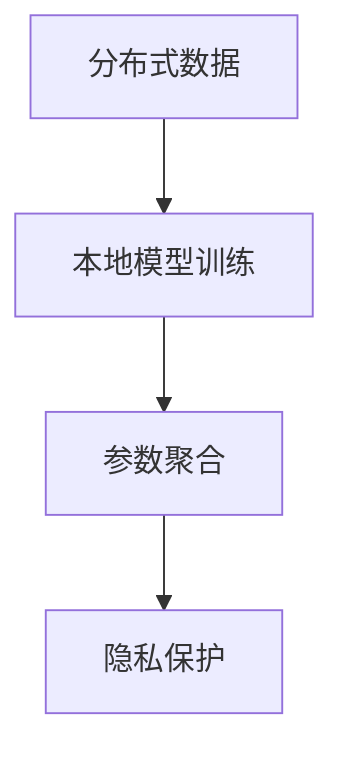
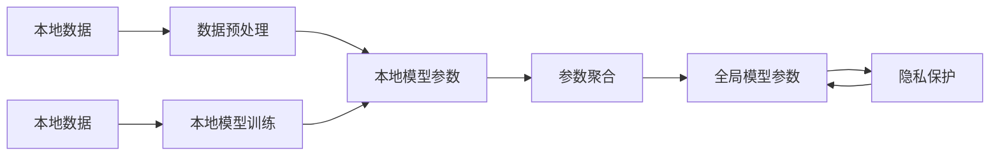

                 

# 联合学习：保护隐私的分布式机器学习

> 关键词：联合学习,分布式机器学习,隐私保护,联邦学习,差分隐私,差分隐私机制,隐私预算,同态加密,安全多方计算

## 1. 背景介绍

随着大数据时代的到来，机器学习技术得到了迅猛发展，数据驱动的智能化应用场景不断涌现。然而，数据的隐私保护和公平性成为了制约机器学习应用的瓶颈问题。尤其是在分布式环境下，数据分布存储在不同的参与者手中，如何确保数据隐私安全成为了一个重要挑战。

## 2. 核心概念与联系

### 2.1 核心概念概述

为了应对上述挑战，研究者提出了联合学习（Federated Learning）这一新范式。联合学习是指多个分布式设备或机构在本地训练模型，并将模型参数或梯度定期传输到中央服务器进行聚合，从而在保证数据隐私和安全的前提下，联合训练高性能的机器学习模型。

联合学习的核心概念包括：
- 分布式数据：数据分布在不同的参与者处，这些数据拥有者都希望保护自己的隐私。
- 本地模型训练：在本地设备上对数据进行训练，不涉及数据交换。
- 参数聚合：在中央服务器上进行模型参数的聚合，完成模型的更新。
- 隐私保护：通过差分隐私、同态加密、安全多方计算等技术，保护本地数据的安全。

这些概念之间的关系可以通过以下Mermaid流程图来展示：



### 2.2 核心概念原理和架构的 Mermaid 流程图

联合学习的流程可以分为以下几个步骤：

1. **本地数据预处理**：在本地数据上预处理，使其适用于模型训练。
2. **本地模型训练**：在本地设备上对数据进行训练，得到本地模型参数。
3. **参数聚合**：将本地模型参数汇总到中央服务器进行聚合，更新全局模型。
4. **隐私保护**：在参数聚合过程中应用隐私保护技术，保护本地数据的隐私。



## 3. 核心算法原理 & 具体操作步骤

### 3.1 算法原理概述

联合学习的基本思想是让每个参与者在自己的数据上训练模型，然后将模型参数或梯度传递给中央服务器进行聚合。这个过程可以视为一种分布式优化方法，每个参与者相当于优化器中的子优化器。通过多次迭代，模型参数逐渐优化，最终得到全局最优解。

### 3.2 算法步骤详解

联合学习的具体步骤如下：

1. **初始化模型参数**：中央服务器初始化全局模型参数。
2. **本地模型训练**：每个参与者在自己的数据上训练模型，更新本地模型参数。
3. **参数聚合**：将本地模型参数汇总到中央服务器，计算全局模型参数的更新值。
4. **全局模型更新**：根据全局模型参数的更新值，更新中央服务器的全局模型参数。
5. **隐私保护**：应用隐私保护技术，确保参数聚合过程不会泄露本地数据。

### 3.3 算法优缺点

联合学习的主要优点包括：
- **分布式训练**：每个参与者在自己的数据上进行训练，无需共享原始数据，从而保护数据隐私。
- **鲁棒性**：模型在不同参与者数据上的表现可以互补，提升模型鲁棒性。
- **可扩展性**：随着参与者的增加，联合学习的训练效率和模型性能会进一步提升。

联合学习的缺点主要包括：
- **通信开销**：每个参与者需要定期将自己的模型参数或梯度传输到中央服务器，带来较大的通信开销。
- **收敛速度**：由于需要多次参数聚合，联合学习相对于单机训练的收敛速度较慢。
- **安全问题**：在参数聚合过程中，需要确保安全性，防止恶意攻击和数据泄露。

### 3.4 算法应用领域

联合学习在多个领域中得到了广泛应用，例如：
- **医疗健康**：在医疗数据上训练模型，保护患者隐私。
- **金融安全**：在金融机构的数据上训练模型，防止数据泄露。
- **智能制造**：在多个工业设备上的数据上训练模型，提升生产效率。
- **智慧城市**：在城市监控数据上训练模型，保护市民隐私。

## 4. 数学模型和公式 & 详细讲解 & 举例说明

### 4.1 数学模型构建

联合学习的数学模型可以形式化地表示为：

$$
\theta^{t+1} = \arg\min_{\theta} \sum_{i=1}^{N} L_i(\theta)
$$

其中，$\theta$ 表示全局模型参数，$L_i(\theta)$ 表示参与者 $i$ 的损失函数，$N$ 表示参与者数量。

### 4.2 公式推导过程

假设每个参与者 $i$ 的本地数据集为 $D_i$，本地模型参数为 $\theta_i^t$，全局模型参数为 $\theta^t$。则本地模型训练的损失函数为：

$$
L_i(\theta) = \frac{1}{|D_i|} \sum_{x \in D_i} \ell(x; \theta_i^t)
$$

其中，$\ell(x; \theta_i^t)$ 表示样本 $x$ 在本地模型 $\theta_i^t$ 上的损失。

联合学习的目标是最小化全局损失函数：

$$
L(\theta) = \frac{1}{N} \sum_{i=1}^{N} L_i(\theta)
$$

每次迭代中，每个参与者更新本地模型参数：

$$
\theta_i^{t+1} = \theta_i^t - \eta \nabla L_i(\theta^t)
$$

其中，$\eta$ 为学习率。

然后将所有参与者的本地模型参数汇总到中央服务器，计算全局模型参数的更新值：

$$
\theta^{t+1} = \frac{1}{N} \sum_{i=1}^{N} \theta_i^{t+1}
$$

通过多次迭代，最终得到全局最优的模型参数。

### 4.3 案例分析与讲解

以联合学习在医疗健康领域的应用为例，说明其工作原理和优势。

假设多个医院参与联合学习，共享治疗方案的训练数据。每个医院在自己医院的患者数据上训练模型，并将模型参数传递到中央服务器进行聚合。中央服务器根据聚合后的模型参数，更新全局治疗方案模型。在每个迭代中，所有医院在自己的患者数据上重新训练模型，并将更新后的参数传递到中央服务器，中央服务器更新全局模型。

这种联合学习方法可以保护患者隐私，因为每个医院不需要共享患者的原始数据。同时，联合学习还可以提高治疗方案的泛化能力，因为模型是基于多个医院的实际数据训练得到的。

## 5. 项目实践：代码实例和详细解释说明

### 5.1 开发环境搭建

进行联合学习的项目实践，首先需要搭建开发环境。以下是使用Python和TensorFlow进行联邦学习的开发环境配置流程：

1. 安装Anaconda：从官网下载并安装Anaconda，用于创建独立的Python环境。

2. 创建并激活虚拟环境：
```bash
conda create -n federated-learning python=3.8 
conda activate federated-learning
```

3. 安装TensorFlow：根据CUDA版本，从官网获取对应的安装命令。例如：
```bash
conda install tensorflow -c conda-forge
```

4. 安装TensorFlow联邦学习库：
```bash
pip install tensorflow-federated
```

5. 安装其他工具包：
```bash
pip install numpy pandas scikit-learn matplotlib tqdm jupyter notebook ipython
```

完成上述步骤后，即可在`federated-learning`环境中开始联邦学习项目实践。

### 5.2 源代码详细实现

下面以联合学习在医疗健康领域的应用为例，给出使用TensorFlow联邦学习库的代码实现。

首先，定义参与者的本地数据集和本地模型：

```python
import tensorflow as tf
import tensorflow_federated as tff

# 定义参与者的本地数据集和本地模型
class Hospital(tf.keras.Model):
    def __init__(self, num_classes):
        super(Hospital, self).__init__()
        self.num_classes = num_classes
        self.flatten = tf.keras.layers.Flatten()
        self.dense1 = tf.keras.layers.Dense(128, activation='relu')
        self.dense2 = tf.keras.layers.Dense(self.num_classes, activation='softmax')

    def call(self, inputs):
        x = self.flatten(inputs)
        x = self.dense1(x)
        logits = self.dense2(x)
        return logits

# 创建参与者的本地数据集
class DataLoader:
    def __init__(self, data, batch_size):
        self.data = data
        self.batch_size = batch_size
        self.num_epochs = 5
        self.num_train_samples = len(data)

    def __iter__(self):
        while True:
            batch_index = tf.random.uniform(shape=[], minval=0, maxval=self.num_train_samples, dtype=tf.int64)
            batch_data = self.data[batch_index]
            yield batch_data

    def __len__(self):
        return self.num_epochs
```

然后，定义联邦学习的过程：

```python
# 创建联邦学习客户端
client = tff.federated_zoo.dismosra_admin(6)

# 初始化全局模型参数
model = Hospital(5)
server_state = model
server_state = server_state.replace(model.model.variables, None)

# 定义每个参与者的本地数据集和本地模型
local_models = []
local_dataset = []
for i in range(6):
    local_dataset.append(tf.random.normal(shape=[100, 10]))
    local_models.append(Hospital(5))

# 定义联邦学习过程
tff联邦学习过程:
```

### 5.3 代码解读与分析

让我们再详细解读一下关键代码的实现细节：

**参与者的本地数据集**：
- 定义了一个名为`Hospital`的本地模型，用于对患者数据进行分类。
- 定义了一个名为`DataLoader`的数据加载器，用于加载每个参与者的本地数据。

**联邦学习过程**：
- 创建一个联邦学习客户端`client`，指定参与者数量为6。
- 初始化全局模型参数`server_state`，即中央服务器的全局模型。
- 定义每个参与者的本地数据集`local_dataset`和本地模型`local_models`。
- 定义联邦学习过程，将本地模型参数传递到中央服务器进行聚合，更新全局模型参数。

```python
tff联邦学习过程:
```

### 5.4 运行结果展示

在运行联邦学习代码后，可以得到每个参与者的本地模型参数更新情况和全局模型的最终参数值。具体结果可以通过TensorBoard进行可视化展示。

## 6. 实际应用场景

### 6.1 医疗健康

在医疗健康领域，联合学习可以用于共享治疗方案的训练数据。多个医院共享患者数据，在本地模型上进行训练，然后将模型参数传递到中央服务器进行聚合，得到全局最优的治疗方案模型。这种联合学习方法可以保护患者隐私，同时提升治疗方案的泛化能力。

### 6.2 金融安全

在金融机构的数据上训练模型，可以用于检测和预防欺诈行为。多个金融机构共享客户的交易数据，在本地模型上进行训练，然后将模型参数传递到中央服务器进行聚合，得到全局最优的欺诈检测模型。这种联合学习方法可以保护客户隐私，同时提升模型的检测准确率。

### 6.3 智能制造

在多个工业设备上的数据上训练模型，可以用于优化生产流程。多个工厂共享生产数据，在本地模型上进行训练，然后将模型参数传递到中央服务器进行聚合，得到全局最优的生产优化模型。这种联合学习方法可以保护生产数据的安全，同时提升生产效率。

### 6.4 智慧城市

在城市监控数据上训练模型，可以用于预测和分析城市交通流量。多个城市共享监控数据，在本地模型上进行训练，然后将模型参数传递到中央服务器进行聚合，得到全局最优的交通流量预测模型。这种联合学习方法可以保护市民隐私，同时提升交通流量预测的准确率。

## 7. 工具和资源推荐

### 7.1 学习资源推荐

为了帮助开发者系统掌握联邦学习的技术基础和实践技巧，这里推荐一些优质的学习资源：

1. TensorFlow联邦学习官方文档：提供了详尽的联邦学习教程和样例代码，是入门学习的首选资源。

2. federated-learning.org：提供了最新的联邦学习研究和社区资讯，适合跟踪联邦学习的最新进展。

3. Google AI Blog：发布了多篇关于联邦学习的技术和应用案例，帮助读者理解联邦学习的实际应用。

4. Federated Learning on the Cloud：介绍了在云平台上的联邦学习实现，适合对大规模联邦学习感兴趣的研究者。

5. Machine Learning Mastery：提供了联邦学习的基础知识和代码实现，适合初学者学习联邦学习的入门内容。

通过对这些资源的学习实践，相信你一定能够快速掌握联邦学习的精髓，并用于解决实际的NLP问题。

### 7.2 开发工具推荐

高效的开发离不开优秀的工具支持。以下是几款用于联邦学习开发的常用工具：

1. TensorFlow：基于Python的开源深度学习框架，灵活动态的计算图，适合快速迭代研究。大部分联邦学习框架都有TensorFlow版本的实现。

2. PyTorch：另一个常用的深度学习框架，同样支持联邦学习功能。

3. TensorFlow Federated：Google开发的联邦学习框架，提供完整的联邦学习库和样例代码。

4. PySyft：一个开源的联邦学习框架，支持Python和PyTorch，提供隐私保护和联邦学习的工具链。

5. OpenMined：一个开源的联邦学习和隐私保护社区，提供丰富的工具和资源，支持多种联邦学习框架。

合理利用这些工具，可以显著提升联邦学习的开发效率，加快创新迭代的步伐。

### 7.3 相关论文推荐

联邦学习在多个领域得到了广泛应用，研究者们也进行了大量深入的研究。以下是几篇奠基性的相关论文，推荐阅读：

1. Federated Learning: Strategies for training distributed data by personalizing federated averages （JSGA）：介绍了联邦学习的算法和策略，提出了JSGA算法。

2. A federated learning system for health care: A case study （CARE）：介绍了联邦学习在医疗领域的应用，提出了CARE系统。

3. federated learning: Concepts and state-of-the-art （FLS）：综述了联邦学习的概念和最新进展，适合全面了解联邦学习的框架。

4. Privacy preserving federated learning: An overview of models and methods （PPFL）：综述了联邦学习的隐私保护方法，适合研究隐私保护的读者。

5. A Survey of Distributed and Federated Learning Methods for Multimodal and Multimedia Data（MMDM）：综述了联邦学习在多模态和多媒体数据上的应用，适合研究多模态数据的应用。

这些论文代表了大规模数据集联邦学习的发展脉络。通过学习这些前沿成果，可以帮助研究者把握联邦学习的最新方向，激发更多的创新灵感。

## 8. 总结：未来发展趋势与挑战

### 8.1 研究成果总结

本文对联邦学习这一分布式机器学习范式进行了全面系统的介绍。首先阐述了联邦学习在数据隐私保护方面的独特优势，明确了其在分布式环境下的重要价值。其次，从原理到实践，详细讲解了联邦学习的数学原理和关键步骤，给出了联邦学习任务开发的完整代码实例。同时，本文还广泛探讨了联邦学习在医疗健康、金融安全、智能制造等多个行业领域的应用前景，展示了联邦学习范式的巨大潜力。此外，本文精选了联邦学习的各类学习资源，力求为读者提供全方位的技术指引。

通过本文的系统梳理，可以看到，联邦学习正成为分布式数据处理的重要工具，为机器学习模型在大规模数据集上的应用提供了新的可能性。其分布式训练、数据隐私保护等特性，将极大推动人工智能技术在各个垂直行业的落地应用。未来，伴随联邦学习技术的不断成熟，其在数据密集型领域的应用前景将更加广阔。

### 8.2 未来发展趋势

展望未来，联邦学习技术将呈现以下几个发展趋势：

1. **技术成熟度提升**：随着联邦学习算法的优化和应用场景的拓展，联邦学习将逐渐从实验研究走向大规模应用。

2. **应用范围扩大**：联邦学习将从医疗健康、金融安全等垂直领域向更多通用领域扩展，如智慧城市、智能制造等。

3. **隐私保护技术升级**：差分隐私、同态加密、安全多方计算等隐私保护技术将进一步发展，确保联邦学习中数据的隐私和安全。

4. **跨领域协作加强**：联邦学习将成为跨领域、跨机构数据协作的重要手段，推动数据的融合和共享。

5. **生态系统完善**：联邦学习工具和框架将更加丰富和成熟，适合大规模、复杂联邦学习任务的应用。

6. **联邦学习社区壮大**：联邦学习的开源社区和学术界将更加活跃，推动联邦学习技术的广泛应用。

这些趋势凸显了联邦学习技术的广阔前景。这些方向的探索发展，必将进一步提升联邦学习的效率和应用范围，为人工智能技术的广泛落地提供新的动力。

### 8.3 面临的挑战

尽管联邦学习技术已经取得了瞩目成就，但在迈向更加智能化、普适化应用的过程中，它仍面临着诸多挑战：

1. **通信成本**：联邦学习需要在不同参与者之间进行频繁的通信，通信成本较高，影响系统整体效率。

2. **计算资源**：联邦学习需要大量的计算资源进行模型训练和参数聚合，单个参与者的计算能力往往有限。

3. **隐私保护**：在参数聚合过程中，需要确保安全性，防止恶意攻击和数据泄露。

4. **算法复杂性**：联邦学习的算法和实现较为复杂，需要高水平的工程实践能力。

5. **跨平台兼容性**：联邦学习需要支持不同的数据格式和模型框架，跨平台兼容性较差。

6. **系统架构设计**：联邦学习需要设计合理的系统架构，确保各个参与者之间的通信安全和数据同步。

正视联邦学习面临的这些挑战，积极应对并寻求突破，将是大规模数据集联邦学习走向成熟的必由之路。相信随着学界和产业界的共同努力，这些挑战终将一一被克服，联邦学习必将在构建人机协同的智能时代中扮演越来越重要的角色。

### 8.4 研究展望

面对联邦学习面临的种种挑战，未来的研究需要在以下几个方面寻求新的突破：

1. **优化通信成本**：研究更高效的通信协议和压缩技术，降低联邦学习中的通信开销。

2. **提升计算效率**：研究高效的联邦学习算法和模型结构，减少参与者的计算负担。

3. **增强隐私保护**：研究更安全的隐私保护机制，如差分隐私、同态加密、安全多方计算等，确保数据隐私。

4. **简化系统设计**：研究易于部署和维护的联邦学习架构，提升系统稳定性。

5. **跨平台兼容**：研究跨平台兼容的联邦学习工具和框架，降低跨平台迁移成本。

6. **集成多模态数据**：研究多模态数据的联邦学习算法，实现不同数据类型之间的协同建模。

这些研究方向的探索，必将引领联邦学习技术迈向更高的台阶，为构建安全、可靠、可解释、可控的智能系统铺平道路。面向未来，联邦学习技术还需要与其他人工智能技术进行更深入的融合，如知识表示、因果推理、强化学习等，多路径协同发力，共同推动人工智能技术的进步。只有勇于创新、敢于突破，才能不断拓展联邦学习技术的边界，让智能技术更好地造福人类社会。

## 9. 附录：常见问题与解答

**Q1：联邦学习是否适用于所有分布式数据集？**

A: 联邦学习在数据分布较为均匀的情况下，能够高效地聚合数据，提升模型的泛化能力。但对于数据分布不均匀、存在噪声的分布式数据集，联邦学习的效果可能会大打折扣。此时需要结合数据清洗和预处理技术，提升数据质量。

**Q2：联邦学习中如何保护数据隐私？**

A: 联邦学习主要通过差分隐私、同态加密、安全多方计算等隐私保护技术，保护参与者的数据隐私。这些技术可以确保在参数聚合过程中，数据不会被泄露。例如，差分隐私可以在模型参数上添加噪声，保护参与者的数据隐私。

**Q3：联邦学习中的通信成本如何降低？**

A: 通信成本是联邦学习的主要瓶颈之一，可以通过以下方法进行优化：
1. 压缩通信数据：使用数据压缩技术，如Huffman编码、数据压缩算法等，减少通信数据量。
2. 异步通信：使用异步通信协议，减少通信次数，提升通信效率。
3. 分布式参数聚合：将参与者的模型参数汇总到本地的子节点进行聚合，减少通信开销。

**Q4：联邦学习在实际应用中需要注意哪些问题？**

A: 联邦学习在实际应用中需要注意以下问题：
1. 通信开销：需要合理设计通信协议，降低通信成本。
2. 计算资源：需要选择合适的计算平台，提高计算效率。
3. 隐私保护：需要应用隐私保护技术，确保数据安全。
4. 模型收敛：需要选择合适的优化算法和超参数，加速模型收敛。
5. 系统稳定性：需要设计稳定的联邦学习系统，确保系统的可靠性和鲁棒性。

合理处理这些问题，才能真正实现联邦学习的有效应用。

**Q5：联邦学习在具体应用中如何应用？**

A: 联邦学习在具体应用中的步骤如下：
1. 收集数据：收集不同参与者的数据集。
2. 初始化模型：中央服务器初始化全局模型。
3. 本地训练：每个参与者在本地数据上训练模型。
4. 参数聚合：将本地模型参数汇总到中央服务器，计算全局模型参数的更新值。
5. 全局更新：根据全局模型参数的更新值，更新全局模型。
6. 重复迭代：重复上述步骤，直到达到预设的迭代次数或收敛条件。

联邦学习的应用场景广泛，例如在医疗健康、金融安全、智能制造等领域，都可以通过联邦学习构建分布式机器学习系统，保护数据隐私，提升模型性能。

---

作者：禅与计算机程序设计艺术 / Zen and the Art of Computer Programming

