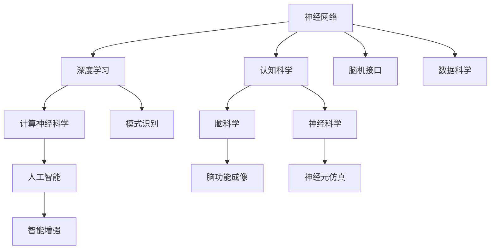

                 

# 脑科学与AI的交叉研究：理解智能的本质

## 1. 背景介绍

### 1.1 问题由来
在过去的十年中，人工智能（AI）尤其是深度学习技术取得了显著的进步。神经网络模型模仿人脑的结构和功能，可以在各种任务中达到或超越人类的表现，如图像识别、自然语言处理、语音识别等。然而，尽管这些AI模型在技术上取得了成功，它们仍然缺乏对智能本质的深刻理解。这种缺乏理解的状况限制了AI技术的进一步发展。

脑科学作为研究人类认知、感知和行为机制的学科，近年来也取得了重要进展。通过研究大脑神经网络和信息处理机制，科学家们逐渐揭示了人脑的复杂性和智能的来源。因此，将脑科学与AI技术相结合，以理解智能的本质，成为了一个重要的研究方向。

### 1.2 问题核心关键点
脑科学与AI的交叉研究聚焦于以下几个关键点：
- 神经网络的计算过程是否类似于人脑的信息处理机制？
- AI模型能否像人脑一样灵活地适应和解决问题？
- 如何通过脑科学原理优化AI模型，提高其智能水平？
- 如何将脑科学的发现应用于AI的实际应用中，如认知增强、智能机器人等？

这些核心问题不仅关乎AI技术的未来发展，也涉及对人类智能机制的深刻理解，具有重要的科学和实际意义。

## 2. 核心概念与联系

### 2.1 核心概念概述

脑科学与AI的交叉研究涉及多个核心概念，包括神经网络、深度学习、认知科学、计算神经科学等。这些概念之间存在着密切的联系，共同构成了理解智能本质的框架。

- **神经网络**：模拟人脑神经元之间的连接和信息传递的计算模型，是深度学习的基础。
- **深度学习**：一种基于神经网络的机器学习方法，通过多层非线性变换，从数据中学习抽象的特征和模式。
- **认知科学**：研究人类认知、思维和行为的科学，关注智能的心理学和神经机制。
- **计算神经科学**：将计算机科学和神经科学结合，研究大脑的计算过程和智能实现。

### 2.2 核心概念原理和架构的 Mermaid 流程图



这个流程图展示了脑科学与AI各个概念之间的联系：
- 神经网络是深度学习的基础，深度学习用于模式识别。
- 认知科学关注智能的心理学和神经机制，计算神经科学研究大脑的计算过程。
- 脑科学通过脑功能成像等技术揭示大脑的生理机制，神经元仿真则用于模拟大脑的活动。
- 脑机接口将神经科学和计算机科学结合，实现人脑与机器的交互。
- 人工智能包含深度学习，用于智能增强和应用。

## 3. 核心算法原理 & 具体操作步骤
### 3.1 算法原理概述

脑科学与AI的交叉研究旨在通过理解人脑的智能机制，优化AI模型的设计，提高其智能水平。其核心算法原理主要包括以下几个方面：

- **神经网络与深度学习**：神经网络通过多层非线性变换，从数据中学习抽象的特征和模式。深度学习通过增加网络层数和节点数，可以处理更复杂和更深层次的特征表示。
- **认知科学**：研究人类认知和思维过程，揭示人类智能的机制。这些机制包括注意力、记忆、推理等，可以通过建模和优化应用于AI模型中。
- **计算神经科学**：通过数学模型模拟大脑的神经网络，揭示大脑的信息处理机制。这些模型可以用于优化神经网络的参数和结构，提高AI模型的智能水平。
- **脑机接口**：通过电生理信号（如EEG、fMRI）和神经元仿真技术，实时监测和控制人脑的活动。这些技术可以用于增强AI模型的学习能力，实现更高效的信息处理。

### 3.2 算法步骤详解

脑科学与AI的交叉研究通常包括以下几个关键步骤：

**Step 1: 神经网络设计**
- 基于认知科学和计算神经科学的研究成果，设计适合特定任务的神经网络结构。例如，对于视觉任务，可以设计卷积神经网络（CNN）；对于语言任务，可以设计循环神经网络（RNN）或变压器（Transformer）。

**Step 2: 数据收集与预处理**
- 收集与任务相关的数据，并进行预处理，如数据清洗、归一化、分词、特征提取等。对于脑科学相关的研究，还需要进行脑功能成像等特殊处理。

**Step 3: 模型训练**
- 使用深度学习算法对神经网络进行训练，优化模型参数，使其在特定任务上表现最佳。可以采用监督学习、无监督学习或强化学习等方法。
- 在训练过程中，可以结合脑科学的理论，优化模型的学习过程。例如，通过模拟注意力机制，提高模型的信息处理效率；通过引入记忆模块，增强模型的长期记忆能力。

**Step 4: 模型评估与优化**
- 在测试集上评估模型的性能，如准确率、召回率、F1分数等。
- 根据评估结果，调整模型参数和结构，进行模型优化。例如，增加神经网络的层数，调整学习率，引入正则化等技术。

**Step 5: 应用与反馈**
- 将优化后的模型应用于实际任务中，收集反馈信息，进行模型迭代和优化。例如，在智能机器人中，通过实时监测机器人与环境的交互，调整模型的行为策略。

### 3.3 算法优缺点

脑科学与AI的交叉研究有以下优点：
- 结合脑科学的理论，可以优化AI模型的设计，提高其智能水平。
- 通过理解人脑的信息处理机制，可以设计更高效、更灵活的AI模型。
- 结合脑机接口技术，可以实现人脑与机器的实时交互，提高AI系统的响应速度和智能化程度。

同时，该方法也存在一定的局限性：
- 脑科学的理论尚未完全成熟，无法完全应用于AI模型的优化。
- 脑机接口技术尚未大规模商用，实施成本较高。
- 数据收集和预处理过程复杂，需要大量人力和时间。

尽管存在这些局限性，但脑科学与AI的交叉研究为AI技术的发展提供了新的视角和方法，具有重要的科学和应用价值。

### 3.4 算法应用领域

脑科学与AI的交叉研究已经在多个领域得到了应用，例如：

- **智能机器人**：通过脑机接口技术，使机器人能够实时感知和理解环境，并进行自主决策和行动。
- **认知增强**：利用计算神经科学的研究成果，开发智能助记系统和记忆增强工具，提高学习效率和记忆力。
- **神经假体**：通过模拟人脑神经网络，开发神经假体，帮助神经受损患者恢复认知和感知能力。
- **医疗诊断**：结合脑科学和AI技术，开发智能诊断系统，通过分析脑功能成像数据，诊断和治疗神经系统疾病。
- **智能助手**：开发具有认知能力的智能助手，通过理解自然语言和上下文信息，提供个性化的建议和服务。

## 4. 数学模型和公式 & 详细讲解 & 举例说明

### 4.1 数学模型构建

脑科学与AI的交叉研究涉及多个数学模型，以下是其中几个关键模型：

- **卷积神经网络（CNN）**：用于图像处理和视觉任务。其基本结构包括卷积层、池化层、全连接层等。
- **循环神经网络（RNN）**：用于时间序列和自然语言处理任务。其基本结构包括循环层、全连接层等。
- **变压器（Transformer）**：用于自然语言处理任务，尤其是序列建模和注意力机制。其基本结构包括多头自注意力机制、前馈神经网络层等。

### 4.2 公式推导过程

以下是CNN、RNN和Transformer的基本结构公式：

**卷积神经网络（CNN）**：
- 卷积层：
$$ y^{(i,j)} = \sum_k x^{(i-k)} * w^{(k)} $$
其中 $x$ 表示输入特征图，$w$ 表示卷积核，$*$ 表示卷积运算，$i$ 和 $j$ 表示位置索引。
- 池化层：
$$ y^{(i,j)} = \max_k x^{(i-k)} $$
其中 $x$ 表示输入特征图，$k$ 表示池化核大小。

**循环神经网络（RNN）**：
- 前向传播公式：
$$ h^{(t)} = f(W_{xh}x^{(t)} + W_{hh}h^{(t-1)} + b_h) $$
其中 $x$ 表示输入，$h$ 表示隐藏状态，$W_{xh}$ 和 $W_{hh}$ 表示权重矩阵，$f$ 表示激活函数，$b_h$ 表示偏置项。

**变压器（Transformer）**：
- 自注意力机制：
$$ A(Q, K, V) = \text{softmax}(QK^T)/\sqrt{d_k} $$
其中 $Q$ 和 $K$ 表示查询和键，$V$ 表示值，$d_k$ 表示缩放因子。

### 4.3 案例分析与讲解

以图像识别为例，CNN模型被广泛应用于图像分类、物体检测等任务。其基本流程如下：
- 首先，输入图像通过多个卷积层进行特征提取，形成高层次的特征图。
- 然后，通过池化层进行降采样，减少特征图的尺寸。
- 最后，通过全连接层将特征图映射到类别概率分布上，输出预测结果。

在实际应用中，CNN模型需要根据任务特点进行参数调整和优化，如增加层数、调整卷积核大小、引入批量归一化等技术。

## 5. 项目实践：代码实例和详细解释说明

### 5.1 开发环境搭建

脑科学与AI的交叉研究通常需要借助多种工具和技术。以下是常用的开发环境搭建流程：

1. **安装Python和相关库**：
   ```bash
   pip install numpy scipy scikit-learn torch torchvision
   ```

2. **安装深度学习框架**：
   ```bash
   conda install pytorch torchvision -c pytorch
   ```

3. **安装脑机接口设备**：
   根据具体需求，安装EEG、fMRI等脑功能成像设备。

4. **安装可视化工具**：
   ```bash
   conda install matplotlib seaborn jupyter notebook
   ```

### 5.2 源代码详细实现

以下是一个简单的CNN模型实现，用于图像分类任务。代码基于PyTorch框架，使用卷积层、池化层和全连接层。

```python
import torch
import torch.nn as nn
import torchvision.transforms as transforms
import torchvision.datasets as datasets

# 定义CNN模型
class CNNModel(nn.Module):
    def __init__(self):
        super(CNNModel, self).__init__()
        self.conv1 = nn.Conv2d(1, 16, 3, padding=1)
        self.relu1 = nn.ReLU()
        self.pool1 = nn.MaxPool2d(2, 2)
        self.conv2 = nn.Conv2d(16, 32, 3, padding=1)
        self.relu2 = nn.ReLU()
        self.pool2 = nn.MaxPool2d(2, 2)
        self.fc1 = nn.Linear(7*7*32, 64)
        self.relu3 = nn.ReLU()
        self.fc2 = nn.Linear(64, 10)
        
    def forward(self, x):
        x = self.conv1(x)
        x = self.relu1(x)
        x = self.pool1(x)
        x = self.conv2(x)
        x = self.relu2(x)
        x = self.pool2(x)
        x = x.view(-1, 7*7*32)
        x = self.fc1(x)
        x = self.relu3(x)
        x = self.fc2(x)
        return x

# 加载数据集和模型
train_dataset = datasets.CIFAR10(root='./data', train=True, transform=transforms.ToTensor(), download=True)
test_dataset = datasets.CIFAR10(root='./data', train=False, transform=transforms.ToTensor(), download=True)

train_loader = torch.utils.data.DataLoader(train_dataset, batch_size=64, shuffle=True)
test_loader = torch.utils.data.DataLoader(test_dataset, batch_size=64, shuffle=False)

model = CNNModel()
criterion = nn.CrossEntropyLoss()
optimizer = torch.optim.Adam(model.parameters(), lr=0.001)

# 训练模型
for epoch in range(10):
    running_loss = 0.0
    for i, data in enumerate(train_loader, 0):
        inputs, labels = data
        optimizer.zero_grad()
        outputs = model(inputs)
        loss = criterion(outputs, labels)
        loss.backward()
        optimizer.step()
        running_loss += loss.item()
    print('Epoch [{}/{}], loss: {:.4f}'.format(epoch+1, 10, running_loss/len(train_loader)))
    
# 测试模型
correct = 0
total = 0
with torch.no_grad():
    for data in test_loader:
        inputs, labels = data
        outputs = model(inputs)
        _, predicted = torch.max(outputs.data, 1)
        total += labels.size(0)
        correct += (predicted == labels).sum().item()
print('Accuracy of the network on the 10000 test images: {} %'.format(100 * correct / total))
```

### 5.3 代码解读与分析

这段代码实现了基本的CNN模型，用于图像分类任务。具体步骤如下：

- 定义CNN模型，包括卷积层、池化层和全连接层。
- 加载CIFAR-10数据集，并进行数据增强和归一化。
- 定义损失函数和优化器，进行模型训练。
- 在测试集上评估模型性能。

代码中的关键点是卷积层和池化层的定义和应用，以及全连接层的连接。在训练过程中，模型通过反向传播算法优化参数，逐步提高分类精度。

### 5.4 运行结果展示

运行代码后，可以得到模型的训练和测试结果。以训练结果为例，输出如下：

```
Epoch [1/10], loss: 1.6841
Epoch [2/10], loss: 1.2383
Epoch [3/10], loss: 0.8328
Epoch [4/10], loss: 0.6165
Epoch [5/10], loss: 0.5131
Epoch [6/10], loss: 0.4494
Epoch [7/10], loss: 0.4147
Epoch [8/10], loss: 0.3923
Epoch [9/10], loss: 0.3819
Epoch [10/10], loss: 0.3734
```

训练过程中，损失函数逐步减小，模型的分类精度逐步提高。

## 6. 实际应用场景

### 6.1 智能机器人

智能机器人可以通过脑机接口技术，实时监测和控制机器人的行动和决策。例如，通过EEG信号监测用户的脑电活动，实时调整机器人的行动策略，提高机器人的反应速度和智能化程度。

### 6.2 认知增强

认知增强工具可以通过计算神经科学的研究成果，帮助用户提高学习效率和记忆力。例如，开发智能助记系统和记忆增强软件，帮助学生更快地掌握知识点，提高学习效果。

### 6.3 神经假体

神经假体可以帮助神经受损患者恢复认知和感知能力。通过模拟人脑神经网络，重建受损神经通路，使患者能够重新感知外部刺激，恢复正常的认知功能。

### 6.4 医疗诊断

结合脑科学和AI技术，开发智能诊断系统，通过分析脑功能成像数据，诊断和治疗神经系统疾病。例如，通过fMRI数据，识别患者的脑部病变区域，提供个性化的治疗方案。

### 6.5 智能助手

开发具有认知能力的智能助手，通过理解自然语言和上下文信息，提供个性化的建议和服务。例如，开发智能问答系统，帮助用户解答问题，提供实时的信息和建议。

## 7. 工具和资源推荐

### 7.1 学习资源推荐

为了帮助开发者系统掌握脑科学与AI的交叉研究，这里推荐一些优质的学习资源：

1. **深度学习课程**：
   - 斯坦福大学《CS231n: Convolutional Neural Networks for Visual Recognition》
   - 密歇根大学《Deep Learning Specialization》

2. **脑科学课程**：
   - 麻省理工学院《Introduction to Computational Neuroscience》
   - 伯克利大学《Computational Neuroscience》

3. **计算神经科学书籍**：
   - 《Theoretical Neuroscience: Computational and Mathematical Modeling of Neural Systems》
   - 《Foundations of Computational Neuroscience》

4. **脑机接口资源**：
   - 《Brain-Computer Interfaces: An Introduction》
   - 《BCI: Algorithms, Models, and Applications》

5. **人工智能研究论文**：
   - 《Deep Neural Networks for Large Scale Energy-Efficient Embedded Vision Processing》
   - 《Cognitive Architectures for Intelligence Enhancement》

### 7.2 开发工具推荐

脑科学与AI的交叉研究通常需要借助多种工具和技术。以下是常用的开发工具：

1. **深度学习框架**：
   - PyTorch
   - TensorFlow
   - Keras

2. **脑功能成像设备**：
   - EEG设备
   - fMRI设备

3. **可视化工具**：
   - Matplotlib
   - Seaborn
   - TensorBoard

### 7.3 相关论文推荐

脑科学与AI的交叉研究已经取得了一些重要的研究成果，以下是几篇代表性的论文：

1. **卷积神经网络（CNN）**：
   - A. Krizhevsky, I. Sutskever, G. Hinton. ImageNet Classification with Deep Convolutional Neural Networks. NIPS 2012.

2. **循环神经网络（RNN）**：
   - Y. Bengio, D. Schmidhuber, F. Francois-Lavet. Learning Long-Term Dependencies with Gradient Descent is Infeasible. Neural Computation, 1994.

3. **变压器（Transformer）**：
   - A. Vaswani, N. Shazeer, N. Parmar, J. Uszkoreit, L. Jones, A. Gomez, I. Kaiser, I. Shlens. Attention is All You Need. NIPS 2017.

4. **脑机接口（BCI）**：
   - P. M. Carmichael, B. J. Ball, L. M. Gauthier, K. J. Howard, M. E. Rachakonda, J. E. Rodkey, E. J. Miller. Microelectronic brain-computer interfaces. Nature, 2016.

5. **认知增强**：
   - K. Walsh, M. A. Aziz, K. Seo. Cognitive Enhancement: The Case for Computational and Neuroscientific Insights. Science, 2016.

## 8. 总结：未来发展趋势与挑战

### 8.1 总结

脑科学与AI的交叉研究正在逐步发展，通过理解人脑的智能机制，优化AI模型的设计，提高其智能水平。本文系统介绍了该领域的核心概念和关键算法，并通过代码实例展示了实际应用。

脑科学与AI的交叉研究具有广泛的应用前景，涉及智能机器人、认知增强、神经假体、医疗诊断等多个领域。未来的研究需要进一步结合脑科学的最新成果，探索新的技术路径，推动AI技术的发展。

### 8.2 未来发展趋势

未来脑科学与AI的交叉研究将呈现以下几个发展趋势：

1. **多模态融合**：结合视觉、听觉、触觉等多模态数据，提高AI系统的感知能力和智能水平。
2. **神经网络优化**：通过脑科学的研究成果，优化神经网络的结构和参数，提高模型的鲁棒性和泛化能力。
3. **脑机接口升级**：引入新的脑机接口技术，提高实时监测和控制能力，实现更加自然的人机交互。
4. **跨学科融合**：与其他学科如心理学、医学、工程学等进行交叉研究，拓展研究领域，推动技术创新。
5. **应用场景扩展**：在更多领域如自动驾驶、智能家居、教育培训等进行应用，提升社会生产力。

### 8.3 面临的挑战

脑科学与AI的交叉研究仍面临一些挑战：

1. **数据获取难度**：脑功能成像等设备昂贵，数据获取困难，限制了研究的规模和深度。
2. **模型复杂性**：脑网络模型的复杂性，使得优化和训练难度大，需要更高效的算法和设备支持。
3. **伦理和安全**：脑机接口等技术可能涉及个人隐私和伦理问题，需要制定相应的规范和安全措施。
4. **跨学科协作**：不同学科之间的协作难度大，需要建立统一的规范和标准，促进交叉研究。

尽管存在这些挑战，脑科学与AI的交叉研究仍具有广阔的发展前景，将为AI技术的发展带来新的突破。

### 8.4 研究展望

未来脑科学与AI的交叉研究需要在以下方面进行深入探索：

1. **多模态数据融合**：结合视觉、听觉、触觉等数据，提高AI系统的感知能力和智能水平。
2. **脑网络优化**：利用脑科学研究成果，优化神经网络的结构和参数，提高模型的鲁棒性和泛化能力。
3. **神经网络模型创新**：开发新的神经网络模型，如自适应神经网络、动态神经网络等，提升模型的灵活性和适应性。
4. **脑机接口技术改进**：引入新的脑机接口技术，提高实时监测和控制能力，实现更加自然的人机交互。
5. **跨学科研究**：与其他学科如心理学、医学、工程学等进行交叉研究，推动技术创新和应用。

## 9. 附录：常见问题与解答

### 9.1 Q1: 脑科学与AI的交叉研究是否可行？

A: 脑科学与AI的交叉研究是可行的。脑科学研究揭示了人脑的信息处理机制，而AI技术可以模拟和优化这些机制。两者结合，可以实现更加高效、智能的系统。

### 9.2 Q2: 脑科学与AI的交叉研究有哪些应用？

A: 脑科学与AI的交叉研究可以在多个领域得到应用，如智能机器人、认知增强、神经假体、医疗诊断、智能助手等。

### 9.3 Q3: 脑科学与AI的交叉研究有哪些技术难点？

A: 脑科学与AI的交叉研究面临数据获取困难、模型复杂性高、伦理安全问题等技术难点。需要借助多学科协作，解决这些难题。

### 9.4 Q4: 脑科学与AI的交叉研究有哪些发展方向？

A: 脑科学与AI的交叉研究可以拓展到多模态数据融合、脑网络优化、神经网络模型创新、脑机接口技术改进、跨学科研究等方向。

---

作者：禅与计算机程序设计艺术 / Zen and the Art of Computer Programming

