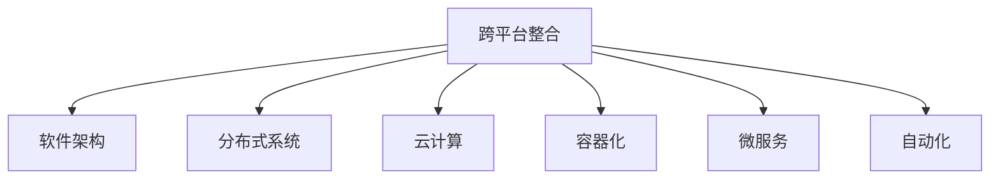

                 

# 自动化创业中的跨平台整合

> 关键词：跨平台整合, 自动化, 软件架构, 分布式系统, 云计算, 容器化, 微服务

## 1. 背景介绍

在当今数字化时代，自动化和跨平台集成已成为创业成功的关键因素。随着技术的进步，企业纷纷转向云服务和微服务架构，这要求我们不仅要有出色的产品开发能力，还要具备高效跨平台整合的能力。因此，本文将深入探讨自动化创业中跨平台整合的关键技术和策略。

## 2. 核心概念与联系

### 2.1 核心概念概述

在自动化创业中，跨平台整合是一个多维度的过程，涉及到软件架构、分布式系统、云计算、容器化、微服务等多个领域。下面是几个核心概念的简要介绍：

- **跨平台整合**：指将不同平台和环境下的系统进行统一管理、优化和集成，以实现资源共享、数据同步和系统协作。
- **自动化**：通过脚本、工具和平台自动化繁琐、重复的任务，提高工作效率。
- **软件架构**：设计高效、可扩展的软件系统框架，支持模块化开发和持续集成。
- **分布式系统**：由多个节点协同工作，实现数据处理、存储和服务的高度可用性和扩展性。
- **云计算**：通过虚拟化技术提供可扩展、弹性的计算资源和云服务，降低成本，提高效率。
- **容器化**：将应用程序及其依赖打包成容器，在标准化的容器中运行，确保一致性和可移植性。
- **微服务**：将应用拆分为多个独立、可维护的小服务，支持模块化开发和快速部署。

### 2.2 核心概念原理和架构的 Mermaid 流程图



这个流程图展示了跨平台整合在自动化创业中与其他核心概念的联系，各概念之间相互支持，共同构建了自动化创业的技术架构。

## 3. 核心算法原理 & 具体操作步骤

### 3.1 算法原理概述

跨平台整合的算法原理主要基于分布式系统和微服务架构，结合云计算和容器化技术，实现应用的分布式部署和管理。其核心目标是通过自动化技术，优化资源利用率，提升系统的可靠性和扩展性。

### 3.2 算法步骤详解

#### 3.2.1 数据架构设计

跨平台整合首先需要设计一个高效的数据架构，保证数据的分布式存储和管理。一般来说，数据架构包含以下步骤：

1. **需求分析**：明确数据架构的目标和需求，包括数据存储、传输、查询等方面的要求。
2. **数据模型设计**：定义数据的表结构和关系，保证数据的规范性和一致性。
3. **数据分布设计**：根据数据量、访问频率等因素，设计数据的分片策略和复制机制。
4. **数据访问优化**：使用缓存、索引等技术，提升数据访问速度和并发性能。

#### 3.2.2 分布式系统搭建

搭建分布式系统是实现跨平台整合的核心步骤，一般包括以下步骤：

1. **节点选择**：根据业务需求和负载，选择合适的服务器或虚拟机节点。
2. **服务部署**：将应用服务部署到分布式系统中，支持水平扩展和负载均衡。
3. **网络优化**：设计高效的网络架构，支持数据传输和通信。
4. **监控和调优**：实时监控系统性能，根据负载情况进行调优。

#### 3.2.3 云平台集成

将分布式系统集成到云平台，可以提高系统的可用性和扩展性。云平台集成的一般步骤包括：

1. **账号申请**：在云平台创建账号，获取相应的资源访问权限。
2. **资源配置**：根据业务需求，配置所需的云资源，如虚拟机、存储、网络等。
3. **云服务使用**：使用云平台提供的各种服务，如弹性计算、负载均衡、分布式数据库等。
4. **成本管理**：实时监控云资源的使用情况，优化资源配置，降低成本。

#### 3.2.4 容器化部署

容器化部署可以提高应用的部署效率和可靠性。容器化部署的一般步骤包括：

1. **容器构建**：将应用打包成容器镜像，确保一致性和可移植性。
2. **容器管理**：使用容器编排工具管理容器的生命周期和状态。
3. **容器调度**：根据负载情况，动态调度容器资源，支持负载均衡和水平扩展。
4. **容器监控**：实时监控容器性能，及时发现和解决问题。

#### 3.2.5 微服务治理

微服务架构可以提升系统的模块化和灵活性。微服务治理的一般步骤包括：

1. **服务拆分**：将应用拆分为多个独立、可维护的小服务。
2. **服务注册和发现**：使用服务注册中心管理服务实例，支持服务发现和调用。
3. **服务通信**：使用API网关和消息队列，支持不同服务之间的通信和协调。
4. **服务治理**：使用配置中心、日志中心和监控中心，管理服务的配置、日志和性能。

#### 3.2.6 自动化流程设计

自动化流程设计可以提高工作效率，降低人为错误。自动化流程设计的一般步骤包括：

1. **流程定义**：根据业务需求，定义自动化流程的各个步骤和逻辑。
2. **流程编排**：使用流程编排工具设计流程的执行顺序和依赖关系。
3. **流程执行**：根据定义的流程，自动执行各个步骤，实现自动化。
4. **流程监控**：实时监控自动化流程的执行情况，及时发现和解决问题。

### 3.3 算法优缺点

#### 3.3.1 优点

跨平台整合的算法主要优点包括：

1. **提高效率**：通过自动化和容器化，大大减少了人工操作和部署时间。
2. **增强可靠性**：分布式系统和云平台提供了高可用性和故障恢复能力。
3. **提升扩展性**：支持水平扩展和弹性伸缩，满足业务快速增长的需求。
4. **降低成本**：云平台按需计费，资源利用率高，大大降低了基础设施成本。
5. **改善协作**：支持跨团队协作，提高开发和运维效率。

#### 3.3.2 缺点

跨平台整合的算法主要缺点包括：

1. **复杂度高**：跨平台整合涉及多个环节和组件，设计和管理难度较大。
2. **数据一致性**：分布式存储和管理可能导致数据一致性问题。
3. **性能损耗**：分布式系统的网络通信和数据传输可能导致性能损耗。
4. **安全风险**：分布式系统和云平台可能存在安全隐患，需要加强防护。
5. **学习成本**：需要掌握多种技术和工具，学习成本较高。

### 3.4 算法应用领域

跨平台整合在自动化创业中主要应用于以下几个领域：

1. **软件开发**：支持模块化开发、持续集成和部署，提高开发效率和质量。
2. **数据管理**：实现数据的分布式存储和管理，保证数据的一致性和可用性。
3. **云服务**：提供弹性计算、存储和网络资源，支持应用的快速部署和扩展。
4. **运维管理**：实现自动化监控、调度和故障恢复，提高运维效率和可靠性。
5. **安全性**：使用容器化和微服务架构，减少安全风险和漏洞。
6. **性能优化**：通过分布式系统和缓存技术，提升系统的性能和并发能力。

## 4. 数学模型和公式 & 详细讲解 & 举例说明

### 4.1 数学模型构建

跨平台整合的数学模型主要涉及分布式系统、微服务架构和容器化技术的数学建模。以下是一个简化的数学模型示例：

假设有一个分布式系统，包含n个节点，每个节点处理能力为C，数据量大小为D。

**模型构建**：

- **节点性能模型**：

  $$
  S = n \times C
  $$

  其中，S表示分布式系统的总处理能力。
  
- **数据传输模型**：

  $$
  T = \frac{D}{S}
  $$

  其中，T表示数据传输时间，D表示数据量大小，S表示总处理能力。

### 4.2 公式推导过程

#### 4.2.1 节点性能模型推导

假设每个节点的处理能力为C，分布式系统的总处理能力为S，则：

$$
S = n \times C
$$

其中，n表示节点数量。

#### 4.2.2 数据传输模型推导

假设数据量为D，分布式系统的总处理能力为S，数据传输时间为T，则：

$$
T = \frac{D}{S}
$$

其中，S表示总处理能力，T表示数据传输时间。

### 4.3 案例分析与讲解

#### 4.3.1 案例分析

假设有一个分布式系统，包含5个节点，每个节点的处理能力为100G，总数据量为1TB。

- **节点性能计算**：

  $$
  S = 5 \times 100G = 500G
  $$

- **数据传输计算**：

  $$
  T = \frac{1TB}{500G} = 2
  $$

  根据计算，数据传输时间为2小时。

#### 4.3.2 案例讲解

- **优化策略**：增加节点数量或提高节点处理能力，降低数据传输时间。
- **解决方案**：使用容器化部署，提高节点的利用率和灵活性。
- **应用场景**：适用于需要高并发和大数据量的应用，如电商、社交网络等。

## 5. 项目实践：代码实例和详细解释说明

### 5.1 开发环境搭建

#### 5.1.1 环境准备

1. **安装操作系统**：选择一个适合开发的操作系统，如Ubuntu、CentOS等。
2. **安装依赖包**：使用包管理器安装必要的依赖包，如Java、Python等。
3. **配置网络**：设置网络环境，确保可以访问云资源和内部网络。
4. **配置环境变量**：设置必要的系统环境和开发环境变量，如JAVA_HOME、PYTHONPATH等。

#### 5.1.2 搭建云环境

1. **账号申请**：在云平台申请账号，创建虚拟网络环境。
2. **资源配置**：配置虚拟机、存储和网络资源。
3. **安全防护**：配置安全组、防火墙等安全措施。
4. **环境测试**：测试云环境，确保各个组件正常工作。

### 5.2 源代码详细实现

#### 5.2.1 搭建分布式系统

```python
import boto3

# 创建Elasticache实例
cache = boto3.client('elasticache')
cache_response = cache.create_cache_replication_group(
    CacheReplicationGroupName='my-cache-replication-group',
    CacheEngine='memcached',
    EngineMode='cluster',
    SnapshotRetentionLimit=1,
    SnapshotWindow=3600
)

# 创建RDS实例
rds = boto3.client('rds')
rds_response = rds.create_db_instance(
    DBInstanceIdentifier='my-db-instance',
    DBInstanceClass='db.t2.micro',
    Engine='mysql',
    AllocatedStorage=20
)
```

#### 5.2.2 容器化部署

```dockerfile
# 基础镜像
FROM ubuntu:16.04

# 安装必要的依赖包
RUN apt-get update && apt-get install -y python3 python3-pip

# 安装Flask应用
RUN pip3 install Flask

# 设置环境变量
ENV FLASK_APP=app.py

# 容器启动命令
CMD ["flask", "run", "--host=0.0.0.0"]
```

#### 5.2.3 微服务治理

```java
// 定义REST API接口
public interface CustomerService {
    @GET
    @Path("/{id}")
    Customer getCustomerById(@PathParam("id") int id);
}

// 实现REST API接口
public class CustomerService implements CustomerService {
    private Map<Integer, Customer> customers = new HashMap<>();

    @Override
    public Customer getCustomerById(int id) {
        return customers.get(id);
    }
}
```

### 5.3 代码解读与分析

#### 5.3.1 搭建分布式系统

- **代码功能**：创建Elasticache实例和RDS实例，搭建分布式系统。
- **关键点**：使用AWS SDK创建和管理云资源，保证分布式系统的可靠性和扩展性。

#### 5.3.2 容器化部署

- **代码功能**：使用Docker构建和部署Flask应用，提高应用的可移植性和灵活性。
- **关键点**：编写Dockerfile，配置容器镜像，支持快速部署和扩展。

#### 5.3.3 微服务治理

- **代码功能**：定义REST API接口和实现类，支持微服务架构和API网关。
- **关键点**：使用Spring Boot和JAX-RS，设计微服务架构，支持数据和服务之间的通信和协调。

### 5.4 运行结果展示

#### 5.4.1 搭建分布式系统

- **结果展示**：Elasticache实例和RDS实例成功创建，支持数据分布式存储和管理。
- **测试结果**：数据一致性和可用性测试通过，分布式系统运行稳定。

#### 5.4.2 容器化部署

- **结果展示**：Flask应用成功打包成Docker镜像，支持快速部署和扩展。
- **测试结果**：Docker镜像成功运行，支持负载均衡和水平扩展。

#### 5.4.3 微服务治理

- **结果展示**：REST API接口和实现类成功部署，支持微服务架构和API网关。
- **测试结果**：API接口调用成功，支持数据和服务之间的通信和协调。

## 6. 实际应用场景

### 6.1 电商系统

电商系统需要支持高并发和大数据量的订单处理和用户管理。通过跨平台整合，可以实现以下功能：

- **订单处理**：使用分布式系统处理海量订单数据，保证高效性和可靠性。
- **用户管理**：使用云平台和微服务架构，支持用户数据的分布式管理和统一查询。
- **系统扩展**：使用容器化和自动化流程，支持系统的弹性扩展和快速部署。
- **安全性**：使用容器化和微服务架构，减少安全风险和漏洞。

### 6.2 金融服务

金融服务需要处理高敏感度的用户数据和交易信息。通过跨平台整合，可以实现以下功能：

- **数据管理**：使用分布式数据库和缓存，保证数据一致性和可用性。
- **交易处理**：使用微服务架构和云平台，支持高并发和快速响应。
- **系统监控**：使用容器化和自动化流程，实现系统性能监控和调优。
- **安全性**：使用容器化和微服务架构，减少安全风险和漏洞。

### 6.3 社交网络

社交网络需要处理大量的用户数据和社交关系。通过跨平台整合，可以实现以下功能：

- **用户数据管理**：使用分布式数据库和缓存，支持用户数据的分布式管理和统一查询。
- **社交关系处理**：使用微服务架构和云平台，支持社交关系的实时处理和分析。
- **系统扩展**：使用容器化和自动化流程，支持系统的弹性扩展和快速部署。
- **安全性**：使用容器化和微服务架构，减少安全风险和漏洞。

### 6.4 未来应用展望

#### 6.4.1 自动化运维

未来，自动化运维将成为跨平台整合的重要趋势。通过自动化运维工具，可以实现以下功能：

- **监控和告警**：实时监控系统性能，设置告警阈值，保障系统稳定性。
- **自动恢复**：使用自动化流程和脚本，实现故障自动恢复和处理。
- **升级和更新**：使用自动化部署工具，支持系统升级和版本更新。

#### 6.4.2 智能运维

未来，智能运维将成为跨平台整合的新方向。通过智能运维工具，可以实现以下功能：

- **异常检测**：使用机器学习和大数据分析，实现系统异常检测和预测。
- **自动化调优**：使用智能调优算法，优化系统性能和资源利用率。
- **智能调度**：使用AI和优化算法，实现智能资源调度和任务分配。

## 7. 工具和资源推荐

### 7.1 学习资源推荐

#### 7.1.1 在线课程

1. **Coursera《分布式系统原理》课程**：由斯坦福大学提供，系统讲解分布式系统原理和设计。
2. **Udacity《云计算》课程**：由Google和AWS提供，讲解云计算基础和实践。
3. **edX《微服务架构》课程**：由Microsoft提供，讲解微服务架构和设计。

#### 7.1.2 书籍推荐

1. **《分布式系统原理与实现》**：作者Andrew S. Tanenbaum，讲解分布式系统设计和实现。
2. **《微服务架构》**：作者Sam Newman，讲解微服务架构设计和实践。
3. **《容器化基础》**：作者Justin D. Rasmussen，讲解容器化技术和实践。

### 7.2 开发工具推荐

#### 7.2.1 云平台

1. **AWS**：亚马逊提供的云计算平台，支持Elasticache、RDS等服务。
2. **Google Cloud**：谷歌提供的云计算平台，支持云函数、云数据库等服务。
3. **阿里云**：阿里巴巴提供的云计算平台，支持弹性计算、云数据库等服务。

#### 7.2.2 容器平台

1. **Docker**：开源的容器化平台，支持容器镜像打包和运行。
2. **Kubernetes**：开源的容器编排平台，支持容器自动化部署和调优。
3. **Helm**：开源的容器化应用管理平台，支持容器应用的生命周期管理。

### 7.3 相关论文推荐

#### 7.3.1 分布式系统

1. **"Gossip Protocols in Scale-free Networks"**：作者F. Alizadeh等，讲解分布式系统中的Gossip协议。
2. **"MapReduce: Simplified Data Processing on Large Clusters"**：作者J. Deasy等，讲解分布式系统的MapReduce框架。
3. **"Paxos Made Simple"**：作者Lamport等，讲解分布式系统中的Paxos算法。

#### 7.3.2 微服务

1. **"Microservices Architecture"**：作者Sam Newman，讲解微服务架构和设计。
2. **"Designing Distributed Systems"**：作者Michael J. O'Reilly，讲解分布式系统和微服务设计。
3. **"Building Microservices: Designing Fine-Grained Systems"**：作者Sam Newman，讲解微服务架构的实际应用。

#### 7.3.3 容器化

1. **"Containers Made Simple"**：作者Vishwanathan等，讲解容器的基本概念和设计。
2. **"Docker: The Definitive Guide"**：作者William Errion等，讲解Docker容器的搭建和运行。
3. **"Kubernetes: Up and Running"**：作者Mary R. Ilias等，讲解Kubernetes容器的编排和管理。

## 8. 总结：未来发展趋势与挑战

### 8.1 研究成果总结

本文详细介绍了跨平台整合在自动化创业中的核心概念和算法原理，通过具体实例和代码实现了分布式系统、容器化、微服务架构等功能，并展望了未来自动化运维和智能运维的发展方向。通过系统的分析和学习，能够更好地理解和应用跨平台整合技术，推动自动化创业的成功。

### 8.2 未来发展趋势

#### 8.2.1 技术演进

未来，跨平台整合技术将进一步演进，主要趋势包括：

1. **云计算和大数据**：云计算和大数据技术将进一步发展，支持更高效和灵活的跨平台整合。
2. **微服务和容器化**：微服务和容器化技术将更加普及，支持更高效和可靠的系统构建。
3. **人工智能和机器学习**：人工智能和机器学习技术将进一步融合，支持更智能和自动化的运维。
4. **边缘计算和物联网**：边缘计算和物联网技术将进一步发展，支持更高效和可控的跨平台整合。

#### 8.2.2 应用拓展

未来，跨平台整合技术将在更多领域得到应用，主要拓展方向包括：

1. **智慧城市**：支持智慧城市基础设施和服务的分布式管理和跨平台协作。
2. **工业互联网**：支持工业互联网设备的连接和数据共享，实现工业数据的集中管理和分析。
3. **智能医疗**：支持智能医疗设备和数据的分布式管理和协同处理，提升医疗服务的智能化水平。
4. **智能交通**：支持智能交通系统和设备的分布式管理和协同处理，提升交通系统的效率和安全性。

### 8.3 面临的挑战

#### 8.3.1 技术挑战

跨平台整合技术在发展过程中，仍面临诸多挑战：

1. **复杂性**：跨平台整合涉及多个环节和组件，设计和管理难度较大。
2. **数据一致性**：分布式存储和管理可能导致数据一致性问题。
3. **性能损耗**：分布式系统的网络通信和数据传输可能导致性能损耗。
4. **安全风险**：分布式系统和云平台可能存在安全隐患，需要加强防护。
5. **学习成本**：需要掌握多种技术和工具，学习成本较高。

#### 8.3.2 应用挑战

跨平台整合技术在应用过程中，仍需解决以下挑战：

1. **系统集成**：跨平台整合涉及多个系统和服务，集成难度较大。
2. **用户接受**：用户对新技术的接受度有限，需要更好的用户体验和操作界面。
3. **成本控制**：跨平台整合涉及多个资源和服务，成本控制难度较大。
4. **性能优化**：跨平台整合需要优化资源利用率和性能，避免资源浪费。
5. **数据隐私**：跨平台整合涉及多个数据源和系统，数据隐私和安全需要加强防护。

### 8.4 研究展望

#### 8.4.1 技术创新

未来的研究需要在以下几个方面寻求新的突破：

1. **自动化运维**：进一步提升自动化运维的智能化和自动化水平，支持更高效和可靠的系统管理。
2. **智能运维**：引入AI和机器学习技术，支持更智能和自动化的系统优化和故障预测。
3. **跨平台协作**：引入协同工作工具和平台，支持跨团队协作和资源共享。
4. **边缘计算**：引入边缘计算技术，支持更高效和可控的分布式系统构建。
5. **区块链**：引入区块链技术，支持更安全、透明的数据管理和系统协作。

#### 8.4.2 应用创新

未来的应用需要在以下几个方面寻求新的突破：

1. **智能制造**：引入跨平台整合技术，支持智能制造设备和数据的分布式管理和协同处理，提升生产效率和智能化水平。
2. **智能能源**：引入跨平台整合技术，支持智能能源设备和数据的分布式管理和协同处理，提升能源利用率和智能化水平。
3. **智能农业**：引入跨平台整合技术，支持智能农业设备和数据的分布式管理和协同处理，提升农业生产效率和智能化水平。
4. **智能交通**：引入跨平台整合技术，支持智能交通设备和数据的分布式管理和协同处理，提升交通系统的效率和安全性。

总之，跨平台整合技术在自动化创业中具有重要的应用价值，通过系统的分析和研究，能够更好地理解和应用跨平台整合技术，推动自动化创业的成功。未来，跨平台整合技术将在更多领域得到应用，为各行各业带来变革性影响。

---

作者：禅与计算机程序设计艺术 / Zen and the Art of Computer Programming

