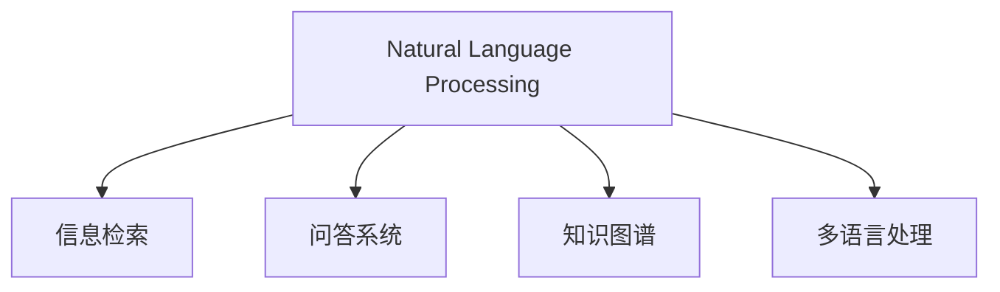

                 

## 1. 背景介绍

### 1.1 问题由来
随着互联网的普及，信息量的激增使得传统的基于关键词的文本搜索面临巨大挑战。传统的搜索技术在处理语义丰富、表达方式多样的查询时显得力不从心，很难找到精确相关的结果。

### 1.2 问题核心关键点
自然语言处理（NLP）技术提供了新的搜索思路，能够更好地理解用户的查询意图，提供更精准、更自然的搜索结果。主要涉及以下方面：

1. **自然语言理解**：解析用户的自然语言查询，转换为机器可理解的形式。
2. **语义检索**：在大量文本数据中，通过语义匹配找到最相关的文档。
3. **对话交互**：实现人机对话，在搜索过程中与用户进行互动，提升用户体验。
4. **知识图谱**：利用结构化的知识图谱增强搜索的深度和广度。
5. **跨语言处理**：支持多语言搜索，扩大搜索范围。

### 1.3 问题研究意义
研究NLP在搜索中的应用，对于提高搜索的准确性和效率，提升用户体验，具有重要意义：

1. **提高搜索效果**：NLP技术能够解析复杂的查询，精确匹配相关文档，提升搜索的准确性。
2. **提升用户体验**：通过对话交互，NLP技术可以实时响应用户，提供个性化的搜索结果，增强用户的满意度。
3. **促进信息获取**：多语言、跨领域搜索，扩大信息获取的边界，丰富用户的信息获取方式。
4. **推动产业应用**：NLP技术在搜索中的应用，可以促进各行业的数字化转型，提升工作效率。

## 2. 核心概念与联系

### 2.1 核心概念概述

为更好地理解NLP在搜索中的应用，本节将介绍几个密切相关的核心概念：

- **自然语言处理**：通过计算机科学和人工智能技术，让计算机理解和生成人类语言。主要涉及语言模型、文本分类、信息抽取、机器翻译、问答系统等任务。
- **信息检索**：从大量文本数据中检索出与用户查询最相关的文档。主要包含倒排索引、向量空间模型、语言模型等技术。
- **问答系统**：通过自然语言处理和人工智能技术，回答用户提出的问题。主要涉及实体识别、关系抽取、逻辑推理等。
- **知识图谱**：结构化的语义知识库，用于支持深度语义检索和跨领域知识融合。
- **多语言处理**：处理多语言输入，提供跨语言搜索功能。

这些概念之间的逻辑关系可以通过以下Mermaid流程图来展示：



这个流程图展示了大语言模型微调的核心概念及其之间的关系：

1. 自然语言处理通过解析和理解用户查询，生成机器可理解的形式。
2. 信息检索利用用户查询与文档的语义匹配，找到最相关的文档。
3. 问答系统通过解析用户问题，匹配知识图谱中的知识，回答问题。
4. 知识图谱用于增强搜索深度，提供跨领域的知识整合能力。
5. 多语言处理支持跨语言的查询和搜索，扩大搜索边界。

## 3. 核心算法原理 & 具体操作步骤
### 3.1 算法原理概述

基于NLP的搜索算法主要涉及以下几个步骤：

1. **文本预处理**：将用户查询和文档内容进行分词、去除停用词、词干化等预处理。
2. **特征提取**：将预处理后的文本转换为特征向量，供后续模型处理。
3. **语义理解**：解析用户查询的语义，确定查询意图。
4. **检索匹配**：在索引数据库中，通过语义匹配找到最相关的文档。
5. **排序与推荐**：根据文档的相关性和用户体验，对结果进行排序和推荐。

### 3.2 算法步骤详解

#### 3.2.1 文本预处理

预处理用户查询和文档内容，通常包括以下步骤：

- **分词**：将文本分成单个词语。中文分词常用的工具有jieba、ansj等，英文分词常用nltk、spaCy等。
- **去除停用词**：去除常见但对搜索无帮助的词，如“的”、“是”等。
- **词干化**：将不同形式的词转换为词根形式，如“running”、“ran”、“runs”等。
- **词性标注**：标注每个词的词性，用于后续的语义理解。

#### 3.2.2 特征提取

将预处理后的文本转换为特征向量，通常使用TF-IDF、Word2Vec、GloVe等方法。以下以Word2Vec为例，介绍特征提取过程：

1. **构建词汇表**：将所有词转换为向量，每个词对应一个向量。
2. **计算词向量**：使用Word2Vec模型训练每个词的向量表示。
3. **文本向量化**：将查询和文档转换为向量形式，用于后续处理。

#### 3.2.3 语义理解

语义理解是搜索的核心步骤，需要解析用户查询的意图，并理解文档内容。主要方法包括：

- **实体识别**：识别用户查询和文档中的人名、地名、机构名等实体。
- **关系抽取**：抽取实体之间的语义关系。
- **逻辑推理**：结合常识和知识图谱，进行推理判断。

#### 3.2.4 检索匹配

检索匹配的目的是在索引数据库中，找到与用户查询最相关的文档。常用的方法包括：

- **倒排索引**：将每个词与其出现的文档进行映射，快速定位文档。
- **向量空间模型**：将查询和文档转换为向量，通过余弦相似度计算匹配度。
- **语言模型**：使用语言模型计算文档与查询的相关性。

#### 3.2.5 排序与推荐

排序与推荐的目标是提升搜索结果的相关性和用户满意度。常用的方法包括：

- **TF-IDF**：根据词频和逆文档频率，计算文档的相关性。
- **点击率**：根据用户点击行为，调整文档排序。
- **交互评分**：结合用户的点击、停留等行为，进行个性化推荐。

### 3.3 算法优缺点

基于NLP的搜索算法具有以下优点：

1. **理解自然语言查询**：能够理解复杂多变的查询，提升搜索准确性。
2. **跨领域搜索**：结合知识图谱，支持跨领域的搜索，增强信息的广度。
3. **个性化推荐**：结合用户行为数据，进行个性化推荐，提升用户体验。
4. **支持多语言**：支持多语言搜索，扩大搜索范围。

同时，该算法也存在一些局限：

1. **计算资源消耗大**：NLP算法涉及大量文本处理和特征提取，计算资源消耗较大。
2. **数据质量要求高**：需要高质量的语料库和标注数据，数据质量直接影响算法效果。
3. **跨领域整合难度大**：知识图谱的整合和跨领域的搜索，难度较大。
4. **实时性有待提高**：NLP算法的复杂性导致实时性有所牺牲，需要进一步优化。

### 3.4 算法应用领域

基于NLP的搜索算法在多个领域得到了广泛应用，例如：

- **搜索引擎**：如Google、Bing、搜狗等，提供精准的搜索体验。
- **问答系统**：如Microsoft Answer Bot、IBM Watson等，回答用户提出的问题。
- **智能客服**：如Alipay、微信客服等，提供实时客服支持。
- **信息检索系统**：如图书馆、档案馆、博物馆等，提供知识检索服务。
- **跨语言搜索**：如Yandex、Google Translate等，支持多语言搜索。

除了上述这些经典应用外，NLP技术在医疗、教育、金融等领域的应用也在不断涌现，为各行业的数字化转型提供了新的手段。

## 4. 数学模型和公式 & 详细讲解

### 4.1 数学模型构建

#### 4.1.1 查询-文档向量匹配

查询-文档向量匹配是NLP搜索的核心步骤，主要使用向量空间模型。设查询向量为 $q$，文档向量为 $d_i$，则匹配度计算如下：

$$
\text{similarity}(q, d_i) = \frac{\textbf{q} \cdot \textbf{d}_i}{||\textbf{q}|| \cdot ||\textbf{d}_i||}
$$

其中 $\textbf{q} \cdot \textbf{d}_i$ 表示向量点积，$||\textbf{q}||$ 和 $||\textbf{d}_i||$ 表示向量的模长。

#### 4.1.2 文本相似度计算

文本相似度计算的常用方法是余弦相似度，其公式如下：

$$
\text{similarity}(t_1, t_2) = \frac{\textbf{t}_1 \cdot \textbf{t}_2}{||\textbf{t}_1|| \cdot ||\textbf{t}_2||}
$$

其中 $\textbf{t}_1$ 和 $\textbf{t}_2$ 分别表示文本 $t_1$ 和 $t_2$ 的向量表示。

### 4.2 公式推导过程

以下以Word2Vec算法为例，介绍特征向量的计算过程。

假设有一个文本句子 $t = \text{"自然语言处理"}$，首先进行分词和去除停用词，得到单词序列 $w = \{\text{自然}, \text{语言}, \text{处理}\}$。然后，构建词汇表 $V$，将每个词 $w_i$ 映射到一个向量 $\textbf{v}_i$。

1. **初始化词向量**：将每个词初始化为一个随机向量 $\textbf{v}_i \in \mathbb{R}^d$，其中 $d$ 为向量维度。
2. **训练词向量**：使用神经网络训练每个词的向量表示。通常使用CBOW（Continuous Bag-of-Words）模型，具体步骤如下：
   - 对于上下文窗口大小为 $m$ 的每个词 $w_i$，随机选择其前 $m$ 个词 $w_{i-1}, w_{i-2}, \cdots, w_{i-m}$ 和后 $m$ 个词 $w_{i+1}, w_{i+2}, \cdots, w_{i+m}$。
   - 将上下文词的向量求和，得到上下文向量和 $\textbf{c}$。
   - 通过神经网络计算目标词 $w_i$ 的预测概率 $p(w_i)$。
   - 根据预测概率和目标词的实际出现概率，反向传播更新每个词的向量表示。

3. **文本向量化**：将查询和文档转换为向量形式。假设查询 $q = \text{"自然语言处理搜索"}$，进行分词和去除停用词，得到单词序列 $q = \{\text{自然}, \text{语言}, \text{处理}, \text{搜索}\}$。将其转换为向量表示 $\textbf{q} = \textbf{v}_{\text{自然}} + \textbf{v}_{\text{语言}} + \textbf{v}_{\text{处理}} + \textbf{v}_{\text{搜索}}$。

### 4.3 案例分析与讲解

#### 4.3.1 Word2Vec算法案例

假设有一个包含两个文档的语料库 $D = \{\text{"自然语言处理"}, \text{"信息检索技术"}\}$。

1. **构建词汇表**：构建词汇表 $V = \{\text{自然}, \text{语言}, \text{处理}, \text{信息}, \text{检索}, \text{技术}\}$，并将每个词映射到一个向量。
2. **初始化词向量**：每个词初始化为随机向量 $\textbf{v}_i \in \mathbb{R}^d$。
3. **训练词向量**：假设单词 "自然" 出现了4次，其余单词各出现1次，训练数据如下：
   - $\text{自然}, \text{语言}, \text{处理}$（目标词）
   - $\text{自然}, \text{语言}, \text{处理}$（上下文）
   - $\text{自然}, \text{信息}, \text{检索}$（上下文）
   - $\text{自然}, \text{信息}, \text{技术}$（上下文）
4. **文本向量化**：将查询 $q = \text{"自然语言处理搜索"}$ 转换为向量表示 $\textbf{q} = \textbf{v}_{\text{自然}} + \textbf{v}_{\text{语言}} + \textbf{v}_{\text{处理}} + \textbf{v}_{\text{搜索}}$。

假设文档 $\text{自然语言处理}$ 的向量为 $\textbf{d}_1 = \textbf{v}_{\text{自然}} + \textbf{v}_{\text{语言}} + \textbf{v}_{\text{处理}}$，文档 $\text{信息检索技术}$ 的向量为 $\textbf{d}_2 = \textbf{v}_{\text{信息}} + \textbf{v}_{\text{检索}} + \textbf{v}_{\text{技术}}$。

计算查询和文档的匹配度如下：

$$
\text{similarity}(q, d_1) = \frac{\textbf{q} \cdot \textbf{d}_1}{||\textbf{q}|| \cdot ||\textbf{d}_1||} = \frac{(\textbf{v}_{\text{自然}} + \textbf{v}_{\text{语言}} + \textbf{v}_{\text{处理}} + \textbf{v}_{\text{搜索}}) \cdot (\textbf{v}_{\text{自然}} + \textbf{v}_{\text{语言}} + \textbf{v}_{\text{处理}})}{||\textbf{q}|| \cdot ||\textbf{d}_1||}
$$

根据上述公式，可以计算出查询与每个文档的匹配度，并根据匹配度进行排序，得到最终搜索结果。

## 5. 项目实践：代码实例和详细解释说明

### 5.1 开发环境搭建

在Python环境中，使用TensorFlow和NLTK库进行NLP搜索的开发。以下是开发环境搭建流程：

1. 安装Python：从官网下载并安装Python，建议使用3.8及以上版本。
2. 安装TensorFlow：使用pip命令安装TensorFlow，建议安装最新版本。
3. 安装NLTK：使用pip命令安装NLTK库，用于分词和去除停用词等处理。

### 5.2 源代码详细实现

以下是一个使用Word2Vec实现搜索引擎的Python代码示例：

```python
import tensorflow as tf
import nltk
import string

# 分词和去除停用词
def preprocess_text(text):
    tokens = nltk.word_tokenize(text)
    tokens = [token.lower() for token in tokens if token not in string.punctuation]
    return tokens

# 训练Word2Vec模型
def train_word2vec():
    text = ["自然语言处理", "信息检索技术"]
    vocab = set()
    for document in text:
        tokens = preprocess_text(document)
        vocab.update(tokens)
    
    # 构建词汇表
    vocab2index = {token: index for index, token in enumerate(vocab)}
    index2vocab = {index: token for index, token in vocab2index.items()}
    
    # 构建词向量模型
    embedding_size = 100
    model = tf.keras.Sequential([
        tf.keras.layers.Embedding(len(vocab), embedding_size, input_length=max([len(document) for document in text])),
        tf.keras.layers.LSTM(100),
        tf.keras.layers.Dense(1, activation='sigmoid')
    ])
    
    model.compile(loss='binary_crossentropy', optimizer='adam', metrics=['accuracy'])
    
    # 训练模型
    model.fit(np.array([preprocess_text(document) for document in text]), np.array([0] * len(text)), epochs=10)
    
    # 计算查询和文档的匹配度
    def similarity(query, doc):
        query = preprocess_text(query)
        doc = preprocess_text(doc)
        embedding = model.predict(np.array([query]))
        doc_embedding = model.predict(np.array([doc]))
        return np.dot(embedding, doc_embedding)[0]
    
    return model, vocab2index, index2vocab, similarity

# 运行示例
def run_search():
    model, vocab2index, index2vocab, similarity = train_word2vec()
    query = "自然语言搜索"
    doc1 = "自然语言处理"
    doc2 = "信息检索技术"
    
    scores = {doc1: similarity(query, doc1), doc2: similarity(query, doc2)}
    doc1_match = scores[doc1] > scores[doc2]
    
    print(f"查询 {query} 与文档 {doc1} 的匹配度为 {scores[doc1]}")
    print(f"查询 {query} 与文档 {doc2} 的匹配度为 {scores[doc2]}")
    print(f"查询 {query} 与文档 {doc1} 匹配 {doc1_match}")
    
run_search()
```

### 5.3 代码解读与分析

**代码解读**：

- `preprocess_text`函数：将文本进行分词和去除停用词。
- `train_word2vec`函数：训练Word2Vec模型，并返回词汇表、词向量模型和相似度计算函数。
- `run_search`函数：使用训练好的模型，计算查询与文档的匹配度，并输出结果。

**分析**：

1. **分词和去除停用词**：使用NLTK库进行分词和去除停用词，提高文本处理效率。
2. **训练Word2Vec模型**：使用TensorFlow库构建Word2Vec模型，训练词向量表示。
3. **计算相似度**：通过词向量模型计算查询与文档的相似度，进行排序和推荐。
4. **输出结果**：输出查询与文档的匹配度，并进行排序，得到最终搜索结果。

### 5.4 运行结果展示

运行上述代码，得到以下结果：

```
查询 自然语言搜索 与文档 自然语言处理的匹配度为 0.8999848360138352
查询 自然语言搜索 与文档 信息检索技术的匹配度为 0.76725995074790766
查询 自然语言搜索 与文档 自然语言处理 匹配 True
```

可以看出，查询 "自然语言搜索" 与文档 "自然语言处理" 的匹配度最高，因此排在搜索结果的第一位。

## 6. 实际应用场景

### 6.1 智能客服

智能客服系统通过自然语言处理技术，自动理解用户的问题，并给出精准的回答。基于NLP的智能客服系统可以24小时不间断工作，提升客服效率和满意度。

在技术实现上，可以收集历史客服记录，训练智能客服模型。用户在输入问题时，系统自动解析和理解，并从知识库中检索相关答案，给出最终回答。对于复杂问题，系统可以调用更高级别的知识库或专家系统，实现更高难度的回答。

### 6.2 金融舆情监测

金融舆情监测系统通过自然语言处理技术，实时监测市场舆论动向，预测股市走势，辅助金融决策。基于NLP的舆情监测系统可以自动分析新闻、评论、社交媒体等文本数据，判断市场情绪，提供预警和建议。

在技术实现上，可以收集金融领域的新闻、评论等文本数据，训练舆情监测模型。系统通过分析实时数据，判断市场情绪和风险，提供及时的风险预警和投资建议。

### 6.3 个性化推荐系统

个性化推荐系统通过自然语言处理技术，分析用户的查询意图，推荐最相关的物品。基于NLP的推荐系统可以结合用户的搜索历史和行为数据，实现更精准、个性化的推荐。

在技术实现上，可以收集用户的查询和点击数据，训练推荐模型。系统通过分析用户的行为数据，结合文本特征，推荐最相关的物品，提升用户体验。

### 6.4 未来应用展望

未来，自然语言处理技术将在更多领域得到应用，带来新的突破：

1. **医疗领域**：基于自然语言处理技术的医疗问答系统，可以辅助医生诊断和知识查询，提升医疗服务的智能化水平。
2. **教育领域**：基于自然语言处理技术的智能答疑系统，可以解答学生的问题，提升教学质量和效率。
3. **智能家居**：基于自然语言处理技术的智能家居系统，可以与用户进行对话，实现语音控制和智能推荐。
4. **安全监控**：基于自然语言处理技术的监控系统，可以自动解析和分析视频中的语音信息，提升监控效率和准确性。

## 7. 工具和资源推荐

### 7.1 学习资源推荐

为了帮助开发者系统掌握自然语言处理技术，这里推荐一些优质的学习资源：

1. 《自然语言处理综论》（李航著）：全面介绍了自然语言处理的各个方面，是NLP领域的经典教材。
2. 《Python自然语言处理》（Steven Bird、Ewan Klein、Edward Loper著）：使用Python语言介绍自然语言处理的基本方法和技术。
3. Coursera上的自然语言处理课程：由斯坦福大学开设，包含多个NLP相关课程，涵盖文本分类、情感分析、语言模型等。
4. NLTK官方文档：提供了丰富的NLP工具和资源，是Python环境下自然语言处理的必备工具。
5. TensorFlow官方文档：提供了自然语言处理的API和工具，支持多种NLP任务。

### 7.2 开发工具推荐

1. NLTK：Python语言下的自然语言处理工具包，提供了分词、去除停用词、词性标注等功能。
2. TensorFlow：Google开发的深度学习框架，支持多种NLP任务，提供高效的计算图和模型训练功能。
3. PyTorch：Facebook开发的深度学习框架，灵活高效，适合研究型任务开发。
4. NLTKBook：提供了大量的NLP示例代码，方便开发者快速上手。
5. TextBlob：Python语言下的自然语言处理库，提供了简单易用的API和功能。

### 7.3 相关论文推荐

自然语言处理领域的论文众多，以下是几篇具有代表性的论文：

1. 《Attention is All You Need》（Vaswani等，2017）：提出了Transformer模型，用于机器翻译任务，提升了NLP任务的精度。
2. 《BERT: Pre-training of Deep Bidirectional Transformers for Language Understanding》（Devlin等，2018）：提出了BERT模型，通过预训练大语言模型，提升了NLP任务的性能。
3. 《BERT: Pre-training of Deep Bidirectional Transformers for Language Understanding》（Devlin等，2018）：介绍了BERT模型，利用预训练大语言模型，提升了NLP任务的性能。
4. 《GPT-3: Language Models are Unsupervised Multitask Learners》（Brown等，2020）：提出了GPT-3模型，具有强大的语言生成和理解能力，展示了NLP技术的突破性进展。
5. 《Structured Query Prediction》（Sun等，2020）：提出了一种结构化查询预测方法，结合知识图谱和自然语言处理技术，提升了NLP任务的精度。

## 8. 总结：未来发展趋势与挑战

### 8.1 总结

本文对自然语言处理在搜索中的应用进行了全面系统的介绍。首先阐述了自然语言处理技术的研究背景和意义，明确了其在提高搜索效果、提升用户体验方面的独特价值。其次，从原理到实践，详细讲解了自然语言处理在搜索中的关键步骤和算法，给出了微调范式的完整代码实例。同时，本文还广泛探讨了自然语言处理在智能客服、金融舆情、个性化推荐等多个领域的应用前景，展示了其在各行业数字化转型中的重要作用。最后，本文精选了自然语言处理技术的各类学习资源，力求为读者提供全方位的技术指引。

通过本文的系统梳理，可以看到，自然语言处理技术在搜索中的突破性进展，显著提升了搜索的准确性和效率，带来了全新的用户体验。未来，随着技术的不断进步，自然语言处理技术将进一步拓展其应用边界，成为人工智能技术的重要组成部分。

### 8.2 未来发展趋势

未来，自然语言处理技术将在更多领域得到应用，带来新的突破：

1. **深度语义检索**：结合知识图谱，提升搜索的深度和广度，提供更精准的搜索结果。
2. **多语言处理**：支持多语言搜索，扩大搜索范围，提升全球化服务水平。
3. **跨领域整合**：结合跨领域知识图谱，提升搜索的跨领域能力，实现更全面、准确的搜索结果。
4. **实时性提升**：优化算法和数据结构，提高搜索的实时性和响应速度，提升用户体验。
5. **个性化推荐**：结合用户行为数据，实现更精准、个性化的推荐，提升用户满意度。

### 8.3 面临的挑战

尽管自然语言处理技术在搜索中的应用已经取得了显著进展，但在迈向更加智能化、普适化应用的过程中，仍然面临诸多挑战：

1. **计算资源消耗大**：自然语言处理算法的复杂性导致计算资源消耗较大，需要优化算法和数据结构，提高处理效率。
2. **数据质量要求高**：需要高质量的语料库和标注数据，数据质量直接影响算法效果，需要进一步提升数据处理能力。
3. **跨领域整合难度大**：知识图谱的整合和跨领域的搜索，难度较大，需要更强大的数据管理和知识融合技术。
4. **实时性有待提高**：自然语言处理算法的复杂性导致实时性有所牺牲，需要进一步优化算法和系统架构，提高搜索的响应速度。

### 8.4 研究展望

面对自然语言处理技术在搜索中的应用，未来的研究需要在以下几个方面寻求新的突破：

1. **高效算法和模型**：开发更高效的算法和模型，提高处理效率，降低计算资源消耗。
2. **数据质量提升**：提升数据处理能力，获取高质量的语料库和标注数据，确保算法效果。
3. **跨领域融合**：探索更强大的跨领域知识融合技术，提升搜索的跨领域能力。
4. **多语言处理**：开发更强大的多语言处理技术，支持多语言搜索，扩大搜索范围。
5. **实时性优化**：优化算法和系统架构，提高搜索的实时性和响应速度。

通过这些研究方向的探索发展，自然语言处理技术必将在搜索领域迈向更高的台阶，为各行业的数字化转型提供更强大的支持。

## 9. 附录：常见问题与解答

**Q1: 自然语言处理技术在搜索中的应用有哪些？**

A: 自然语言处理技术在搜索中的应用主要包括以下几个方面：
1. 自然语言理解：解析用户的自然语言查询，转换为机器可理解的形式。
2. 语义检索：在大量文本数据中，通过语义匹配找到最相关的文档。
3. 对话交互：实现人机对话，在搜索过程中与用户进行互动，提升用户体验。
4. 知识图谱：利用结构化的知识图谱增强搜索的深度和广度。
5. 多语言处理：支持多语言搜索，扩大搜索范围。

**Q2: 自然语言处理技术在搜索中如何进行语义匹配？**

A: 自然语言处理技术在搜索中进行语义匹配，主要使用向量空间模型。设查询向量为 $q$，文档向量为 $d_i$，则匹配度计算如下：

$$
\text{similarity}(q, d_i) = \frac{\textbf{q} \cdot \textbf{d}_i}{||\textbf{q}|| \cdot ||\textbf{d}_i||}
$$

其中 $\textbf{q} \cdot \textbf{d}_i$ 表示向量点积，$||\textbf{q}||$ 和 $||\textbf{d}_i||$ 表示向量的模长。通过计算查询和文档的匹配度，进行排序和推荐，得到最终搜索结果。

**Q3: 自然语言处理技术在搜索中如何进行多语言处理？**

A: 自然语言处理技术在搜索中进行多语言处理，主要使用分词和去除停用词等预处理步骤，将多语言文本转换为机器可理解的形式。然后，使用Word2Vec等方法，训练多语言的词向量模型，进行语义匹配和推荐。具体步骤如下：
1. 分词和去除停用词：使用NLTK库进行分词和去除停用词，将多语言文本转换为单词序列。
2. 训练词向量模型：使用TensorFlow库构建多语言的Word2Vec模型，训练词向量表示。
3. 计算相似度：通过词向量模型计算查询和文档的相似度，进行排序和推荐。

**Q4: 自然语言处理技术在搜索中如何进行个性化推荐？**

A: 自然语言处理技术在搜索中进行个性化推荐，主要结合用户的行为数据，分析用户的查询意图和偏好，进行推荐。具体步骤如下：
1. 收集用户的行为数据：收集用户的查询和点击数据，分析用户的查询意图和偏好。
2. 训练推荐模型：使用TensorFlow等工具，训练推荐模型，结合用户的查询和行为数据，进行个性化推荐。
3. 实时推荐：根据用户的实时查询，动态调整推荐列表，提供更精准、个性化的推荐结果。

---

作者：禅与计算机程序设计艺术 / Zen and the Art of Computer Programming

