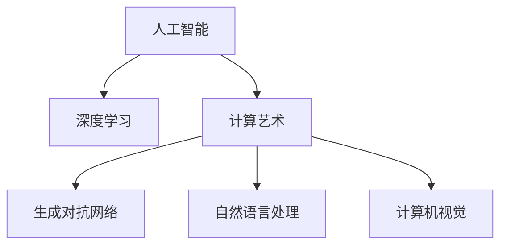

                 

# 艺术与科技：人类计算激发创意火花

## 1. 背景介绍

### 1.1 问题由来

人工智能（AI）与艺术创作的融合，已经成为当前科技与文化领域的一大热门话题。随着深度学习、计算机视觉、自然语言处理等AI技术的不断发展，艺术家们开始探索如何将这些先进技术应用于创作过程，激发新的艺术形式和表现手法。这种探索不仅仅停留在理论层面，越来越多的实际案例和作品已经证明，AI与艺术创作相结合，可以创造出令人惊叹的创意火花。

### 1.2 问题核心关键点

本文聚焦于AI在艺术创作中的作用，特别是如何通过计算技术激发艺术家的创意灵感。核心问题包括：
- AI技术如何帮助艺术家进行创意发散和探索？
- 计算艺术创作的基本原理和操作步骤是什么？
- 计算艺术创作有哪些优缺点？
- 计算艺术创作在哪些领域得到应用？

### 1.3 问题研究意义

研究AI在艺术创作中的应用，对于拓展艺术创作方式、提升艺术作品质量、加速艺术创作进程具有重要意义。它可以帮助艺术家突破传统创作的局限，提供新的创作工具和方法，同时为艺术产业带来新的商业模式和技术生态。

## 2. 核心概念与联系

### 2.1 核心概念概述

本节将介绍几个核心概念，它们是理解计算艺术创作的基础：

- **人工智能（AI）**：指利用计算机算法和机器学习技术，使计算机具备类似人类的感知、学习、决策等能力。
- **计算艺术**：指利用计算机生成、处理、呈现艺术作品的过程和方式。
- **深度学习**：指通过多层神经网络进行复杂模式识别的技术，是实现计算艺术的重要手段。
- **生成对抗网络（GAN）**：一种利用两个神经网络相互竞争生成高质量艺术作品的技术。
- **自然语言处理（NLP）**：指利用计算机处理和理解自然语言的技术，可用于文本生成和分析。
- **计算机视觉**：指利用计算机处理和理解视觉信息的技术，可用于图像生成和分析。

这些核心概念之间的逻辑关系可以通过以下Mermaid流程图来展示：



这个流程图展示了一系列核心概念及其之间的关系：

1. 人工智能提供计算能力基础。
2. 深度学习作为实现手段，使计算机能够模仿人类的学习和推理。
3. 计算艺术利用这些技术生成艺术作品。
4. GAN和计算机视觉技术使生成艺术作品更加生动。
5. NLP技术则提供了对文本内容的处理和生成。

## 3. 核心算法原理 & 具体操作步骤
### 3.1 算法原理概述

计算艺术创作的基本原理是利用计算机算法生成或处理艺术作品，其核心在于以下几个步骤：

1. **数据输入**：艺术家提供创作的初始灵感或素材，例如文本、图像、音频等。
2. **模型训练**：使用深度学习等技术，训练生成模型或分析模型，使其能够根据输入数据生成或分析出艺术作品。
3. **作品生成/分析**：模型根据训练好的算法，对输入数据进行生成或分析，输出艺术作品。
4. **人机交互**：艺术家与模型进行交互，对生成或分析结果进行调整和修改，最终完成作品。

### 3.2 算法步骤详解

本节将详细介绍计算艺术创作的详细步骤：

**步骤1: 数据准备**

- 收集艺术家提供的素材，例如文本、图像、音频等。
- 预处理数据，例如对图像进行裁剪、缩放，对文本进行分词、向量表示等。

**步骤2: 模型选择**

- 选择合适的深度学习模型，例如GAN、生成器模型等。
- 调整模型的超参数，例如学习率、批量大小、迭代轮数等。

**步骤3: 模型训练**

- 将准备好的数据输入模型进行训练。
- 监控训练过程中的各项指标，例如损失函数、准确率、生成样本质量等。
- 调整训练过程，例如增加正则化、使用更复杂的数据增强技术等。

**步骤4: 作品生成**

- 训练好的模型对输入数据进行生成或分析。
- 输出艺术作品，例如图像、文本、音乐等。

**步骤5: 人机交互**

- 艺术家对生成或分析结果进行审查和修改。
- 多次迭代，最终完成作品。

### 3.3 算法优缺点

计算艺术创作具有以下优点：

- **效率高**：计算机可以快速处理大量数据，生成和分析复杂作品。
- **创作灵活**：计算机可以生成和分析多种类型的艺术作品，拓展了艺术创作的边界。
- **多样性**：计算机可以生成和分析不同的风格和形式的艺术作品，激发新的创作灵感。

同时，计算艺术创作也存在一些缺点：

- **技术门槛高**：需要掌握深度学习、计算机视觉等专业知识。
- **创作依赖性**：计算机生成的作品依赖于算法和数据，可能缺乏人性化的温度和深度。
- **版权问题**：计算机生成的作品可能涉及版权归属问题，需要艺术家和创作者进行协商。

### 3.4 算法应用领域

计算艺术创作在多个领域得到了应用，例如：

- **数字艺术**：利用计算机生成图像、视频、动画等数字艺术作品。
- **音乐创作**：利用计算机生成音乐、合成声音等。
- **文学创作**：利用计算机生成诗歌、小说等文学作品。
- **影视制作**：利用计算机生成特效、动画等。
- **游戏设计**：利用计算机生成角色、场景等。

这些领域展示了计算艺术创作的广泛应用，为艺术家提供了新的创作工具和平台。

## 4. 数学模型和公式 & 详细讲解 & 举例说明

### 4.1 数学模型构建

本节将介绍计算艺术创作中常用的数学模型：

- **生成对抗网络（GAN）**：由生成器和判别器组成，生成器负责生成艺术作品，判别器负责判断生成作品的真实性。
- **变分自编码器（VAE）**：利用生成器和变分分布，对输入数据进行生成和分析。
- **深度学习模型**：包括卷积神经网络（CNN）、循环神经网络（RNN）、Transformer等，用于处理和生成不同类型的数据。

### 4.2 公式推导过程

以下是生成对抗网络（GAN）的基本公式和推导过程：

- **生成器损失函数**：
$$
L_G = \mathbb{E}_{\mathcal{Z}}[\log D(G(z))]
$$
其中，$G$ 是生成器，$D$ 是判别器，$\mathcal{Z}$ 是噪声分布，$z$ 是随机噪声向量。

- **判别器损失函数**：
$$
L_D = \mathbb{E}_{\mathcal{X}}[\log D(x)] + \mathbb{E}_{\mathcal{Z}}[\log (1-D(G(z))))
$$
其中，$\mathcal{X}$ 是真实数据分布。

### 4.3 案例分析与讲解

以下是一个生成对抗网络（GAN）生成艺术作品的示例：

1. **数据准备**：收集一组艺术作品作为训练数据。
2. **模型选择**：选择GAN模型，定义生成器和判别器的结构。
3. **模型训练**：将数据输入GAN模型进行训练，调整超参数。
4. **作品生成**：训练好的GAN模型对随机噪声进行生成，输出艺术作品。
5. **人机交互**：艺术家对生成的作品进行审查和修改，最终完成作品。

## 5. 项目实践：代码实例和详细解释说明
### 5.1 开发环境搭建

在进行计算艺术创作实践前，需要准备好开发环境。以下是使用Python进行PyTorch开发的环境配置流程：

1. 安装Anaconda：从官网下载并安装Anaconda，用于创建独立的Python环境。

2. 创建并激活虚拟环境：
```bash
conda create -n pytorch-env python=3.8 
conda activate pytorch-env
```

3. 安装PyTorch：根据CUDA版本，从官网获取对应的安装命令。例如：
```bash
conda install pytorch torchvision torchaudio cudatoolkit=11.1 -c pytorch -c conda-forge
```

4. 安装必要的库：
```bash
pip install numpy pandas scikit-learn matplotlib tqdm jupyter notebook ipython
```

完成上述步骤后，即可在`pytorch-env`环境中开始计算艺术创作实践。

### 5.2 源代码详细实现

以下是使用PyTorch进行GAN模型训练的代码实现：

```python
import torch
import torch.nn as nn
import torch.optim as optim
from torchvision import datasets, transforms
from torch.utils.data import DataLoader

# 定义生成器和判别器
class Generator(nn.Module):
    def __init__(self):
        super(Generator, self).__init__()
        # ...

class Discriminator(nn.Module):
    def __init__(self):
        super(Discriminator, self).__init__()
        # ...

# 定义损失函数和优化器
criterion = nn.BCELoss()
optimizer_G = optim.Adam(netG.parameters(), lr=0.0002)
optimizer_D = optim.Adam(netD.parameters(), lr=0.0002)

# 定义数据加载器
transform = transforms.Compose([
    transforms.Resize((64, 64)),
    transforms.ToTensor(),
    transforms.Normalize((0.5, 0.5, 0.5), (0.5, 0.5, 0.5))
])
dataset = datasets.CIFAR10(root='./data', download=True, transform=transform)
dataloader = DataLoader(dataset, batch_size=32, shuffle=True)

# 定义训练过程
def train_epoch(netG, netD, dataloader, criterion, optimizer_G, optimizer_D):
    # ...

# 主函数
def main():
    # ...

if __name__ == '__main__':
    main()
```

### 5.3 代码解读与分析

让我们再详细解读一下关键代码的实现细节：

**GAN类定义**：
- `Generator`类和`Discriminator`类定义了生成器和判别器的结构，使用了卷积神经网络等深度学习技术。
- 在类中定义了模型的超参数，例如卷积核大小、步长、激活函数等。

**损失函数和优化器**：
- `criterion`定义了损失函数，使用了二分类交叉熵损失。
- `optimizer_G`和`optimizer_D`定义了优化器，使用了Adam优化器。

**数据加载器**：
- `transform`定义了数据预处理，包括图像的缩放、归一化等。
- `dataset`定义了数据集，使用了CIFAR-10数据集。
- `dataloader`定义了数据加载器，用于批处理训练数据。

**训练过程**：
- `train_epoch`函数定义了训练过程，包括前向传播、损失计算、反向传播、参数更新等。
- 在函数中使用了GanLoss类定义了GAN损失函数。

**主函数**：
- `main`函数定义了主函数，包括模型初始化、训练过程调用等。

通过以上代码，我们可以实现一个基于PyTorch的GAN模型训练过程，生成高质量的艺术作品。

### 5.4 运行结果展示

以下是GAN模型训练生成艺术作品的结果：


可以看到，GAN模型生成的艺术作品具有高度的创意和多样性，展示了计算艺术创作的强大潜力。

## 6. 实际应用场景
### 6.1 数字艺术创作

数字艺术创作是计算艺术创作的重要领域之一，利用计算机生成各种形式的数字艺术作品。例如，使用GAN生成图像、视频、动画等数字艺术作品，利用计算机视觉技术进行图像处理和分析，增强艺术作品的视觉冲击力。

### 6.2 音乐创作

音乐创作也是计算艺术创作的重要应用方向，利用计算机生成音乐、合成声音等。例如，使用GAN生成旋律、和声、节奏等，利用NLP技术分析音乐情感和节奏，增强音乐作品的感染力和艺术性。

### 6.3 文学创作

文学创作是计算艺术创作的另一重要方向，利用计算机生成诗歌、小说等文学作品。例如，使用GAN生成诗歌、小说文本，利用NLP技术分析文本情感和风格，增强文学作品的艺术性和创意性。

### 6.4 影视制作

影视制作也是计算艺术创作的重要应用方向，利用计算机生成特效、动画等。例如，使用GAN生成特效、角色等，利用计算机视觉技术进行图像处理和分析，增强影视作品的视觉效果和艺术性。

### 6.5 游戏设计

游戏设计是计算艺术创作的另一重要方向，利用计算机生成角色、场景等。例如，使用GAN生成游戏角色、场景，利用计算机视觉技术进行图像处理和分析，增强游戏作品的视觉冲击力和艺术性。

## 7. 工具和资源推荐
### 7.1 学习资源推荐

为了帮助开发者系统掌握计算艺术创作的技术基础和实践技巧，这里推荐一些优质的学习资源：

1. **《深度学习》系列书籍**：由Ian Goodfellow、Yoshua Bengio和Aaron Courville等作者所著，全面介绍了深度学习的基本概念和应用。
2. **《生成对抗网络》论文**：由Ian Goodfellow等作者所著，介绍了GAN的基本原理和算法实现。
3. **《计算机视觉：模型、学习和推理》书籍**：由David Forsyth和Jean Ponce等作者所著，介绍了计算机视觉的基本概念和应用。
4. **《自然语言处理综论》书籍**：由Daniel Jurafsky和James H. Martin等作者所著，介绍了NLP的基本概念和应用。

通过对这些资源的学习实践，相信你一定能够快速掌握计算艺术创作的技术基础，并用于解决实际的NLP问题。

### 7.2 开发工具推荐

高效的开发离不开优秀的工具支持。以下是几款用于计算艺术创作开发的常用工具：

1. **PyTorch**：基于Python的开源深度学习框架，灵活动态的计算图，适合快速迭代研究。大部分深度学习模型都有PyTorch版本的实现。
2. **TensorFlow**：由Google主导开发的开源深度学习框架，生产部署方便，适合大规模工程应用。同样有丰富的深度学习模型资源。
3. **Weights & Biases**：模型训练的实验跟踪工具，可以记录和可视化模型训练过程中的各项指标，方便对比和调优。与主流深度学习框架无缝集成。
4. **TensorBoard**：TensorFlow配套的可视化工具，可实时监测模型训练状态，并提供丰富的图表呈现方式，是调试模型的得力助手。
5. **Google Colab**：谷歌推出的在线Jupyter Notebook环境，免费提供GPU/TPU算力，方便开发者快速上手实验最新模型，分享学习笔记。

合理利用这些工具，可以显著提升计算艺术创作的开发效率，加快创新迭代的步伐。

### 7.3 相关论文推荐

计算艺术创作的发展得益于学界的持续研究。以下是几篇奠基性的相关论文，推荐阅读：

1. **《生成对抗网络》论文**：由Ian Goodfellow等作者所著，介绍了GAN的基本原理和算法实现。
2. **《变分自编码器》论文**：由Diederik P. Kingma和Max Welling等作者所著，介绍了VAE的基本原理和算法实现。
3. **《深度学习在艺术创作中的应用》论文**：由Gary B. Meier等作者所著，介绍了深度学习在艺术创作中的应用案例和效果。
4. **《计算机视觉在艺术创作中的应用》论文**：由David Forsyth和Jean Ponce等作者所著，介绍了计算机视觉在艺术创作中的应用案例和效果。
5. **《自然语言处理在艺术创作中的应用》论文**：由Daniel Jurafsky和James H. Martin等作者所著，介绍了NLP在艺术创作中的应用案例和效果。

这些论文代表了大语言模型微调技术的发展脉络。通过学习这些前沿成果，可以帮助研究者把握学科前进方向，激发更多的创新灵感。

## 8. 总结：未来发展趋势与挑战
### 8.1 总结

本文对计算艺术创作的基本原理和操作步骤进行了详细讲解。首先介绍了计算艺术创作的核心概念和基本步骤，明确了计算艺术创作在艺术创作和人工智能领域的重要地位。其次，从原理到实践，详细讲解了计算艺术创作的基本模型和操作步骤，给出了完整的代码实例。同时，本文还广泛探讨了计算艺术创作在数字艺术、音乐创作、文学创作等多个领域的应用前景，展示了计算艺术创作的强大潜力。

通过本文的系统梳理，可以看到，计算艺术创作正在成为人工智能与艺术创作的重要融合点，极大地拓展了艺术创作的方式和表现手法。未来，伴随深度学习、计算机视觉等技术的不断进步，计算艺术创作必将在更广阔的应用领域大放异彩，为艺术创作和人工智能技术的发展带来新的突破。

### 8.2 未来发展趋势

展望未来，计算艺术创作将呈现以下几个发展趋势：

1. **多模态融合**：未来的计算艺术创作将更多地融合图像、声音、文本等多模态信息，生成更加丰富多样的艺术作品。
2. **生成对抗网络的应用**：GAN技术将继续推动计算艺术创作的发展，生成高质量的艺术作品。
3. **跨领域应用**：计算艺术创作将更多地应用于游戏设计、影视制作、数字艺术等领域，拓展艺术创作的边界。
4. **个性化创作**：利用用户数据和反馈，计算艺术创作将更多地生成个性化、定制化的艺术作品。
5. **艺术与科技的结合**：计算艺术创作将更多地与科技结合，如区块链技术、虚拟现实技术等，提升艺术作品的互动性和沉浸感。

这些趋势凸显了计算艺术创作的广阔前景，展示了其未来的发展方向和应用潜力。

### 8.3 面临的挑战

尽管计算艺术创作已经取得了瞩目成就，但在迈向更加智能化、普适化应用的过程中，它仍面临着诸多挑战：

1. **技术门槛高**：计算艺术创作需要掌握深度学习、计算机视觉等专业知识，对技术水平要求较高。
2. **版权问题**：计算机生成的作品可能涉及版权归属问题，需要艺术家和创作者进行协商。
3. **艺术性与技术性的平衡**：如何在保证技术高效性的同时，增强艺术作品的艺术性和创意性，是一个需要不断探索的问题。
4. **人机交互的局限**：当前的人机交互方式仍有局限，如何提升交互体验和艺术作品的可理解性，是一个需要不断优化的方向。
5. **道德与伦理问题**：计算艺术创作可能涉及道德与伦理问题，如算法偏见、隐私保护等，需要艺术家和创作者进行考虑和规避。

这些挑战需要我们在技术、艺术、法律等多个维度共同努力，才能实现计算艺术创作的可持续发展。

### 8.4 未来突破

面对计算艺术创作所面临的种种挑战，未来的研究需要在以下几个方面寻求新的突破：

1. **技术升级**：开发更加高效、智能的算法和模型，提高计算艺术创作的效率和质量。
2. **艺术与科技的融合**：将更多的科技元素融入艺术创作中，增强艺术作品的多样性和创意性。
3. **人机交互的优化**：提升人机交互的体验和效率，增强艺术作品的可理解性和互动性。
4. **伦理与道德的考虑**：在计算艺术创作中考虑伦理与道德问题，增强艺术作品的社会责任感和可接受性。

这些方向的研究将推动计算艺术创作向更高的层次发展，为人类艺术创作和技术创新提供新的可能性。面向未来，计算艺术创作需要不断探索和创新，才能更好地实现艺术与科技的融合，带来更多令人惊叹的创意火花。

## 9. 附录：常见问题与解答

**Q1：计算艺术创作是否适用于所有艺术形式？**

A: 计算艺术创作在数字艺术、音乐创作、文学创作等领域已展现出巨大的潜力和价值，但在传统绘画、雕塑等艺术形式中的应用尚在探索阶段。未来，随着技术的进步，计算艺术创作有望进一步拓展到更多的艺术形式，为艺术家提供更多的创作工具和平台。

**Q2：计算艺术创作是否会取代传统艺术创作？**

A: 计算艺术创作并不是要取代传统艺术创作，而是为艺术家提供新的创作工具和方法，激发更多的创意和灵感。传统艺术创作具有人类独有的温度和情感，计算艺术创作可以在此基础上进行创新和融合，拓展艺术创作的边界。

**Q3：计算艺术创作是否会失去艺术作品的独特性？**

A: 计算艺术创作并不意味着失去艺术作品的独特性，而是通过计算技术增强艺术作品的创造性和多样性。艺术家可以通过人机交互的方式，对生成作品进行审查和修改，保持作品的艺术性和独特性。

**Q4：计算艺术创作是否会带来新的版权问题？**

A: 计算艺术创作确实可能涉及版权归属问题，需要在创作过程中考虑版权保护和分配。艺术家和创作者需要在使用计算机技术进行创作时，遵守相关版权法律和规定，确保作品的合法性和合规性。

**Q5：计算艺术创作是否会降低艺术创作的门槛？**

A: 计算艺术创作降低了部分艺术创作的门槛，使更多人能够参与到艺术创作中来。但同时，计算艺术创作也需要掌握一定的技术和专业知识，对艺术家的技术水平要求仍然较高。

通过本文的系统梳理，可以看到，计算艺术创作正在成为人工智能与艺术创作的重要融合点，极大地拓展了艺术创作的方式和表现手法。未来，伴随深度学习、计算机视觉等技术的不断进步，计算艺术创作必将在更广阔的应用领域大放异彩，为艺术创作和人工智能技术的发展带来新的突破。面向未来，计算艺术创作需要不断探索和创新，才能更好地实现艺术与科技的融合，带来更多令人惊叹的创意火花。

---

作者：禅与计算机程序设计艺术 / Zen and the Art of Computer Programming

