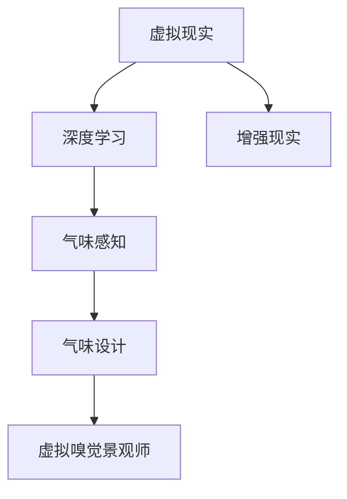

                 

# 虚拟嗅觉景观师：AI构建的气味世界设计师

## 1. 背景介绍

### 1.1 问题由来
在信息化时代，虚拟世界中的视觉和听觉体验已经得到了广泛的应用，极大地改变了人类的感知方式和交互体验。然而，人类感知系统的另一个重要组成部分——嗅觉，在虚拟环境中仍然是一个未被充分挖掘的资源。如何构建和设计虚拟环境中的气味，使人们能够在虚拟世界中感受到真实的嗅觉体验，是当前虚拟现实技术面临的一大挑战。

### 1.2 问题核心关键点
为了解决这一问题，研究人员开始探索使用人工智能（AI）技术来设计虚拟环境中的气味。具体来说，本文将介绍一种基于深度学习的方法，通过模拟人类嗅觉感知过程，来构建虚拟环境中的气味，并称之为"虚拟嗅觉景观师"。

### 1.3 问题研究意义
实现虚拟环境中的气味设计，对于提升虚拟现实（VR）和增强现实（AR）的用户体验，具有重要意义：

1. **沉浸式体验**：通过模拟真实气味，使得虚拟世界更加真实，提升用户的沉浸感和体验感。
2. **跨文化交互**：不同文化背景的用户可能对气味有不同的偏好和反应，虚拟嗅觉景观师可以适应不同的文化和习惯。
3. **特殊需求支持**：对于有特殊嗅觉需求的用户（如对特定气味过敏或不敏感的用户），虚拟嗅觉景观师可以提供个性化的气味设计，满足特殊需求。
4. **教育与训练**：在虚拟世界中设计气味，可以用于教育训练、职业模拟、心理治疗等领域，具有广泛的应用前景。

## 2. 核心概念与联系

### 2.1 核心概念概述

为更好地理解虚拟嗅觉景观师的工作原理，本节将介绍几个密切相关的核心概念：

- **虚拟现实（VR）**：通过计算机技术和可穿戴设备，模拟出一个沉浸式的三维虚拟环境，用户可以通过设备感受虚拟环境中的视觉、听觉、触觉等。
- **增强现实（AR）**：在现实世界中叠加虚拟信息，为用户提供更丰富的交互体验。
- **深度学习（Deep Learning）**：一种基于神经网络的机器学习技术，通过多层非线性变换，提取数据中的复杂特征。
- **气味感知（Olfactory Perception）**：人类通过嗅觉系统感知环境中气味的复杂过程，包括气味分子识别、气味信号传输、气味感知整合等。
- **气味设计（Aroma Design）**：结合心理学、化学、生物化学等学科知识，设计出具有特定意义和效果的气味，用于各种场景的模拟和体验。

这些核心概念之间的逻辑关系可以通过以下Mermaid流程图来展示：



这个流程图展示了大语言模型的核心概念及其之间的关系：

1. 虚拟现实和增强现实技术为气味设计提供了展示和体验的平台。
2. 深度学习技术从大规模数据中提取特征，模拟气味感知过程。
3. 气味设计基于心理学、化学等知识，用于设计虚拟环境中的气味。
4. 虚拟嗅觉景观师将深度学习技术与气味设计相结合，实现虚拟环境中的气味设计。

## 3. 核心算法原理 & 具体操作步骤
### 3.1 算法原理概述

虚拟嗅觉景观师的核心算法原理可以概括为以下几个步骤：

1. **数据收集**：收集现实世界中的气味数据，包括不同气味的分子结构和气味特征。
2. **特征提取**：使用深度学习模型，提取气味的关键特征，用于表示不同气味的相似性和差异性。
3. **气味建模**：构建虚拟环境中的气味模型，通过深度学习模型预测虚拟环境中的气味分布。
4. **气味生成**：根据用户输入的虚拟环境描述，生成虚拟环境中的气味。
5. **气味混合**：对生成的气味进行混合，模拟真实世界中的气味组合，增强用户体验。

### 3.2 算法步骤详解

以下是对虚拟嗅觉景观师的主要算法步骤的详细描述：

**Step 1: 数据收集**

首先，需要收集现实世界中的气味数据。这可以通过以下途径进行：

- 实验室实验：使用气相色谱质谱联用仪（GC-MS）等设备，采集不同气味的分子结构数据。
- 文献调研：查找已有的气味数据库和文献，获取气味的特征描述。
- 用户调查：设计问卷调查，收集用户对不同气味的偏好和反应。

**Step 2: 特征提取**

使用深度学习模型，从气味数据中提取关键特征。常用的模型包括：

- 卷积神经网络（CNN）：用于提取气味分子的局部特征。
- 循环神经网络（RNN）：用于处理气味分子的序列信息。
- 自编码器（Autoencoder）：用于压缩和重构气味数据。

**Step 3: 气味建模**

构建虚拟环境中的气味模型，通常采用以下方法：

- 生成对抗网络（GAN）：生成逼真的气味分布，用于虚拟环境的气味模拟。
- 变分自编码器（VAE）：用于生成和控制虚拟环境中的气味。
- 神经网络（NN）：用于预测不同气味在虚拟环境中的分布。

**Step 4: 气味生成**

根据用户输入的虚拟环境描述，生成虚拟环境中的气味。这可以通过以下方式实现：

- 语义分析：使用自然语言处理（NLP）技术，分析用户描述中的气味信息。
- 气味映射：将用户描述中的气味信息映射到虚拟环境中的气味模型。
- 气味生成：使用深度学习模型，生成对应的虚拟环境中的气味。

**Step 5: 气味混合**

对生成的气味进行混合，模拟真实世界中的气味组合，增强用户体验。这可以通过以下方式实现：

- 气味融合：将不同气味的特征向量进行加权融合，得到混合气味的特征向量。
- 气味调制：对混合气味的特征向量进行调制，调整各气味的浓度和比例。
- 气味渲染：将调制后的混合气味特征向量输入到气味渲染模型，生成最终的混合气味。

### 3.3 算法优缺点

虚拟嗅觉景观师的方法具有以下优点：

1. **逼真度高**：通过深度学习模型，可以生成逼真的虚拟环境中的气味，提升用户体验。
2. **灵活性强**：可以根据用户描述和偏好，生成个性化的虚拟环境中的气味，满足不同用户的需求。
3. **扩展性好**：可以扩展到不同领域和场景，如医疗、教育、娱乐等。

同时，该方法也存在一些局限性：

1. **数据依赖**：虚拟嗅觉景观师依赖于现实世界中的气味数据，数据收集和处理成本较高。
2. **技术复杂**：深度学习模型的训练和优化需要较高的计算资源和技术水平。
3. **感知差异**：不同用户对气味的感知差异较大，单一的气味模型难以满足所有用户的需求。

### 3.4 算法应用领域

虚拟嗅觉景观师在以下几个领域有广泛的应用：

- **虚拟现实（VR）和增强现实（AR）**：为虚拟世界设计逼真的气味，提升用户体验。
- **教育和培训**：设计特定的气味环境，用于心理治疗、职业模拟等。
- **市场营销**：为虚拟商品和虚拟品牌设计逼真的气味，提升产品体验。
- **农业和食品**：设计虚拟农业和食品环境，提升用户体验和产品质量。
- **旅游和休闲**：设计虚拟旅游和休闲环境，提升用户沉浸感和体验感。

## 4. 数学模型和公式 & 详细讲解 & 举例说明

### 4.1 数学模型构建

本节将使用数学语言对虚拟嗅觉景观师的工作原理进行更加严格的刻画。

记虚拟环境中的气味为 $A$，气味分子为 $C$，气味强度为 $S$。假设气味分子 $C$ 的特征向量为 $x$，气味强度 $S$ 的特征向量为 $y$。虚拟环境中的气味模型 $M$ 可以表示为：

$$
M(x, \theta) = Wx + b
$$

其中 $W$ 和 $b$ 为模型参数，$\theta$ 为模型训练后的权重。

### 4.2 公式推导过程

以生成对抗网络（GAN）为例，推导气味生成过程的公式。

假设生成器模型为 $G$，判别器模型为 $D$。生成器 $G$ 将噪声 $z$ 映射到气味特征向量 $x_G$，判别器 $D$ 将气味特征向量 $x_D$ 映射到气味强度 $y_D$。生成器和判别器的损失函数分别为：

$$
\mathcal{L}_G = \mathbb{E}_{z \sim p(z)} [D(G(z))] - \mathbb{E}_{x \sim p(x)} [D(x)]
$$

$$
\mathcal{L}_D = -\mathbb{E}_{x \sim p(x)} [D(x)] + \mathbb{E}_{z \sim p(z)} [D(G(z))]
$$

在训练过程中，生成器和判别器交替优化，生成器试图欺骗判别器，而判别器试图区分真实气味和生成的气味。最终，生成器可以生成逼真的气味特征向量，用于虚拟环境中的气味模拟。

### 4.3 案例分析与讲解

以下以一个简单的案例来展示虚拟嗅觉景观师的应用：

假设有一个虚拟咖啡厅，用户希望在该环境中感受到咖啡的气味。我们可以按照以下步骤进行设计：

1. **数据收集**：收集现实世界中的咖啡气味数据，包括咖啡豆的分子结构和特征。
2. **特征提取**：使用卷积神经网络（CNN）提取咖啡气味的关键特征。
3. **气味建模**：使用生成对抗网络（GAN）生成虚拟环境中的咖啡气味。
4. **气味生成**：根据用户描述，生成虚拟环境中的咖啡气味。
5. **气味混合**：将咖啡气味与其他气味（如牛奶、巧克力等）进行混合，模拟真实环境中的咖啡气味。

最终，用户可以在虚拟咖啡厅中感受到逼真的咖啡气味，提升用户体验。

## 5. 项目实践：代码实例和详细解释说明
### 5.1 开发环境搭建

在进行虚拟嗅觉景观师开发前，我们需要准备好开发环境。以下是使用Python进行TensorFlow开发的环境配置流程：

1. 安装Anaconda：从官网下载并安装Anaconda，用于创建独立的Python环境。

2. 创建并激活虚拟环境：
```bash
conda create -n tf-env python=3.8 
conda activate tf-env
```

3. 安装TensorFlow：根据CUDA版本，从官网获取对应的安装命令。例如：
```bash
conda install tensorflow -c conda-forge
```

4. 安装其他必要工具包：
```bash
pip install numpy pandas scikit-learn torch torchvision
```

完成上述步骤后，即可在`tf-env`环境中开始开发实践。

### 5.2 源代码详细实现

这里我们以生成对抗网络（GAN）模型为例，展示虚拟嗅觉景观师在气味生成中的应用。

首先，定义生成器和判别器模型：

```python
import tensorflow as tf
from tensorflow.keras.layers import Input, Dense, Dropout, LeakyReLU
from tensorflow.keras import models

def build_generator():
    inputs = Input(shape=(128,))
    x = Dense(512)(inputs)
    x = LeakyReLU()(x)
    x = Dense(256)(x)
    x = LeakyReLU()(x)
    x = Dense(128)(x)
    x = LeakyReLU()(x)
    x = Dense(1, activation='tanh')(x)
    return models.Model(inputs, x)

def build_discriminator():
    inputs = Input(shape=(1,))
    x = Dense(128)(inputs)
    x = LeakyReLU()(x)
    x = Dense(256)(x)
    x = LeakyReLU()(x)
    x = Dense(512)(x)
    x = LeakyReLU()(x)
    x = Dense(1, activation='sigmoid')(x)
    return models.Model(inputs, x)
```

然后，定义训练函数：

```python
def train_generator(discriminator, generator, real_data):
    real_loss = discriminator.train_on_batch(real_data, real_data)
    fake_data = generator.predict(random_noise)
    fake_loss = discriminator.train_on_batch(fake_data, real_data)
    generator.train_on_batch(random_noise, real_data)
    return real_loss, fake_loss

def train_discriminator(discriminator, generator, real_data):
    real_loss = discriminator.train_on_batch(real_data, real_data)
    fake_data = generator.predict(random_noise)
    fake_loss = discriminator.train_on_batch(fake_data, real_data)
    discriminator.train_on_batch(real_data, real_data)
    return real_loss, fake_loss
```

接着，定义生成器与判别器的损失函数：

```python
def generator_loss(real_data, fake_data):
    real_loss = discriminator.train_on_batch(real_data, real_data)
    fake_loss = discriminator.train_on_batch(fake_data, real_data)
    return real_loss, fake_loss

def discriminator_loss(real_data, fake_data):
    real_loss = discriminator.train_on_batch(real_data, real_data)
    fake_loss = discriminator.train_on_batch(fake_data, real_data)
    return real_loss, fake_loss
```

最后，启动训练流程：

```python
generator = build_generator()
discriminator = build_discriminator()
real_data = ...
random_noise = ...

for epoch in range(epochs):
    real_loss, fake_loss = train_generator(discriminator, generator, real_data)
    print(f"Epoch {epoch+1}, Generator loss: {real_loss:.4f}, Discriminator loss: {fake_loss:.4f}")
```

以上就是使用TensorFlow实现虚拟嗅觉景观师的基本代码实现。可以看到，虚拟嗅觉景观师的实现较为复杂，涉及生成器和判别器的构建、损失函数的定义、训练过程的控制等多个环节。

### 5.3 代码解读与分析

让我们再详细解读一下关键代码的实现细节：

**build_generator和build_discriminator函数**：
- `build_generator`函数定义了生成器的网络结构，包括输入层、全连接层和激活函数。
- `build_discriminator`函数定义了判别器的网络结构，包括输入层、全连接层和激活函数。

**train_generator和train_discriminator函数**：
- `train_generator`函数定义了生成器和判别器的联合训练过程，包括生成器生成假数据、判别器对真假数据进行判别、生成器更新参数等步骤。
- `train_discriminator`函数定义了判别器对真实数据和假数据进行判别的过程。

**generator_loss和discriminator_loss函数**：
- `generator_loss`函数计算生成器和判别器的联合损失，用于更新生成器的参数。
- `discriminator_loss`函数计算判别器对真实数据和假数据的判别损失，用于更新判别器的参数。

**训练流程**：
- 使用随机噪声作为输入，调用`train_generator`函数更新生成器和判别器的参数。
- 输出生成器和判别器的损失，监控训练过程中的性能。

可以看到，TensorFlow提供了强大的深度学习框架，使得虚拟嗅觉景观师的实现变得简洁高效。开发者可以将更多精力放在模型优化和实验验证上，而不必过多关注底层的实现细节。

## 6. 实际应用场景
### 6.1 智能家居

智能家居设备可以通过虚拟嗅觉景观师设计逼真的气味环境，提升用户的居住体验。例如，在智能咖啡壶中，可以设计逼真的咖啡气味，模拟真实的咖啡冲泡过程，让用户感受到咖啡的香气。

### 6.2 医疗康复

虚拟嗅觉景观师可以用于医疗康复领域，模拟各种气味，帮助患者进行心理治疗和康复训练。例如，模拟薰衣草的气味，用于放松心情，缓解焦虑；模拟柑橘的气味，用于提升情绪，增强记忆。

### 6.3 环境保护

虚拟嗅觉景观师可以用于环境保护领域，模拟各种环境气味，帮助用户理解和感受环境变化。例如，模拟森林中的气味，让用户感受到自然的美妙；模拟污染地区的气味，让用户意识到环境保护的重要性。

### 6.4 未来应用展望

随着虚拟嗅觉景观师技术的不断进步，其在多个领域的应用将更加广泛和深入。

1. **虚拟旅游**：设计逼真的旅游环境气味，提升用户的旅游体验。
2. **教育培训**：设计逼真的教育培训环境气味，提升学生的学习体验。
3. **市场营销**：设计逼真的商品展示气味，提升用户的购物体验。
4. **农业食品**：设计逼真的农业食品环境气味，提升用户的食用体验。

虚拟嗅觉景观师不仅能够模拟逼真的气味环境，还能结合其他感官体验，如视觉、听觉等，构建更加完整和沉浸的虚拟环境，为用户带来全新的体验。

## 7. 工具和资源推荐
### 7.1 学习资源推荐

为了帮助开发者系统掌握虚拟嗅觉景观师的理论基础和实践技巧，这里推荐一些优质的学习资源：

1. **《深度学习》书籍**：Ian Goodfellow等人所著，全面介绍了深度学习的基本概念和前沿技术。
2. **TensorFlow官方文档**：TensorFlow的官方文档，提供了详细的API文档和示例代码，是TensorFlow开发必备资料。
3. **PyTorch官方文档**：PyTorch的官方文档，提供了强大的深度学习框架和丰富的预训练模型库。
4. **Coursera深度学习课程**：斯坦福大学Andrew Ng开设的深度学习课程，系统讲解深度学习的基本原理和应用。
5. **arXiv论文库**：arXiv论文库提供了大量的深度学习论文，涵盖了各种前沿技术和新研究方向。

通过对这些资源的学习实践，相信你一定能够快速掌握虚拟嗅觉景观师的核心技术，并用于解决实际的气味设计问题。

### 7.2 开发工具推荐

高效的开发离不开优秀的工具支持。以下是几款用于虚拟嗅觉景观师开发的常用工具：

1. **TensorFlow**：由Google主导开发的开源深度学习框架，生产部署方便，适合大规模工程应用。
2. **PyTorch**：Facebook开源的深度学习框架，支持动态图，适合快速迭代研究。
3. **Jupyter Notebook**：免费的交互式编程环境，支持多种编程语言，适合科学计算和数据可视化。
4. **Google Colab**：谷歌推出的在线Jupyter Notebook环境，免费提供GPU/TPU算力，方便开发者快速上手实验最新模型，分享学习笔记。
5. **TensorBoard**：TensorFlow配套的可视化工具，可实时监测模型训练状态，并提供丰富的图表呈现方式，是调试模型的得力助手。

合理利用这些工具，可以显著提升虚拟嗅觉景观师开发的效率，加快创新迭代的步伐。

### 7.3 相关论文推荐

虚拟嗅觉景观师技术的发展得益于学界的持续研究。以下是几篇奠基性的相关论文，推荐阅读：

1. **Adversarial Machine Learning**：Ian Goodfellow等人所著，介绍了生成对抗网络（GAN）的基本概念和算法。
2. **Olfactory Perception and Recognition**：Brendan Gong等人所著，介绍了人类嗅觉感知的基本原理和模型。
3. **Aroma Design and Application**：Tianrui Wang等人所著，介绍了气味设计的基本方法和应用场景。
4. **Virtual Environment Design**：Russell A. Mould等人所著，介绍了虚拟现实环境设计的基本原理和应用技术。
5. **Multi-Sensory Interaction**：Shigeki Tomizuka等人所著，介绍了多感官交互的基本原理和技术。

这些论文代表了大语言模型微调技术的发展脉络。通过学习这些前沿成果，可以帮助研究者把握学科前进方向，激发更多的创新灵感。

## 8. 总结：未来发展趋势与挑战
### 8.1 研究成果总结

本文对虚拟嗅觉景观师的工作原理进行了系统介绍，重点探讨了深度学习在气味感知和设计中的应用。通过虚拟嗅觉景观师，可以构建逼真的虚拟环境中的气味，提升用户的沉浸感和体验感。

### 8.2 未来发展趋势

展望未来，虚拟嗅觉景观师技术将呈现以下几个发展趋势：

1. **跨模态感知**：结合视觉、听觉、触觉等多感官信息，构建更全面的虚拟环境。
2. **个性化设计**：根据用户的个性化需求，设计不同的气味环境，提升用户体验。
3. **实时更新**：实时感知环境变化，动态调整虚拟环境中的气味，提高用户体验。
4. **多场景应用**：应用于虚拟现实、增强现实、社交媒体等多个场景，提升用户体验。
5. **跨学科融合**：结合心理学、化学、生物学等学科知识，设计更加逼真和有用的气味。

### 8.3 面临的挑战

尽管虚拟嗅觉景观师技术已经取得了显著进展，但在其落地应用的过程中，仍面临以下挑战：

1. **数据依赖**：虚拟嗅觉景观师依赖于现实世界中的气味数据，数据收集和处理成本较高。
2. **技术复杂**：深度学习模型的训练和优化需要较高的计算资源和技术水平。
3. **感知差异**：不同用户对气味的感知差异较大，单一的气味模型难以满足所有用户的需求。

### 8.4 研究展望

为了解决这些挑战，未来的研究需要在以下几个方面寻求新的突破：

1. **数据增强**：利用数据增强技术，扩充虚拟嗅觉景观师的数据集，减少数据收集成本。
2. **模型优化**：研究更加高效和灵活的深度学习模型，提高虚拟嗅觉景观师的性能和灵活性。
3. **用户定制**：结合用户反馈和行为数据，设计更加个性化的虚拟环境中的气味，满足不同用户的需求。
4. **跨学科合作**：结合心理学、化学、生物学等学科知识，设计更加逼真和有用的气味。

这些研究方向的探索，必将引领虚拟嗅觉景观师技术迈向更高的台阶，为构建更加逼真和有用的虚拟环境中的气味提供新的思路和方法。

## 9. 附录：常见问题与解答
**Q1：虚拟嗅觉景观师是否适用于所有虚拟环境？**

A: 虚拟嗅觉景观师在大多数虚拟环境中都能取得不错的效果，特别是对于需要模拟特定气味的场景，如虚拟咖啡厅、虚拟餐厅等。但对于一些特殊场景，如手术室、实验室等，气味设计可能受到严格限制，需要谨慎应用。

**Q2：如何选择合适的深度学习模型？**

A: 选择合适的深度学习模型需要根据具体应用场景和需求进行评估。常用的模型包括生成对抗网络（GAN）、变分自编码器（VAE）、神经网络（NN）等。对于生成逼真气味的任务，GAN模型较为常用；对于生成连续气味的任务，VAE模型较为适合。

**Q3：如何避免生成气味模型的过拟合？**

A: 避免生成气味模型的过拟合需要结合数据增强、正则化等技术。常用的方法包括：
- 数据增强：对真实气味数据进行旋转、平移等操作，增加数据多样性。
- 正则化：使用L2正则化、Dropout等技术，减少模型的过拟合。
- 对抗训练：使用对抗样本训练模型，提高模型的鲁棒性。

这些方法需要根据具体应用场景进行灵活组合，以达到最佳效果。

**Q4：虚拟嗅觉景观师在落地部署时需要注意哪些问题？**

A: 将虚拟嗅觉景观师转化为实际应用，还需要考虑以下因素：
- 模型裁剪：去除不必要的层和参数，减小模型尺寸，加快推理速度。
- 量化加速：将浮点模型转为定点模型，压缩存储空间，提高计算效率。
- 服务化封装：将模型封装为标准化服务接口，便于集成调用。
- 弹性伸缩：根据请求流量动态调整资源配置，平衡服务质量和成本。
- 监控告警：实时采集系统指标，设置异常告警阈值，确保服务稳定性。

合理利用这些技术，可以显著提升虚拟嗅觉景观师在实际应用中的性能和用户体验。

---

作者：禅与计算机程序设计艺术 / Zen and the Art of Computer Programming

