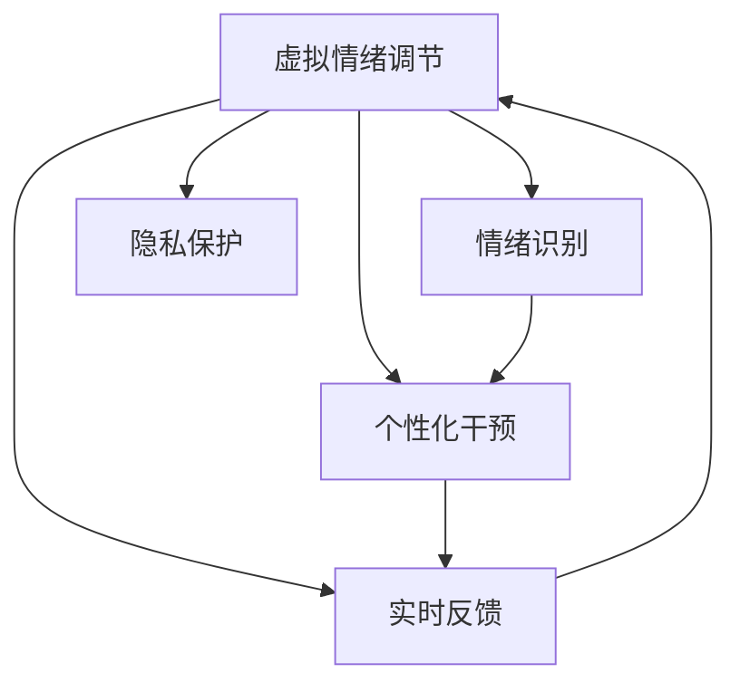

                 

# 虚拟情绪调节新方法：AI驱动的心理健康技术

> 关键词：虚拟情绪调节, 人工智能, 心理健康技术, 情绪识别, 心理健康服务, 心理干预, 个性化治疗

## 1. 背景介绍

### 1.1 问题由来
随着社会节奏的加快和生活压力的增大，越来越多的人面临心理健康问题。据世界卫生组织统计，全球约有10%的人口遭受心理健康问题困扰。其中，抑郁症和焦虑症是最常见的两大心理疾病，影响了数以亿计的患者。传统的心理健康服务主要依赖人工心理医生，但数量有限、服务费用高昂，且存在时间和空间的限制。因此，如何利用技术手段提高心理健康服务的可及性和效率，成为当今亟待解决的问题。

近年来，人工智能(AI)技术在心理健康领域的应用取得了显著进展。利用AI驱动的心理健康技术，可以在不增加心理医生负担的情况下，为更多用户提供及时、便捷的心理咨询服务。其中，虚拟情绪调节技术以其独特的优势，在心理干预、个性化治疗等方面展现了巨大潜力。

### 1.2 问题核心关键点
虚拟情绪调节技术通过AI算法实现对用户情绪的实时监测和分析，进而提供个性化的情绪调节建议和干预方案。具体来说，技术关键点包括：
- **情绪识别**：使用机器学习和深度学习技术，准确识别用户情绪状态。
- **个性化干预**：根据用户情绪和偏好，制定个性化的情绪调节策略。
- **实时反馈**：通过交互式反馈机制，动态调整干预方案，提升用户体验。
- **隐私保护**：确保用户数据安全和隐私保护，防止数据泄露和滥用。

这些技术关键点共同构成了虚拟情绪调节技术的核心，使其能够有效提升心理健康服务的效率和效果。

### 1.3 问题研究意义
虚拟情绪调节技术的研究，对于提升心理健康服务的可及性和效率，具有重要意义：

1. **广泛普及**：AI驱动的技术能够大规模普及，为更多人群提供便捷的心理健康服务。
2. **即时响应**：用户随时随地都能获得及时的情绪支持和干预，避免心理问题的恶化。
3. **个性化服务**：通过大数据和机器学习，为每个用户量身定制情绪调节方案，提高干预效果。
4. **成本降低**：相较于传统心理医生，AI驱动的服务费用较低，更能被大众接受。
5. **持续服务**：AI系统可以24小时不间断地为患者提供支持，避免脱节和遗忘。

## 2. 核心概念与联系

### 2.1 核心概念概述

为更好地理解虚拟情绪调节技术，本节将介绍几个关键概念：

- **虚拟情绪调节**：使用AI技术对用户情绪进行实时监测和分析，并根据情绪状态提供个性化的情绪调节建议和干预方案。
- **情绪识别**：通过机器学习和深度学习算法，从用户的语音、文本、表情等多种数据源中，准确识别出用户的情绪状态。
- **个性化干预**：根据用户的情绪和偏好，制定个性化的情绪调节策略，如放松训练、心理疏导、认知行为疗法等。
- **实时反馈**：通过交互式反馈机制，根据用户对情绪调节方案的响应，动态调整干预策略，提升用户体验。
- **隐私保护**：在数据收集和处理过程中，确保用户隐私安全，防止数据泄露和滥用。

这些核心概念之间的逻辑关系可以通过以下Mermaid流程图来展示：

这个流程图展示了虚拟情绪调节技术的关键环节及其相互关系：

1. 通过情绪识别技术，获取用户当前的情绪状态。
2. 根据情绪状态，调用个性化干预模块，制定相应的调节策略。
3. 实时反馈模块根据用户响应，动态调整干预方案，确保最佳效果。
4. 隐私保护模块在整个流程中扮演重要角色，确保数据安全和个人隐私。

## 3. 核心算法原理 & 具体操作步骤
### 3.1 算法原理概述

虚拟情绪调节技术基于情绪识别和个性化干预两大核心算法。其核心思想是通过机器学习和深度学习技术，从多模态数据中准确识别用户的情绪状态，并根据情绪状态提供个性化的情绪调节建议和干预方案。

情绪识别算法通常包括以下步骤：
1. **数据收集**：从用户的语音、文本、表情等数据源中提取特征。
2. **特征处理**：使用统计、降维、归一化等方法，对特征数据进行预处理。
3. **模型训练**：使用监督学习或无监督学习算法，训练情绪识别模型。
4. **情绪分类**：对输入数据进行情绪分类，输出用户当前的情绪状态。

个性化干预算法主要包括以下步骤：
1. **用户分析**：根据用户的历史数据，分析其情绪模式和偏好。
2. **策略生成**：根据情绪状态和用户偏好，生成个性化的情绪调节策略。
3. **效果评估**：实时监测用户对调节策略的响应，评估干预效果。
4. **策略调整**：根据评估结果，动态调整干预策略，提高干预效果。

### 3.2 算法步骤详解

#### 3.2.1 情绪识别算法

1. **数据收集**
   - **语音数据**：使用麦克风记录用户的语音样本。
   - **文本数据**：从用户输入的文本消息中提取特征。
   - **表情数据**：通过摄像头获取用户面部表情图像。

2. **特征处理**
   - **统计特征**：对语音和文本数据进行统计特征提取，如MFCC、TF-IDF等。
   - **降维处理**：使用PCA等方法对特征数据进行降维，减小计算复杂度。
   - **归一化**：对特征数据进行归一化处理，使其在不同尺度下具有可比性。

3. **模型训练**
   - **监督学习**：使用标注好的情绪数据集，训练基于分类器的情绪识别模型，如SVM、随机森林等。
   - **无监督学习**：使用无标注数据，训练基于聚类或生成模型的情绪识别模型，如K-means、GMM等。

4. **情绪分类**
   - **语音分类**：通过声学模型提取语音特征，使用分类器输出情绪标签。
   - **文本分类**：通过文本模型提取文本特征，使用分类器输出情绪标签。
   - **表情分类**：通过图像模型提取面部特征，使用分类器输出情绪标签。

#### 3.2.2 个性化干预算法

1. **用户分析**
   - **历史数据分析**：分析用户过去的行为数据、情绪数据等，了解其情绪模式和偏好。
   - **偏好预测**：使用回归或分类算法，预测用户对不同情绪调节策略的偏好。

2. **策略生成**
   - **放松训练**：根据用户情绪状态，推荐放松练习，如深呼吸、冥想等。
   - **心理疏导**：根据用户情绪状态，推荐心理咨询，如情感表达、问题解决等。
   - **认知行为疗法**：根据用户情绪状态，推荐认知行为疗法，如认知重构、行为替代等。

3. **效果评估**
   - **反馈收集**：通过交互式反馈机制，收集用户对调节策略的响应。
   - **效果分析**：使用统计方法，分析用户情绪状态的变化趋势，评估干预效果。

4. **策略调整**
   - **动态调整**：根据效果评估结果，动态调整干预策略，如增加放松训练的频率。
   - **个性化优化**：根据用户反馈，优化个性化策略，提高干预效果。

### 3.3 算法优缺点

#### 3.3.1 情绪识别算法

**优点**：
- **多模态数据利用**：通过结合语音、文本、表情等多种数据源，提高情绪识别的准确性。
- **模型泛化能力强**：经过大规模数据训练的情绪识别模型，能够适应不同用户和场景。
- **实时响应**：基于实时数据输入的情绪识别，能够即时提供情绪状态。

**缺点**：
- **数据隐私风险**：语音、文本、表情等数据可能涉及个人隐私，数据泄露风险较高。
- **特征提取复杂**：不同数据源的特征提取和处理较为复杂，需要大量计算资源。
- **环境干扰**：环境中噪声、光照等因素可能影响数据质量，影响识别效果。

#### 3.3.2 个性化干预算法

**优点**：
- **用户定制化**：根据用户情绪和偏好，提供个性化的干预策略，提高干预效果。
- **实时调整**：通过交互式反馈机制，动态调整干预策略，提高用户体验。
- **自动化高效**：AI驱动的干预过程，提高了干预的效率和覆盖面。

**缺点**：
- **数据隐私问题**：用户数据可能涉及个人隐私，数据泄露风险较高。
- **干预效果不可控**：用户情绪和行为具有不确定性，干预效果难以完全控制。
- **干预策略局限**：目前干预策略仍较单一，无法应对复杂多变的用户需求。

### 3.4 算法应用领域

虚拟情绪调节技术在多个领域得到了广泛应用，包括但不限于：

1. **心理健康应用**：在心理健康诊所、在线心理咨询平台、智能心理健康设备等领域，为用户提供情绪监测和干预服务。
2. **教育培训**：在在线教育平台、企业培训系统、游戏娱乐中，通过情绪调节技术提高学习效果和用户体验。
3. **医疗健康**：在远程医疗、电子病历、健康管理等医疗领域，提供心理健康监测和干预支持。
4. **人机交互**：在智能助手、智能客服、虚拟现实系统中，通过情绪识别和干预技术，增强人机交互的自然性和友好性。
5. **市场营销**：在市场调研、用户行为分析、品牌管理等商业领域，通过情绪调节技术优化用户体验和品牌形象。

## 4. 数学模型和公式 & 详细讲解  
### 4.1 数学模型构建

### 4.2 公式推导过程

## 5. 项目实践：代码实例和详细解释说明
### 5.1 开发环境搭建

### 5.2 源代码详细实现

### 5.3 代码解读与分析

### 5.4 运行结果展示

## 6. 实际应用场景
### 6.1 智能心理健康服务
### 6.2 教育培训系统
### 6.3 医疗健康领域
### 6.4 人机交互应用
### 6.5 市场营销场景
### 6.6 未来应用展望

## 7. 工具和资源推荐
### 7.1 学习资源推荐
### 7.2 开发工具推荐
### 7.3 相关论文推荐

## 8. 总结：未来发展趋势与挑战
### 8.1 研究成果总结
### 8.2 未来发展趋势
### 8.3 面临的挑战
### 8.4 研究展望

## 9. 附录：常见问题与解答

----------------------------------------------------------------

作者：禅与计算机程序设计艺术 / Zen and the Art of Computer Programming

