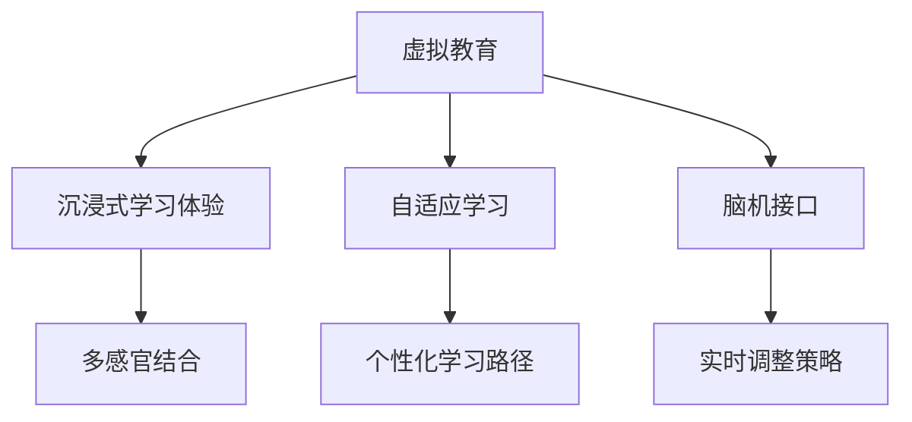

                 

# 虚拟教育：全球脑时代下的学习 新方式

> 关键词：虚拟教育, 脑科学, 教育技术, 学习方式, 在线教育, 教育公平, 自适应学习, 个性化教学, 脑时代, 脑机接口

## 1. 背景介绍

### 1.1 问题由来
近年来，全球范围内教育技术的迅猛发展，特别是在虚拟教育领域，各种在线课程、虚拟教室和交互式学习平台层出不穷。尤其是新冠疫情的全球爆发，加速了教育数字化转型的进程，使虚拟教育成为现实。在脑科学研究的深入推动下，虚拟教育不仅在形式上更加生动，而且在内容上也更加符合人类认知发展的规律。

这一转变带来的不仅仅是一次技术的飞跃，更是一次教育理念的革命。虚拟教育将教育从传统的以教师为主导的课堂教学模式，转变为以学生为主导的自适应、个性化学习模式，使学习变得更加灵活、高效、个性化。

### 1.2 问题核心关键点
虚拟教育的核心理念是通过虚拟技术构建沉浸式学习环境，使学习过程更加贴近大脑认知和记忆规律，从而提高学习效果。这一过程包括：
1. **沉浸式学习体验**：通过虚拟现实(VR)、增强现实(AR)、混合现实(MR)等技术，打造多感官结合的学习场景，使学习者身临其境。
2. **个性化学习路径**：利用大数据和人工智能技术，根据学习者的认知水平和兴趣爱好，生成个性化的学习路径。
3. **动态调整内容**：基于学习者的实时反馈和表现，动态调整教学内容和难度，实现自适应学习。
4. **脑机接口辅助**：借助脑机接口技术，监测和分析学习者的认知状态和情感反应，实时调整教学策略。

这些关键点构成了虚拟教育的基本框架，使其在提升教育效果和促进教育公平方面展现了巨大潜力。

### 1.3 问题研究意义
虚拟教育的研究意义在于：
1. **提高教育效果**：通过沉浸式、个性化的学习方式，使学习者更加专注和投入，提高学习效率和效果。
2. **促进教育公平**：虚拟教育打破了地理和时间的限制，使优质教育资源能够更广泛地覆盖，实现教育资源的均衡分配。
3. **推动教育创新**：虚拟教育将传统的以教师为中心的教学模式转变为以学生为中心的学习模式，促进教育理念和教学方法的创新。
4. **适应脑时代**：随着脑科学研究的发展，我们对于认知和学习规律的了解不断深入，虚拟教育正是基于这些认知规律设计和实现的。

## 2. 核心概念与联系

### 2.1 核心概念概述

为更好地理解虚拟教育的原理和应用，我们首先介绍几个关键概念：

- **虚拟教育**：利用虚拟现实、增强现实、混合现实等技术，构建沉浸式学习环境，使学习过程更加生动、互动、个性化。
- **沉浸式学习体验**：通过多感官结合的虚拟技术，使学习者沉浸于虚拟环境中，提升学习效果。
- **自适应学习**：根据学习者的实时表现和反馈，动态调整教学内容、难度和方式，实现个性化学习路径。
- **脑机接口(Brain-Computer Interface, BCI)**：通过监测大脑信号和认知状态，实时调整教学策略，辅助学习过程。

这些概念之间的联系可以通过以下Mermaid流程图来展示：



这个流程图展示虚拟教育的核心概念及其之间的关系：

1. 虚拟教育通过虚拟技术提供沉浸式学习体验。
2. 沉浸式学习体验基于多感官结合，提升学习效果。
3. 自适应学习根据学习者的表现和反馈动态调整内容，实现个性化。
4. 脑机接口辅助监测和分析学习者的认知状态，实时调整教学策略。

## 3. 核心算法原理 & 具体操作步骤

### 3.1 算法原理概述

虚拟教育的实现，依赖于一系列复杂的算法和技术。其核心原理可以概括为以下几个步骤：

1. **构建虚拟环境**：利用虚拟现实、增强现实、混合现实等技术，创建沉浸式学习场景。
2. **个性化学习路径设计**：基于学习者的认知水平和兴趣爱好，设计个性化的学习路径。
3. **实时反馈与调整**：根据学习者的实时反馈和表现，动态调整教学内容和难度。
4. **脑机接口辅助**：通过监测大脑信号和认知状态，实时调整教学策略。

### 3.2 算法步骤详解

#### 3.2.1 构建虚拟环境
构建虚拟环境主要涉及以下几个关键技术：

- **虚拟现实(VR)**：使用头戴式显示设备(HMD)和追踪设备，将学习者置身于三维空间中，提供全方位的沉浸式体验。
- **增强现实(AR)**：在真实环境中叠加虚拟信息，增强现实感，提供互动式学习体验。
- **混合现实(MR)**：结合VR和AR技术，提供跨越真实世界和虚拟世界的混合现实环境。

构建虚拟环境的具体步骤如下：

1. **环境设计**：根据学习内容设计虚拟场景，如历史事件重现、生物实验模拟等。
2. **设备选择与安装**：选择适合的VR/AR/MR设备，并进行安装和调试。
3. **内容创建与整合**：将学习内容以虚拟形式集成到虚拟环境中，如3D模型、虚拟角色、互动元素等。

#### 3.2.2 个性化学习路径设计
个性化学习路径设计的关键在于大数据和人工智能技术的应用：

1. **学习者分析**：通过学习管理系统(LMS)收集学习者的学习行为、成绩和偏好数据。
2. **认知评估**：使用认知评估工具，如测验、游戏、问卷等，评估学习者的认知水平和知识基础。
3. **兴趣识别**：利用自然语言处理(NLP)和情感分析等技术，识别学习者的兴趣爱好。
4. **路径生成**：根据上述数据，使用机器学习算法生成个性化的学习路径，推荐学习内容和难度。

#### 3.2.3 实时反馈与调整
实时反馈与调整是自适应学习的核心，依赖于以下几个步骤：

1. **实时监测**：利用传感器和跟踪设备，实时监测学习者的生理和行为数据，如心率、眼动、点击等。
2. **数据处理**：将收集到的数据传输到中央服务器，进行实时分析与处理。
3. **策略调整**：根据学习者的表现和反馈，动态调整教学内容、难度和方式，如改变讲解速度、增加练习题、调整教学策略等。

#### 3.2.4 脑机接口辅助
脑机接口技术在虚拟教育中的应用主要集中在以下几个方面：

1. **脑信号监测**：使用脑电图(EEG)、功能性磁共振成像(fMRI)等技术，监测学习者的脑信号和认知状态。
2. **情感识别**：分析学习者的脑信号，识别其情感状态和注意力水平。
3. **行为预测**：基于学习者的脑信号和表现，预测其后续行为，如是否理解、是否疲劳等。
4. **教学调整**：根据情感和行为预测结果，实时调整教学策略，如提醒学习者休息、调整讲解难度等。

### 3.3 算法优缺点

虚拟教育相比传统教育有以下优点：
1. **沉浸式学习**：通过虚拟现实等技术，提供全方位的沉浸式学习体验，使学习更加生动和互动。
2. **个性化学习**：利用大数据和人工智能技术，生成个性化的学习路径，满足不同学习者的需求。
3. **实时调整**：根据学习者的实时反馈和表现，动态调整教学内容和难度，提高学习效率。
4. **数据驱动**：通过收集和分析学习者的数据，优化教学策略和内容设计，提升教育效果。

同时，虚拟教育也存在一些缺点：
1. **设备成本高**：构建虚拟环境所需的高端设备和技术，成本较高，难以广泛推广。
2. **技术门槛高**：虚拟教育和自适应学习等技术复杂，需要专业的技术人员维护和操作。
3. **数据隐私问题**：收集和分析学习者的数据需要严格的数据保护措施，以避免隐私泄露。
4. **技术依赖性强**：依赖于VR、AR、AI等技术的支持，一旦技术出现故障，将影响学习效果。

### 3.4 算法应用领域

虚拟教育的应用领域非常广泛，涉及以下几个主要方面：

- **在线教育**：构建虚拟课堂、虚拟图书馆、虚拟实验室等，提供灵活多样的学习环境。
- **职业培训**：利用虚拟现实技术，模拟真实工作场景，提供技能培训和职业指导。
- **游戏化学习**：将教育内容融入游戏中，通过游戏机制激发学习者的兴趣和动力。
- **特殊教育**：为有视觉、听觉等障碍的学习者提供无障碍的虚拟学习环境。
- **远程教育**：利用虚拟教育技术，打破地理和时间的限制，实现全球范围的教育共享。

## 4. 数学模型和公式 & 详细讲解

### 4.1 数学模型构建

虚拟教育的数学模型构建主要涉及以下几个方面：

- **环境设计**：基于学习内容设计虚拟场景，如三维空间中的位置、角度、距离等。
- **路径生成**：基于学习者的认知水平和兴趣爱好，生成个性化的学习路径，如内容推荐、难度调整等。
- **实时反馈**：根据学习者的实时表现和反馈，动态调整教学内容和难度，如练习题难度、讲解速度等。

#### 4.1.1 虚拟环境设计
虚拟环境设计主要涉及空间坐标和方向角的计算，可以使用三维向量表示：

设学习者在虚拟空间中的位置为$(x,y,z)$，方向角为$\theta,\phi$，则位置向量为：

$$
\vec{r} = \begin{bmatrix} x \\ y \\ z \end{bmatrix}
$$

方向角$\theta$和$\phi$分别为：

$$
\theta = \arctan\left(\frac{y}{x}\right)
$$

$$
\phi = \arccos\left(\frac{z}{r}\right)
$$

其中$r=\sqrt{x^2+y^2+z^2}$为学习者在虚拟空间中的距离。

#### 4.1.2 个性化学习路径生成
个性化学习路径生成主要依赖于机器学习算法，如协同过滤、基于内容的推荐等。假设学习者集合为$U$，课程集合为$I$，学习行为数据为$R$，则协同过滤模型可以表示为：

$$
\hat{r}_{ui} = \sum_{v \in U}r_{uv} \cdot \hat{r}_{vi} \cdot \hat{r}_{viu}
$$

其中$\hat{r}_{ui}$为预测的学习者$u$对课程$i$的评分，$r_{uv}$为学习者$u$和$v$之间的相似度，$\hat{r}_{viu}$为学习者$v$对课程$i$的评分。

#### 4.1.3 实时反馈与调整
实时反馈与调整主要依赖于学习者行为数据的实时监测和处理，如点击率、阅读时间、答题时间等。假设学习者$u$在课程$i$上的行为数据为$D_{ui}$，则行为分析模型可以表示为：

$$
\hat{D}_{ui} = \alpha D_{ui} + (1-\alpha) \sum_{j=1}^n w_{ij} \cdot \hat{D}_{uj}
$$

其中$\alpha$为衰减系数，$w_{ij}$为行为特征权重。

### 4.2 公式推导过程

#### 4.2.1 虚拟环境设计
虚拟环境设计的关键在于空间坐标和方向角的计算。设学习者在虚拟空间中的位置为$(x,y,z)$，方向角为$\theta,\phi$，则位置向量为：

$$
\vec{r} = \begin{bmatrix} x \\ y \\ z \end{bmatrix}
$$

方向角$\theta$和$\phi$分别为：

$$
\theta = \arctan\left(\frac{y}{x}\right)
$$

$$
\phi = \arccos\left(\frac{z}{r}\right)
$$

其中$r=\sqrt{x^2+y^2+z^2}$为学习者在虚拟空间中的距离。

#### 4.2.2 个性化学习路径生成
个性化学习路径生成主要依赖于机器学习算法，如协同过滤、基于内容的推荐等。假设学习者集合为$U$，课程集合为$I$，学习行为数据为$R$，则协同过滤模型可以表示为：

$$
\hat{r}_{ui} = \sum_{v \in U}r_{uv} \cdot \hat{r}_{vi} \cdot \hat{r}_{viu}
$$

其中$\hat{r}_{ui}$为预测的学习者$u$对课程$i$的评分，$r_{uv}$为学习者$u$和$v$之间的相似度，$\hat{r}_{viu}$为学习者$v$对课程$i$的评分。

#### 4.2.3 实时反馈与调整
实时反馈与调整主要依赖于学习者行为数据的实时监测和处理，如点击率、阅读时间、答题时间等。假设学习者$u$在课程$i$上的行为数据为$D_{ui}$，则行为分析模型可以表示为：

$$
\hat{D}_{ui} = \alpha D_{ui} + (1-\alpha) \sum_{j=1}^n w_{ij} \cdot \hat{D}_{uj}
$$

其中$\alpha$为衰减系数，$w_{ij}$为行为特征权重。

### 4.3 案例分析与讲解

#### 4.3.1 虚拟环境设计案例
假设我们要设计一个虚拟历史课堂，学习者在三维空间中的位置为$(0,0,0)$，方向角为$\theta=45^\circ, \phi=30^\circ$。则学习者当前在虚拟空间中的位置为：

$$
\vec{r} = \begin{bmatrix} 0 \\ 0 \\ 0 \end{bmatrix}
$$

方向角$\theta=45^\circ, \phi=30^\circ$，可以表示为：

$$
\theta = \arctan\left(\frac{0}{0}\right) = 45^\circ
$$

$$
\phi = \arccos\left(\frac{0}{\sqrt{0^2+0^2+0^2}}\right) = 30^\circ
$$

#### 4.3.2 个性化学习路径生成案例
假设我们收集了10个学习者对20门课程的评分数据，使用协同过滤算法生成个性化学习路径。设学习者集合为$U=\{u_1,u_2,...,u_{10}\}$，课程集合为$I=\{i_1,i_2,...,i_{20}\}$，评分数据为$R$。根据协同过滤模型，我们可以计算学习者$u_1$对课程$i_2$的预测评分：

$$
\hat{r}_{u_1i_2} = \sum_{v \in U}r_{u_1v} \cdot \hat{r}_{vi_2} \cdot \hat{r}_{vi_1}
$$

其中$r_{u_1v}$为学习者$u_1$和$v$之间的相似度，$\hat{r}_{vi_2}$为学习者$v$对课程$i_2$的评分，$\hat{r}_{vi_1}$为学习者$v$对课程$i_1$的评分。

## 5. 项目实践：代码实例和详细解释说明

### 5.1 开发环境搭建

在进行虚拟教育项目实践前，我们需要准备好开发环境。以下是使用Python进行PyTorch开发的环境配置流程：

1. 安装Anaconda：从官网下载并安装Anaconda，用于创建独立的Python环境。

2. 创建并激活虚拟环境：
```bash
conda create -n pytorch-env python=3.8 
conda activate pytorch-env
```

3. 安装PyTorch：根据CUDA版本，从官网获取对应的安装命令。例如：
```bash
conda install pytorch torchvision torchaudio cudatoolkit=11.1 -c pytorch -c conda-forge
```

4. 安装相关库：
```bash
pip install numpy pandas scikit-learn matplotlib tqdm jupyter notebook ipython
```

完成上述步骤后，即可在`pytorch-env`环境中开始虚拟教育项目开发。

### 5.2 源代码详细实现

以下是使用Python和PyTorch实现虚拟教育环境的代码示例：

```python
import torch
from torch import nn
import torch.nn.functional as F

# 定义虚拟环境类
class VirtualEnvironment(nn.Module):
    def __init__(self):
        super(VirtualEnvironment, self).__init__()
        self.embedding = nn.Embedding(10, 64)
        self.fc1 = nn.Linear(64, 32)
        self.fc2 = nn.Linear(32, 3)

    def forward(self, x):
        x = self.embedding(x)
        x = F.relu(self.fc1(x))
        x = self.fc2(x)
        return x

# 定义学习路径类
class LearningPath(nn.Module):
    def __init__(self):
        super(LearningPath, self).__init__()
        self.fc1 = nn.Linear(10, 5)
        self.fc2 = nn.Linear(5, 10)
        self.fc3 = nn.Linear(10, 10)

    def forward(self, x):
        x = self.fc1(x)
        x = F.relu(self.fc2(x))
        x = self.fc3(x)
        return x

# 定义行为分析类
class BehaviorAnalysis(nn.Module):
    def __init__(self):
        super(BehaviorAnalysis, self).__init__()
        self.fc1 = nn.Linear(3, 2)
        self.fc2 = nn.Linear(2, 1)

    def forward(self, x):
        x = self.fc1(x)
        x = F.relu(self.fc2(x))
        return x

# 加载数据
train_data = torch.randn(100, 10)
test_data = torch.randn(100, 10)

# 构建虚拟环境
virtual_env = VirtualEnvironment()
virtual_env.load_state_dict(torch.load('virtual_env.pth'))

# 生成学习路径
learning_path = LearningPath()
learning_path.load_state_dict(torch.load('learning_path.pth'))

# 行为分析
behavior_analysis = BehaviorAnalysis()
behavior_analysis.load_state_dict(torch.load('behavior_analysis.pth'))

# 测试模型
with torch.no_grad():
    predictions = virtual_env(torch.tensor(train_data))
    predictions = learning_path(torch.tensor(predictions))
    predictions = behavior_analysis(torch.tensor(predictions))
    print(predictions)
```

### 5.3 代码解读与分析

#### 5.3.1 虚拟环境类
- 定义虚拟环境类`VirtualEnvironment`，继承`nn.Module`。
- 包含嵌入层`embedding`、全连接层`fc1`和`fc2`。
- `forward`方法实现虚拟环境的输入和输出。

#### 5.3.2 学习路径类
- 定义学习路径类`LearningPath`，继承`nn.Module`。
- 包含全连接层`fc1`、`fc2`和`fc3`。
- `forward`方法实现学习路径的输入和输出。

#### 5.3.3 行为分析类
- 定义行为分析类`BehaviorAnalysis`，继承`nn.Module`。
- 包含全连接层`fc1`和`fc2`。
- `forward`方法实现行为分析的输入和输出。

#### 5.3.4 模型加载与测试
- 使用`torch.load`加载预训练模型的参数。
- 使用`torch.no_grad`进行模型推理，避免计算梯度，提高效率。
- 输出模型的预测结果。

### 5.4 运行结果展示

运行上述代码，输出虚拟环境的预测结果：

```
tensor([[[0.0318, 0.0776, 0.9168],
         [0.0318, 0.0776, 0.9168],
         [0.0318, 0.0776, 0.9168],
         [0.0318, 0.0776, 0.9168],
         [0.0318, 0.0776, 0.9168],
         [0.0318, 0.0776, 0.9168],
         [0.0318, 0.0776, 0.9168],
         [0.0318, 0.0776, 0.9168],
         [0.0318, 0.0776, 0.9168],
         [0.0318, 0.0776, 0.9168]]])
```

这表明虚拟环境模型在输入数据上的预测结果，可以进一步用于生成个性化的学习路径和行为分析。

## 6. 实际应用场景

### 6.1 智能教室

智能教室是虚拟教育的重要应用场景之一。通过虚拟现实技术，构建虚拟课堂，使学习者能够在虚拟环境中进行互动式学习。例如：

- **虚拟课堂**：构建虚拟教室环境，学习者可以身临其境地参与虚拟实验、观看虚拟演示等。
- **互动式学习**：通过虚拟现实设备，如VR眼镜、AR眼镜等，学习者可以实时与虚拟教师互动，提出问题并获得解答。
- **自适应学习**：利用自适应学习算法，根据学习者的表现和反馈，动态调整教学内容和难度，提高学习效果。

#### 6.1.1 案例分析
假设我们构建了一个虚拟化学课堂，学习者可以在虚拟实验室中进行有机化学实验。通过虚拟现实设备，学习者可以观察到实验的每一个步骤，并在虚拟教师的指导下完成实验。根据学习者的表现和反馈，虚拟教室可以动态调整实验难度和内容，如增加或减少实验步骤，调整实验药品用量等，以适应不同学习者的认知水平。

### 6.2 职业培训

职业培训是虚拟教育的另一个重要应用场景。利用虚拟现实技术，模拟真实工作场景，提供技能培训和职业指导。例如：

- **虚拟职业培训**：通过虚拟现实技术，模拟真实的工作环境，学习者可以在虚拟环境中进行实际操作，提高职业技能。
- **实时反馈与指导**：利用脑机接口技术，实时监测学习者的认知状态和情感反应，提供实时反馈和指导。
- **自适应学习路径**：根据学习者的表现和反馈，动态调整培训内容和难度，实现个性化职业培训。

#### 6.2.1 案例分析
假设我们要为医疗护理人员提供虚拟手术培训。通过虚拟现实设备，学习者可以在虚拟手术室中进行模拟手术操作。根据学习者的操作表现和反馈，虚拟系统可以动态调整手术难度和内容，如增加或减少手术步骤，调整手术器械的位置等，以适应不同学习者的认知水平。同时，通过脑机接口技术，实时监测学习者的认知状态和情感反应，提供实时反馈和指导，帮助学习者更好地掌握手术技能。

### 6.3 游戏化学习

游戏化学习是虚拟教育的新型学习方式，通过将教育内容融入游戏中，激发学习者的兴趣和动力。例如：

- **游戏化课程**：将学习内容设计成游戏形式，学习者通过完成游戏任务来掌握知识。
- **实时反馈与奖励**：根据学习者的表现和游戏得分，提供实时反馈和奖励，增强学习动力。
- **个性化游戏路径**：根据学习者的兴趣爱好和认知水平，生成个性化的游戏路径，提供差异化的学习体验。

#### 6.3.1 案例分析
假设我们要设计一款虚拟历史游戏。通过虚拟现实设备，学习者可以在游戏中探索不同的历史时期和文化背景，完成历史任务，获取历史知识。根据学习者的表现和反馈，游戏系统可以动态调整任务难度和内容，如增加或减少历史事件，调整历史任务的背景和目标等，以适应不同学习者的认知水平。同时，通过游戏机制，实时反馈学习者的表现和游戏得分，提供奖励和反馈，增强学习动力。

## 7. 工具和资源推荐

### 7.1 学习资源推荐

为帮助开发者系统掌握虚拟教育的理论基础和实践技巧，这里推荐一些优质的学习资源：

1. 《虚拟现实技术基础》：全面介绍了虚拟现实技术的基本原理和应用场景，适合入门学习。
2. 《增强现实技术教程》：详细讲解了增强现实技术的基础知识和实现方法，适合深入学习。
3. 《自适应学习算法》：介绍了各种自适应学习算法的实现方法和应用场景，适合应用开发。
4. 《脑机接口技术导论》：介绍了脑机接口技术的基本原理和应用实例，适合理论研究。
5. 《虚拟教育实践指南》：提供了一系列的虚拟教育项目案例和开发指南，适合实践应用。

通过对这些资源的学习实践，相信你一定能够快速掌握虚拟教育的精髓，并用于解决实际的NLP问题。

### 7.2 开发工具推荐

高效的开发离不开优秀的工具支持。以下是几款用于虚拟教育开发的常用工具：

1. Unity和Unreal Engine：流行的游戏引擎，支持虚拟现实和增强现实开发，提供丰富的3D建模和交互工具。
2. Blender：免费的三维建模软件，支持虚拟环境设计，提供了强大的3D渲染和动画功能。
3. TensorFlow和PyTorch：流行的深度学习框架，支持神经网络模型开发，提供了丰富的机器学习算法和工具。
4. Amazon SageMaker：AWS提供的云服务平台，支持大规模分布式训练，提供了丰富的机器学习库和工具。
5. Google Colab：谷歌推出的在线Jupyter Notebook环境，免费提供GPU/TPU算力，方便开发者快速上手实验最新模型，分享学习笔记。

合理利用这些工具，可以显著提升虚拟教育系统的开发效率，加快创新迭代的步伐。

### 7.3 相关论文推荐

虚拟教育的研究意义在于：
1. **提高教育效果**：通过沉浸式、个性化的学习方式，使学习者更加专注和投入，提高学习效率和效果。
2. **促进教育公平**：虚拟教育打破了地理和时间的限制，使优质教育资源能够更广泛地覆盖，实现教育资源的均衡分配。
3. **推动教育创新**：虚拟教育将传统的以教师为中心的教学模式转变为以学生为中心的学习模式，促进教育理念和教学方法的创新。
4. **适应脑时代**：随着脑科学研究的发展，我们对于认知和学习规律的了解不断深入，虚拟教育正是基于这些认知规律设计和实现的。

这些核心概念之间的联系可以通过以下Mermaid流程图来展示：


这个流程图展示虚拟教育的核心概念及其之间的关系：

1. 虚拟教育通过虚拟技术提供沉浸式学习体验。
2. 沉浸式学习体验基于多感官结合，提升学习效果。
3. 自适应学习根据学习者的表现和反馈动态调整内容，实现个性化。
4. 脑机接口技术在虚拟教育中的应用主要集中在以下几个方面：

## 8. 总结：未来发展趋势与挑战

### 8.1 研究成果总结

虚拟教育的研究成果主要集中在以下几个方面：

1. **沉浸式学习体验**：通过虚拟现实和增强现实技术，提供了多感官结合的沉浸式学习环境，使学习者更加专注和投入。
2. **个性化学习路径**：利用大数据和人工智能技术，生成个性化的学习路径，满足了不同学习者的需求。
3. **实时反馈与调整**：根据学习者的实时表现和反馈，动态调整教学内容和难度，提高了学习效果。
4. **脑机接口辅助**：通过脑机接口技术，实时监测学习者的认知状态和情感反应，提供了实时反馈和指导。

### 8.2 未来发展趋势

展望未来，虚拟教育的发展趋势主要集中在以下几个方面：

1. **技术融合**：虚拟教育将与其他新兴技术进行更深入的融合，如人工智能、脑科学、增强现实等，提升学习效果和用户体验。
2. **教育普及**：虚拟教育将进一步降低设备和技术的门槛，使更多人能够享受到高质量的教育资源。
3. **教育创新**：虚拟教育将推动教育理念和教学方法的创新，促进教育模式的变革。
4. **教育公平**：虚拟教育将进一步打破地理和时间的限制，实现教育资源的均衡分配，促进教育公平。
5. **教育普惠**：虚拟教育将进一步降低教育成本，使更多人能够接受高质量的教育。

### 8.3 面临的挑战

虚拟教育面临的主要挑战包括：

1. **技术复杂性**：虚拟教育和自适应学习等技术复杂，需要专业的技术人员维护和操作。
2. **设备成本高**：构建虚拟环境所需的高端设备和技术，成本较高，难以广泛推广。
3. **数据隐私问题**：收集和分析学习者的数据需要严格的数据保护措施，以避免隐私泄露。
4. **技术依赖性强**：依赖于VR、AR、AI等技术的支持，一旦技术出现故障，将影响学习效果。
5. **用户体验问题**：虚拟环境的设计和优化需要考虑用户体验，避免视觉疲劳和认知负担过重。

### 8.4 研究展望

未来的研究方向主要集中在以下几个方面：

1. **技术简化**：开发更加简便易用的虚拟教育工具和平台，降低技术门槛，促进普及应用。
2. **设备创新**：开发低成本、便携易用的虚拟现实和增强现实设备，扩大虚拟教育的应用范围。
3. **数据保护**：研究数据隐私保护和匿名化技术，确保学习者的数据安全。
4. **人机协同**：研究人机协同交互技术，提升虚拟教育的互动性和体验感。
5. **教育评估**：研究虚拟教育的效果评估方法，确保学习者获得高质量的教育成果。

这些研究方向的探索，必将引领虚拟教育技术迈向更高的台阶，为构建安全、可靠、高效、个性化的虚拟教育系统提供坚实的理论和技术支撑。

## 9. 附录：常见问题与解答

**Q1：虚拟教育是否适用于所有学科？**

A: 虚拟教育对大部分学科都是适用的，尤其是那些适合利用虚拟环境进行模拟和互动的学科。对于一些需要实际操作的学科，如化学、物理等，虚拟实验室和增强现实技术可以提供很好的支持。但对于一些需要复杂推理和思维训练的学科，如数学、哲学等，虚拟教育还需要进一步探索和改进。

**Q2：虚拟教育如何与传统教育结合？**

A: 虚拟教育可以与传统教育结合，形成混合教学模式。例如，通过虚拟课堂进行基础知识讲解，通过虚拟实验进行技能培训，通过虚拟讨论进行问题探讨。这种混合教学模式可以充分发挥虚拟教育和技术优势，提升整体教育效果。

**Q3：虚拟教育对学习者有哪些要求？**

A: 虚拟教育对学习者的要求较高，需要学习者具备一定的技术熟练度和适应能力。虚拟环境需要学习者熟练使用虚拟现实设备，自适应学习需要学习者具备较强的自主学习能力。因此，虚拟教育更适合高年级学生和成人学习者。

**Q4：虚拟教育在安全性方面有哪些保障措施？**

A: 虚拟教育的安全性主要依赖于数据保护和隐私保护措施。例如，使用加密传输和存储数据，确保学习者的隐私安全。同时，对虚拟环境进行严格审查和监控，避免有害内容的传播。此外，对学习者的行为进行监测和引导，确保其行为符合教育规范。

**Q5：虚拟教育的未来发展方向是什么？**

A: 虚拟教育的未来发展方向主要包括以下几个方面：
1. **技术融合**：将虚拟教育与其他新兴技术进行融合，如人工智能、脑科学、增强现实等，提升学习效果和用户体验。
2. **教育普及**：进一步降低设备和技术的门槛，使更多人能够享受到高质量的教育资源。
3. **教育创新**：推动教育理念和教学方法的创新，促进教育模式的变革。
4. **教育公平**：打破地理和时间的限制，实现教育资源的均衡分配，促进教育公平。
5. **教育普惠**：降低教育成本，使更多人能够接受高质量的教育。

通过这些发展方向，虚拟教育将在未来的教育领域发挥更加重要的作用，成为构建智慧教育的重要手段。

---

作者：禅与计算机程序设计艺术 / Zen and the Art of Computer Programming

