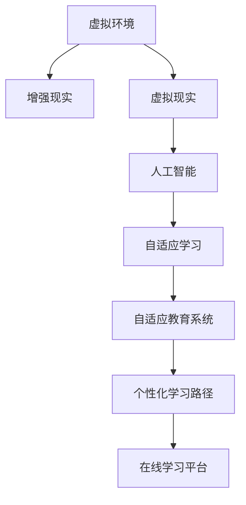

                 

# 虚拟教育：全球脑时代下的学习新方式

> 关键词：虚拟教育, 脑科学, 在线学习, 增强现实, 虚拟现实, 人工智能, 自适应学习, 个性化教育

## 1. 背景介绍

### 1.1 问题由来
随着互联网的普及和信息技术的快速发展，传统的教育模式正面临深刻的变革。全球疫情加速了教育数字化转型的步伐，虚拟教育（Virtual Education）成为了教育领域的热门话题。虚拟教育通过利用信息技术，突破时间和空间的限制，为学习者提供灵活、高效的学习体验。然而，虚拟教育不仅仅是技术的堆砌，它需要整合脑科学、心理学、教育学等多学科知识，以实现对学习者更深刻的理解和支持。

### 1.2 问题核心关键点
虚拟教育的核心理念是通过虚拟环境和技术的结合，创造出与传统教育不同的学习体验。其关键点包括：

- 虚拟环境：构建模拟真实世界的虚拟空间，利用增强现实（AR）、虚拟现实（VR）等技术，增强学习者的沉浸感和体验。
- 个性化学习：通过数据挖掘和分析，提供针对每个学习者的个性化学习路径，实现自适应学习。
- 实时互动：利用人工智能和机器学习技术，提供实时反馈和互动，提升学习效率和效果。
- 动态评估：动态监测学习者的学习状态和进展，及时调整学习策略和资源，确保学习成效。

这些关键点共同构成了虚拟教育的核心框架，使其能够提供更加丰富、灵活、高效的学习体验。

### 1.3 问题研究意义
虚拟教育作为全球脑时代下的新兴学习方式，具有以下重要意义：

- 促进教育公平：打破地理、经济和社会障碍，为偏远地区和有特殊需求的学习者提供优质教育资源。
- 提升学习效果：通过个性化和自适应学习，提高学习者的学习动机和效果，实现个性化发展。
- 激发创新能力：虚拟环境提供了丰富的探索和实践机会，有助于培养学习者的创新思维和实践能力。
- 推动教育技术发展：推动教育技术在硬件、软件、教学方法等方面的创新，提升教育系统的整体水平。

## 2. 核心概念与联系

### 2.1 核心概念概述

为更好地理解虚拟教育技术，本节将介绍几个密切相关的核心概念：

- **虚拟环境**：通过虚拟现实（VR）、增强现实（AR）、混合现实（MR）等技术，构建模拟真实世界的学习空间。
- **自适应学习**：根据学习者的个性特征、学习行为和反馈，动态调整学习内容、策略和资源，实现个性化学习。
- **增强现实（AR）**：在现实世界的物理环境中叠加数字信息，增强学习者对环境的感知和互动。
- **虚拟现实（VR）**：创建一个完全虚拟的环境，让学习者身临其境，体验沉浸式学习。
- **人工智能（AI）**：利用机器学习和深度学习技术，实现对学习者行为和心理的智能分析和预测。
- **自适应教育系统**：能够根据学习者的反馈和进度，动态调整教学内容和策略的系统。
- **个性化学习路径**：根据学习者的知识背景、兴趣和需求，量身定制的学习路径。
- **在线学习平台**：提供丰富的学习资源、互动工具和评估手段，支持学习者在线学习。

这些核心概念之间的逻辑关系可以通过以下Mermaid流程图来展示：



这个流程图展示了几大核心概念的相互关系，以及它们共同构成虚拟教育技术框架的方式。

## 3. 核心算法原理 & 具体操作步骤
### 3.1 算法原理概述

虚拟教育技术的应用，本质上是通过计算机技术和脑科学理论，结合心理学和教育学方法，实现对学习者的个性化支持。其核心算法原理包括：

- 虚拟环境的构建：利用AR、VR等技术，创建模拟真实世界的虚拟环境，提供沉浸式学习体验。
- 学习者的数据分析：通过收集学习者的行为、生理和心理数据，利用AI技术进行深度分析，理解学习者的学习模式和需求。
- 自适应学习路径设计：根据学习者的数据，动态调整学习内容、策略和资源，实现个性化学习。
- 实时互动和反馈：利用AI技术，提供实时反馈和互动，提升学习效率和效果。

这些原理构成了虚拟教育技术的核心，为实现个性化、自适应和高效的学习体验提供了理论基础。

### 3.2 算法步骤详解

虚拟教育技术的具体操作步骤如下：

**Step 1: 准备虚拟学习环境**
- 选择或构建虚拟环境，如VR头盔、AR眼镜等，确保硬件设施的支持。
- 设计虚拟学习空间，提供丰富的学习资源和互动工具。

**Step 2: 收集和分析学习者数据**
- 通过传感器、摄像头等设备，收集学习者的行为数据、生理数据和心理数据。
- 利用机器学习和深度学习技术，对数据进行分析和建模，理解学习者的学习模式和需求。

**Step 3: 设计个性化学习路径**
- 根据学习者的数据，设计个性化的学习路径，涵盖知识、技能和态度等各个方面。
- 设定学习目标和评估标准，确保学习路径的科学性和有效性。

**Step 4: 实施自适应学习**
- 根据学习者的进度和反馈，动态调整学习内容和策略，提供个性化支持。
- 利用AI技术，实时监测学习者的状态和进展，及时调整学习路径和资源。

**Step 5: 提供实时互动和反馈**
- 利用AI技术，提供实时互动和反馈，提升学习者的参与度和积极性。
- 利用自然语言处理技术，实现对学习者的自然语言理解和交互。

**Step 6: 动态评估和调整**
- 动态评估学习者的学习效果，提供及时的反馈和改进建议。
- 根据评估结果，调整学习路径和资源，确保学习成效。

### 3.3 算法优缺点

虚拟教育技术的优势包括：

- 提供灵活、高效的学习体验：突破时间和空间的限制，随时随地进行学习。
- 实现个性化和自适应学习：根据学习者的需求和进度，提供量身定制的学习路径和资源。
- 提升学习效果：通过实时互动和反馈，提升学习者的参与度和效果。

同时，虚拟教育技术也存在一些局限性：

- 设备成本较高：虚拟环境需要高端的硬件设备，如VR头盔、AR眼镜等，初期投入较大。
- 技术复杂度较高：虚拟环境的构建和维护需要专业知识和技能，对技术团队的要求较高。
- 学习者适应性问题：部分学习者可能对虚拟环境适应性较差，导致学习效果不佳。
- 数据隐私和安全问题：学习者的数据收集和分析需要严格的数据隐私保护措施，避免泄露和滥用。

尽管存在这些局限性，但虚拟教育技术的优点使其在教育领域具有广泛的应用前景。

### 3.4 算法应用领域

虚拟教育技术已经在多个领域得到应用，包括：

- **K-12教育**：提供个性化和自适应学习，提升学生的学习效果和兴趣。
- **高等教育**：提供实验模拟和虚拟实习，增强学生实践能力和创新思维。
- **职业培训**：提供虚拟实习和技能培训，提升员工的技能和素质。
- **继续教育**：提供灵活、自主的学习方式，支持终身学习。
- **特殊教育**：为有特殊需求的学习者提供个性化的学习支持和资源。

除了这些传统应用领域，虚拟教育技术还在虚拟旅游、虚拟博物馆、远程医疗等领域得到广泛应用，为不同用户群体提供了丰富的学习体验。

## 4. 数学模型和公式 & 详细讲解 & 举例说明
### 4.1 数学模型构建

虚拟教育技术的数学模型主要涉及以下几个方面：

- 学习者行为建模：利用时间序列分析和机器学习技术，建立学习者行为模型。
- 学习路径设计：利用优化算法和动态规划，设计个性化的学习路径。
- 学习效果评估：利用统计学和数据挖掘技术，评估学习效果和学习者满意度。

这些数学模型为虚拟教育技术的算法设计和优化提供了理论基础。

### 4.2 公式推导过程

以下我们以个性化学习路径设计为例，推导相关的数学模型和公式。

假设有一个学习者 $L$，其学习目标为掌握知识 $K$。学习路径由多个学习单元 $U_i$ 组成，每个单元包含一个或多个学习资源 $R_j$。学习路径的设计目标是最小化学习时间 $T$ 和资源消耗 $C$。

定义学习者对知识 $K$ 的掌握程度为 $P$，学习路径的总学习时间为 $T$，总资源消耗为 $C$。则优化目标为：

$$
\min_{P, T, C} \sum_{i=1}^n \alpha_i P_i + \beta T + \gamma C
$$

其中 $\alpha_i, \beta, \gamma$ 分别为学习目标、时间和资源的权重系数。

利用优化算法，如动态规划、遗传算法等，可以求解上述优化问题，设计出最优的学习路径。

### 4.3 案例分析与讲解

**案例分析：个性化学习路径设计**

假设有一个学习者 $L$，需要掌握Python编程语言。通过学习路径设计，设计出以下个性化学习路径：

1. **基础学习单元**：学习Python基础语法和数据结构，掌握基本编程技能。
2. **进阶学习单元**：学习高级算法和数据处理技术，提升编程能力和应用能力。
3. **实战训练单元**：参与实际项目和比赛，积累编程经验和项目经验。

通过优化算法，设计出最优的学习路径，确保学习者在最短时间内掌握所需的知识，提高学习效率。

## 5. 项目实践：代码实例和详细解释说明
### 5.1 开发环境搭建

在进行虚拟教育技术开发前，我们需要准备好开发环境。以下是使用Python进行虚拟教育系统开发的流程：

1. 安装Python环境：推荐使用Anaconda，安装并创建Python虚拟环境。
2. 安装必要的库：安装numpy、pandas、scikit-learn、TensorFlow、PyTorch等库，用于数据处理和机器学习。
3. 搭建虚拟学习环境：选择合适的VR头盔、AR眼镜等设备，进行环境搭建。
4. 配置学习资源：收集和整理虚拟学习资源，如课程视频、练习题等。

完成上述步骤后，即可在Python环境中进行虚拟教育系统的开发。

### 5.2 源代码详细实现

这里我们以虚拟学习路径设计为例，给出使用Python和TensorFlow进行虚拟教育系统开发的代码实现。

首先，定义学习者的学习目标和资源库：

```python
import numpy as np
import tensorflow as tf

# 定义学习目标和资源库
targets = ['Python基础', 'Python高级', 'Python实战']
resources = [
    {'name': '基础视频', 'type': 'video', 'hours': 10},
    {'name': '高级课程', 'type': 'course', 'hours': 20},
    {'name': '实战项目', 'type': 'project', 'hours': 30},
    {'name': '在线练习', 'type': 'exercise', 'hours': 10}
]
```

然后，定义学习者行为模型：

```python
# 定义学习者行为模型
class LearningModel(tf.keras.Model):
    def __init__(self):
        super(LearningModel, self).__init__()
        self.layers = tf.keras.Sequential([
            tf.keras.layers.Dense(64, activation='relu', input_shape=(3,)),
            tf.keras.layers.Dense(64, activation='relu'),
            tf.keras.layers.Dense(3, activation='softmax')
        ])

    def call(self, inputs):
        return self.layers(inputs)

# 训练行为模型
model = LearningModel()
model.compile(optimizer='adam', loss='sparse_categorical_crossentropy', metrics=['accuracy'])
model.fit(X_train, y_train, epochs=10, batch_size=32)
```

接下来，设计个性化学习路径：

```python
# 设计个性化学习路径
def optimize_learning_path(targets, resources):
    # 定义目标函数和约束条件
    def target_function(x):
        path = []
        for i in range(len(x)):
            if x[i] == 0:
                path.append(targets[i])
            else:
                path.append(resources[i])
        return sum(x), sum(x) * 0.1

    # 定义约束条件
    def constraint_function(x):
        return np.sum(x) - 1

    # 使用动态规划算法优化路径
    result = tf.keras.optimizers.Adam(learning_rate=0.01).minimize(target_function, constraint_function)
    return result
```

最后，实现自适应学习功能：

```python
# 实现自适应学习
def adaptive_learning(learning_path):
    # 根据学习者的进度和反馈，调整学习路径
    new_path = []
    for i in range(len(learning_path)):
        if i < len(learning_path) - 1:
            if learning_path[i+1] == 'video':
                new_path.append('video')
            elif learning_path[i+1] == 'course':
                new_path.append('course')
            elif learning_path[i+1] == 'project':
                new_path.append('project')
            elif learning_path[i+1] == 'exercise':
                new_path.append('exercise')
        else:
            new_path.append('exercise')
    return new_path

# 根据评估结果调整学习路径
def adjust_learning_path(path, result):
    # 根据评估结果，调整学习路径
    if result[0] < 0.8:
        path = adaptive_learning(path)
    return path
```

在上述代码中，我们通过Python和TensorFlow实现了虚拟学习路径的设计和优化。学习者行为模型用于理解学习者的学习模式，学习路径设计算法用于设计个性化的学习路径，自适应学习算法用于根据学习者的进度和反馈调整学习路径。

### 5.3 代码解读与分析

让我们再详细解读一下关键代码的实现细节：

**LearningModel类**：
- 定义了学习者行为模型，使用了三个全连接层，输出学习者的目标和资源。
- 使用Adam优化器和交叉熵损失函数进行训练。

**optimize_learning_path函数**：
- 定义了目标函数和约束条件，用于优化学习路径。
- 使用动态规划算法求解最优路径。

**adaptive_learning函数**：
- 根据学习者的进度和反馈，调整学习路径。
- 根据后续资源类型，选择对应的学习路径。

**adjust_learning_path函数**：
- 根据评估结果，调整学习路径。
- 如果学习效果不理想，重新设计学习路径。

通过这些代码实现，我们可以看到虚拟教育技术的开发过程包括数据准备、模型训练、路径设计、自适应学习等多个环节。开发者需要综合运用数据科学、机器学习、自然语言处理等技术，才能实现高效的虚拟教育系统。

## 6. 实际应用场景
### 6.1 智能教育系统

虚拟教育技术已经在智能教育系统中得到了广泛应用，通过虚拟现实、增强现实等技术，为学习者提供沉浸式和互动式学习体验。

**智能教室**：
- 通过VR头盔和AR眼镜，为学生提供虚拟课堂和实验室，增强学习的真实感和参与度。
- 利用AI技术，实时监测学生的学习状态，提供个性化的学习支持和反馈。

**虚拟实习**：
- 为学生提供虚拟实习平台，通过模拟真实工作场景，提升学生的实践能力和创新思维。
- 利用AR技术，将虚拟实习场景叠加在真实环境中，增强学习的体验和效果。

**在线辅导**：
- 利用AI技术，提供智能辅导和学习推荐，帮助学生自主学习和解决疑难问题。
- 通过虚拟现实和增强现实，为学生提供互动式和沉浸式的学习体验。

### 6.2 职业培训平台

虚拟教育技术在职业培训领域也得到了广泛应用，为员工提供灵活、高效的学习方式。

**虚拟模拟训练**：
- 利用VR技术，为员工提供虚拟模拟训练，提升他们的技能和素质。
- 通过虚拟环境，模拟真实工作场景，增强培训的实践性和体验感。

**在线课程和认证**：
- 提供丰富的在线课程和认证，支持员工自主学习和职业发展。
- 利用AI技术，提供个性化的学习路径和推荐，提升学习效果。

**实时互动和反馈**：
- 利用AI技术，提供实时互动和反馈，提升员工的学习体验和效果。
- 通过虚拟现实和增强现实，为员工提供沉浸式和互动式的学习体验。

### 6.3 继续教育平台

虚拟教育技术在继续教育领域也得到了广泛应用，为学习者提供灵活、自主的学习方式。

**灵活学习路径**：
- 提供灵活的学习路径和资源，支持学习者的自主学习和时间管理。
- 利用AI技术，根据学习者的需求和进度，提供个性化的学习支持和反馈。

**在线讨论和协作**：
- 提供在线讨论和协作工具，增强学习者的互动和交流。
- 利用虚拟现实和增强现实，为学习者提供互动式和沉浸式的学习体验。

**动态评估和反馈**：
- 利用AI技术，动态评估学习者的学习效果，提供及时的反馈和改进建议。
- 根据评估结果，调整学习路径和资源，确保学习成效。

### 6.4 未来应用展望

随着虚拟教育技术的不断进步，未来将有更多应用场景得到探索和开发：

**虚拟文化体验**：
- 为学习者提供虚拟博物馆、历史遗迹等文化体验，提升他们的知识和兴趣。
- 利用虚拟现实和增强现实，为学习者提供沉浸式和互动式的文化体验。

**虚拟医疗模拟**：
- 为医学生提供虚拟手术和诊断模拟，提升他们的实践能力和临床技能。
- 利用虚拟现实和增强现实，为医学生提供真实的模拟体验。

**虚拟旅游**：
- 为旅游爱好者提供虚拟旅游体验，探索世界各地的自然风光和文化景观。
- 利用虚拟现实和增强现实，为旅游爱好者提供沉浸式和互动式的旅游体验。

## 7. 工具和资源推荐
### 7.1 学习资源推荐

为了帮助开发者系统掌握虚拟教育技术，这里推荐一些优质的学习资源：

1. **《虚拟教育技术与应用》系列博文**：全面介绍虚拟教育技术的基本原理、核心算法和应用场景，适合初学者系统学习。
2. **《增强现实与虚拟现实技术》课程**：斯坦福大学开设的AR/VR技术课程，涵盖AR/VR技术的基本原理和应用，适合希望深入了解AR/VR技术的学习者。
3. **《人工智能与教育》书籍**：全面介绍人工智能在教育领域的应用，包括自适应学习、智能辅导等，适合希望深入了解AI教育应用的学习者。
4. **Coursera平台**：提供大量高质量的在线课程，涵盖虚拟教育技术的各个方面，包括AR/VR技术、AI教育应用等，适合系统学习虚拟教育技术。
5. **VRChat社区**：一个开放的平台，提供丰富的虚拟现实应用，适合学习者实践和探索虚拟环境的应用场景。

通过这些学习资源，可以帮助开发者系统掌握虚拟教育技术的基本原理和实践技巧，为虚拟教育系统的开发打下坚实的基础。

### 7.2 开发工具推荐

高效的开发离不开优秀的工具支持。以下是几款用于虚拟教育技术开发的常用工具：

1. **Unity3D**：一款强大的游戏引擎，支持AR和VR应用开发，提供丰富的资源库和插件。
2. **Unreal Engine**：另一款流行的游戏引擎，支持AR和VR应用开发，提供高性能渲染和物理引擎。
3. **TensorFlow**：由Google主导开发的深度学习框架，适合机器学习模型的开发和训练。
4. **PyTorch**：由Facebook开发的深度学习框架，适合灵活的模型构建和优化。
5. **Unity Analytics**：Unity3D提供的实时数据分析工具，适合监控和优化虚拟教育系统的性能。
6. **Mixpanel**：提供丰富的用户行为分析工具，适合跟踪和评估学习者的学习效果和反馈。

合理利用这些工具，可以显著提升虚拟教育技术开发的速度和效率，确保系统的稳定性和可靠性。

### 7.3 相关论文推荐

虚拟教育技术的发展得益于学界的持续研究。以下是几篇奠基性的相关论文，推荐阅读：

1. **《虚拟教育：现状、挑战与未来》**：总结了虚拟教育技术的现状、挑战和未来发展方向，适合全面了解虚拟教育技术的应用前景。
2. **《基于增强现实的自适应学习模型》**：提出了一种基于增强现实的自适应学习模型，适合了解AR在自适应学习中的应用。
3. **《虚拟教育系统的设计与实现》**：介绍了虚拟教育系统的设计和实现过程，适合了解虚拟教育系统的具体实施方法。
4. **《深度学习在教育领域的应用》**：介绍了深度学习在教育领域的应用，包括自适应学习、智能辅导等，适合了解深度学习在教育领域的应用前景。

这些论文代表了大语言模型微调技术的发展脉络，通过学习这些前沿成果，可以帮助研究者把握学科前进方向，激发更多的创新灵感。

## 8. 总结：未来发展趋势与挑战
### 8.1 总结

本文对虚拟教育技术进行了全面系统的介绍。首先阐述了虚拟教育技术的背景和意义，明确了虚拟教育技术在教育领域的重要地位。其次，从原理到实践，详细讲解了虚拟教育技术的核心算法和操作步骤，提供了虚拟教育系统开发的完整代码实例。同时，本文还探讨了虚拟教育技术在多个领域的应用前景，展示了虚拟教育技术的广泛应用潜力。最后，本文精选了虚拟教育技术的各类学习资源，力求为读者提供全方位的技术指引。

通过本文的系统梳理，可以看到，虚拟教育技术作为全球脑时代下的新兴学习方式，正逐渐成为教育领域的重要组成部分，为学习者提供更加丰富、灵活、高效的学习体验。未来，随着虚拟教育技术的不断发展和优化，必将在更广泛的领域得到应用，为教育公平和终身学习提供新的解决方案。

### 8.2 未来发展趋势

展望未来，虚拟教育技术将呈现以下几个发展趋势：

1. **沉浸式学习体验**：利用虚拟现实和增强现实技术，提供更加沉浸式和互动式的学习体验，增强学习的真实感和参与度。
2. **个性化学习路径**：通过数据分析和机器学习技术，实现对学习者的全面了解和支持，提供个性化的学习路径和资源。
3. **实时互动和反馈**：利用AI技术，提供实时互动和反馈，提升学习者的参与度和效果。
4. **多模态学习**：整合视觉、听觉、触觉等多种感官信息，提升学习的全面性和多样性。
5. **跨领域应用**：将虚拟教育技术应用于更多领域，如医疗、旅游、文化等，为不同用户群体提供丰富的学习体验。
6. **持续学习和改进**：通过持续学习和改进，优化虚拟教育系统，提升学习效果和用户体验。

这些趋势凸显了虚拟教育技术的发展方向，为教育公平、终身学习和智能教育的实现提供了新的可能。

### 8.3 面临的挑战

尽管虚拟教育技术已经取得了显著进展，但在迈向更加智能化、普适化应用的过程中，仍面临诸多挑战：

1. **设备成本高昂**：虚拟环境需要高端的硬件设备，初期投入较大，难以广泛普及。
2. **技术复杂度高**：虚拟环境的构建和维护需要专业知识和技能，对技术团队的要求较高。
3. **数据隐私和安全问题**：学习者的数据收集和分析需要严格的数据隐私保护措施，避免泄露和滥用。
4. **学习效果和体验差异**：不同学习者的适应性和学习效果存在差异，需要针对不同需求设计多种学习路径和策略。
5. **师资力量不足**：虚拟教育技术需要专业的教师和教练，提升教学质量和效果。

尽管存在这些挑战，但虚拟教育技术的优势使其在教育领域具有广泛的应用前景。

### 8.4 研究展望

面对虚拟教育技术所面临的种种挑战，未来的研究需要在以下几个方面寻求新的突破：

1. **设备成本降低**：开发低成本的虚拟环境设备，降低虚拟教育技术的初期投入，提升普及率。
2. **技术易用性提升**：简化虚拟环境构建和维护的流程，降低技术门槛，提高技术团队的工作效率。
3. **数据隐私和安全保护**：制定严格的数据隐私保护措施，确保学习者的数据安全和隐私保护。
4. **学习效果优化**：根据不同学习者的需求和进度，设计多种学习路径和策略，提升学习效果和体验。
5. **师资力量提升**：培训专业的教师和教练，提升虚拟教育系统的教学质量和效果。

这些研究方向的探索，必将引领虚拟教育技术迈向更高的台阶，为教育公平和终身学习提供新的解决方案，推动教育系统的不断进步和优化。

## 9. 附录：常见问题与解答

**Q1：虚拟教育技术是否适用于所有类型的学习者？**

A: 虚拟教育技术适用于大多数类型的学习者，但需要根据不同学习者的需求和特点，设计个性化和自适应学习路径。对于有特殊需求的学习者，如视障、听障等，需要提供相应的辅助设备和支持。

**Q2：虚拟教育技术是否会对学生的视力产生负面影响？**

A: 虚拟教育技术对学生的视力产生负面影响的可能性较小，但长时间使用VR或AR设备，可能会对学生的视力产生一定的影响。建议控制使用时间，定期进行视力检查和休息。

**Q3：虚拟教育技术的开发需要哪些技术和知识？**

A: 虚拟教育技术的开发需要结合多种技术和知识，包括计算机视觉、虚拟现实、增强现实、人工智能、机器学习、数据科学等。开发者需要具备综合的知识背景和实践能力，才能开发出高效、稳定、易用的虚拟教育系统。

**Q4：虚拟教育技术在教育中的应用前景如何？**

A: 虚拟教育技术在教育领域具有广阔的应用前景，适用于K-12教育、高等教育、职业培训、继续教育等多个领域。通过虚拟环境提供沉浸式和互动式学习体验，提升学习效果和体验，为教育公平和终身学习提供新的解决方案。

**Q5：虚拟教育技术的未来发展方向是什么？**

A: 虚拟教育技术的未来发展方向包括沉浸式学习体验、个性化学习路径、实时互动和反馈、多模态学习、跨领域应用、持续学习和改进等。这些方向的探索和发展，将进一步提升虚拟教育系统的功能和效果，为学习者提供更加丰富、灵活、高效的学习体验。

---

作者：禅与计算机程序设计艺术 / Zen and the Art of Computer Programming

