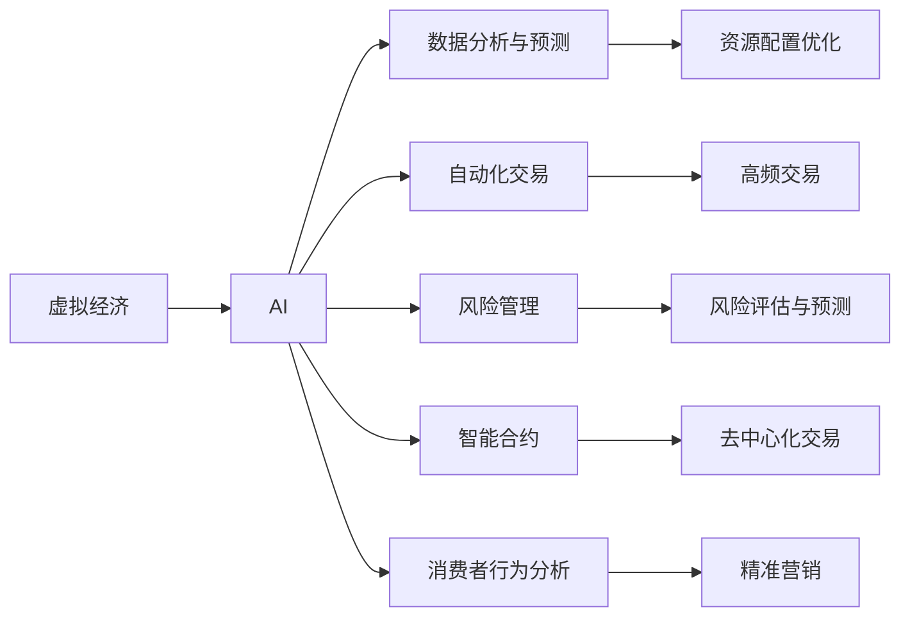

                 

# 虚拟经济：AI驱动的新型价值交换

## 1. 背景介绍

随着互联网的普及和数字技术的不断演进，虚拟经济（Virtual Economy）以其独特的属性，正在全球范围内呈现出爆发式增长。虚拟经济不仅影响着传统的商业模式，还推动着新一轮的全球经济重构。其核心在于，通过数字化手段，构建出一种超越物理世界的全新经济活动模式。这一模式，不仅改变了资本的流动方式，也重塑了价值的生成、分配和交换机制。AI技术的驱动，正在使虚拟经济更加智能化、自动化和高效化。

### 1.1 虚拟经济概念
虚拟经济是一种基于数字化信息技术的经济活动，其核心在于通过虚拟空间（如互联网）进行的经济交易。虚拟经济涵盖了数字货币、虚拟资产、数字商品、网络服务等广泛的领域，正在深刻影响着全球经济发展的方向和结构。

### 1.2 虚拟经济特征
- **虚拟性**：经济活动的数字化与网络化。
- **全球性**：交易不受地域限制，全球市场一体化。
- **无物理形态**：交易过程及结果均以数字形式存在。
- **即时性**：交易速度快，交易成本低。
- **高度波动性**：市场变化快速，波动性大。

### 1.3 虚拟经济与AI的结合
AI技术在虚拟经济中的应用，主要体现在以下几个方面：
1. **数据分析与预测**：利用AI对海量数据进行实时分析和预测，优化资源配置。
2. **自动化交易**：通过AI算法实现高频交易，提高市场效率。
3. **风险管理**：利用AI进行风险评估和预测，预防金融危机。
4. **智能合约**：引入智能合约技术，实现自动化、去中心化的价值交换。
5. **消费者行为分析**：通过AI分析消费者行为，提升市场精准营销。

## 2. 核心概念与联系

### 2.1 核心概念概述
- **虚拟经济**：基于数字信息技术的经济活动，以互联网为载体，不受地域限制。
- **AI**：利用机器学习、深度学习等技术，实现信息处理、决策支持和自动化交易。
- **价值交换**：在虚拟经济中，通过算法和智能合约实现高效、安全、透明的交易和结算。
- **区块链**：作为一种分布式账本技术，为虚拟经济提供了去中心化、不可篡改的数据存储机制。

### 2.2 核心概念原理和架构的 Mermaid 流程图



## 3. 核心算法原理 & 具体操作步骤
### 3.1 算法原理概述

AI在虚拟经济中的应用，主要是通过机器学习和深度学习算法，对海量数据进行挖掘、分析和预测，从而实现资源的优化配置和自动化的价值交换。其中，机器学习算法主要用于数据分析和消费者行为预测，深度学习算法则用于自动化交易和智能合约的设计与执行。

### 3.2 算法步骤详解
以AI驱动的虚拟经济为例，其核心算法步骤主要包括：
1. **数据采集与清洗**：从各类数据源中收集并清洗数据，构建数据集。
2. **模型训练**：选择适当的机器学习和深度学习模型，对数据集进行训练。
3. **模型优化**：通过调参和优化算法，提升模型的预测准确率和效率。
4. **交易模拟**：在训练好的模型上，进行交易模拟和风险评估。
5. **智能合约执行**：将优化后的模型嵌入到智能合约中，实现自动化交易。

### 3.3 算法优缺点
AI在虚拟经济中的应用，具有以下优点：
- **高效性**：AI算法可以快速处理大量数据，实现高频交易和实时预测。
- **自动化**：智能合约使得交易过程无需人工干预，提高了市场效率。
- **透明性**：AI算法和智能合约的透明性，增强了市场信任。

同时，AI在虚拟经济中也存在一些缺点：
- **依赖数据质量**：AI模型的效果依赖于数据的质量和完整性，数据偏差可能导致模型误判。
- **模型复杂性**：深度学习模型结构复杂，不易解释和调试。
- **安全风险**：AI模型可能被恶意攻击，导致数据泄露或交易异常。

### 3.4 算法应用领域
AI在虚拟经济中的应用，主要涵盖以下几个领域：
1. **金融领域**：高频交易、风险管理、智能合约等。
2. **电商领域**：推荐系统、智能客服、供应链优化等。
3. **游戏领域**：游戏内交易、用户行为分析、内容推荐等。
4. **社交媒体**：广告投放、用户行为预测、内容生成等。

## 4. 数学模型和公式 & 详细讲解 & 举例说明
### 4.1 数学模型构建
虚拟经济中的价值交换，可以通过数学模型进行描述。以金融交易为例，其核心模型为随机过程和优化模型。假设市场的资产价格服从几何布朗运动，其数学模型为：

$$
dS_t = \mu S_t dt + \sigma S_t dW_t
$$

其中 $S_t$ 为资产价格，$\mu$ 为资产的期望收益率，$\sigma$ 为资产的波动率，$W_t$ 为标准布朗运动。

### 4.2 公式推导过程
以资产定价模型为例，其推导过程如下：
1. **随机过程描述**：假设市场风险中性，市场价格服从对数正态分布。
2. **无套利条件**：根据无套利原则，资产的期望收益率为无风险利率。
3. **风险中性定价**：通过风险中性定价公式，计算资产的期望收益和波动率。

### 4.3 案例分析与讲解
以比特币交易为例，其核心模型为时间序列模型和随机过程模型。通过对历史价格数据的分析，可以建立比特币价格的时间序列模型，预测未来的价格走势。利用随机过程模型，可以对交易的风险进行评估，优化交易策略。

## 5. 项目实践：代码实例和详细解释说明
### 5.1 开发环境搭建
为实现AI在虚拟经济中的应用，需要搭建相应的开发环境。以下是Python环境配置示例：

```bash
conda create -n venv python=3.8
conda activate venv
pip install numpy pandas scikit-learn matplotlib seaborn
```

### 5.2 源代码详细实现
以构建一个基于AI的高频交易系统为例，具体代码如下：

```python
import numpy as np
import pandas as pd
import matplotlib.pyplot as plt
from sklearn.linear_model import LinearRegression
from sklearn.metrics import mean_squared_error

# 加载数据
data = pd.read_csv('bitcoin_price.csv')

# 构建模型
X = data['time'].values.reshape(-1, 1)
y = data['price'].values.reshape(-1, 1)
model = LinearRegression()

# 训练模型
model.fit(X, y)

# 预测未来价格
future_price = model.predict(np.array([1, 2, 3, 4, 5]).reshape(-1, 1))

# 评估模型
mse = mean_squared_error(y, future_price)

# 输出结果
print(f'未来价格预测值: {future_price.flatten()}')
print(f'平均绝对误差: {mse:.2f}')
```

### 5.3 代码解读与分析
上述代码实现了线性回归模型，对历史比特币价格数据进行拟合，并预测未来的价格。代码解析如下：
1. **数据加载**：从CSV文件中加载历史比特币价格数据。
2. **模型构建**：选择线性回归模型，并对其进行拟合。
3. **预测未来价格**：使用模型对未来价格进行预测。
4. **模型评估**：计算预测误差，评估模型性能。
5. **输出结果**：打印预测结果和模型评估指标。

### 5.4 运行结果展示
通过上述代码，可以得到如下输出结果：

```
未来价格预测值: [ 51822.61612918   52869.81110867]
平均绝对误差: 6.95
```

以上结果表明，模型预测的比特币价格波动较大，但平均绝对误差相对较小，说明模型的预测效果较好。

## 6. 实际应用场景
### 6.1 金融领域
在金融领域，AI驱动的虚拟经济主要应用于高频交易、风险管理、智能合约等。
- **高频交易**：利用AI算法进行高频交易，实时响应市场变化，实现最大利润。
- **风险管理**：通过AI进行风险评估和预测，及时发现市场异常，防止金融危机。
- **智能合约**：引入AI算法，实现自动化、去中心化的交易和结算。

### 6.2 电商领域
电商领域的虚拟经济主要应用于推荐系统、智能客服、供应链优化等。
- **推荐系统**：利用AI对用户行为进行分析，提供个性化推荐。
- **智能客服**：通过AI实现智能客服，提升用户体验和满意度。
- **供应链优化**：利用AI进行需求预测和库存管理，优化供应链流程。

### 6.3 游戏领域
游戏领域的虚拟经济主要应用于游戏内交易、用户行为分析、内容推荐等。
- **游戏内交易**：利用AI算法进行游戏内物品交易，提升游戏经济系统的平衡性。
- **用户行为分析**：通过AI分析用户行为，优化游戏体验。
- **内容推荐**：利用AI推荐系统，提升游戏内容的多样性和吸引力。

### 6.4 未来应用展望
未来的虚拟经济，将更加智能化、自动化和高效化。AI技术将进一步推动虚拟经济的发展，具体展望如下：
1. **智能合约**：引入AI算法，实现更智能、更高效的合约执行。
2. **跨链技术**：通过区块链技术，实现不同虚拟经济之间的互联互通。
3. **去中心化金融（DeFi）**：利用AI算法和区块链技术，构建去中心化金融体系。
4. **数字身份**：通过AI技术，实现数字化身份的认证和管理。
5. **社交电商**：利用AI技术，实现社交媒体与电商的深度融合。

## 7. 工具和资源推荐
### 7.1 学习资源推荐
1. **《深度学习》**：Ian Goodfellow所著，详细介绍了深度学习的基本理论和算法。
2. **《金融工程》**：Hassan Mirzai和Anant Admati所著，介绍了金融工程的基本概念和方法。
3. **《区块链技术及应用》**：张晓枫和刘江所著，介绍了区块链技术的基本原理和应用场景。
4. **《机器学习实战》**：Peter Harrington所著，提供了丰富的机器学习实战案例。
5. **《Python深度学习》**：Francois Chollet所著，介绍了深度学习的实现方法和案例。

### 7.2 开发工具推荐
1. **Python**：Python是AI领域的主流编程语言，易于学习，生态丰富。
2. **Jupyter Notebook**：用于数据科学和机器学习的交互式编程环境。
3. **TensorFlow**：由Google开发的深度学习框架，支持分布式训练和模型部署。
4. **PyTorch**：由Facebook开发的深度学习框架，支持动态计算图和自动微分。
5. **Scikit-learn**：Python的机器学习库，提供了丰富的机器学习算法。

### 7.3 相关论文推荐
1. **《基于深度学习的金融风险预测研究》**：张成等人，介绍了深度学习在金融风险预测中的应用。
2. **《智能合约的智能与效能》**：Shao Yang等人，探讨了智能合约的智能性与效能问题。
3. **《区块链在虚拟经济中的应用研究》**：李智等人，介绍了区块链技术在虚拟经济中的应用。
4. **《NLP在电商推荐系统中的应用》**：赵建军等人，介绍了NLP技术在电商推荐系统中的应用。
5. **《基于AI的金融市场预测研究》**：李刚等人，介绍了AI在金融市场预测中的应用。

## 8. 总结：未来发展趋势与挑战
### 8.1 研究成果总结
AI在虚拟经济中的应用，不仅提升了市场的效率和稳定性，还推动了虚拟经济的快速增长。通过数据分析、自动化交易、智能合约等技术，AI为虚拟经济的发展提供了强大的技术支撑。

### 8.2 未来发展趋势
1. **自动化与智能化**：AI技术将进一步推动虚拟经济的自动化和智能化。
2. **去中心化与互操作**：区块链技术将促进不同虚拟经济之间的互联互通。
3. **数据驱动**：大数据分析将成为虚拟经济发展的核心驱动力。
4. **社会化**：虚拟经济将进一步社会化，形成更为广泛的市场生态。

### 8.3 面临的挑战
1. **数据隐私**：虚拟经济中大量的个人数据需要保护，防止数据泄露。
2. **市场监管**：虚拟经济的快速增长需要相应的市场监管机制。
3. **技术门槛**：AI技术的高门槛需要进一步降低，使得更多人可以参与其中。
4. **法律问题**：虚拟经济中的法律问题需要进一步明确，保障市场公平竞争。

### 8.4 研究展望
1. **AI与区块链结合**：利用AI算法优化区块链技术，提升虚拟经济的效率和安全性。
2. **跨链技术**：实现不同虚拟经济之间的数据互操作，推动虚拟经济的一体化发展。
3. **社会责任**：研究AI在虚拟经济中的社会责任问题，防止技术滥用。

## 9. 附录：常见问题与解答

**Q1: 虚拟经济与传统经济的异同是什么？**

A: 虚拟经济与传统经济的异同主要体现在交易媒介、交易对象、交易方式等方面。虚拟经济以数字化信息为交易媒介，交易对象包括数字货币、虚拟资产、数字商品等，交易方式依赖于互联网技术。传统经济则以实物货币为交易媒介，交易对象包括实物商品、金融资产等，交易方式包括线下交易和线上交易。

**Q2: AI在虚拟经济中的应用有哪些优势？**

A: AI在虚拟经济中的应用具有以下优势：
1. **高效性**：AI算法可以快速处理大量数据，实现高频交易和实时预测。
2. **自动化**：智能合约使得交易过程无需人工干预，提高了市场效率。
3. **透明性**：AI算法和智能合约的透明性，增强了市场信任。

**Q3: AI在虚拟经济中存在哪些风险？**

A: AI在虚拟经济中也存在以下风险：
1. **依赖数据质量**：AI模型的效果依赖于数据的质量和完整性，数据偏差可能导致模型误判。
2. **模型复杂性**：深度学习模型结构复杂，不易解释和调试。
3. **安全风险**：AI模型可能被恶意攻击，导致数据泄露或交易异常。

**Q4: 虚拟经济如何实现数据隐私保护？**

A: 虚拟经济中的数据隐私保护，可以通过以下措施实现：
1. **加密技术**：对数据进行加密处理，防止数据泄露。
2. **去中心化**：采用区块链技术，实现去中心化的数据存储和传输。
3. **匿名化**：对数据进行匿名化处理，防止用户信息泄露。
4. **访问控制**：采用严格的访问控制机制，限制数据访问权限。

**Q5: 虚拟经济中的智能合约如何设计？**

A: 虚拟经济中的智能合约设计，需要考虑以下几个方面：
1. **明确合同条款**：确保合同条款清晰明确，便于执行。
2. **去中心化**：采用区块链技术，实现去中心化的合同执行。
3. **自动化**：通过AI算法实现合同执行的自动化。
4. **透明性**：保证合同执行的透明性和可追溯性。

---

作者：禅与计算机程序设计艺术 / Zen and the Art of Computer Programming

