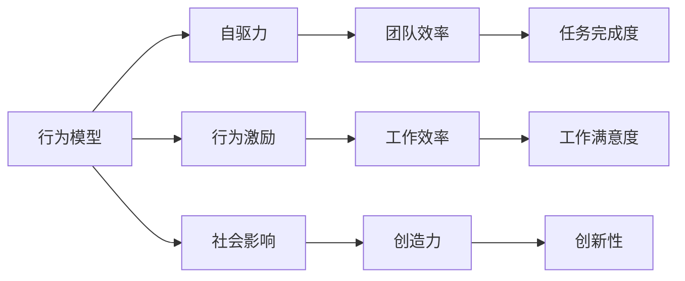

                 

# 行为模型应用:培养团队自驱力

## 1. 背景介绍

在当今快速变化、高度竞争的商业环境中，企业成功与否在很大程度上取决于团队的效率和创新能力。然而，如何有效激发团队的积极性和创造力，已成为每个管理者和领导者所面临的挑战。传统的激励机制已经无法满足现代团队的复杂需求，因此行为模型（Behavior Modeling）作为一种新的团队管理工具，逐渐受到了越来越多的关注。

行为模型是指通过描述和模拟人类行为的数学和计算模型，用于预测和控制个体和团队的行为，从而提升团队的效率和凝聚力。本文将详细介绍行为模型的原理、操作步骤，以及其在实际应用中的优势和局限性，并探讨其未来的发展方向和潜在挑战。

## 2. 核心概念与联系

### 2.1 核心概念概述

为了更好地理解行为模型在团队管理中的应用，我们需要首先了解几个核心概念：

- **行为模型（Behavior Modeling）**：使用数学和计算方法来模拟和预测个体和团队的行为。行为模型可以帮助管理者更好地理解团队成员的行为动机，从而制定更为有效的管理策略。

- **自驱力（Self-Driven）**：指个体在无需外部强制和奖励的情况下，基于内在动机和目标自主完成任务的能力。自驱力是衡量团队成员主动性和创造力的关键指标。

- **行为激励（Behavioral Incentives）**：通过改变团队成员的行为动机，从而提升其工作效率和创造力。行为激励可以包括物质奖励、荣誉认可、职业发展等不同形式。

- **社会影响（Social Influence）**：个体在团队中的行为不仅受到自身动机的影响，还受到团队成员行为和情绪的感染和影响。社会影响是行为模型需要考虑的重要因素之一。

### 2.2 核心概念原理和架构的 Mermaid 流程图



该流程图展示了行为模型与其他核心概念之间的联系：行为模型通过分析自驱力、行为激励和社会影响等因素，来预测和优化团队效率、任务完成度、工作满意度、创造力和创新性等关键指标。

## 3. 核心算法原理 & 具体操作步骤

### 3.1 算法原理概述

行为模型的核心算法原理主要基于以下几个步骤：

1. **数据收集与预处理**：收集团队成员的工作数据，如工作时间、任务完成情况、员工满意度调查结果等，并进行数据清洗和预处理。

2. **行为预测模型构建**：使用机器学习算法（如回归分析、决策树、神经网络等）构建预测模型，预测团队成员的行为和绩效。

3. **行为激励策略制定**：基于预测模型的结果，制定相应的行为激励策略，如调整薪酬体系、提供职业发展机会、增加团队合作和沟通等。

4. **行为模型优化**：通过持续收集数据和反馈，不断优化行为模型，提高预测的准确性和激励策略的有效性。

### 3.2 算法步骤详解

以下是行为模型在团队管理中的应用步骤详解：

**Step 1: 数据收集与预处理**

- **数据类型**：包括工作时间、任务完成度、员工满意度调查、绩效评估等。
- **数据清洗**：处理缺失值、异常值和重复数据，确保数据质量。
- **特征工程**：提取有意义的特征，如工作时间、任务难度、团队协作情况等。

**Step 2: 行为预测模型构建**

- **选择算法**：根据数据特点选择合适的机器学习算法，如线性回归、随机森林、神经网络等。
- **模型训练**：使用历史数据训练预测模型，并进行交叉验证，评估模型的性能。
- **模型优化**：调整算法参数和特征工程策略，优化模型的预测准确性。

**Step 3: 行为激励策略制定**

- **分析预测结果**：根据模型预测的结果，识别出表现突出的成员和需要激励的成员。
- **制定激励策略**：为表现突出的成员提供晋升机会、奖金等奖励；为需要激励的成员提供培训、辅导等支持。
- **执行和反馈**：实施激励策略，并收集员工的反馈，评估激励效果。

**Step 4: 行为模型优化**

- **持续收集数据**：定期收集新数据，更新预测模型。
- **反馈调整**：根据员工的反馈和新的数据，调整行为激励策略。
- **循环迭代**：不断优化预测模型和激励策略，提升团队的总体表现。

### 3.3 算法优缺点

**优点**：

- **数据驱动**：通过数据分析，能够更客观、科学地理解团队行为，制定管理策略。
- **持续优化**：通过持续收集数据和反馈，不断优化模型和激励策略，提升管理效果。
- **灵活调整**：能够灵活应对不同团队和不同场景下的需求，定制化管理策略。

**缺点**：

- **数据依赖**：模型的效果依赖于数据的完整性和准确性，数据质量问题可能影响模型性能。
- **隐私问题**：收集和处理员工数据可能引发隐私和伦理问题，需要谨慎处理。
- **复杂性高**：构建和维护行为模型需要专业知识和技术支持，管理成本较高。

### 3.4 算法应用领域

行为模型在团队管理中的应用广泛，涵盖以下几个领域：

- **人力资源管理**：用于招聘、培训、绩效评估、员工发展等。
- **团队协作管理**：用于提升团队沟通、协作和创新能力。
- **客户关系管理**：用于分析客户行为，提升客户满意度和忠诚度。
- **供应链管理**：用于优化供应链流程，提升供应链效率。

## 4. 数学模型和公式 & 详细讲解

### 4.1 数学模型构建

行为模型的数学模型通常基于以下公式构建：

$$
\hat{y} = f(x, \theta)
$$

其中：
- $\hat{y}$ 为预测的团队行为或绩效指标，如工作效率、创新性等。
- $x$ 为影响行为的输入特征，如工作时间、任务难度、团队协作等。
- $f$ 为预测函数，通常使用机器学习算法。
- $\theta$ 为模型参数。

### 4.2 公式推导过程

以线性回归模型为例，推导预测函数的形式：

$$
\hat{y} = \beta_0 + \beta_1x_1 + \beta_2x_2 + \ldots + \beta_nx_n + \epsilon
$$

其中：
- $\hat{y}$ 为预测值。
- $\beta_0$ 为截距。
- $\beta_i$ 为特征 $x_i$ 的系数。
- $x_i$ 为第 $i$ 个特征。
- $\epsilon$ 为误差项。

通过最小化误差平方和（Mean Squared Error, MSE），求解 $\beta_0, \beta_1, \ldots, \beta_n$ 的值，从而构建预测模型。

### 4.3 案例分析与讲解

假设我们希望预测某团队的工作效率，收集了以下数据：

| 成员编号 | 工作时间（小时/天） | 任务难度 | 团队协作 | 工作效率 |
| --- | --- | --- | --- | --- |
| 1 | 8 | 高 | 好 | 80 |
| 2 | 7 | 低 | 差 | 60 |
| 3 | 9 | 中 | 好 | 90 |

使用线性回归模型，我们得到：

$$
\hat{y} = 4 + 5x_1 - 3x_2 + \epsilon
$$

其中 $x_1$ 为工作时间，$x_2$ 为任务难度。将数据代入公式，计算出每个成员的工作效率预测值。通过分析预测结果，可以发现工作时间和团队协作对工作效率有显著影响。

## 5. 项目实践：代码实例和详细解释说明

### 5.1 开发环境搭建

要进行行为模型的开发和实践，需要以下开发环境：

- **Python**：作为开发语言，支持Python 3.6及以上版本。
- **Pandas**：用于数据处理和分析。
- **Scikit-learn**：提供多种机器学习算法和模型。
- **Jupyter Notebook**：用于编写和运行Python代码，并支持交互式数据分析。

安装上述环境后，可以开始构建行为模型。

### 5.2 源代码详细实现

以下是一个基于线性回归模型的行为模型预测代码实现：

```python
import pandas as pd
from sklearn.linear_model import LinearRegression

# 加载数据
data = pd.read_csv('team_data.csv')

# 数据预处理
X = data[['work_time', 'task_difficulty', 'team_cohesion']]
y = data['work_efficiency']

# 构建线性回归模型
model = LinearRegression()

# 训练模型
model.fit(X, y)

# 预测新数据
new_data = pd.DataFrame({
    'work_time': [8, 7, 9],
    'task_difficulty': [5, 3, 4],
    'team_cohesion': [4, 2, 3]
})
predictions = model.predict(new_data)

# 输出预测结果
print(predictions)
```

该代码实现了数据加载、预处理、模型训练和预测的全过程。通过调整模型参数和特征工程策略，可以实现更精准的行为预测。

### 5.3 代码解读与分析

- **数据加载和预处理**：使用Pandas库读取CSV文件，并进行特征选择和数据清洗。
- **模型构建和训练**：使用Scikit-learn库的线性回归模型，进行特征向量和目标变量的拟合。
- **预测新数据**：使用训练好的模型，对新的数据进行预测。
- **输出预测结果**：将预测结果输出，并分析预测结果的准确性。

## 6. 实际应用场景

### 6.1 人力资源管理

在人力资源管理中，行为模型可以用于招聘筛选、员工培训和绩效评估。通过预测新员工的潜力、评估现有员工的工作表现，并根据预测结果制定相应的激励策略，从而提升人力资源管理的效果。

### 6.2 团队协作管理

在团队协作管理中，行为模型可以用于分析团队成员的协作行为和团队凝聚力，从而制定相应的协作策略。例如，可以识别出协作能力较弱的成员，并提供相应的培训和辅导，提升整个团队的协作效率。

### 6.3 客户关系管理

在客户关系管理中，行为模型可以用于预测客户行为和满意度，从而制定相应的客户关系策略。例如，可以识别出高价值客户，提供个性化的服务和优惠，提升客户满意度和忠诚度。

### 6.4 供应链管理

在供应链管理中，行为模型可以用于优化供应链流程，提升供应链效率。例如，可以预测供应链中的瓶颈环节，并采取相应的优化措施，提升供应链的整体表现。

## 7. 工具和资源推荐

### 7.1 学习资源推荐

为了帮助开发者系统掌握行为模型的原理和应用，这里推荐一些优质的学习资源：

1. **《行为模型与机器学习》（Behavior Modeling and Machine Learning）**：由行为模型专家撰写，系统介绍了行为模型在各个领域的应用，并结合机器学习技术进行建模和预测。
2. **《团队管理与数据科学》（Team Management with Data Science）**：介绍如何使用数据科学方法提升团队管理效果，包括行为模型的应用。
3. **Coursera《行为科学导论》（Introduction to Behavioral Science）**：由斯坦福大学教授主讲，涵盖了行为科学的基本概念和应用方法。
4. **Kaggle数据科学竞赛**：提供丰富的数据集和竞赛任务，可以实践和应用行为模型的知识。

### 7.2 开发工具推荐

为了高效开发行为模型，以下是几款常用的开发工具：

1. **Jupyter Notebook**：支持Python编程，并提供了丰富的数据可视化功能，适合开发和展示行为模型。
2. **Python IDE**：如PyCharm、Visual Studio Code等，支持Python编程和调试，适合行为模型的开发和测试。
3. **数据可视化工具**：如Matplotlib、Seaborn等，用于数据可视化和结果展示。

### 7.3 相关论文推荐

行为模型的发展源于学界的持续研究。以下是几篇奠基性的相关论文，推荐阅读：

1. **《行为建模：一种新型的员工评估工具》（Behavior Modeling: A New Tool for Employee Evaluation）**：介绍了行为模型在员工评估中的应用，并评估了其效果。
2. **《基于行为模型的团队管理》（Team Management Based on Behavior Modeling）**：讨论了如何构建行为模型，并应用于团队管理中。
3. **《数据驱动的团队激励策略》（Data-Driven Team Incentive Strategies）**：分析了行为模型在团队激励中的应用，提出了基于数据的激励策略。
4. **《行为模型的挑战与未来》（Challenges and Future of Behavior Modeling）**：探讨了行为模型面临的挑战和未来发展方向。

这些论文代表了行为模型的发展脉络，通过学习这些前沿成果，可以帮助研究者把握学科前进方向，激发更多的创新灵感。

## 8. 总结：未来发展趋势与挑战

### 8.1 总结

本文对行为模型的原理、操作步骤及其在实际应用中的优势和局限性进行了详细讲解。通过数据分析，行为模型能够有效预测和控制团队成员的行为，从而提升团队效率和凝聚力。然而，行为模型也面临着数据依赖、隐私问题和复杂性高等挑战，需要谨慎处理。

通过本文的系统梳理，可以看到行为模型在团队管理中的应用前景广阔，但其效果和应用范围仍需结合具体场景进行评估和优化。未来，伴随大数据和机器学习技术的进一步发展，行为模型必将在更多领域得到应用，成为团队管理的利器。

### 8.2 未来发展趋势

展望未来，行为模型将呈现以下几个发展趋势：

1. **多模态融合**：结合行为数据、社交网络数据和环境数据等多种信息源，提升行为预测的全面性和准确性。
2. **实时化预测**：通过流式数据处理和在线机器学习，实现实时行为预测和激励策略调整。
3. **跨领域应用**：将行为模型应用于更多领域，如智慧城市、金融、医疗等，提升社会管理的智能化水平。
4. **自动化优化**：引入自动化优化算法，提升行为模型的自适应能力和优化效率。
5. **伦理和隐私保护**：加强行为模型在隐私保护和伦理方面的设计，确保数据的合法使用。

这些趋势凸显了行为模型的广阔前景，为团队管理提供了更多可能。这些方向的探索发展，将进一步提升行为模型的效果和应用范围。

### 8.3 面临的挑战

尽管行为模型在团队管理中展现了巨大潜力，但在应用过程中仍面临诸多挑战：

1. **数据获取难度**：获取高质量、大样本量的行为数据需要大量时间和资源，数据获取难度较高。
2. **隐私和伦理问题**：收集和使用员工数据可能引发隐私和伦理问题，需要谨慎处理。
3. **模型复杂性**：行为模型需要结合多种数据源和复杂算法，模型构建和维护的复杂性较高。
4. **实际应用效果**：行为模型在实际应用中的效果和可靠性需要进一步验证和提升。
5. **技术壁垒**：需要具备一定的数据科学和机器学习知识，技术门槛较高。

这些挑战需要管理者和研究人员共同努力，寻求解决方案，推动行为模型的广泛应用。

### 8.4 研究展望

面对行为模型面临的挑战，未来的研究需要在以下几个方面寻求新的突破：

1. **自动化数据获取**：引入自动化数据收集和清洗技术，降低数据获取难度。
2. **隐私保护技术**：开发隐私保护算法，确保行为数据的安全性和合法使用。
3. **模型简化和优化**：简化行为模型的算法结构，提升模型效率和可解释性。
4. **跨领域应用研究**：结合不同领域的特征和需求，开发适用于各领域的通用行为模型。
5. **伦理和责任研究**：研究行为模型的伦理责任和应用规范，保障其在实际应用中的公平性和可解释性。

这些研究方向的探索，将推动行为模型走向成熟，为团队管理和组织优化提供更科学、可靠的工具和方法。

## 9. 附录：常见问题与解答

**Q1: 行为模型需要哪些数据？**

A: 行为模型需要收集多种类型的数据，包括员工的工作时间、任务难度、团队协作情况、员工满意度、绩效评估等。这些数据能够全面反映员工的行为和绩效。

**Q2: 行为模型在团队管理中的作用是什么？**

A: 行为模型能够预测和控制团队成员的行为，从而提升团队效率和凝聚力。通过分析员工的行为数据，行为模型可以帮助管理者制定更有效的激励策略，提升团队的工作效果。

**Q3: 行为模型在实践中有哪些难点？**

A: 行为模型在实践中的难点包括数据获取难度高、隐私和伦理问题、模型复杂性高、实际应用效果有限等。这些挑战需要管理者和研究人员共同努力，寻求解决方案。

**Q4: 行为模型的优势和局限性是什么？**

A: 行为模型的优势在于其数据驱动、持续优化和灵活调整。其局限性在于数据依赖、隐私问题、复杂性高。这些因素需要管理者和研究人员共同努力，优化行为模型。

通过本文的系统介绍和实践指导，希望读者能够深刻理解行为模型在团队管理中的应用，掌握行为模型的关键技术和操作步骤，从而在实际工作中取得更好的管理效果。

---

作者：禅与计算机程序设计艺术 / Zen and the Art of Computer Programming

