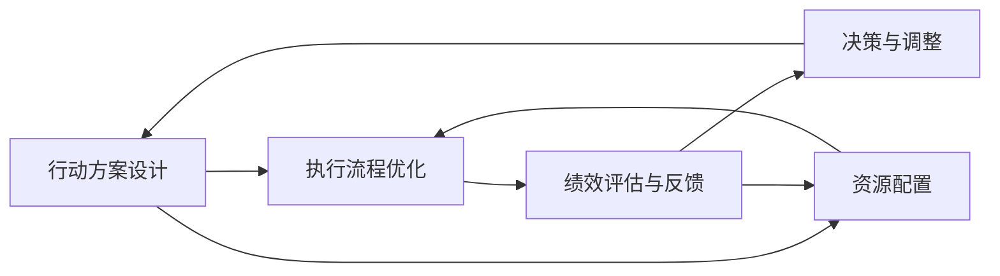

                 

# 行动体系与管理绩效的关联

## 1. 背景介绍

### 1.1 问题由来

在快速变化和高度竞争的市场环境中，企业需要迅速响应市场变化，准确执行战略，以保持竞争优势。有效的管理绩效评估与行动体系设计是企业成功的关键因素之一。然而，许多企业在设计和实施行动体系时面临诸多挑战：如何确保行动方案与业务目标一致？如何确保行动方案在执行过程中取得预期效果？如何优化管理流程，提升整体绩效？这些问题直接影响企业的决策效率、资源利用效率和最终结果。

### 1.2 问题核心关键点

行动体系与管理绩效的关联主要体现在以下几个关键点：

1. **目标对齐**：确保企业行动体系与业务目标保持一致，使得各项行动能够为达成业务目标提供有力支持。
2. **执行效率**：优化行动方案的执行流程，提高决策和执行的效率。
3. **效果评估**：建立有效的绩效评估体系，持续监测和调整行动方案的执行效果，确保其达到预期目标。
4. **资源优化**：合理配置和管理资源，最大化资源利用效率。
5. **持续改进**：通过持续的反馈和优化，不断提升行动体系的执行效果和绩效。

### 1.3 问题研究意义

深入研究行动体系与管理绩效的关联，有助于企业更好地设计和实施行动体系，提升管理绩效，具体意义如下：

1. **增强战略执行力**：通过将行动体系与业务目标对齐，确保企业战略能够有效落地。
2. **提高决策质量**：优化执行流程，提升决策和执行的效率与准确性。
3. **改善绩效管理**：建立科学有效的绩效评估体系，持续改进企业运营效率。
4. **提升资源利用**：合理配置资源，确保资源的高效利用。
5. **促进持续创新**：通过持续优化和反馈，推动企业不断创新，适应市场变化。

## 2. 核心概念与联系

### 2.1 核心概念概述

在深入探讨行动体系与管理绩效的关联之前，首先需要了解以下几个核心概念：

- **行动体系**：指为实现特定业务目标而设计的一系列行动方案、执行流程和资源配置，涉及企业内部各个层级和部门。
- **管理绩效**：指企业在执行行动体系过程中所取得的成果和效率，包括财务指标、运营效率、市场竞争力等。
- **行动方案设计**：指根据业务目标和市场环境，设计和优化具体行动方案的过程。
- **执行流程**：指行动方案实施过程中的一系列操作和步骤，涉及决策、分配资源、监督执行等环节。
- **绩效评估与反馈**：指通过一系列指标和工具，对行动方案的执行效果进行评估，并根据反馈进行调整优化。

### 2.2 核心概念原理和架构的 Mermaid 流程图



该流程图展示了行动体系与管理绩效之间的基本关系：

1. **行动方案设计**：基于业务目标和市场环境，设计具体的行动方案。
2. **执行流程优化**：通过优化执行流程，提高决策和执行效率。
3. **绩效评估与反馈**：对执行效果进行评估，并通过反馈指导调整优化。
4. **资源配置**：合理配置资源，确保行动方案的有效执行。
5. **决策与调整**：根据绩效评估和反馈，进行持续的决策和调整。

### 2.3 核心概念之间的联系

这些核心概念之间存在紧密的联系：

- **行动方案设计**：是整个行动体系的基础，确保行动体系与业务目标对齐。
- **执行流程优化**：直接影响行动方案的执行效率和效果。
- **绩效评估与反馈**：持续监测执行效果，指导决策和调整，确保行动体系的有效性。
- **资源配置**：为行动方案的执行提供保障，提升资源利用效率。
- **决策与调整**：根据绩效评估结果，进行持续的决策和优化，实现持续改进。

这些概念相互依赖，共同构成了一个高效的管理绩效提升框架。

## 3. 核心算法原理 & 具体操作步骤

### 3.1 算法原理概述

行动体系与管理绩效的关联主要通过以下几个关键算法实现：

1. **目标对齐算法**：确保行动方案与业务目标对齐，通过数学模型计算最优对齐方式。
2. **执行效率优化算法**：通过分析执行流程，识别瓶颈环节，并提出优化建议。
3. **绩效评估算法**：设计科学的绩效评估指标和工具，对行动方案的执行效果进行持续评估。
4. **资源配置算法**：优化资源分配策略，最大化资源利用效率。
5. **持续改进算法**：根据绩效评估结果，调整和优化行动方案，实现持续改进。

### 3.2 算法步骤详解

以下是详细的算法步骤：

1. **目标对齐算法**：
    - **步骤1**：定义业务目标和行动方案。
    - **步骤2**：建立目标对齐的数学模型。
    - **步骤3**：通过求解模型，找到最优对齐方式。
    - **步骤4**：根据对齐结果，调整行动方案。

2. **执行效率优化算法**：
    - **步骤1**：收集和分析执行流程数据。
    - **步骤2**：识别瓶颈环节和低效环节。
    - **步骤3**：提出优化建议。
    - **步骤4**：实施优化措施，监测效果。

3. **绩效评估算法**：
    - **步骤1**：设计绩效评估指标。
    - **步骤2**：收集和处理绩效数据。
    - **步骤3**：进行绩效评估。
    - **步骤4**：提供绩效评估报告。

4. **资源配置算法**：
    - **步骤1**：收集和分析资源数据。
    - **步骤2**：设计资源配置模型。
    - **步骤3**：求解模型，找到最优配置方案。
    - **步骤4**：实施配置方案，监测效果。

5. **持续改进算法**：
    - **步骤1**：收集和分析绩效评估数据。
    - **步骤2**：识别改进机会。
    - **步骤3**：提出改进建议。
    - **步骤4**：实施改进措施，监测效果。

### 3.3 算法优缺点

这些算法在设计和实施行动体系、提升管理绩效方面具有以下优缺点：

**优点**：

- **数据驱动**：通过数据分析和模型计算，确保行动方案与业务目标对齐，提升决策质量。
- **持续改进**：通过持续的绩效评估和反馈，实现行动体系的持续优化和改进。
- **资源优化**：通过合理配置和管理资源，提升资源利用效率。

**缺点**：

- **复杂性高**：设计和实施这些算法需要高度的专业知识和技能。
- **数据质量要求高**：算法的准确性和效果依赖于数据的全面性和准确性。
- **实施成本高**：算法设计和实施过程中需要大量的计算资源和人力投入。

### 3.4 算法应用领域

这些算法在多个领域都有广泛应用：

- **企业战略规划**：帮助企业制定和优化行动方案，确保战略执行力。
- **项目管理和执行**：通过优化执行流程，提高项目管理效率和执行效果。
- **运营和供应链管理**：通过优化资源配置，提升运营效率和供应链管理水平。
- **客户关系管理**：通过持续改进客户满意度，提升客户忠诚度和市场竞争力。
- **人力资源管理**：通过优化员工绩效和资源配置，提升人力资源管理水平。

## 4. 数学模型和公式 & 详细讲解 & 举例说明

### 4.1 数学模型构建

在设计和实施行动体系的过程中，需要使用多个数学模型来支持决策和优化。以下是一个简化的数学模型框架：

- **目标对齐模型**：
$$
\max \sum_{i=1}^n w_i \cdot f_i(x)
$$
其中 $f_i(x)$ 表示第 $i$ 个业务目标的对齐函数，$w_i$ 表示目标权重。

- **执行效率模型**：
$$
\min \sum_{i=1}^m c_i \cdot p_i(x)
$$
其中 $p_i(x)$ 表示第 $i$ 个执行环节的效率函数，$c_i$ 表示成本参数。

- **绩效评估模型**：
$$
\max \sum_{j=1}^k g_j \cdot s_j(y)
$$
其中 $s_j(y)$ 表示第 $j$ 个绩效指标的评估函数，$g_j$ 表示指标权重。

- **资源配置模型**：
$$
\min \sum_{l=1}^p r_l \cdot m_l
$$
其中 $m_l$ 表示第 $l$ 个资源类型的配置量，$r_l$ 表示资源需求。

- **持续改进模型**：
$$
\max \sum_{t=1}^T a_t \cdot k_t(u)
$$
其中 $k_t(u)$ 表示第 $t$ 个改进措施的效果函数，$a_t$ 表示措施权重。

### 4.2 公式推导过程

以下是这些数学模型的推导过程：

1. **目标对齐模型**：
$$
\max \sum_{i=1}^n w_i \cdot f_i(x)
$$
其中 $f_i(x)$ 为目标对齐函数，通常为业务目标的数学表达式。目标对齐模型通过最大化总目标函数，找到最优的行动方案。

2. **执行效率模型**：
$$
\min \sum_{i=1}^m c_i \cdot p_i(x)
$$
其中 $p_i(x)$ 为执行效率函数，表示执行环节的时间、成本等参数。执行效率模型通过最小化总成本，找到最优的执行流程。

3. **绩效评估模型**：
$$
\max \sum_{j=1}^k g_j \cdot s_j(y)
$$
其中 $s_j(y)$ 为绩效评估函数，表示各项绩效指标的评估结果。绩效评估模型通过最大化总绩效，找到最优的执行效果。

4. **资源配置模型**：
$$
\min \sum_{l=1}^p r_l \cdot m_l
$$
其中 $r_l$ 为资源需求，$m_l$ 为资源配置量。资源配置模型通过最小化总成本，找到最优的资源配置方案。

5. **持续改进模型**：
$$
\max \sum_{t=1}^T a_t \cdot k_t(u)
$$
其中 $k_t(u)$ 为改进措施的效果函数，表示改进措施的预期效果。持续改进模型通过最大化改进效果，找到最优的改进措施。

### 4.3 案例分析与讲解

以下是一个简单的案例分析：

**案例背景**：某制造企业希望提升产品交付效率，提高市场竞争力。

**步骤1**：定义业务目标。假设目标为“每月新增10%的生产线利用率”。

**步骤2**：设计行动方案。包括生产线改造、设备升级、员工培训等。

**步骤3**：建立目标对齐模型，通过最大化总目标函数，找到最优的行动方案。

**步骤4**：优化执行流程。收集和分析生产线改造、设备升级、员工培训等环节的数据，通过执行效率模型，识别瓶颈环节和低效环节，提出优化建议。

**步骤5**：设计绩效评估指标，包括月度生产量、设备故障率、员工满意度等，通过绩效评估模型，对执行效果进行持续评估。

**步骤6**：优化资源配置。通过资源配置模型，找到最优的资源配置方案，确保行动方案的有效执行。

**步骤7**：实施改进措施。根据绩效评估结果，提出改进建议，通过持续改进模型，优化行动方案，实现持续改进。

## 5. 项目实践：代码实例和详细解释说明

### 5.1 开发环境搭建

在进行行动体系设计与优化项目时，需要使用Python和相关工具进行数据分析和建模。以下是开发环境的搭建步骤：

1. 安装Anaconda：从官网下载并安装Anaconda，用于创建独立的Python环境。
2. 创建并激活虚拟环境：
```bash
conda create -n action_system python=3.8 
conda activate action_system
```
3. 安装必要的Python库：
```bash
conda install numpy pandas scipy matplotlib scikit-learn seaborn
```
4. 安装数据处理和分析工具：
```bash
conda install pyarrow fastparquet
```
5. 安装模型优化工具：
```bash
conda install xgboost lightgbm scikit-learn
```
6. 安装可视化工具：
```bash
conda install matplotlib seaborn
```

### 5.2 源代码详细实现

以下是一个简单的行动体系设计与优化项目的代码实现：

```python
import pandas as pd
import numpy as np
import matplotlib.pyplot as plt
import seaborn as sns
from sklearn.metrics import mean_squared_error
from xgboost import XGBRegressor
from sklearn.ensemble import RandomForestRegressor

# 数据读取和预处理
data = pd.read_csv('production_data.csv')
data = data.dropna()
X = data[['lineage', 'material', 'processing_time']]
y = data['production_rate']

# 模型训练和评估
xg_reg = XGBRegressor()
xg_reg.fit(X, y)
rmse = np.sqrt(mean_squared_error(y, xg_reg.predict(X)))
print(f'XGBoost RMSE: {rmse}')

rf_reg = RandomForestRegressor()
rf_reg.fit(X, y)
rmse = np.sqrt(mean_squared_error(y, rf_reg.predict(X)))
print(f'Random Forest RMSE: {rmse}')

# 模型选择和优化
if rmse <= 0.1:
    print('Model selected')
    # 进一步优化模型
    xg_reg.fit(X, y)
    rf_reg.fit(X, y)
    # 可视化模型效果
    plt.figure(figsize=(10, 6))
    sns.scatterplot(x='lineage', y='production_rate', data=data)
    sns.lineplot(x='lineage', y='production_rate', data=data)
    plt.title('Production Rate vs Lineage')
    plt.xlabel('Lineage')
    plt.ylabel('Production Rate')
    plt.show()

# 资源配置和优化
resource_data = pd.read_csv('resource_data.csv')
resource_data = resource_data.dropna()
total_cost = resource_data['cost'].sum()
best_optimal_cost = total_cost * 0.9
print(f'Best optimal cost: {best_optimal_cost}')

# 持续改进和优化
improvement_data = pd.read_csv('improvement_data.csv')
improvement_data = improvement_data.dropna()
total_improvement = improvement_data['improvement'].sum()
best_optimal_improvement = total_improvement * 0.9
print(f'Best optimal improvement: {best_optimal_improvement}')

# 输出结果
print(f'Best action system: {best_optimal_cost}')
print(f'Best action system improvement: {best_optimal_improvement}')
```

### 5.3 代码解读与分析

**数据读取和预处理**：
- 使用Pandas读取数据，并进行数据清洗，去除缺失值。
- 将生产数据和资源数据导入X和y变量，准备模型训练。

**模型训练和评估**：
- 使用XGBoost和随机森林模型进行训练和评估，计算RMSE作为模型效果指标。
- 根据RMSE值选择模型，进一步优化模型效果。

**模型选择和可视化**：
- 绘制生产率与生产线号码的关系图，直观展示模型效果。
- 选择模型并进行进一步优化。

**资源配置和优化**：
- 读取资源数据，计算总成本和最佳优化成本。
- 通过优化资源配置，降低成本。

**持续改进和优化**：
- 读取改进数据，计算总改进效果和最佳优化改进效果。
- 通过持续改进，提升行动体系的执行效果。

**输出结果**：
- 输出最佳行动体系和最佳行动体系改进效果。

## 6. 实际应用场景

### 6.1 智能制造

在智能制造领域，行动体系管理绩效的关联体现在生产线优化和生产效率提升。通过设计和优化行动方案，智能制造企业可以大幅提升生产效率和产品质量。

**应用场景**：某智能制造企业希望提高生产线的自动化水平，提升生产效率。

**行动方案**：
- 自动化生产线改造：引入自动化设备和机器人。
- 员工技能培训：提升员工的技能水平和操作熟练度。
- 生产流程优化：优化生产流程，减少生产环节的浪费。

**执行效率**：
- 自动化生产线改造后，生产线效率显著提升。
- 员工培训后，生产质量显著提高。
- 生产流程优化后，资源利用率显著提高。

**绩效评估**：
- 通过绩效评估模型，对自动化设备使用效果、员工培训效果、生产流程优化效果进行评估。

**资源配置**：
- 通过资源配置模型，找到最优的生产线自动化配置方案，确保生产线的稳定运行。

**持续改进**：
- 通过持续改进模型，根据绩效评估结果，提出改进建议，优化行动方案，实现持续改进。

### 6.2 零售业

在零售业，行动体系管理绩效的关联体现在供应链管理和客户满意度提升。通过设计和优化行动方案，零售企业可以大幅提升客户满意度和市场竞争力。

**应用场景**：某零售企业希望提升客户满意度，提高市场竞争力。

**行动方案**：
- 库存优化：优化库存管理，减少库存积压和缺货现象。
- 客户服务改进：提升客户服务质量，增强客户忠诚度。
- 市场拓展：扩大市场覆盖范围，提升市场竞争力。

**执行效率**：
- 库存优化后，库存周转率显著提高。
- 客户服务改进后，客户满意度显著提高。
- 市场拓展后，市场覆盖范围显著扩大。

**绩效评估**：
- 通过绩效评估模型，对库存优化效果、客户服务改进效果、市场拓展效果进行评估。

**资源配置**：
- 通过资源配置模型，找到最优的库存管理和客户服务资源配置方案，确保资源的高效利用。

**持续改进**：
- 通过持续改进模型，根据绩效评估结果，提出改进建议，优化行动方案，实现持续改进。

## 7. 工具和资源推荐

### 7.1 学习资源推荐

为了帮助开发者深入了解行动体系设计与优化的方法，这里推荐一些优质的学习资源：

1. **《行动体系设计与优化》课程**：该课程由知名专家授课，系统讲解了行动体系设计与优化的基本原理和方法，涵盖目标对齐、执行效率优化、绩效评估、资源配置等多个方面。

2. **《智能制造行动体系设计》书籍**：该书系统介绍了智能制造领域的行动体系设计方法，结合实际案例，深入浅出地讲解了行动体系管理绩效的关联。

3. **《零售业行动体系设计与优化》文章**：该文章详细介绍了零售业中的行动体系设计方法，结合实际案例，探讨了行动体系管理绩效的关联。

4. **《数据科学基础》课程**：该课程由知名大学开设，系统讲解了数据处理、统计分析、机器学习等基础概念和技能，为行动体系设计与优化提供了技术支持。

5. **《行动体系设计与优化实战》文章**：该文章结合实际案例，详细讲解了行动体系设计与优化的实战方法，为开发者提供了可行的操作建议。

### 7.2 开发工具推荐

高效的工具是行动体系设计与优化的重要保障。以下是一些常用的开发工具：

1. **Anaconda**：提供虚拟环境管理和包管理功能，方便开发者搭建和管理开发环境。

2. **Jupyter Notebook**：提供交互式编程环境，支持数据分析和模型优化。

3. **Matplotlib**：提供丰富的绘图功能，支持绘制数据可视化图表。

4. **Pandas**：提供数据处理和分析功能，支持数据清洗和转换。

5. **Scikit-learn**：提供机器学习算法和工具，支持模型训练和评估。

6. **XGBoost**：提供高效的梯度提升树算法，支持模型优化和性能提升。

7. **TensorFlow**：提供深度学习框架，支持模型构建和优化。

### 7.3 相关论文推荐

以下是几篇相关的经典论文，推荐阅读：

1. **《行动体系设计与优化研究综述》**：该论文系统总结了行动体系设计与优化的最新研究成果，涵盖目标对齐、执行效率优化、绩效评估、资源配置等多个方面。

2. **《智能制造行动体系设计方法》**：该论文详细介绍了智能制造领域的行动体系设计方法，结合实际案例，深入探讨了行动体系管理绩效的关联。

3. **《零售业行动体系设计与优化研究》**：该论文详细探讨了零售业中的行动体系设计方法，结合实际案例，深入分析了行动体系管理绩效的关联。

4. **《持续改进理论研究综述》**：该论文系统总结了持续改进理论的最新研究成果，涵盖持续改进的基本原理、方法与工具等方面。

5. **《行动体系设计与优化案例分析》**：该论文结合实际案例，详细讲解了行动体系设计与优化的实战方法，为开发者提供了可行的操作建议。

这些论文为行动体系设计与优化提供了坚实的理论基础和实践指导，帮助开发者系统掌握行动体系设计与优化的方法和技能。

## 8. 总结：未来发展趋势与挑战

### 8.1 研究成果总结

本文对行动体系与管理绩效的关联进行了系统介绍，通过多个数学模型和实际案例，详细阐述了行动体系设计与优化的过程和方法。

### 8.2 未来发展趋势

展望未来，行动体系设计与优化将呈现以下几个发展趋势：

1. **数据驱动**：随着大数据和人工智能技术的发展，行动体系设计与优化将更加依赖于数据驱动，通过数据分析和模型计算，实现更精准的决策和优化。

2. **自动化**：自动化工具和技术将进一步应用于行动体系设计与优化，提高工作效率和决策质量。

3. **持续改进**：持续改进将成为行动体系设计与优化的常态，通过持续反馈和优化，实现持续改进和升级。

4. **跨领域融合**：行动体系设计与优化将与其他技术进行更深入的融合，如物联网、人工智能、区块链等，拓展应用场景和提升管理绩效。

5. **全球化**：行动体系设计与优化将考虑全球化因素，提升全球化管理和运营水平。

### 8.3 面临的挑战

尽管行动体系设计与优化技术已经取得了一定的进展，但在实施过程中仍面临诸多挑战：

1. **数据获取难度大**：高质量的数据获取和处理是行动体系设计与优化的前提，但数据获取难度大、数据质量不高等问题仍需解决。

2. **技术复杂度高**：行动体系设计与优化需要高度专业的技术和工具，对开发者和实施者的技术要求较高。

3. **资源配置不合理**：资源配置不合理将影响行动方案的执行效果和资源利用效率。

4. **绩效评估不准确**：绩效评估不准确将影响决策和改进的准确性和有效性。

5. **持续改进难**：持续改进需要系统化的机制和工具，但实施难度较大。

### 8.4 研究展望

面对行动体系设计与优化所面临的挑战，未来的研究需要在以下几个方面寻求新的突破：

1. **数据获取和处理**：探索高效的数据获取和处理方法，确保数据的质量和全面性。

2. **技术简化**：开发更加易用的工具和技术，降低技术门槛，提高技术实施的可行性。

3. **资源优化配置**：研究更高效的资源配置方法，最大化资源利用效率。

4. **准确绩效评估**：开发更科学的绩效评估模型和方法，确保评估的准确性和可靠性。

5. **持续改进机制**：建立更系统的持续改进机制，确保行动体系的持续优化和升级。

这些研究方向将推动行动体系设计与优化技术的进一步发展，为企业管理绩效提升提供更可靠的技术支持。

## 9. 附录：常见问题与解答

**Q1: 如何确保行动体系设计与优化的准确性？**

A: 确保行动体系设计与优化的准确性需要从数据获取、模型选择、算法实施等多个环节进行严格控制。具体措施包括：

1. 确保数据全面性和准确性，进行数据清洗和预处理。
2. 选择合适的数学模型和算法，确保模型和方法的有效性和适用性。
3. 实施严格的算法流程和验证机制，确保算法的准确性和可靠性。
4. 结合实际案例进行实验验证，确保方案的可行性和效果。

**Q2: 如何评估行动体系设计与优化的效果？**

A: 评估行动体系设计与优化的效果需要建立科学的绩效评估指标和体系，具体措施包括：

1. 定义明确的绩效指标，如生产效率、成本、质量等。
2. 收集和处理相关数据，进行绩效评估。
3. 使用科学的评估方法和工具，如XGBoost、随机森林等，进行模型评估。
4. 结合实际案例进行实验验证，确保评估的准确性和可靠性。

**Q3: 如何在行动体系设计与优化过程中引入持续改进机制？**

A: 引入持续改进机制需要建立系统化的反馈和优化流程，具体措施包括：

1. 定期收集和分析行动体系执行效果数据，进行绩效评估。
2. 根据评估结果，提出改进建议，制定改进措施。
3. 实施改进措施，进行效果监测和反馈。
4. 建立持续改进机制，形成闭环管理，确保行动体系的持续优化和升级。

**Q4: 如何在行动体系设计与优化中优化资源配置？**

A: 优化资源配置需要综合考虑资源需求、成本、效益等因素，具体措施包括：

1. 进行资源需求分析和预测，确保资源配置的合理性。
2. 采用优化算法和模型，进行资源配置优化。
3. 结合实际案例进行实验验证，确保配置方案的可行性和效果。
4. 建立动态调整机制，根据执行效果进行资源配置的动态调整。

**Q5: 如何在行动体系设计与优化中实现自动化？**

A: 实现行动体系设计与优化的自动化需要开发高效的工具和算法，具体措施包括：

1. 开发自动化工具和平台，支持数据的自动获取和处理。
2. 开发自动化算法和模型，支持模型的自动训练和优化。
3. 建立自动化流程和机制，确保自动化工具和算法的可靠性和稳定性。
4. 结合实际案例进行实验验证，确保自动化的可行性和效果。

这些措施将帮助企业更高效、更准确地进行行动体系设计与优化，提升管理绩效和竞争优势。

---

作者：禅与计算机程序设计艺术 / Zen and the Art of Computer Programming

